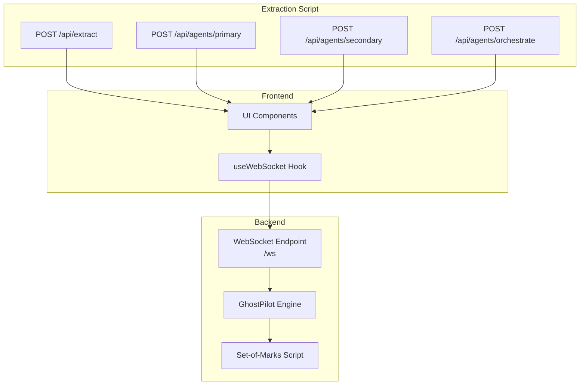
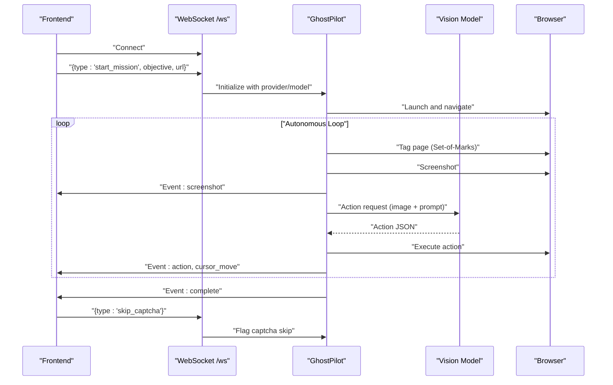
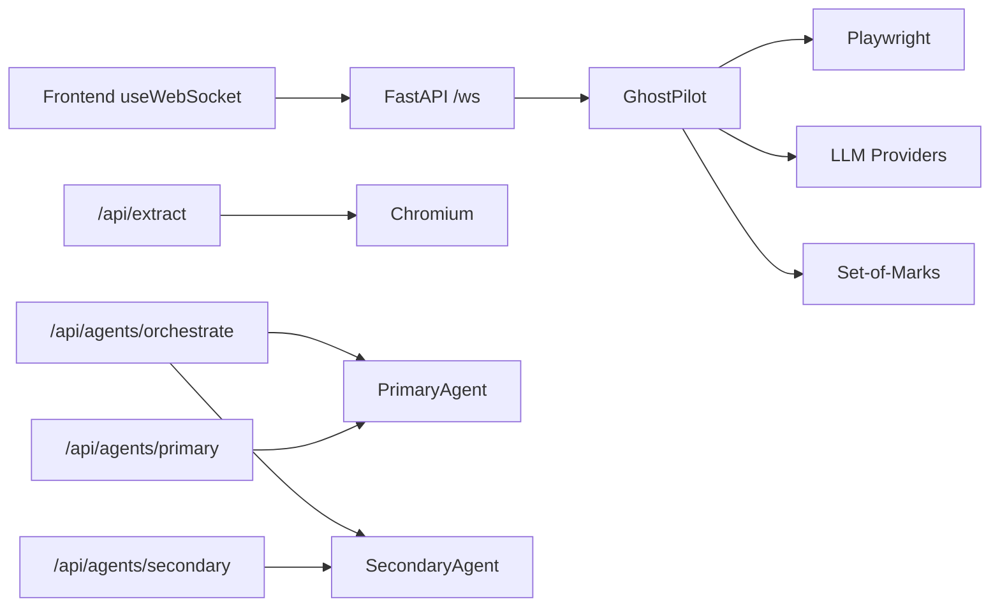

# API Reference

<cite>
**Referenced Files in This Document**
- [backend/main.py](file://backend/main.py)
- [backend/ghost_pilot.py](file://backend/ghost_pilot.py)
- [frontend/src/hooks/useWebSocket.ts](file://frontend/src/hooks/useWebSocket.ts)
- [backend/set_of_marks.js](file://backend/set_of_marks.js)
- [extraction-script/app/api/extract/route.ts](file://extraction-script/app/api/extract/route.ts)
- [extraction-script/app/api/agents/primary/route.ts](file://extraction-script/app/api/agents/primary/route.ts)
- [extraction-script/app/api/agents/secondary/route.ts](file://extraction-script/app/api/agents/secondary/route.ts)
- [extraction-script/app/api/agents/orchestrate/route.ts](file://extraction-script/app/api/agents/orchestrate/route.ts)
</cite>

## Table of Contents
1. [Introduction](#introduction)
2. [Project Structure](#project-structure)
3. [Core Components](#core-components)
4. [Architecture Overview](#architecture-overview)
5. [Detailed Component Analysis](#detailed-component-analysis)
6. [Dependency Analysis](#dependency-analysis)
7. [Performance Considerations](#performance-considerations)
8. [Troubleshooting Guide](#troubleshooting-guide)
9. [Conclusion](#conclusion)
10. [Appendices](#appendices)

## Introduction
This document provides comprehensive API documentation for the Ghost Pilot system. It covers:
- WebSocket API for real-time browser automation, including connection lifecycle, message types, and event flows
- RESTful APIs for agent orchestration and data extraction
- Message schemas, event types, and client implementation guidelines
- Rate limiting, error handling, and performance optimization strategies
- Backwards compatibility and debugging guidance

## Project Structure
The system comprises:
- A FastAPI backend exposing a WebSocket endpoint and several REST endpoints
- A React frontend using a reusable WebSocket hook
- An extraction service with dedicated REST endpoints
- Agent orchestration and processing endpoints

**Diagram sources**
- [backend/main.py](file://backend/main.py#L36-L157)
- [backend/ghost_pilot.py](file://backend/ghost_pilot.py#L18-L800)
- [backend/set_of_marks.js](file://backend/set_of_marks.js#L1-L229)
- [frontend/src/hooks/useWebSocket.ts](file://frontend/src/hooks/useWebSocket.ts#L1-L93)
- [extraction-script/app/api/extract/route.ts](file://extraction-script/app/api/extract/route.ts#L1-L157)
- [extraction-script/app/api/agents/primary/route.ts](file://extraction-script/app/api/agents/primary/route.ts#L1-L38)
- [extraction-script/app/api/agents/secondary/route.ts](file://extraction-script/app/api/agents/secondary/route.ts#L1-L39)
- [extraction-script/app/api/agents/orchestrate/route.ts](file://extraction-script/app/api/agents/orchestrate/route.ts#L1-L85)

**Section sources**
- [backend/main.py](file://backend/main.py#L1-L157)
- [backend/ghost_pilot.py](file://backend/ghost_pilot.py#L1-L800)
- [frontend/src/hooks/useWebSocket.ts](file://frontend/src/hooks/useWebSocket.ts#L1-L93)
- [backend/set_of_marks.js](file://backend/set_of_marks.js#L1-L229)
- [extraction-script/app/api/extract/route.ts](file://extraction-script/app/api/extract/route.ts#L1-L157)
- [extraction-script/app/api/agents/primary/route.ts](file://extraction-script/app/api/agents/primary/route.ts#L1-L38)
- [extraction-script/app/api/agents/secondary/route.ts](file://extraction-script/app/api/agents/secondary/route.ts#L1-L39)
- [extraction-script/app/api/agents/orchestrate/route.ts](file://extraction-script/app/api/agents/orchestrate/route.ts#L1-L85)

## Core Components
- WebSocket endpoint for autonomous browser automation
- GhostPilot engine implementing vision-driven navigation
- Extraction service for structured element discovery
- Agent orchestration and processing endpoints

Key capabilities:
- Real-time screenshot streaming and cursor movement events
- LLM-powered action selection with rate-limiting safeguards
- Captcha detection and manual skip capability
- Headless and interactive browser modes

**Section sources**
- [backend/main.py](file://backend/main.py#L36-L157)
- [backend/ghost_pilot.py](file://backend/ghost_pilot.py#L18-L800)
- [extraction-script/app/api/extract/route.ts](file://extraction-script/app/api/extract/route.ts#L1-L157)
- [extraction-script/app/api/agents/orchestrate/route.ts](file://extraction-script/app/api/agents/orchestrate/route.ts#L1-L85)

## Architecture Overview
The system integrates a WebSocket-based real-time loop with REST endpoints for agent orchestration and extraction.

**Diagram sources**
- [backend/main.py](file://backend/main.py#L36-L157)
- [backend/ghost_pilot.py](file://backend/ghost_pilot.py#L623-L768)
- [backend/set_of_marks.js](file://backend/set_of_marks.js#L1-L229)
- [frontend/src/hooks/useWebSocket.ts](file://frontend/src/hooks/useWebSocket.ts#L1-L93)

## Detailed Component Analysis

### WebSocket API (/ws)
Real-time communication channel for autonomous browsing.

- Endpoint: ws://<host>/ws
- Transport: WebSocket
- Authentication: None (configure origin policy in production)
- Reconnection: Frontend auto-reconnects after 3 seconds

Connection lifecycle:
- Connect → Send start_mission → Receive status/screenshot/thinking/captcha events → Receive complete/error → Optional skip_captcha

Message types (client → server):
- start_mission
  - Fields: objective (string), url (string, optional)
  - Behavior: Initializes GhostPilot with selected provider and model, runs mission loop, sends periodic status updates
- skip_captcha
  - Fields: none
  - Behavior: Sets internal flag to skip waiting for captcha resolution

Message types (server → client):
- status
  - Fields: message (string)
- screenshot
  - Fields: screenshot (base64 PNG)
- thinking
  - Fields: thinking (boolean)
- captcha_detected
  - Fields: message (string)
- captcha_solved
  - Fields: message (string)
- action
  - Fields: action_type (string), data (object)
  - Additional: x, y (numbers) when applicable
- cursor_move
  - Fields: x, y (numbers)
- complete
  - Fields: message (string)
- error
  - Fields: error (string)

Provider configuration:
- Supported providers: lmstudio, openai, gemini, openrouter, custom
- Environment variables:
  - LLM_PROVIDER
  - LM_STUDIO_BASE_URL, LM_STUDIO_MODEL
  - OPENAI_API_KEY, OPENAI_BASE_URL, OPENAI_MODEL
  - GEMINI_API_KEY, GEMINI_MODEL
  - OPENROUTER_API_KEY, OPENROUTER_MODEL

Rate limiting:
- Free-tier providers (Gemini/OpenRouter) enforce RPM and daily quotas
- Automatic backoff and Retry-After honoring

Captcha handling:
- Detection of visible captcha frames and challenge text
- Manual skip via skip_captcha message

Cleanup:
- Browser kept open by default after mission completion/disconnect

**Section sources**
- [backend/main.py](file://backend/main.py#L36-L157)
- [backend/ghost_pilot.py](file://backend/ghost_pilot.py#L18-L800)
- [frontend/src/hooks/useWebSocket.ts](file://frontend/src/hooks/useWebSocket.ts#L1-L93)
- [backend/set_of_marks.js](file://backend/set_of_marks.js#L1-L229)

### REST API: Extraction Service
Endpoint: POST /api/extract

Purpose:
- Extract interactive elements from a given URL and return structured metadata

Request body:
- url (string, required)
- headless (boolean, optional, defaults to true)

Response:
- meta: { source_url, timestamp }
- elements: array of extracted elements with:
  - type: BUTTON | LINK | INPUT | TEXT
  - content: { text, placeholder }
  - selectors: { css, xpath, id }
  - attributes: { href, src, name }
  - geometry: { x, y }

Error handling:
- Returns 400 if url is missing
- Returns 500 on extraction failure with error message

**Section sources**
- [extraction-script/app/api/extract/route.ts](file://extraction-script/app/api/extract/route.ts#L1-L157)

### REST API: Agent Orchestration
Endpoint: POST /api/agents/orchestrate

Purpose:
- End-to-end orchestration: PrimaryAgent recognizes intent and clarifies if needed, then SecondaryAgent executes instructions

Request body:
- userInput (string, required)
- primaryConfig (object, optional)
- secondaryConfig (object, optional)

Response:
- success (boolean)
- requiresClarification (boolean, optional)
- data:
  - recognizedIntent (string)
  - instructions (array, optional)
  - executionResults (array)
  - finalContext (object)
  - message (string)
  - errors (array, optional)

Error handling:
- Returns 400 if userInput is missing or invalid
- Returns 500 on orchestration failure

**Section sources**
- [extraction-script/app/api/agents/orchestrate/route.ts](file://extraction-script/app/api/agents/orchestrate/route.ts#L1-L85)

### REST API: Primary Agent
Endpoint: POST /api/agents/primary

Purpose:
- Process user input and generate structured instructions

Request body:
- userInput (string, required)
- currentContext (object, optional)
- config (object, optional)

Response:
- success (boolean)
- data: result from PrimaryAgent.processUserInput

Error handling:
- Returns 400 if userInput is missing or invalid
- Returns 500 on processing failure

**Section sources**
- [extraction-script/app/api/agents/primary/route.ts](file://extraction-script/app/api/agents/primary/route.ts#L1-L38)

### REST API: Secondary Agent
Endpoint: POST /api/agents/secondary

Purpose:
- Execute instructions and return results

Request body:
- instructions (array, required)
- config (object, optional)

Response:
- success (boolean)
- data: result from SecondaryAgent.executeInstructions

Error handling:
- Returns 400 if instructions are missing or invalid
- Returns 500 on execution failure

**Section sources**
- [extraction-script/app/api/agents/secondary/route.ts](file://extraction-script/app/api/agents/secondary/route.ts#L1-L39)

### Frontend WebSocket Hook
Hook: useWebSocket(url)

Capabilities:
- Connects to WebSocket, tracks connection state and last message
- Provides sendMessage, disconnect, and reconnect helpers
- Auto-reconnects on close with 3-second delay

Message interface:
- type: screenshot | cursor_move | action | thinking | status | complete | error
- data, screenshot, x, y, action_type, thinking, message, error

**Section sources**
- [frontend/src/hooks/useWebSocket.ts](file://frontend/src/hooks/useWebSocket.ts#L1-L93)

### Set-of-Marks Overlay Script
Role:
- Injects yellow-numbered tags over visible interactive elements
- Returns element map and viewport info for targeting

Behavior:
- Removes existing tags
- Selects interactive elements by attributes and roles
- Computes visibility and center coordinates
- Generates unique CSS selectors for each element
- Returns serializable map and viewport metrics

**Section sources**
- [backend/set_of_marks.js](file://backend/set_of_marks.js#L1-L229)
- [backend/ghost_pilot.py](file://backend/ghost_pilot.py#L148-L157)

## Dependency Analysis
High-level dependencies:
- WebSocket endpoint depends on GhostPilot engine
- GhostPilot engine depends on Playwright and external LLM providers
- Extraction service depends on Chromium via Playwright
- Agent orchestration endpoints depend on PrimaryAgent and SecondaryAgent

**Diagram sources**
- [backend/main.py](file://backend/main.py#L36-L157)
- [backend/ghost_pilot.py](file://backend/ghost_pilot.py#L18-L800)
- [backend/set_of_marks.js](file://backend/set_of_marks.js#L1-L229)
- [extraction-script/app/api/extract/route.ts](file://extraction-script/app/api/extract/route.ts#L1-L157)
- [extraction-script/app/api/agents/orchestrate/route.ts](file://extraction-script/app/api/agents/orchestrate/route.ts#L1-L85)
- [extraction-script/app/api/agents/primary/route.ts](file://extraction-script/app/api/agents/primary/route.ts#L1-L38)
- [extraction-script/app/api/agents/secondary/route.ts](file://extraction-script/app/api/agents/secondary/route.ts#L1-L39)

**Section sources**
- [backend/main.py](file://backend/main.py#L36-L157)
- [backend/ghost_pilot.py](file://backend/ghost_pilot.py#L18-L800)
- [extraction-script/app/api/extract/route.ts](file://extraction-script/app/api/extract/route.ts#L1-L157)
- [extraction-script/app/api/agents/orchestrate/route.ts](file://extraction-script/app/api/agents/orchestrate/route.ts#L1-L85)
- [extraction-script/app/api/agents/primary/route.ts](file://extraction-script/app/api/agents/primary/route.ts#L1-L38)
- [extraction-script/app/api/agents/secondary/route.ts](file://extraction-script/app/api/agents/secondary/route.ts#L1-L39)

## Performance Considerations
- Rate limiting
  - Gemini: ~10 RPM, ~250 RPD
  - OpenRouter: ~20 RPM, ~50 RPD
  - Automatic enforcement with backoff and Retry-After honoring
- Screenshot frequency
  - Limit screenshots to necessary steps to reduce bandwidth and latency
- Headless vs. interactive mode
  - Use headless for speed; interactive mode for debugging
- Network timeouts
  - Extraction sets a default timeout; adjust as needed for slow sites
- Cursor rendering
  - Frontend should debounce cursor_move events to avoid excessive repaints

[No sources needed since this section provides general guidance]

## Troubleshooting Guide
Common issues and resolutions:
- WebSocket disconnects
  - Frontend auto-reconnects; verify server availability and network stability
- Rate limit errors
  - Reduce concurrent sessions; leverage backoff; consider switching providers
- Captcha stalls
  - Use skip_captcha to bypass waiting; ensure captcha is truly resolved
- Missing or invisible elements
  - Confirm page readiness; allow DOM to settle; verify Set-of-Marks visibility
- LLM parsing failures
  - Ensure provider returns valid JSON; check provider configuration and credentials

Monitoring:
- Server logs for mission lifecycle and errors
- Frontend logs for WebSocket events and reconnections
- Extraction service error responses for debugging

Backwards compatibility:
- Provider configuration supports multiple backends; maintain environment parity
- Message types evolve gradually; clients should handle unknown fields gracefully

**Section sources**
- [backend/main.py](file://backend/main.py#L138-L152)
- [backend/ghost_pilot.py](file://backend/ghost_pilot.py#L181-L231)
- [extraction-script/app/api/extract/route.ts](file://extraction-script/app/api/extract/route.ts#L151-L156)

## Conclusion
The Ghost Pilot system exposes a robust WebSocket API for autonomous browser automation and complementary REST endpoints for agent orchestration and data extraction. By adhering to the documented message formats, rate-limiting strategies, and client implementation guidelines, developers can build reliable, real-time browser automation experiences.

[No sources needed since this section summarizes without analyzing specific files]

## Appendices

### WebSocket Message Types Reference
Client → Server:
- start_mission: objective, url
- skip_captcha: none

Server → Client:
- status: message
- screenshot: screenshot (base64)
- thinking: boolean
- captcha_detected: message
- captcha_solved: message
- action: action_type, data (+x,y when applicable)
- cursor_move: x, y
- complete: message
- error: error

**Section sources**
- [backend/main.py](file://backend/main.py#L49-L137)
- [backend/ghost_pilot.py](file://backend/ghost_pilot.py#L654-L743)
- [frontend/src/hooks/useWebSocket.ts](file://frontend/src/hooks/useWebSocket.ts#L3-L13)

### REST Endpoints Reference
- POST /api/extract
  - Request: { url, headless }
  - Response: { meta, elements[] }
- POST /api/agents/orchestrate
  - Request: { userInput, primaryConfig, secondaryConfig }
  - Response: { success, requiresClarification?, data }
- POST /api/agents/primary
  - Request: { userInput, currentContext, config }
  - Response: { success, data }
- POST /api/agents/secondary
  - Request: { instructions, config }
  - Response: { success, data }

**Section sources**
- [extraction-script/app/api/extract/route.ts](file://extraction-script/app/api/extract/route.ts#L14-L149)
- [extraction-script/app/api/agents/orchestrate/route.ts](file://extraction-script/app/api/agents/orchestrate/route.ts#L8-L82)
- [extraction-script/app/api/agents/primary/route.ts](file://extraction-script/app/api/agents/primary/route.ts#L7-L36)
- [extraction-script/app/api/agents/secondary/route.ts](file://extraction-script/app/api/agents/secondary/route.ts#L8-L37)