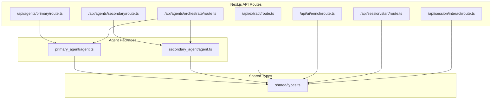
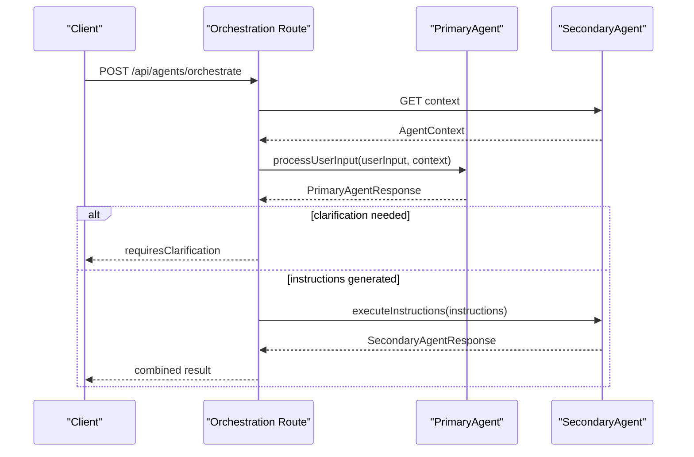
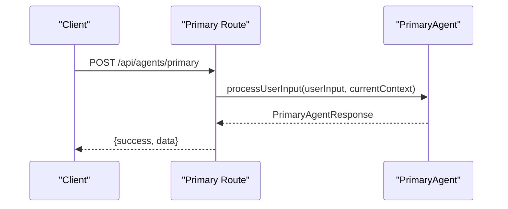
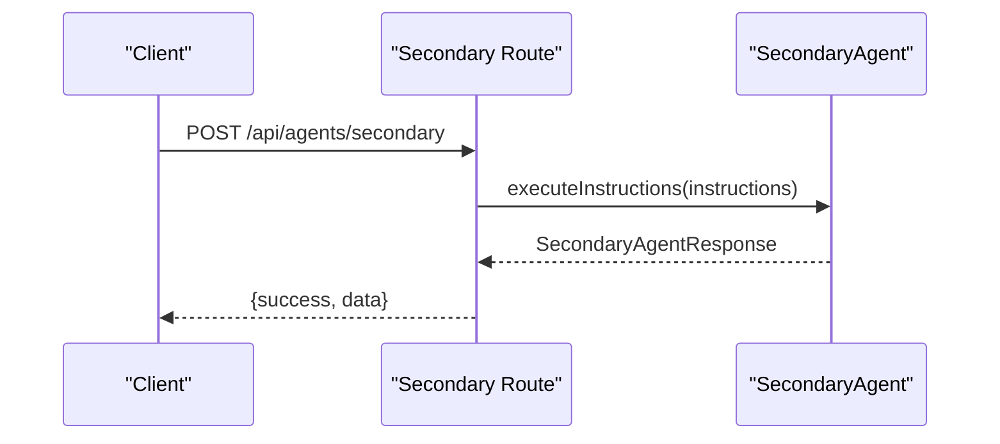
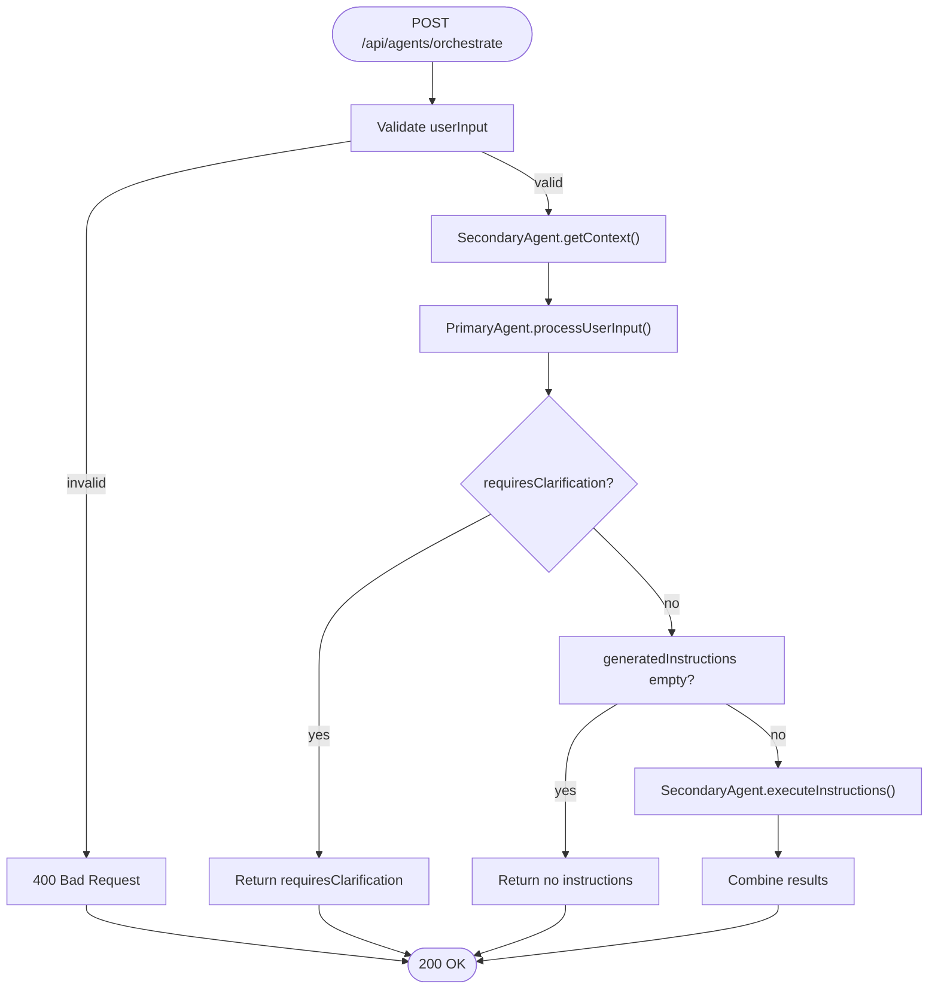
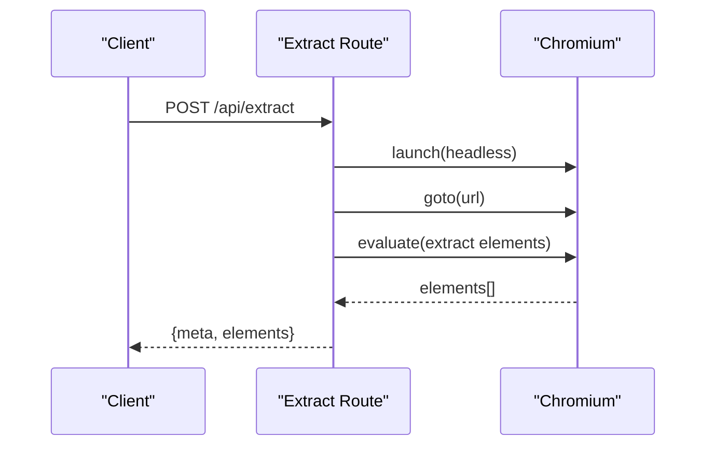
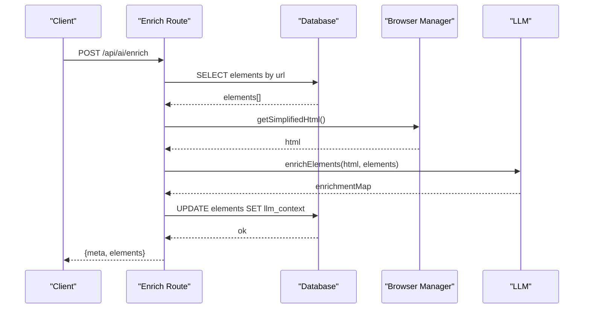
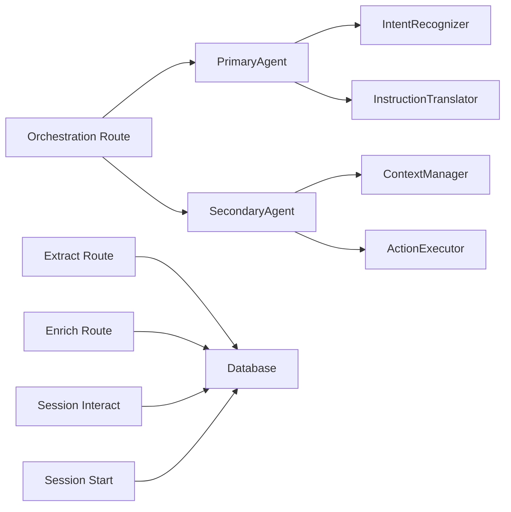

# Agent REST APIs

<cite>
**Referenced Files in This Document**
- [route.ts](file://extraction-script/app/api/agents/primary/route.ts)
- [route.ts](file://extraction-script/app/api/agents/secondary/route.ts)
- [route.ts](file://extraction-script/app/api/agents/orchestrate/route.ts)
- [agent.ts](file://primary_agent/agent.ts)
- [agent.ts](file://secondary_agent/agent.ts)
- [types.ts](file://shared/types.ts)
- [route.ts](file://extraction-script/app/api/extract/route.ts)
- [route.ts](file://extraction-script/app/api/ai/enrich/route.ts)
- [route.ts](file://extraction-script/app/api/session/start/route.ts)
- [route.ts](file://extraction-script/app/api/session/interact/route.ts)
</cite>

## Table of Contents
1. [Introduction](#introduction)
2. [Project Structure](#project-structure)
3. [Core Components](#core-components)
4. [Architecture Overview](#architecture-overview)
5. [Detailed Component Analysis](#detailed-component-analysis)
6. [Dependency Analysis](#dependency-analysis)
7. [Performance Considerations](#performance-considerations)
8. [Troubleshooting Guide](#troubleshooting-guide)
9. [Conclusion](#conclusion)

## Introduction
This document provides comprehensive REST API documentation for the Ghost Pilot agent system. It covers:
- Primary agent API endpoints for intent recognition and instruction generation
- Secondary agent API endpoints for action command processing and context retrieval
- Agent orchestration endpoint for end-to-end execution
- Extraction script endpoints for data processing and analysis
- Session management endpoints for interactive page interaction

Each endpoint’s HTTP method, URL pattern, request/response schemas, parameter requirements, and error handling are documented. Integration patterns, agent coordination, context sharing, and operational guidance are included.

## Project Structure
The API surface is implemented in a Next.js-based extraction-script application under the app/api directory. Agents are implemented in dedicated packages under primary_agent and secondary_agent, with shared types defined centrally.

**Diagram sources**
- [route.ts](file://extraction-script/app/api/agents/primary/route.ts#L1-L38)
- [route.ts](file://extraction-script/app/api/agents/secondary/route.ts#L1-L39)
- [route.ts](file://extraction-script/app/api/agents/orchestrate/route.ts#L1-L85)
- [agent.ts](file://primary_agent/agent.ts#L1-L106)
- [agent.ts](file://secondary_agent/agent.ts#L1-L119)
- [types.ts](file://shared/types.ts#L1-L85)
- [route.ts](file://extraction-script/app/api/extract/route.ts#L1-L157)
- [route.ts](file://extraction-script/app/api/ai/enrich/route.ts#L1-L105)
- [route.ts](file://extraction-script/app/api/session/start/route.ts#L1-L97)
- [route.ts](file://extraction-script/app/api/session/interact/route.ts#L1-L77)

**Section sources**
- [route.ts](file://extraction-script/app/api/agents/primary/route.ts#L1-L38)
- [route.ts](file://extraction-script/app/api/agents/secondary/route.ts#L1-L39)
- [route.ts](file://extraction-script/app/api/agents/orchestrate/route.ts#L1-L85)
- [agent.ts](file://primary_agent/agent.ts#L1-L106)
- [agent.ts](file://secondary_agent/agent.ts#L1-L119)
- [types.ts](file://shared/types.ts#L1-L85)

## Core Components
- Primary Agent API: Accepts user input and produces structured instructions for the secondary agent.
- Secondary Agent API: Executes instructions against the current page context.
- Orchestration API: Combines primary and secondary agents for end-to-end workflows.
- Extraction Script API: Scrapes and extracts actionable page elements.
- AI Enrichment API: Enhances extracted elements with LLM-derived context.
- Session Management APIs: Start sessions, maintain state, and apply interactions.

Authentication: No explicit authentication is enforced in the examined routes. Production deployments should add authentication and authorization layers.

Rate Limiting: Not implemented in the examined routes. Consider adding rate limiting at the ingress or per-route.

## Architecture Overview
The orchestration endpoint coordinates the primary agent (intent recognition and instruction translation) and the secondary agent (context-aware execution). Extraction and enrichment endpoints support data preparation and enhancement.

**Diagram sources**
- [route.ts](file://extraction-script/app/api/agents/orchestrate/route.ts#L8-L82)
- [agent.ts](file://primary_agent/agent.ts#L37-L89)
- [agent.ts](file://secondary_agent/agent.ts#L32-L109)

## Detailed Component Analysis

### Primary Agent API
- Method: POST
- URL: /api/agents/primary
- Purpose: Convert user input into executable instructions using intent recognition and instruction translation.
- Request body:
  - userInput: string (required)
  - currentContext: object with optional url and pageTitle
  - config: object with optional model, temperature, maxInstructions
- Response body:
  - success: boolean
  - data: PrimaryAgentResponse
- Error responses:
  - 400 Bad Request: missing or invalid userInput
  - 500 Internal Server Error: processing failure

**Diagram sources**
- [route.ts](file://extraction-script/app/api/agents/primary/route.ts#L7-L36)
- [agent.ts](file://primary_agent/agent.ts#L37-L89)

**Section sources**
- [route.ts](file://extraction-script/app/api/agents/primary/route.ts#L1-L38)
- [agent.ts](file://primary_agent/agent.ts#L1-L106)
- [types.ts](file://shared/types.ts#L63-L83)

### Secondary Agent API
- Method: POST
- URL: /api/agents/secondary
- Purpose: Execute a sequence of instructions against the current page context.
- Request body:
  - instructions: array of AgentInstruction (required)
  - config: object with optional model, temperature, maxRetries
- Response body:
  - success: boolean
  - data: SecondaryAgentResponse
- Error responses:
  - 400 Bad Request: missing or invalid instructions
  - 500 Internal Server Error: execution failure

**Diagram sources**
- [route.ts](file://extraction-script/app/api/agents/secondary/route.ts#L8-L37)
- [agent.ts](file://secondary_agent/agent.ts#L32-L109)

**Section sources**
- [route.ts](file://extraction-script/app/api/agents/secondary/route.ts#L1-L39)
- [agent.ts](file://secondary_agent/agent.ts#L1-L119)
- [types.ts](file://shared/types.ts#L3-L11)

### Orchestration API
- Method: POST
- URL: /api/agents/orchestrate
- Purpose: End-to-end flow: get context, recognize intent, translate to instructions, execute, and combine results.
- Request body:
  - userInput: string (required)
  - primaryConfig: object (optional)
  - secondaryConfig: object (optional)
- Response body:
  - success: boolean
  - data: combined result including recognizedIntent, instructions, executionResults, finalContext, message, errors
  - If clarification is needed: requiresClarification flag with clarificationQuestions
- Error responses:
  - 400 Bad Request: missing userInput
  - 500 Internal Server Error: orchestration failure

**Diagram sources**
- [route.ts](file://extraction-script/app/api/agents/orchestrate/route.ts#L8-L82)

**Section sources**
- [route.ts](file://extraction-script/app/api/agents/orchestrate/route.ts#L1-L85)
- [agent.ts](file://primary_agent/agent.ts#L37-L89)
- [agent.ts](file://secondary_agent/agent.ts#L32-L109)

### Extraction Script API
- Method: POST
- URL: /api/extract
- Purpose: Scrape a URL and extract actionable page elements with selectors and geometry.
- Request body:
  - url: string (required)
  - headless: boolean (optional, defaults to true)
- Response body:
  - meta: object with source_url and timestamp
  - elements: array of ExtractedElement
- Error responses:
  - 400 Bad Request: missing url
  - 500 Internal Server Error: extraction failure

**Diagram sources**
- [route.ts](file://extraction-script/app/api/extract/route.ts#L14-L156)

**Section sources**
- [route.ts](file://extraction-script/app/api/extract/route.ts#L1-L157)
- [types.ts](file://shared/types.ts#L21-L39)

### AI Enrichment API
- Method: POST
- URL: /api/ai/enrich
- Purpose: Enrich previously extracted elements with LLM-derived context and persist updates.
- Request body:
  - url: string (required)
- Response body:
  - meta: object with source_url and enriched flag
  - elements: array of stored elements with updated llm_context
- Error responses:
  - 400 Bad Request: missing url
  - 404 Not Found: no elements found to enrich
  - 500 Internal Server Error: enrichment failure

**Diagram sources**
- [route.ts](file://extraction-script/app/api/ai/enrich/route.ts#L7-L104)

**Section sources**
- [route.ts](file://extraction-script/app/api/ai/enrich/route.ts#L1-L105)

### Session Management APIs

#### Start Session
- Method: POST
- URL: /api/session/start
- Purpose: Initialize a browser session, optionally use cached data, and scrape page content.
- Request body:
  - url: string (required)
  - headless: boolean (optional)
  - forceRefresh: boolean (optional)
- Response body:
  - meta: object with source_url, cached flag, and timestamp
  - elements: array of extracted elements
- Error responses:
  - 400 Bad Request: missing url
  - 500 Internal Server Error: session start failure

**Section sources**
- [route.ts](file://extraction-script/app/api/session/start/route.ts#L1-L97)

#### Interact
- Method: POST
- URL: /api/session/interact
- Purpose: Perform an action (click/fill) on a selector, refresh page content, and update database.
- Request body:
  - selector: string (required)
  - action: "click" | "fill" (required)
  - value: string (optional, required for fill)
  - url: string (required for session recovery)
- Response body:
  - meta: object with source_url, action, and timestamp
  - elements: array of updated elements
- Error responses:
  - 400 Bad Request: missing selector/action or invalid action
  - 500 Internal Server Error: interaction failure

**Section sources**
- [route.ts](file://extraction-script/app/api/session/interact/route.ts#L1-L77)

## Dependency Analysis
- Orchestration depends on both PrimaryAgent and SecondaryAgent.
- PrimaryAgent depends on IntentRecognizer and InstructionTranslator and maintains conversation history.
- SecondaryAgent depends on ContextManager and ActionExecutor and aggregates execution results.
- Extraction and enrichment rely on a browser automation library and a database for persistence.
- Session endpoints coordinate browser state and database updates.

**Diagram sources**
- [route.ts](file://extraction-script/app/api/agents/orchestrate/route.ts#L8-L82)
- [agent.ts](file://primary_agent/agent.ts#L9-L32)
- [agent.ts](file://secondary_agent/agent.ts#L9-L27)
- [route.ts](file://extraction-script/app/api/extract/route.ts#L1-L157)
- [route.ts](file://extraction-script/app/api/ai/enrich/route.ts#L1-L105)
- [route.ts](file://extraction-script/app/api/session/interact/route.ts#L1-L77)
- [route.ts](file://extraction-script/app/api/session/start/route.ts#L1-L97)

**Section sources**
- [route.ts](file://extraction-script/app/api/agents/orchestrate/route.ts#L1-L85)
- [agent.ts](file://primary_agent/agent.ts#L1-L106)
- [agent.ts](file://secondary_agent/agent.ts#L1-L119)

## Performance Considerations
- Browser automation overhead: Launching and navigating browsers is expensive; reuse sessions when possible and leverage caching.
- Database I/O: Batch inserts and upserts reduce round-trips; ensure proper indexing on page_url.
- Model latency: LLM calls can dominate response times; consider request batching and caching of enrichment results.
- Timeout tuning: Adjust default timeouts for navigation and evaluation to balance responsiveness and reliability.
- Concurrency: Limit concurrent browser instances to prevent resource exhaustion.

## Troubleshooting Guide
Common issues and resolutions:
- Missing or invalid input:
  - Primary/Secondary/Orchestration routes return 400 if required fields are absent.
- Browser session loss:
  - Session interact attempts recovery via URL; if still inactive, return 500.
- Extraction failures:
  - Verify URL accessibility and network conditions; adjust headless and timeout settings.
- Enrichment mismatches:
  - Ensure previous extraction occurred; confirm selector/id matching logic.
- Execution errors:
  - Secondary agent aggregates errors per instruction; inspect executionResults and errors arrays.

Operational tips:
- Monitor agent logs for stack traces and error messages.
- Validate request schemas before invoking agents.
- Implement circuit breakers for external services (LLM, browser).

**Section sources**
- [route.ts](file://extraction-script/app/api/agents/primary/route.ts#L11-L16)
- [route.ts](file://extraction-script/app/api/agents/secondary/route.ts#L12-L17)
- [route.ts](file://extraction-script/app/api/agents/orchestrate/route.ts#L12-L16)
- [route.ts](file://extraction-script/app/api/session/interact/route.ts#L13-L23)
- [route.ts](file://extraction-script/app/api/extract/route.ts#L19-L21)
- [route.ts](file://extraction-script/app/api/ai/enrich/route.ts#L29-L31)
- [agent.ts](file://secondary_agent/agent.ts#L64-L75)

## Conclusion
The Ghost Pilot agent system exposes a cohesive set of REST endpoints enabling intent-driven automation. The orchestration endpoint integrates primary and secondary agents, while extraction and enrichment endpoints prepare and enhance page data. Session endpoints manage browser state and persistence. For production readiness, add authentication, rate limiting, and observability, and tune performance-sensitive components like browser automation and LLM calls.