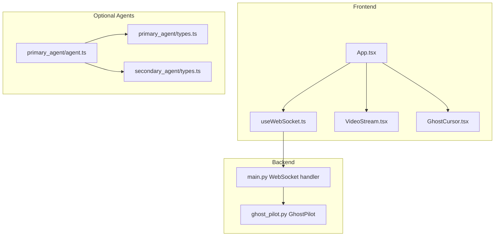
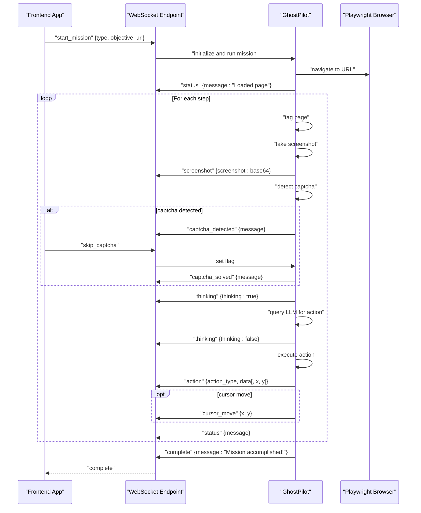
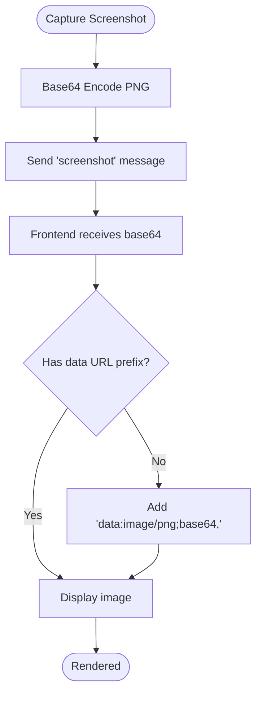
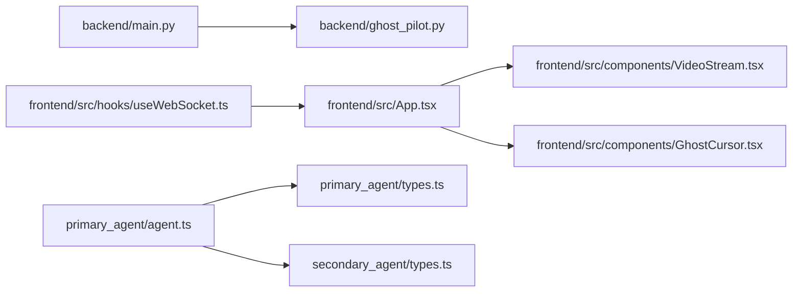

# Message Formats and Protocols

<cite>
**Referenced Files in This Document**
- [backend/main.py](file://backend/main.py)
- [backend/ghost_pilot.py](file://backend/ghost_pilot.py)
- [frontend/src/hooks/useWebSocket.ts](file://frontend/src/hooks/useWebSocket.ts)
- [frontend/src/App.tsx](file://frontend/src/App.tsx)
- [frontend/src/components/VideoStream.tsx](file://frontend/src/components/VideoStream.tsx)
- [frontend/src/components/GhostCursor.tsx](file://frontend/src/components/GhostCursor.tsx)
- [primary_agent/agent.ts](file://primary_agent/agent.ts)
- [primary_agent/types.ts](file://primary_agent/types.ts)
- [secondary_agent/types.ts](file://secondary_agent/types.ts)
</cite>

## Table of Contents
1. [Introduction](#introduction)
2. [Project Structure](#project-structure)
3. [Core Components](#core-components)
4. [Architecture Overview](#architecture-overview)
5. [Detailed Component Analysis](#detailed-component-analysis)
6. [Dependency Analysis](#dependency-analysis)
7. [Performance Considerations](#performance-considerations)
8. [Troubleshooting Guide](#troubleshooting-guide)
9. [Conclusion](#conclusion)
10. [Appendices](#appendices)

## Introduction
This document defines the standardized message formats and communication protocols used by the Ghost Pilot system. It covers the WebSocket message structure, the conversation message schema for intent recognition, the instruction format for action execution, the context message structure for page state sharing, the screenshot data transmission protocol, the cursor interaction protocol, error message formats, heartbeat and status mechanisms, progress notifications, JSON schema definitions, validation rules, protocol versioning, backward compatibility, evolution strategies, and debugging tools.

## Project Structure
The Ghost Pilot system comprises:
- A backend FastAPI WebSocket server that orchestrates autonomous browser sessions and streams UI-relevant telemetry.
- A frontend React application that renders the live browser view, cursor, and overlays, and communicates with the backend via WebSocket.
- Optional primary and secondary agents that operate outside the core WebSocket loop and use structured types for intent recognition and instruction execution.

**Diagram sources**
- [backend/main.py](file://backend/main.py#L36-L137)
- [backend/ghost_pilot.py](file://backend/ghost_pilot.py#L623-L768)
- [frontend/src/hooks/useWebSocket.ts](file://frontend/src/hooks/useWebSocket.ts#L15-L92)
- [frontend/src/App.tsx](file://frontend/src/App.tsx#L14-L360)
- [frontend/src/components/VideoStream.tsx](file://frontend/src/components/VideoStream.tsx#L8-L42)
- [frontend/src/components/GhostCursor.tsx](file://frontend/src/components/GhostCursor.tsx#L10-L98)
- [primary_agent/agent.ts](file://primary_agent/agent.ts#L9-L106)
- [primary_agent/types.ts](file://primary_agent/types.ts#L11-L31)
- [secondary_agent/types.ts](file://secondary_agent/types.ts#L11-L36)

**Section sources**
- [backend/main.py](file://backend/main.py#L1-L157)
- [backend/ghost_pilot.py](file://backend/ghost_pilot.py#L1-L802)
- [frontend/src/hooks/useWebSocket.ts](file://frontend/src/hooks/useWebSocket.ts#L1-L93)
- [frontend/src/App.tsx](file://frontend/src/App.tsx#L1-L360)
- [frontend/src/components/VideoStream.tsx](file://frontend/src/components/VideoStream.tsx#L1-L43)
- [frontend/src/components/GhostCursor.tsx](file://frontend/src/components/GhostCursor.tsx#L1-L99)
- [primary_agent/agent.ts](file://primary_agent/agent.ts#L1-L106)
- [primary_agent/types.ts](file://primary_agent/types.ts#L1-L32)
- [secondary_agent/types.ts](file://secondary_agent/types.ts#L1-L37)

## Core Components
- WebSocket message envelope: All messages are JSON objects with a mandatory type field and optional fields depending on the message category.
- Backend orchestration: The WebSocket endpoint accepts client commands and emits telemetry/status messages during autonomous missions.
- Frontend rendering: The React app listens for messages, renders the live screenshot, moves the virtual cursor, and provides status feedback.
- Optional agents: Structured types define intent recognition and instruction generation for higher-level orchestration.

Key responsibilities:
- Standardized message envelopes and field semantics
- Screenshot streaming with base64 encoding
- Cursor movement and click ripple effects
- Status, thinking, and completion notifications
- Error propagation and recovery hints
- Optional agent-side conversation and instruction schemas

**Section sources**
- [backend/main.py](file://backend/main.py#L36-L137)
- [backend/ghost_pilot.py](file://backend/ghost_pilot.py#L654-L753)
- [frontend/src/hooks/useWebSocket.ts](file://frontend/src/hooks/useWebSocket.ts#L3-L13)
- [frontend/src/App.tsx](file://frontend/src/App.tsx#L30-L123)
- [frontend/src/components/VideoStream.tsx](file://frontend/src/components/VideoStream.tsx#L8-L19)
- [frontend/src/components/GhostCursor.tsx](file://frontend/src/components/GhostCursor.tsx#L10-L25)

## Architecture Overview
The system uses a unidirectional telemetry flow from backend to frontend, with bidirectional control messages from frontend to backend.

**Diagram sources**
- [backend/main.py](file://backend/main.py#L49-L127)
- [backend/ghost_pilot.py](file://backend/ghost_pilot.py#L623-L768)
- [frontend/src/App.tsx](file://frontend/src/App.tsx#L161-L174)

## Detailed Component Analysis

### WebSocket Message Envelope
All messages are JSON objects with a type field indicating the semantic category. Optional fields vary by type.

Common fields:
- type: string, required
- timestamp: number or string (epoch or ISO), optional

Message categories and fields:
- start_mission: objective (string), url (string)
- skip_captcha: none
- screenshot: screenshot (string, base64 PNG)
- cursor_move: x (number), y (number)
- action: action_type (string), data (object), x (number), y (number)
- thinking: thinking (boolean)
- status: message (string)
- captcha_detected: message (string)
- captcha_solved: message (string)
- complete: message (string)
- error: error (string)

Validation rules:
- type must be one of the defined categories
- Numeric coordinates x,y must be finite numbers
- Base64 strings must decode to valid image bytes
- message strings must be non-empty for status/error

Timestamp handling:
- Not required by protocol; if included, clients should treat as opaque monotonic marker

**Section sources**
- [backend/main.py](file://backend/main.py#L49-L137)
- [backend/ghost_pilot.py](file://backend/ghost_pilot.py#L654-L753)
- [frontend/src/hooks/useWebSocket.ts](file://frontend/src/hooks/useWebSocket.ts#L3-L13)
- [frontend/src/App.tsx](file://frontend/src/App.tsx#L30-L123)

### Conversation Message Schema (Intent Recognition)
The primary agent maintains a conversation history for intent recognition. Messages are structured as role/content pairs.

Fields:
- role: "user" | "assistant"
- content: string

Behavior:
- History is appended on each processed input
- History is capped to maintain manageability

Validation rules:
- role must be one of the allowed values
- content must be a non-empty string

**Section sources**
- [primary_agent/agent.ts](file://primary_agent/agent.ts#L13-L13)
- [primary_agent/agent.ts](file://primary_agent/agent.ts#L67-L75)

### Instruction Format (Action Execution)
Secondary agent types define execution results and context analysis. These inform how instructions are represented and validated.

Fields:
- ExecutionResult: success (boolean), instructionId (string), action (string), result (any), error (string), newContext (partial context)
- ContextAnalysis: currentUrl (string), currentPageTitle (string), availableElements (array), relevantElements (array), dbElementCount (number), hasContext (boolean)

Validation rules:
- instructionId must be non-empty
- action must be a non-empty string
- success must be boolean
- newContext must be a partial context shape

**Section sources**
- [secondary_agent/types.ts](file://secondary_agent/types.ts#L11-L18)
- [secondary_agent/types.ts](file://secondary_agent/types.ts#L20-L27)

### Context Message Structure (Page State Sharing)
Context messages carry page state for downstream agents or UI.

Fields:
- currentUrl (string)
- currentPageTitle (string)
- availableElements (array of PageElement)
- relevantElements (array of PageElement)
- dbElementCount (number)
- hasContext (boolean)

Validation rules:
- URLs must be valid URIs
- Titles must be strings
- Element arrays must be arrays of objects with required identifiers
- Counts must be non-negative integers

**Section sources**
- [secondary_agent/types.ts](file://secondary_agent/types.ts#L20-L27)

### Screenshot Data Transmission Protocol
Backend captures screenshots and sends them as base64-encoded PNG images. Frontend renders the image using a data URL.

Transmission details:
- Encoding: base64 PNG
- Compression: PNG default
- Bandwidth optimization: Minimal overhead; consider reducing resolution or frequency if bandwidth constrained
- Validation: Frontend checks for data URL prefix or adds it when missing

**Diagram sources**
- [backend/ghost_pilot.py](file://backend/ghost_pilot.py#L232-L238)
- [backend/ghost_pilot.py](file://backend/ghost_pilot.py#L654-L657)
- [frontend/src/components/VideoStream.tsx](file://frontend/src/components/VideoStream.tsx#L8-L19)

**Section sources**
- [backend/ghost_pilot.py](file://backend/ghost_pilot.py#L232-L238)
- [backend/ghost_pilot.py](file://backend/ghost_pilot.py#L654-L657)
- [frontend/src/components/VideoStream.tsx](file://frontend/src/components/VideoStream.tsx#L8-L19)

### Cursor Interaction Protocol
Backend calculates cursor positions for clicks and sends cursor_move messages. Frontend animates a virtual cursor and ripple effects.

Message flow:
- Backend computes x,y from tag map or coordinates
- Emits "cursor_move" with x,y
- Frontend updates GhostCursor animation
- Click actions trigger a ripple effect

Validation rules:
- x,y must be finite numbers
- Animation expects numeric coordinates

**Section sources**
- [backend/ghost_pilot.py](file://backend/ghost_pilot.py#L737-L741)
- [frontend/src/App.tsx](file://frontend/src/App.tsx#L44-L48)
- [frontend/src/components/GhostCursor.tsx](file://frontend/src/components/GhostCursor.tsx#L10-L25)

### Error Message Format
Backend and frontend propagate errors consistently.

- Backend error propagation: "error" message with error string
- Frontend error handling: displays status and speaks error message

Fields:
- error: string

Validation rules:
- error must be a non-empty string
- Clients should avoid logging raw exceptions; sanitize for display

**Section sources**
- [backend/ghost_pilot.py](file://backend/ghost_pilot.py#L750-L753)
- [backend/main.py](file://backend/main.py#L142-L148)
- [frontend/src/App.tsx](file://frontend/src/App.tsx#L115-L121)

### Heartbeat, Status Updates, and Progress Notifications
Heartbeat:
- No explicit heartbeat frames are defined in the codebase. Clients may implement periodic ping/pong at the transport level if needed.

Status updates:
- "status" messages provide operational feedback
- "thinking" toggles AI reasoning state
- "complete" signals mission termination

Progress notifications:
- "action" messages include action_type and optional x,y
- "captcha_detected"/"captcha_solved" provide state transitions

Validation rules:
- message strings must be non-empty
- thinking must be boolean
- action_type must be one of supported values

**Section sources**
- [backend/ghost_pilot.py](file://backend/ghost_pilot.py#L634-L634)
- [backend/ghost_pilot.py](file://backend/ghost_pilot.py#L708-L716)
- [backend/ghost_pilot.py](file://backend/ghost_pilot.py#L719-L721)
- [backend/ghost_pilot.py](file://backend/ghost_pilot.py#L663-L666)
- [backend/ghost_pilot.py](file://backend/ghost_pilot.py#L692-L695)
- [backend/ghost_pilot.py](file://backend/ghost_pilot.py#L110-L113)
- [frontend/src/App.tsx](file://frontend/src/App.tsx#L80-L91)
- [frontend/src/App.tsx](file://frontend/src/App.tsx#L73-L78)
- [frontend/src/App.tsx](file://frontend/src/App.tsx#L109-L113)

### JSON Schema Definitions and Validation Rules
Below are the canonical schema definitions for the core message categories.

- start_mission
  - type: "start_mission"
  - objective: string
  - url: string
  - Required: type, objective, url

- skip_captcha
  - type: "skip_captcha"
  - Required: type

- screenshot
  - type: "screenshot"
  - screenshot: string (base64 PNG)
  - Required: type, screenshot

- cursor_move
  - type: "cursor_move"
  - x: number
  - y: number
  - Required: type, x, y

- action
  - type: "action"
  - action_type: string
  - data: object
  - x: number (optional)
  - y: number (optional)
  - Required: type, action_type, data

- thinking
  - type: "thinking"
  - thinking: boolean
  - Required: type, thinking

- status
  - type: "status"
  - message: string
  - Required: type, message

- captcha_detected
  - type: "captcha_detected"
  - message: string
  - Required: type, message

- captcha_solved
  - type: "captcha_solved"
  - message: string
  - Required: type, message

- complete
  - type: "complete"
  - message: string
  - Required: type, message

- error
  - type: "error"
  - error: string
  - Required: type, error

Validation rules summary:
- type must match one of the above categories
- Coordinates x,y must be finite numbers
- Base64 strings must decode to valid image bytes
- message strings must be non-empty
- action_type must be one of supported values ("click","type","scroll","wait","finish")

**Section sources**
- [backend/main.py](file://backend/main.py#L49-L137)
- [backend/ghost_pilot.py](file://backend/ghost_pilot.py#L654-L753)
- [frontend/src/hooks/useWebSocket.ts](file://frontend/src/hooks/useWebSocket.ts#L3-L13)
- [frontend/src/App.tsx](file://frontend/src/App.tsx#L30-L123)

### Protocol Versioning and Backward Compatibility
Current protocol:
- No explicit version field is present in messages.
- Evolution should be additive: introduce new optional fields and deprecate old ones gradually.

Backward compatibility strategies:
- Always accept unknown fields gracefully
- Provide default values for optional fields
- Maintain stable message categories and required fields
- Deprecation timeline: announce at least one release cycle before removal

Debugging tools:
- Frontend WebSocket hook logs parsing failures
- Backend logs mission steps and errors
- Use message timestamps for ordering and latency analysis

**Section sources**
- [frontend/src/hooks/useWebSocket.ts](file://frontend/src/hooks/useWebSocket.ts#L32-L36)
- [backend/ghost_pilot.py](file://backend/ghost_pilot.py#L748-L760)

## Dependency Analysis
The WebSocket protocol depends on:
- Backend message producers (GhostPilot) emitting telemetry
- Frontend consumers (React components) rendering UI overlays
- Optional agent types for higher-level orchestration

**Diagram sources**
- [backend/main.py](file://backend/main.py#L36-L137)
- [backend/ghost_pilot.py](file://backend/ghost_pilot.py#L623-L768)
- [frontend/src/hooks/useWebSocket.ts](file://frontend/src/hooks/useWebSocket.ts#L15-L92)
- [frontend/src/App.tsx](file://frontend/src/App.tsx#L14-L360)
- [frontend/src/components/VideoStream.tsx](file://frontend/src/components/VideoStream.tsx#L8-L42)
- [frontend/src/components/GhostCursor.tsx](file://frontend/src/components/GhostCursor.tsx#L10-L98)
- [primary_agent/agent.ts](file://primary_agent/agent.ts#L9-L106)
- [primary_agent/types.ts](file://primary_agent/types.ts#L11-L31)
- [secondary_agent/types.ts](file://secondary_agent/types.ts#L11-L36)

**Section sources**
- [backend/main.py](file://backend/main.py#L36-L137)
- [backend/ghost_pilot.py](file://backend/ghost_pilot.py#L623-L768)
- [frontend/src/hooks/useWebSocket.ts](file://frontend/src/hooks/useWebSocket.ts#L15-L92)
- [frontend/src/App.tsx](file://frontend/src/App.tsx#L14-L360)
- [frontend/src/components/VideoStream.tsx](file://frontend/src/components/VideoStream.tsx#L8-L42)
- [frontend/src/components/GhostCursor.tsx](file://frontend/src/components/GhostCursor.tsx#L10-L98)
- [primary_agent/agent.ts](file://primary_agent/agent.ts#L9-L106)
- [primary_agent/types.ts](file://primary_agent/types.ts#L11-L31)
- [secondary_agent/types.ts](file://secondary_agent/types.ts#L11-L36)

## Performance Considerations
- Screenshot frequency: Reduce step intervals or capture less frequently to lower bandwidth.
- Base64 size: Consider compressing PNG or switching to JPEG if acceptable quality is ensured.
- Cursor updates: Throttle animation updates if UI becomes laggy.
- Network reliability: Implement exponential backoff for reconnection and message deduplication at the client.

## Troubleshooting Guide
Common issues and resolutions:
- WebSocket parsing errors: Verify JSON validity and message envelope completeness.
- Empty or invalid base64: Ensure backend encodes PNG correctly and frontend adds data URL prefix if missing.
- Cursor animation stalls: Confirm x,y values are finite numbers and within viewport bounds.
- Captcha handling: Use "skip_captcha" to bypass waits when appropriate.
- Mission failures: Inspect "error" messages and backend logs for step-specific failures.

**Section sources**
- [frontend/src/hooks/useWebSocket.ts](file://frontend/src/hooks/useWebSocket.ts#L32-L36)
- [frontend/src/App.tsx](file://frontend/src/App.tsx#L93-L107)
- [backend/ghost_pilot.py](file://backend/ghost_pilot.py#L748-L760)

## Conclusion
The Ghost Pilot system employs a clear, extensible WebSocket protocol with well-defined message categories for screenshots, cursor movements, actions, status, and errors. The frontend renders live telemetry and provides user feedback, while the backend orchestrates autonomous browser sessions. Optional agent types formalize intent recognition and instruction execution. By adhering to the schemas and validation rules, developers can evolve the protocol safely and debug issues efficiently.

## Appendices

### Appendix A: Message Type Reference
- start_mission: Initiates a mission with objective and URL.
- skip_captcha: Signals manual captcha override.
- screenshot: Live PNG frame encoded as base64.
- cursor_move: Target coordinates for the virtual cursor.
- action: Describes the executed action with optional coordinates.
- thinking: Indicates AI reasoning state.
- status: Operational status messages.
- captcha_detected: Captcha presence detected.
- captcha_solved: Captcha resolved or overridden.
- complete: Mission completion notice.
- error: Error propagation.

**Section sources**
- [backend/main.py](file://backend/main.py#L49-L137)
- [backend/ghost_pilot.py](file://backend/ghost_pilot.py#L654-L753)
- [frontend/src/App.tsx](file://frontend/src/App.tsx#L30-L123)