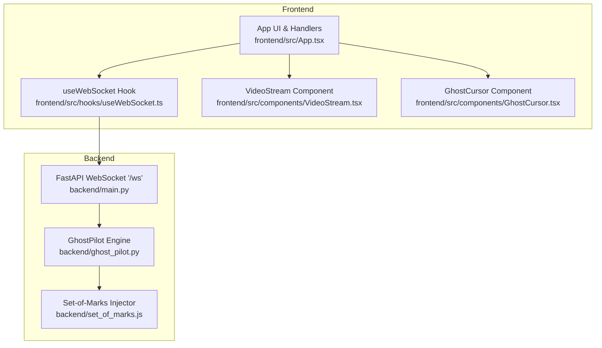
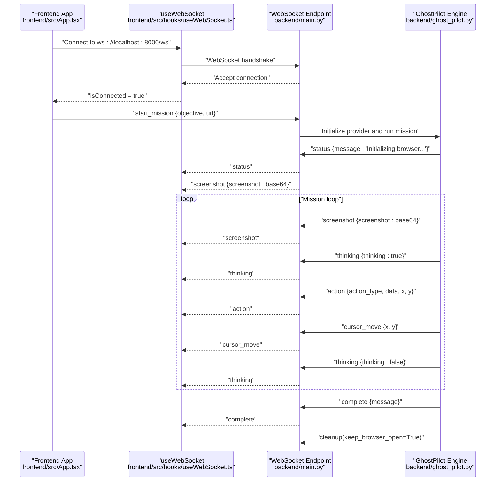
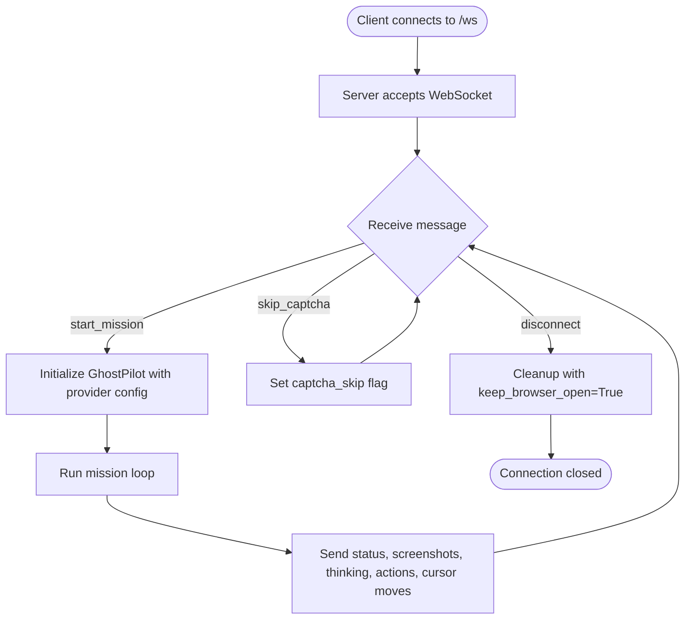
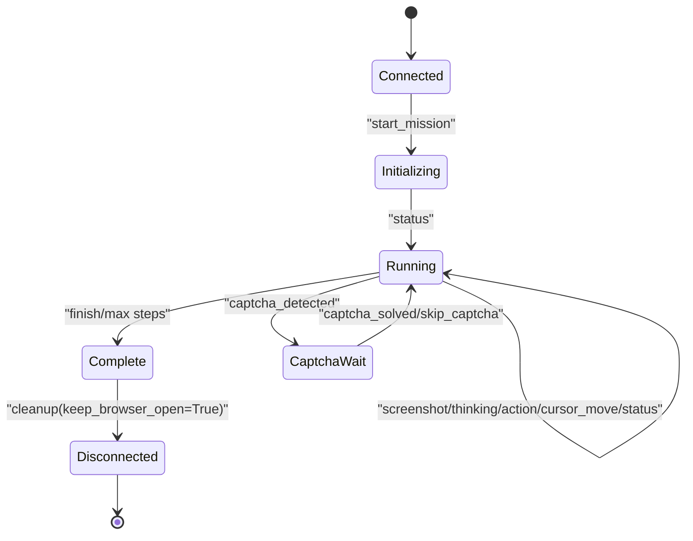
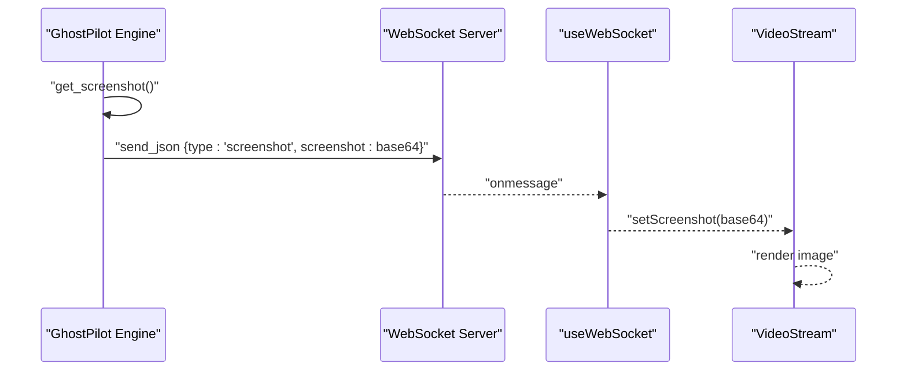
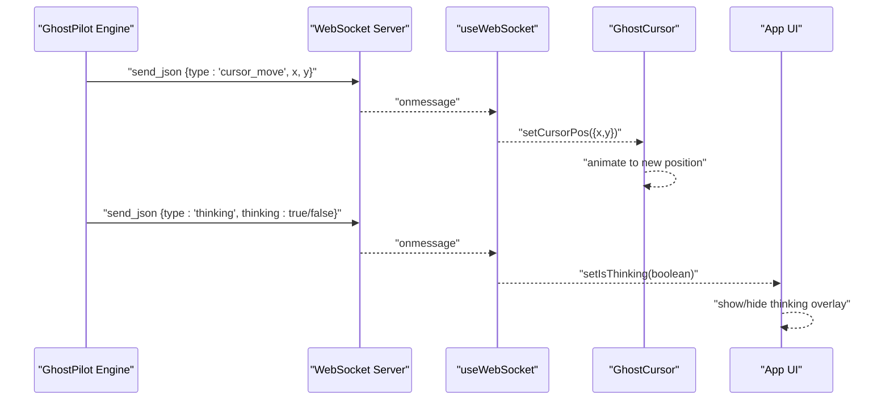
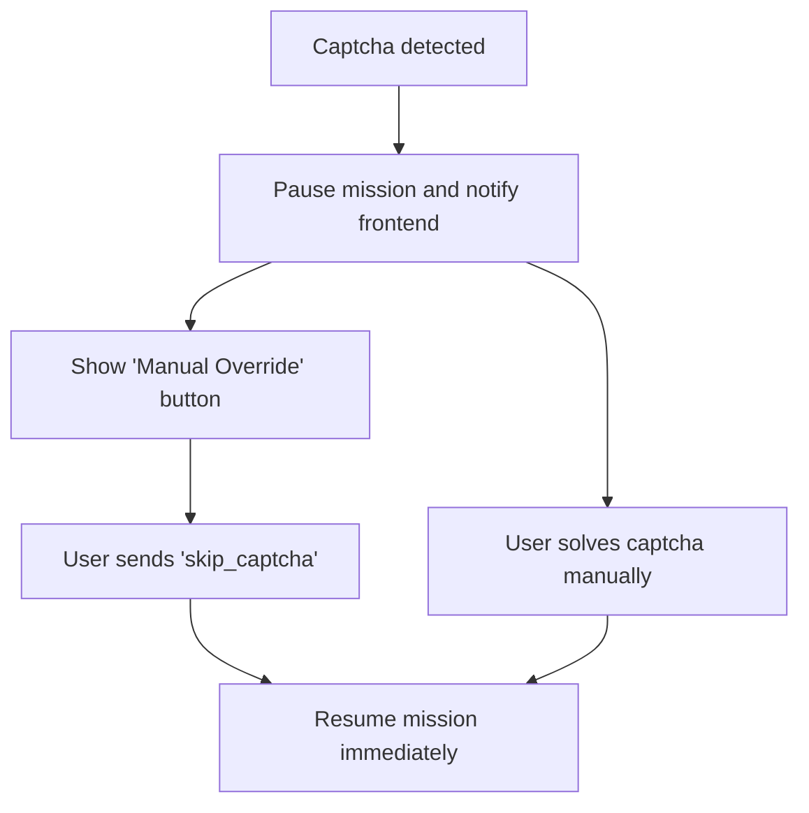
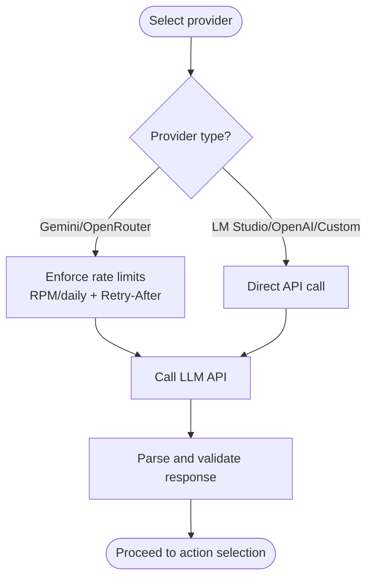
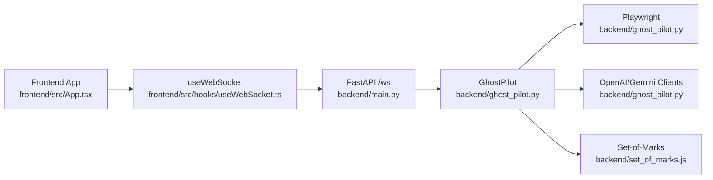

# WebSocket API

<cite>
**Referenced Files in This Document**
- [backend/main.py](file://backend/main.py)
- [backend/ghost_pilot.py](file://backend/ghost_pilot.py)
- [frontend/src/hooks/useWebSocket.ts](file://frontend/src/hooks/useWebSocket.ts)
- [frontend/src/App.tsx](file://frontend/src/App.tsx)
- [frontend/src/components/VideoStream.tsx](file://frontend/src/components/VideoStream.tsx)
- [frontend/src/components/GhostCursor.tsx](file://frontend/src/components/GhostCursor.tsx)
- [backend/set_of_marks.js](file://backend/set_of_marks.js)
- [backend/requirements.txt](file://backend/requirements.txt)
</cite>

## Table of Contents
1. [Introduction](#introduction)
2. [Project Structure](#project-structure)
3. [Core Components](#core-components)
4. [Architecture Overview](#architecture-overview)
5. [Detailed Component Analysis](#detailed-component-analysis)
6. [Dependency Analysis](#dependency-analysis)
7. [Performance Considerations](#performance-considerations)
8. [Troubleshooting Guide](#troubleshooting-guide)
9. [Conclusion](#conclusion)
10. [Appendices](#appendices)

## Introduction
This document specifies the WebSocket API used by the Ghost Pilot real-time communication system. It defines the WebSocket endpoint, message formats, event types, and the end-to-end lifecycle for initiating autonomous browser missions, handling screenshots and cursor updates, and managing manual overrides such as captcha skipping. It also covers connection lifecycle, cleanup behavior, rate limiting, timeouts, auto-reconnection, and best practices for stable real-time operation.

## Project Structure
The WebSocket API spans the backend FastAPI server and the frontend React application:
- Backend FastAPI server exposes the WebSocket endpoint and orchestrates the autonomous mission via the Ghost Pilot engine.
- Frontend React app connects to the WebSocket, renders live video frames, cursor overlays, and user feedback, and sends control messages.

**Diagram sources**
- [backend/main.py](file://backend/main.py#L36-L153)
- [backend/ghost_pilot.py](file://backend/ghost_pilot.py#L18-L105)
- [backend/set_of_marks.js](file://backend/set_of_marks.js#L8-L229)
- [frontend/src/hooks/useWebSocket.ts](file://frontend/src/hooks/useWebSocket.ts#L15-L92)
- [frontend/src/App.tsx](file://frontend/src/App.tsx#L14-L360)
- [frontend/src/components/VideoStream.tsx](file://frontend/src/components/VideoStream.tsx#L1-L43)
- [frontend/src/components/GhostCursor.tsx](file://frontend/src/components/GhostCursor.tsx#L1-L99)

**Section sources**
- [backend/main.py](file://backend/main.py#L1-L157)
- [frontend/src/hooks/useWebSocket.ts](file://frontend/src/hooks/useWebSocket.ts#L1-L93)
- [frontend/src/App.tsx](file://frontend/src/App.tsx#L1-L360)
- [backend/ghost_pilot.py](file://backend/ghost_pilot.py#L1-L802)
- [backend/set_of_marks.js](file://backend/set_of_marks.js#L1-L229)

## Core Components
- WebSocket endpoint: /ws
- Message types: start_mission, skip_captcha, screenshot, cursor_move, action, thinking, status, complete, error
- Event types: captcha_detected, captcha_solved
- Connection lifecycle: accept, send status updates, stream screenshots, forward actions, send progress/error, complete, cleanup
- Manual interaction mode: keep browser open for user-driven actions after mission initiation

**Section sources**
- [backend/main.py](file://backend/main.py#L36-L153)
- [frontend/src/App.tsx](file://frontend/src/App.tsx#L26-L123)
- [frontend/src/hooks/useWebSocket.ts](file://frontend/src/hooks/useWebSocket.ts#L3-L13)

## Architecture Overview
The WebSocket API enables bidirectional real-time communication between the frontend and backend during autonomous browser missions.

**Diagram sources**
- [backend/main.py](file://backend/main.py#L36-L153)
- [backend/ghost_pilot.py](file://backend/ghost_pilot.py#L623-L768)
- [frontend/src/App.tsx](file://frontend/src/App.tsx#L26-L123)
- [frontend/src/hooks/useWebSocket.ts](file://frontend/src/hooks/useWebSocket.ts#L21-L58)

## Detailed Component Analysis

### WebSocket Endpoint (/ws)
- Accepts WebSocket connections at /ws.
- Receives client messages and dispatches to Ghost Pilot engine.
- Sends status, screenshots, actions, thinking indicators, and completion/error notifications.
- Keeps browser open for manual interaction after mission initiation.

**Diagram sources**
- [backend/main.py](file://backend/main.py#L36-L153)
- [backend/ghost_pilot.py](file://backend/ghost_pilot.py#L769-L800)

**Section sources**
- [backend/main.py](file://backend/main.py#L36-L153)

### Message Types and Payloads

- start_mission
  - Purpose: Initiate autonomous mission.
  - Payload keys:
    - type: "start_mission"
    - objective: string
    - url: string (optional, defaults to a common homepage)
  - Example path: [frontend/src/App.tsx](file://frontend/src/App.tsx#L161-L166)

- skip_captcha
  - Purpose: Manually skip waiting for captcha resolution.
  - Payload keys:
    - type: "skip_captcha"
  - Example path: [frontend/src/App.tsx](file://frontend/src/App.tsx#L168-L174)

- screenshot
  - Purpose: Live browser frame streamed from backend.
  - Payload keys:
    - type: "screenshot"
    - screenshot: base64 PNG image
  - Example path: [backend/ghost_pilot.py](file://backend/ghost_pilot.py#L654-L657)

- cursor_move
  - Purpose: Visual cursor position update for overlay.
  - Payload keys:
    - type: "cursor_move"
    - x: number
    - y: number
  - Example path: [backend/ghost_pilot.py](file://backend/ghost_pilot.py#L737-L741)

- action
  - Purpose: Report the executed action and optional coordinates.
  - Payload keys:
    - type: "action"
    - action_type: "click" | "type" | "scroll" | "wait" | "finish"
    - data: object (includes tag_id, text, scroll_direction, confidence, etc.)
    - x, y: optional numbers (present when action involves movement)
  - Example path: [backend/ghost_pilot.py](file://backend/ghost_pilot.py#L727-L743)

- thinking
  - Purpose: Indicate when the model is analyzing the page.
  - Payload keys:
    - type: "thinking"
    - thinking: boolean
  - Example path: [backend/ghost_pilot.py](file://backend/ghost_pilot.py#L708-L716)

- status
  - Purpose: Progress and informational messages.
  - Payload keys:
    - type: "status"
    - message: string
  - Example path: [backend/ghost_pilot.py](file://backend/ghost_pilot.py#L634-L635)

- complete
  - Purpose: Mission completion notification.
  - Payload keys:
    - type: "complete"
    - message: string
  - Example path: [backend/main.py](file://backend/main.py#L110-L113)

- error
  - Purpose: Error reporting during mission or initialization.
  - Payload keys:
    - type: "error"
    - error: string
  - Example path: [backend/main.py](file://backend/main.py#L117-L120), [backend/ghost_pilot.py](file://backend/ghost_pilot.py#L750-L753)

- captcha_detected
  - Purpose: Captcha presence detected; pause for manual resolution.
  - Payload keys:
    - type: "captcha_detected"
    - message: string
  - Example path: [backend/ghost_pilot.py](file://backend/ghost_pilot.py#L663-L666)

- captcha_solved
  - Purpose: Captcha resolved or manually skipped.
  - Payload keys:
    - type: "captcha_solved"
    - message: string
  - Example path: [backend/ghost_pilot.py](file://backend/ghost_pilot.py#L679-L682), [backend/ghost_pilot.py](file://backend/ghost_pilot.py#L692-L695)

**Section sources**
- [backend/main.py](file://backend/main.py#L49-L137)
- [backend/ghost_pilot.py](file://backend/ghost_pilot.py#L623-L768)
- [frontend/src/App.tsx](file://frontend/src/App.tsx#L26-L123)

### Connection Lifecycle
- Acceptance: Server accepts the WebSocket and initializes state.
- Initialization: On receiving start_mission, server selects provider and constructs GhostPilot instance.
- Mission loop: Screenshot streaming, thinking indicators, action execution, cursor updates, and periodic status.
- Completion: On finish or max steps reached, server sends complete and keeps browser open for manual interaction.
- Cleanup: Browser resources are kept open by default to allow manual interaction; explicit cleanup occurs on disconnect or failure.

**Diagram sources**
- [backend/main.py](file://backend/main.py#L36-L153)
- [backend/ghost_pilot.py](file://backend/ghost_pilot.py#L623-L768)

**Section sources**
- [backend/main.py](file://backend/main.py#L36-L153)
- [backend/ghost_pilot.py](file://backend/ghost_pilot.py#L769-L800)

### Screenshot Streaming Mechanism
- Backend captures a PNG screenshot and encodes it to base64.
- Frontend receives base64 and displays it as an image, either raw or with a data URL prefix.
- The pipeline ensures minimal latency and crisp rendering.

**Diagram sources**
- [backend/ghost_pilot.py](file://backend/ghost_pilot.py#L232-L238)
- [backend/ghost_pilot.py](file://backend/ghost_pilot.py#L654-L657)
- [frontend/src/App.tsx](file://frontend/src/App.tsx#L31-L34)
- [frontend/src/components/VideoStream.tsx](file://frontend/src/components/VideoStream.tsx#L9-L19)

**Section sources**
- [backend/ghost_pilot.py](file://backend/ghost_pilot.py#L232-L238)
- [backend/ghost_pilot.py](file://backend/ghost_pilot.py#L654-L657)
- [frontend/src/App.tsx](file://frontend/src/App.tsx#L31-L34)
- [frontend/src/components/VideoStream.tsx](file://frontend/src/components/VideoStream.tsx#L1-L43)

### Cursor Position Updates and Visual Feedback
- Backend emits cursor_move events with x/y coordinates.
- Frontend updates GhostCursor overlay with smooth spring animation.
- Thinking overlay pulses while the model analyzes the page.
- Click ripple effect visualizes click actions.

**Diagram sources**
- [backend/ghost_pilot.py](file://backend/ghost_pilot.py#L737-L741)
- [frontend/src/App.tsx](file://frontend/src/App.tsx#L37-L78)
- [frontend/src/components/GhostCursor.tsx](file://frontend/src/components/GhostCursor.tsx#L10-L25)

**Section sources**
- [backend/ghost_pilot.py](file://backend/ghost_pilot.py#L708-L741)
- [frontend/src/App.tsx](file://frontend/src/App.tsx#L37-L78)
- [frontend/src/components/GhostCursor.tsx](file://frontend/src/components/GhostCursor.tsx#L1-L99)

### Manual Interaction Mode and Captcha Overrides
- When captcha is detected, the mission pauses and informs the frontend.
- The frontend shows a manual override button; sending skip_captcha resumes the mission.
- Browser remains open for manual interaction after mission initiation.

**Diagram sources**
- [backend/ghost_pilot.py](file://backend/ghost_pilot.py#L663-L705)
- [frontend/src/App.tsx](file://frontend/src/App.tsx#L93-L107)
- [frontend/src/App.tsx](file://frontend/src/App.tsx#L168-L174)

**Section sources**
- [backend/ghost_pilot.py](file://backend/ghost_pilot.py#L663-L705)
- [frontend/src/App.tsx](file://frontend/src/App.tsx#L93-L107)
- [frontend/src/App.tsx](file://frontend/src/App.tsx#L168-L174)

### Provider Configuration and Rate Limiting
- Backend supports multiple LLM providers (LM Studio, OpenAI, Gemini, OpenRouter, Custom).
- Rate limiting is enforced for free-tier providers (Gemini, OpenRouter) with RPM and daily caps, and honoring Retry-After headers.
- Provider selection is controlled by environment variables.

**Diagram sources**
- [backend/ghost_pilot.py](file://backend/ghost_pilot.py#L18-L105)
- [backend/ghost_pilot.py](file://backend/ghost_pilot.py#L181-L231)
- [backend/ghost_pilot.py](file://backend/ghost_pilot.py#L366-L432)
- [backend/ghost_pilot.py](file://backend/ghost_pilot.py#L434-L562)

**Section sources**
- [backend/ghost_pilot.py](file://backend/ghost_pilot.py#L18-L105)
- [backend/ghost_pilot.py](file://backend/ghost_pilot.py#L181-L231)
- [backend/ghost_pilot.py](file://backend/ghost_pilot.py#L366-L562)

## Dependency Analysis
- Backend depends on FastAPI for routing and WebSocket handling, and on Ghost Pilot for autonomous navigation.
- Ghost Pilot depends on Playwright for browser automation, OpenAI-compatible clients for vision models, and Set-of-Marks for element tagging.
- Frontend depends on React hooks for WebSocket management and UI components for rendering.

**Diagram sources**
- [backend/main.py](file://backend/main.py#L10-L13)
- [backend/ghost_pilot.py](file://backend/ghost_pilot.py#L10-L16)
- [backend/ghost_pilot.py](file://backend/ghost_pilot.py#L97-L104)
- [frontend/src/hooks/useWebSocket.ts](file://frontend/src/hooks/useWebSocket.ts#L1-L1)
- [frontend/src/App.tsx](file://frontend/src/App.tsx#L1-L10)

**Section sources**
- [backend/requirements.txt](file://backend/requirements.txt#L1-L8)
- [backend/ghost_pilot.py](file://backend/ghost_pilot.py#L1-L802)
- [backend/set_of_marks.js](file://backend/set_of_marks.js#L1-L229)

## Performance Considerations
- Screenshot frequency: The mission loop sends a screenshot per iteration; tune delays to balance responsiveness and bandwidth.
- Base64 payload size: Large images increase latency; ensure efficient frontend rendering.
- Cursor updates: Smooth animations improve UX but can add CPU overhead; adjust animation parameters as needed.
- Rate limiting: Respect provider quotas and Retry-After headers to avoid throttling.
- Browser lifecycle: Keeping the browser open reduces startup costs but increases resource usage; close when not needed.

[No sources needed since this section provides general guidance]

## Troubleshooting Guide
- Connection issues
  - Verify WebSocket URL and CORS configuration.
  - Check auto-reconnection logic in the frontend hook.
  - Inspect server logs for accept/disconnect events.

- Message parsing errors
  - Ensure messages conform to the documented types and keys.
  - Validate JSON payloads before sending.

- Captcha stalls
  - Use the manual override button to skip waiting.
  - Confirm captcha detection logic and wait loop behavior.

- Error reporting
  - Server sends error messages; surface them in the UI and log them for debugging.
  - Review backend exception handling and mission loop error paths.

**Section sources**
- [frontend/src/hooks/useWebSocket.ts](file://frontend/src/hooks/useWebSocket.ts#L21-L58)
- [backend/main.py](file://backend/main.py#L138-L149)
- [backend/ghost_pilot.py](file://backend/ghost_pilot.py#L748-L760)
- [frontend/src/App.tsx](file://frontend/src/App.tsx#L115-L121)

## Conclusion
The Ghost Pilot WebSocket API provides a robust, real-time bridge between the frontend and backend for autonomous browser missions. By adhering to the documented message formats, leveraging the provided lifecycle and cleanup semantics, and implementing the suggested best practices, developers can achieve stable, responsive, and maintainable real-time communication.

[No sources needed since this section summarizes without analyzing specific files]

## Appendices

### Practical Examples

- Initiating a mission
  - Frontend sends:
    - type: "start_mission"
    - objective: "Find the latest news"
    - url: "https://www.google.com"
  - Reference: [frontend/src/App.tsx](file://frontend/src/App.tsx#L161-L166)

- Skipping captcha
  - Frontend sends:
    - type: "skip_captcha"
  - Reference: [frontend/src/App.tsx](file://frontend/src/App.tsx#L168-L174)

- Receiving a screenshot
  - Backend sends:
    - type: "screenshot"
    - screenshot: "<base64>"
  - Reference: [backend/ghost_pilot.py](file://backend/ghost_pilot.py#L654-L657)

- Cursor movement
  - Backend sends:
    - type: "cursor_move"
    - x: 120
    - y: 300
  - Reference: [backend/ghost_pilot.py](file://backend/ghost_pilot.py#L737-L741)

- Action execution
  - Backend sends:
    - type: "action"
    - action_type: "click"
    - data: { tag_id: 5 }
    - x: 120
    - y: 300
  - Reference: [backend/ghost_pilot.py](file://backend/ghost_pilot.py#L727-L743)

- Completion and cleanup
  - Backend sends:
    - type: "complete"
    - message: "Mission accomplished!"
  - Reference: [backend/main.py](file://backend/main.py#L110-L113)

### Auto-Reconnection Logic
- Frontend attempts to reconnect automatically after disconnection.
- Adjust reconnect interval and backoff as needed.

**Section sources**
- [frontend/src/hooks/useWebSocket.ts](file://frontend/src/hooks/useWebSocket.ts#L47-L52)

### Rate Limiting and Timeouts
- Backend enforces provider-specific rate limits and honors Retry-After headers.
- Mission loop includes waits and retries for transient failures.

**Section sources**
- [backend/ghost_pilot.py](file://backend/ghost_pilot.py#L181-L231)
- [backend/ghost_pilot.py](file://backend/ghost_pilot.py#L514-L562)