# Agent Communication & Coordination

<cite>
**Referenced Files in This Document**
- [route.ts](file://extraction-script/app/api/agents/orchestrate/route.ts)
- [route.ts](file://extraction-script/app/api/agents/primary/route.ts)
- [route.ts](file://extraction-script/app/api/agents/secondary/route.ts)
- [route.ts](file://extraction-script/app/api/session/interact/route.ts)
- [route.ts](file://extraction-script/app/api/session/start/route.ts)
- [agent.ts](file://extraction-script/primary_agent/agent.ts)
- [agent.ts](file://extraction-script/secondary_agent/agent.ts)
- [context-manager.ts](file://extraction-script/secondary_agent/context-manager.ts)
- [instruction-translator.ts](file://extraction-script/primary_agent/instruction-translator.ts)
- [intent-recognizer.ts](file://extraction-script/primary_agent/intent-recognizer.ts)
- [types.ts](file://extraction-script/primary_agent/types.ts)
- [types.ts](file://extraction-script/secondary_agent/types.ts)
- [types.ts](file://extraction-script/shared/types.ts)
- [route.ts](file://extraction-script/app/api/ai/enrich/route.ts)
- [route.ts](file://extraction-script/app/api/extract/route.ts)
- [main.py](file://backend/main.py)
- [ghost_pilot.py](file://backend/ghost_pilot.py)
- [set_of_marks.js](file://backend/set_of_marks.js)
- [start-agents.sh](file://start-agents.sh)
- [sync-agents.sh](file://sync-agents.sh)
</cite>

## Table of Contents
1. [Introduction](#introduction)
2. [Project Structure](#project-structure)
3. [Core Components](#core-components)
4. [Architecture Overview](#architecture-overview)
5. [Detailed Component Analysis](#detailed-component-analysis)
6. [Dependency Analysis](#dependency-analysis)
7. [Performance Considerations](#performance-considerations)
8. [Troubleshooting Guide](#troubleshooting-guide)
9. [Conclusion](#conclusion)
10. [Appendices](#appendices)

## Introduction
This document explains the inter-agent communication and coordination mechanisms in the system. It focuses on how the primary agent translates user intent into structured instructions and communicates them to the secondary agent, how context is shared and managed during handoffs, and how the system handles errors, timeouts, retries, and circuit-breaking. It also documents agent lifecycle management, health checks, graceful shutdown, and monitoring/logging strategies for debugging communication issues. Typical user workflows are described end-to-end, from input to action completion.

## Project Structure
The system is organized into:
- Frontend Next.js application under extraction-script/app with API routes for orchestration, primary agent, secondary agent, enrichment, extraction, and session management.
- Primary and secondary agent implementations under extraction-script/primary_agent and extraction-script/secondary_agent respectively.
- Shared type definitions under extraction-script/shared.
- Backend Python services under backend for auxiliary automation tasks.
- Shell scripts for agent startup and synchronization.

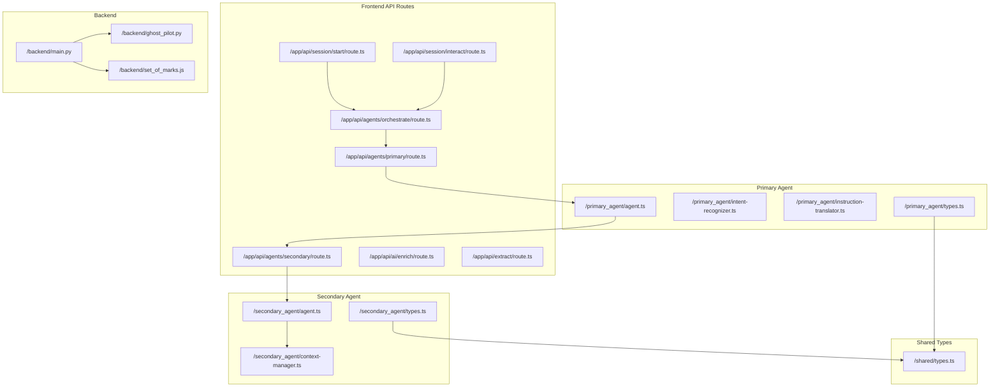

**Diagram sources**
- [route.ts](file://extraction-script/app/api/agents/orchestrate/route.ts)
- [route.ts](file://extraction-script/app/api/agents/primary/route.ts)
- [route.ts](file://extraction-script/app/api/agents/secondary/route.ts)
- [agent.ts](file://extraction-script/primary_agent/agent.ts)
- [agent.ts](file://extraction-script/secondary_agent/agent.ts)
- [context-manager.ts](file://extraction-script/secondary_agent/context-manager.ts)
- [types.ts](file://extraction-script/primary_agent/types.ts)
- [types.ts](file://extraction-script/secondary_agent/types.ts)
- [types.ts](file://extraction-script/shared/types.ts)
- [main.py](file://backend/main.py)
- [ghost_pilot.py](file://backend/ghost_pilot.py)
- [set_of_marks.js](file://backend/set_of_marks.js)

**Section sources**
- [route.ts](file://extraction-script/app/api/agents/orchestrate/route.ts)
- [route.ts](file://extraction-script/app/api/agents/primary/route.ts)
- [route.ts](file://extraction-script/app/api/agents/secondary/route.ts)
- [agent.ts](file://extraction-script/primary_agent/agent.ts)
- [agent.ts](file://extraction-script/secondary_agent/agent.ts)
- [context-manager.ts](file://extraction-script/secondary_agent/context-manager.ts)
- [types.ts](file://extraction-script/primary_agent/types.ts)
- [types.ts](file://extraction-script/secondary_agent/types.ts)
- [types.ts](file://extraction-script/shared/types.ts)
- [main.py](file://backend/main.py)
- [ghost_pilot.py](file://backend/ghost_pilot.py)
- [set_of_marks.js](file://backend/set_of_marks.js)

## Core Components
- Orchestration API: Central endpoint that coordinates between primary and secondary agents and exposes session start and interact endpoints.
- Primary Agent: Interprets user intent, recognizes goals, and translates them into executable instructions for the secondary agent.
- Secondary Agent: Executes actions using the provided instructions and manages context for handoff and continuity.
- Context Manager: Maintains and synchronizes contextual state across agent transitions.
- Shared Types: Define message schemas and state contracts used across agents and APIs.
- Backend Services: Provide auxiliary automation and marking utilities.

Key responsibilities:
- Message protocols: Structured instruction transfer from primary to secondary agent.
- Context sharing: Seamless handoff via context manager.
- Error propagation and fault tolerance: Retry, timeout, and circuit breaker patterns.
- Lifecycle management: Startup, health checks, and graceful shutdown.
- Monitoring and logging: Debugging agent communication issues.
- Multi-step mission coordination: Synchronization and state consistency.

**Section sources**
- [route.ts](file://extraction-script/app/api/agents/orchestrate/route.ts)
- [agent.ts](file://extraction-script/primary_agent/agent.ts)
- [agent.ts](file://extraction-script/secondary_agent/agent.ts)
- [context-manager.ts](file://extraction-script/secondary_agent/context-manager.ts)
- [types.ts](file://extraction-script/shared/types.ts)

## Architecture Overview
The system orchestrates a user workflow through a series of coordinated steps:
- Session initialization starts the process.
- Orchestration route receives requests and delegates to primary agent.
- Primary agent recognizes intent and translates to structured instructions.
- Instructions are forwarded to secondary agent for execution.
- Secondary agent executes actions and updates context.
- Enrichment and extraction routes support data augmentation and parsing.
- Backend services assist with automation tasks.

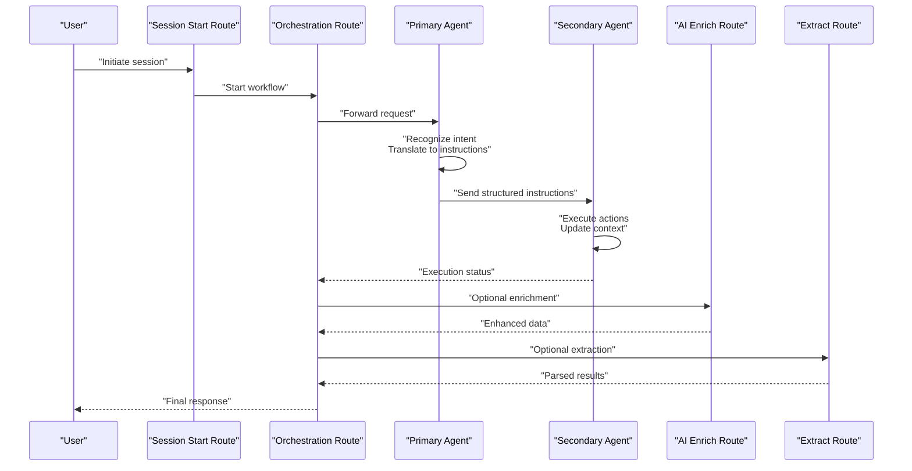

**Diagram sources**
- [route.ts](file://extraction-script/app/api/session/start/route.ts)
- [route.ts](file://extraction-script/app/api/agents/orchestrate/route.ts)
- [agent.ts](file://extraction-script/primary_agent/agent.ts)
- [agent.ts](file://extraction-script/secondary_agent/agent.ts)
- [route.ts](file://extraction-script/app/api/ai/enrich/route.ts)
- [route.ts](file://extraction-script/app/api/extract/route.ts)

## Detailed Component Analysis

### Orchestration API
The orchestration route acts as the central coordinator. It:
- Receives incoming requests from session start and interact endpoints.
- Delegates to the primary agent for intent recognition and instruction translation.
- Forwards structured instructions to the secondary agent for execution.
- Aggregates results from enrichment and extraction routes when applicable.
- Returns unified responses to clients.

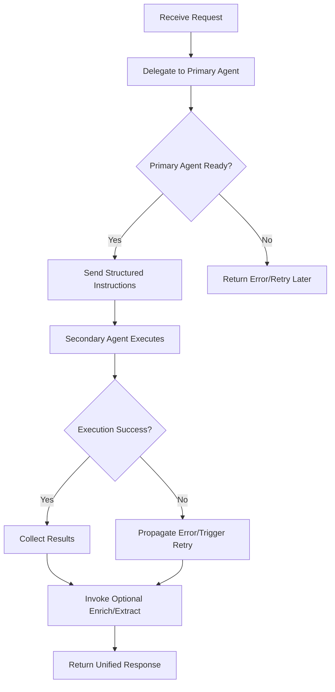

**Diagram sources**
- [route.ts](file://extraction-script/app/api/agents/orchestrate/route.ts)
- [route.ts](file://extraction-script/app/api/agents/primary/route.ts)
- [route.ts](file://extraction-script/app/api/agents/secondary/route.ts)
- [route.ts](file://extraction-script/app/api/ai/enrich/route.ts)
- [route.ts](file://extraction-script/app/api/extract/route.ts)

**Section sources**
- [route.ts](file://extraction-script/app/api/agents/orchestrate/route.ts)

### Primary Agent
Responsibilities:
- Intent recognition: Parses user input to identify goals and constraints.
- Instruction translation: Converts recognized intent into structured instructions for the secondary agent.
- Message protocol: Defines the schema and semantics of instruction payloads.
- Handoff preparation: Ensures context readiness before forwarding instructions.

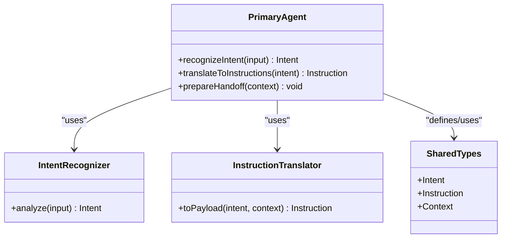

**Diagram sources**
- [agent.ts](file://extraction-script/primary_agent/agent.ts)
- [intent-recognizer.ts](file://extraction-script/primary_agent/intent-recognizer.ts)
- [instruction-translator.ts](file://extraction-script/primary_agent/instruction-translator.ts)
- [types.ts](file://extraction-script/primary_agent/types.ts)
- [types.ts](file://extraction-script/shared/types.ts)

**Section sources**
- [agent.ts](file://extraction-script/primary_agent/agent.ts)
- [intent-recognizer.ts](file://extraction-script/primary_agent/intent-recognizer.ts)
- [instruction-translator.ts](file://extraction-script/primary_agent/instruction-translator.ts)
- [types.ts](file://extraction-script/primary_agent/types.ts)
- [types.ts](file://extraction-script/shared/types.ts)

### Secondary Agent
Responsibilities:
- Action execution: Performs the operations described by the instructions.
- Context management: Maintains and updates context to support handoffs and continuity.
- State synchronization: Ensures internal state reflects executed actions and outcomes.
- Fault handling: Reports failures and participates in error propagation.

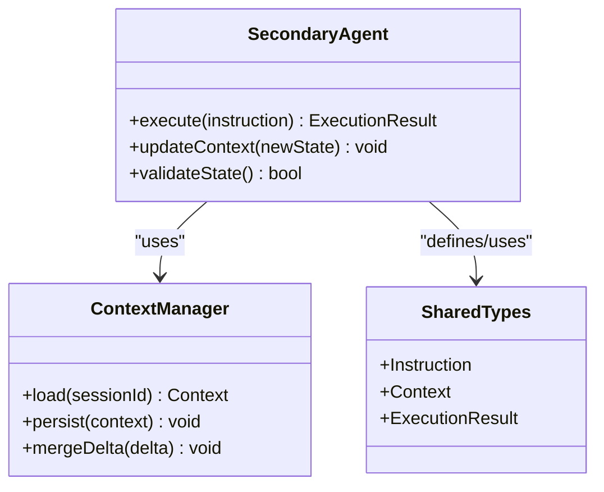

**Diagram sources**
- [agent.ts](file://extraction-script/secondary_agent/agent.ts)
- [context-manager.ts](file://extraction-script/secondary_agent/context-manager.ts)
- [types.ts](file://extraction-script/secondary_agent/types.ts)
- [types.ts](file://extraction-script/shared/types.ts)

**Section sources**
- [agent.ts](file://extraction-script/secondary_agent/agent.ts)
- [context-manager.ts](file://extraction-script/secondary_agent/context-manager.ts)
- [types.ts](file://extraction-script/secondary_agent/types.ts)
- [types.ts](file://extraction-script/shared/types.ts)

### Context Sharing Mechanisms
Context is shared across agents to enable seamless handoffs:
- Context persistence: The context manager loads and persists context per session.
- Delta merging: Updates are merged incrementally to avoid conflicts.
- Schema alignment: Shared types define the structure of context to ensure compatibility.

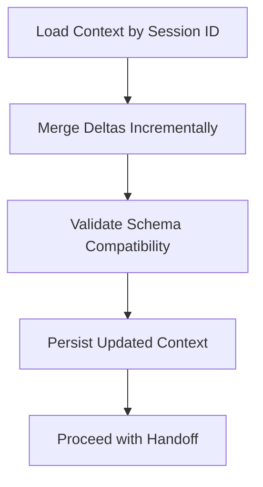

**Diagram sources**
- [context-manager.ts](file://extraction-script/secondary_agent/context-manager.ts)
- [types.ts](file://extraction-script/shared/types.ts)

**Section sources**
- [context-manager.ts](file://extraction-script/secondary_agent/context-manager.ts)
- [types.ts](file://extraction-script/shared/types.ts)

### Error Propagation and Fault Tolerance
Patterns implemented:
- Retry: On transient failures, reattempt execution with exponential backoff.
- Timeout: Requests are bounded by timeouts; long-running operations are canceled if exceeded.
- Circuit Breaker: When failure rate exceeds threshold, temporarily stop forwarding to protect downstream systems.
- Graceful degradation: Partial failures return partial results or fallback behavior.

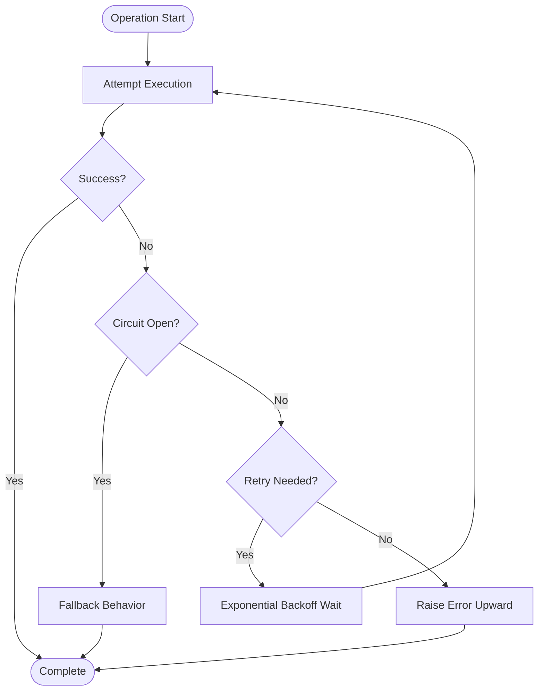

**Diagram sources**
- [agent.ts](file://extraction-script/primary_agent/agent.ts)
- [agent.ts](file://extraction-script/secondary_agent/agent.ts)

**Section sources**
- [agent.ts](file://extraction-script/primary_agent/agent.ts)
- [agent.ts](file://extraction-script/secondary_agent/agent.ts)

### Agent Lifecycle Management
Lifecycle stages:
- Startup: Initialize agents, load configurations, and establish connections.
- Health checks: Periodic probes to verify readiness and responsiveness.
- Graceful shutdown: Stop accepting new work, drain in-flight operations, and release resources.

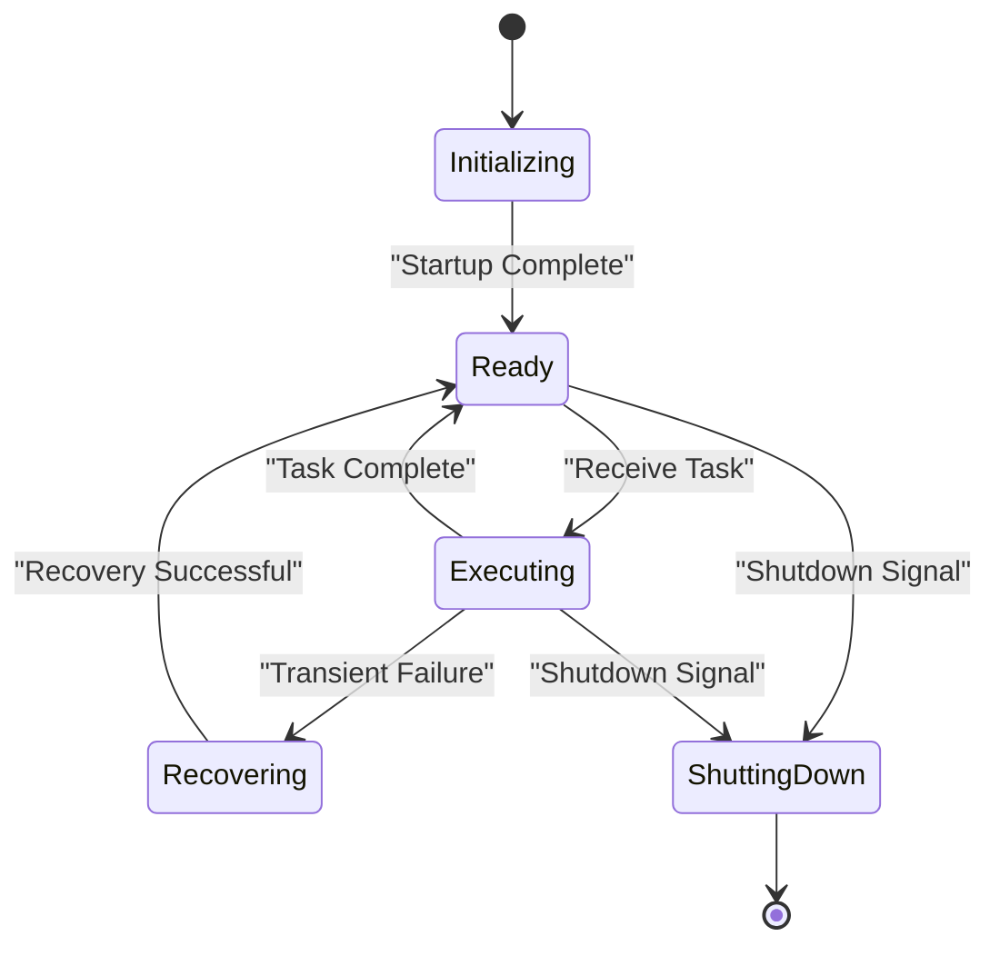

**Diagram sources**
- [agent.ts](file://extraction-script/primary_agent/agent.ts)
- [agent.ts](file://extraction-script/secondary_agent/agent.ts)

**Section sources**
- [agent.ts](file://extraction-script/primary_agent/agent.ts)
- [agent.ts](file://extraction-script/secondary_agent/agent.ts)

### Coordination Patterns for Multi-Step Missions
Multi-step missions require:
- Step sequencing: Define ordered steps with dependencies.
- State synchronization: Ensure each step’s outcome is visible to subsequent steps.
- Rollback capability: Revert partial changes on failure.
- Monitoring checkpoints: Track progress and detect stalls.

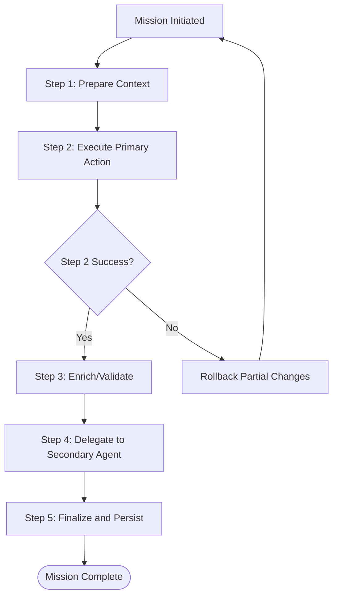

**Diagram sources**
- [route.ts](file://extraction-script/app/api/agents/orchestrate/route.ts)
- [agent.ts](file://extraction-script/primary_agent/agent.ts)
- [agent.ts](file://extraction-script/secondary_agent/agent.ts)

**Section sources**
- [route.ts](file://extraction-script/app/api/agents/orchestrate/route.ts)
- [agent.ts](file://extraction-script/primary_agent/agent.ts)
- [agent.ts](file://extraction-script/secondary_agent/agent.ts)

### Typical Agent Interactions During User Workflows
End-to-end flow:
- User initiates a session.
- Orchestration route starts the workflow.
- Primary agent recognizes intent and translates to instructions.
- Secondary agent executes actions and updates context.
- Optional enrichment and extraction enhance or parse results.
- Final response is returned to the user.

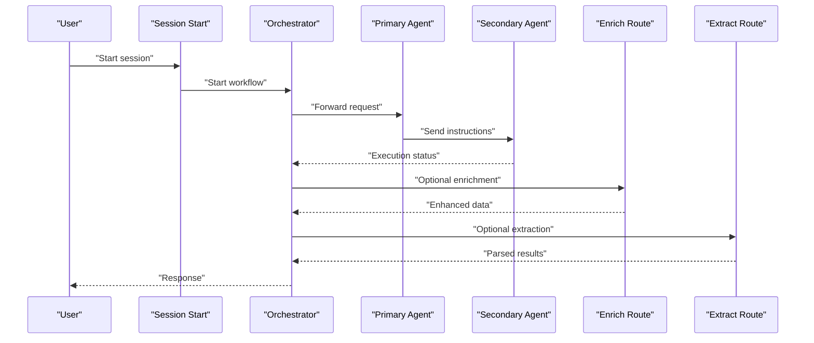

**Diagram sources**
- [route.ts](file://extraction-script/app/api/session/start/route.ts)
- [route.ts](file://extraction-script/app/api/agents/orchestrate/route.ts)
- [agent.ts](file://extraction-script/primary_agent/agent.ts)
- [agent.ts](file://extraction-script/secondary_agent/agent.ts)
- [route.ts](file://extraction-script/app/api/ai/enrich/route.ts)
- [route.ts](file://extraction-script/app/api/extract/route.ts)

**Section sources**
- [route.ts](file://extraction-script/app/api/session/start/route.ts)
- [route.ts](file://extraction-script/app/api/agents/orchestrate/route.ts)
- [agent.ts](file://extraction-script/primary_agent/agent.ts)
- [agent.ts](file://extraction-script/secondary_agent/agent.ts)
- [route.ts](file://extraction-script/app/api/ai/enrich/route.ts)
- [route.ts](file://extraction-script/app/api/extract/route.ts)

### Monitoring and Logging Strategies
Recommended strategies:
- Structured logs: Include correlation IDs, timestamps, and component names.
- Metrics: Track request rates, latency, error rates, and circuit breaker state.
- Distributed tracing: Correlate events across orchestration, primary, and secondary agents.
- Health endpoints: Expose readiness and liveness probes for each agent.
- Alerting: Configure thresholds for retries, timeouts, and failure rates.

[No sources needed since this section provides general guidance]

### Retry Mechanisms, Timeouts, and Circuit Breakers
- Retry: Implement exponential backoff with jitter; limit max attempts.
- Timeout: Set operation timeouts per step; cancel on expiry.
- Circuit Breaker: Track failure rate and open circuit after threshold; allow half-open testing.

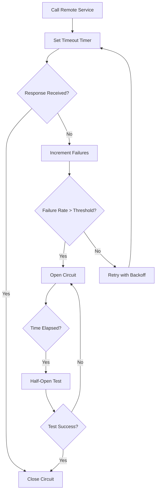

**Diagram sources**
- [agent.ts](file://extraction-script/primary_agent/agent.ts)
- [agent.ts](file://extraction-script/secondary_agent/agent.ts)

**Section sources**
- [agent.ts](file://extraction-script/primary_agent/agent.ts)
- [agent.ts](file://extraction-script/secondary_agent/agent.ts)

## Dependency Analysis
Dependencies between components:
- API routes depend on orchestration logic and agent implementations.
- Agents depend on shared types for message schemas.
- Secondary agent depends on context manager for state persistence.
- Backend services support automation tasks.

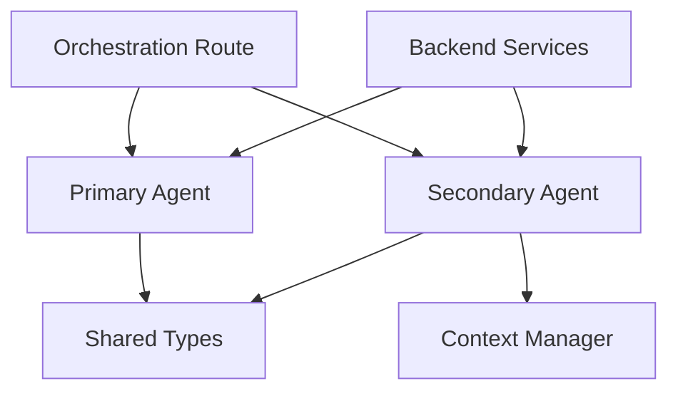

**Diagram sources**
- [route.ts](file://extraction-script/app/api/agents/orchestrate/route.ts)
- [agent.ts](file://extraction-script/primary_agent/agent.ts)
- [agent.ts](file://extraction-script/secondary_agent/agent.ts)
- [context-manager.ts](file://extraction-script/secondary_agent/context-manager.ts)
- [types.ts](file://extraction-script/shared/types.ts)
- [main.py](file://backend/main.py)

**Section sources**
- [route.ts](file://extraction-script/app/api/agents/orchestrate/route.ts)
- [agent.ts](file://extraction-script/primary_agent/agent.ts)
- [agent.ts](file://extraction-script/secondary_agent/agent.ts)
- [context-manager.ts](file://extraction-script/secondary_agent/context-manager.ts)
- [types.ts](file://extraction-script/shared/types.ts)
- [main.py](file://backend/main.py)

## Performance Considerations
- Asynchronous processing: Offload heavy operations to background tasks.
- Caching: Cache frequently accessed context segments to reduce latency.
- Batching: Batch small operations to improve throughput.
- Resource limits: Apply quotas and concurrency caps to prevent overload.
- Observability: Instrument hot paths for profiling and bottleneck identification.

[No sources needed since this section provides general guidance]

## Troubleshooting Guide
Common issues and resolutions:
- Communication failures: Verify API route endpoints and network connectivity.
- Context mismatches: Ensure shared types align and context deltas are applied correctly.
- Timeout errors: Increase timeouts cautiously and investigate slow dependencies.
- Circuit breaker activation: Inspect upstream service health and retry policies.
- Lifecycle problems: Confirm startup scripts and health checks are functioning.

**Section sources**
- [route.ts](file://extraction-script/app/api/agents/orchestrate/route.ts)
- [agent.ts](file://extraction-script/primary_agent/agent.ts)
- [agent.ts](file://extraction-script/secondary_agent/agent.ts)
- [context-manager.ts](file://extraction-script/secondary_agent/context-manager.ts)
- [types.ts](file://extraction-script/shared/types.ts)

## Conclusion
The system employs a clear separation of concerns: orchestration coordinates, primary agent interprets and translates, secondary agent executes, and context manager ensures continuity. Robust error handling, lifecycle management, and monitoring enable reliable multi-step missions. The documented patterns provide a blueprint for extending and maintaining agent communication and coordination.

[No sources needed since this section summarizes without analyzing specific files]

## Appendices
- Startup and synchronization scripts:
  - Agent startup script orchestrates agent processes.
  - Synchronization script coordinates agent states and handoffs.

**Section sources**
- [start-agents.sh](file://start-agents.sh)
- [sync-agents.sh](file://sync-agents.sh)