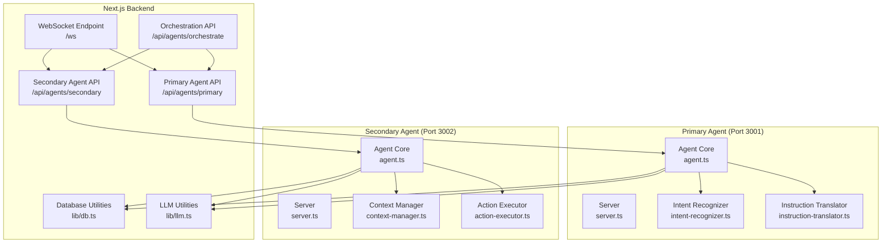
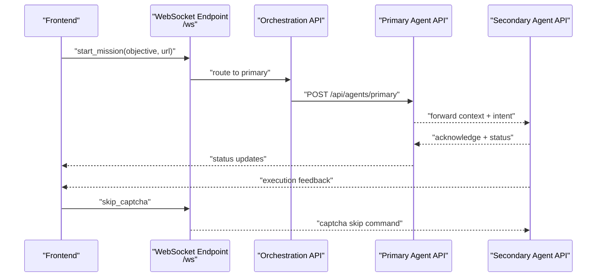
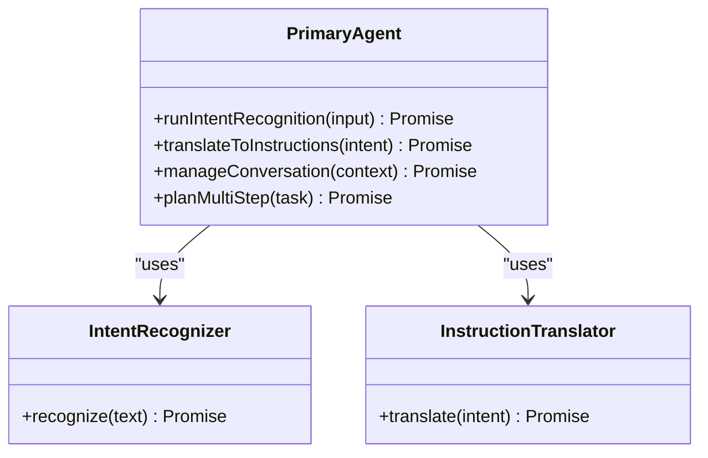
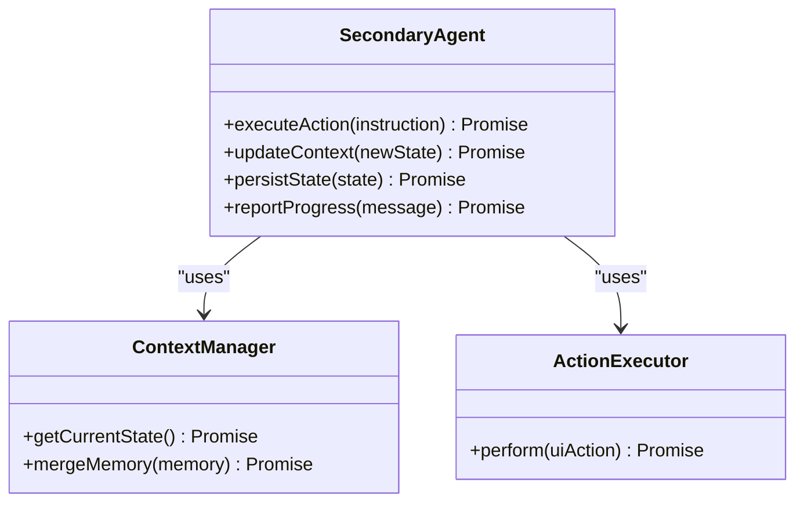
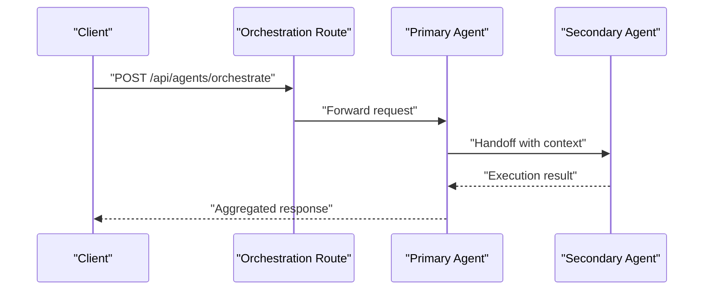
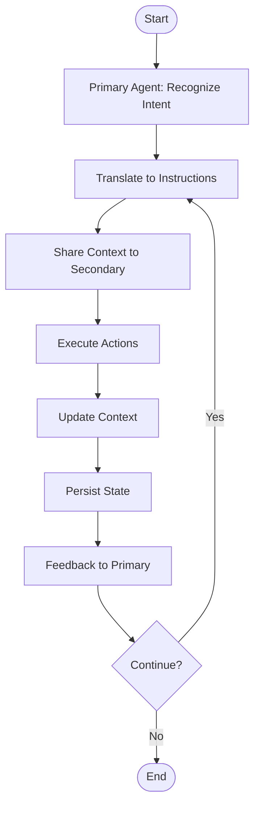
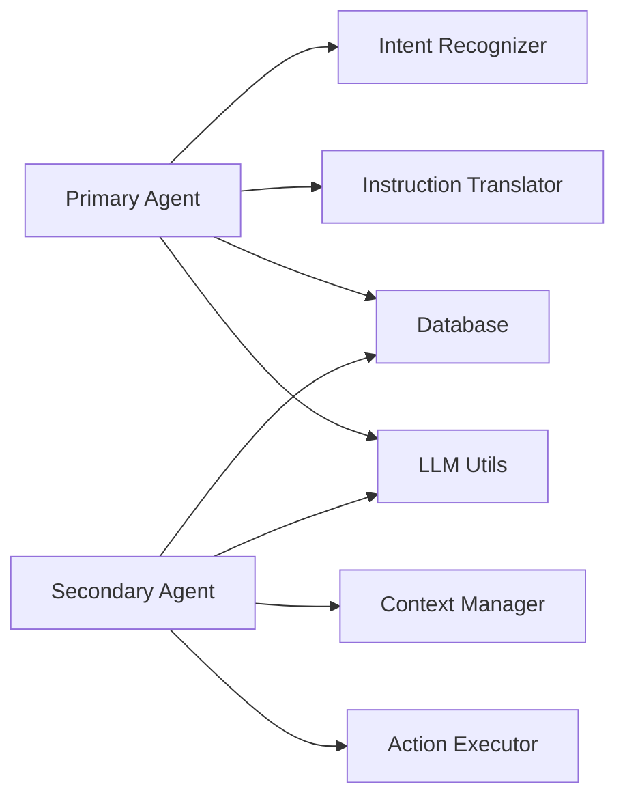

# Agent System

<cite>
**Referenced Files in This Document**
- [backend/main.py](file://backend/main.py)
- [backend/app/api/agents/orchestrate/route.ts](file://backend/app/api/agents/orchestrate/route.ts)
- [backend/app/api/agents/primary/route.ts](file://backend/app/api/agents/primary/route.ts)
- [backend/app/api/agents/secondary/route.ts](file://backend/app/api/agents/secondary/route.ts)
- [backend/primary_agent/agent.ts](file://backend/primary_agent/agent.ts)
- [backend/primary_agent/intent-recognizer.ts](file://backend/primary_agent/intent-recognizer.ts)
- [backend/primary_agent/instruction-translator.ts](file://backend/primary_agent/instruction-translator.ts)
- [backend/secondary_agent/agent.ts](file://backend/secondary_agent/agent.ts)
- [backend/secondary_agent/action-executor.ts](file://backend/secondary_agent/action-executor.ts)
- [backend/secondary_agent/context-manager.ts](file://backend/secondary_agent/context-manager.ts)
- [backend/shared/types.ts](file://backend/shared/types.ts)
- [backend/lib/db.ts](file://backend/lib/db.ts)
- [backend/lib/llm.ts](file://backend/lib/llm.ts)
- [backend/scripts/init-db.js](file://backend/scripts/init-db.js)
- [backend/scripts/migrate-phase2a.js](file://backend/scripts/migrate-phase2a.js)
- [backend/README.md](file://backend/README.md)
- [primary_agent/agent.ts](file://primary_agent/agent.ts)
- [primary_agent/intent-recognizer.ts](file://primary_agent/intent-recognizer.ts)
- [primary_agent/instruction-translator.ts](file://primary_agent/instruction-translator.ts)
- [primary_agent/server.ts](file://primary_agent/server.ts)
- [secondary_agent/agent.ts](file://secondary_agent/agent.ts)
- [secondary_agent/action-executor.ts](file://secondary_agent/action-executor.ts)
- [secondary_agent/context-manager.ts](file://secondary_agent/context-manager.ts)
- [secondary_agent/server.ts](file://secondary_agent/server.ts)
- [shared/types.ts](file://shared/types.ts)
- [AGENTS.md](file://AGENTS.md)
- [Development_log.md](file://Development_log.md)
- [start-agents.sh](file://start-agents.sh)
- [sync-agents.sh](file://sync-agents.sh)
</cite>

## Table of Contents
1. [Introduction](#introduction)
2. [Project Structure](#project-structure)
3. [Core Components](#core-components)
4. [Architecture Overview](#architecture-overview)
5. [Detailed Component Analysis](#detailed-component-analysis)
6. [Dependency Analysis](#dependency-analysis)
7. [Performance Considerations](#performance-considerations)
8. [Troubleshooting Guide](#troubleshooting-guide)
9. [Conclusion](#conclusion)
10. [Appendices](#appendices)

## Introduction
This document describes the distributed agent system architecture for a dual-agent autonomous browser automation platform. It covers:
- The primary agent (port 3001) responsible for intent recognition and instruction translation
- The secondary agent (port 3002) responsible for action execution, context management, and database operations
- Inter-agent communication, context sharing, and error propagation
- Lifecycle management, health monitoring, and graceful shutdown
- API endpoints, request/response schemas, authentication, and rate limiting
- Conversation state management, memory handling, and multi-step planning
- Coordination patterns, load balancing, and fault tolerance
- Practical examples of agent interactions and debugging techniques

## Project Structure
The system comprises:
- A Next.js backend with FastAPI-style API routes under backend/app/api
- Two TypeScript agent services (primary and secondary) with dedicated servers
- Shared type definitions and utilities for LLM and database operations
- Scripts for database initialization and migrations
- Shell scripts to start and synchronize agents

**Diagram sources**
- [backend/main.py](file://backend/main.py#L36-L157)
- [backend/app/api/agents/orchestrate/route.ts](file://backend/app/api/agents/orchestrate/route.ts)
- [backend/app/api/agents/primary/route.ts](file://backend/app/api/agents/primary/route.ts)
- [backend/app/api/agents/secondary/route.ts](file://backend/app/api/agents/secondary/route.ts)
- [backend/primary_agent/agent.ts](file://backend/primary_agent/agent.ts)
- [backend/primary_agent/intent-recognizer.ts](file://backend/primary_agent/intent-recognizer.ts)
- [backend/primary_agent/instruction-translator.ts](file://backend/primary_agent/instruction-translator.ts)
- [backend/secondary_agent/agent.ts](file://backend/secondary_agent/agent.ts)
- [backend/secondary_agent/action-executor.ts](file://backend/secondary_agent/action-executor.ts)
- [backend/secondary_agent/context-manager.ts](file://backend/secondary_agent/context-manager.ts)
- [backend/lib/db.ts](file://backend/lib/db.ts)
- [backend/lib/llm.ts](file://backend/lib/llm.ts)

**Section sources**
- [backend/main.py](file://backend/main.py#L1-L157)
- [backend/README.md](file://backend/README.md)

## Core Components
- Primary Agent (port 3001)
  - Intent Recognition: Parses user intent from natural language into structured goals
  - Instruction Translation: Converts recognized intents into executable instruction sequences
  - Conversation Management: Maintains conversational context across turns
  - Multi-step Planning: Builds plans for complex tasks and validates feasibility
- Secondary Agent (port 3002)
  - Action Execution: Executes UI actions against the browser automation engine
  - Context Management: Tracks and updates runtime context (page state, selections, memory)
  - Database Operations: Persists and retrieves state, logs, and artifacts
- Orchestration Layer
  - Coordinates agent handoffs, context forwarding, and error propagation
  - Provides unified API surface for clients and the frontend

**Section sources**
- [backend/primary_agent/agent.ts](file://backend/primary_agent/agent.ts)
- [backend/primary_agent/intent-recognizer.ts](file://backend/primary_agent/intent-recognizer.ts)
- [backend/primary_agent/instruction-translator.ts](file://backend/primary_agent/instruction-translator.ts)
- [backend/secondary_agent/agent.ts](file://backend/secondary_agent/agent.ts)
- [backend/secondary_agent/action-executor.ts](file://backend/secondary_agent/action-executor.ts)
- [backend/secondary_agent/context-manager.ts](file://backend/secondary_agent/context-manager.ts)
- [backend/app/api/agents/orchestrate/route.ts](file://backend/app/api/agents/orchestrate/route.ts)

## Architecture Overview
The system uses a WebSocket-based frontend connection and two dedicated agent services:
- Frontend connects to the backend WebSocket endpoint
- Backend routes requests to either the primary or secondary agent APIs
- Agents communicate via internal HTTP endpoints and share context/state through the database
- Health checks and graceful shutdown are supported at the agent service level

**Diagram sources**
- [backend/main.py](file://backend/main.py#L36-L157)
- [backend/app/api/agents/orchestrate/route.ts](file://backend/app/api/agents/orchestrate/route.ts)
- [backend/app/api/agents/primary/route.ts](file://backend/app/api/agents/primary/route.ts)
- [backend/app/api/agents/secondary/route.ts](file://backend/app/api/agents/secondary/route.ts)

## Detailed Component Analysis

### Primary Agent (Port 3001)
Responsibilities:
- Natural language understanding and intent recognition
- Instruction translation into executable steps
- Conversation state management and multi-step planning
- Handoff to secondary agent with enriched context

Key modules:
- Agent Core: orchestrates intent recognition and translation
- Intent Recognizer: extracts structured intent from user input
- Instruction Translator: transforms intent into actionable instructions

**Diagram sources**
- [backend/primary_agent/agent.ts](file://backend/primary_agent/agent.ts)
- [backend/primary_agent/intent-recognizer.ts](file://backend/primary_agent/intent-recognizer.ts)
- [backend/primary_agent/instruction-translator.ts](file://backend/primary_agent/instruction-translator.ts)

**Section sources**
- [backend/primary_agent/agent.ts](file://backend/primary_agent/agent.ts)
- [backend/primary_agent/intent-recognizer.ts](file://backend/primary_agent/intent-recognizer.ts)
- [backend/primary_agent/instruction-translator.ts](file://backend/primary_agent/instruction-translator.ts)

### Secondary Agent (Port 3002)
Responsibilities:
- Execute actions against the browser automation engine
- Manage runtime context and memory
- Persist state and artifacts to the database
- Report progress and errors back to the primary agent

Key modules:
- Agent Core: coordinates execution and context updates
- Context Manager: tracks page state and selections
- Action Executor: performs UI interactions

**Diagram sources**
- [backend/secondary_agent/agent.ts](file://backend/secondary_agent/agent.ts)
- [backend/secondary_agent/context-manager.ts](file://backend/secondary_agent/context-manager.ts)
- [backend/secondary_agent/action-executor.ts](file://backend/secondary_agent/action-executor.ts)

**Section sources**
- [backend/secondary_agent/agent.ts](file://backend/secondary_agent/agent.ts)
- [backend/secondary_agent/context-manager.ts](file://backend/secondary_agent/context-manager.ts)
- [backend/secondary_agent/action-executor.ts](file://backend/secondary_agent/action-executor.ts)

### Orchestration and Communication
The orchestration API routes requests to the appropriate agent and manages context handoffs. The agents expose HTTP endpoints for internal communication and health checks.

**Diagram sources**
- [backend/app/api/agents/orchestrate/route.ts](file://backend/app/api/agents/orchestrate/route.ts)
- [backend/app/api/agents/primary/route.ts](file://backend/app/api/agents/primary/route.ts)
- [backend/app/api/agents/secondary/route.ts](file://backend/app/api/agents/secondary/route.ts)

**Section sources**
- [backend/app/api/agents/orchestrate/route.ts](file://backend/app/api/agents/orchestrate/route.ts)
- [backend/app/api/agents/primary/route.ts](file://backend/app/api/agents/primary/route.ts)
- [backend/app/api/agents/secondary/route.ts](file://backend/app/api/agents/secondary/route.ts)

### Conversation State Management and Memory
- The primary agent maintains conversational context and multi-step plans
- The secondary agent updates runtime context after each action
- Both agents rely on the database for persistence and retrieval of state

**Diagram sources**
- [backend/primary_agent/agent.ts](file://backend/primary_agent/agent.ts)
- [backend/secondary_agent/agent.ts](file://backend/secondary_agent/agent.ts)
- [backend/secondary_agent/context-manager.ts](file://backend/secondary_agent/context-manager.ts)
- [backend/lib/db.ts](file://backend/lib/db.ts)

**Section sources**
- [backend/primary_agent/agent.ts](file://backend/primary_agent/agent.ts)
- [backend/secondary_agent/context-manager.ts](file://backend/secondary_agent/context-manager.ts)
- [backend/lib/db.ts](file://backend/lib/db.ts)

## Dependency Analysis
- Internal dependencies
  - Primary agent depends on intent recognition and instruction translation modules
  - Secondary agent depends on context management and action executor
  - Both agents depend on shared types and utilities for LLM and database operations
- External dependencies
  - Database connectivity and migrations
  - LLM providers configured via environment variables
  - WebSocket transport for frontend communication

**Diagram sources**
- [backend/primary_agent/agent.ts](file://backend/primary_agent/agent.ts)
- [backend/secondary_agent/agent.ts](file://backend/secondary_agent/agent.ts)
- [backend/lib/db.ts](file://backend/lib/db.ts)
- [backend/lib/llm.ts](file://backend/lib/llm.ts)

**Section sources**
- [backend/shared/types.ts](file://backend/shared/types.ts)
- [backend/lib/db.ts](file://backend/lib/db.ts)
- [backend/lib/llm.ts](file://backend/lib/llm.ts)

## Performance Considerations
- Asynchronous processing: Use async/await patterns to avoid blocking I/O
- Caching: Reuse LLM responses and context where safe to reduce latency
- Batch operations: Group database writes to minimize round trips
- Resource limits: Configure timeouts and retry policies for external LLM calls
- Monitoring: Add metrics for agent throughput, error rates, and latency

## Troubleshooting Guide
Common issues and resolutions:
- Agent unresponsive
  - Verify health endpoints for each agent
  - Check logs for exceptions and stack traces
- Context mismatch
  - Ensure context is properly forwarded and persisted
  - Validate database connectivity and migration status
- LLM provider errors
  - Confirm environment variables for provider credentials and base URLs
  - Test provider endpoints independently
- WebSocket disconnections
  - Implement reconnection logic on the frontend
  - Ensure cleanup routines keep the browser session alive when appropriate

**Section sources**
- [backend/main.py](file://backend/main.py#L32-L34)
- [backend/primary_agent/agent.ts](file://backend/primary_agent/agent.ts)
- [backend/secondary_agent/agent.ts](file://backend/secondary_agent/agent.ts)

## Conclusion
The distributed agent system separates concerns between intent understanding and action execution, enabling scalable and maintainable autonomous browser automation. Clear orchestration, robust context management, and modular agent components support reliable operation and easy extension.

## Appendices

### API Endpoints and Schemas
- WebSocket Endpoint
  - Path: /ws
  - Messages:
    - start_mission(objective, url): Initiates a mission with optional starting URL
    - skip_captcha(): Requests to bypass CAPTCHA waits
  - Responses:
    - status(message): Progress updates
    - complete(message): Mission completion notice
    - error(error): Error details

- Orchestration API
  - Path: /api/agents/orchestrate
  - Method: POST
  - Request body: Agent-specific payload
  - Response: Aggregated result from primary and secondary agents

- Primary Agent API
  - Path: /api/agents/primary
  - Method: POST
  - Request body: Intent recognition payload
  - Response: Structured intent and translated instructions

- Secondary Agent API
  - Path: /api/agents/secondary
  - Method: POST
  - Request body: Action execution payload with context
  - Response: Execution status and updated context

Authentication and Rate Limiting
- Authentication: Not specified in current code; consider adding JWT or API key headers
- Rate limiting: Not implemented; add per-endpoint limits to protect LLM providers

**Section sources**
- [backend/main.py](file://backend/main.py#L36-L157)
- [backend/app/api/agents/orchestrate/route.ts](file://backend/app/api/agents/orchestrate/route.ts)
- [backend/app/api/agents/primary/route.ts](file://backend/app/api/agents/primary/route.ts)
- [backend/app/api/agents/secondary/route.ts](file://backend/app/api/agents/secondary/route.ts)

### Agent Lifecycle, Health, and Shutdown
- Lifecycle
  - Start agents via shell scripts
  - Initialize database and run migrations
  - Expose health endpoints for readiness probes
- Health Monitoring
  - Use GET /health endpoints for liveness/readiness checks
- Graceful Shutdown
  - Implement signal handlers to close browser sessions and flush logs
  - Ensure database transactions are committed or rolled back

**Section sources**
- [start-agents.sh](file://start-agents.sh)
- [backend/scripts/init-db.js](file://backend/scripts/init-db.js)
- [backend/scripts/migrate-phase2a.js](file://backend/scripts/migrate-phase2a.js)
- [backend/main.py](file://backend/main.py#L32-L34)

### Practical Examples
Typical user workflow:
- Frontend sends start_mission with an objective
- Backend forwards to primary agent
- Primary agent recognizes intent and translates to instructions
- Primary agent forwards context to secondary agent
- Secondary agent executes actions, updates context, and persists state
- Feedback is streamed back to the frontend until completion

Debugging techniques:
- Enable verbose logging in agent services
- Inspect database state snapshots around failures
- Use WebSocket logs to trace message flow
- Validate LLM provider responses and credentials

**Section sources**
- [backend/main.py](file://backend/main.py#L49-L121)
- [backend/primary_agent/agent.ts](file://backend/primary_agent/agent.ts)
- [backend/secondary_agent/agent.ts](file://backend/secondary_agent/agent.ts)