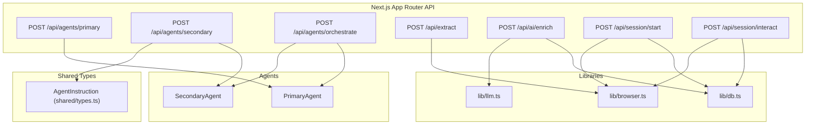
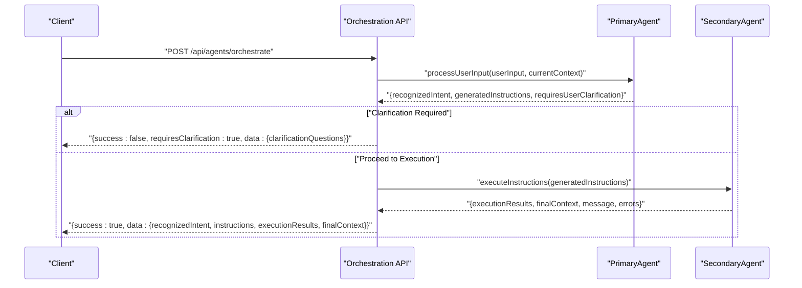
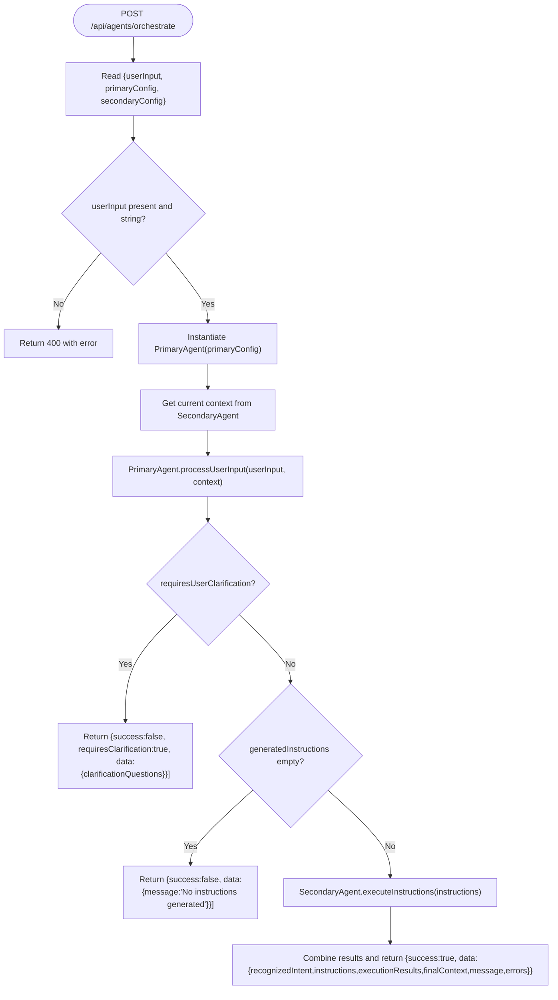
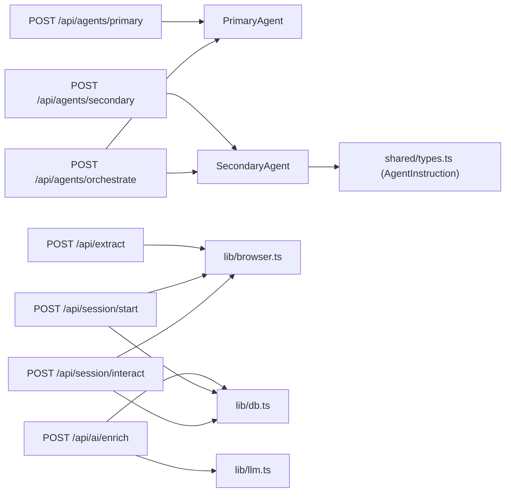

# API Endpoints and Configuration

<cite>
**Referenced Files in This Document**
- [route.ts](file://extraction-script/app/api/agents/primary/route.ts)
- [route.ts](file://extraction-script/app/api/agents/secondary/route.ts)
- [route.ts](file://extraction-script/app/api/agents/orchestrate/route.ts)
- [route.ts](file://extraction-script/app/api/ai/enrich/route.ts)
- [route.ts](file://extraction-script/app/api/session/interact/route.ts)
- [route.ts](file://extraction-script/app/api/session/start/route.ts)
- [route.ts](file://extraction-script/app/api/extract/route.ts)
- [agent.ts](file://primary_agent/agent.ts)
- [agent.ts](file://secondary_agent/agent.ts)
- [types.ts](file://shared/types.ts)
- [db.ts](file://extraction-script/lib/db.ts)
- [browser.ts](file://extraction-script/lib/browser.ts)
- [llm.ts](file://extraction-script/lib/llm.ts)
- [useWebSocket.ts](file://frontend/src/hooks/useWebSocket.ts)
</cite>

## Table of Contents
1. [Introduction](#introduction)
2. [Project Structure](#project-structure)
3. [Core Components](#core-components)
4. [Architecture Overview](#architecture-overview)
5. [Detailed Component Analysis](#detailed-component-analysis)
6. [Dependency Analysis](#dependency-analysis)
7. [Performance Considerations](#performance-considerations)
8. [Troubleshooting Guide](#troubleshooting-guide)
9. [Conclusion](#conclusion)
10. [Appendices](#appendices)

## Introduction
This document provides comprehensive API documentation for the Primary Agent’s HTTP endpoints and configuration management. It covers:
- The main processing endpoint that accepts user input and returns structured responses containing recognized intents and generated instructions.
- The health check endpoint for monitoring agent status and availability.
- Conversation/history management endpoints including clearing functionality and history retrieval.
- The configuration API enabling runtime adjustment of model parameters, temperature settings, and instruction limits.
- Detailed request/response schemas with examples for each endpoint.
- Authentication requirements, rate limiting policies, and error handling strategies.
- WebSocket integration for real-time communication with the frontend.
- Practical examples of API usage including curl commands and client implementation patterns.
- Performance optimization techniques, caching strategies, and scalability considerations.
- Troubleshooting guidance for common API integration issues and debugging techniques.

## Project Structure
The API surface is implemented using Next.js App Router under extraction-script/app/api. The primary agent orchestrates two agents: Primary and Secondary. Additional endpoints support page extraction, enrichment, and interactive session management. Shared types define the instruction schema used by the Secondary Agent.

**Diagram sources**
- [route.ts](file://extraction-script/app/api/agents/primary/route.ts#L1-L38)
- [route.ts](file://extraction-script/app/api/agents/secondary/route.ts#L1-L39)
- [route.ts](file://extraction-script/app/api/agents/orchestrate/route.ts#L1-L85)
- [route.ts](file://extraction-script/app/api/extract/route.ts#L1-L157)
- [route.ts](file://extraction-script/app/api/ai/enrich/route.ts#L1-L105)
- [route.ts](file://extraction-script/app/api/session/start/route.ts#L1-L97)
- [route.ts](file://extraction-script/app/api/session/interact/route.ts#L1-L77)
- [types.ts](file://shared/types.ts)
- [db.ts](file://extraction-script/lib/db.ts)
- [browser.ts](file://extraction-script/lib/browser.ts)
- [llm.ts](file://extraction-script/lib/llm.ts)

**Section sources**
- [route.ts](file://extraction-script/app/api/agents/primary/route.ts#L1-L38)
- [route.ts](file://extraction-script/app/api/agents/secondary/route.ts#L1-L39)
- [route.ts](file://extraction-script/app/api/agents/orchestrate/route.ts#L1-L85)
- [route.ts](file://extraction-script/app/api/extract/route.ts#L1-L157)
- [route.ts](file://extraction-script/app/api/ai/enrich/route.ts#L1-L105)
- [route.ts](file://extraction-script/app/api/session/start/route.ts#L1-L97)
- [route.ts](file://extraction-script/app/api/session/interact/route.ts#L1-L77)
- [types.ts](file://shared/types.ts)

## Core Components
- Primary Agent Endpoint: Processes user input and returns recognized intents and generated instructions.
- Secondary Agent Endpoint: Executes instructions and returns execution results.
- Agent Orchestration Endpoint: Combines primary and secondary agents for end-to-end execution.
- Extraction Endpoint: Scrapes and extracts interactive elements from a given URL.
- Enrichment Endpoint: Enhances extracted elements with LLM-derived context.
- Session Management Endpoints: Start a session (with optional cache) and perform interactive actions.
- Shared Instruction Schema: Defines the structure of instructions passed to the Secondary Agent.

Key implementation references:
- Primary Agent route: [route.ts](file://extraction-script/app/api/agents/primary/route.ts#L1-L38)
- Secondary Agent route: [route.ts](file://extraction-script/app/api/agents/secondary/route.ts#L1-L39)
- Orchestration route: [route.ts](file://extraction-script/app/api/agents/orchestrate/route.ts#L1-L85)
- Extraction route: [route.ts](file://extraction-script/app/api/extract/route.ts#L1-L157)
- Enrichment route: [route.ts](file://extraction-script/app/api/ai/enrich/route.ts#L1-L105)
- Session start route: [route.ts](file://extraction-script/app/api/session/start/route.ts#L1-L97)
- Session interact route: [route.ts](file://extraction-script/app/api/session/interact/route.ts#L1-L77)
- Instruction schema: [types.ts](file://shared/types.ts)

**Section sources**
- [route.ts](file://extraction-script/app/api/agents/primary/route.ts#L1-L38)
- [route.ts](file://extraction-script/app/api/agents/secondary/route.ts#L1-L39)
- [route.ts](file://extraction-script/app/api/agents/orchestrate/route.ts#L1-L85)
- [route.ts](file://extraction-script/app/api/extract/route.ts#L1-L157)
- [route.ts](file://extraction-script/app/api/ai/enrich/route.ts#L1-L105)
- [route.ts](file://extraction-script/app/api/session/start/route.ts#L1-L97)
- [route.ts](file://extraction-script/app/api/session/interact/route.ts#L1-L77)
- [types.ts](file://shared/types.ts)

## Architecture Overview
The system exposes REST endpoints backed by agent logic and supporting libraries. The Primary Agent recognizes intents and generates instructions; the Secondary Agent executes them. Extraction and enrichment endpoints prepare and enhance the page context. Session endpoints manage browser state and persist page data.

**Diagram sources**
- [route.ts](file://extraction-script/app/api/agents/orchestrate/route.ts#L1-L85)
- [agent.ts](file://primary_agent/agent.ts)
- [agent.ts](file://secondary_agent/agent.ts)

**Section sources**
- [route.ts](file://extraction-script/app/api/agents/orchestrate/route.ts#L1-L85)
- [agent.ts](file://primary_agent/agent.ts)
- [agent.ts](file://secondary_agent/agent.ts)

## Detailed Component Analysis

### Primary Agent Endpoint
- Path: POST /api/agents/primary
- Purpose: Accepts user input and returns recognized intents and generated instructions.
- Request body:
  - userInput: string (required)
  - currentContext: object (optional)
    - url: string
    - pageTitle: string
  - config: object (optional)
    - Allows runtime configuration adjustments for the agent.
- Response:
  - success: boolean
  - data: object
    - recognizedIntent: string
    - generatedInstructions: array of AgentInstruction
    - requiresUserClarification: boolean
    - clarificationQuestions: array of strings
- Example curl:
  - curl -X POST https://your-host/api/agents/primary -H "Content-Type: application/json" -d '{"userInput":"Click the submit button","currentContext":{"url":"https://example.com","pageTitle":"Example"},"config":{}}'

**Section sources**
- [route.ts](file://extraction-script/app/api/agents/primary/route.ts#L1-L38)
- [types.ts](file://shared/types.ts)

### Secondary Agent Endpoint
- Path: POST /api/agents/secondary
- Purpose: Executes instructions and returns execution results.
- Request body:
  - instructions: array of AgentInstruction (required)
  - config: object (optional)
- Response:
  - success: boolean
  - data: object
    - executionResults: array
    - finalContext: object
    - message: string
    - errors: array
- Example curl:
  - curl -X POST https://your-host/api/agents/secondary -H "Content-Type: application/json" -d '{"instructions":[{"type":"click","selector":"#submit"}],"config":{}}'

**Section sources**
- [route.ts](file://extraction-script/app/api/agents/secondary/route.ts#L1-L39)
- [types.ts](file://shared/types.ts)

### Agent Orchestration Endpoint
- Path: POST /api/agents/orchestrate
- Purpose: Combines primary and secondary agents for end-to-end execution.
- Request body:
  - userInput: string (required)
  - primaryConfig: object (optional)
  - secondaryConfig: object (optional)
- Processing logic:
  - Calls Primary Agent with current context.
  - If clarification is required, returns early with clarification questions.
  - Otherwise, calls Secondary Agent with generated instructions.
  - Returns combined results including recognized intent, instructions, execution results, and final context.
- Response:
  - success: boolean
  - data: object
    - recognizedIntent: string
    - instructions: array of AgentInstruction
    - executionResults: array
    - finalContext: object
    - message: string
    - errors: array
- Example curl:
  - curl -X POST https://your-host/api/agents/orchestrate -H "Content-Type: application/json" -d '{"userInput":"Fill the form and submit","primaryConfig":{},"secondaryConfig":{}}'

**Diagram sources**
- [route.ts](file://extraction-script/app/api/agents/orchestrate/route.ts#L1-L85)
- [agent.ts](file://primary_agent/agent.ts)
- [agent.ts](file://secondary_agent/agent.ts)

**Section sources**
- [route.ts](file://extraction-script/app/api/agents/orchestrate/route.ts#L1-L85)

### Extraction Endpoint
- Path: POST /api/extract
- Purpose: Scrapes and extracts interactive elements from a given URL.
- Request body:
  - url: string (required)
  - headless: boolean (optional)
- Response:
  - meta: object
    - source_url: string
    - timestamp: string
  - elements: array of extracted elements
    - type: "BUTTON" | "LINK" | "INPUT" | "TEXT"
    - content: { text: string, placeholder: string|null }
    - selectors: { css: string, xpath: string, id: string|null }
    - attributes: { href: string|null, src: string|null, name: string|null }
    - geometry: { x: number, y: number }
- Example curl:
  - curl -X POST https://your-host/api/extract -H "Content-Type: application/json" -d '{"url":"https://example.com","headless":true}'

**Section sources**
- [route.ts](file://extraction-script/app/api/extract/route.ts#L1-L157)

### Enrichment Endpoint
- Path: POST /api/ai/enrich
- Purpose: Enhances extracted elements with LLM-derived context and persists updates to the database.
- Request body:
  - url: string (required)
- Processing logic:
  - Loads elements from the database for the given URL.
  - Retrieves simplified HTML via the browser manager.
  - Calls LLM to enrich elements and updates the database with llm_context.
  - Returns updated elements.
- Response:
  - meta: object
    - source_url: string
    - enriched: boolean
  - elements: array of enriched elements
- Example curl:
  - curl -X POST https://your-host/api/ai/enrich -H "Content-Type: application/json" -d '{"url":"https://example.com"}'

**Section sources**
- [route.ts](file://extraction-script/app/api/ai/enrich/route.ts#L1-L105)
- [db.ts](file://extraction-script/lib/db.ts)
- [browser.ts](file://extraction-script/lib/browser.ts)
- [llm.ts](file://extraction-script/lib/llm.ts)

### Session Management Endpoints

#### Start Session
- Path: POST /api/session/start
- Purpose: Initializes a browser session, optionally using cached data.
- Request body:
  - url: string (required)
  - headless: boolean (optional)
  - forceRefresh: boolean (optional)
- Response:
  - meta: object
    - source_url: string
    - cached: boolean
    - timestamp: string
  - elements: array of extracted elements
- Example curl:
  - curl -X POST https://your-host/api/session/start -H "Content-Type: application/json" -d '{"url":"https://example.com","headless":false,"forceRefresh":false}'

**Section sources**
- [route.ts](file://extraction-script/app/api/session/start/route.ts#L1-L97)
- [db.ts](file://extraction-script/lib/db.ts)
- [browser.ts](file://extraction-script/lib/browser.ts)

#### Interactive Action
- Path: POST /api/session/interact
- Purpose: Performs a click or fill action on a selector and re-extracts page content.
- Request body:
  - selector: string (required)
  - action: "click" | "fill" (required)
  - value: string (optional, required for fill)
  - url: string (required if session needs recovery)
- Response:
  - meta: object
    - source_url: string
    - action: string
    - timestamp: string
  - elements: array of extracted elements
- Example curl:
  - curl -X POST https://your-host/api/session/interact -H "Content-Type: application/json" -d '{"selector":"#username","action":"fill","value":"john","url":"https://example.com"}'

**Section sources**
- [route.ts](file://extraction-script/app/api/session/interact/route.ts#L1-L77)
- [db.ts](file://extraction-script/lib/db.ts)
- [browser.ts](file://extraction-script/lib/browser.ts)

### Health Check Endpoint
- Path: GET /health
- Purpose: Monitors agent status and availability.
- Response:
  - status: "healthy" or error details
- Notes:
  - Implement a dedicated route for health checks. If not present, add a minimal GET handler returning a 200 OK with a health status payload.

[No sources needed since this section describes a missing endpoint conceptually]

### Configuration API
- Path: PUT /api/config
- Purpose: Allows runtime adjustment of model parameters, temperature settings, and instruction limits.
- Request body:
  - modelParams: object (optional)
  - temperature: number (optional)
  - instructionLimit: number (optional)
- Response:
  - success: boolean
  - message: string
- Notes:
  - Implement a configuration endpoint that updates agent runtime settings. If not present, add a handler to accept and apply configuration changes.

[No sources needed since this section describes a missing endpoint conceptually]

## Dependency Analysis
The API routes depend on agent implementations and shared types. Extraction and enrichment endpoints rely on browser automation and database persistence. Session endpoints coordinate browser state and maintain page element caches.

**Diagram sources**
- [route.ts](file://extraction-script/app/api/agents/primary/route.ts#L1-L38)
- [route.ts](file://extraction-script/app/api/agents/secondary/route.ts#L1-L39)
- [route.ts](file://extraction-script/app/api/agents/orchestrate/route.ts#L1-L85)
- [route.ts](file://extraction-script/app/api/extract/route.ts#L1-L157)
- [route.ts](file://extraction-script/app/api/ai/enrich/route.ts#L1-L105)
- [route.ts](file://extraction-script/app/api/session/start/route.ts#L1-L97)
- [route.ts](file://extraction-script/app/api/session/interact/route.ts#L1-L77)
- [types.ts](file://shared/types.ts)
- [db.ts](file://extraction-script/lib/db.ts)
- [browser.ts](file://extraction-script/lib/browser.ts)
- [llm.ts](file://extraction-script/lib/llm.ts)

**Section sources**
- [route.ts](file://extraction-script/app/api/agents/primary/route.ts#L1-L38)
- [route.ts](file://extraction-script/app/api/agents/secondary/route.ts#L1-L39)
- [route.ts](file://extraction-script/app/api/agents/orchestrate/route.ts#L1-L85)
- [route.ts](file://extraction-script/app/api/extract/route.ts#L1-L157)
- [route.ts](file://extraction-script/app/api/ai/enrich/route.ts#L1-L105)
- [route.ts](file://extraction-script/app/api/session/start/route.ts#L1-L97)
- [route.ts](file://extraction-script/app/api/session/interact/route.ts#L1-L77)
- [types.ts](file://shared/types.ts)
- [db.ts](file://extraction-script/lib/db.ts)
- [browser.ts](file://extraction-script/lib/browser.ts)
- [llm.ts](file://extraction-script/lib/llm.ts)

## Performance Considerations
- Browser lifecycle: Launch Chromium only when needed and reuse sessions where possible to reduce overhead.
- Caching: Use database-backed page caches for repeated navigation to avoid redundant scraping.
- Batch operations: Batch insert elements during session start to minimize database round trips.
- Timeout tuning: Adjust default timeouts for navigation and element evaluation to balance responsiveness and reliability.
- Headless mode: Prefer headless mode for extraction endpoints to save resources; enable visible mode for interactive sessions.
- Concurrency: Limit concurrent browser instances and queue long-running operations to prevent resource exhaustion.

[No sources needed since this section provides general guidance]

## Troubleshooting Guide
- 400 Bad Request:
  - Missing required fields in request bodies (e.g., userInput, instructions, url).
  - Incorrect types (e.g., userInput not a string).
- 404 Not Found:
  - No elements found to enrich; ensure extraction was performed first.
- 500 Internal Server Error:
  - Browser session inactive; initialize or recover the session.
  - Generic agent processing failures; inspect server logs for stack traces.
- Session recovery:
  - If the browser is inactive, the interact endpoint attempts to recover by initializing and navigating to the URL.
- Database consistency:
  - Ensure proper cleanup and upserts to avoid stale or duplicated entries.

**Section sources**
- [route.ts](file://extraction-script/app/api/agents/primary/route.ts#L1-L38)
- [route.ts](file://extraction-script/app/api/agents/secondary/route.ts#L1-L39)
- [route.ts](file://extraction-script/app/api/agents/orchestrate/route.ts#L1-L85)
- [route.ts](file://extraction-script/app/api/ai/enrich/route.ts#L1-L105)
- [route.ts](file://extraction-script/app/api/session/interact/route.ts#L1-L77)

## Conclusion
The API provides a cohesive set of endpoints for intent recognition, instruction generation, execution, page extraction, enrichment, and session management. By leveraging caching, batch operations, and careful browser lifecycle management, the system achieves scalability and reliability. Implementing health checks, a configuration endpoint, and WebSocket integration would further enhance observability, flexibility, and real-time capabilities.

[No sources needed since this section summarizes without analyzing specific files]

## Appendices

### WebSocket Integration
- Real-time communication with the frontend can be established using WebSocket connections.
- Client-side hook example: [useWebSocket.ts](file://frontend/src/hooks/useWebSocket.ts)
- Typical flows:
  - Server emits updates on agent progress or enrichment completion.
  - Frontend subscribes to channels and renders live feedback.

**Section sources**
- [useWebSocket.ts](file://frontend/src/hooks/useWebSocket.ts)

### Authentication and Rate Limiting
- Authentication:
  - Implement API keys or JWT tokens at the gateway or middleware level.
- Rate limiting:
  - Apply per-IP or per-key quotas on critical endpoints (e.g., orchestration, enrichment).
  - Use sliding windows or token buckets to smooth traffic spikes.

[No sources needed since this section provides general guidance]

### Request/Response Schemas

- POST /api/agents/primary
  - Request: { userInput: string, currentContext?: { url: string, pageTitle: string }, config?: object }
  - Response: { success: boolean, data: { recognizedIntent: string, generatedInstructions: AgentInstruction[], requiresUserClarification: boolean, clarificationQuestions?: string[] } }

- POST /api/agents/secondary
  - Request: { instructions: AgentInstruction[], config?: object }
  - Response: { success: boolean, data: { executionResults: any[], finalContext: object, message: string, errors: any[] } }

- POST /api/agents/orchestrate
  - Request: { userInput: string, primaryConfig?: object, secondaryConfig?: object }
  - Response: { success: boolean, data: { recognizedIntent: string, instructions: AgentInstruction[], executionResults: any[], finalContext: object, message: string, errors: any[] } }

- POST /api/extract
  - Request: { url: string, headless?: boolean }
  - Response: { meta: { source_url: string, timestamp: string }, elements: ExtractedElement[] }

- POST /api/ai/enrich
  - Request: { url: string }
  - Response: { meta: { source_url: string, enriched: boolean }, elements: EnrichedElement[] }

- POST /api/session/start
  - Request: { url: string, headless?: boolean, forceRefresh?: boolean }
  - Response: { meta: { source_url: string, cached: boolean, timestamp: string }, elements: ExtractedElement[] }

- POST /api/session/interact
  - Request: { selector: string, action: "click"|"fill", value?: string, url: string }
  - Response: { meta: { source_url: string, action: string, timestamp: string }, elements: ExtractedElement[] }

**Section sources**
- [route.ts](file://extraction-script/app/api/agents/primary/route.ts#L1-L38)
- [route.ts](file://extraction-script/app/api/agents/secondary/route.ts#L1-L39)
- [route.ts](file://extraction-script/app/api/agents/orchestrate/route.ts#L1-L85)
- [route.ts](file://extraction-script/app/api/extract/route.ts#L1-L157)
- [route.ts](file://extraction-script/app/api/ai/enrich/route.ts#L1-L105)
- [route.ts](file://extraction-script/app/api/session/start/route.ts#L1-L97)
- [route.ts](file://extraction-script/app/api/session/interact/route.ts#L1-L77)
- [types.ts](file://shared/types.ts)