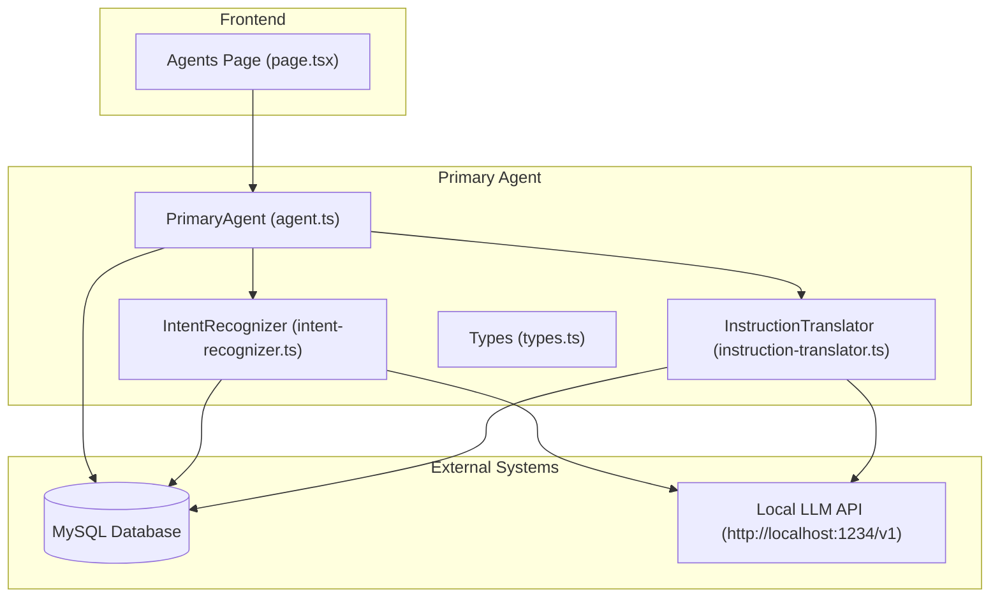
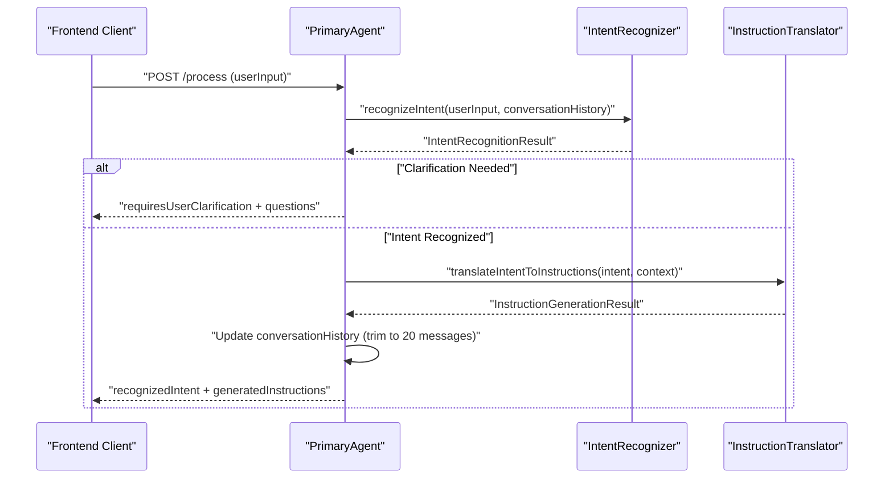
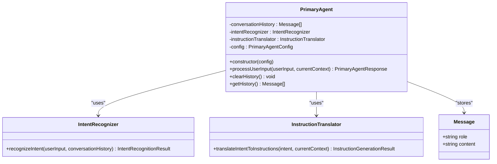
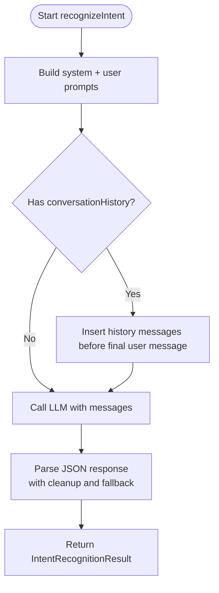
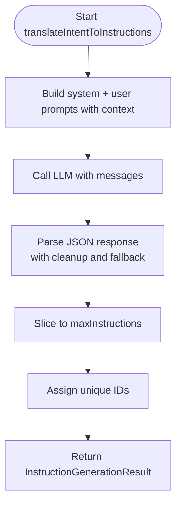
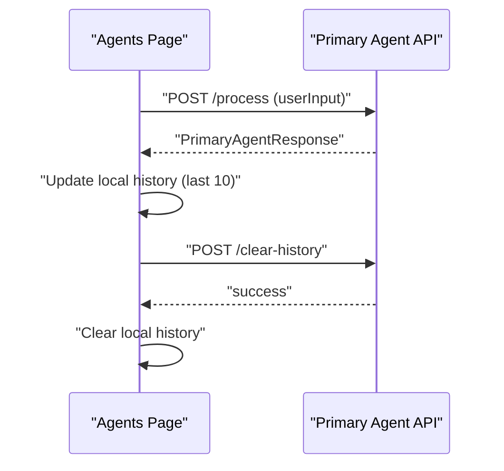
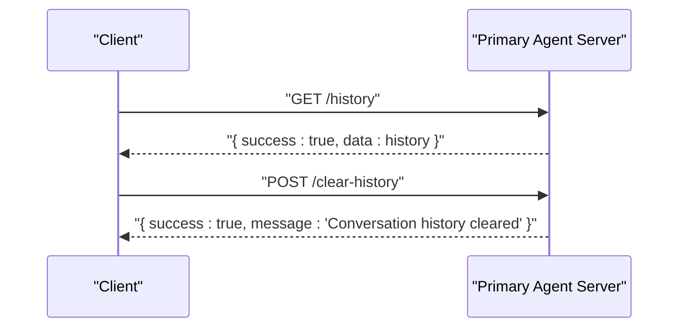
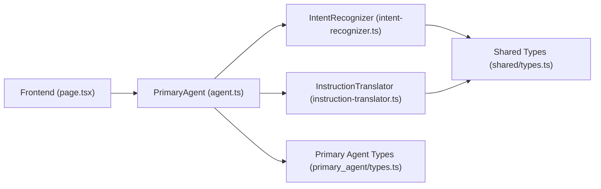

# Conversation History Management

<cite>
**Referenced Files in This Document**
- [agent.ts](file://primary_agent/agent.ts)
- [intent-recognizer.ts](file://primary_agent/intent-recognizer.ts)
- [instruction-translator.ts](file://primary_agent/instruction-translator.ts)
- [types.ts](file://primary_agent/types.ts)
- [types.ts](file://shared/types.ts)
- [route.ts](file://extraction-script/app/api/session/interact/route.ts)
- [route.ts](file://extraction-script/app/api/session/start/route.ts)
- [page.tsx](file://extraction-script/app/agents/page.tsx)
- [server.ts](file://primary_agent/server.ts)
</cite>

## Table of Contents
1. [Introduction](#introduction)
2. [Project Structure](#project-structure)
3. [Core Components](#core-components)
4. [Architecture Overview](#architecture-overview)
5. [Detailed Component Analysis](#detailed-component-analysis)
6. [Dependency Analysis](#dependency-analysis)
7. [Performance Considerations](#performance-considerations)
8. [Troubleshooting Guide](#troubleshooting-guide)
9. [Privacy and Security Considerations](#privacy-and-security-considerations)
10. [Integration with External Storage](#integration-with-external-storage)
11. [Conclusion](#conclusion)

## Introduction
This document explains the conversation history management system within the Primary Agent. It covers how the agent maintains context across multiple user interactions, manages memory to prevent unbounded growth, represents conversation state, integrates with intent recognition and instruction translation, preserves important context while filtering irrelevant information, and exposes APIs for accessing and managing conversation history. It also includes practical examples of how history improves intent recognition accuracy and outlines privacy considerations and secure handling guidelines.

## Project Structure
The conversation history system spans three layers:
- Primary Agent core: Maintains in-memory conversation history and orchestrates intent recognition and instruction translation.
- Intent Recognition module: Consumes conversation history to improve intent understanding.
- Instruction Translation module: Uses recognized intent and context to produce executable instructions.
- Frontend client: Submits user input and displays recent interactions.
- Backend API endpoints: Provide programmatic access to clear and retrieve history.

**Diagram sources**
- [agent.ts](file://primary_agent/agent.ts#L9-L32)
- [intent-recognizer.ts](file://primary_agent/intent-recognizer.ts#L13-L20)
- [instruction-translator.ts](file://primary_agent/instruction-translator.ts#L13-L22)
- [page.tsx](file://extraction-script/app/agents/page.tsx#L62-L115)

**Section sources**
- [agent.ts](file://primary_agent/agent.ts#L1-L106)
- [intent-recognizer.ts](file://primary_agent/intent-recognizer.ts#L1-L149)
- [instruction-translator.ts](file://primary_agent/instruction-translator.ts#L1-L178)
- [page.tsx](file://extraction-script/app/agents/page.tsx#L62-L115)

## Core Components
- PrimaryAgent: Central orchestrator maintaining conversation history, invoking intent recognition, and generating instructions. It enforces memory limits and exposes clear/get history operations.
- IntentRecognizer: Parses user input with optional conversation history to extract intent, entities, and context.
- InstructionTranslator: Converts recognized intent into executable instructions for the secondary agent.
- Shared Types: Define the structure for intents, instructions, and context used across modules.
- Frontend Integration: Submits user requests and displays recent interactions.
- Backend API: Provides endpoints to manage conversation history programmatically.

**Section sources**
- [agent.ts](file://primary_agent/agent.ts#L9-L32)
- [intent-recognizer.ts](file://primary_agent/intent-recognizer.ts#L13-L20)
- [instruction-translator.ts](file://primary_agent/instruction-translator.ts#L13-L22)
- [types.ts](file://shared/types.ts#L3-L85)

## Architecture Overview
The Primary Agent coordinates two specialized modules:
- Intent Recognition consumes conversation history to refine intent understanding.
- Instruction Translation transforms the intent into actionable steps for the secondary agent.
- Memory management trims history to a fixed window to keep processing efficient.
- The frontend interacts via a simple API to submit requests and optionally clear history.

**Diagram sources**
- [agent.ts](file://primary_agent/agent.ts#L37-L89)
- [intent-recognizer.ts](file://primary_agent/intent-recognizer.ts#L22-L129)
- [instruction-translator.ts](file://primary_agent/instruction-translator.ts#L24-L127)

## Detailed Component Analysis

### PrimaryAgent: Conversation History Management
- State representation: Stores an array of message-like objects with role and content.
- Memory management: Automatically trims history to a fixed window (20 messages) after updates.
- Integration points:
  - Passes history to IntentRecognizer for improved intent understanding.
  - Updates history after successful intent recognition and instruction generation.
  - Exposes clearHistory() and getHistory() for programmatic management.

**Diagram sources**
- [agent.ts](file://primary_agent/agent.ts#L9-L32)
- [agent.ts](file://primary_agent/agent.ts#L13)
- [types.ts](file://primary_agent/types.ts#L23-L30)

**Section sources**
- [agent.ts](file://primary_agent/agent.ts#L13-L32)
- [agent.ts](file://primary_agent/agent.ts#L40-L89)
- [agent.ts](file://primary_agent/agent.ts#L94-L103)

### IntentRecognizer: History-Aware Intent Understanding
- Consumes conversation history to enrich intent extraction.
- Inserts history messages into the LLM prompt before the final user message.
- Robust JSON parsing with fallback logic to handle malformed responses.
- Includes a fallback strategy when LLM parsing fails.

**Diagram sources**
- [intent-recognizer.ts](file://primary_agent/intent-recognizer.ts#L22-L129)

**Section sources**
- [intent-recognizer.ts](file://primary_agent/intent-recognizer.ts#L22-L129)

### InstructionTranslator: Context-Driven Instruction Generation
- Translates recognized intent into executable instructions for the secondary agent.
- Uses current context (URL, page title) to tailor instructions.
- Enforces a maximum number of instructions and assigns unique IDs.
- Includes a fallback mechanism when LLM parsing fails.

**Diagram sources**
- [instruction-translator.ts](file://primary_agent/instruction-translator.ts#L24-L127)

**Section sources**
- [instruction-translator.ts](file://primary_agent/instruction-translator.ts#L24-L127)

### Frontend Integration: User Interactions and History Display
- Submits user input to the Primary Agent endpoint.
- Displays recent interactions (last 10) with timestamps and intent labels.
- Clears local history and triggers server-side history clearing via API.

**Diagram sources**
- [page.tsx](file://extraction-script/app/agents/page.tsx#L62-L115)
- [server.ts](file://primary_agent/server.ts#L163-L201)

**Section sources**
- [page.tsx](file://extraction-script/app/agents/page.tsx#L62-L115)

### Backend API Endpoints for History Management
- GET /history: Returns the current conversation history.
- POST /clear-history: Clears the conversation history.
- POST /process: Processes user input and returns intent + instructions (updates history internally).

**Diagram sources**
- [server.ts](file://primary_agent/server.ts#L163-L201)

**Section sources**
- [server.ts](file://primary_agent/server.ts#L163-L201)

## Dependency Analysis
- PrimaryAgent depends on IntentRecognizer and InstructionTranslator.
- Both modules depend on a local LLM API endpoint.
- Shared types define the contract for intents and instructions.
- Frontend depends on Primary Agent endpoints for processing and history management.

**Diagram sources**
- [agent.ts](file://primary_agent/agent.ts#L4-L7)
- [intent-recognizer.ts](file://primary_agent/intent-recognizer.ts#L4-L6)
- [instruction-translator.ts](file://primary_agent/instruction-translator.ts#L4-L6)
- [types.ts](file://shared/types.ts#L3-L85)
- [types.ts](file://primary_agent/types.ts#L3-L31)
- [page.tsx](file://extraction-script/app/agents/page.tsx#L62-L115)

**Section sources**
- [agent.ts](file://primary_agent/agent.ts#L4-L7)
- [intent-recognizer.ts](file://primary_agent/intent-recognizer.ts#L4-L6)
- [instruction-translator.ts](file://primary_agent/instruction-translator.ts#L4-L6)
- [types.ts](file://shared/types.ts#L3-L85)
- [types.ts](file://primary_agent/types.ts#L3-L31)
- [page.tsx](file://extraction-script/app/agents/page.tsx#L62-L115)

## Performance Considerations
- Fixed-size history window: The agent trims history to 20 messages after each update, preventing unbounded memory growth.
- Prompt construction: History insertion occurs before the final user message to minimize token overhead while preserving context.
- LLM parsing robustness: Both modules include JSON cleanup and fallback strategies to reduce retries and failures.
- Frontend history display: Local UI keeps only the last 10 interactions to avoid heavy DOM rendering.

**Section sources**
- [agent.ts](file://primary_agent/agent.ts#L72-L75)
- [intent-recognizer.ts](file://primary_agent/intent-recognizer.ts#L67-L71)
- [page.tsx](file://extraction-script/app/agents/page.tsx#L88-L91)

## Troubleshooting Guide
- Intent recognition failures:
  - Symptom: Clarification is requested or fallback is used.
  - Action: Verify LLM endpoint availability and network connectivity; review JSON parsing fallback behavior.
- Instruction translation failures:
  - Symptom: Fallback instructions are returned.
  - Action: Inspect LLM response formatting; confirm intent structure and current context are provided.
- History not clearing:
  - Symptom: /clear-history returns success but history persists.
  - Action: Confirm server endpoint is reachable and agent.clearHistory() is invoked; check for frontend local state synchronization.
- Frontend history not updating:
  - Symptom: UI shows stale entries.
  - Action: Ensure POST /process updates local history slice and that POST /clear-history clears both local and server history.

**Section sources**
- [intent-recognizer.ts](file://primary_agent/intent-recognizer.ts#L114-L128)
- [instruction-translator.ts](file://primary_agent/instruction-translator.ts#L118-L126)
- [server.ts](file://primary_agent/server.ts#L163-L201)
- [page.tsx](file://extraction-script/app/agents/page.tsx#L62-L115)

## Privacy and Security Considerations
- Data minimization: History is trimmed to a small window (20 messages) to limit retention.
- Local LLM: Communication occurs locally, reducing exposure of conversation data to external services.
- Secure handling guidelines:
  - Avoid storing sensitive personal data in conversation history.
  - Implement access controls for API endpoints.
  - Consider encryption at rest for persistent storage if enabled externally.
  - Regularly audit logs and monitor for unauthorized access attempts.

[No sources needed since this section provides general guidance]

## Integration with External Storage
- Current state: Conversation history is maintained in-memory within the Primary Agent process.
- Persistent storage integration:
  - Extend PrimaryAgent.clearHistory() and getHistory() to interact with a database or external cache.
  - Store history records with user identifiers and timestamps for retrieval and auditing.
  - Ensure schema normalization for roles and content to preserve structure compatibility.
  - Implement batch writes for history updates to reduce latency during frequent interactions.

[No sources needed since this section provides general guidance]

## Conclusion
The Primary Agent’s conversation history management balances contextual awareness with memory efficiency. By integrating history into intent recognition and instruction translation, the system improves accuracy and user experience. The fixed-size trimming strategy prevents unbounded growth, while explicit APIs enable programmatic control. For production deployments, consider augmenting with secure, persistent storage and robust access controls to meet privacy and compliance requirements.