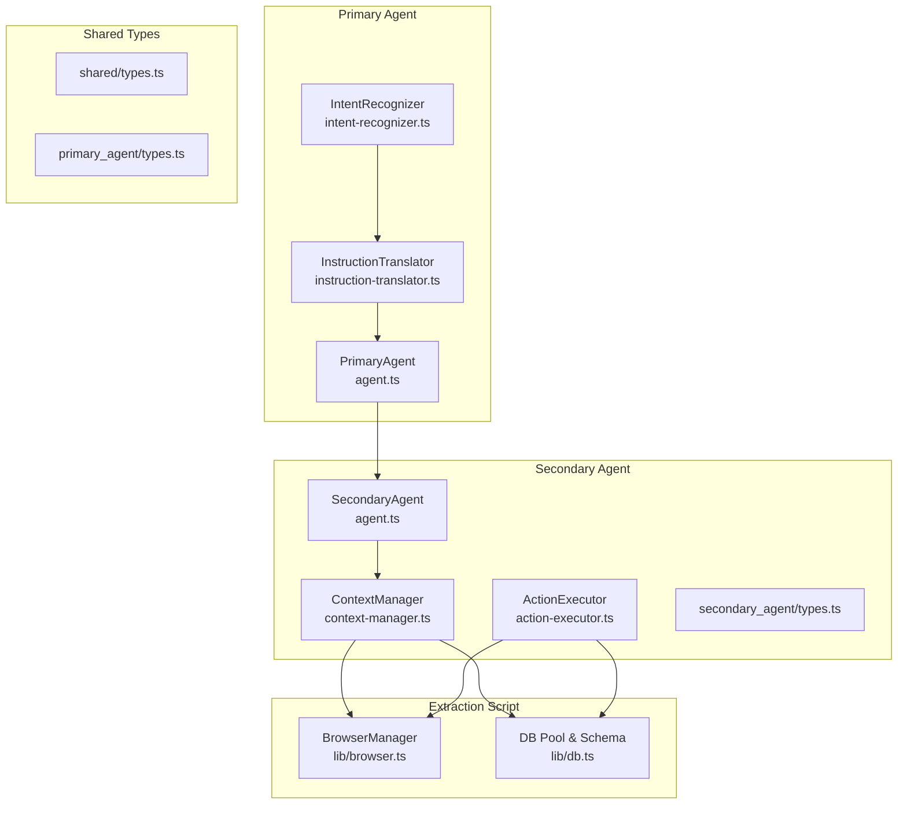
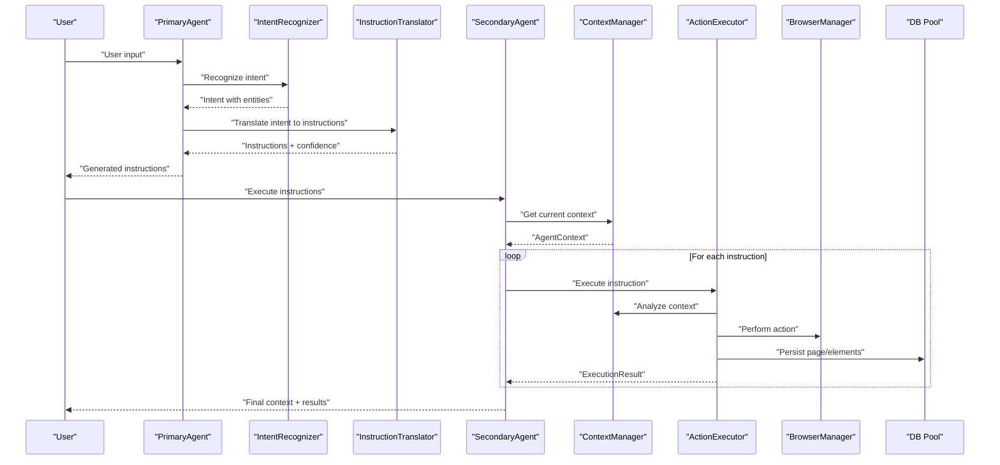
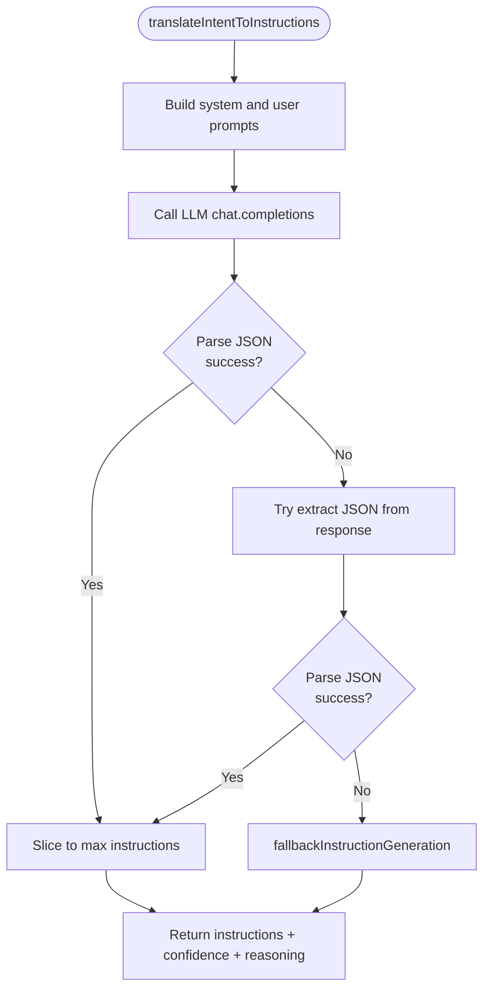
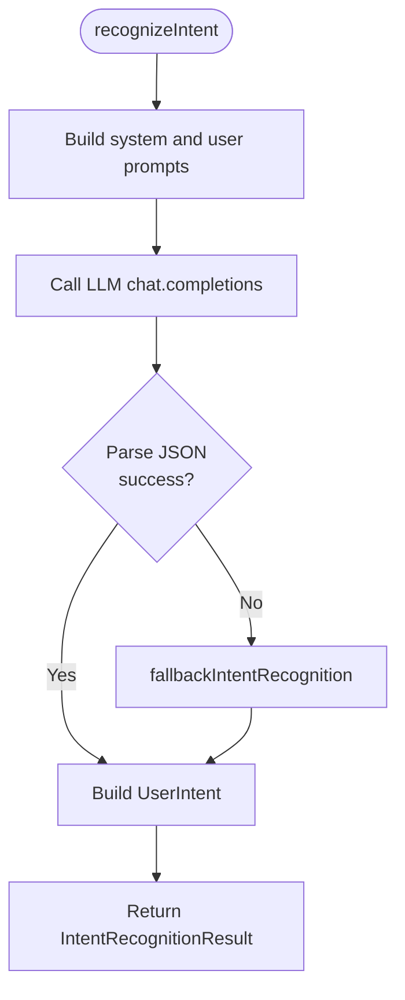
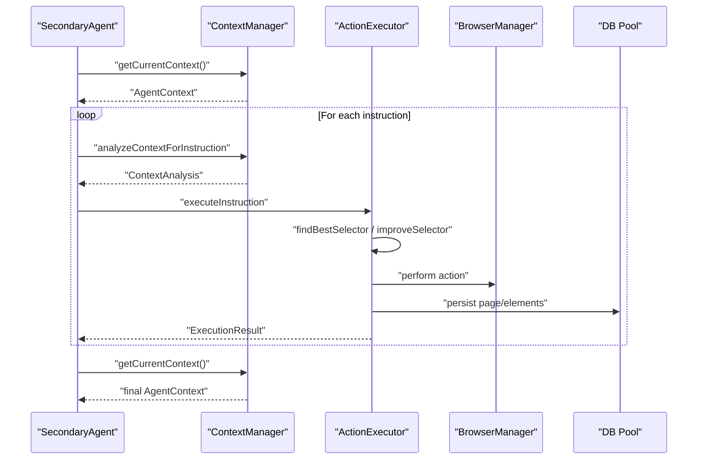
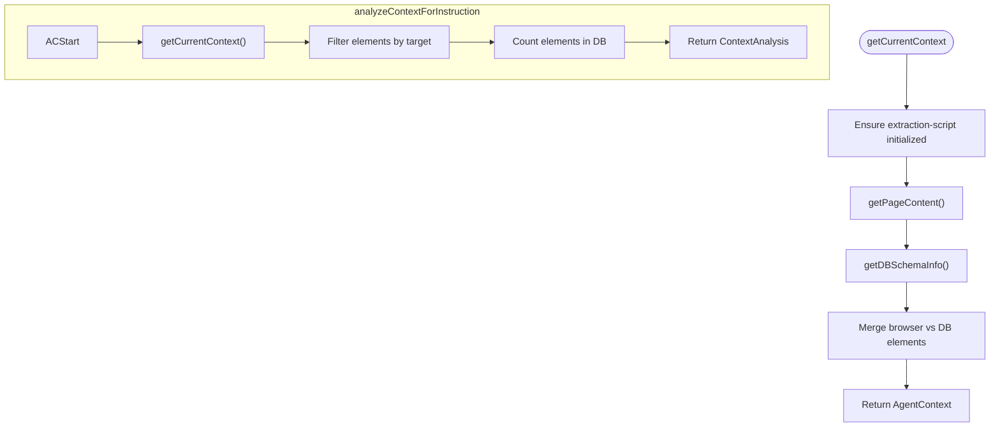
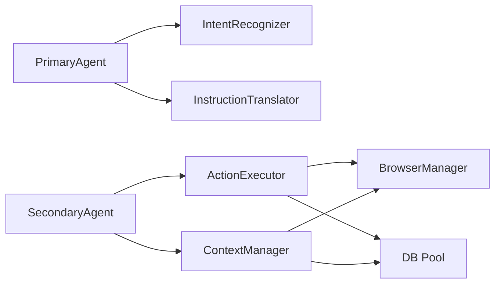

# Instruction Translation Module

<cite>
**Referenced Files in This Document**
- [instruction-translator.ts](file://primary_agent/instruction-translator.ts)
- [types.ts](file://primary_agent/types.ts)
- [shared/types.ts](file://shared/types.ts)
- [agent.ts](file://primary_agent/agent.ts)
- [intent-recognizer.ts](file://primary_agent/intent-recognizer.ts)
- [action-executor.ts](file://secondary_agent/action-executor.ts)
- [context-manager.ts](file://secondary_agent/context-manager.ts)
- [secondary-agent-types.ts](file://secondary_agent/types.ts)
- [secondary-agent-main.ts](file://secondary_agent/agent.ts)
- [browser.ts](file://extraction-script/lib/browser.ts)
- [db.ts](file://extraction-script/lib/db.ts)
</cite>

## Table of Contents
1. [Introduction](#introduction)
2. [Project Structure](#project-structure)
3. [Core Components](#core-components)
4. [Architecture Overview](#architecture-overview)
5. [Detailed Component Analysis](#detailed-component-analysis)
6. [Dependency Analysis](#dependency-analysis)
7. [Performance Considerations](#performance-considerations)
8. [Troubleshooting Guide](#troubleshooting-guide)
9. [Conclusion](#conclusion)
10. [Appendices](#appendices)

## Introduction
This document explains the Instruction Translation module responsible for converting recognized user intents into executable browser automation instructions for the secondary agent. It covers the instruction generation pipeline, supported instruction types, context-aware instruction creation, instruction limits, confidence scoring, validation and error correction, fallback strategies, and optimization guidance for different website types.

## Project Structure
The instruction translation pipeline spans three layers:
- Primary Agent: Recognizes user intent and translates it into structured instructions.
- Shared Types: Define the canonical instruction and context models.
- Secondary Agent: Executes instructions against the browser and database, with context-aware selector resolution and retries.

**Diagram sources**
- [intent-recognizer.ts](file://primary_agent/intent-recognizer.ts#L1-L149)
- [instruction-translator.ts](file://primary_agent/instruction-translator.ts#L1-L178)
- [agent.ts](file://primary_agent/agent.ts#L1-L106)
- [shared/types.ts](file://shared/types.ts#L1-L85)
- [types.ts](file://primary_agent/types.ts#L1-L32)
- [context-manager.ts](file://secondary_agent/context-manager.ts#L1-L223)
- [action-executor.ts](file://secondary_agent/action-executor.ts#L1-L391)
- [secondary-agent-types.ts](file://secondary_agent/types.ts#L1-L37)
- [secondary-agent-main.ts](file://secondary_agent/agent.ts#L1-L119)
- [browser.ts](file://extraction-script/lib/browser.ts#L1-L254)
- [db.ts](file://extraction-script/lib/db.ts#L1-L105)

**Section sources**
- [agent.ts](file://primary_agent/agent.ts#L1-L106)
- [secondary-agent-main.ts](file://secondary_agent/agent.ts#L1-L119)
- [shared/types.ts](file://shared/types.ts#L1-L85)

## Core Components
- InstructionTranslator: Generates structured instructions from recognized intents, enforces instruction limits, and provides confidence scores.
- IntentRecognizer: Parses user input into structured intents with entities and context.
- SecondaryAgent: Orchestrates context retrieval and instruction execution.
- ActionExecutor: Executes instructions against the browser and database, with selector resolution and retry logic.
- ContextManager: Builds context from browser and database, including available elements and DB schema.
- Shared Types: Define AgentInstruction, UserIntent, PageElement, and related structures.

Key capabilities:
- Supported instruction types: navigate, click, fill, extract, wait, scroll.
- Context-awareness: Uses current URL, page title, available elements, and DB state.
- Instruction limit enforcement: Caps instruction sequences to a configurable maximum.
- Confidence scoring: Returns a numeric confidence score for generated instructions.
- Validation and fallback: Robust JSON parsing, fallback instruction generation, and selector improvement via LLM.

**Section sources**
- [instruction-translator.ts](file://primary_agent/instruction-translator.ts#L1-L178)
- [intent-recognizer.ts](file://primary_agent/intent-recognizer.ts#L1-L149)
- [action-executor.ts](file://secondary_agent/action-executor.ts#L1-L391)
- [context-manager.ts](file://secondary_agent/context-manager.ts#L1-L223)
- [shared/types.ts](file://shared/types.ts#L1-L85)

## Architecture Overview
The instruction translation pipeline follows a clear separation of concerns:
- Intent Recognition: Converts raw user input into a structured intent with entities.
- Instruction Generation: Translates the intent into a sequence of AgentInstruction objects with reasoning and priority.
- Context Management: Provides current page state, available elements, and DB schema to the executor.
- Action Execution: Executes instructions with retries, selector refinement, and context updates.

**Diagram sources**
- [agent.ts](file://primary_agent/agent.ts#L37-L89)
- [intent-recognizer.ts](file://primary_agent/intent-recognizer.ts#L22-L129)
- [instruction-translator.ts](file://primary_agent/instruction-translator.ts#L24-L127)
- [secondary-agent-main.ts](file://secondary_agent/agent.ts#L32-L109)
- [context-manager.ts](file://secondary_agent/context-manager.ts#L36-L123)
- [action-executor.ts](file://secondary_agent/action-executor.ts#L53-L110)
- [browser.ts](file://extraction-script/lib/browser.ts#L35-L234)
- [db.ts](file://extraction-script/lib/db.ts#L92-L102)

## Detailed Component Analysis

### InstructionTranslator
Responsibilities:
- Accepts a UserIntent and optional current context (URL, page title).
- Constructs system and user prompts to guide the LLM into generating JSON-formatted instructions.
- Enforces instruction limit via slicing.
- Parses LLM output robustly, handling markdown code blocks and partial JSON.
- Provides confidence and overall reasoning for the instruction set.
- Falls back to deterministic instruction generation when LLM fails.

Supported instruction types:
- navigate(target=URL)
- click(target=selector or element description)
- fill(target=selector, value=text)
- extract(target=optional selector)
- wait(target=timeout in ms or condition)
- scroll(target=direction among up, down, top, bottom)

Instruction limit enforcement:
- Limits the number of instructions to a configurable maximum, ensuring concise plans.

Confidence scoring:
- Returns a numeric confidence score for the generated instruction set.

Validation and error handling:
- Attempts multiple parsing strategies for LLM JSON output.
- On failure, falls back to a basic instruction generator tailored to common intents.

**Diagram sources**
- [instruction-translator.ts](file://primary_agent/instruction-translator.ts#L24-L127)

**Section sources**
- [instruction-translator.ts](file://primary_agent/instruction-translator.ts#L13-L178)
- [types.ts](file://primary_agent/types.ts#L17-L21)
- [shared/types.ts](file://shared/types.ts#L3-L11)

### IntentRecognizer
Responsibilities:
- Parses user input into a structured intent with entities and context.
- Returns a confidence score and flags whether clarification is needed.
- Includes a fallback strategy for basic intent detection.

Supported intents:
- navigate_to_page
- click_element
- fill_form
- extract_data
- search
- wait
- scroll

**Diagram sources**
- [intent-recognizer.ts](file://primary_agent/intent-recognizer.ts#L22-L129)

**Section sources**
- [intent-recognizer.ts](file://primary_agent/intent-recognizer.ts#L13-L149)
- [types.ts](file://primary_agent/types.ts#L11-L15)

### SecondaryAgent and ActionExecutor
Responsibilities:
- SecondaryAgent orchestrates context retrieval and instruction execution.
- ActionExecutor executes each instruction with retries, selector refinement, and context updates.

Supported actions and execution semantics:
- navigate: Navigates to a URL, waits, persists page metadata, and updates context.
- click: Finds the best selector, clicks the element, waits, and updates context.
- fill: Finds the best selector, fills the element, and updates context.
- extract: Captures page content, persists to DB, clears previous elements, inserts new elements, and updates context.
- wait: Waits for a specified timeout or default duration.
- scroll: Scrolls in the specified direction.

Selector resolution and retries:
- findBestSelector tries exact match, text match, relevant elements, and LLM-assisted improvement.
- ActionExecutor retries on selector-related failures and attempts to improve selectors.

**Diagram sources**
- [secondary-agent-main.ts](file://secondary_agent/agent.ts#L32-L109)
- [context-manager.ts](file://secondary_agent/context-manager.ts#L82-L123)
- [action-executor.ts](file://secondary_agent/action-executor.ts#L53-L110)
- [browser.ts](file://extraction-script/lib/browser.ts#L35-L234)
- [db.ts](file://extraction-script/lib/db.ts#L92-L102)

**Section sources**
- [secondary-agent-main.ts](file://secondary_agent/agent.ts#L9-L119)
- [action-executor.ts](file://secondary_agent/action-executor.ts#L29-L391)
- [secondary-agent-types.ts](file://secondary_agent/types.ts#L11-L27)
- [context-manager.ts](file://secondary_agent/context-manager.ts#L23-L223)

### Context-Aware Instruction Creation
ContextManager builds AgentContext from:
- Browser state: current URL, title, and available elements.
- Database schema and page element cache.
- Merges browser elements with DB elements, preferring browser data when available.

ContextAnalysis for instruction execution:
- Filters relevant elements based on instruction target.
- Computes DB element counts per page.
- Flags presence of context for downstream decisions.

**Diagram sources**
- [context-manager.ts](file://secondary_agent/context-manager.ts#L36-L123)
- [browser.ts](file://extraction-script/lib/browser.ts#L125-L215)
- [db.ts](file://extraction-script/lib/db.ts#L17-L102)

**Section sources**
- [context-manager.ts](file://secondary_agent/context-manager.ts#L36-L204)
- [shared/types.ts](file://shared/types.ts#L13-L61)

### Instruction Limit Enforcement
- InstructionTranslator slices the instruction list to a maximum length to prevent overly complex requests.
- The maximum is configurable and defaults to a small number suitable for stepwise automation.

Practical impact:
- Encourages concise, atomic instructions.
- Reduces risk of instruction drift and execution overhead.

**Section sources**
- [instruction-translator.ts](file://primary_agent/instruction-translator.ts#L112-L116)

### Confidence Scoring
- InstructionTranslator returns a confidence score for the generated instruction set.
- PrimaryAgent combines intent confidence with instruction confidence to produce a final confidence measure.
- Lower confidence indicates higher uncertainty or fallback usage.

**Section sources**
- [instruction-translator.ts](file://primary_agent/instruction-translator.ts#L112-L116)
- [agent.ts](file://primary_agent/agent.ts#L77-L83)

### Practical Examples: From Intent to Instructions
Example 1: Navigate to a URL
- Recognized intent: navigate_to_page with entity URL.
- Generated instruction: navigate(target=URL), high priority, reasoning for navigation.

Example 2: Click a button by text
- Recognized intent: click_element with entity button_text.
- Generated instruction: click(target=button_text), high priority, reasoning for clicking.

Example 3: Fill a form field
- Recognized intent: fill_form with entities form_field and input_value.
- Generated instruction: fill(target=selector, value=input_value), high priority, reasoning for filling.

Example 4: Unknown or ambiguous intent
- Generated instruction: extract to understand available actions, medium priority.

These examples illustrate deterministic fallback behavior when LLM parsing fails or when entities are insufficient.

**Section sources**
- [instruction-translator.ts](file://primary_agent/instruction-translator.ts#L129-L175)
- [intent-recognizer.ts](file://primary_agent/intent-recognizer.ts#L131-L146)

### Instruction Validation, Error Correction, and Fallback Strategies
Validation and error correction:
- Robust JSON parsing with markdown code block stripping and JSON substring extraction.
- Retry-based execution with selector improvement for click/fill failures.
- LLM-assisted selector improvement when context analysis suggests ambiguity.

Fallback strategies:
- Basic instruction generation for common intents when LLM fails.
- Fallback to extract when no actionable entities are present.
- ContextManager merges browser and DB data to maximize selector availability.

**Section sources**
- [instruction-translator.ts](file://primary_agent/instruction-translator.ts#L85-L127)
- [action-executor.ts](file://secondary_agent/action-executor.ts#L89-L101)
- [context-manager.ts](file://secondary_agent/context-manager.ts#L61-L71)

### Optimization Guidance for Different Website Types
- Static pages: Fewer retries needed; rely on exact selector matches.
- Dynamic SPAs: Increase wait times and leverage extract actions to capture updated DOM.
- CAPTCHA-heavy sites: Use explicit wait actions and consider manual overrides via backend controls.
- E-commerce: Prefer fill actions with explicit form_field entities; use extract to confirm submission outcomes.
- Forms with complex validation: Use fill followed by extract to verify success or error messages.

[No sources needed since this section provides general guidance]

## Dependency Analysis
The instruction translation module exhibits clean separation of concerns with explicit dependencies:
- PrimaryAgent depends on IntentRecognizer and InstructionTranslator.
- SecondaryAgent depends on ContextManager and ActionExecutor.
- ActionExecutor depends on BrowserManager and DB pool.
- ContextManager depends on BrowserManager and DB pool.

**Diagram sources**
- [agent.ts](file://primary_agent/agent.ts#L9-L32)
- [secondary-agent-main.ts](file://secondary_agent/agent.ts#L9-L27)
- [action-executor.ts](file://secondary_agent/action-executor.ts#L29-L41)
- [context-manager.ts](file://secondary_agent/context-manager.ts#L23-L31)
- [browser.ts](file://extraction-script/lib/browser.ts#L4-L29)
- [db.ts](file://extraction-script/lib/db.ts#L5-L13)

**Section sources**
- [agent.ts](file://primary_agent/agent.ts#L9-L32)
- [secondary-agent-main.ts](file://secondary_agent/agent.ts#L9-L27)
- [action-executor.ts](file://secondary_agent/action-executor.ts#L29-L41)
- [context-manager.ts](file://secondary_agent/context-manager.ts#L23-L31)

## Performance Considerations
- Instruction limit: Keep instruction sequences short to reduce LLM cost and execution time.
- Selector caching: Reuse resolved selectors across similar instructions to minimize LLM calls.
- Wait tuning: Adjust wait timeouts based on site responsiveness to avoid unnecessary delays.
- Database writes: Batch or throttle DB writes during extract actions to reduce overhead.
- Headless vs visible browser: Use visible browser only when needed for debugging; headless improves speed.

[No sources needed since this section provides general guidance]

## Troubleshooting Guide
Common issues and resolutions:
- LLM JSON parsing failures: The translator strips markdown code blocks and attempts JSON substring extraction; if still failing, verify prompt formatting and model compatibility.
- Selector resolution failures: ActionExecutor retries with improved selectors; ensure context analysis includes relevant elements.
- Missing elements in DB: ContextManager merges browser and DB data; if DB is empty, rely on browser extraction.
- Execution errors: SecondaryAgent aggregates errors per instruction and continues; inspect ExecutionResult.error for details.

**Section sources**
- [instruction-translator.ts](file://primary_agent/instruction-translator.ts#L85-L127)
- [action-executor.ts](file://secondary_agent/action-executor.ts#L89-L101)
- [context-manager.ts](file://secondary_agent/context-manager.ts#L61-L71)
- [secondary-agent-types.ts](file://secondary_agent/types.ts#L11-L18)

## Conclusion
The Instruction Translation module provides a robust pipeline for transforming user intents into executable browser automation instructions. It balances context awareness, instruction limits, confidence scoring, and resilient fallback strategies to ensure reliable automation across diverse websites and interaction patterns.

## Appendices

### Supported Instruction Types and Semantics
- navigate: target is a URL; updates context and persists page metadata.
- click: target is a selector or element description; resolves best selector and performs click.
- fill: target is a selector, value is text; resolves best selector and fills input.
- extract: target is optional; captures page content, clears previous elements, inserts new elements, and updates context.
- wait: target is timeout in ms or condition; pauses execution.
- scroll: target is direction among up, down, top, bottom; scrolls the page.

**Section sources**
- [instruction-translator.ts](file://primary_agent/instruction-translator.ts#L35-L42)
- [action-executor.ts](file://secondary_agent/action-executor.ts#L115-L288)
- [shared/types.ts](file://shared/types.ts#L3-L11)