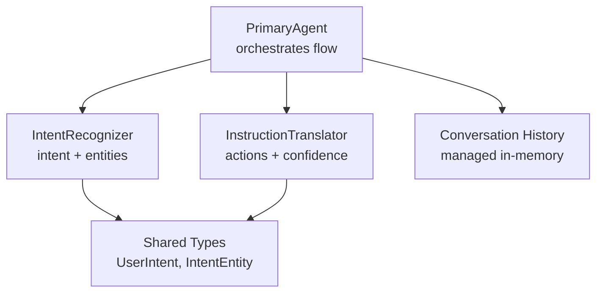
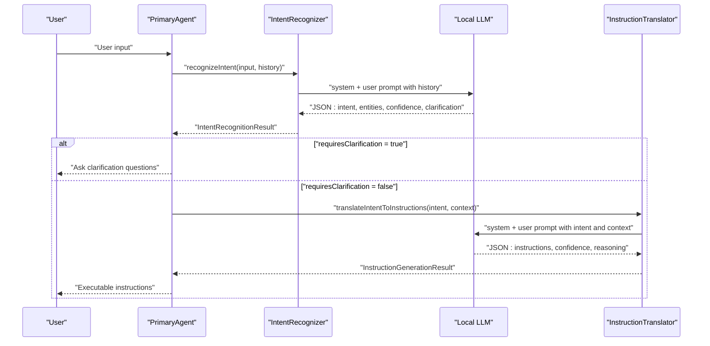
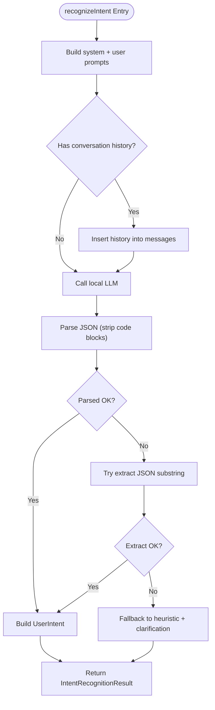
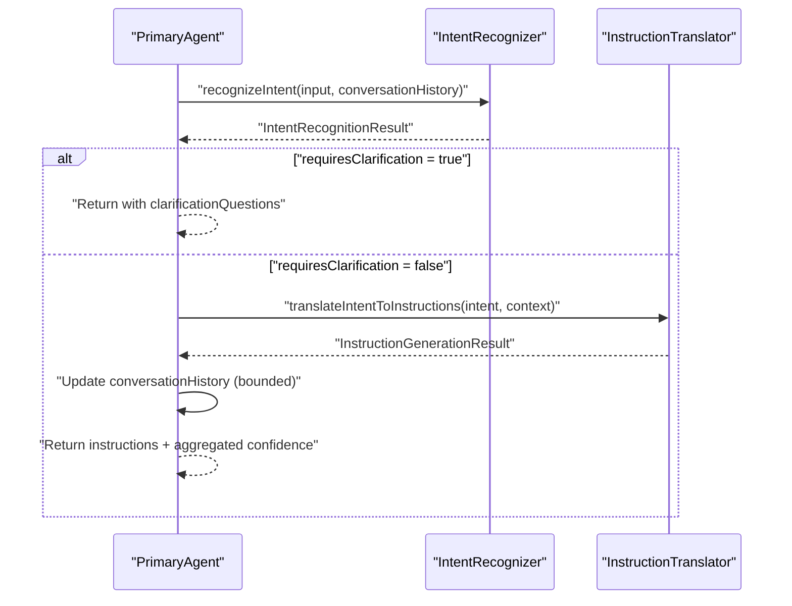
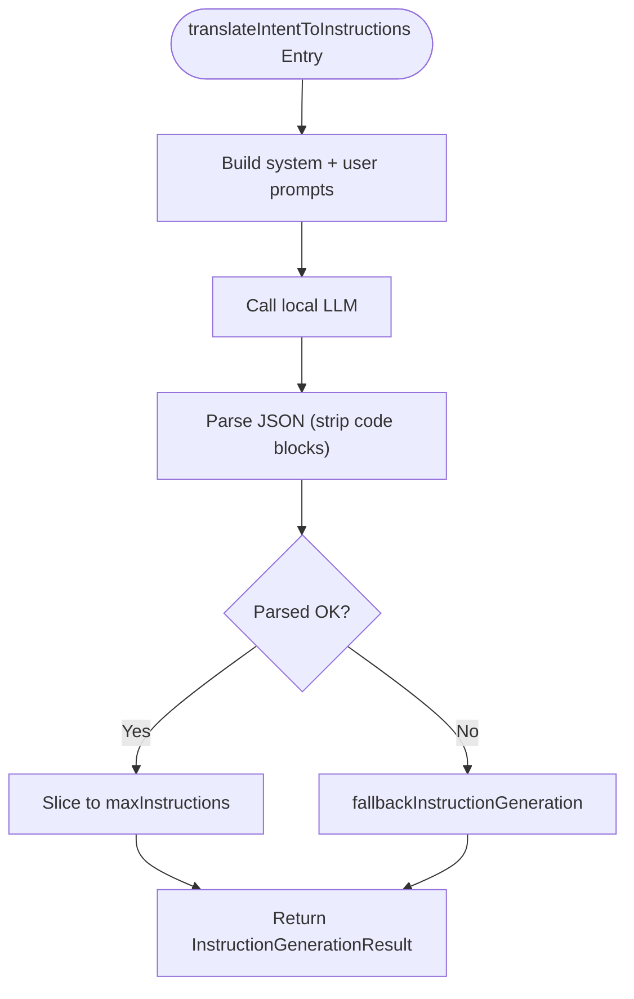
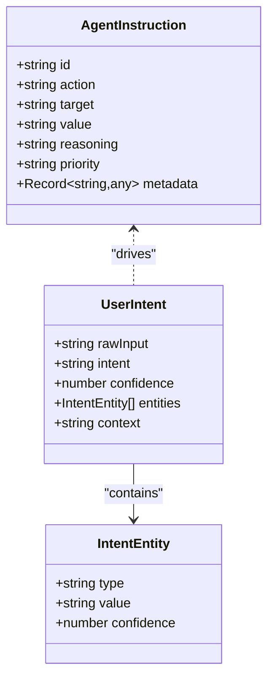
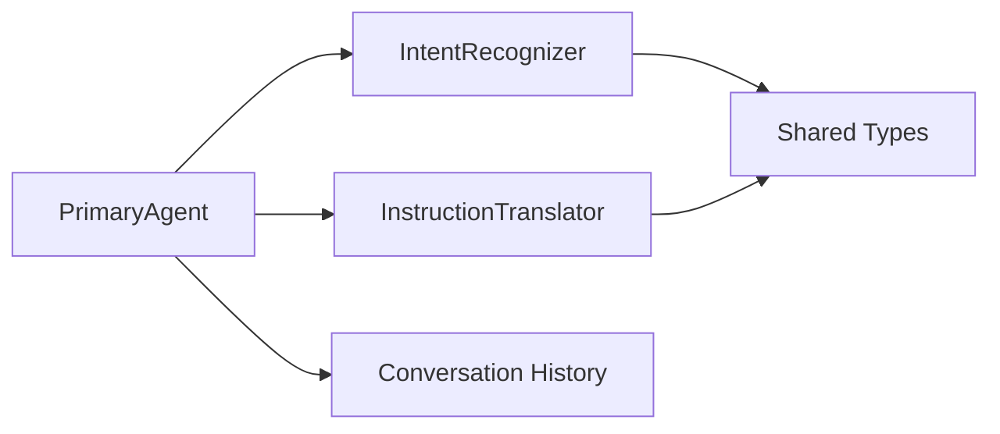

# Intent Recognition Module

<cite>
**Referenced Files in This Document**
- [intent-recognizer.ts](file://primary_agent/intent-recognizer.ts)
- [agent.ts](file://primary_agent/agent.ts)
- [instruction-translator.ts](file://primary_agent/instruction-translator.ts)
- [types.ts](file://primary_agent/types.ts)
- [types.ts](file://shared/types.ts)
</cite>

## Table of Contents
1. [Introduction](#introduction)
2. [Project Structure](#project-structure)
3. [Core Components](#core-components)
4. [Architecture Overview](#architecture-overview)
5. [Detailed Component Analysis](#detailed-component-analysis)
6. [Dependency Analysis](#dependency-analysis)
7. [Performance Considerations](#performance-considerations)
8. [Troubleshooting Guide](#troubleshooting-guide)
9. [Conclusion](#conclusion)

## Introduction
This document describes the Intent Recognition module within the Primary Agent system. It explains how natural language input is processed to identify intended browser actions, the intent classification algorithm, entity extraction, confidence scoring, clarification question generation for ambiguous inputs, and the integration of conversation history. It also documents the underlying model configuration, temperature settings, and performance characteristics, along with practical examples and troubleshooting guidance.

## Project Structure
The Intent Recognition module resides in the Primary Agent subsystem and collaborates with the Instruction Translator and shared types. The relevant files are organized as follows:
- primary_agent/intent-recognizer.ts: Implements intent recognition via a local LLM endpoint.
- primary_agent/agent.ts: Orchestrates intent recognition and instruction translation, maintaining conversation history.
- primary_agent/instruction-translator.ts: Translates recognized intents into executable instructions for the Secondary Agent.
- primary_agent/types.ts: Defines Primary Agent-specific types for configuration and responses.
- shared/types.ts: Defines shared types for UserIntent, AgentInstruction, and related structures.

**Diagram sources**
- [agent.ts](file://primary_agent/agent.ts#L9-L32)
- [intent-recognizer.ts](file://primary_agent/intent-recognizer.ts#L13-L20)
- [instruction-translator.ts](file://primary_agent/instruction-translator.ts#L13-L22)
- [types.ts](file://primary_agent/types.ts#L5-L9)
- [types.ts](file://shared/types.ts#L63-L75)

**Section sources**
- [agent.ts](file://primary_agent/agent.ts#L9-L32)
- [types.ts](file://primary_agent/types.ts#L5-L9)
- [types.ts](file://shared/types.ts#L63-L75)

## Core Components
- IntentRecognizer: Parses user input into a structured intent with entities, confidence, and optional clarification prompts. Integrates conversation history into the LLM prompt.
- PrimaryAgent: Coordinates intent recognition and instruction translation, manages conversation history, and aggregates confidence scores.
- InstructionTranslator: Converts a recognized intent into a sequence of executable browser actions with associated reasoning and priority.
- Shared Types: Define the intent, entities, and instruction structures used across the system.

Key configuration:
- Model: configurable string (default value present in constructors).
- Temperature: controls randomness of LLM responses (defaults differ between recognizer and translator).
- Max Instructions: limits the number of generated actions.

**Section sources**
- [intent-recognizer.ts](file://primary_agent/intent-recognizer.ts#L17-L20)
- [agent.ts](file://primary_agent/agent.ts#L15-L32)
- [instruction-translator.ts](file://primary_agent/instruction-translator.ts#L18-L22)
- [types.ts](file://primary_agent/types.ts#L5-L9)

## Architecture Overview
The Intent Recognition module participates in a two-stage pipeline:
1. Intent Recognition: The recognizer analyzes user input and conversation history to produce an intent, entities, confidence, and optional clarification needs.
2. Instruction Translation: The translator converts the recognized intent into a sequence of browser actions with priorities and reasoning.

**Diagram sources**
- [agent.ts](file://primary_agent/agent.ts#L37-L89)
- [intent-recognizer.ts](file://primary_agent/intent-recognizer.ts#L22-L129)
- [instruction-translator.ts](file://primary_agent/instruction-translator.ts#L24-L127)

## Detailed Component Analysis

### IntentRecognizer
Responsibilities:
- Accepts user input and optional conversation history.
- Constructs a system prompt enumerating supported intents and output schema.
- Sends a chat completion request to a local LLM endpoint.
- Parses the returned JSON, tolerating markdown code block wrappers.
- Returns an intent with entities, confidence, and clarification flags; falls back to heuristic matching on errors.

Supported intent categories (as defined in the system prompt):
- navigate_to_page
- click_element
- fill_form
- extract_data
- search
- wait
- scroll

Confidence scoring:
- Provided by the LLM in the JSON response; defaults to a midpoint value if missing.
- The Primary Agent further reduces confidence by taking the minimum of intent confidence and instruction confidence.

Clarification question generation:
- The LLM can mark requiresClarification and supply clarificationQuestions.
- On LLM failure, the recognizer falls back to heuristic intent detection and requests clarification with a generic prompt.

Conversation history integration:
- Conversation history is inserted into the message array before the final user message to provide context.

Error handling:
- Catches parsing failures and LLM errors, returning a safe fallback with a low-to-mid confidence and a clarification flag.

**Diagram sources**
- [intent-recognizer.ts](file://primary_agent/intent-recognizer.ts#L22-L129)

**Section sources**
- [intent-recognizer.ts](file://primary_agent/intent-recognizer.ts#L13-L20)
- [intent-recognizer.ts](file://primary_agent/intent-recognizer.ts#L22-L129)
- [shared/types.ts](file://shared/types.ts#L63-L75)

### PrimaryAgent
Responsibilities:
- Initializes IntentRecognizer and InstructionTranslator with model and temperature.
- Processes user input by recognizing intent and translating it to instructions.
- Maintains conversation history and caps it to a bounded size.
- Aggregates confidence by taking the minimum of intent and instruction confidences.
- Returns either executable instructions or clarification prompts depending on the recognizer’s output.

**Diagram sources**
- [agent.ts](file://primary_agent/agent.ts#L37-L89)

**Section sources**
- [agent.ts](file://primary_agent/agent.ts#L9-L32)
- [agent.ts](file://primary_agent/agent.ts#L37-L89)

### InstructionTranslator
Responsibilities:
- Converts a recognized intent into a sequence of executable actions (navigate, click, fill, extract, wait, scroll).
- Uses a system prompt to define available actions and constraints.
- Limits the number of instructions to a configured maximum.
- Returns confidence and reasoning for the generated plan.

Fallback behavior:
- If LLM fails, generates basic instructions based on detected entities (e.g., navigate to URL, click button text, fill form field).
- Otherwise, falls back to extracting current page content to inform subsequent steps.

**Diagram sources**
- [instruction-translator.ts](file://primary_agent/instruction-translator.ts#L24-L127)

**Section sources**
- [instruction-translator.ts](file://primary_agent/instruction-translator.ts#L13-L22)
- [instruction-translator.ts](file://primary_agent/instruction-translator.ts#L24-L127)
- [shared/types.ts](file://shared/types.ts#L3-L11)

### Data Models
The module relies on shared data structures for intents and instructions.

**Diagram sources**
- [shared/types.ts](file://shared/types.ts#L63-L75)
- [shared/types.ts](file://shared/types.ts#L3-L11)

**Section sources**
- [shared/types.ts](file://shared/types.ts#L3-L11)
- [shared/types.ts](file://shared/types.ts#L63-L75)

## Dependency Analysis
- PrimaryAgent depends on IntentRecognizer and InstructionTranslator.
- Both recognizer and translator depend on a local LLM endpoint and share the same model configuration pattern.
- Conversation history is maintained in-memory by PrimaryAgent and injected into the recognizer’s prompt.
- Shared types unify intent and instruction structures across modules.

**Diagram sources**
- [agent.ts](file://primary_agent/agent.ts#L9-L32)
- [intent-recognizer.ts](file://primary_agent/intent-recognizer.ts#L13-L20)
- [instruction-translator.ts](file://primary_agent/instruction-translator.ts#L13-L22)
- [types.ts](file://shared/types.ts#L63-L75)

**Section sources**
- [agent.ts](file://primary_agent/agent.ts#L9-L32)
- [intent-recognizer.ts](file://primary_agent/intent-recognizer.ts#L13-L20)
- [instruction-translator.ts](file://primary_agent/instruction-translator.ts#L13-L22)
- [types.ts](file://shared/types.ts#L63-L75)

## Performance Considerations
- Local LLM endpoint: Responses depend on the local inference engine’s latency and throughput. The module does not implement retries or timeouts; failures are surfaced as errors.
- Prompt construction: Building system and user prompts adds minimal overhead; keep conversation history bounded to reduce token usage.
- JSON parsing robustness: The recognizer and translator strip markdown code blocks and attempt substring extraction to improve resilience against LLM formatting variations.
- Confidence aggregation: The final confidence is the minimum of intent and instruction confidences, reflecting combined uncertainty.

[No sources needed since this section provides general guidance]

## Troubleshooting Guide
Common issues and remedies:
- Unrecognized or ambiguous input:
  - The recognizer may mark requiresClarification and provide clarificationQuestions. If not, it falls back to heuristic matching and requests clarification.
  - Improve prompts and examples in the system prompts to increase specificity.
- JSON parsing failures:
  - The recognizer and translator attempt to strip code blocks and extract JSON substrings. If repeated failures occur, verify the LLM’s adherence to JSON formatting.
- No instructions generated:
  - InstructionTranslator returns a fallback instruction to extract content when no suitable actions are inferred.
- Conversation history growth:
  - PrimaryAgent caps history to a bounded size; ensure this cap remains appropriate for your use case.
- Model and temperature tuning:
  - Adjust model and temperature in constructors to balance determinism and helpfulness. Lower temperatures favor deterministic outputs; higher temperatures increase creativity but may reduce reliability.
- Error logging:
  - Errors are logged during recognition and translation. Inspect logs to diagnose LLM connectivity or response format issues.

Practical examples (descriptive):
- Navigation intent:
  - Input: “Go to https://example.com/login”
  - Expected: intent navigate_to_page, entity url=https://example.com/login
- Form-filling intent:
  - Input: “Enter john@example.com in the email field”
  - Expected: intent fill_form, entities form_field=email, input_value=john@example.com
- Clicking intent:
  - Input: “Click the submit button”
  - Expected: intent click_element, entity button_text=submit
- Scrolling intent:
  - Input: “Scroll down”
  - Expected: intent scroll
- Search intent:
  - Input: “Find products by color blue”
  - Expected: intent search, entity search_query=blue
- Extraction intent:
  - Input: “Show me the prices”
  - Expected: intent extract_data

Edge cases:
- No clear intent:
  - Input: “Tell me about this page”
  - Behavior: fallback to heuristic or clarification
- Mixed commands:
  - Input: “Click login and enter credentials”
  - Behavior: rely on LLM to produce multiple instructions; limit via maxInstructions

**Section sources**
- [intent-recognizer.ts](file://primary_agent/intent-recognizer.ts#L114-L129)
- [instruction-translator.ts](file://primary_agent/instruction-translator.ts#L118-L127)
- [agent.ts](file://primary_agent/agent.ts#L72-L75)

## Conclusion
The Intent Recognition module integrates a local LLM to transform natural language into structured intents and actionable browser instructions. It supports navigation, clicking, form filling, extraction, search, waiting, and scrolling, with confidence scoring and clarification prompts for ambiguous inputs. Conversation history enhances context, while robust JSON parsing and fallback strategies improve reliability. Tuning model and temperature settings allows balancing accuracy and flexibility for diverse user inputs.