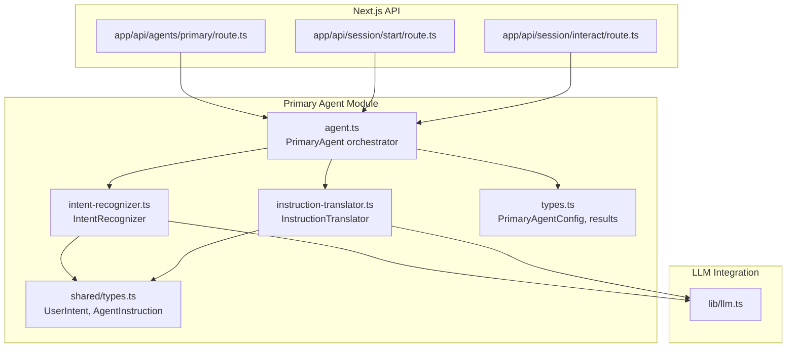
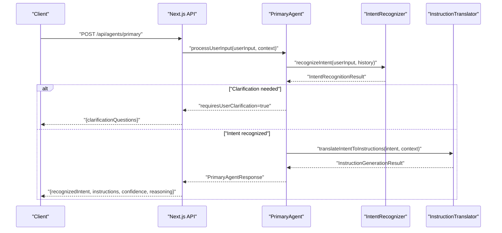
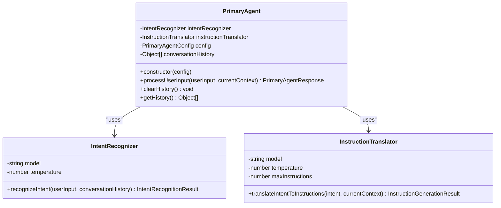
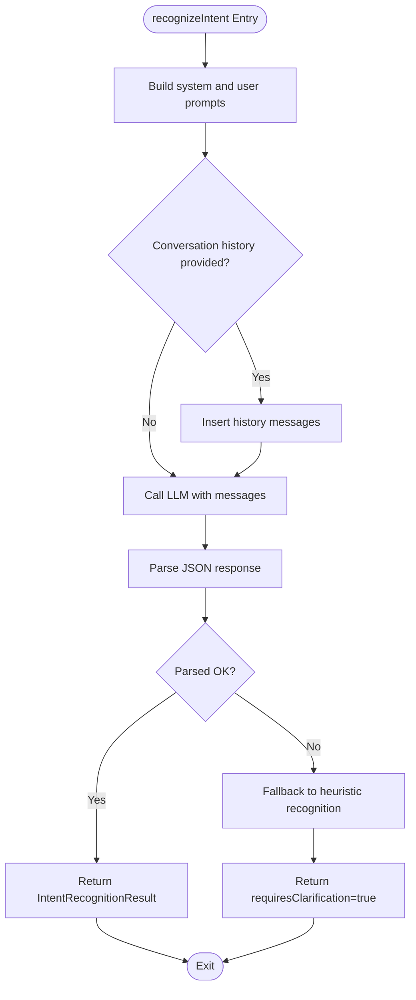
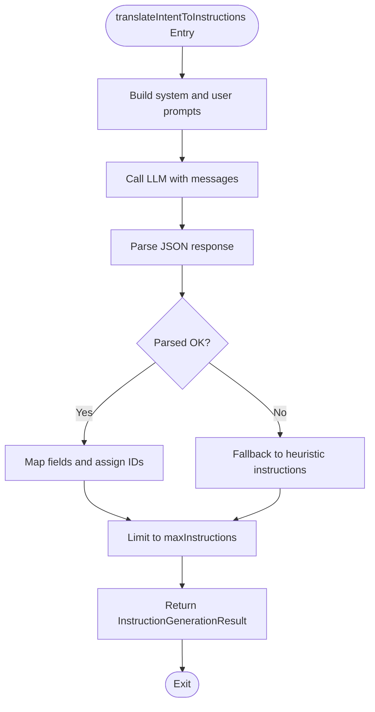
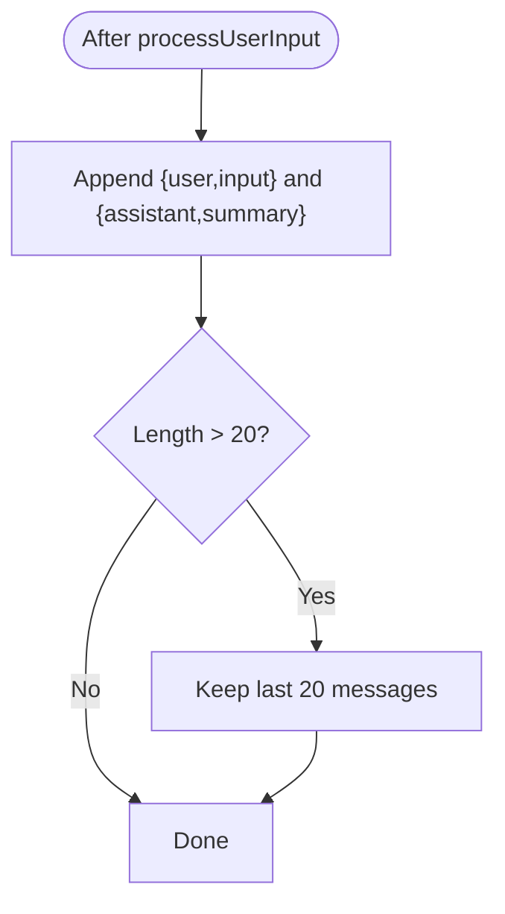
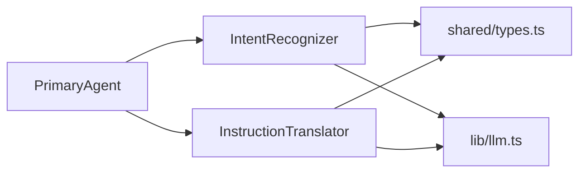
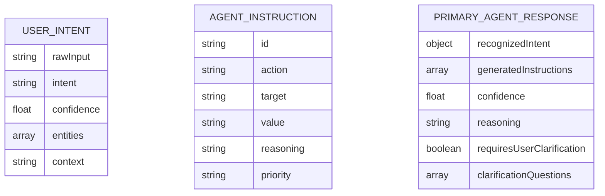

# Primary Agent (Port 3001)

<cite>
**Referenced Files in This Document**
- [agent.ts](file://primary_agent/agent.ts)
- [intent-recognizer.ts](file://primary_agent/intent-recognizer.ts)
- [instruction-translator.ts](file://primary_agent/instruction-translator.ts)
- [types.ts](file://primary_agent/types.ts)
- [shared/types.ts](file://shared/types.ts)
- [app/api/agents/primary/route.ts](file://extraction-script/app/api/agents/primary/route.ts)
- [app/api/session/start/route.ts](file://extraction-script/app/api/session/start/route.ts)
- [app/api/session/interact/route.ts](file://extraction-script/app/api/session/interact/route.ts)
- [lib/llm.ts](file://backend/lib/llm.ts)
</cite>

## Table of Contents
1. [Introduction](#introduction)
2. [Project Structure](#project-structure)
3. [Core Components](#core-components)
4. [Architecture Overview](#architecture-overview)
5. [Detailed Component Analysis](#detailed-component-analysis)
6. [Dependency Analysis](#dependency-analysis)
7. [Performance Considerations](#performance-considerations)
8. [Troubleshooting Guide](#troubleshooting-guide)
9. [Conclusion](#conclusion)
10. [Appendices](#appendices)

## Introduction
This document describes the Primary Agent system operating on port 3001. It explains how the orchestrator coordinates intent recognition and instruction translation workflows, details the natural language processing capabilities of the IntentRecognizer, and documents the InstructionTranslator’s responsibility for generating executable browser automation instructions. It also covers conversation history management, configuration options, API endpoints, practical interaction examples, error handling, rate limiting, and performance optimization strategies.

## Project Structure
The Primary Agent is implemented as a TypeScript module with three core parts:
- Orchestrator: the PrimaryAgent class that sequences recognition and translation
- IntentRecognizer: NLP module that classifies intent, extracts entities, and generates clarification questions
- InstructionTranslator: module that converts recognized intents into structured, executable instructions

These modules are complemented by shared types and Next.js API routes that expose the agent via HTTP endpoints.

**Diagram sources**
- [agent.ts](file://primary_agent/agent.ts#L1-L106)
- [intent-recognizer.ts](file://primary_agent/intent-recognizer.ts#L1-L149)
- [instruction-translator.ts](file://primary_agent/instruction-translator.ts#L1-L178)
- [types.ts](file://primary_agent/types.ts#L1-L32)
- [shared/types.ts](file://shared/types.ts)
- [app/api/agents/primary/route.ts](file://extraction-script/app/api/agents/primary/route.ts)
- [app/api/session/start/route.ts](file://extraction-script/app/api/session/start/route.ts)
- [app/api/session/interact/route.ts](file://extraction-script/app/api/session/interact/route.ts)
- [lib/llm.ts](file://backend/lib/llm.ts)

**Section sources**
- [agent.ts](file://primary_agent/agent.ts#L1-L106)
- [intent-recognizer.ts](file://primary_agent/intent-recognizer.ts#L1-L149)
- [instruction-translator.ts](file://primary_agent/instruction-translator.ts#L1-L178)
- [types.ts](file://primary_agent/types.ts#L1-L32)
- [shared/types.ts](file://shared/types.ts)
- [app/api/agents/primary/route.ts](file://extraction-script/app/api/agents/primary/route.ts)
- [app/api/session/start/route.ts](file://extraction-script/app/api/session/start/route.ts)
- [app/api/session/interact/route.ts](file://extraction-script/app/api/session/interact/route.ts)
- [lib/llm.ts](file://backend/lib/llm.ts)

## Core Components
- PrimaryAgent orchestrator
  - Responsibilities: coordinates intent recognition and instruction translation, manages conversation history, exposes clear APIs for processing input and managing state
  - Key behaviors: maintains bounded conversation history, computes combined confidence, returns clarification prompts when needed
- IntentRecognizer
  - Responsibilities: parses user input into a structured intent with entities and confidence, optionally requests clarification
  - Key behaviors: robust JSON parsing with fallbacks, fallback intent detection, integrates conversation history
- InstructionTranslator
  - Responsibilities: transforms a recognized intent into a sequence of executable browser automation instructions
  - Key behaviors: enforces instruction count limit, assigns unique IDs, provides reasoning and priority, includes fallback logic

**Section sources**
- [agent.ts](file://primary_agent/agent.ts#L9-L32)
- [intent-recognizer.ts](file://primary_agent/intent-recognizer.ts#L13-L21)
- [instruction-translator.ts](file://primary_agent/instruction-translator.ts#L13-L22)

## Architecture Overview
The Primary Agent operates as a pipeline:
1. Receive user input via Next.js API
2. Recognize intent and entities
3. Optionally request clarification
4. Translate intent into structured instructions
5. Return results with confidence and reasoning

**Diagram sources**
- [agent.ts](file://primary_agent/agent.ts#L37-L89)
- [intent-recognizer.ts](file://primary_agent/intent-recognizer.ts#L22-L129)
- [instruction-translator.ts](file://primary_agent/instruction-translator.ts#L24-L127)
- [app/api/agents/primary/route.ts](file://extraction-script/app/api/agents/primary/route.ts)

## Detailed Component Analysis

### PrimaryAgent Orchestrator
- Construction and configuration
  - Accepts model, temperature, and maxInstructions
  - Initializes IntentRecognizer and InstructionTranslator with the same model and temperature
- Processing workflow
  - Calls IntentRecognizer and checks requiresClarification flag
  - On success, calls InstructionTranslator and updates conversation history
  - Caps history to last 10 exchanges (20 messages)
- Conversation history management
  - Stores alternating user/assistant messages
  - Provides clearHistory and getHistory methods
- Response composition
  - Combines intent and instruction confidences
  - Returns reasoning and clarification prompts when applicable

**Diagram sources**
- [agent.ts](file://primary_agent/agent.ts#L9-L32)
- [intent-recognizer.ts](file://primary_agent/intent-recognizer.ts#L13-L21)
- [instruction-translator.ts](file://primary_agent/instruction-translator.ts#L13-L22)

**Section sources**
- [agent.ts](file://primary_agent/agent.ts#L15-L32)
- [agent.ts](file://primary_agent/agent.ts#L40-L89)
- [agent.ts](file://primary_agent/agent.ts#L94-L103)

### IntentRecognizer
- Role
  - Parses natural language into a structured intent with entities and confidence
  - Generates clarification questions when input is ambiguous
- Prompting and parsing
  - Uses a system prompt to enforce JSON output structure
  - Robust parsing with fallbacks for malformed JSON and markdown-wrapped content
  - Integrates conversation history into the chat context
- Fallback behavior
  - On error, falls back to heuristic-based intent classification
  - Returns requiresClarification with a generic clarification question

**Diagram sources**
- [intent-recognizer.ts](file://primary_agent/intent-recognizer.ts#L22-L129)

**Section sources**
- [intent-recognizer.ts](file://primary_agent/intent-recognizer.ts#L22-L98)
- [intent-recognizer.ts](file://primary_agent/intent-recognizer.ts#L114-L129)
- [intent-recognizer.ts](file://primary_agent/intent-recognizer.ts#L131-L146)

### InstructionTranslator
- Role
  - Translates a recognized intent into a sequence of executable browser automation instructions
  - Enforces a maximum instruction count and assigns unique IDs
- Prompting and parsing
  - Defines available actions and expected JSON structure
  - Applies the same robust JSON parsing and fallback strategies as the IntentRecognizer
- Fallback behavior
  - Heuristic mapping from intent to a small set of instructions
  - Defaults to extracting current page content if no heuristic applies

**Diagram sources**
- [instruction-translator.ts](file://primary_agent/instruction-translator.ts#L24-L127)

**Section sources**
- [instruction-translator.ts](file://primary_agent/instruction-translator.ts#L24-L99)
- [instruction-translator.ts](file://primary_agent/instruction-translator.ts#L118-L127)
- [instruction-translator.ts](file://primary_agent/instruction-translator.ts#L129-L175)

### Conversation History Management
- Storage
  - Alternating user/assistant entries appended after successful processing
- Limits
  - Maintains up to 20 messages (10 exchanges) to keep context concise
- Accessors
  - clearHistory resets storage
  - getHistory returns a copy of current history

**Diagram sources**
- [agent.ts](file://primary_agent/agent.ts#L66-L75)

**Section sources**
- [agent.ts](file://primary_agent/agent.ts#L13)
- [agent.ts](file://primary_agent/agent.ts#L66-L75)
- [agent.ts](file://primary_agent/agent.ts#L94-L103)

### Configuration Options
- Model selection
  - Configurable via model string passed to IntentRecognizer and InstructionTranslator
- Temperature settings
  - Shared between recognizer and translator for consistent randomness
- Instruction limits
  - maxInstructions caps the number of generated steps

**Section sources**
- [agent.ts](file://primary_agent/agent.ts#L15-L32)
- [types.ts](file://primary_agent/types.ts#L5-L9)
- [instruction-translator.ts](file://primary_agent/instruction-translator.ts#L18-L22)

### API Endpoints
- POST /api/agents/primary
  - Purpose: Process user input and return either instructions or clarification prompts
  - Request body: expects user input and optional context (e.g., URL, page title)
  - Response: PrimaryAgentResponse including recognizedIntent, generatedInstructions, confidence, reasoning, and optional clarification fields
- GET /api/session/start
  - Purpose: Initialize a new session and clear any prior conversation history
  - Response: Confirmation of session start
- POST /api/session/interact
  - Purpose: Continue interaction within an existing session
  - Request body: user input and optional context
  - Response: Same as /api/agents/primary

Note: These endpoints are implemented in the Next.js API routes and delegate to the PrimaryAgent orchestrator.

**Section sources**
- [app/api/agents/primary/route.ts](file://extraction-script/app/api/agents/primary/route.ts)
- [app/api/session/start/route.ts](file://extraction-script/app/api/session/start/route.ts)
- [app/api/session/interact/route.ts](file://extraction-script/app/api/session/interact/route.ts)

### Practical Examples: From Natural Language to Instructions
Example 1: “Click the sign in button”
- Recognition: IntentRecognizer identifies intent as click_element with entity button_text
- Translation: InstructionTranslator produces a single click instruction targeting the identified element
- Result: PrimaryAgentResponse includes the instruction and reasoning

Example 2: “Go to https://example.com and fill the email field with test@example.com”
- Recognition: IntentRecognizer identifies navigate_to_page and fill_form with corresponding entities
- Translation: InstructionTranslator produces two instructions: navigate followed by fill
- Result: PrimaryAgentResponse includes both instructions and combined confidence

Example 3: “Search for widgets”
- Recognition: IntentRecognizer identifies search intent
- Translation: InstructionTranslator produces a search instruction (action type depends on implementation)
- Result: PrimaryAgentResponse includes the instruction and reasoning

[No sources needed since this section provides conceptual examples]

## Dependency Analysis
- Internal dependencies
  - PrimaryAgent depends on IntentRecognizer and InstructionTranslator
  - Both NLP modules depend on shared types for UserIntent and AgentInstruction
- External dependencies
  - Both modules call an OpenAI-compatible LLM endpoint (local LM Studio) via the OpenAI SDK
  - LLM integration is centralized in lib/llm.ts

**Diagram sources**
- [agent.ts](file://primary_agent/agent.ts#L4-L7)
- [intent-recognizer.ts](file://primary_agent/intent-recognizer.ts#L4)
- [instruction-translator.ts](file://primary_agent/instruction-translator.ts#L4)
- [shared/types.ts](file://shared/types.ts)
- [lib/llm.ts](file://backend/lib/llm.ts)

**Section sources**
- [agent.ts](file://primary_agent/agent.ts#L4-L7)
- [intent-recognizer.ts](file://primary_agent/intent-recognizer.ts#L4)
- [instruction-translator.ts](file://primary_agent/instruction-translator.ts#L4)
- [lib/llm.ts](file://backend/lib/llm.ts)

## Performance Considerations
- Model and temperature
  - Lower temperature reduces variability; tune for accuracy vs. creativity
- Instruction limits
  - maxInstructions prevents long instruction sequences that could overwhelm downstream agents
- History capping
  - Keeping conversation history bounded avoids excessive context length and latency
- Robust parsing
  - Both modules include fallbacks to avoid repeated failures on malformed JSON
- LLM endpoint stability
  - Ensure local LLM service availability and responsiveness; consider retry/backoff strategies at the API layer if needed

[No sources needed since this section provides general guidance]

## Troubleshooting Guide
- No response from LLM
  - Symptoms: errors indicating empty responses or JSON parse failures
  - Actions: verify local LLM service is running, check base URL and API key configuration, enable retries
- Ambiguous input requiring clarification
  - Symptoms: requiresUserClarification flag is true with clarificationQuestions
  - Actions: surface questions to the user and re-process with clarified input
- Excessive instruction count
  - Symptoms: more instructions than expected
  - Actions: adjust maxInstructions or simplify intent
- History growing too large
  - Symptoms: slow responses or context overflow
  - Actions: rely on automatic capping or explicitly clear history

**Section sources**
- [intent-recognizer.ts](file://primary_agent/intent-recognizer.ts#L84-L98)
- [instruction-translator.ts](file://primary_agent/instruction-translator.ts#L85-L99)
- [agent.ts](file://primary_agent/agent.ts#L72-L75)

## Conclusion
The Primary Agent orchestrates a robust pipeline from user intent to executable instructions, with strong fallbacks, bounded history, and clear configuration options. Its modular design enables maintainability and extension while keeping the API surface simple and predictable.

[No sources needed since this section summarizes without analyzing specific files]

## Appendices

### Data Models

**Diagram sources**
- [shared/types.ts](file://shared/types.ts)
- [types.ts](file://primary_agent/types.ts#L11-L31)