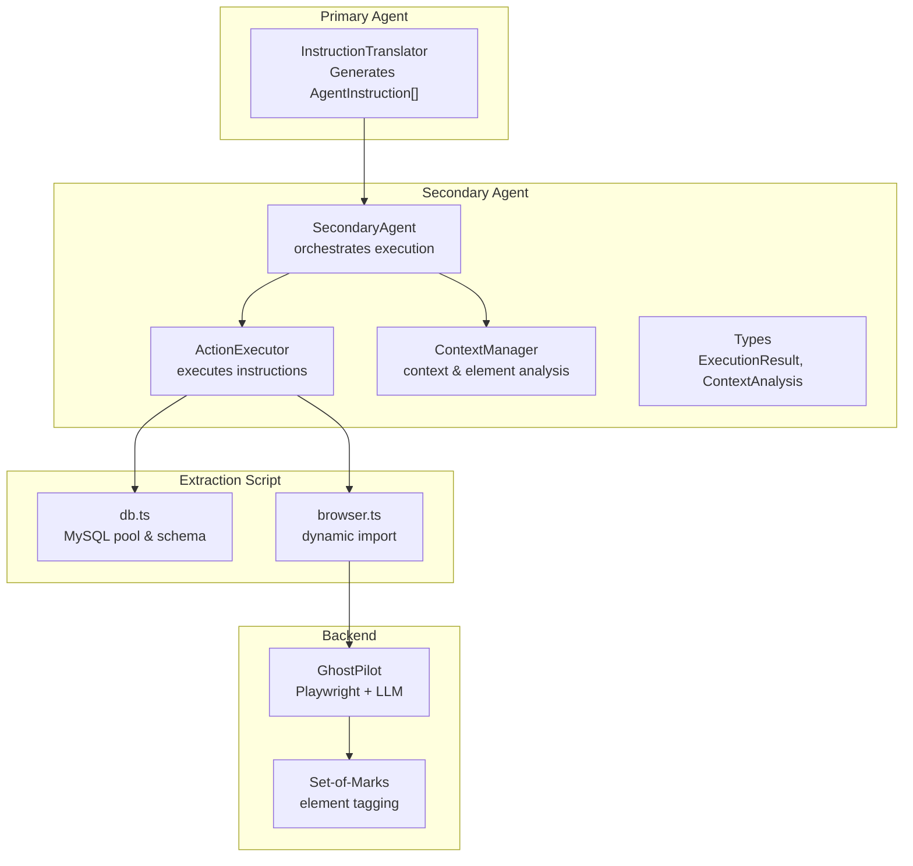
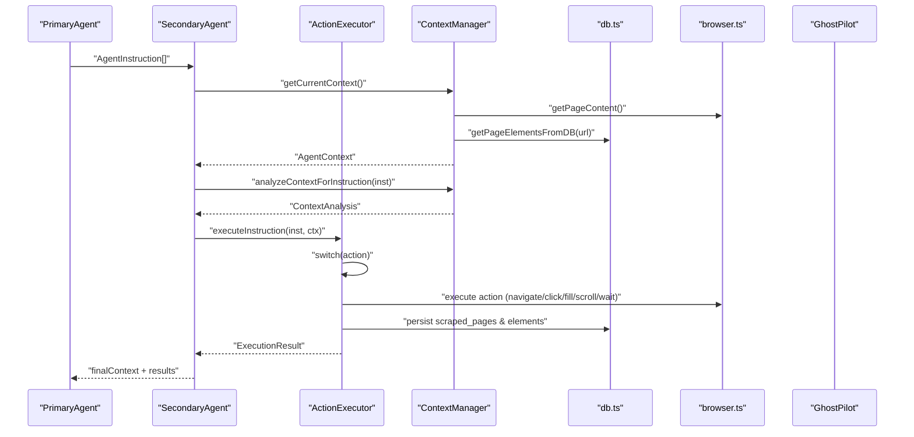
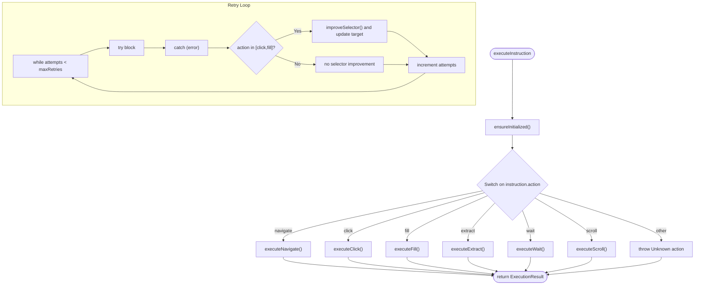
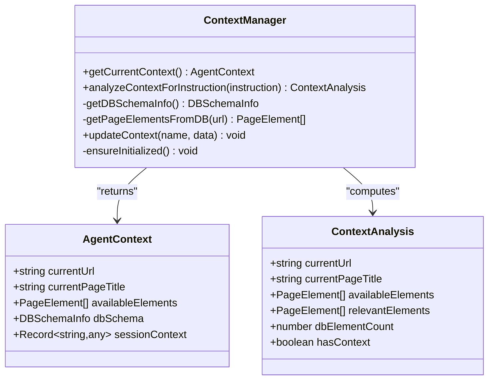
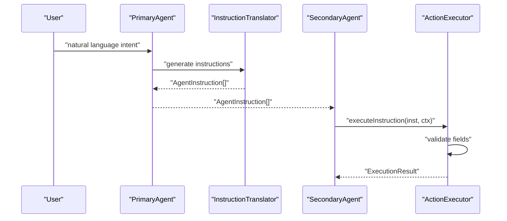
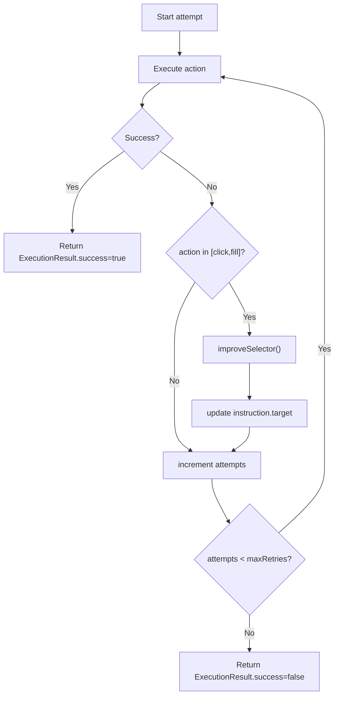
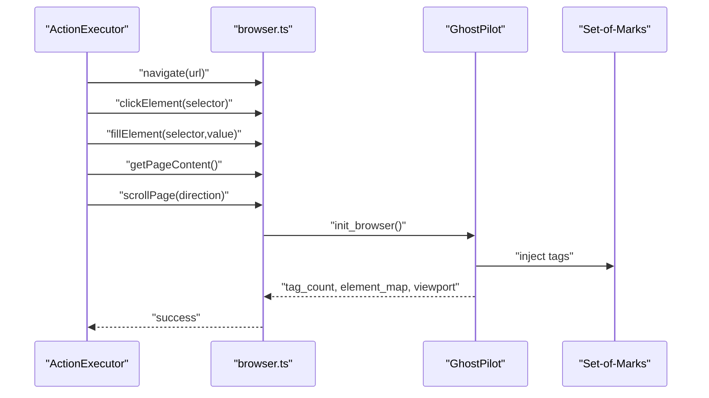
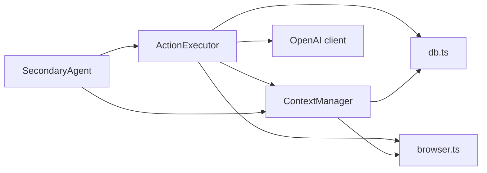

# Action Executor

<cite>
**Referenced Files in This Document**
- [action-executor.ts](file://secondary_agent/action-executor.ts)
- [context-manager.ts](file://secondary_agent/context-manager.ts)
- [types.ts](file://secondary_agent/types.ts)
- [types.ts](file://shared/types.ts)
- [instruction-translator.ts](file://primary_agent/instruction-translator.ts)
- [db.ts](file://extraction-script/lib/db.ts)
- [ghost_pilot.py](file://backend/ghost_pilot.py)
- [set_of_marks.js](file://backend/set_of_marks.js)
- [agent.ts](file://secondary_agent/agent.ts)
- [route.ts](file://extraction-script/app/api/agents/orchestrate/route.ts)
</cite>

## Table of Contents
1. [Introduction](#introduction)
2. [Project Structure](#project-structure)
3. [Core Components](#core-components)
4. [Architecture Overview](#architecture-overview)
5. [Detailed Component Analysis](#detailed-component-analysis)
6. [Dependency Analysis](#dependency-analysis)
7. [Performance Considerations](#performance-considerations)
8. [Troubleshooting Guide](#troubleshooting-guide)
9. [Conclusion](#conclusion)

## Introduction
This document explains the Action Executor component responsible for translating high-level AgentInstruction objects into concrete browser automation actions. It covers the instruction parsing and validation performed by the Context Manager, the execution pipeline, retry logic with error recovery, integration with the Ghost Pilot engine for browser interactions, supported action types, and the relationship between instructions and the Set-of-Marks element targeting system. It also includes examples of multi-step workflows and guidance on timeouts, error handling, and state consistency.

## Project Structure
The Action Executor resides in the secondary agent layer and orchestrates browser automation via dynamic imports of extraction-script modules. It collaborates with the Context Manager to analyze page state and with the database module to persist page and element data. The Ghost Pilot engine (backend) provides the autonomous browser runtime and Set-of-Marks tagging for element targeting.

**Diagram sources**
- [instruction-translator.ts](file://primary_agent/instruction-translator.ts#L24-L127)
- [agent.ts](file://secondary_agent/agent.ts#L39-L62)
- [context-manager.ts](file://secondary_agent/context-manager.ts#L36-L77)
- [action-executor.ts](file://secondary_agent/action-executor.ts#L53-L110)
- [db.ts](file://extraction-script/lib/db.ts#L92-L102)
- [ghost_pilot.py](file://backend/ghost_pilot.py#L140-L157)
- [set_of_marks.js](file://backend/set_of_marks.js#L8-L228)

**Section sources**
- [action-executor.ts](file://secondary_agent/action-executor.ts#L1-L391)
- [context-manager.ts](file://secondary_agent/context-manager.ts#L1-L223)
- [types.ts](file://secondary_agent/types.ts#L1-L37)
- [types.ts](file://shared/types.ts#L3-L11)
- [instruction-translator.ts](file://primary_agent/instruction-translator.ts#L24-L127)
- [db.ts](file://extraction-script/lib/db.ts#L92-L102)
- [ghost_pilot.py](file://backend/ghost_pilot.py#L140-L157)
- [set_of_marks.js](file://backend/set_of_marks.js#L8-L228)

## Core Components
- ActionExecutor: Translates AgentInstruction into browser actions, manages retries, and returns ExecutionResult.
- ContextManager: Builds AgentContext, merges browser and database elements, and computes ContextAnalysis for instruction targeting.
- Types: Defines AgentInstruction, AgentContext, PageElement, DBSchemaInfo, ExecutionResult, and ContextAnalysis.
- Extraction Script Modules: Dynamic imports for database queries and browser automation.
- Ghost Pilot Engine: Provides Playwright browser lifecycle, screenshot capture, Set-of-Marks tagging, and autonomous action execution.

Key responsibilities:
- Instruction parsing/validation: Ensures required fields (e.g., target for navigate/click/fill; timeout for wait).
- Selector resolution: Uses exact match, text match, relevance ranking, and LLM-assisted improvement.
- Execution pipeline: Calls browserManager methods and updates context and database.
- Retry logic: Attempts up to maxRetries with selector improvement for click/fill failures.
- Integration: Uses dynamic imports to access extraction-script modules and Ghost Pilot for browser automation.

**Section sources**
- [action-executor.ts](file://secondary_agent/action-executor.ts#L53-L110)
- [context-manager.ts](file://secondary_agent/context-manager.ts#L82-L123)
- [types.ts](file://secondary_agent/types.ts#L11-L27)
- [types.ts](file://shared/types.ts#L3-L11)

## Architecture Overview
The Action Executor sits between the Primary Agent’s instruction generation and the backend browser automation. It receives AgentInstruction objects, validates and resolves targets, executes actions against the browser, and persists state to the database.

**Diagram sources**
- [agent.ts](file://secondary_agent/agent.ts#L39-L62)
- [context-manager.ts](file://secondary_agent/context-manager.ts#L36-L77)
- [action-executor.ts](file://secondary_agent/action-executor.ts#L115-L144)
- [db.ts](file://extraction-script/lib/db.ts#L92-L102)
- [ghost_pilot.py](file://backend/ghost_pilot.py#L140-L157)

## Detailed Component Analysis

### ActionExecutor
Responsibilities:
- Execute a single instruction with retry logic.
- Resolve selectors using exact/text/relevance matching and LLM assistance.
- Persist page and element data to the database.
- Return structured ExecutionResult with success/error/newContext.

Supported actions:
- navigate: Validates target URL, navigates, waits, captures context, and persists page metadata.
- click: Resolves selector, clicks element, waits, captures context.
- fill: Resolves selector, fills value, captures context.
- extract: Captures page content, persists page and elements, returns counts.
- wait: Waits for a specified timeout (default 2000ms).
- scroll: Scrolls up/down/top/bottom.

Retry logic:
- Attempts up to maxRetries.
- On click/fill failures, improves selector via LLM before retry.
- Returns ExecutionResult with error message if all retries fail.

Integration with Ghost Pilot:
- Uses dynamic import to access browserManager methods (navigate, clickElement, fillElement, getPageContent, scrollPage).
- These methods are backed by the backend Ghost Pilot engine and Set-of-Marks tagging.

**Diagram sources**
- [action-executor.ts](file://secondary_agent/action-executor.ts#L53-L110)
- [action-executor.ts](file://secondary_agent/action-executor.ts#L293-L332)
- [action-executor.ts](file://secondary_agent/action-executor.ts#L337-L389)

**Section sources**
- [action-executor.ts](file://secondary_agent/action-executor.ts#L53-L110)
- [action-executor.ts](file://secondary_agent/action-executor.ts#L115-L144)
- [action-executor.ts](file://secondary_agent/action-executor.ts#L149-L174)
- [action-executor.ts](file://secondary_agent/action-executor.ts#L179-L200)
- [action-executor.ts](file://secondary_agent/action-executor.ts#L205-L248)
- [action-executor.ts](file://secondary_agent/action-executor.ts#L253-L269)
- [action-executor.ts](file://secondary_agent/action-executor.ts#L274-L288)
- [action-executor.ts](file://secondary_agent/action-executor.ts#L293-L332)
- [action-executor.ts](file://secondary_agent/action-executor.ts#L337-L389)

### ContextManager
Responsibilities:
- getCurrentContext: Initializes browser, fetches page content, merges browser and DB elements, returns AgentContext.
- analyzeContextForInstruction: Filters relevant elements based on instruction target and computes ContextAnalysis.
- getDBSchemaInfo: Returns schema info and current page data for context awareness.
- getPageElementsFromDB: Loads elements for the current URL from the database.
- updateContext: Persists arbitrary context data to the database.

**Diagram sources**
- [context-manager.ts](file://secondary_agent/context-manager.ts#L23-L77)
- [context-manager.ts](file://secondary_agent/context-manager.ts#L82-L123)
- [types.ts](file://secondary_agent/types.ts#L13-L27)
- [types.ts](file://shared/types.ts#L13-L20)

**Section sources**
- [context-manager.ts](file://secondary_agent/context-manager.ts#L36-L77)
- [context-manager.ts](file://secondary_agent/context-manager.ts#L82-L123)
- [context-manager.ts](file://secondary_agent/context-manager.ts#L128-L172)
- [context-manager.ts](file://secondary_agent/context-manager.ts#L177-L204)
- [context-manager.ts](file://secondary_agent/context-manager.ts#L209-L221)
- [types.ts](file://secondary_agent/types.ts#L13-L27)
- [types.ts](file://shared/types.ts#L13-L20)

### Instruction Parsing and Validation
- PrimaryAgent’s InstructionTranslator converts user intent into AgentInstruction objects with action, target, value, reasoning, and priority.
- ActionExecutor validates required fields per action and throws descriptive errors for missing data.
- ContextManager filters relevant elements and provides ContextAnalysis to guide selector resolution.

**Diagram sources**
- [instruction-translator.ts](file://primary_agent/instruction-translator.ts#L24-L127)
- [action-executor.ts](file://secondary_agent/action-executor.ts#L115-L144)
- [action-executor.ts](file://secondary_agent/action-executor.ts#L149-L174)
- [action-executor.ts](file://secondary_agent/action-executor.ts#L179-L200)

**Section sources**
- [instruction-translator.ts](file://primary_agent/instruction-translator.ts#L24-L127)
- [action-executor.ts](file://secondary_agent/action-executor.ts#L115-L144)
- [action-executor.ts](file://secondary_agent/action-executor.ts#L149-L174)
- [action-executor.ts](file://secondary_agent/action-executor.ts#L179-L200)

### Retry Logic and Error Recovery
- ActionExecutor retries failed actions up to maxRetries.
- For click/fill failures, it attempts to improve the selector using an LLM prompt with available elements.
- On repeated failures, returns ExecutionResult with success=false and error message.

**Diagram sources**
- [action-executor.ts](file://secondary_agent/action-executor.ts#L59-L110)
- [action-executor.ts](file://secondary_agent/action-executor.ts#L337-L389)

**Section sources**
- [action-executor.ts](file://secondary_agent/action-executor.ts#L59-L110)
- [action-executor.ts](file://secondary_agent/action-executor.ts#L94-L99)
- [action-executor.ts](file://secondary_agent/action-executor.ts#L337-L389)

### Integration with Ghost Pilot Engine and Set-of-Marks
- ActionExecutor dynamically imports browserManager methods from the extraction-script to drive the browser.
- Ghost Pilot engine initializes Playwright, injects Set-of-Marks tags, captures screenshots, and executes autonomous actions.
- Set-of-Marks generates numbered overlays on interactive elements and returns a map of tag IDs to element centers for precise targeting.

**Diagram sources**
- [action-executor.ts](file://secondary_agent/action-executor.ts#L123-L123)
- [action-executor.ts](file://secondary_agent/action-executor.ts#L160-L160)
- [action-executor.ts](file://secondary_agent/action-executor.ts#L189-L189)
- [action-executor.ts](file://secondary_agent/action-executor.ts#L209-L209)
- [action-executor.ts](file://secondary_agent/action-executor.ts#L280-L280)
- [ghost_pilot.py](file://backend/ghost_pilot.py#L140-L157)
- [set_of_marks.js](file://backend/set_of_marks.js#L8-L228)

**Section sources**
- [action-executor.ts](file://secondary_agent/action-executor.ts#L18-L27)
- [action-executor.ts](file://secondary_agent/action-executor.ts#L123-L123)
- [action-executor.ts](file://secondary_agent/action-executor.ts#L160-L160)
- [action-executor.ts](file://secondary_agent/action-executor.ts#L189-L189)
- [action-executor.ts](file://secondary_agent/action-executor.ts#L209-L209)
- [action-executor.ts](file://secondary_agent/action-executor.ts#L280-L280)
- [ghost_pilot.py](file://backend/ghost_pilot.py#L140-L157)
- [set_of_marks.js](file://backend/set_of_marks.js#L8-L228)

### Supported Actions and Examples
- navigate: Target is a URL; waits after navigation; persists page metadata.
- click: Target is a selector or element description; resolves best selector; clicks and updates context.
- fill: Target is a selector; value is text; fills input and updates context.
- extract: Captures page content and elements; deletes prior elements for URL; inserts new rows; returns counts.
- wait: Target is timeout in ms; defaults to 2000ms.
- scroll: Target is direction ("up","down","top","bottom"); scrolls page.

Example multi-step workflow:
1. PrimaryAgent generates instructions for “Search for ‘example’ on Google”.
2. SecondaryAgent orchestrates:
   - navigate to https://www.google.com
   - click on the search input field
   - fill the search input with “example”
   - click the search button
3. ActionExecutor executes each instruction with retries and selector improvements.
4. ContextManager updates context after each step; database stores page and elements.

**Section sources**
- [instruction-translator.ts](file://primary_agent/instruction-translator.ts#L35-L56)
- [action-executor.ts](file://secondary_agent/action-executor.ts#L115-L144)
- [action-executor.ts](file://secondary_agent/action-executor.ts#L149-L174)
- [action-executor.ts](file://secondary_agent/action-executor.ts#L179-L200)
- [action-executor.ts](file://secondary_agent/action-executor.ts#L205-L248)
- [action-executor.ts](file://secondary_agent/action-executor.ts#L253-L269)
- [action-executor.ts](file://secondary_agent/action-executor.ts#L274-L288)

### Relationship Between Instructions and Set-of-Marks Targeting
- Set-of-Marks overlays yellow tags on interactive elements and returns a map of tag IDs to element centers.
- ActionExecutor’s findBestSelector prefers exact matches, text matches, and relevant elements; falls back to LLM-assisted selector improvement when needed.
- This ensures robust targeting even when CSS selectors change or are ambiguous.

**Section sources**
- [set_of_marks.js](file://backend/set_of_marks.js#L8-L228)
- [action-executor.ts](file://secondary_agent/action-executor.ts#L293-L332)
- [action-executor.ts](file://secondary_agent/action-executor.ts#L337-L389)

## Dependency Analysis
- ActionExecutor depends on:
  - ContextManager for context and element analysis.
  - Dynamic imports for db.ts and browser.ts to access database and browser automation.
  - OpenAI client for LLM-assisted selector improvement.
- ContextManager depends on:
  - db.ts for schema and element persistence.
  - browser.ts for page content retrieval.
- SecondaryAgent orchestrates ActionExecutor and aggregates results.

**Diagram sources**
- [action-executor.ts](file://secondary_agent/action-executor.ts#L18-L27)
- [context-manager.ts](file://secondary_agent/context-manager.ts#L12-L21)
- [agent.ts](file://secondary_agent/agent.ts#L39-L62)

**Section sources**
- [action-executor.ts](file://secondary_agent/action-executor.ts#L18-L27)
- [context-manager.ts](file://secondary_agent/context-manager.ts#L12-L21)
- [agent.ts](file://secondary_agent/agent.ts#L39-L62)

## Performance Considerations
- Selector resolution prioritizes exact and text matches to minimize LLM calls and reduce latency.
- Static waits (navigate, click) introduce deterministic delays; consider adaptive waits based on element presence or network idle conditions.
- Database writes occur after navigate and extract; batch operations could reduce overhead if many elements are present.
- Retry attempts are capped; tune maxRetries based on stability of target environments.

[No sources needed since this section provides general guidance]

## Troubleshooting Guide
Common issues and resolutions:
- Unknown action: Ensure instruction.action is one of the supported actions.
- Missing target/value: Validate required fields before execution.
- Selector not found: Use ContextManager.analyzeContextForInstruction to inspect relevantElements; enable LLM-based selector improvement.
- Browser not initialized: Ensure browserManager.init is called; check backend Ghost Pilot initialization.
- Database errors: Verify MySQL connectivity and schema initialization; ensure tables exist and are accessible.

**Section sources**
- [action-executor.ts](file://secondary_agent/action-executor.ts#L85-L87)
- [action-executor.ts](file://secondary_agent/action-executor.ts#L119-L121)
- [action-executor.ts](file://secondary_agent/action-executor.ts#L153-L155)
- [action-executor.ts](file://secondary_agent/action-executor.ts#L183-L185)
- [context-manager.ts](file://secondary_agent/context-manager.ts#L42-L49)
- [db.ts](file://extraction-script/lib/db.ts#L92-L102)

## Conclusion
The Action Executor transforms high-level instructions into reliable browser automation by combining robust selector resolution, contextual analysis, and resilient retry logic. Its integration with Ghost Pilot and Set-of-Marks enables precise, autonomous interactions, while database persistence ensures state continuity across steps. The system supports essential actions (navigate, click, fill, extract, wait, scroll) and can be extended to accommodate additional workflows and error-handling strategies.