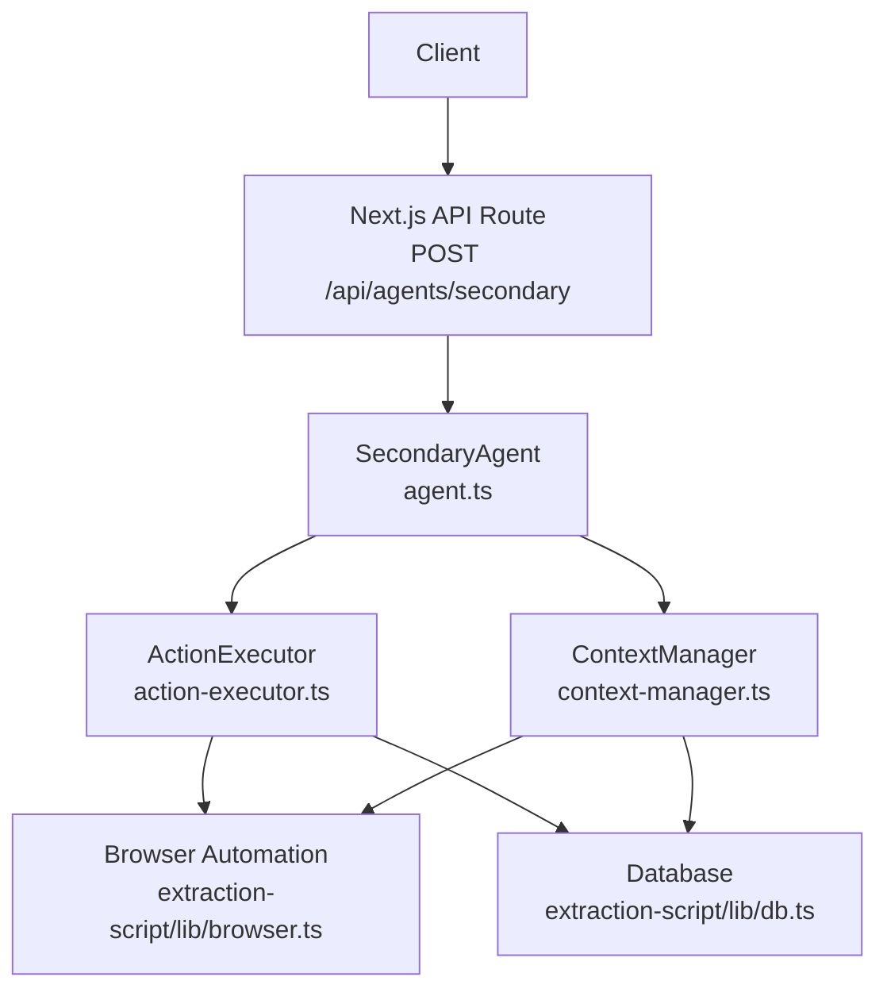
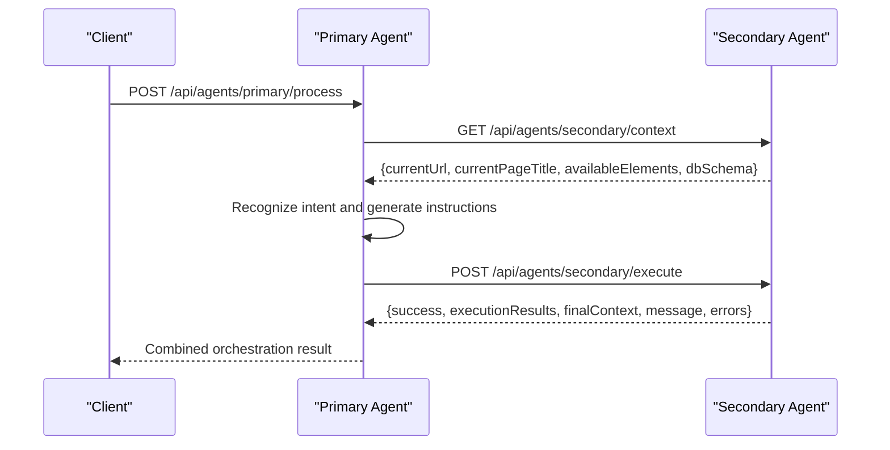
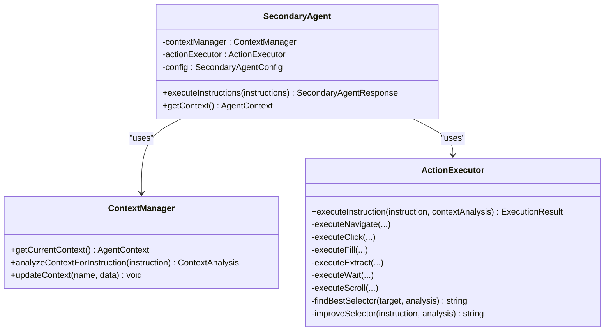
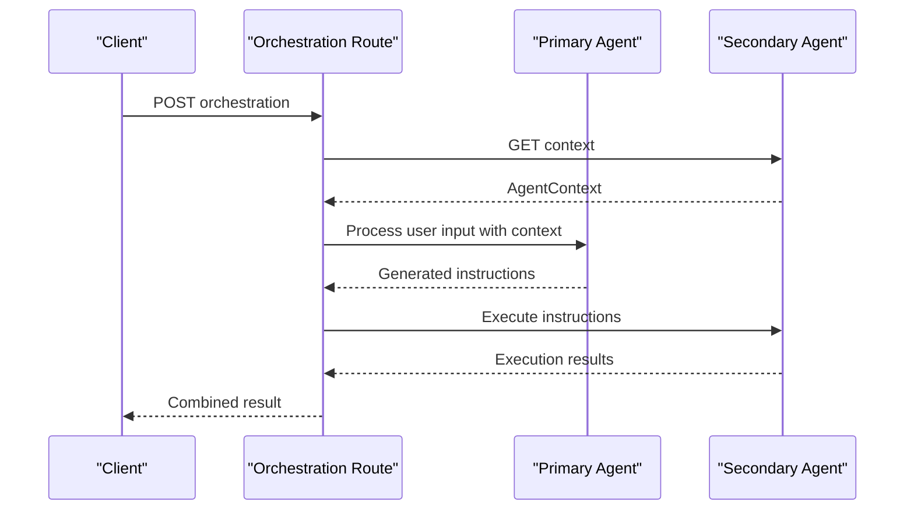

# Agent API Endpoints

<cite>
**Referenced Files in This Document**
- [route.ts](file://extraction-script/app/api/agents/secondary/route.ts)
- [agent.ts](file://secondary_agent/agent.ts)
- [action-executor.ts](file://secondary_agent/action-executor.ts)
- [context-manager.ts](file://secondary_agent/context-manager.ts)
- [types.ts](file://secondary_agent/types.ts)
- [types.ts](file://shared/types.ts)
- [route.ts](file://extraction-script/app/api/agents/orchestrate/route.ts)
- [AGENTS.md](file://AGENTS.md)
</cite>

## Table of Contents
1. [Introduction](#introduction)
2. [Project Structure](#project-structure)
3. [Core Components](#core-components)
4. [Architecture Overview](#architecture-overview)
5. [Detailed Component Analysis](#detailed-component-analysis)
6. [Dependency Analysis](#dependency-analysis)
7. [Performance Considerations](#performance-considerations)
8. [Troubleshooting Guide](#troubleshooting-guide)
9. [Conclusion](#conclusion)
10. [Appendices](#appendices)

## Introduction
This document provides comprehensive API documentation for the Secondary Agent REST endpoints. It focuses on:
- The execute endpoint for processing instruction sequences
- The context endpoint for retrieving current page state and available elements
- The health endpoint for monitoring agent status
- Authentication, rate limiting, and request validation
- Error handling, status codes, and troubleshooting guidance
- Integration with the Primary Agent for coordinated operation
- Performance considerations and scaling recommendations

The Secondary Agent runs independently on port 3002 and orchestrates browser automation and database operations to execute user-defined instructions.

## Project Structure
The Secondary Agent API is implemented as a Next.js API route under the extraction-script application. The route delegates to the SecondaryAgent class, which coordinates ContextManager and ActionExecutor to perform actions against the browser and database.

**Diagram sources**
- [route.ts](file://extraction-script/app/api/agents/secondary/route.ts#L1-L39)
- [agent.ts](file://secondary_agent/agent.ts#L1-L119)
- [context-manager.ts](file://secondary_agent/context-manager.ts#L1-L223)
- [action-executor.ts](file://secondary_agent/action-executor.ts#L1-L391)

**Section sources**
- [route.ts](file://extraction-script/app/api/agents/secondary/route.ts#L1-L39)
- [agent.ts](file://secondary_agent/agent.ts#L1-L119)
- [context-manager.ts](file://secondary_agent/context-manager.ts#L1-L223)
- [action-executor.ts](file://secondary_agent/action-executor.ts#L1-L391)

## Core Components
- Secondary Agent API Route: Validates requests, instantiates SecondaryAgent, and returns structured JSON responses.
- SecondaryAgent: Orchestrates instruction execution, manages context, and aggregates results.
- ContextManager: Retrieves current page context, merges browser and database data, and performs context analysis.
- ActionExecutor: Executes individual actions (navigate, click, fill, extract, wait, scroll) with retry logic and selector improvement.
- Shared Types: Defines AgentInstruction, AgentContext, PageElement, DBSchemaInfo, and related response structures.

Key responsibilities:
- Validation: Ensures instructions is a non-empty array.
- Execution: Processes each instruction sequentially, updates context, and collects results.
- Error Handling: Returns structured success/error payloads with detailed messages.

**Section sources**
- [route.ts](file://extraction-script/app/api/agents/secondary/route.ts#L8-L37)
- [agent.ts](file://secondary_agent/agent.ts#L29-L109)
- [context-manager.ts](file://secondary_agent/context-manager.ts#L36-L123)
- [action-executor.ts](file://secondary_agent/action-executor.ts#L53-L110)
- [types.ts](file://secondary_agent/types.ts#L1-L37)
- [types.ts](file://shared/types.ts#L3-L85)

## Architecture Overview
The Secondary Agent exposes three endpoints:
- GET /api/agents/secondary/health: Health check
- GET /api/agents/secondary/context: Retrieve current page state and available elements
- POST /api/agents/secondary/execute: Execute a sequence of instructions

Integration with the Primary Agent:
- The orchestration route coordinates Primary Agent intent recognition and Secondary Agent execution.
- The Primary Agent can optionally auto-execute instructions via the Secondary Agent.

**Diagram sources**
- [route.ts](file://extraction-script/app/api/agents/orchestrate/route.ts#L1-L85)
- [route.ts](file://extraction-script/app/api/agents/secondary/route.ts#L1-L39)
- [agent.ts](file://secondary_agent/agent.ts#L114-L116)

**Section sources**
- [AGENTS.md](file://AGENTS.md#L88-L101)
- [route.ts](file://extraction-script/app/api/agents/orchestrate/route.ts#L8-L82)

## Detailed Component Analysis

### Execute Endpoint
- Method: POST
- Path: /api/agents/secondary/execute
- Purpose: Execute a sequence of instructions and return aggregated results with final context.

Request Schema
- Body fields:
  - instructions: array of AgentInstruction
  - config: optional SecondaryAgentConfig (model, temperature, maxRetries)

AgentInstruction fields:
- id: string
- action: one of navigate, click, fill, extract, wait, scroll
- target: string (selector or URL depending on action)
- value: string (required for fill)
- reasoning: string (optional)
- priority: one of high, medium, low (optional)
- metadata: object (optional)

Response Schema
- success: boolean
- data: SecondaryAgentResponse
  - executionResults: array of ExecutionResult
  - finalContext: AgentContext
  - success: boolean
  - message: string
  - errors: array of strings (optional)

ExecutionResult fields:
- success: boolean
- instructionId: string
- action: string
- result: object (action-specific)
- error: string (optional)
- newContext: partial AgentContext (optional)

Validation and Error Handling
- If instructions is missing or not an array, returns 400 with error message.
- On internal errors, returns 500 with structured payload containing success: false and error details.

Common Use Cases
- Navigate to a URL, then click a search button, then fill a form, then extract page content.
- Scroll down a page, wait for content, then click a link.

Example Requests and Responses
- Request: POST with instructions array
- Response: success: true and data with executionResults and finalContext
- Error Response: success: false with error message and 400/500 status

**Section sources**
- [route.ts](file://extraction-script/app/api/agents/secondary/route.ts#L8-L37)
- [agent.ts](file://secondary_agent/agent.ts#L32-L109)
- [types.ts](file://secondary_agent/types.ts#L11-L35)
- [types.ts](file://shared/types.ts#L3-L11)

### Context Endpoint
- Method: GET
- Path: /api/agents/secondary/context
- Purpose: Retrieve current page state and available elements.

Response Schema
- success: boolean
- data: AgentContext
  - currentUrl: string
  - currentPageTitle: string
  - availableElements: array of PageElement
  - dbSchema: DBSchemaInfo
  - sessionContext: object (optional)

PageElement fields:
- type: one of BUTTON, LINK, INPUT, TEXT
- content: { text: string, placeholder: string|null }
- selectors: { css: string, id: string|null }
- attributes: { href: string|null, name: string|null } (optional)
- geometry: { x: number, y: number } (optional)

DBSchemaInfo fields:
- tables: scraped_pages, elements, context with column lists and optional sampleData
- currentPageData: { url, title, elementCount } (optional)

Notes
- The endpoint returns merged data from browser and database.
- If browser elements are unavailable, database elements are used.

**Section sources**
- [context-manager.ts](file://secondary_agent/context-manager.ts#L36-L123)
- [types.ts](file://shared/types.ts#L13-L61)

### Health Endpoint
- Method: GET
- Path: /api/agents/secondary/health
- Purpose: Monitor agent status and readiness.

Typical Response
- success: boolean
- data: { status: "healthy" | "unhealthy", timestamp: string, uptime?: string }

Note: The exact shape is determined by the Next.js route implementation. The orchestration route documents a similar pattern for the Primary Agent’s health endpoint.

**Section sources**
- [AGENTS.md](file://AGENTS.md#L49-L53)
- [route.ts](file://extraction-script/app/api/agents/orchestrate/route.ts#L7-L36)

## Dependency Analysis
The Secondary Agent composes three layers:
- API Route: Validates and parses requests, instantiates SecondaryAgent.
- SecondaryAgent: Manages execution loop, context retrieval, and result aggregation.
- ContextManager: Provides current page context and performs context analysis.
- ActionExecutor: Performs actions against the browser and database with retries and selector improvement.

**Diagram sources**
- [agent.ts](file://secondary_agent/agent.ts#L9-L27)
- [context-manager.ts](file://secondary_agent/context-manager.ts#L23-L31)
- [action-executor.ts](file://secondary_agent/action-executor.ts#L29-L41)

**Section sources**
- [agent.ts](file://secondary_agent/agent.ts#L9-L27)
- [context-manager.ts](file://secondary_agent/context-manager.ts#L23-L31)
- [action-executor.ts](file://secondary_agent/action-executor.ts#L29-L41)

## Performance Considerations
- Retry Strategy: ActionExecutor retries failed actions up to maxRetries times, attempting selector improvements for click/fill failures.
- Selector Resolution: Uses exact match, text match, relevant elements, and LLM-assisted selector improvement to reduce brittle selectors.
- Asynchronous Operations: Browser navigation waits and element interactions introduce delays; batching instructions and minimizing unnecessary waits improves throughput.
- Database Writes: Extract actions write page metadata and elements; ensure database connection pooling and indexing for high-throughput scenarios.
- Model Calls: LLM-based selector improvement adds latency; tune temperature and consider caching improved selectors when appropriate.
- Scaling Recommendations:
  - Run multiple Secondary Agent instances behind a load balancer.
  - Use separate browser instances per agent process to avoid contention.
  - Scale database connections and consider read replicas for context queries.
  - Implement request queuing and backpressure to prevent overload.

[No sources needed since this section provides general guidance]

## Troubleshooting Guide
Common Issues and Resolutions
- Missing or invalid instructions array:
  - Symptom: 400 error with instructions validation message.
  - Fix: Ensure instructions is a non-empty array of AgentInstruction objects.
- Unknown action:
  - Symptom: Execution fails with “Unknown action” error.
  - Fix: Use supported actions: navigate, click, fill, extract, wait, scroll.
- Missing target/value:
  - Symptom: Errors indicating missing target or value for specific actions.
  - Fix: Provide target for navigate/click/fill/wait/scroll; provide value for fill.
- Browser or database connectivity:
  - Symptom: Context retrieval or action execution failures.
  - Fix: Verify extraction-script/lib/browser.ts and extraction-script/lib/db.ts availability and correct relative paths; ensure MySQL is running.
- LLM selector improvement failures:
  - Symptom: Selector improvement attempts fail.
  - Fix: Confirm LM Studio/OpenAI-compatible API is reachable and configured; adjust model and temperature.

Error Codes and Messages
- 400: Validation errors (e.g., invalid instructions).
- 500: Internal execution errors with structured error payload.

**Section sources**
- [route.ts](file://extraction-script/app/api/agents/secondary/route.ts#L12-L17)
- [action-executor.ts](file://secondary_agent/action-executor.ts#L85-L87)
- [action-executor.ts](file://secondary_agent/action-executor.ts#L119-L121)
- [action-executor.ts](file://secondary_agent/action-executor.ts#L153-L155)
- [action-executor.ts](file://secondary_agent/action-executor.ts#L183-L185)
- [context-manager.ts](file://secondary_agent/context-manager.ts#L73-L76)
- [AGENTS.md](file://AGENTS.md#L248-L272)

## Conclusion
The Secondary Agent provides a robust, modular API for executing instruction sequences against web pages while maintaining contextual awareness. Its design separates concerns across API routing, orchestration, context management, and action execution, enabling reliable automation and clear observability. Integrating with the Primary Agent enables end-to-end workflows from intent recognition to execution, with health checks and structured error handling for production-grade reliability.

[No sources needed since this section summarizes without analyzing specific files]

## Appendices

### Endpoint Reference

- POST /api/agents/secondary/execute
  - Request body: { instructions: AgentInstruction[], config?: SecondaryAgentConfig }
  - Response: { success: boolean, data: SecondaryAgentResponse }

- GET /api/agents/secondary/context
  - Response: { success: boolean, data: AgentContext }

- GET /api/agents/secondary/health
  - Response: { success: boolean, data: object }

**Section sources**
- [route.ts](file://extraction-script/app/api/agents/secondary/route.ts#L8-L37)
- [context-manager.ts](file://secondary_agent/context-manager.ts#L36-L123)
- [AGENTS.md](file://AGENTS.md#L49-L53)

### Authentication, Rate Limiting, and Validation
- Authentication: Not enforced by the Secondary Agent API route.
- Rate Limiting: Not implemented in the route.
- Request Validation: Basic validation for instructions presence and type; action-specific validations occur during execution.

Recommendations:
- Enforce API keys or tokens at the gateway or reverse proxy.
- Implement per-IP or per-token rate limits (e.g., requests per minute).
- Add input sanitization and length limits for target/value fields.

**Section sources**
- [route.ts](file://extraction-script/app/api/agents/secondary/route.ts#L10-L17)
- [action-executor.ts](file://secondary_agent/action-executor.ts#L119-L121)
- [action-executor.ts](file://secondary_agent/action-executor.ts#L153-L155)
- [action-executor.ts](file://secondary_agent/action-executor.ts#L183-L185)

### Integration with Primary Agent
- The orchestration route demonstrates coordinated operation:
  - Fetch current context from Secondary Agent
  - Generate instructions via Primary Agent
  - Execute instructions via Secondary Agent
  - Return combined results

**Diagram sources**
- [route.ts](file://extraction-script/app/api/agents/orchestrate/route.ts#L19-L71)

**Section sources**
- [route.ts](file://extraction-script/app/api/agents/orchestrate/route.ts#L8-L82)
- [AGENTS.md](file://AGENTS.md#L120-L200)