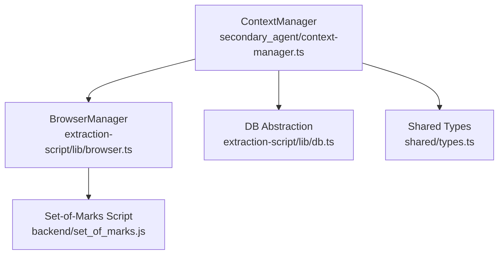
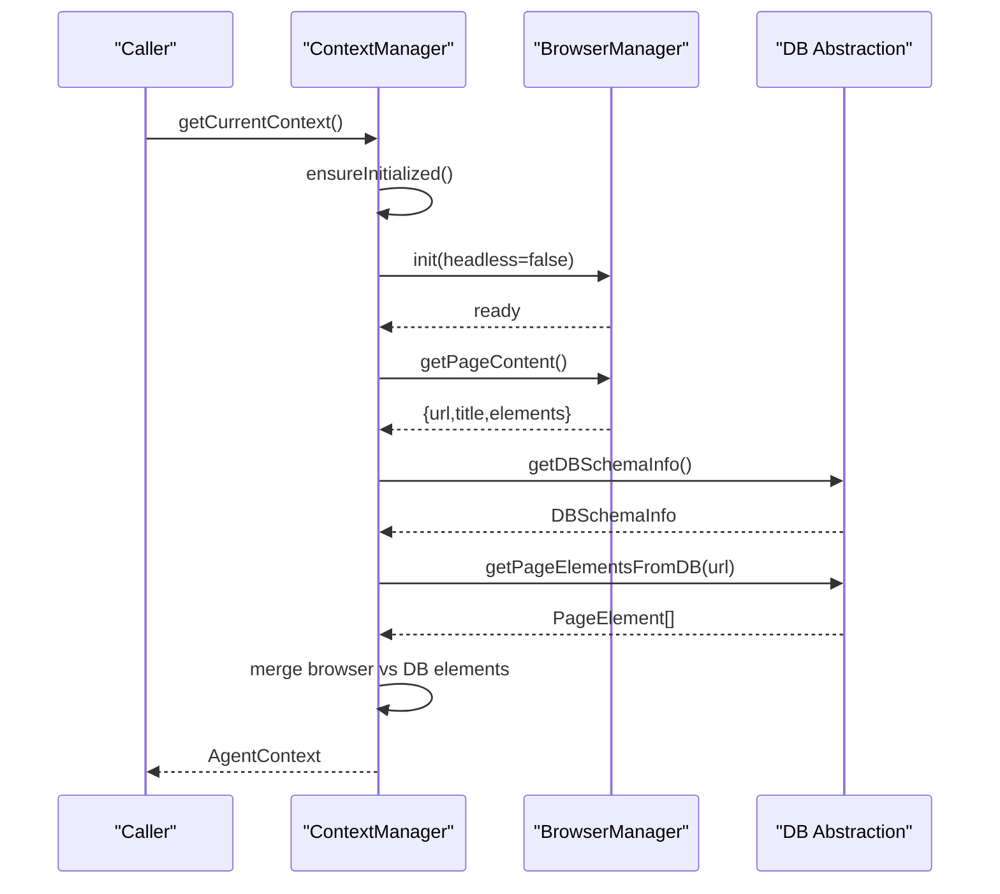
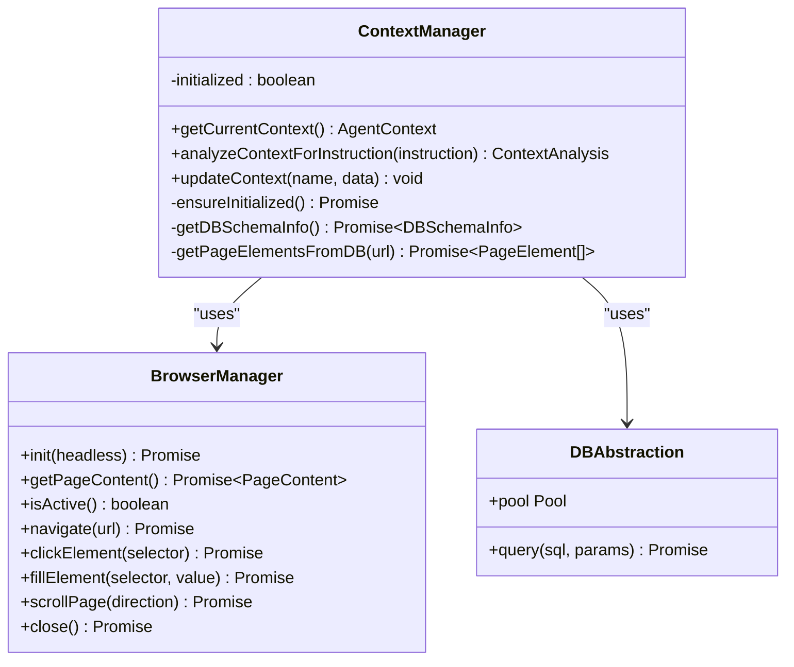
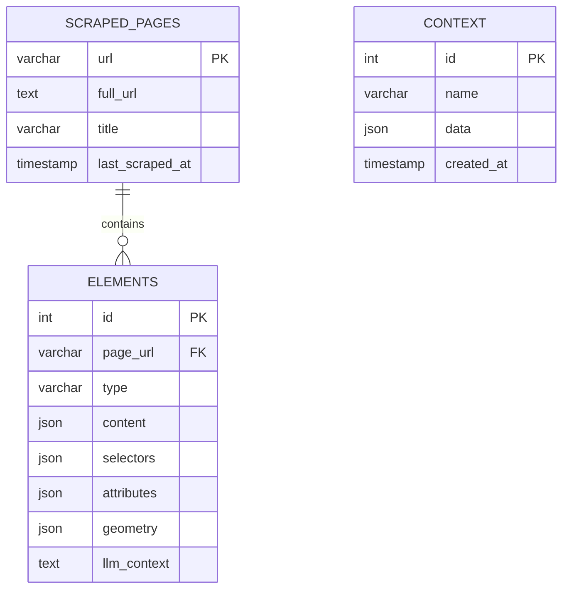
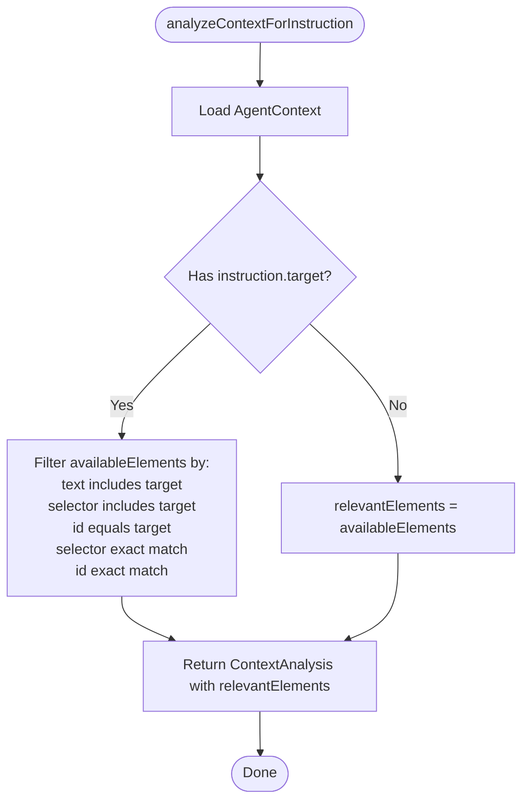
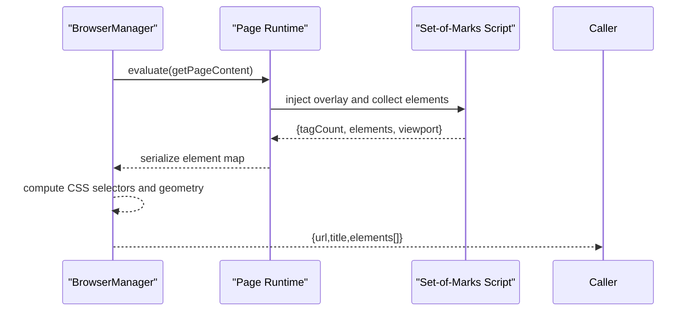
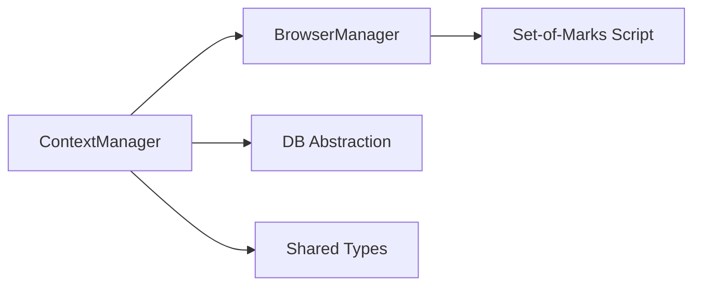

# Context Manager

<cite>
**Referenced Files in This Document**
- [context-manager.ts](file://secondary_agent/context-manager.ts)
- [types.ts](file://secondary_agent/types.ts)
- [db.ts](file://extraction-script/lib/db.ts)
- [browser.ts](file://extraction-script/lib/browser.ts)
- [set_of_marks.js](file://backend/set_of_marks.js)
- [types.ts](file://shared/types.ts)
</cite>

## Table of Contents
1. [Introduction](#introduction)
2. [Project Structure](#project-structure)
3. [Core Components](#core-components)
4. [Architecture Overview](#architecture-overview)
5. [Detailed Component Analysis](#detailed-component-analysis)
6. [Dependency Analysis](#dependency-analysis)
7. [Performance Considerations](#performance-considerations)
8. [Troubleshooting Guide](#troubleshooting-guide)
9. [Conclusion](#conclusion)

## Introduction
This document describes the Context Manager component responsible for maintaining page state, tracking available elements, and synchronizing with the database. It explains how the Context Manager analyzes the current page context to determine optimal execution strategies, documents database operations (schema queries, element tracking, and context persistence), and outlines update mechanisms and state consistency guarantees. It also covers integration with the Set-of-Marks system for element identification and selection, provides examples of context transitions during multi-step operations, and addresses performance and error recovery considerations.

## Project Structure
The Context Manager lives in the secondary agent layer and orchestrates interactions between the browser automation layer and the database abstraction. It relies on:
- A browser manager to capture page state and elements
- A database abstraction to query schema, element sets, and persist context snapshots
- Shared types to define the context model and analysis results

**Diagram sources**
- [context-manager.ts](file://secondary_agent/context-manager.ts#L23-L77)
- [browser.ts](file://extraction-script/lib/browser.ts#L4-L29)
- [db.ts](file://extraction-script/lib/db.ts#L92-L102)
- [set_of_marks.js](file://backend/set_of_marks.js#L1-L229)
- [types.ts](file://shared/types.ts#L13-L61)

**Section sources**
- [context-manager.ts](file://secondary_agent/context-manager.ts#L1-L223)
- [browser.ts](file://extraction-script/lib/browser.ts#L1-L254)
- [db.ts](file://extraction-script/lib/db.ts#L1-L105)
- [set_of_marks.js](file://backend/set_of_marks.js#L1-L229)
- [types.ts](file://shared/types.ts#L1-L85)

## Core Components
- ContextManager: Central coordinator that merges browser-derived page state with database-backed element catalogs, performs context analysis for instructions, and persists context snapshots.
- BrowserManager: Provides a singleton Playwright-based browser to capture page content, compute element sets, and perform navigation/interaction tasks.
- DB Abstraction: Manages MySQL connection pooling, ensures schema existence, and executes queries safely with error logging.
- Set-of-Marks: Injected script that overlays visible interactive elements with numbered tags and returns a serializable map for element identification and selection.
- Shared Types: Defines AgentContext, PageElement, DBSchemaInfo, and ContextAnalysis used across components.

**Section sources**
- [context-manager.ts](file://secondary_agent/context-manager.ts#L23-L77)
- [browser.ts](file://extraction-script/lib/browser.ts#L4-L254)
- [db.ts](file://extraction-script/lib/db.ts#L92-L102)
- [types.ts](file://shared/types.ts#L13-L61)

## Architecture Overview
The Context Manager’s lifecycle involves initializing dependencies, capturing page state via the browser, enriching with database-backed elements, and returning a unified context for downstream agents.

**Diagram sources**
- [context-manager.ts](file://secondary_agent/context-manager.ts#L36-L77)
- [browser.ts](file://extraction-script/lib/browser.ts#L20-L29)
- [browser.ts](file://extraction-script/lib/browser.ts#L125-L215)
- [db.ts](file://extraction-script/lib/db.ts#L128-L172)
- [db.ts](file://extraction-script/lib/db.ts#L177-L204)

## Detailed Component Analysis

### ContextManager
Responsibilities:
- Initialize extraction-script dependencies lazily on first use
- Capture current page state from the browser and augment with database-backed elements
- Provide context analysis for instructions by filtering relevant elements
- Persist context snapshots into the database
- Expose database schema information for diagnostics

Key behaviors:
- getCurrentContext merges browser-derived elements with DB-stored elements, preferring browser data when present
- analyzeContextForInstruction filters available elements based on instruction target using multiple matching strategies
- updateContext persists structured context data into the context table

**Diagram sources**
- [context-manager.ts](file://secondary_agent/context-manager.ts#L23-L222)
- [browser.ts](file://extraction-script/lib/browser.ts#L4-L254)
- [db.ts](file://extraction-script/lib/db.ts#L92-L102)

**Section sources**
- [context-manager.ts](file://secondary_agent/context-manager.ts#L23-L222)

### Database Operations and Schema
The DB abstraction ensures schema presence and exposes a single query function. The schema includes:
- scraped_pages: stores page URLs, titles, and timestamps
- elements: stores per-page interactive elements with JSON content, selectors, attributes, geometry, and optional LLM context
- context: stores serialized context snapshots with timestamps

Operations:
- Schema verification and table creation on first use
- Query execution with centralized error logging
- Element retrieval by page URL
- Context insertion by name and JSON payload

**Diagram sources**
- [db.ts](file://extraction-script/lib/db.ts#L35-L68)

**Section sources**
- [db.ts](file://extraction-script/lib/db.ts#L17-L90)
- [db.ts](file://extraction-script/lib/db.ts#L92-L102)

### Context Analysis Workflow
The analysis process determines relevant elements for a given instruction by matching against multiple element characteristics.

**Diagram sources**
- [context-manager.ts](file://secondary_agent/context-manager.ts#L82-L123)

**Section sources**
- [context-manager.ts](file://secondary_agent/context-manager.ts#L82-L123)

### Integration with Set-of-Marks
The Set-of-Marks script overlays visible interactive elements with numbered tags and returns a serializable map of element metadata. The browser manager captures this data and augments it with computed CSS selectors and geometry. This enables robust element identification and selection across pages.

**Diagram sources**
- [browser.ts](file://extraction-script/lib/browser.ts#L125-L215)
- [set_of_marks.js](file://backend/set_of_marks.js#L1-L229)

**Section sources**
- [browser.ts](file://extraction-script/lib/browser.ts#L125-L215)
- [set_of_marks.js](file://backend/set_of_marks.js#L1-L229)

### Context Transitions During Multi-Step Operations
Example scenarios:
- Navigate to a form page, capture elements, submit, and re-analyze the resulting page to find confirmation elements.
- Scroll to reveal hidden elements, refresh context, and update context with new element counts.
- Fill inputs and re-run context analysis to locate next actionable elements.

These transitions rely on:
- getCurrentContext to refresh page state and element catalogs
- analyzeContextForInstruction to refine element selection
- updateContext to persist intermediate context snapshots

**Section sources**
- [context-manager.ts](file://secondary_agent/context-manager.ts#L36-L77)
- [context-manager.ts](file://secondary_agent/context-manager.ts#L82-L123)
- [context-manager.ts](file://secondary_agent/context-manager.ts#L209-L221)

## Dependency Analysis
- ContextManager depends on BrowserManager for page state and on DB Abstraction for schema and element queries.
- BrowserManager depends on Playwright and injects the Set-of-Marks script to produce element metadata.
- DB Abstraction depends on mysql2/promise and manages schema initialization and query execution.
- Shared types define the contracts for AgentContext, PageElement, DBSchemaInfo, and ContextAnalysis.

**Diagram sources**
- [context-manager.ts](file://secondary_agent/context-manager.ts#L4-L5)
- [browser.ts](file://extraction-script/lib/browser.ts#L2-L2)
- [db.ts](file://extraction-script/lib/db.ts#L2-L2)
- [types.ts](file://shared/types.ts#L13-L61)

**Section sources**
- [context-manager.ts](file://secondary_agent/context-manager.ts#L4-L5)
- [browser.ts](file://extraction-script/lib/browser.ts#L2-L2)
- [db.ts](file://extraction-script/lib/db.ts#L2-L2)
- [types.ts](file://shared/types.ts#L13-L61)

## Performance Considerations
- Minimize repeated database queries by leveraging cached schema information and merging browser elements with DB elements efficiently.
- Prefer browser-derived elements when available to avoid redundant DB reads.
- Use targeted queries (e.g., element count by URL) to reduce payload sizes.
- Consider caching frequently accessed page element lists keyed by URL to reduce round-trips.
- Batch context updates when possible to reduce transaction overhead.

[No sources needed since this section provides general guidance]

## Troubleshooting Guide
Common issues and remedies:
- Database connectivity failures: The DB abstraction logs query errors and throws. Verify credentials, database existence, and network connectivity. Retry operations after ensuring the service is reachable.
- Schema initialization failures: On first use, schema verification creates tables and ensures column presence. Review logs for initialization errors and confirm permissions.
- Browser initialization failures: The ContextManager attempts to initialize the browser and tolerates partial failures. Ensure Playwright dependencies are installed and Chromium is available.
- Element discovery discrepancies: If Set-of-Marks is missing, the embedded script is used as a fallback. Confirm the overlay container is not removed prematurely and that visibility checks pass.

**Section sources**
- [db.ts](file://extraction-script/lib/db.ts#L95-L101)
- [context-manager.ts](file://secondary_agent/context-manager.ts#L42-L49)
- [browser.ts](file://extraction-script/lib/browser.ts#L20-L29)
- [set_of_marks.js](file://backend/set_of_marks.js#L9-L13)

## Conclusion
The Context Manager centralizes page state maintenance, element tracking, and database synchronization. By combining browser-derived insights with persisted element catalogs and schema-aware queries, it enables robust context analysis and reliable execution strategies. Its integration with the Set-of-Marks system ensures consistent element identification, while careful error handling and performance-conscious design support scalable operation.