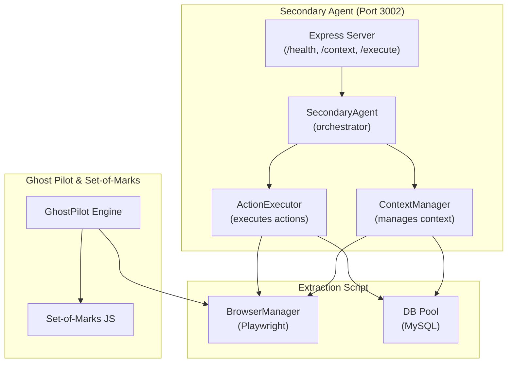
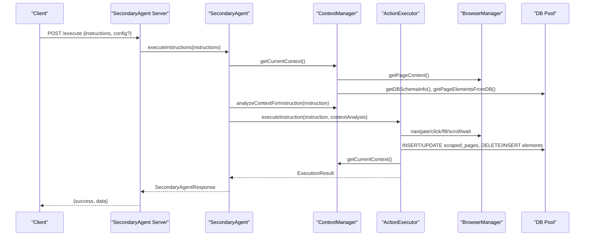
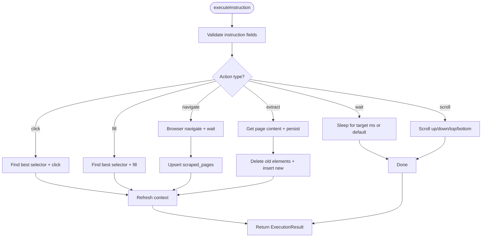
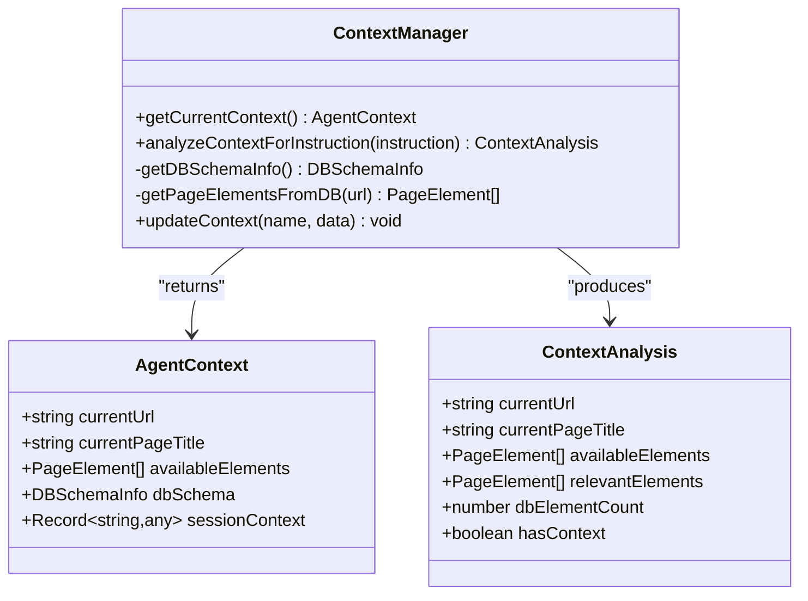
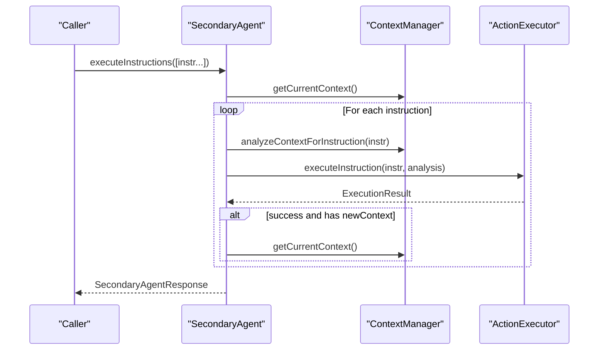
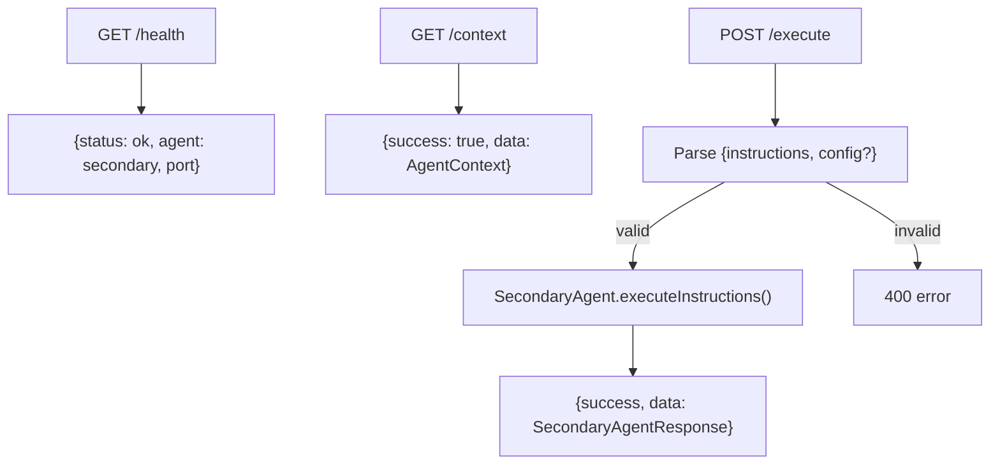
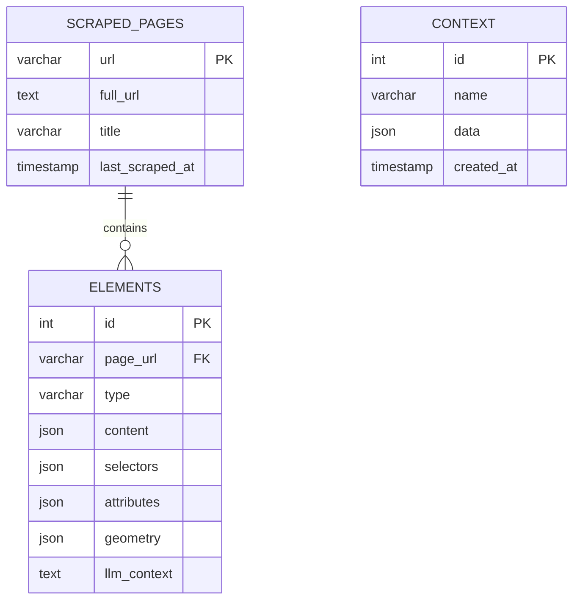
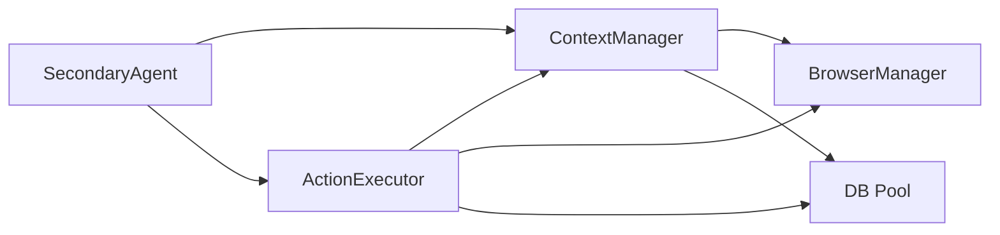
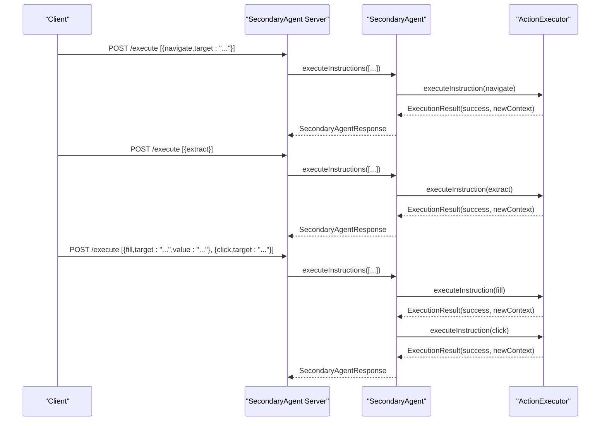

# Secondary Agent (Port 3002)

<cite>
**Referenced Files in This Document**
- [server.ts](file://secondary_agent/server.ts)
- [agent.ts](file://secondary_agent/agent.ts)
- [action-executor.ts](file://secondary_agent/action-executor.ts)
- [context-manager.ts](file://secondary_agent/context-manager.ts)
- [types.ts](file://secondary_agent/types.ts)
- [shared/types.ts](file://shared/types.ts)
- [db.ts](file://extraction-script/lib/db.ts)
- [browser.ts](file://extraction-script/lib/browser.ts)
- [ghost_pilot.py](file://backend/ghost_pilot.py)
- [set_of_marks.js](file://backend/set_of_marks.js)
- [main.py](file://backend/main.py)
</cite>

## Table of Contents
1. [Introduction](#introduction)
2. [Project Structure](#project-structure)
3. [Core Components](#core-components)
4. [Architecture Overview](#architecture-overview)
5. [Detailed Component Analysis](#detailed-component-analysis)
6. [Dependency Analysis](#dependency-analysis)
7. [Performance Considerations](#performance-considerations)
8. [Troubleshooting Guide](#troubleshooting-guide)
9. [Conclusion](#conclusion)
10. [Appendices](#appendices)

## Introduction
This document explains the Secondary Agent system that runs on port 3002. Its primary role is to translate high-level instructions into concrete browser automation actions, maintain page state and element tracking, and synchronize with a MySQL database. The system integrates with the Ghost Pilot engine and the Set-of-Marks system to enable robust autonomous browser interactions. It exposes REST endpoints for health checks, context retrieval, and batch instruction execution.

## Project Structure
The Secondary Agent is implemented as a standalone Express server with three core modules:
- ActionExecutor: executes individual actions against the browser and database
- ContextManager: maintains current page state, element tracking, and database schema info
- SecondaryAgent: orchestrates instruction sequences and aggregates results

These modules coordinate with the extraction-script’s browser automation and database utilities, and integrate with the Ghost Pilot engine and Set-of-Marks system for advanced page tagging and autonomous navigation.

**Diagram sources**
- [server.ts](file://secondary_agent/server.ts#L1-L100)
- [agent.ts](file://secondary_agent/agent.ts#L1-L119)
- [action-executor.ts](file://secondary_agent/action-executor.ts#L1-L391)
- [context-manager.ts](file://secondary_agent/context-manager.ts#L1-L223)
- [browser.ts](file://extraction-script/lib/browser.ts#L1-L254)
- [db.ts](file://extraction-script/lib/db.ts#L1-L105)
- [ghost_pilot.py](file://backend/ghost_pilot.py#L1-L802)
- [set_of_marks.js](file://backend/set_of_marks.js#L1-L229)

**Section sources**
- [server.ts](file://secondary_agent/server.ts#L1-L100)
- [agent.ts](file://secondary_agent/agent.ts#L1-L119)
- [action-executor.ts](file://secondary_agent/action-executor.ts#L1-L391)
- [context-manager.ts](file://secondary_agent/context-manager.ts#L1-L223)
- [browser.ts](file://extraction-script/lib/browser.ts#L1-L254)
- [db.ts](file://extraction-script/lib/db.ts#L1-L105)
- [ghost_pilot.py](file://backend/ghost_pilot.py#L1-L802)
- [set_of_marks.js](file://backend/set_of_marks.js#L1-L229)

## Core Components
- SecondaryAgent: orchestrates instruction sequences, manages context, and aggregates results
- ActionExecutor: executes actions (navigate, click, fill, extract, wait, scroll) with retry logic and LLM-assisted selector improvement
- ContextManager: retrieves current page context, merges browser and database elements, and provides schema-aware analysis
- Express Server: exposes /health, /context, and /execute endpoints

Key types define instructions, context, and execution results for consistent inter-module communication.

**Section sources**
- [agent.ts](file://secondary_agent/agent.ts#L1-L119)
- [action-executor.ts](file://secondary_agent/action-executor.ts#L1-L391)
- [context-manager.ts](file://secondary_agent/context-manager.ts#L1-L223)
- [types.ts](file://secondary_agent/types.ts#L1-L37)
- [shared/types.ts](file://shared/types.ts#L1-L85)

## Architecture Overview
The Secondary Agent sits between the frontend and the extraction-script utilities. It receives instruction batches, analyzes context, executes actions against the browser, and persists state to the database. The Ghost Pilot engine and Set-of-Marks system underpin autonomous navigation and element tagging capabilities.

**Diagram sources**
- [server.ts](file://secondary_agent/server.ts#L60-L91)
- [agent.ts](file://secondary_agent/agent.ts#L32-L109)
- [context-manager.ts](file://secondary_agent/context-manager.ts#L36-L77)
- [action-executor.ts](file://secondary_agent/action-executor.ts#L53-L110)
- [browser.ts](file://extraction-script/lib/browser.ts#L35-L234)
- [db.ts](file://extraction-script/lib/db.ts#L92-L102)

## Detailed Component Analysis

### ActionExecutor
Responsibilities:
- Translates high-level AgentInstruction into concrete browser actions
- Implements retry logic for selector failures
- Uses an LLM to improve selectors when needed
- Persists page metadata and element data to the database
- Returns structured ExecutionResult with success/error/newContext

Execution pipeline:
- Instruction parsing: validates presence of required fields (target/value)
- Selector resolution: tries exact match, text match, relevant elements, then LLM
- Action execution: performs navigate/click/fill/extract/wait/scroll
- Post-action context refresh: updates AgentContext
- Database synchronization: inserts/upserts page records and element rows

Retry logic:
- For click/fill actions, on failure attempts LLM-driven selector improvement before giving up
- Limits retries based on configuration

**Diagram sources**
- [action-executor.ts](file://secondary_agent/action-executor.ts#L53-L110)
- [action-executor.ts](file://secondary_agent/action-executor.ts#L115-L144)
- [action-executor.ts](file://secondary_agent/action-executor.ts#L149-L174)
- [action-executor.ts](file://secondary_agent/action-executor.ts#L179-L200)
- [action-executor.ts](file://secondary_agent/action-executor.ts#L205-L248)
- [action-executor.ts](file://secondary_agent/action-executor.ts#L253-L269)
- [action-executor.ts](file://secondary_agent/action-executor.ts#L274-L288)

**Section sources**
- [action-executor.ts](file://secondary_agent/action-executor.ts#L29-L41)
- [action-executor.ts](file://secondary_agent/action-executor.ts#L53-L110)
- [action-executor.ts](file://secondary_agent/action-executor.ts#L115-L144)
- [action-executor.ts](file://secondary_agent/action-executor.ts#L149-L174)
- [action-executor.ts](file://secondary_agent/action-executor.ts#L179-L200)
- [action-executor.ts](file://secondary_agent/action-executor.ts#L205-L248)
- [action-executor.ts](file://secondary_agent/action-executor.ts#L253-L288)
- [action-executor.ts](file://secondary_agent/action-executor.ts#L293-L332)
- [action-executor.ts](file://secondary_agent/action-executor.ts#L337-L390)

### ContextManager
Responsibilities:
- Retrieve current page state from the browser
- Merge browser-derived elements with database-stored elements
- Provide schema-aware context analysis for instruction targeting
- Persist named context snapshots to the database

Context analysis:
- Filters available elements relevant to the instruction target
- Counts elements for the current page from the database
- Builds a ContextAnalysis object for downstream executors

**Diagram sources**
- [context-manager.ts](file://secondary_agent/context-manager.ts#L23-L77)
- [context-manager.ts](file://secondary_agent/context-manager.ts#L82-L123)
- [shared/types.ts](file://shared/types.ts#L13-L20)
- [shared/types.ts](file://shared/types.ts#L21-L41)
- [shared/types.ts](file://shared/types.ts#L41-L61)

**Section sources**
- [context-manager.ts](file://secondary_agent/context-manager.ts#L36-L77)
- [context-manager.ts](file://secondary_agent/context-manager.ts#L82-L123)
- [context-manager.ts](file://secondary_agent/context-manager.ts#L128-L172)
- [context-manager.ts](file://secondary_agent/context-manager.ts#L177-L204)
- [context-manager.ts](file://secondary_agent/context-manager.ts#L209-L221)

### SecondaryAgent (Orchestrator)
Responsibilities:
- Execute a sequence of instructions with ordered context updates
- Aggregate ExecutionResult objects and produce a SecondaryAgentResponse
- Handle partial failures and continue processing remaining instructions
- Provide a getContext endpoint for external inspection

**Diagram sources**
- [agent.ts](file://secondary_agent/agent.ts#L32-L109)

**Section sources**
- [agent.ts](file://secondary_agent/agent.ts#L9-L27)
- [agent.ts](file://secondary_agent/agent.ts#L32-L109)
- [agent.ts](file://secondary_agent/agent.ts#L114-L116)

### API Endpoints
- GET /health: returns agent health status
- GET /context: returns current AgentContext; gracefully handles uninitialized browser
- POST /execute: executes an array of AgentInstruction with optional runtime config overrides

**Diagram sources**
- [server.ts](file://secondary_agent/server.ts#L18-L21)
- [server.ts](file://secondary_agent/server.ts#L23-L58)
- [server.ts](file://secondary_agent/server.ts#L60-L91)

**Section sources**
- [server.ts](file://secondary_agent/server.ts#L18-L21)
- [server.ts](file://secondary_agent/server.ts#L23-L58)
- [server.ts](file://secondary_agent/server.ts#L60-L91)

### Database Operations and Schema
The Secondary Agent uses a MySQL pool to manage:
- scraped_pages: stores page URLs, titles, and timestamps
- elements: stores per-page element metadata (type, content, selectors, attributes, geometry)
- context: stores named context snapshots

Schema design and queries:
- Ensures database and tables exist on first use
- Upserts scraped_pages on navigate/extract
- Deletes stale elements per page before inserting new ones
- Provides schema introspection and current page summary

**Diagram sources**
- [db.ts](file://extraction-script/lib/db.ts#L35-L80)

**Section sources**
- [db.ts](file://extraction-script/lib/db.ts#L5-L13)
- [db.ts](file://extraction-script/lib/db.ts#L17-L90)
- [db.ts](file://extraction-script/lib/db.ts#L92-L102)

### Integration with Ghost Pilot and Set-of-Marks
While the Secondary Agent focuses on deterministic instruction execution, the broader system leverages:
- Ghost Pilot engine for autonomous navigation and action selection
- Set-of-Marks JavaScript to overlay yellow tags on interactive elements and compute unique selectors

These components inform the Secondary Agent’s context and selector strategies, especially for click/fill actions.

**Section sources**
- [ghost_pilot.py](file://backend/ghost_pilot.py#L18-L105)
- [ghost_pilot.py](file://backend/ghost_pilot.py#L148-L157)
- [set_of_marks.js](file://backend/set_of_marks.js#L8-L149)
- [set_of_marks.js](file://backend/set_of_marks.js#L202-L228)

## Dependency Analysis
- SecondaryAgent depends on ContextManager and ActionExecutor
- ActionExecutor depends on ContextManager, BrowserManager, and DB pool
- ContextManager depends on BrowserManager and DB pool
- BrowserManager is a singleton wrapper around Playwright Chromium
- DB pool encapsulates MySQL connectivity and schema initialization

**Diagram sources**
- [agent.ts](file://secondary_agent/agent.ts#L9-L27)
- [action-executor.ts](file://secondary_agent/action-executor.ts#L29-L41)
- [context-manager.ts](file://secondary_agent/context-manager.ts#L23-L31)
- [browser.ts](file://extraction-script/lib/browser.ts#L13-L29)
- [db.ts](file://extraction-script/lib/db.ts#L5-L13)

**Section sources**
- [agent.ts](file://secondary_agent/agent.ts#L9-L27)
- [action-executor.ts](file://secondary_agent/action-executor.ts#L29-L41)
- [context-manager.ts](file://secondary_agent/context-manager.ts#L23-L31)
- [browser.ts](file://extraction-script/lib/browser.ts#L13-L29)
- [db.ts](file://extraction-script/lib/db.ts#L5-L13)

## Performance Considerations
- Browser waits: deliberate delays after navigation/click/fill/scroll to allow page settling
- Retry logic: limited attempts for selector failures with LLM-backed selector refinement
- Database batching: element inserts performed in bulk per page during extract
- Connection pooling: MySQL pool configured with reasonable limits
- Selector resolution prioritization reduces LLM calls by leveraging exact/text/relevant matches first

[No sources needed since this section provides general guidance]

## Troubleshooting Guide
Common issues and remedies:
- Browser not initialized: /context returns empty context gracefully; initialize browser via ContextManager or ensure proper startup order
- Selector failures on click/fill: ActionExecutor retries with LLM-improved selectors; verify instruction targets and element visibility
- Database connectivity: ensure MySQL is running and credentials are correct; schema is auto-initialized on first query
- Health checks: use /health to confirm service availability

**Section sources**
- [server.ts](file://secondary_agent/server.ts#L33-L57)
- [action-executor.ts](file://secondary_agent/action-executor.ts#L89-L110)
- [context-manager.ts](file://secondary_agent/context-manager.ts#L42-L49)
- [db.ts](file://extraction-script/lib/db.ts#L92-L102)

## Conclusion
The Secondary Agent (port 3002) provides a robust, database-backed execution layer for browser automation. It translates high-level instructions into precise actions, maintains accurate page state, and integrates with the broader Ghost Pilot ecosystem. Its modular design supports reliable retries, schema-aware context, and scalable database operations.

[No sources needed since this section summarizes without analyzing specific files]

## Appendices

### Example Multi-Step Workflow
A typical workflow involves navigating to a page, extracting elements, filling forms, clicking buttons, scrolling, and waiting. The SecondaryAgent orchestrates these steps, updating context after each successful action.

**Diagram sources**
- [server.ts](file://secondary_agent/server.ts#L60-L91)
- [agent.ts](file://secondary_agent/agent.ts#L32-L109)
- [action-executor.ts](file://secondary_agent/action-executor.ts#L53-L110)
- [action-executor.ts](file://secondary_agent/action-executor.ts#L115-L144)
- [action-executor.ts](file://secondary_agent/action-executor.ts#L179-L200)
- [action-executor.ts](file://secondary_agent/action-executor.ts#L205-L248)