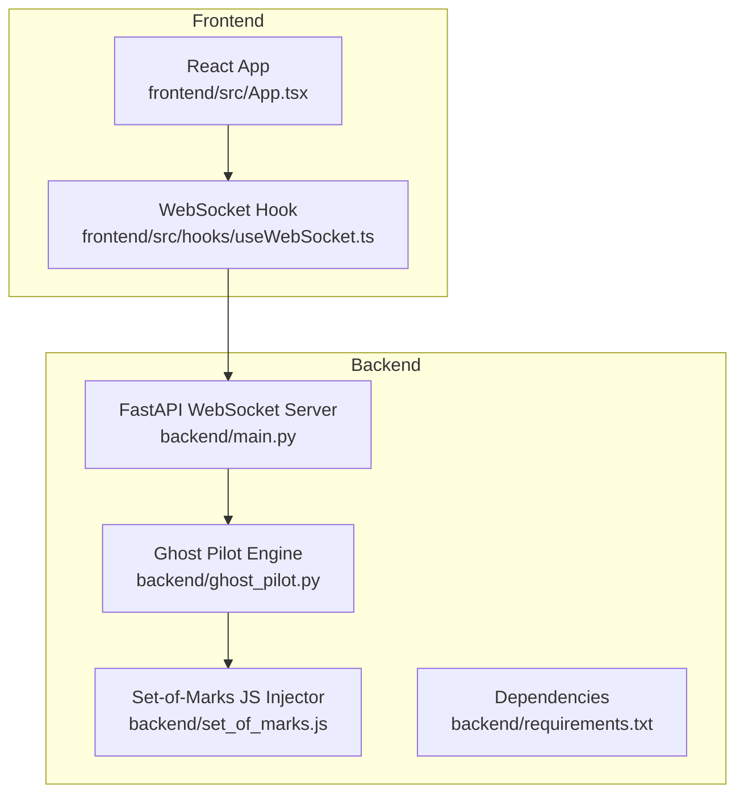
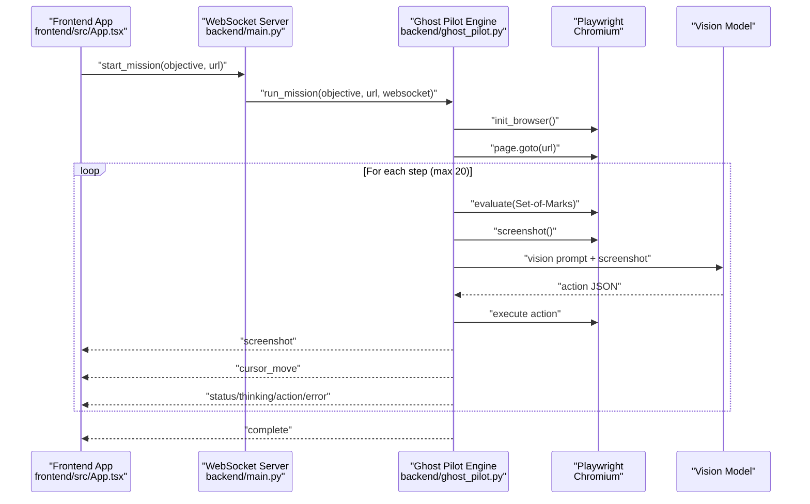
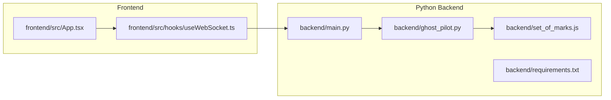

# Backend System

<cite>
**Referenced Files in This Document**
- [main.py](file://backend/main.py)
- [ghost_pilot.py](file://backend/ghost_pilot.py)
- [set_of_marks.js](file://backend/set_of_marks.js)
- [requirements.txt](file://backend/requirements.txt)
- [useWebSocket.ts](file://frontend/src/hooks/useWebSocket.ts)
- [App.tsx](file://frontend/src/App.tsx)
- [README.md](file://frontend/README.md)
</cite>

## Table of Contents
1. [Introduction](#introduction)
2. [Project Structure](#project-structure)
3. [Core Components](#core-components)
4. [Architecture Overview](#architecture-overview)
5. [Detailed Component Analysis](#detailed-component-analysis)
6. [Dependency Analysis](#dependency-analysis)
7. [Performance Considerations](#performance-considerations)
8. [Troubleshooting Guide](#troubleshooting-guide)
9. [Conclusion](#conclusion)
10. [Appendices](#appendices)

## Introduction
This document explains the Python backend system that powers the Ghost Pilot autonomous browser agent. It focuses on:
- The FastAPI WebSocket server that streams real-time browser automation to the frontend
- The Ghost Pilot engine that orchestrates vision-based navigation using GPT-4o, a Set-of-Marks element tagging system, and Playwright-driven actions
- The JavaScript injection mechanism that dynamically tags interactive elements with yellow overlays
- Real-time communication protocols, error handling, rate limiting, and safety measures
- API endpoint documentation for WebSocket message types and data formats

## Project Structure
The backend is organized around a FastAPI WebSocket server, a core autonomous engine, and a small JavaScript injection module. The frontend consumes the WebSocket stream and renders visual feedback.

**Diagram sources**
- [main.py](file://backend/main.py#L1-L157)
- [ghost_pilot.py](file://backend/ghost_pilot.py#L1-L802)
- [set_of_marks.js](file://backend/set_of_marks.js#L1-L229)
- [requirements.txt](file://backend/requirements.txt#L1-L8)
- [App.tsx](file://frontend/src/App.tsx#L1-L360)
- [useWebSocket.ts](file://frontend/src/hooks/useWebSocket.ts#L1-L93)

**Section sources**
- [main.py](file://backend/main.py#L1-L157)
- [ghost_pilot.py](file://backend/ghost_pilot.py#L1-L802)
- [set_of_marks.js](file://backend/set_of_marks.js#L1-L229)
- [requirements.txt](file://backend/requirements.txt#L1-L8)
- [App.tsx](file://frontend/src/App.tsx#L1-L360)
- [useWebSocket.ts](file://frontend/src/hooks/useWebSocket.ts#L1-L93)

## Core Components
- FastAPI WebSocket server: Accepts connections, receives mission commands, initializes the Ghost Pilot engine, and streams real-time events to the frontend.
- Ghost Pilot engine: Initializes the browser, injects Set-of-Marks, captures screenshots, queries a vision model, executes actions, and manages rate limits and safety checks.
- Set-of-Marks JavaScript: Injects yellow overlays onto interactive elements and returns a serializable element map for targeting.
- Frontend WebSocket client: Receives and renders screenshots, cursor movements, status updates, and handles user-initiated overrides.

**Section sources**
- [main.py](file://backend/main.py#L36-L153)
- [ghost_pilot.py](file://backend/ghost_pilot.py#L18-L105)
- [set_of_marks.js](file://backend/set_of_marks.js#L8-L229)
- [useWebSocket.ts](file://frontend/src/hooks/useWebSocket.ts#L1-L93)

## Architecture Overview
The system follows a real-time streaming architecture:
- The frontend connects to the backend WebSocket and sends mission commands.
- The backend starts the Ghost Pilot engine, which:
  - Launches a Chromium browser via Playwright
  - Injects Set-of-Marks to tag interactive elements
  - Captures screenshots and sends them to the vision model
  - Executes actions (click, type, scroll, wait) using Playwright
  - Streams intermediate events (screenshots, cursor moves, status, thinking) back to the frontend

**Diagram sources**
- [main.py](file://backend/main.py#L36-L153)
- [ghost_pilot.py](file://backend/ghost_pilot.py#L623-L768)
- [App.tsx](file://frontend/src/App.tsx#L146-L174)

## Detailed Component Analysis

### FastAPI WebSocket Server (main.py)
Responsibilities:
- Accept WebSocket connections
- Parse incoming messages and route to the Ghost Pilot engine
- Manage lifecycle: initialization, mission execution, cleanup
- Stream real-time events to the frontend

Key behaviors:
- Supports two message types:
  - start_mission: initializes the engine with provider configuration and begins autonomous navigation
  - skip_captcha: toggles a manual override to skip waiting for captcha resolution
- Sends status, thinking, screenshot, action, captcha_detected/solved, complete, and error events
- Keeps the browser open by default after mission completion for manual inspection

Safety and error handling:
- Catches WebSocket disconnects and general exceptions
- Attempts to send error messages to the frontend before cleanup
- Ensures browser resources are released on disconnect

Operational flow:
- On start_mission, selects provider (LM Studio, OpenAI, Gemini, OpenRouter, or custom) based on environment variables
- Initializes Ghost Pilot with selected provider and model
- Runs the mission loop and streams updates
- On completion or error, sends final status and keeps browser open

**Section sources**
- [main.py](file://backend/main.py#L36-L153)

### Ghost Pilot Engine (ghost_pilot.py)
Core responsibilities:
- Browser lifecycle management (initialize, close)
- Set-of-Marks injection and element mapping
- Screenshot capture and vision model querying
- Action execution (click, type, scroll, wait, finish)
- Rate limiting and retry strategies
- Safety checks (captcha detection, loop prevention, max steps)

Engine architecture:
- Provider abstraction supports multiple LLM backends (OpenAI-compatible, Gemini, OpenRouter, LM Studio, custom)
- Uses Playwright for browser automation and mouse/keyboard interactions
- Implements robust retry/backoff for rate-limited and transient failures
- Tracks action history to prevent repeated actions and guide decision-making

Vision model integration:
- Builds a system prompt that includes objective, current URL, viewport, and recent actions
- Queries the selected provider’s API with a screenshot payload
- Parses and validates JSON responses, cleaning markdown and comments
- Emits warnings for repeated actions (allowing LLM to learn) but prevents infinite loops

Action execution:
- Resolves tag IDs to element centers or falls back to raw coordinates
- Performs mouse clicks and keyboard typing with delays
- Scrolls the viewport and waits between steps

Captcha handling:
- Detects visible captcha frames and challenge elements
- Streams detection and solved events
- Waits for user intervention or manual skip

Rate limiting:
- Enforces RPM and daily quotas for free-tier providers (OpenRouter, Gemini)
- Honors Retry-After headers when present
- Applies progressive backoff and linear backoff for server errors

Cleanup:
- Optionally keeps the browser open for manual inspection
- Safely closes pages, browsers, and Playwright instances

**Section sources**
- [ghost_pilot.py](file://backend/ghost_pilot.py#L18-L105)
- [ghost_pilot.py](file://backend/ghost_pilot.py#L140-L157)
- [ghost_pilot.py](file://backend/ghost_pilot.py#L299-L562)
- [ghost_pilot.py](file://backend/ghost_pilot.py#L564-L621)
- [ghost_pilot.py](file://backend/ghost_pilot.py#L623-L768)
- [ghost_pilot.py](file://backend/ghost_pilot.py#L769-L800)

### Set-of-Marks JavaScript Injection (set_of_marks.js)
Purpose:
- Dynamically inject yellow overlays on interactive elements
- Return a serializable element map with selectors, positions, and metadata
- Enable precise targeting for Playwright actions

Key features:
- Filters elements by visibility (offset parent, computed styles, viewport bounds)
- Generates unique CSS selectors for each element
- Computes center coordinates for cursor targeting
- Returns viewport metrics for scaling and coordinate mapping

Integration:
- Executed inside the browser context via Playwright evaluate
- Data is consumed by the Ghost Pilot engine to map tag IDs to actions

**Section sources**
- [set_of_marks.js](file://backend/set_of_marks.js#L8-L229)

### Frontend WebSocket Client and Message Handling
Frontend responsibilities:
- Establishes and maintains a WebSocket connection
- Parses incoming messages and updates UI state
- Streams user commands (start mission) and receives real-time events

Message handling:
- Receives and renders screenshots, cursor moves, thinking indicators, status updates, captcha events, and completion/error notifications
- Provides a manual override button to skip captcha waits
- Speaks status updates using speech synthesis

**Section sources**
- [useWebSocket.ts](file://frontend/src/hooks/useWebSocket.ts#L1-L93)
- [App.tsx](file://frontend/src/App.tsx#L26-L123)
- [App.tsx](file://frontend/src/App.tsx#L168-L174)

## Dependency Analysis
External dependencies (Python):
- FastAPI and Uvicorn for the WebSocket server
- Playwright for browser automation
- OpenAI SDK for vision model queries
- python-dotenv for environment configuration
- Pillow for image handling

Internal dependencies:
- main.py depends on ghost_pilot.py
- ghost_pilot.py depends on set_of_marks.js (or inline script)
- Frontend depends on WebSocket hook and React components

**Diagram sources**
- [main.py](file://backend/main.py#L1-L157)
- [ghost_pilot.py](file://backend/ghost_pilot.py#L1-L802)
- [set_of_marks.js](file://backend/set_of_marks.js#L1-L229)
- [requirements.txt](file://backend/requirements.txt#L1-L8)
- [App.tsx](file://frontend/src/App.tsx#L1-L360)
- [useWebSocket.ts](file://frontend/src/hooks/useWebSocket.ts#L1-L93)

**Section sources**
- [requirements.txt](file://backend/requirements.txt#L1-L8)
- [main.py](file://backend/main.py#L1-L157)
- [ghost_pilot.py](file://backend/ghost_pilot.py#L1-L802)

## Performance Considerations
- Browser viewport sizing: The engine sets a fixed viewport to reduce rendering overhead and stabilize element coordinates.
- Screenshot capture: Captures PNG images and encodes as base64 for transmission; consider compression or streaming alternatives if bandwidth becomes a bottleneck.
- Rate limiting: Enforced per provider to respect free-tier quotas and Retry-After headers; reduces API churn and improves reliability.
- Step limits: Maximum steps prevent long-running missions; tune based on use case.
- Action delays: Small sleeps between actions allow pages to settle and reduce race conditions.
- Memory management: Browser contexts and pages are closed on cleanup; keep browser open only when needed for manual inspection.

[No sources needed since this section provides general guidance]

## Troubleshooting Guide
Common issues and resolutions:
- WebSocket disconnected: Ensure the backend is running on port 8000 and CORS is configured. The frontend attempts auto-reconnect.
- Playwright executable missing: Install Chromium via Playwright installer.
- Invalid API key or provider configuration: Verify environment variables for the selected provider.
- Elements not tagged: Some pages hide elements until scrolled; ensure the page is fully loaded and visible.
- Captcha blocking automation: The system detects visible captchas and waits for user resolution; use the manual override to skip waiting.
- Rate limit exceeded: The engine applies backoff and respects Retry-After; consider switching providers or reducing frequency.

**Section sources**
- [README.md](file://frontend/README.md#L167-L183)
- [ghost_pilot.py](file://backend/ghost_pilot.py#L181-L231)
- [ghost_pilot.py](file://backend/ghost_pilot.py#L659-L706)

## Conclusion
The Ghost Pilot backend integrates FastAPI, Playwright, and a vision model to deliver a robust, real-time autonomous browser agent. The Set-of-Marks system enables precise targeting, while the engine’s rate limiting, safety checks, and retry logic improve reliability. The frontend provides immediate visual feedback and user controls, completing a cohesive autonomous browsing solution.

[No sources needed since this section summarizes without analyzing specific files]

## Appendices

### API Endpoint Documentation: WebSocket Messages

- Endpoint: ws://host:port/ws
- Transport: WebSocket
- Message types and payloads:

- start_mission
  - Purpose: Start a new mission
  - Payload fields:
    - type: "start_mission"
    - objective: string (mission goal)
    - url: string (starting URL; defaults to a search engine)
  - Example: {"type":"start_mission","objective":"Find a recipe","url":"https://www.google.com"}

- skip_captcha
  - Purpose: Skip waiting for captcha resolution
  - Payload fields:
    - type: "skip_captcha"
  - Example: {"type":"skip_captcha"}

- Server-to-Frontend Events:

- status
  - Fields: type:"status", message:string
  - Example: {"type":"status","message":"Loaded page"}

- thinking
  - Fields: type:"thinking", thinking:boolean
  - Example: {"type":"thinking","thinking":true}

- screenshot
  - Fields: type:"screenshot", screenshot:string (base64 PNG)
  - Example: {"type":"screenshot","screenshot":"iVBORw0K..."}

- action
  - Fields: type:"action", action_type:string, data:object
  - Subfields in data:
    - action_type: "click" | "type" | "scroll" | "wait" | "finish"
    - tag_id: number (for click/type)
    - coordinates: [x,y] (fallback)
    - text: string (for type)
    - scroll_direction: "down" | "up" (for scroll)
    - confidence: number (0.0–1.0)
  - Example: {"type":"action","action_type":"click","data":{"action_type":"click","tag_id":42}}

- cursor_move
  - Fields: type:"cursor_move", x:number, y:number
  - Example: {"type":"cursor_move","x":123,"y":456}

- captcha_detected
  - Fields: type:"captcha_detected", message:string
  - Example: {"type":"captcha_detected","message":"Captcha detected!"}

- captcha_solved
  - Fields: type:"captcha_solved", message:string
  - Example: {"type":"captcha_solved","message":"Captcha solved!"}

- complete
  - Fields: type:"complete", message:string
  - Example: {"type":"complete","message":"Mission accomplished!"}

- error
  - Fields: type:"error", error:string
  - Example: {"type":"error","error":"Step 3 failed: ..."}

- Frontend-to-Server Events:
  - start_mission: see above
  - skip_captcha: see above

Notes:
- The server streams multiple events per step: status, thinking, screenshot, action, and optional cursor_move.
- The frontend renders the screenshot and animates cursor movement based on received events.

**Section sources**
- [main.py](file://backend/main.py#L36-L153)
- [ghost_pilot.py](file://backend/ghost_pilot.py#L623-L768)
- [useWebSocket.ts](file://frontend/src/hooks/useWebSocket.ts#L3-L13)
- [App.tsx](file://frontend/src/App.tsx#L26-L123)