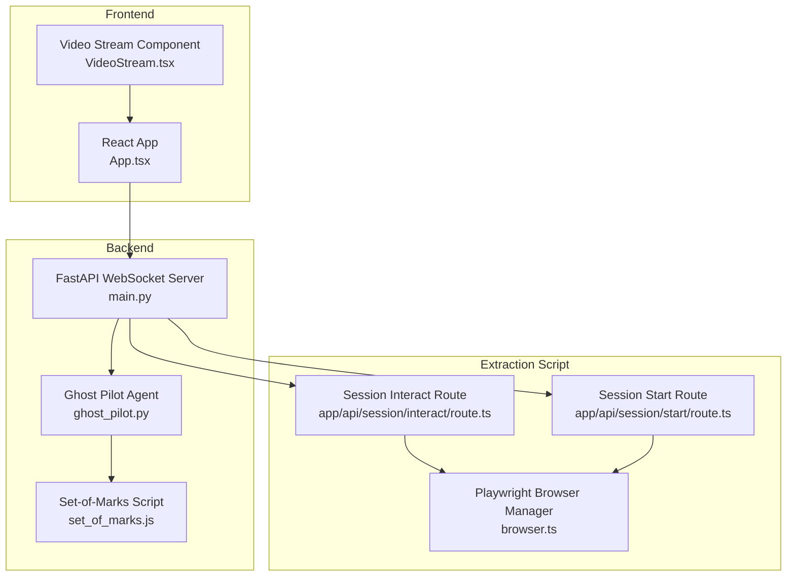
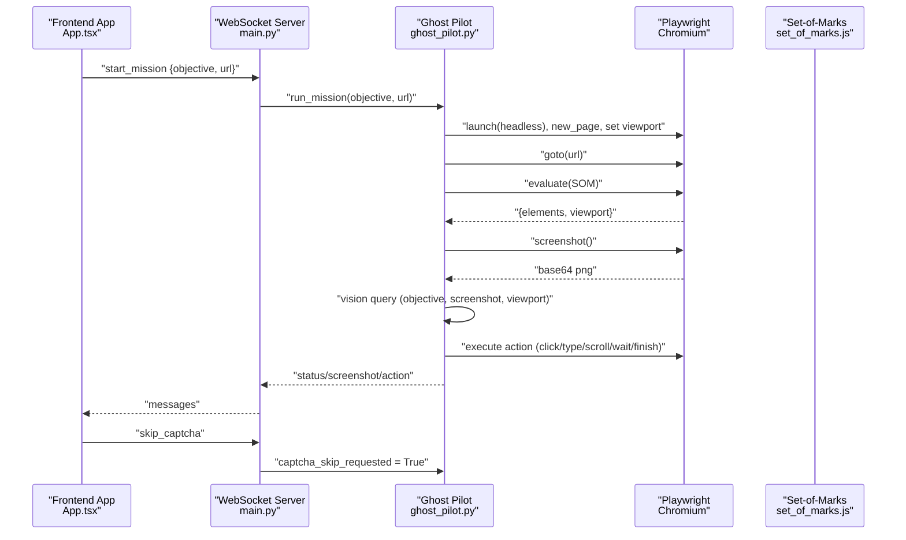
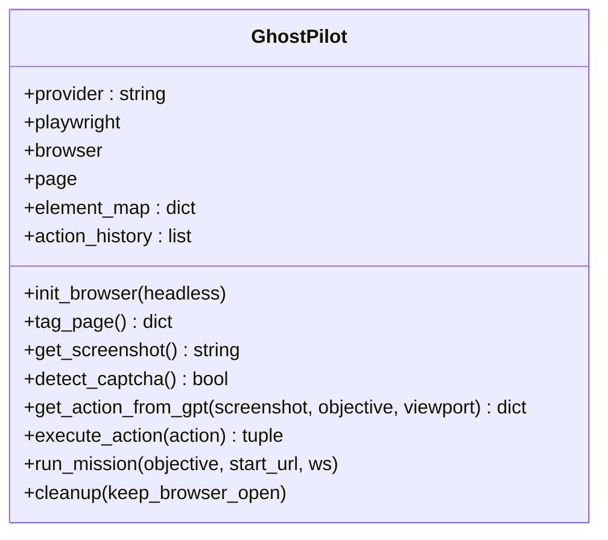
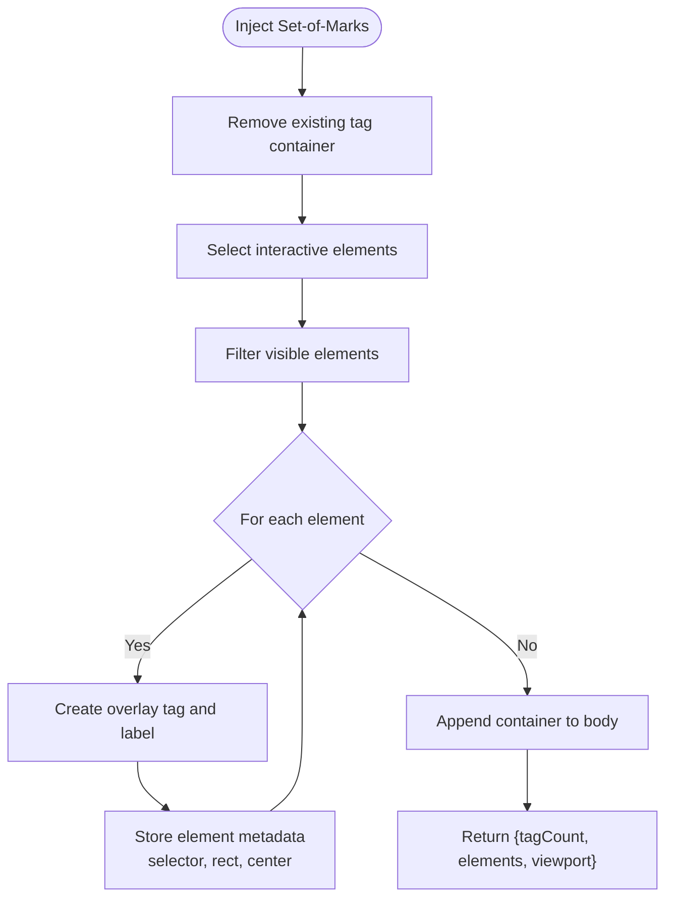
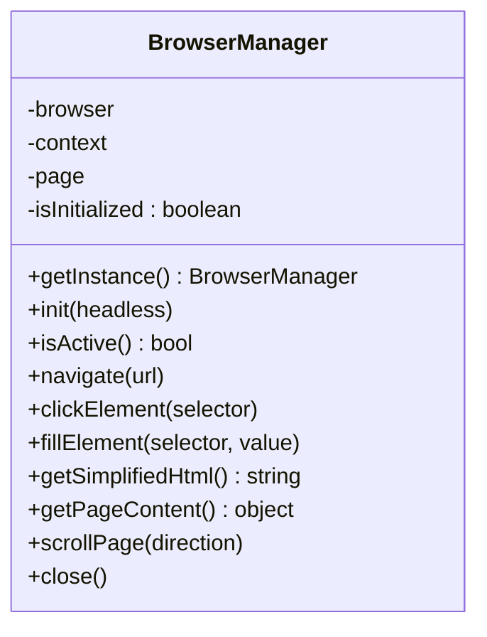
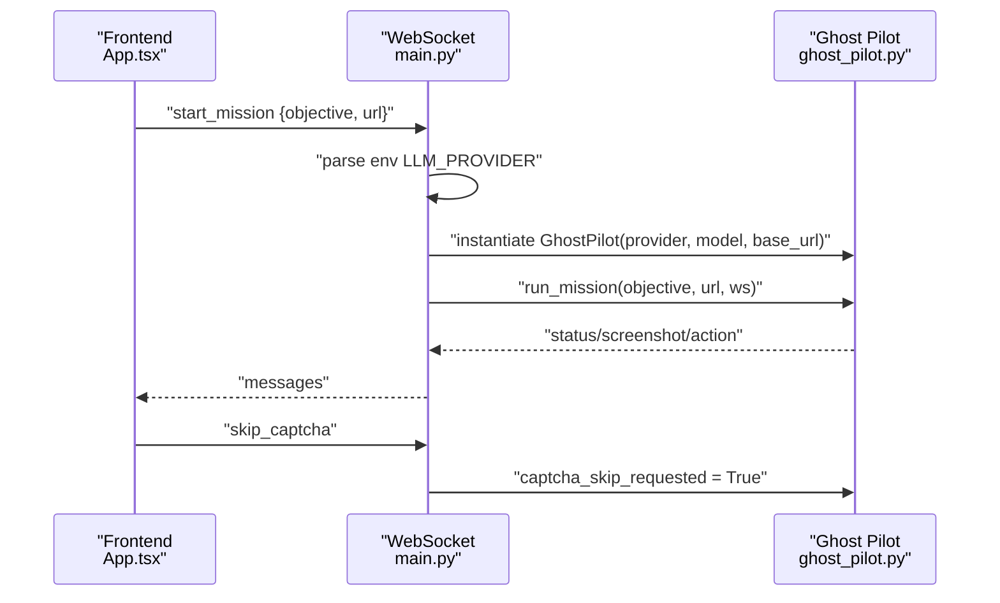
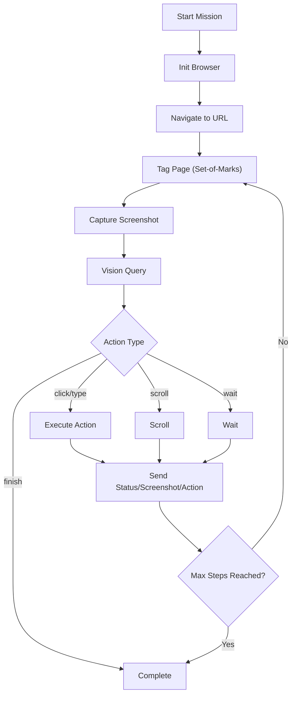
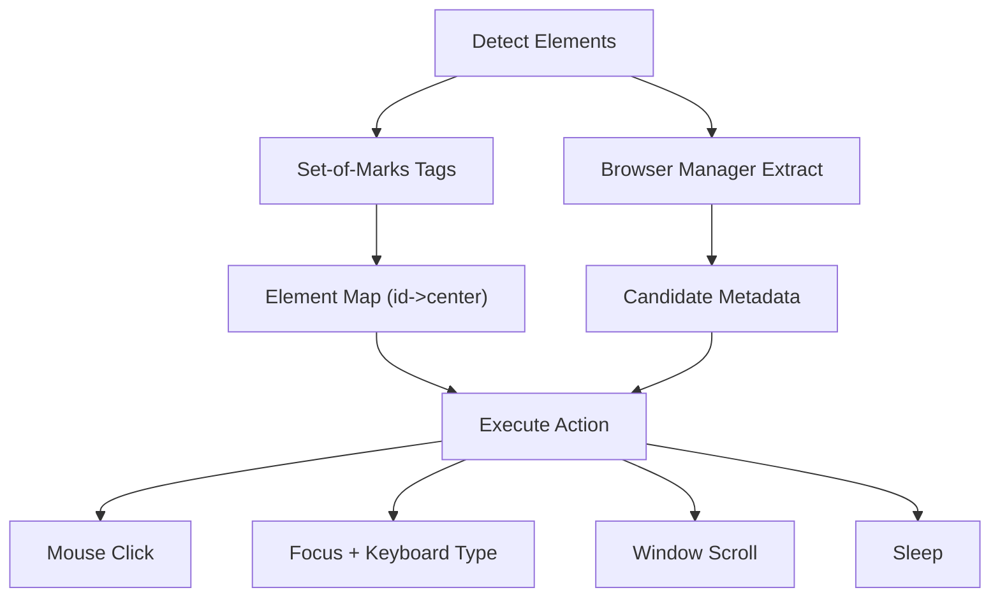
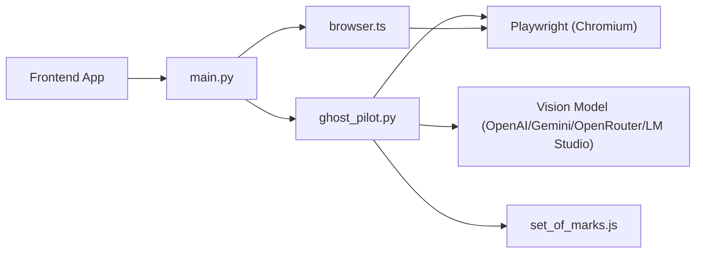

# Browser Automation

<cite>
**Referenced Files in This Document**
- [ghost_pilot.py](file://backend/ghost_pilot.py)
- [set_of_marks.js](file://backend/set_of_marks.js)
- [main.py](file://backend/main.py)
- [browser.ts](file://extraction-script/lib/browser.ts)
- [route.ts](file://extraction-script/app/api/session/interact/route.ts)
- [route.ts](file://extraction-script/app/api/session/start/route.ts)
- [App.tsx](file://frontend/src/App.tsx)
- [VideoStream.tsx](file://frontend/src/components/VideoStream.tsx)
</cite>

## Table of Contents
1. [Introduction](#introduction)
2. [Project Structure](#project-structure)
3. [Core Components](#core-components)
4. [Architecture Overview](#architecture-overview)
5. [Detailed Component Analysis](#detailed-component-analysis)
6. [Dependency Analysis](#dependency-analysis)
7. [Performance Considerations](#performance-considerations)
8. [Troubleshooting Guide](#troubleshooting-guide)
9. [Conclusion](#conclusion)

## Introduction
This document describes the browser automation subsystem powered by Playwright and integrated with a vision-driven autonomous agent. It covers browser initialization, page navigation, element interaction, screenshot capture, viewport management, visual state tracking, element detection and selection strategies, navigation state and history handling, error recovery, concurrency and resource management, cross-browser compatibility, headless/headed modes, and debugging techniques. It also explains the integration with the Set-of-Marks system for precise element targeting and the vision system for automated decision-making.

## Project Structure
The browser automation spans three major areas:
- Backend autonomous agent and vision integration
- Extraction and element discovery utilities
- Frontend visualization and user interaction

**Diagram sources**
- [main.py](file://backend/main.py#L36-L153)
- [ghost_pilot.py](file://backend/ghost_pilot.py#L18-L105)
- [set_of_marks.js](file://backend/set_of_marks.js#L8-L229)
- [browser.ts](file://extraction-script/lib/browser.ts#L4-L254)
- [route.ts](file://extraction-script/app/api/session/interact/route.ts)
- [route.ts](file://extraction-script/app/api/session/start/route.ts)
- [App.tsx](file://frontend/src/App.tsx#L26-L41)
- [VideoStream.tsx](file://frontend/src/components/VideoStream.tsx#L1-L42)

**Section sources**
- [main.py](file://backend/main.py#L1-L157)
- [ghost_pilot.py](file://backend/ghost_pilot.py#L1-L802)
- [set_of_marks.js](file://backend/set_of_marks.js#L1-L229)
- [browser.ts](file://extraction-script/lib/browser.ts#L1-L254)

## Core Components
- Ghost Pilot autonomous agent: orchestrates browser lifecycle, vision queries, action execution, and error handling.
- Set-of-Marks: injects visual tags on interactive elements and returns a serializable element map.
- Playwright Browser Manager: manages Chromium instance, navigation, element interactions, scrolling, and content extraction.
- WebSocket API: exposes endpoints for starting missions and interacting with the agent.
- Frontend visualization: displays live screenshots and cursor movements.

Key responsibilities:
- Browser initialization and viewport configuration
- Page navigation strategies and state tracking
- Element detection and selector generation
- Interaction patterns (clicks, text input, scrolling)
- Screenshot capture and visual state delivery
- Navigation state management and history awareness
- Error recovery and rate-limit handling
- Concurrency and resource cleanup

**Section sources**
- [ghost_pilot.py](file://backend/ghost_pilot.py#L140-L157)
- [set_of_marks.js](file://backend/set_of_marks.js#L8-L229)
- [browser.ts](file://extraction-script/lib/browser.ts#L20-L60)
- [main.py](file://backend/main.py#L36-L153)

## Architecture Overview
The system operates as an autonomous loop:
1. Initialize browser (headless or headed)
2. Navigate to the starting URL
3. Inject Set-of-Marks tags and capture viewport info
4. Capture screenshot and send to frontend
5. Query vision model for next action
6. Execute action (click, type, scroll, wait, finish)
7. Repeat until objective complete or max steps reached

**Diagram sources**
- [main.py](file://backend/main.py#L36-L153)
- [ghost_pilot.py](file://backend/ghost_pilot.py#L623-L768)
- [set_of_marks.js](file://backend/set_of_marks.js#L8-L229)

## Detailed Component Analysis

### Ghost Pilot Agent
Responsibilities:
- Initialize Playwright, launch browser, configure viewport
- Inject Set-of-Marks tags and maintain element map
- Capture screenshots and query vision model for actions
- Execute actions with robust error handling and retries
- Manage mission lifecycle and cleanup

**Diagram sources**
- [ghost_pilot.py](file://backend/ghost_pilot.py#L18-L105)
- [ghost_pilot.py](file://backend/ghost_pilot.py#L140-L157)
- [ghost_pilot.py](file://backend/ghost_pilot.py#L232-L239)
- [ghost_pilot.py](file://backend/ghost_pilot.py#L240-L297)
- [ghost_pilot.py](file://backend/ghost_pilot.py#L299-L562)
- [ghost_pilot.py](file://backend/ghost_pilot.py#L564-L622)
- [ghost_pilot.py](file://backend/ghost_pilot.py#L623-L768)
- [ghost_pilot.py](file://backend/ghost_pilot.py#L769-L800)

Key behaviors:
- Browser initialization sets viewport to 1280x720 by default.
- Set-of-Marks script is injected to tag interactive elements and compute centers.
- Vision model receives the screenshot and viewport context along with recent actions.
- Action execution supports click, type, scroll, wait, and finish.
- Captcha detection checks for visible challenge frames and text.
- Rate-limit enforcement for free-tier providers with progressive delays and Retry-After honoring.
- Robust error handling with retries and step-level recovery.

**Section sources**
- [ghost_pilot.py](file://backend/ghost_pilot.py#L140-L157)
- [ghost_pilot.py](file://backend/ghost_pilot.py#L148-L157)
- [ghost_pilot.py](file://backend/ghost_pilot.py#L232-L239)
- [ghost_pilot.py](file://backend/ghost_pilot.py#L240-L297)
- [ghost_pilot.py](file://backend/ghost_pilot.py#L299-L562)
- [ghost_pilot.py](file://backend/ghost_pilot.py#L564-L622)
- [ghost_pilot.py](file://backend/ghost_pilot.py#L623-L768)
- [ghost_pilot.py](file://backend/ghost_pilot.py#L769-L800)

### Set-of-Marks System
Purpose:
- Overlay yellow tags on interactive elements
- Compute element centers for precise targeting
- Return a serializable map of tagged elements and viewport metrics

**Diagram sources**
- [set_of_marks.js](file://backend/set_of_marks.js#L8-L229)

Highlights:
- Selectors include anchors, buttons, non-hidden inputs, textareas, selects, and elements with click roles.
- Visibility checks include computed styles and bounding rects.
- Unique CSS selector generation aids debugging and fallback targeting.
- Returns element centers for mouse targeting and viewport metrics for context.

**Section sources**
- [set_of_marks.js](file://backend/set_of_marks.js#L15-L51)
- [set_of_marks.js](file://backend/set_of_marks.js#L202-L228)

### Playwright Browser Manager
Purpose:
- Singleton browser manager for extraction flows
- Navigation, element interaction, scrolling, and content extraction
- Headless/headed configuration and resource cleanup

**Diagram sources**
- [browser.ts](file://extraction-script/lib/browser.ts#L4-L254)

Capabilities:
- Navigation guards against redundant navigations and waits for stability.
- Element interaction uses Playwright’s click/fill with timeouts and post-action waits.
- Content extraction returns structured metadata for candidate interactive elements.
- Scroll utilities support smooth vertical navigation and anchor jumps.
- Cleanup ensures browser resources are released.

**Section sources**
- [browser.ts](file://extraction-script/lib/browser.ts#L20-L60)
- [browser.ts](file://extraction-script/lib/browser.ts#L35-L60)
- [browser.ts](file://extraction-script/lib/browser.ts#L62-L73)
- [browser.ts](file://extraction-script/lib/browser.ts#L75-L123)
- [browser.ts](file://extraction-script/lib/browser.ts#L125-L215)
- [browser.ts](file://extraction-script/lib/browser.ts#L217-L234)
- [browser.ts](file://extraction-script/lib/browser.ts#L236-L245)

### WebSocket API and Frontend Integration
- WebSocket endpoint initializes Ghost Pilot with provider configuration from environment variables.
- Starts autonomous missions and streams status, screenshots, and actions to the frontend.
- Supports manual captcha skip signaling.

**Diagram sources**
- [main.py](file://backend/main.py#L36-L153)
- [ghost_pilot.py](file://backend/ghost_pilot.py#L623-L768)

Frontend rendering:
- Receives screenshot base64 and renders it as an image.
- Displays cursor movement coordinates for transparency during automation.

**Section sources**
- [main.py](file://backend/main.py#L36-L153)
- [App.tsx](file://frontend/src/App.tsx#L26-L41)
- [VideoStream.tsx](file://frontend/src/components/VideoStream.tsx#L8-L19)

### Navigation Strategies and History Tracking
- Navigation state management:
  - Ghost Pilot navigates to the starting URL and waits for network idle.
  - Browser Manager avoids redundant navigations by comparing current URL.
- History tracking:
  - Ghost Pilot maintains an action history to prevent loops and guide decision-making.
  - Recent actions are included in the vision prompt to improve context-awareness.
- Error recovery:
  - Step-level try/catch with a single retry.
  - Captcha detection with manual skip capability and periodic checks.

**Diagram sources**
- [ghost_pilot.py](file://backend/ghost_pilot.py#L623-L768)
- [ghost_pilot.py](file://backend/ghost_pilot.py#L304-L324)

**Section sources**
- [ghost_pilot.py](file://backend/ghost_pilot.py#L623-L768)
- [ghost_pilot.py](file://backend/ghost_pilot.py#L304-L324)

### Element Detection, Selector Strategies, and Interaction Patterns
- Detection:
  - Set-of-Marks filters visible, interactive elements and computes centers.
  - Browser Manager extracts structured content for candidate elements.
- Selector strategies:
  - Set-of-Marks generates unique CSS selectors for debugging and fallback targeting.
  - Browser Manager builds CSS selectors using ancestry and nth-child logic.
- Interaction patterns:
  - Click: move mouse to center, click.
  - Type: click to focus, then type with keyboard delay.
  - Scroll: evaluate window scroll with direction and amount.
  - Wait: sleep for specified duration.

**Diagram sources**
- [set_of_marks.js](file://backend/set_of_marks.js#L63-L146)
- [browser.ts](file://extraction-script/lib/browser.ts#L164-L215)
- [ghost_pilot.py](file://backend/ghost_pilot.py#L589-L621)

**Section sources**
- [set_of_marks.js](file://backend/set_of_marks.js#L154-L200)
- [browser.ts](file://extraction-script/lib/browser.ts#L164-L215)
- [ghost_pilot.py](file://backend/ghost_pilot.py#L589-L621)

### Screenshot Capture, Viewport Management, and Visual State Tracking
- Screenshot capture:
  - Ghost Pilot captures PNG and returns base64 for frontend display.
- Viewport management:
  - Ghost Pilot sets viewport to 1280x720 during initialization.
  - Set-of-Marks reports viewport width/height and scroll offsets.
- Visual state tracking:
  - Frontend receives screenshot and cursor move events to reflect agent activity.

**Section sources**
- [ghost_pilot.py](file://backend/ghost_pilot.py#L145-L146)
- [ghost_pilot.py](file://backend/ghost_pilot.py#L232-L239)
- [set_of_marks.js](file://backend/set_of_marks.js#L221-L227)
- [App.tsx](file://frontend/src/App.tsx#L26-L41)

### Concurrency Handling, Resource Management, and Performance Optimization
- Concurrency:
  - Ghost Pilot is designed as a single-agent loop per mission; no explicit multi-agent concurrency.
  - Browser Manager is a singleton to avoid hot-reload browser churn in development.
- Resource management:
  - Cleanup routines close page, browser, and stop Playwright gracefully.
  - Default timeouts configured on page to reduce hanging operations.
- Performance optimization:
  - Set-of-Marks visibility filtering reduces unnecessary tagging.
  - Short sleeps between actions and after interactions to allow DOM updates.
  - Vision queries include recent actions to reduce backtracking.

**Section sources**
- [ghost_pilot.py](file://backend/ghost_pilot.py#L769-L800)
- [browser.ts](file://extraction-script/lib/browser.ts#L26-L28)
- [browser.ts](file://extraction-script/lib/browser.ts#L248-L254)

### Cross-Browser Compatibility, Headless vs Headed, and Debugging
- Cross-browser:
  - Ghost Pilot launches Chromium; no explicit Firefox/WebKit integrations.
- Headless vs headed:
  - Ghost Pilot defaults to headed mode for the autonomous loop; Browser Manager defaults to headless for extraction flows.
- Debugging:
  - Frontend displays live screenshots and cursor positions.
  - Set-of-Marks overlays aid visual inspection of tagged elements.
  - Vision prompts include recent actions and URL context to diagnose missteps.
  - Captcha detection and manual skip support for adversarial pages.

**Section sources**
- [ghost_pilot.py](file://backend/ghost_pilot.py#L144-L146)
- [browser.ts](file://extraction-script/lib/browser.ts#L23-L25)
- [ghost_pilot.py](file://backend/ghost_pilot.py#L660-L706)
- [ghost_pilot.py](file://backend/ghost_pilot.py#L325-L358)

## Dependency Analysis

**Diagram sources**
- [ghost_pilot.py](file://backend/ghost_pilot.py#L10-L16)
- [ghost_pilot.py](file://backend/ghost_pilot.py#L97-L104)
- [main.py](file://backend/main.py#L36-L153)
- [browser.ts](file://extraction-script/lib/browser.ts#L2-L2)

**Section sources**
- [ghost_pilot.py](file://backend/ghost_pilot.py#L10-L16)
- [main.py](file://backend/main.py#L36-L153)
- [browser.ts](file://extraction-script/lib/browser.ts#L2-L2)

## Performance Considerations
- Prefer headed mode for autonomous missions to observe behavior; use headless for batch extraction tasks.
- Tune viewport size to balance coverage and rendering cost.
- Use visibility filtering to minimize DOM traversal overhead.
- Employ short, deterministic waits after interactions to stabilize dynamic content.
- Monitor rate limits for free-tier providers and implement progressive backoff.

## Troubleshooting Guide
Common issues and remedies:
- Captcha challenges:
  - Detected automatically; user can signal skip via WebSocket.
  - Consider adding manual resolution hints in the frontend.
- Rate limits:
  - Free-tier providers enforce RPM/daily quotas; the agent applies progressive delays and honors Retry-After.
- Stuck pages:
  - Increase default timeouts and add explicit waits after navigation.
- Selector instability:
  - Use Set-of-Marks IDs for reliable targeting; fallback to generated CSS selectors.
- Cursor drift:
  - Ensure viewport and scroll offsets are considered when mapping tag centers to screen coordinates.

**Section sources**
- [ghost_pilot.py](file://backend/ghost_pilot.py#L240-L297)
- [ghost_pilot.py](file://backend/ghost_pilot.py#L181-L231)
- [ghost_pilot.py](file://backend/ghost_pilot.py#L660-L706)
- [set_of_marks.js](file://backend/set_of_marks.js#L221-L227)

## Conclusion
The browser automation subsystem integrates Playwright with a vision-driven autonomous agent to achieve robust, scalable web navigation. The Set-of-Marks system provides precise targeting, while the vision model interprets screenshots to drive decisions. The system balances reliability with performance through careful viewport management, visibility filtering, and resilient error handling. With clear separation between autonomous missions and extraction utilities, the architecture supports both real-time observation and batch processing.