# Ghost Pilot Engine

<cite>
**Referenced Files in This Document**
- [ghost_pilot.py](file://backend/ghost_pilot.py)
- [main.py](file://backend/main.py)
- [set_of_marks.js](file://backend/set_of_marks.js)
- [App.tsx](file://frontend/src/App.tsx)
- [requirements.txt](file://backend/requirements.txt)
- [agent.ts](file://primary_agent/agent.ts)
- [instruction-translator.ts](file://primary_agent/instruction-translator.ts)
- [intent-recognizer.ts](file://primary_agent/intent-recognizer.ts)
- [types.ts](file://shared/types.ts)
- [agent.ts](file://secondary_agent/agent.ts)
- [context-manager.ts](file://secondary_agent/context-manager.ts)
- [action-executor.ts](file://secondary_agent/action-executor.ts)
</cite>

## Table of Contents
1. [Introduction](#introduction)
2. [Project Structure](#project-structure)
3. [Core Components](#core-components)
4. [Architecture Overview](#architecture-overview)
5. [Detailed Component Analysis](#detailed-component-analysis)
6. [Dependency Analysis](#dependency-analysis)
7. [Performance Considerations](#performance-considerations)
8. [Troubleshooting Guide](#troubleshooting-guide)
9. [Conclusion](#conclusion)
10. [Appendices](#appendices)

## Introduction
Ghost Pilot is an autonomous browser engine that combines vision-based navigation with AI-driven decision-making. It uses GPT-4o Vision (and compatible providers) to analyze screenshots and element maps, enabling the system to navigate websites, interact with UI elements, and execute missions end-to-end. The engine integrates a real-time browser automation pipeline powered by Playwright, robust rate-limiting and retry strategies, and a multi-agent orchestration framework for intent understanding and instruction execution.

## Project Structure
The repository is organized into backend, frontend, primary agent, secondary agent, and shared modules. The backend exposes a WebSocket API for real-time mission control, while the frontend provides a browser-like viewport with live feedback and voice-driven commands. Agents handle intent recognition and instruction translation, and the secondary agent executes instructions against the browser and database.

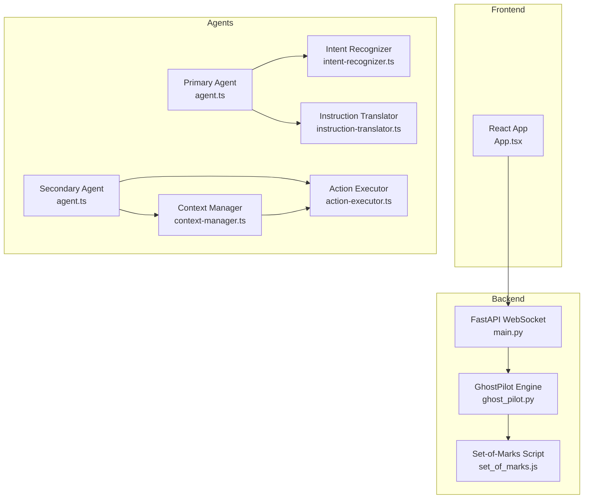

**Diagram sources**
- [main.py](file://backend/main.py#L36-L157)
- [ghost_pilot.py](file://backend/ghost_pilot.py#L18-L105)
- [set_of_marks.js](file://backend/set_of_marks.js#L8-L229)
- [agent.ts](file://primary_agent/agent.ts#L9-L32)
- [intent-recognizer.ts](file://primary_agent/intent-recognizer.ts#L22-L129)
- [instruction-translator.ts](file://primary_agent/instruction-translator.ts#L24-L127)
- [agent.ts](file://secondary_agent/agent.ts#L9-L27)
- [context-manager.ts](file://secondary_agent/context-manager.ts#L36-L77)
- [action-executor.ts](file://secondary_agent/action-executor.ts#L53-L110)

**Section sources**
- [main.py](file://backend/main.py#L1-L157)
- [ghost_pilot.py](file://backend/ghost_pilot.py#L1-L105)
- [set_of_marks.js](file://backend/set_of_marks.js#L1-L229)
- [App.tsx](file://frontend/src/App.tsx#L1-L360)
- [agent.ts](file://primary_agent/agent.ts#L1-L106)
- [intent-recognizer.ts](file://primary_agent/intent-recognizer.ts#L1-L149)
- [instruction-translator.ts](file://primary_agent/instruction-translator.ts#L1-L178)
- [agent.ts](file://secondary_agent/agent.ts#L1-L119)
- [context-manager.ts](file://secondary_agent/context-manager.ts#L1-L223)
- [action-executor.ts](file://secondary_agent/action-executor.ts#L1-L391)
- [types.ts](file://shared/types.ts#L1-L85)

## Core Components
- GhostPilot Engine: Vision-based autonomous navigation using GPT-4o Vision and Set-of-Marks element tagging. Implements provider abstraction for OpenAI, LM Studio, Gemini, OpenRouter, and custom endpoints. Includes rate limiting, retry logic, captcha detection, and mission lifecycle management.
- Real-time WebSocket API: FastAPI WebSocket endpoint that initializes GhostPilot, manages mission execution, and streams UI events to the frontend.
- Set-of-Marks JavaScript: Injects yellow-numbered overlays on interactive elements and returns a serializable element map for precise targeting.
- Frontend: React application that displays the live browser viewport, cursor effects, thinking indicators, and voice-driven mission initiation.
- Multi-Agent Orchestration: Primary agent recognizes user intent and translates it into executable instructions; secondary agent executes instructions via browser automation and database updates.

**Section sources**
- [ghost_pilot.py](file://backend/ghost_pilot.py#L18-L105)
- [main.py](file://backend/main.py#L36-L157)
- [set_of_marks.js](file://backend/set_of_marks.js#L8-L229)
- [App.tsx](file://frontend/src/App.tsx#L14-L175)
- [agent.ts](file://primary_agent/agent.ts#L9-L32)
- [instruction-translator.ts](file://primary_agent/instruction-translator.ts#L24-L127)
- [agent.ts](file://secondary_agent/agent.ts#L9-L27)

## Architecture Overview
The system follows a real-time, event-driven architecture:
- Frontend sends mission start commands via WebSocket.
- Backend selects an LLM provider based on environment configuration and instantiates GhostPilot.
- GhostPilot initializes Playwright, injects Set-of-Marks, captures screenshots, queries the vision model, executes actions, and streams UI events.
- Multi-agent pipeline handles intent recognition and instruction execution for complementary workflows.

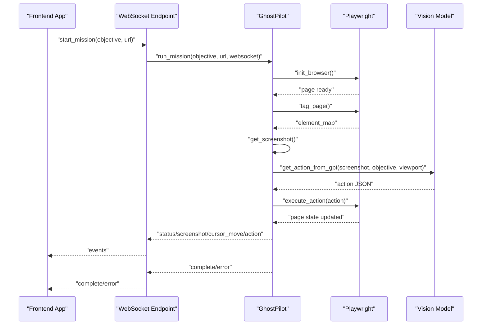

**Diagram sources**
- [main.py](file://backend/main.py#L49-L127)
- [ghost_pilot.py](file://backend/ghost_pilot.py#L623-L768)
- [App.tsx](file://frontend/src/App.tsx#L146-L175)

## Detailed Component Analysis

### GhostPilot Engine
The GhostPilot class encapsulates the autonomous navigation engine:
- Provider configuration supports OpenAI, LM Studio, Gemini, OpenRouter, and custom endpoints.
- Browser automation uses Playwright for Chromium with a fixed viewport.
- Set-of-Marks injection provides a deterministic element map for targeting.
- Vision model integration parses structured JSON responses and enforces strict rules for action selection.
- Robust rate limiting and retry logic for free-tier providers and transient failures.
- Safety measures include captcha detection, loop prevention via action history, and controlled timeouts.

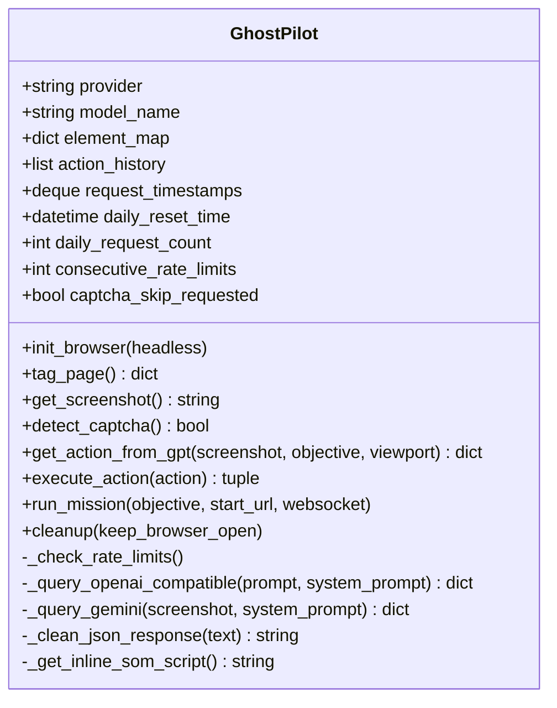

**Diagram sources**
- [ghost_pilot.py](file://backend/ghost_pilot.py#L18-L105)
- [ghost_pilot.py](file://backend/ghost_pilot.py#L140-L157)
- [ghost_pilot.py](file://backend/ghost_pilot.py#L232-L297)
- [ghost_pilot.py](file://backend/ghost_pilot.py#L299-L562)
- [ghost_pilot.py](file://backend/ghost_pilot.py#L564-L622)
- [ghost_pilot.py](file://backend/ghost_pilot.py#L623-L768)
- [ghost_pilot.py](file://backend/ghost_pilot.py#L769-L800)

**Section sources**
- [ghost_pilot.py](file://backend/ghost_pilot.py#L18-L105)
- [ghost_pilot.py](file://backend/ghost_pilot.py#L140-L157)
- [ghost_pilot.py](file://backend/ghost_pilot.py#L232-L297)
- [ghost_pilot.py](file://backend/ghost_pilot.py#L299-L562)
- [ghost_pilot.py](file://backend/ghost_pilot.py#L564-L622)
- [ghost_pilot.py](file://backend/ghost_pilot.py#L623-L768)
- [ghost_pilot.py](file://backend/ghost_pilot.py#L769-L800)

### Vision-Based Navigation and Element Recognition
- Set-of-Marks script enumerates interactive elements, filters visibility, and overlays yellow tags with numeric indices.
- The element map maps tag IDs to center coordinates and metadata for precise targeting.
- GhostPilot cleans LLM responses, validates JSON, and applies strict action rules to avoid loops and ensure progress.

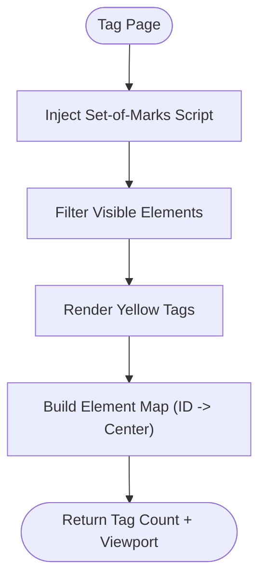

**Diagram sources**
- [set_of_marks.js](file://backend/set_of_marks.js#L8-L229)
- [ghost_pilot.py](file://backend/ghost_pilot.py#L148-L157)

**Section sources**
- [set_of_marks.js](file://backend/set_of_marks.js#L8-L229)
- [ghost_pilot.py](file://backend/ghost_pilot.py#L148-L157)

### Autonomous Decision-Making Pipeline
- Objective parsing: The system builds a structured prompt embedding the current URL, viewport, and recent actions.
- Action planning: The LLM responds with a JSON action including thought, action_type, tag_id, coordinates, text, scroll direction, and confidence.
- Execution coordination: GhostPilot executes actions, updates action history, and streams UI events to the frontend.

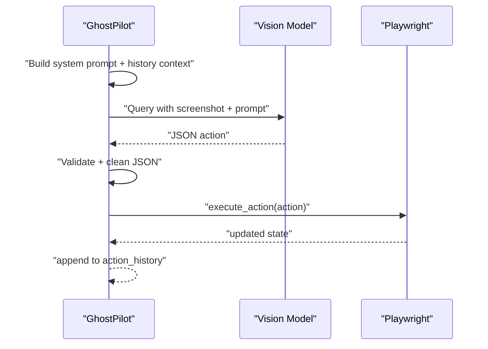

**Diagram sources**
- [ghost_pilot.py](file://backend/ghost_pilot.py#L299-L365)
- [ghost_pilot.py](file://backend/ghost_pilot.py#L434-L562)
- [ghost_pilot.py](file://backend/ghost_pilot.py#L564-L622)

**Section sources**
- [ghost_pilot.py](file://backend/ghost_pilot.py#L299-L365)
- [ghost_pilot.py](file://backend/ghost_pilot.py#L434-L562)
- [ghost_pilot.py](file://backend/ghost_pilot.py#L564-L622)

### Browser Automation Pipeline (Playwright)
- Initialization: Chromium launch with a fixed viewport; page creation and navigation to the starting URL.
- Interaction: Mouse clicks, keyboard typing, scrolling, and waits with small delays to allow page updates.
- State management: Action history prevents infinite loops; element map ensures precise targeting; periodic screenshots enable continuous analysis.

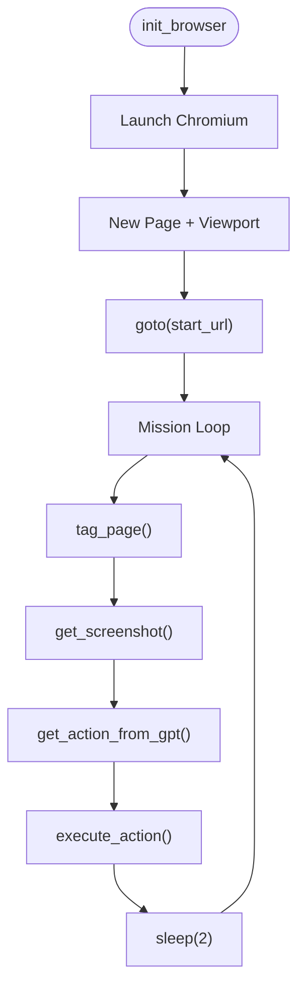

**Diagram sources**
- [ghost_pilot.py](file://backend/ghost_pilot.py#L140-L147)
- [ghost_pilot.py](file://backend/ghost_pilot.py#L623-L768)

**Section sources**
- [ghost_pilot.py](file://backend/ghost_pilot.py#L140-L147)
- [ghost_pilot.py](file://backend/ghost_pilot.py#L623-L768)

### Rate Limiting and Retry Strategies
- Free-tier enforcement: Gemini and OpenRouter have RPM and daily caps; timestamps track recent requests; daily counters reset at midnight.
- Retry logic: Exponential/backoff-based retries for rate limits; progressive delays increase with consecutive rate limits; honoring Retry-After headers when available.
- Server errors: Linear backoff for 5xx-class errors; network issues handled gracefully.

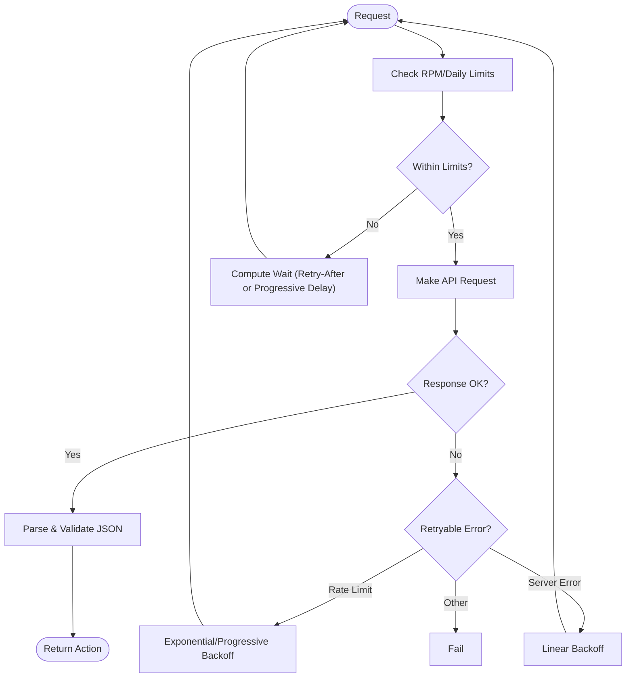

**Diagram sources**
- [ghost_pilot.py](file://backend/ghost_pilot.py#L181-L231)
- [ghost_pilot.py](file://backend/ghost_pilot.py#L514-L562)
- [ghost_pilot.py](file://backend/ghost_pilot.py#L418-L432)

**Section sources**
- [ghost_pilot.py](file://backend/ghost_pilot.py#L181-L231)
- [ghost_pilot.py](file://backend/ghost_pilot.py#L514-L562)
- [ghost_pilot.py](file://backend/ghost_pilot.py#L418-L432)

### Safety Measures and Loop Prevention
- Action history: Tracks recent actions to detect repeated clicks or typing and warns the user.
- Captcha detection: Visibility checks for known challenge patterns; optional manual override via frontend.
- Controlled timeouts: Mission stops after a maximum step count; retries occur once per step.

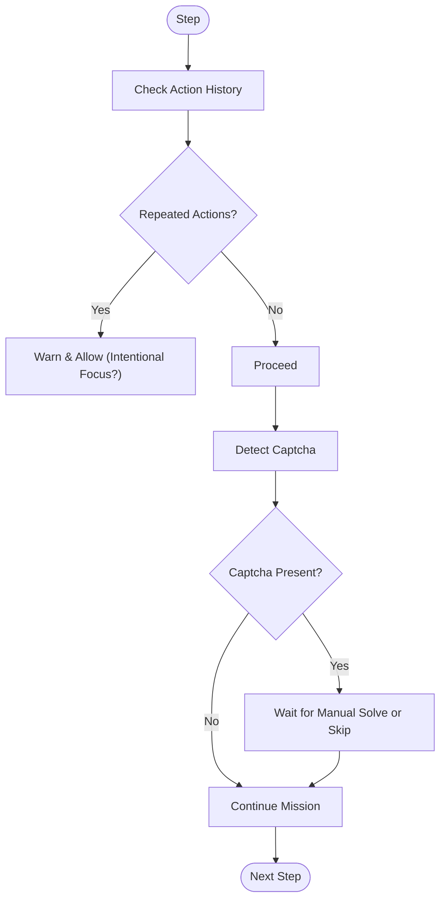

**Diagram sources**
- [ghost_pilot.py](file://backend/ghost_pilot.py#L304-L324)
- [ghost_pilot.py](file://backend/ghost_pilot.py#L240-L297)
- [ghost_pilot.py](file://backend/ghost_pilot.py#L660-L706)

**Section sources**
- [ghost_pilot.py](file://backend/ghost_pilot.py#L304-L324)
- [ghost_pilot.py](file://backend/ghost_pilot.py#L240-L297)
- [ghost_pilot.py](file://backend/ghost_pilot.py#L660-L706)

### Mission Execution Workflow
- Initialization: Provider selection from environment variables; GhostPilot instantiation; browser launch.
- Execution: Loop of tagging, screenshot capture, action planning, execution, and UI streaming.
- Completion: Finish action ends the mission; cleanup keeps the browser open for manual inspection.

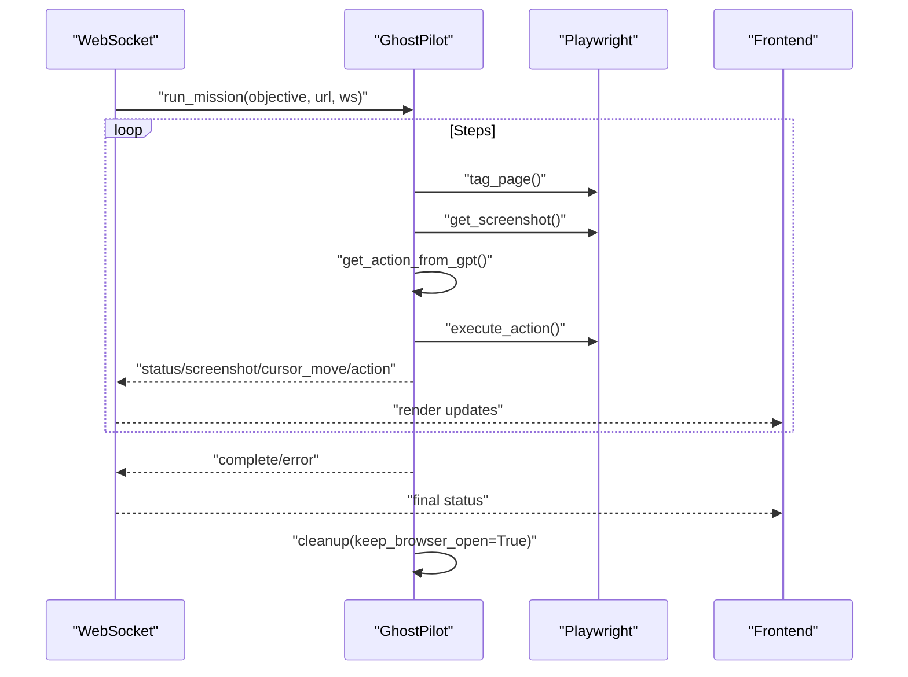

**Diagram sources**
- [main.py](file://backend/main.py#L49-L127)
- [ghost_pilot.py](file://backend/ghost_pilot.py#L623-L768)
- [ghost_pilot.py](file://backend/ghost_pilot.py#L769-L800)

**Section sources**
- [main.py](file://backend/main.py#L49-L127)
- [ghost_pilot.py](file://backend/ghost_pilot.py#L623-L768)
- [ghost_pilot.py](file://backend/ghost_pilot.py#L769-L800)

### Multi-Agent Orchestration (Primary and Secondary)
- Primary Agent: Recognizes user intent and translates it into structured instructions for the secondary agent.
- Secondary Agent: Executes instructions using browser automation and database updates, with context-aware selector improvement and retry logic.

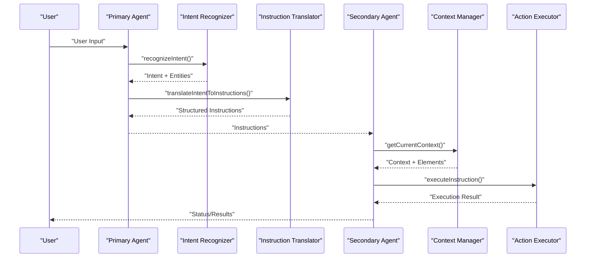

**Diagram sources**
- [agent.ts](file://primary_agent/agent.ts#L37-L89)
- [intent-recognizer.ts](file://primary_agent/intent-recognizer.ts#L22-L129)
- [instruction-translator.ts](file://primary_agent/instruction-translator.ts#L24-L127)
- [agent.ts](file://secondary_agent/agent.ts#L32-L109)
- [context-manager.ts](file://secondary_agent/context-manager.ts#L36-L123)
- [action-executor.ts](file://secondary_agent/action-executor.ts#L53-L110)

**Section sources**
- [agent.ts](file://primary_agent/agent.ts#L1-L106)
- [intent-recognizer.ts](file://primary_agent/intent-recognizer.ts#L1-L149)
- [instruction-translator.ts](file://primary_agent/instruction-translator.ts#L1-L178)
- [agent.ts](file://secondary_agent/agent.ts#L1-L119)
- [context-manager.ts](file://secondary_agent/context-manager.ts#L1-L223)
- [action-executor.ts](file://secondary_agent/action-executor.ts#L1-L391)
- [types.ts](file://shared/types.ts#L1-L85)

## Dependency Analysis
External dependencies include FastAPI, Uvicorn, Playwright, OpenAI SDK, websockets, and Pillow. These enable the WebSocket API, browser automation, LLM integrations, and image processing.

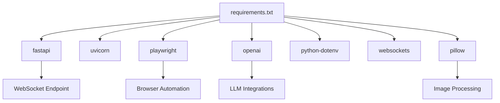

**Diagram sources**
- [requirements.txt](file://backend/requirements.txt#L1-L8)

**Section sources**
- [requirements.txt](file://backend/requirements.txt#L1-L8)

## Performance Considerations
- Vision model efficiency: Use concise prompts, minimal JSON payload, and structured outputs to reduce token usage and latency.
- Browser stability: Fixed viewport reduces rendering variability; small sleeps between actions allow dynamic content to settle.
- Rate limiting: Enforce provider-specific caps to avoid throttling; honor Retry-After headers for immediate recovery.
- Memory management: Avoid retaining large screenshots unnecessarily; close pages and browsers on cleanup; reuse element maps within a mission.
- Concurrency: The current implementation uses a single browser instance per mission; consider isolating long-running tasks and using separate contexts for parallel missions.

## Troubleshooting Guide
- Provider misconfiguration: Verify environment variables for provider selection and credentials; ensure base URLs and model names match the selected provider.
- Rate limit exceeded: Monitor RPM/daily counters; implement progressive delays; respect Retry-After headers.
- Captcha stalls: Use the manual override to skip waiting; ensure the flag is reset after continuation.
- JSON parsing errors: Validate LLM responses; clean comments/markdown; extract embedded JSON when needed.
- Browser automation failures: Confirm element visibility and selector accuracy; improve selectors using context or LLM assistance.

**Section sources**
- [main.py](file://backend/main.py#L63-L99)
- [ghost_pilot.py](file://backend/ghost_pilot.py#L181-L231)
- [ghost_pilot.py](file://backend/ghost_pilot.py#L514-L562)
- [ghost_pilot.py](file://backend/ghost_pilot.py#L418-L432)
- [ghost_pilot.py](file://backend/ghost_pilot.py#L240-L297)
- [ghost_pilot.py](file://backend/ghost_pilot.py#L159-L179)

## Conclusion
Ghost Pilot delivers a robust, real-time autonomous browser engine that combines vision-based navigation with multi-agent orchestration. Its provider-agnostic design, strong safety controls, and resilient retry strategies make it suitable for diverse environments. The modular architecture enables extensibility, while the frontend provides an intuitive interface for mission control and monitoring.

## Appendices
- Configuration: Environment variables drive provider selection and endpoint configuration for seamless switching between OpenAI, LM Studio, Gemini, OpenRouter, and custom endpoints.
- Frontend Controls: Voice input initiates missions; live status updates, cursor overlays, and captcha override streamline user interaction.

**Section sources**
- [main.py](file://backend/main.py#L63-L99)
- [App.tsx](file://frontend/src/App.tsx#L146-L175)