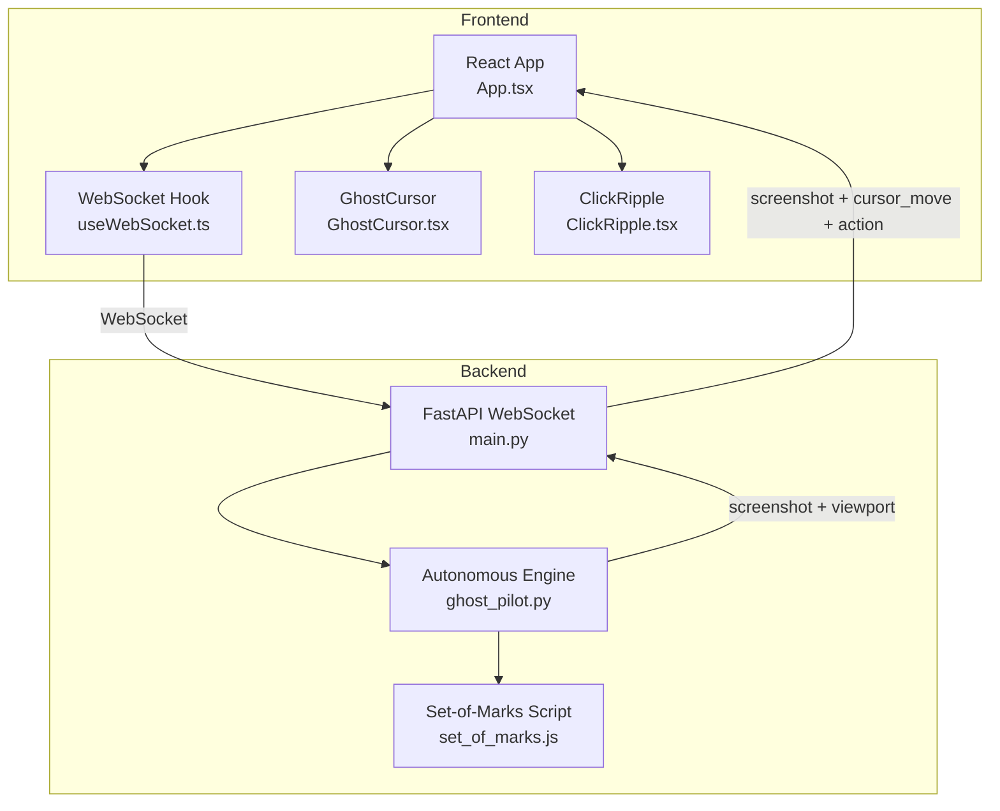
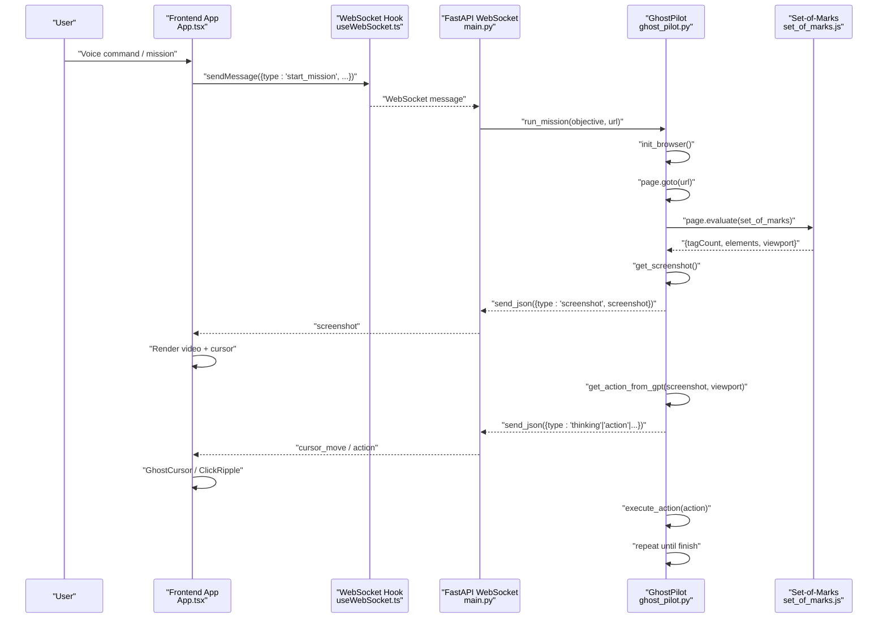
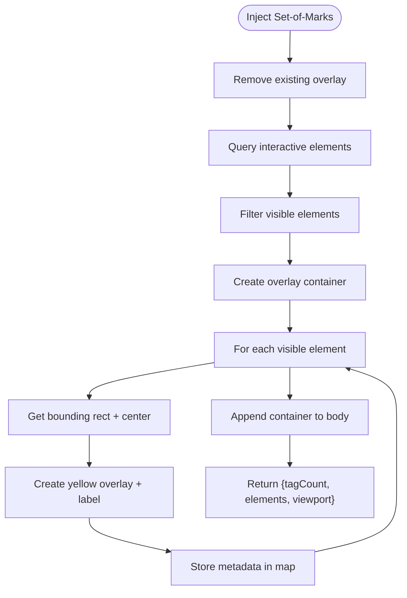
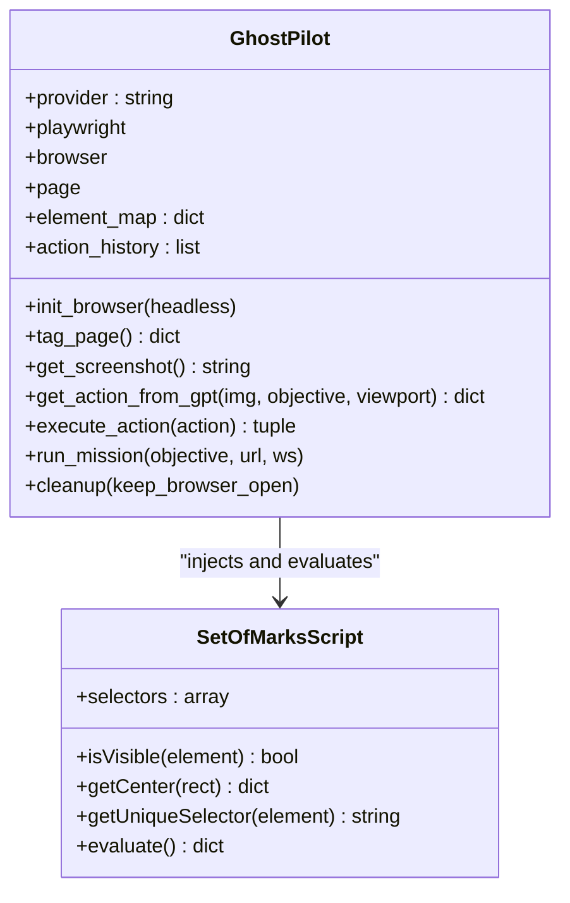
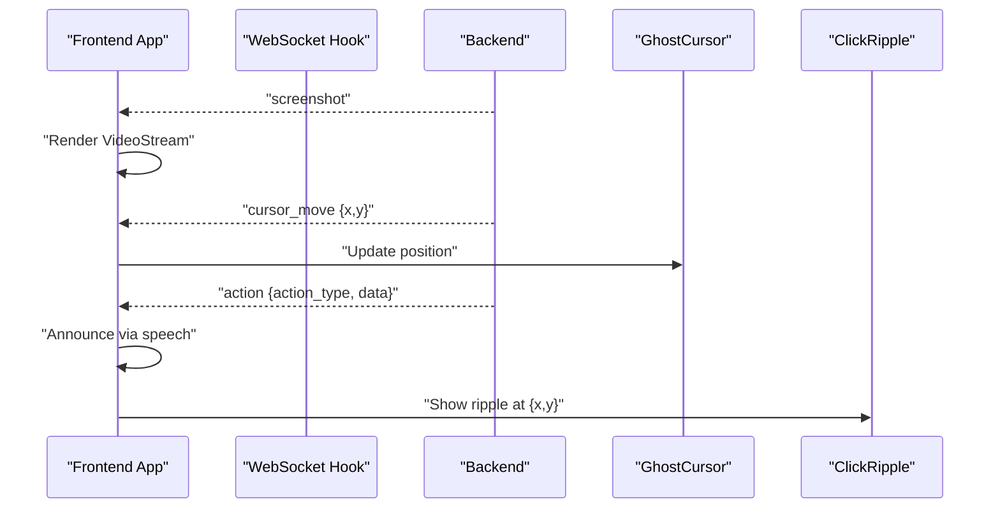
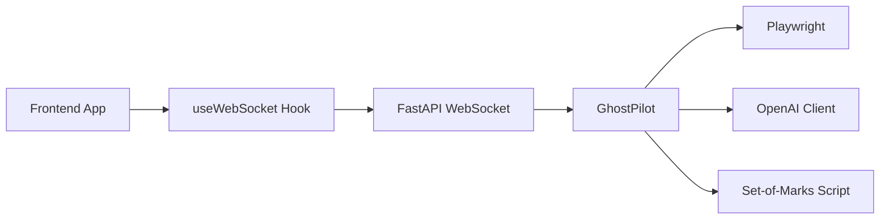

# Set-of-Marks System

<cite>
**Referenced Files in This Document**
- [set_of_marks.js](file://backend/set_of_marks.js)
- [ghost_pilot.py](file://backend/ghost_pilot.py)
- [main.py](file://backend/main.py)
- [App.tsx](file://frontend/src/App.tsx)
- [useWebSocket.ts](file://frontend/src/hooks/useWebSocket.ts)
- [GhostCursor.tsx](file://frontend/src/components/GhostCursor.tsx)
- [ClickRipple.tsx](file://frontend/src/components/ClickRipple.tsx)
</cite>

## Table of Contents
1. [Introduction](#introduction)
2. [Project Structure](#project-structure)
3. [Core Components](#core-components)
4. [Architecture Overview](#architecture-overview)
5. [Detailed Component Analysis](#detailed-component-analysis)
6. [Dependency Analysis](#dependency-analysis)
7. [Performance Considerations](#performance-considerations)
8. [Troubleshooting Guide](#troubleshooting-guide)
9. [Conclusion](#conclusion)
10. [Appendices](#appendices)

## Introduction
This document describes the Set-of-Marks JavaScript injection system that dynamically tags interactive webpage elements with yellow overlays for precise targeting. It explains how the client-side script selects elements, computes positions, and generates a serializable map of targets. It also documents the end-to-end pipeline that connects the injected script with the backend vision agent, the browser automation engine, and the frontend visualization. Security considerations, sandboxing mechanisms, and compatibility across frameworks are addressed alongside performance and integration details.

## Project Structure
The system spans three layers:
- Backend: FastAPI WebSocket server, autonomous browser engine, and Set-of-Marks injection script
- Frontend: React application with WebSocket client, cursor visualization, and click feedback
- Communication: Real-time bidirectional messaging over WebSocket

**Diagram sources**
- [main.py](file://backend/main.py#L36-L153)
- [ghost_pilot.py](file://backend/ghost_pilot.py#L140-L157)
- [set_of_marks.js](file://backend/set_of_marks.js#L8-L228)
- [App.tsx](file://frontend/src/App.tsx#L14-L123)
- [useWebSocket.ts](file://frontend/src/hooks/useWebSocket.ts#L15-L92)
- [GhostCursor.tsx](file://frontend/src/components/GhostCursor.tsx#L10-L98)
- [ClickRipple.tsx](file://frontend/src/components/ClickRipple.tsx#L10-L34)

**Section sources**
- [main.py](file://backend/main.py#L17-L30)
- [ghost_pilot.py](file://backend/ghost_pilot.py#L140-L157)
- [set_of_marks.js](file://backend/set_of_marks.js#L8-L228)
- [App.tsx](file://frontend/src/App.tsx#L14-L123)
- [useWebSocket.ts](file://frontend/src/hooks/useWebSocket.ts#L15-L92)
- [GhostCursor.tsx](file://frontend/src/components/GhostCursor.tsx#L10-L98)
- [ClickRipple.tsx](file://frontend/src/components/ClickRipple.tsx#L10-L34)

## Core Components
- Set-of-Marks JavaScript injection script: Discovers interactive elements, filters visible ones, overlays yellow borders with numbered labels, and returns a serializable element map with selectors, geometry, and metadata.
- Autonomous browser engine: Initializes the browser, injects the script, captures screenshots, queries a vision model, executes actions, and manages rate limits and captcha detection.
- WebSocket server: Exposes a WebSocket endpoint for real-time communication between frontend and backend.
- Frontend React application: Renders the live video stream, cursor, click ripples, and status messages; sends voice commands and receives backend events.

Key capabilities:
- Dynamic element tagging with unique identifiers
- Robust element selection and visibility checks
- Precise click targeting via computed centers
- Visual feedback for user and developer
- Real-time communication and automation orchestration

**Section sources**
- [set_of_marks.js](file://backend/set_of_marks.js#L15-L146)
- [ghost_pilot.py](file://backend/ghost_pilot.py#L140-L157)
- [ghost_pilot.py](file://backend/ghost_pilot.py#L299-L505)
- [ghost_pilot.py](file://backend/ghost_pilot.py#L564-L621)
- [main.py](file://backend/main.py#L36-L153)
- [App.tsx](file://frontend/src/App.tsx#L14-L123)

## Architecture Overview
The system orchestrates autonomous browsing with the following flow:
- The backend initializes a browser via Playwright, navigates to the requested URL, and injects the Set-of-Marks script.
- The script returns a map of tagged elements and viewport metrics.
- The backend captures a screenshot and sends it to the frontend via WebSocket.
- The frontend displays the screenshot and overlays a glowing cursor and click ripples.
- The backend queries a vision model with the screenshot and returns the next action (click, type, scroll, wait, finish).
- The backend executes the action and repeats the cycle until completion.

**Diagram sources**
- [main.py](file://backend/main.py#L36-L153)
- [ghost_pilot.py](file://backend/ghost_pilot.py#L623-L767)
- [ghost_pilot.py](file://backend/ghost_pilot.py#L148-L157)
- [ghost_pilot.py](file://backend/ghost_pilot.py#L299-L505)
- [ghost_pilot.py](file://backend/ghost_pilot.py#L564-L621)
- [set_of_marks.js](file://backend/set_of_marks.js#L8-L228)
- [App.tsx](file://frontend/src/App.tsx#L14-L123)
- [useWebSocket.ts](file://frontend/src/hooks/useWebSocket.ts#L15-L92)

## Detailed Component Analysis

### Set-of-Marks JavaScript Injection
Responsibilities:
- Remove any prior tag overlays from previous runs
- Define a comprehensive selector set for interactive elements
- Filter elements by visibility (computed styles, bounding rect, viewport)
- Render a full-page overlay container with z-index above all content
- For each visible element:
  - Compute bounding rectangle and center
  - Create a bordered, semi-transparent yellow overlay
  - Place a small yellow label with a sequential tag ID above the overlay
  - Record metadata (selector, tag name, type, text, placeholder, aria-label, rect, center) into a serializable map
- Return a compact payload containing tag count, element map, and viewport info

Element selection criteria:
- Links, buttons, form controls (excluding hidden inputs), text areas, selects
- Elements with explicit click handlers or ARIA roles indicating interactivity
- Editable content and labeled inputs
- Elements with tabindex not equal to -1

Visibility checks:
- Presence of offset parent
- Computed display, visibility, and opacity
- Non-zero bounding rectangle dimensions
- Containment within the current viewport

Marker positioning and styling:
- Overlay positioned absolutely to match element bounds
- Yellow border with subtle background and glow
- Number label placed above the overlay with shadow and rounded corners
- Container set to pointer-events none to avoid interfering with page interactions
- Z-index set to the maximum safe value to guarantee visibility

Unique selector generation:
- Prefer element id when present
- Otherwise, prefer a class-based selector if unique in the document
- Fallback to a path-based selector built from ancestors, adding nth-child when needed

Return payload:
- Serializable map of tag IDs to element metadata
- Viewport width, height, and scroll offsets

**Diagram sources**
- [set_of_marks.js](file://backend/set_of_marks.js#L8-L149)
- [set_of_marks.js](file://backend/set_of_marks.js#L154-L200)
- [set_of_marks.js](file://backend/set_of_marks.js#L218-L228)

**Section sources**
- [set_of_marks.js](file://backend/set_of_marks.js#L8-L149)
- [set_of_marks.js](file://backend/set_of_marks.js#L154-L200)
- [set_of_marks.js](file://backend/set_of_marks.js#L218-L228)

### Backend Vision Agent and Browser Automation
Responsibilities:
- Initialize Playwright Chromium browser and page
- Inject Set-of-Marks script and receive element map
- Capture screenshots and send them to the frontend
- Query a vision model (OpenAI-compatible, Gemini, OpenRouter, LM Studio, or custom) with the screenshot and viewport context
- Parse and validate the model’s JSON response
- Enforce rate limits for free-tier providers
- Detect captchas and coordinate manual overrides
- Execute actions (click, type, scroll, wait, finish) with precise coordinates
- Manage mission lifecycle and cleanup

Action execution:
- Resolve tag ID to element center or fall back to provided coordinates
- Move mouse to coordinates and perform click or keyboard typing
- Emit cursor movement and action events to the frontend

**Diagram sources**
- [ghost_pilot.py](file://backend/ghost_pilot.py#L18-L105)
- [ghost_pilot.py](file://backend/ghost_pilot.py#L140-L157)
- [ghost_pilot.py](file://backend/ghost_pilot.py#L299-L505)
- [ghost_pilot.py](file://backend/ghost_pilot.py#L564-L621)
- [set_of_marks.js](file://backend/set_of_marks.js#L15-L200)

**Section sources**
- [ghost_pilot.py](file://backend/ghost_pilot.py#L18-L105)
- [ghost_pilot.py](file://backend/ghost_pilot.py#L140-L157)
- [ghost_pilot.py](file://backend/ghost_pilot.py#L299-L505)
- [ghost_pilot.py](file://backend/ghost_pilot.py#L564-L621)

### Frontend Visualization and Interaction
Responsibilities:
- Establish and maintain a WebSocket connection to the backend
- Render the live screenshot as a video stream
- Overlay a smooth, animated cursor that follows backend coordinates
- Show click ripples at action locations
- Announce actions via speech synthesis
- Display status messages and thinking indicators
- Allow manual captcha override via a dedicated button

**Diagram sources**
- [App.tsx](file://frontend/src/App.tsx#L14-L123)
- [useWebSocket.ts](file://frontend/src/hooks/useWebSocket.ts#L15-L92)
- [GhostCursor.tsx](file://frontend/src/components/GhostCursor.tsx#L10-L98)
- [ClickRipple.tsx](file://frontend/src/components/ClickRipple.tsx#L10-L34)

**Section sources**
- [App.tsx](file://frontend/src/App.tsx#L14-L123)
- [useWebSocket.ts](file://frontend/src/hooks/useWebSocket.ts#L15-L92)
- [GhostCursor.tsx](file://frontend/src/components/GhostCursor.tsx#L10-L98)
- [ClickRipple.tsx](file://frontend/src/components/ClickRipple.tsx#L10-L34)

## Dependency Analysis
High-level dependencies:
- Backend depends on Playwright for browser automation and OpenAI client for vision model calls
- Backend loads the Set-of-Marks script either from disk or inline fallback
- Frontend depends on React, Framer Motion for animations, and a WebSocket hook for connectivity
- WebSocket protocol defines message types for screenshots, cursor moves, thinking, status, captcha events, and actions

**Diagram sources**
- [main.py](file://backend/main.py#L36-L153)
- [ghost_pilot.py](file://backend/ghost_pilot.py#L18-L105)
- [ghost_pilot.py](file://backend/ghost_pilot.py#L140-L157)
- [set_of_marks.js](file://backend/set_of_marks.js#L8-L228)
- [useWebSocket.ts](file://frontend/src/hooks/useWebSocket.ts#L15-L92)

**Section sources**
- [main.py](file://backend/main.py#L36-L153)
- [ghost_pilot.py](file://backend/ghost_pilot.py#L18-L105)
- [ghost_pilot.py](file://backend/ghost_pilot.py#L140-L157)
- [set_of_marks.js](file://backend/set_of_marks.js#L8-L228)
- [useWebSocket.ts](file://frontend/src/hooks/useWebSocket.ts#L15-L92)

## Performance Considerations
- Element discovery and overlay creation:
  - Selector set is optimized to capture most interactive elements while avoiding hidden inputs
  - Visibility filtering reduces unnecessary overlays and improves accuracy
- Rendering:
  - Overlay container uses pointer-events none to avoid event blocking
  - Z-index is maximized to ensure visibility above all page content
  - Transitions and shadows are modest to minimize repaint cost
- Network and model calls:
  - Screenshots are base64-encoded PNG images; consider compression or streaming if bandwidth becomes a concern
  - Rate-limit enforcement prevents throttling and improves reliability for free-tier providers
- Browser automation:
  - Actions are executed with minimal delays; adjust sleep durations based on page responsiveness
- Frontend:
  - Animations use hardware-accelerated properties; ensure GPU-friendly transitions
  - Debounce or throttle WebSocket message processing if needed

[No sources needed since this section provides general guidance]

## Troubleshooting Guide
Common issues and resolutions:
- Tags not appearing:
  - Verify the Set-of-Marks script is injected and the overlay container exists
  - Ensure the page has interactive elements and they are visible
- Incorrect targeting:
  - Confirm tag IDs correspond to visible elements
  - Check that the element map contains expected metadata (selector, rect, center)
- Vision model parsing errors:
  - Validate JSON response cleaning and retry logic
  - Inspect provider-specific rate limits and Retry-After headers
- Captcha stalls:
  - Use the manual override button to skip waiting
  - Ensure captcha detection logic recognizes visible captcha elements
- WebSocket disconnections:
  - Confirm auto-reconnect behavior and backend connectivity
  - Check CORS configuration and firewall rules

**Section sources**
- [ghost_pilot.py](file://backend/ghost_pilot.py#L181-L231)
- [ghost_pilot.py](file://backend/ghost_pilot.py#L240-L296)
- [ghost_pilot.py](file://backend/ghost_pilot.py#L514-L561)
- [App.tsx](file://frontend/src/App.tsx#L168-L174)
- [useWebSocket.ts](file://frontend/src/hooks/useWebSocket.ts#L43-L57)

## Conclusion
The Set-of-Marks system provides a robust, framework-agnostic mechanism for dynamic element tagging and precise targeting. By combining a lightweight client-side injection with a powerful backend vision agent and browser automation engine, it enables autonomous navigation across diverse web applications. The frontend visualization enhances transparency and user control, while the WebSocket protocol ensures responsive, real-time coordination. With careful attention to performance, rate limits, and security, the system scales to complex workflows and integrates seamlessly with modern web frameworks.

[No sources needed since this section summarizes without analyzing specific files]

## Appendices

### Communication Protocol Summary
- Message types:
  - start_mission: { type: "start_mission", objective: string, url: string }
  - skip_captcha: { type: "skip_captcha" }
  - screenshot: { type: "screenshot", screenshot: base64 }
  - cursor_move: { type: "cursor_move", x: number, y: number }
  - action: { type: "action", action_type: string, data: any }
  - thinking: { type: "thinking", thinking: boolean }
  - status: { type: "status", message: string }
  - captcha_detected: { type: "captcha_detected", message: string }
  - captcha_solved: { type: "captcha_solved", message: string }
  - complete: { type: "complete", message: string }
  - error: { type: "error", error: string }

**Section sources**
- [useWebSocket.ts](file://frontend/src/hooks/useWebSocket.ts#L3-L13)
- [App.tsx](file://frontend/src/App.tsx#L161-L174)
- [ghost_pilot.py](file://backend/ghost_pilot.py#L654-L743)
- [main.py](file://backend/main.py#L49-L137)