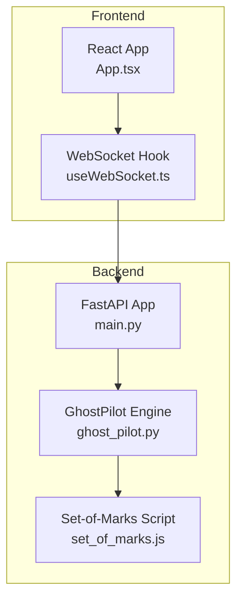
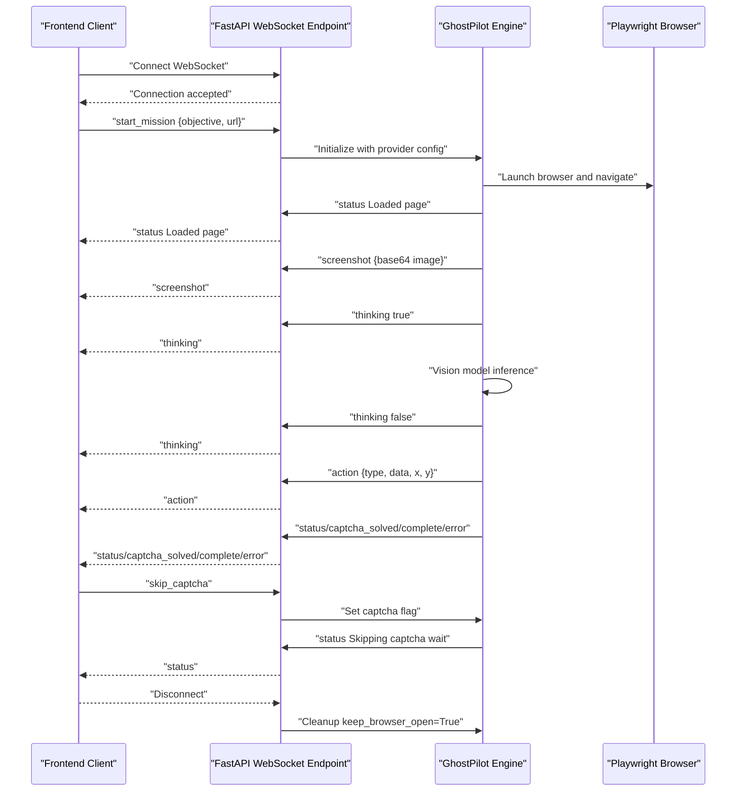
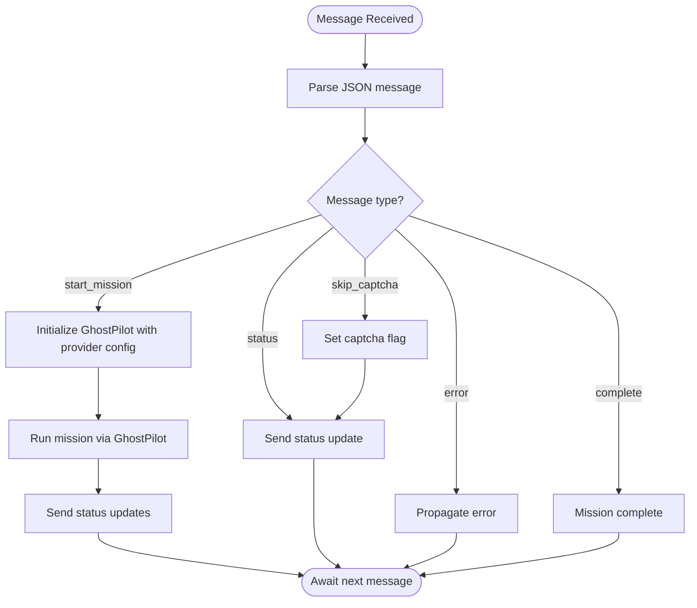
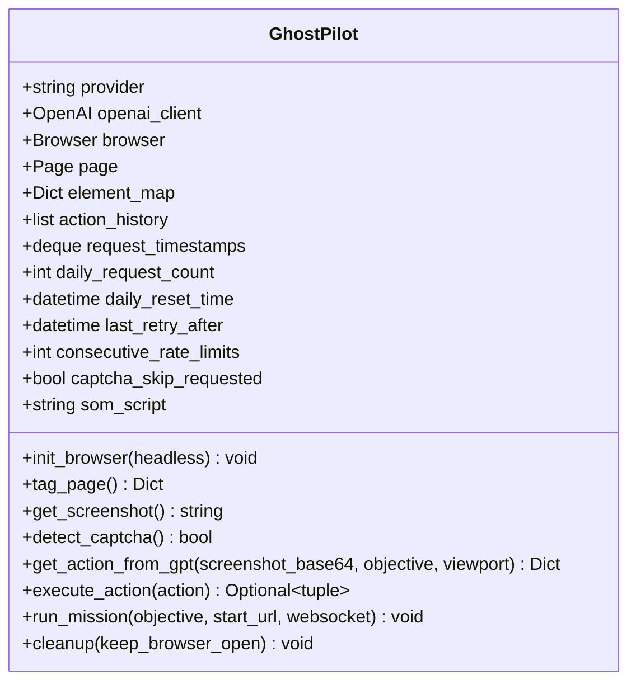
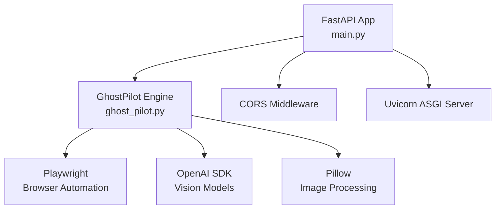

# WebSocket Server

<cite>
**Referenced Files in This Document**
- [main.py](file://backend/main.py)
- [ghost_pilot.py](file://backend/ghost_pilot.py)
- [useWebSocket.ts](file://frontend/src/hooks/useWebSocket.ts)
- [App.tsx](file://frontend/src/App.tsx)
- [set_of_marks.js](file://backend/set_of_marks.js)
- [requirements.txt](file://backend/requirements.txt)
</cite>

## Table of Contents
1. [Introduction](#introduction)
2. [Project Structure](#project-structure)
3. [Core Components](#core-components)
4. [Architecture Overview](#architecture-overview)
5. [Detailed Component Analysis](#detailed-component-analysis)
6. [Dependency Analysis](#dependency-analysis)
7. [Performance Considerations](#performance-considerations)
8. [Troubleshooting Guide](#troubleshooting-guide)
9. [Conclusion](#conclusion)

## Introduction
This document provides comprehensive documentation for the FastAPI WebSocket server implementation that powers autonomous browser automation. It covers WebSocket endpoint configuration, connection acceptance, real-time message handling, message routing, CORS middleware, connection lifecycle management, exception handling, graceful shutdown, message formats, integration with the GhostPilot engine, keep-alive browser session management, security considerations, connection limits, and performance optimization for concurrent connections.

## Project Structure
The WebSocket server is implemented in the backend module with a dedicated FastAPI application and a GhostPilot engine for autonomous browser automation. The frontend React application communicates with the backend via WebSocket messages.

**Diagram sources**
- [main.py](file://backend/main.py#L1-L157)
- [ghost_pilot.py](file://backend/ghost_pilot.py#L1-L802)
- [set_of_marks.js](file://backend/set_of_marks.js#L1-L229)
- [useWebSocket.ts](file://frontend/src/hooks/useWebSocket.ts#L1-L93)
- [App.tsx](file://frontend/src/App.tsx#L1-L360)

**Section sources**
- [main.py](file://backend/main.py#L1-L157)
- [ghost_pilot.py](file://backend/ghost_pilot.py#L1-L802)
- [set_of_marks.js](file://backend/set_of_marks.js#L1-L229)
- [useWebSocket.ts](file://frontend/src/hooks/useWebSocket.ts#L1-L93)
- [App.tsx](file://frontend/src/App.tsx#L1-L360)

## Core Components
- FastAPI WebSocket endpoint: Handles client connections, message routing, and error propagation.
- GhostPilot engine: Autonomous browser automation engine that executes missions, manages browser sessions, and handles rate limits.
- Set-of-Marks JavaScript: Injects interactive element tags for Playwright targeting.
- Frontend WebSocket client: Manages connection lifecycle, auto-reconnection, and message parsing.

**Section sources**
- [main.py](file://backend/main.py#L36-L157)
- [ghost_pilot.py](file://backend/ghost_pilot.py#L18-L802)
- [set_of_marks.js](file://backend/set_of_marks.js#L1-L229)
- [useWebSocket.ts](file://frontend/src/hooks/useWebSocket.ts#L1-L93)

## Architecture Overview
The system follows a real-time bidirectional communication pattern:
- Clients connect to the WebSocket endpoint and send mission initiation commands.
- The server initializes the GhostPilot engine and starts autonomous navigation.
- The engine periodically sends screenshots, status updates, and action feedback to the client.
- Clients can send manual commands (e.g., captcha skip) during execution.
- The server gracefully manages browser sessions and cleans up resources on disconnect.

**Diagram sources**
- [main.py](file://backend/main.py#L36-L157)
- [ghost_pilot.py](file://backend/ghost_pilot.py#L623-L768)
- [useWebSocket.ts](file://frontend/src/hooks/useWebSocket.ts#L15-L93)
- [App.tsx](file://frontend/src/App.tsx#L146-L174)

## Detailed Component Analysis

### WebSocket Endpoint Configuration
- Endpoint: "/ws" under the FastAPI application.
- CORS middleware configured to allow all origins, methods, and headers for development; production should restrict origins.
- Connection acceptance: Immediate acceptance upon WebSocket handshake.

**Section sources**
- [main.py](file://backend/main.py#L17-L31)
- [main.py](file://backend/main.py#L19-L26)
- [main.py](file://backend/main.py#L36-L38)

### Message Routing System
The server routes messages based on the "type" field:
- start_mission: Initializes the GhostPilot engine with provider configuration and begins mission execution.
- skip_captcha: Sets a manual override flag to skip captcha waiting.
- status: Provides operational status updates.
- error: Propagates exceptions to the client.
- complete: Indicates mission completion.

**Diagram sources**
- [main.py](file://backend/main.py#L49-L137)
- [ghost_pilot.py](file://backend/ghost_pilot.py#L623-L768)

**Section sources**
- [main.py](file://backend/main.py#L49-L137)

### Connection Lifecycle Management
- Connection acceptance: Immediate acceptance on WebSocket handshake.
- Graceful shutdown: Browser session kept open by default on disconnect to allow manual interaction.
- Auto-reconnection: Frontend attempts reconnection after 3 seconds on close.

**Section sources**
- [main.py](file://backend/main.py#L36-L38)
- [main.py](file://backend/main.py#L149-L152)
- [useWebSocket.ts](file://frontend/src/hooks/useWebSocket.ts#L43-L52)

### Exception Handling
- WebSocketDisconnect: Logged and handled gracefully.
- General exceptions: Sent back to the client as error messages.
- Mission failures: Caught and reported to the client with error type.

**Section sources**
- [main.py](file://backend/main.py#L138-L148)

### GhostPilot Engine Integration
- Provider configuration: Supports LM Studio, OpenAI, Gemini, OpenRouter, and custom endpoints.
- Browser initialization: Launches Chromium with a fixed viewport.
- Autonomous navigation loop: Tags pages, captures screenshots, detects captchas, queries vision models, executes actions, and sends feedback.
- Rate limiting: Implements RPM and daily limits for free-tier providers.
- Cleanup: Keeps browser open by default to allow manual interaction.

**Diagram sources**
- [ghost_pilot.py](file://backend/ghost_pilot.py#L18-L802)

**Section sources**
- [ghost_pilot.py](file://backend/ghost_pilot.py#L18-L802)

### Keep-Alive Browser Session Management
- Default behavior: Keeps browser open after mission completion or disconnect for manual interaction.
- Controlled cleanup: Can be configured to close browser resources if needed.

**Section sources**
- [ghost_pilot.py](file://backend/ghost_pilot.py#L769-L800)
- [main.py](file://backend/main.py#L122-L126)

### Frontend WebSocket Client
- Connection management: Establishes WebSocket connection, handles onopen/onmessage/onerror/onclose events.
- Auto-reconnection: Attempts to reconnect after 3 seconds on close.
- Message sending: Sends JSON messages to the server.
- Message parsing: Parses received messages and updates UI state accordingly.

**Section sources**
- [useWebSocket.ts](file://frontend/src/hooks/useWebSocket.ts#L15-L93)
- [App.tsx](file://frontend/src/App.tsx#L14-L123)

## Dependency Analysis
External dependencies include FastAPI, Uvicorn, Playwright, OpenAI SDK, python-dotenv, websockets, and Pillow.

**Diagram sources**
- [requirements.txt](file://backend/requirements.txt#L1-L8)
- [main.py](file://backend/main.py#L1-L17)
- [ghost_pilot.py](file://backend/ghost_pilot.py#L1-L17)

**Section sources**
- [requirements.txt](file://backend/requirements.txt#L1-L8)

## Performance Considerations
- Rate limiting: Implemented for free-tier providers to avoid quota exhaustion.
- Concurrency: Single mission per connection; no explicit concurrent mission handling.
- Resource cleanup: Browser resources are cleaned up on demand; default behavior keeps browser open for manual interaction.
- Network efficiency: Screenshot transmission as base64; consider compression or streaming for large images.
- Retry logic: Exponential/backoff strategies for rate limits and server errors.

[No sources needed since this section provides general guidance]

## Troubleshooting Guide
Common issues and resolutions:
- CORS errors: Ensure frontend origin is allowed in production deployments.
- Rate limit errors: Implement backoff strategies and monitor provider quotas.
- Captcha handling: Use manual skip command to bypass waiting periods.
- Connection drops: Utilize frontend auto-reconnect mechanism.
- Provider configuration: Verify environment variables for selected provider.

**Section sources**
- [main.py](file://backend/main.py#L19-L26)
- [ghost_pilot.py](file://backend/ghost_pilot.py#L181-L230)
- [useWebSocket.ts](file://frontend/src/hooks/useWebSocket.ts#L43-L52)

## Conclusion
The FastAPI WebSocket server provides a robust foundation for autonomous browser automation with real-time feedback and manual intervention capabilities. The GhostPilot engine integrates seamlessly with multiple vision model providers, manages browser sessions efficiently, and maintains a responsive UI through structured message routing. Proper configuration of CORS, rate limiting, and connection lifecycle ensures reliable operation in diverse environments.