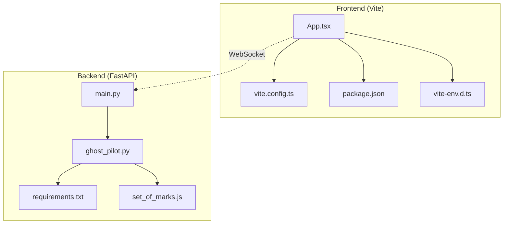
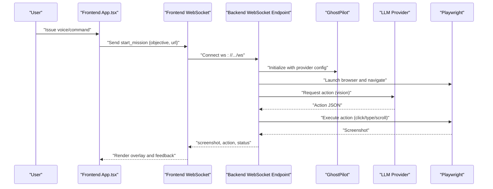
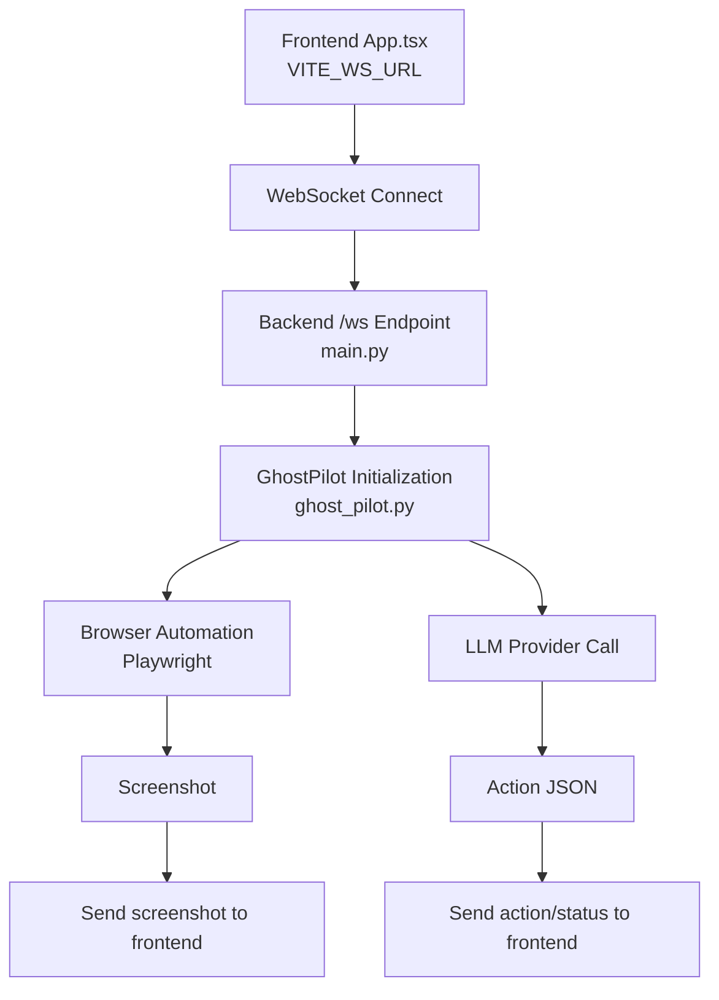
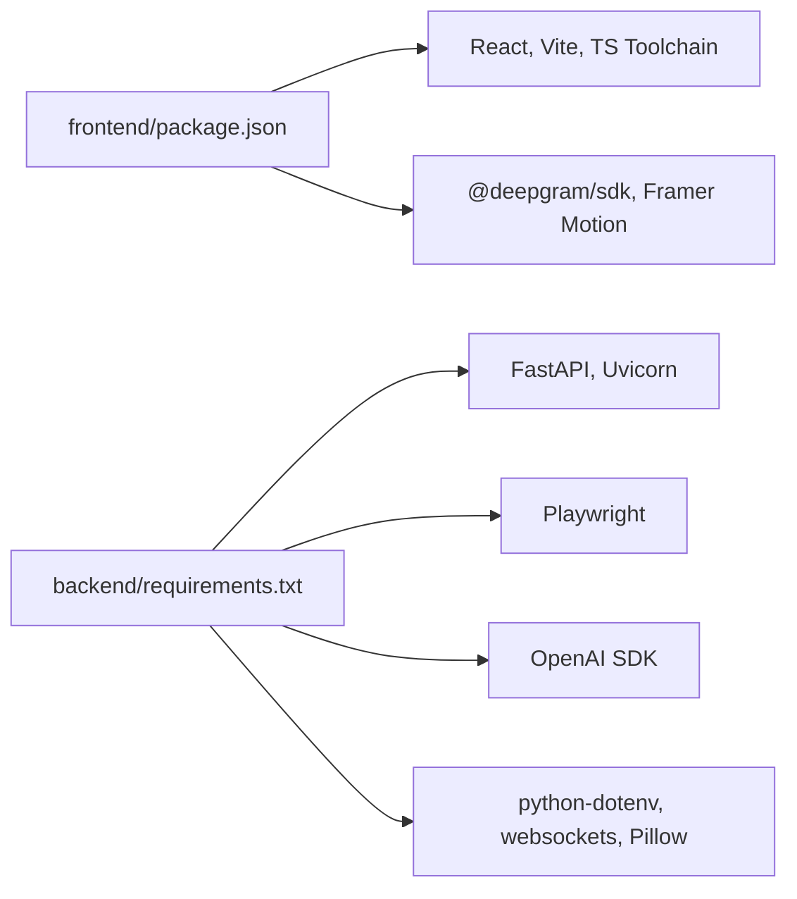

# Configuration and Environment

<cite>
**Referenced Files in This Document**
- [backend/main.py](file://backend/main.py)
- [backend/ghost_pilot.py](file://backend/ghost_pilot.py)
- [backend/requirements.txt](file://backend/requirements.txt)
- [backend/set_of_marks.js](file://backend/set_of_marks.js)
- [frontend/vite.config.ts](file://frontend/vite.config.ts)
- [frontend/src/vite-env.d.ts](file://frontend/src/vite-env.d.ts)
- [frontend/src/App.tsx](file://frontend/src/App.tsx)
- [frontend/package.json](file://frontend/package.json)
</cite>

## Table of Contents
1. [Introduction](#introduction)
2. [Project Structure](#project-structure)
3. [Core Components](#core-components)
4. [Architecture Overview](#architecture-overview)
5. [Detailed Component Analysis](#detailed-component-analysis)
6. [Dependency Analysis](#dependency-analysis)
7. [Performance Considerations](#performance-considerations)
8. [Troubleshooting Guide](#troubleshooting-guide)
9. [Conclusion](#conclusion)
10. [Appendices](#appendices)

## Introduction
This document provides comprehensive configuration and environment documentation for the Ghost Pilot system. It covers environment variables, configuration files for the frontend (Vite) and backend (FastAPI), dependency management, security considerations for API keys and credentials, deployment scenarios, and integration between frontend and backend. It also includes troubleshooting guidance, validation requirements, and examples for different AI providers and browser automation scenarios.

## Project Structure
The Ghost Pilot system consists of:
- Frontend (React + Vite): Provides the browser automation UI, WebSocket client, and voice-driven controls.
- Backend (FastAPI): Exposes a WebSocket endpoint for autonomous browser automation, integrates with multiple LLM providers, and manages Playwright-controlled Chromium.

**Diagram sources**
- [frontend/src/App.tsx](file://frontend/src/App.tsx#L1-L360)
- [frontend/vite.config.ts](file://frontend/vite.config.ts#L1-L23)
- [frontend/src/vite-env.d.ts](file://frontend/src/vite-env.d.ts#L1-L10)
- [frontend/package.json](file://frontend/package.json#L1-L34)
- [backend/main.py](file://backend/main.py#L1-L157)
- [backend/ghost_pilot.py](file://backend/ghost_pilot.py#L1-L800)
- [backend/requirements.txt](file://backend/requirements.txt#L1-L8)
- [backend/set_of_marks.js](file://backend/set_of_marks.js#L1-L229)

**Section sources**
- [frontend/vite.config.ts](file://frontend/vite.config.ts#L1-L23)
- [frontend/src/vite-env.d.ts](file://frontend/src/vite-env.d.ts#L1-L10)
- [frontend/src/App.tsx](file://frontend/src/App.tsx#L1-L360)
- [frontend/package.json](file://frontend/package.json#L1-L34)
- [backend/main.py](file://backend/main.py#L1-L157)
- [backend/ghost_pilot.py](file://backend/ghost_pilot.py#L1-L800)
- [backend/requirements.txt](file://backend/requirements.txt#L1-L8)
- [backend/set_of_marks.js](file://backend/set_of_marks.js#L1-L229)

## Core Components
- Frontend WebSocket client and UI:
  - Uses Vite’s import.meta.env for runtime configuration.
  - Connects to the backend WebSocket endpoint defined by the environment variable.
- Backend WebSocket server:
  - Loads environment variables via python-dotenv.
  - Supports multiple LLM providers (LM Studio, OpenAI, Gemini, OpenRouter, Custom).
  - Integrates Playwright for browser automation and Set-of-Marks for element tagging.

Key configuration touchpoints:
- Frontend environment variable: WS URL for the WebSocket connection.
- Backend environment variables: provider selection and credentials.

**Section sources**
- [frontend/src/App.tsx](file://frontend/src/App.tsx#L11-L15)
- [frontend/src/vite-env.d.ts](file://frontend/src/vite-env.d.ts#L3-L5)
- [backend/main.py](file://backend/main.py#L63-L99)
- [backend/ghost_pilot.py](file://backend/ghost_pilot.py#L19-L82)

## Architecture Overview
The frontend and backend communicate over a WebSocket. The frontend sends mission commands and receives screenshots, actions, and status updates. The backend initializes the LLM provider based on environment variables and orchestrates autonomous browser actions.

**Diagram sources**
- [frontend/src/App.tsx](file://frontend/src/App.tsx#L161-L166)
- [backend/main.py](file://backend/main.py#L36-L127)
- [backend/ghost_pilot.py](file://backend/ghost_pilot.py#L623-L768)

## Detailed Component Analysis

### Environment Variables and Configuration Files

#### Backend Environment Variables
- LLM_PROVIDER: Selects provider (lmstudio, openai, gemini, openrouter, custom).
- Provider-specific variables:
  - LM Studio: LM_STUDIO_BASE_URL, LM_STUDIO_MODEL
  - OpenAI: OPENAI_API_KEY, OPENAI_BASE_URL, OPENAI_MODEL
  - Gemini: GEMINI_API_KEY, GEMINI_MODEL
  - OpenRouter: OPENROUTER_API_KEY, OPENROUTER_MODEL
  - Custom: OPENAI_API_KEY, OPENAI_BASE_URL, OPENAI_MODEL
- Backend loads environment variables using python-dotenv and applies defaults when unspecified.

Validation and defaults:
- Provider selection is case-insensitive and validated; invalid values raise an error.
- Defaults are applied for base URLs and model names when environment variables are missing.

Security considerations:
- API keys are read from environment variables and passed to provider clients.
- For LM Studio, a dummy API key is used because the local endpoint does not require a real key.

**Section sources**
- [backend/main.py](file://backend/main.py#L63-L99)
- [backend/ghost_pilot.py](file://backend/ghost_pilot.py#L30-L82)

#### Frontend Environment Variables
- VITE_WS_URL: WebSocket URL used by the frontend to connect to the backend.
- The frontend reads this value from import.meta.env at runtime.

Frontend configuration:
- Vite dev server proxies WebSocket traffic to the backend for local development.
- Build output is configured for distribution.

**Section sources**
- [frontend/src/vite-env.d.ts](file://frontend/src/vite-env.d.ts#L3-L5)
- [frontend/src/App.tsx](file://frontend/src/App.tsx#L11-L12)
- [frontend/vite.config.ts](file://frontend/vite.config.ts#L10-L16)
- [frontend/package.json](file://frontend/package.json#L6-L11)

#### Configuration Files

##### Backend (FastAPI)
- main.py:
  - Adds CORS middleware.
  - Defines root and health endpoints.
  - Implements WebSocket endpoint that initializes GhostPilot based on environment variables and runs missions.
- ghost_pilot.py:
  - Initializes provider clients (OpenAI-compatible or Gemini).
  - Manages Playwright browser lifecycle.
  - Implements Set-of-Marks injection and action execution.
- set_of_marks.js:
  - Injects yellow-numbered tags over interactive elements and returns a serializable element map.
- requirements.txt:
  - Declares backend dependencies including FastAPI, Uvicorn, Playwright, OpenAI SDK, python-dotenv, websockets, and Pillow.

**Section sources**
- [backend/main.py](file://backend/main.py#L1-L157)
- [backend/ghost_pilot.py](file://backend/ghost_pilot.py#L1-L800)
- [backend/set_of_marks.js](file://backend/set_of_marks.js#L1-L229)
- [backend/requirements.txt](file://backend/requirements.txt#L1-L8)

##### Frontend (Vite)
- vite.config.ts:
  - Configures dev server port, host, and WebSocket proxy to backend.
  - Sets build output directory and source maps.
- src/vite-env.d.ts:
  - Declares VITE_WS_URL type for TypeScript.
- package.json:
  - Scripts for dev, build, preview, and lint.
  - Dependencies include React, Framer Motion, @deepgram/sdk, and Vite toolchain.

**Section sources**
- [frontend/vite.config.ts](file://frontend/vite.config.ts#L1-L23)
- [frontend/src/vite-env.d.ts](file://frontend/src/vite-env.d.ts#L1-L10)
- [frontend/package.json](file://frontend/package.json#L1-L34)

### Provider-Specific Configuration Examples
Note: Replace placeholders with your actual values. These examples illustrate the environment variable mapping.

- LM Studio:
  - LLM_PROVIDER=lmstudio
  - LM_STUDIO_BASE_URL=https://your-lmstudio-host/v1
  - LM_STUDIO_MODEL=llava-v1.6-34b
- OpenAI:
  - LLM_PROVIDER=openai
  - OPENAI_API_KEY=your-openai-key
  - OPENAI_BASE_URL=https://api.openai.com/v1
  - OPENAI_MODEL=gpt-4o
- Gemini:
  - LLM_PROVIDER=gemini
  - GEMINI_API_KEY=your-gemini-key
  - GEMINI_MODEL=gemini-2.0-flash-exp
- OpenRouter:
  - LLM_PROVIDER=openrouter
  - OPENROUTER_API_KEY=your-openrouter-key
  - OPENROUTER_MODEL=qwen/qwen2.5-vl-72b-instruct:free
- Custom:
  - LLM_PROVIDER=custom
  - OPENAI_API_KEY=your-custom-key
  - OPENAI_BASE_URL=https://your-custom-endpoint/v1
  - OPENAI_MODEL=gpt-4o

Provider selection and initialization logic:
- The backend selects a provider based on LLM_PROVIDER and constructs the appropriate client with environment-provided credentials and base URLs.

**Section sources**
- [backend/main.py](file://backend/main.py#L63-L99)
- [backend/ghost_pilot.py](file://backend/ghost_pilot.py#L19-L82)

### Integration Between Frontend and Backend
- Frontend connects to the backend WebSocket using VITE_WS_URL.
- Backend exposes a single WebSocket endpoint (/ws) for mission control.
- Frontend sends start_mission with objective and optional URL; backend responds with screenshots, actions, and status updates.

**Diagram sources**
- [frontend/src/App.tsx](file://frontend/src/App.tsx#L11-L12)
- [backend/main.py](file://backend/main.py#L36-L127)
- [backend/ghost_pilot.py](file://backend/ghost_pilot.py#L623-L768)

**Section sources**
- [frontend/src/App.tsx](file://frontend/src/App.tsx#L11-L12)
- [backend/main.py](file://backend/main.py#L36-L127)
- [backend/ghost_pilot.py](file://backend/ghost_pilot.py#L623-L768)

### Security Considerations
- API key management:
  - Backend loads environment variables via python-dotenv; ensure .env is not committed to version control.
  - For LM Studio, a dummy API key is used; still avoid exposing local endpoints unnecessarily.
- Frontend exposure:
  - VITE_WS_URL is a client-side variable; do not embed secrets here.
  - Proxy configuration in Vite is for local development; production deployments should secure WebSocket endpoints appropriately.
- Credential handling:
  - Provider clients receive keys from environment variables; validate presence before use.
  - Consider rotating keys and scoping permissions per provider.

**Section sources**
- [backend/main.py](file://backend/main.py#L12-L15)
- [backend/ghost_pilot.py](file://backend/ghost_pilot.py#L30-L82)
- [frontend/vite.config.ts](file://frontend/vite.config.ts#L10-L16)

### Deployment Scenarios
- Development:
  - Frontend: Vite dev server with proxy to backend WebSocket.
  - Backend: Uvicorn server listening on port 8000.
  - Environment variables loaded via python-dotenv.
- Staging:
  - Host frontend statically and backend behind a reverse proxy.
  - Set VITE_WS_URL to the staging WebSocket URL.
  - Ensure environment variables are set on the backend host.
- Production:
  - Secure WebSocket transport (wss).
  - Restrict CORS origins to frontend domains.
  - Use secrets management for API keys; avoid embedding in client code.

**Section sources**
- [frontend/vite.config.ts](file://frontend/vite.config.ts#L7-L16)
- [backend/main.py](file://backend/main.py#L154-L157)

## Dependency Analysis
- Frontend dependencies:
  - React, React DOM, Framer Motion, @deepgram/sdk, Vite, TypeScript toolchain.
- Backend dependencies:
  - FastAPI, Uvicorn, Playwright, OpenAI SDK, python-dotenv, websockets, Pillow.

**Diagram sources**
- [frontend/package.json](file://frontend/package.json#L12-L32)
- [backend/requirements.txt](file://backend/requirements.txt#L1-L8)

**Section sources**
- [frontend/package.json](file://frontend/package.json#L12-L32)
- [backend/requirements.txt](file://backend/requirements.txt#L1-L8)

## Performance Considerations
- Rate limiting and retries:
  - Gemini and OpenRouter free tiers impose rate limits; the backend enforces RPM and daily caps and honors Retry-After headers.
  - OpenAI-compatible providers use exponential/backoff strategies for rate limits and transient server errors.
- Browser automation:
  - Set-of-Marks tags only visible interactive elements to reduce noise.
  - Screenshot frequency and action delays balance responsiveness and cost/performance.
- Frontend rendering:
  - Source maps enabled in development; disable in production builds for performance.

**Section sources**
- [backend/ghost_pilot.py](file://backend/ghost_pilot.py#L181-L231)
- [backend/ghost_pilot.py](file://backend/ghost_pilot.py#L434-L562)
- [frontend/vite.config.ts](file://frontend/vite.config.ts#L18-L21)

## Troubleshooting Guide
Common configuration issues and resolutions:
- WebSocket connection fails:
  - Verify VITE_WS_URL matches backend WebSocket URL.
  - Confirm Vite proxy is configured for /ws and backend is reachable.
- Provider initialization errors:
  - Ensure LLM_PROVIDER is one of lmstudio, openai, gemini, openrouter, custom.
  - Provide required API keys and base URLs for selected provider.
- Captcha handling:
  - If a captcha is detected, the system waits for user resolution or manual skip.
  - Use the “Manual Override” button to skip waiting when appropriate.
- Rate limit errors:
  - Free-tier providers (Gemini/OpenRouter) have strict limits; reduce request frequency or upgrade plans.
  - Backend automatically retries with backoff; monitor logs for persistent failures.

**Section sources**
- [frontend/src/App.tsx](file://frontend/src/App.tsx#L168-L174)
- [backend/main.py](file://backend/main.py#L128-L137)
- [backend/ghost_pilot.py](file://backend/ghost_pilot.py#L181-L231)
- [backend/ghost_pilot.py](file://backend/ghost_pilot.py#L514-L545)

## Conclusion
Ghost Pilot’s configuration centers on environment variables for provider selection and credentials, Vite for frontend development and proxying, and FastAPI for backend WebSocket orchestration. By securing API keys, validating environment variables, and tuning provider-specific settings, teams can deploy reliable autonomous browser automation across development, staging, and production environments.

## Appendices

### Environment Variable Reference
- Backend:
  - LLM_PROVIDER: Provider selection (lmstudio, openai, gemini, openrouter, custom)
  - LM_STUDIO_BASE_URL, LM_STUDIO_MODEL
  - OPENAI_API_KEY, OPENAI_BASE_URL, OPENAI_MODEL
  - GEMINI_API_KEY, GEMINI_MODEL
  - OPENROUTER_API_KEY, OPENROUTER_MODEL
- Frontend:
  - VITE_WS_URL: WebSocket URL for backend connection

**Section sources**
- [backend/main.py](file://backend/main.py#L63-L99)
- [backend/ghost_pilot.py](file://backend/ghost_pilot.py#L19-L82)
- [frontend/src/vite-env.d.ts](file://frontend/src/vite-env.d.ts#L3-L5)
- [frontend/src/App.tsx](file://frontend/src/App.tsx#L11-L12)