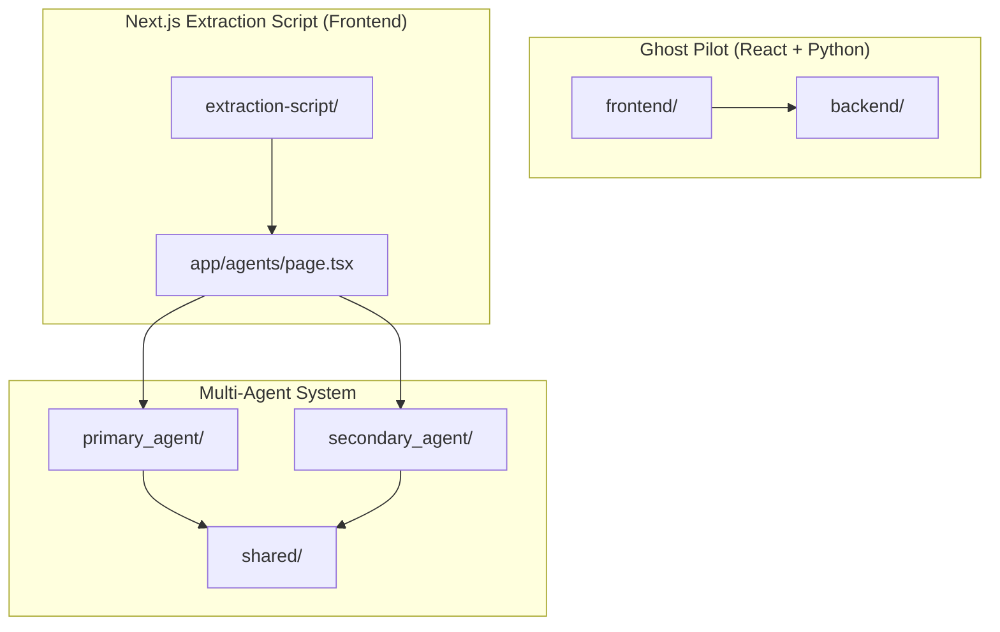
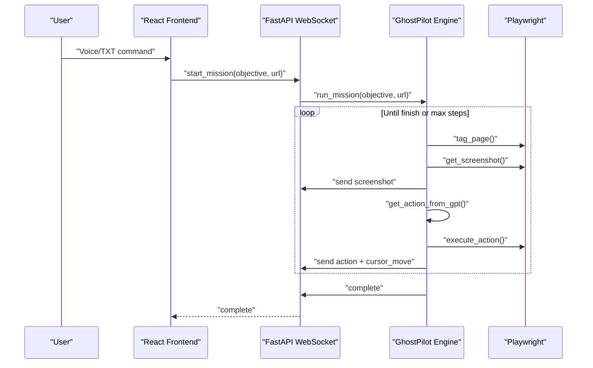
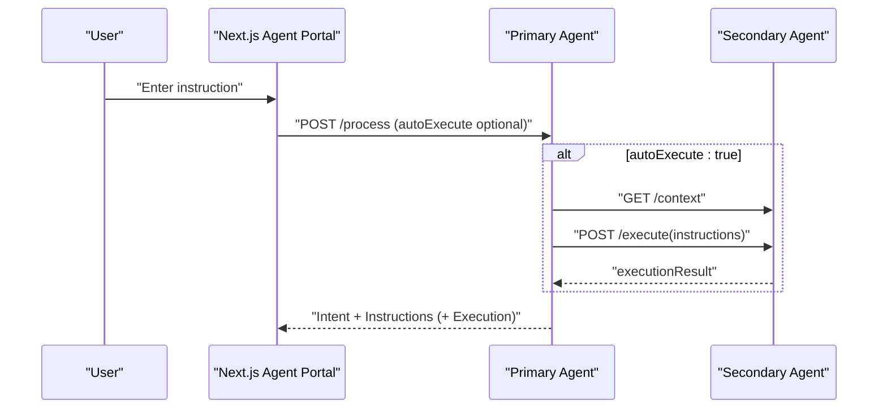
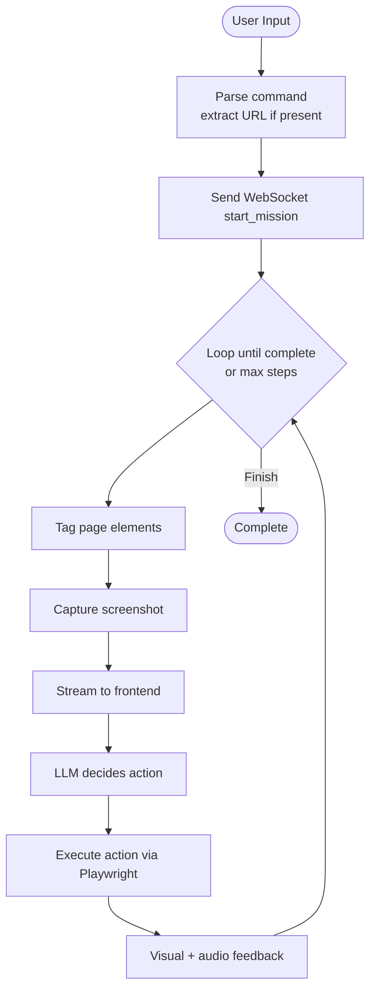
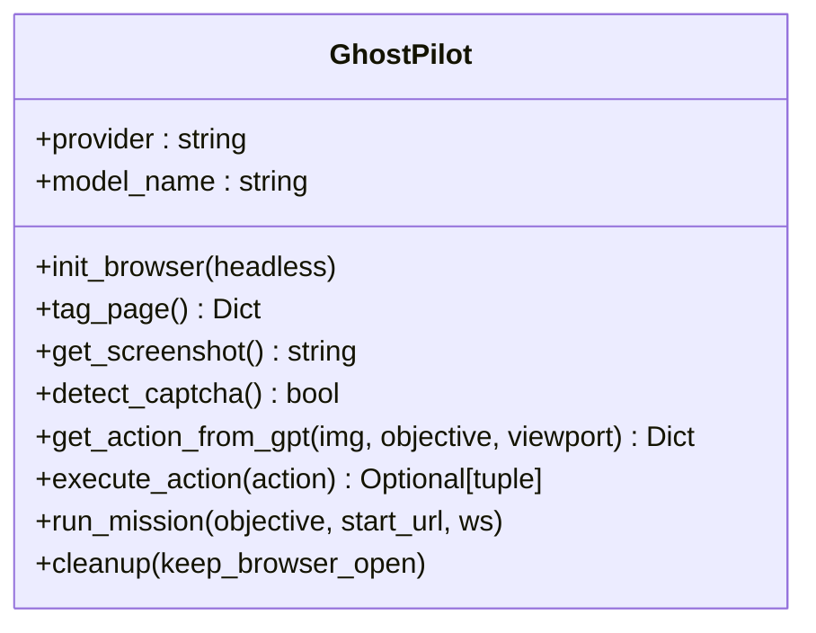
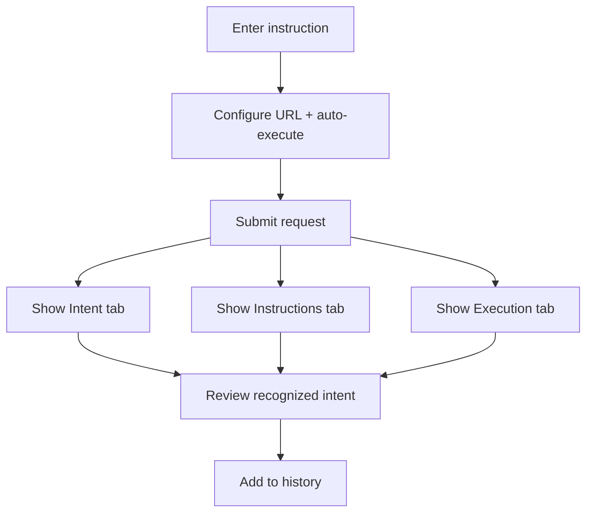
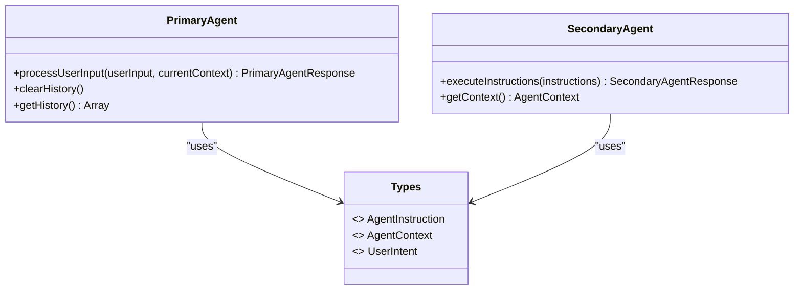
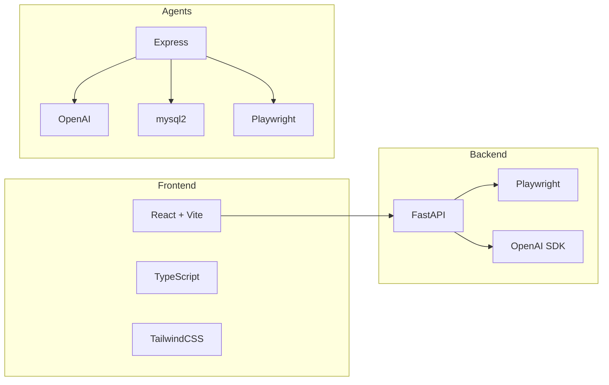
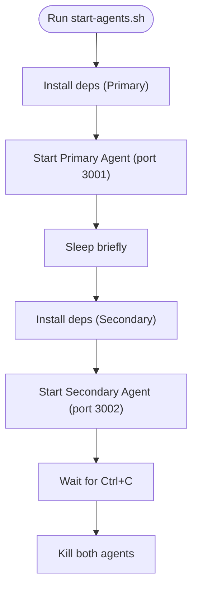
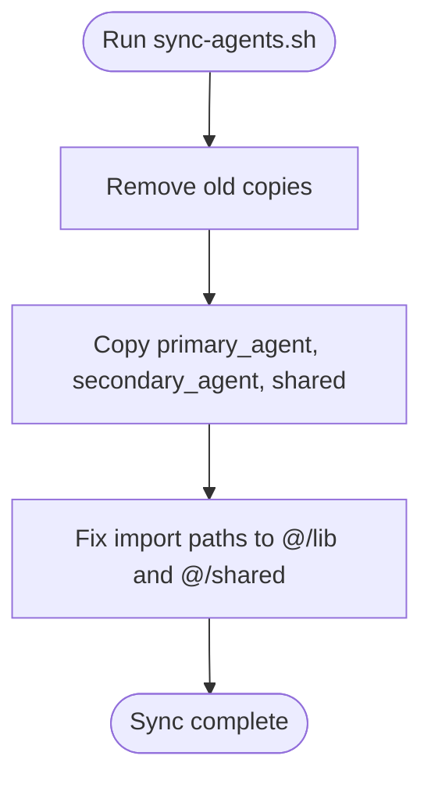

# Contributing and Development

<cite>
**Referenced Files in This Document**
- [Development_log.md](file://Development_log.md)
- [AGENTS.md](file://AGENTS.md)
- [start-agents.sh](file://start-agents.sh)
- [sync-agents.sh](file://sync-agents.sh)
- [frontend/README.md](file://frontend/README.md)
- [backend/main.py](file://backend/main.py)
- [backend/ghost_pilot.py](file://backend/ghost_pilot.py)
- [backend/set_of_marks.js](file://backend/set_of_marks.js)
- [frontend/package.json](file://frontend/package.json)
- [frontend/src/App.tsx](file://frontend/src/App.tsx)
- [frontend/src/main.tsx](file://frontend/src/main.tsx)
- [primary_agent/package.json](file://primary_agent/package.json)
- [secondary_agent/package.json](file://secondary_agent/package.json)
- [primary_agent/agent.ts](file://primary_agent/agent.ts)
- [secondary_agent/agent.ts](file://secondary_agent/agent.ts)
- [shared/types.ts](file://shared/types.ts)
- [backend/requirements.txt](file://backend/requirements.txt)
</cite>

## Table of Contents
1. [Introduction](#introduction)
2. [Project Structure](#project-structure)
3. [Core Components](#core-components)
4. [Architecture Overview](#architecture-overview)
5. [Detailed Component Analysis](#detailed-component-analysis)
6. [Dependency Analysis](#dependency-analysis)
7. [Performance Considerations](#performance-considerations)
8. [Troubleshooting Guide](#troubleshooting-guide)
9. [Contribution Guidelines](#contribution-guidelines)
10. [Testing Requirements](#testing-requirements)
11. [Community and Support](#community-and-support)
12. [Conclusion](#conclusion)

## Introduction
This document provides comprehensive contributing and development guidance for the Ghost Pilot project. It covers development environment setup, local workflows, code organization principles, contribution guidelines, and operational scripts. It also explains the dual-stack architecture (React frontend and Python backend for autonomous browsing), the multi-agent system (Primary and Secondary Agents), and the Next.js extraction-script frontend. Guidance is included for adding new AI providers, extending browser automation, integrating new UI components, and managing releases. The document references concrete files and line ranges to help contributors quickly locate relevant implementation details.

## Project Structure
The repository combines three complementary systems:
- Ghost Pilot autonomous browsing stack (React + Python + Playwright)
- Next.js extraction-script frontend with UI and agent portal
- Modular multi-agent system (Primary and Secondary Agents) with shared types

**Diagram sources**
- [frontend/README.md](file://frontend/README.md#L101-L123)
- [AGENTS.md](file://AGENTS.md#L43-L45)
- [Development_log.md](file://Development_log.md#L175-L220)

Key characteristics:
- Frontend: React + Vite with TailwindCSS and Framer Motion for animations
- Backend: FastAPI WebSocket server with Playwright automation and OpenAI SDK
- Extraction-script: Next.js App Router with agent portal UI and shared agent types
- Agents: TypeScript/Express servers for intent recognition and action execution

**Section sources**
- [frontend/README.md](file://frontend/README.md#L101-L123)
- [AGENTS.md](file://AGENTS.md#L43-L45)
- [Development_log.md](file://Development_log.md#L175-L220)

## Core Components
- React frontend (Ghost Pilot): WebSocket-driven autonomous browsing UI with voice input, video stream, cursor overlay, and thinking indicators
- Python backend (Ghost Pilot): FastAPI WebSocket server orchestrating Playwright automation and LLM-based decision-making
- Next.js extraction-script frontend: Agent portal UI for Primary Agent with configuration and response tabs
- Multi-agent system: Primary Agent (intent recognition + instruction generation) and Secondary Agent (context management + action execution) with shared types

**Section sources**
- [frontend/src/App.tsx](file://frontend/src/App.tsx#L14-L360)
- [backend/main.py](file://backend/main.py#L1-L157)
- [backend/ghost_pilot.py](file://backend/ghost_pilot.py#L18-L105)
- [frontend/README.md](file://frontend/README.md#L1-L202)
- [AGENTS.md](file://AGENTS.md#L43-L119)
- [shared/types.ts](file://shared/types.ts#L1-L85)

## Architecture Overview
The system supports two primary workflows:
- Ghost Pilot autonomous browsing: WebSocket-driven loop of tagging, screenshot capture, LLM decision, action execution, and streaming updates
- Multi-agent orchestration: Natural language input processed by Primary Agent, optionally auto-executed by Secondary Agent, with context-aware action execution

**Diagram sources**
- [backend/main.py](file://backend/main.py#L36-L127)
- [backend/ghost_pilot.py](file://backend/ghost_pilot.py#L623-L767)

**Diagram sources**
- [AGENTS.md](file://AGENTS.md#L120-L200)
- [Development_log.md](file://Development_log.md#L368-L422)

## Detailed Component Analysis

### React Frontend (Ghost Pilot)
- WebSocket integration for real-time updates
- Voice input and speech synthesis for feedback
- Visual overlays: ghost cursor, click ripple, thinking radar
- Status and thinking indicators synchronized with backend events

**Diagram sources**
- [frontend/src/App.tsx](file://frontend/src/App.tsx#L146-L166)
- [backend/ghost_pilot.py](file://backend/ghost_pilot.py#L623-L767)

**Section sources**
- [frontend/src/App.tsx](file://frontend/src/App.tsx#L14-L360)
- [frontend/src/main.tsx](file://frontend/src/main.tsx#L1-L11)
- [frontend/package.json](file://frontend/package.json#L1-L34)

### Python Backend (Ghost Pilot)
- FastAPI WebSocket endpoint accepting missions
- Provider-agnostic LLM configuration (LM Studio, OpenAI, Gemini, OpenRouter, custom)
- Set-of-Marks element tagging and Playwright automation
- Rate limiting and retry logic for free-tier providers
- Captcha detection and manual override

**Diagram sources**
- [backend/ghost_pilot.py](file://backend/ghost_pilot.py#L18-L105)

**Section sources**
- [backend/main.py](file://backend/main.py#L1-L157)
- [backend/ghost_pilot.py](file://backend/ghost_pilot.py#L18-L105)
- [backend/ghost_pilot.py](file://backend/ghost_pilot.py#L299-L562)
- [backend/ghost_pilot.py](file://backend/ghost_pilot.py#L623-L767)
- [backend/set_of_marks.js](file://backend/set_of_marks.js#L1-L229)

### Next.js Extraction Script Frontend (Agent Portal)
- Agent portal page for Primary Agent with configuration and tabs
- Integration with Primary Agent endpoints
- History management and error handling

**Diagram sources**
- [Development_log.md](file://Development_log.md#L424-L479)

**Section sources**
- [Development_log.md](file://Development_log.md#L424-L479)

### Multi-Agent System
- Primary Agent: intent recognition and instruction translation
- Secondary Agent: context management and action execution
- Shared types: standardized instruction, context, and response schemas

**Diagram sources**
- [primary_agent/agent.ts](file://primary_agent/agent.ts#L9-L104)
- [secondary_agent/agent.ts](file://secondary_agent/agent.ts#L9-L118)
- [shared/types.ts](file://shared/types.ts#L1-L85)

**Section sources**
- [primary_agent/agent.ts](file://primary_agent/agent.ts#L1-L106)
- [secondary_agent/agent.ts](file://secondary_agent/agent.ts#L1-L119)
- [shared/types.ts](file://shared/types.ts#L1-L85)

## Dependency Analysis
- Frontend dependencies: React, Framer Motion, TailwindCSS, TypeScript, Vite
- Backend dependencies: FastAPI, Uvicorn, Playwright, OpenAI SDK, python-dotenv, websockets, Pillow
- Agent dependencies: Express, OpenAI, CORS, mysql2 (Secondary Agent), Playwright (Secondary Agent)

**Diagram sources**
- [frontend/package.json](file://frontend/package.json#L12-L32)
- [backend/requirements.txt](file://backend/requirements.txt#L1-L8)
- [primary_agent/package.json](file://primary_agent/package.json#L11-L22)
- [secondary_agent/package.json](file://secondary_agent/package.json#L11-L24)

**Section sources**
- [frontend/package.json](file://frontend/package.json#L1-L34)
- [backend/requirements.txt](file://backend/requirements.txt#L1-L8)
- [primary_agent/package.json](file://primary_agent/package.json#L1-L25)
- [secondary_agent/package.json](file://secondary_agent/package.json#L1-L27)

## Performance Considerations
- Rate limiting and retry strategies for free-tier LLM providers
- Progressive delays and Retry-After honoring for robustness
- Headless vs visible browser mode trade-offs
- Max steps limit to prevent infinite loops during demos
- Efficient element tagging and screenshot capture cadence

**Section sources**
- [backend/ghost_pilot.py](file://backend/ghost_pilot.py#L181-L230)
- [backend/ghost_pilot.py](file://backend/ghost_pilot.py#L514-L561)
- [frontend/README.md](file://frontend/README.md#L163-L165)

## Troubleshooting Guide
Common issues and resolutions:
- WebSocket disconnected: verify backend is running and CORS configured
- Playwright executable missing: install Chromium browser
- Invalid API key or provider misconfiguration: check environment variables
- Elements not tagged: ensure visibility and scroll into view
- Captcha detection: manual override supported; user can skip wait
- Agent port conflicts: change PORT environment variable
- Database connectivity: ensure MySQL is running and schema is initialized

**Section sources**
- [frontend/README.md](file://frontend/README.md#L167-L183)
- [AGENTS.md](file://AGENTS.md#L248-L272)
- [Development_log.md](file://Development_log.md#L481-L508)

## Contribution Guidelines
- Fork and branch: create feature branches from the latest main branch
- Coding standards:
  - Frontend: TypeScript strict mode, ESLint rules, Tailwind utility classes
  - Backend: type hints, docstrings, consistent exception handling
  - Agents: clear separation of concerns, shared types, minimal coupling
- Commit hygiene: small, focused commits with clear messages
- Pull requests:
  - Reference related issues
  - Include screenshots or short videos for UI changes
  - Update documentation and READMEs when applicable
- Code review: expect feedback on architecture alignment, error handling, and performance

**Section sources**
- [frontend/package.json](file://frontend/package.json#L18-L31)
- [backend/ghost_pilot.py](file://backend/ghost_pilot.py#L18-L105)
- [shared/types.ts](file://shared/types.ts#L1-L85)

## Testing Requirements
- Unit tests: add Jest/PyTest suites for critical modules (LLM response parsing, action execution, context management)
- Integration tests: end-to-end flows for Ghost Pilot and agent coordination
- UI tests: component snapshots and interaction tests for React frontend
- LLM provider coverage: test JSON parsing robustness and fallbacks
- Automation tests: verify Playwright actions and element tagging accuracy
- Documentation updates: update READMEs and internal docs for new features

**Section sources**
- [backend/ghost_pilot.py](file://backend/ghost_pilot.py#L159-L179)
- [backend/ghost_pilot.py](file://backend/ghost_pilot.py#L434-L562)
- [shared/types.ts](file://shared/types.ts#L1-L85)

## Community and Support
- Communication channels: GitHub Issues for bug reports and feature requests
- Support: maintainers review PRs and assist with setup and integration
- Hackathon context: designed for rapid iteration and demonstration
- Roadmap highlights: multi-step planning, collaborative mode, custom action plugins, session recording

**Section sources**
- [frontend/README.md](file://frontend/README.md#L184-L191)
- [Development_log.md](file://Development_log.md#L184-L191)

## Development Scripts

### start-agents.sh
Starts Primary Agent on port 3001 and Secondary Agent on port 3002, with automatic dependency installation and graceful shutdown.

**Diagram sources**
- [start-agents.sh](file://start-agents.sh#L1-L39)

**Section sources**
- [start-agents.sh](file://start-agents.sh#L1-L39)

### sync-agents.sh
Copies root-level agent sources into extraction-script and fixes import paths to use @ aliases for Next.js compatibility.

**Diagram sources**
- [sync-agents.sh](file://sync-agents.sh#L1-L22)

**Section sources**
- [sync-agents.sh](file://sync-agents.sh#L1-L22)

## Adding New AI Providers
- Backend (Ghost Pilot): extend provider selection in the WebSocket handler and GhostPilot initialization
- Agents: configure provider-specific clients and model names in agent configuration
- Environment variables: add required keys and endpoints
- Validation: test with a simple mission and verify rate-limit handling

**Section sources**
- [backend/main.py](file://backend/main.py#L63-L99)
- [backend/ghost_pilot.py](file://backend/ghost_pilot.py#L29-L81)
- [AGENTS.md](file://AGENTS.md#L217-L246)

## Extending Browser Automation
- Element tagging: modify Set-of-Marks selectors and visibility checks
- Action execution: add new actions in Secondary Agent’s executor and update instruction schema
- Context management: expand database queries and schema awareness
- Safety: add retry logic and error handling for flaky selectors

**Section sources**
- [backend/set_of_marks.js](file://backend/set_of_marks.js#L15-L51)
- [shared/types.ts](file://shared/types.ts#L3-L11)
- [secondary_agent/agent.ts](file://secondary_agent/agent.ts#L29-L109)

## Integrating New UI Components
- Follow existing component patterns (Glassmorphism, shadcn/ui primitives)
- Use Framer Motion for smooth animations
- Ensure responsive layouts and consistent spacing
- Wire components to WebSocket or agent endpoints as needed

**Section sources**
- [frontend/src/App.tsx](file://frontend/src/App.tsx#L176-L356)
- [frontend/README.md](file://frontend/README.md#L142-L156)

## Release Management Procedures
- Version bumps: update package.json versions consistently across frontend, backend, and agents
- Changelog: summarize breaking changes, new features, and fixes
- Build verification: confirm builds succeed for all packages
- Documentation: update READMEs and internal docs for new features
- Tag and publish: create semantic tags and release notes

**Section sources**
- [frontend/package.json](file://frontend/package.json#L1-L34)
- [backend/requirements.txt](file://backend/requirements.txt#L1-L8)
- [primary_agent/package.json](file://primary_agent/package.json#L1-L25)
- [secondary_agent/package.json](file://secondary_agent/package.json#L1-L27)

## Conclusion
This guide consolidates development workflows, architecture, and contribution practices for the Ghost Pilot project. By following the outlined scripts, standards, and testing requirements, contributors can confidently extend the autonomous browsing capabilities, integrate new UI components, and enhance the multi-agent system. The hackathon context and roadmap highlight future directions such as multi-step planning, collaborative mode, and custom plugins.