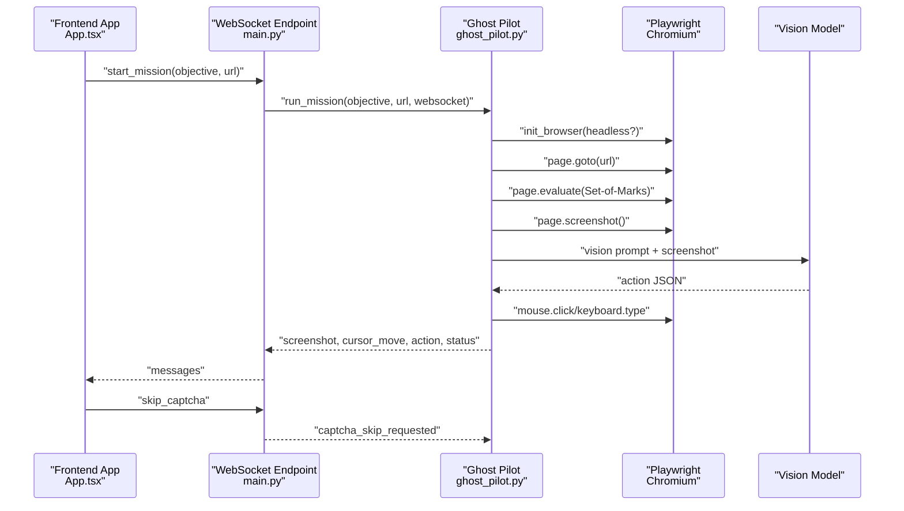
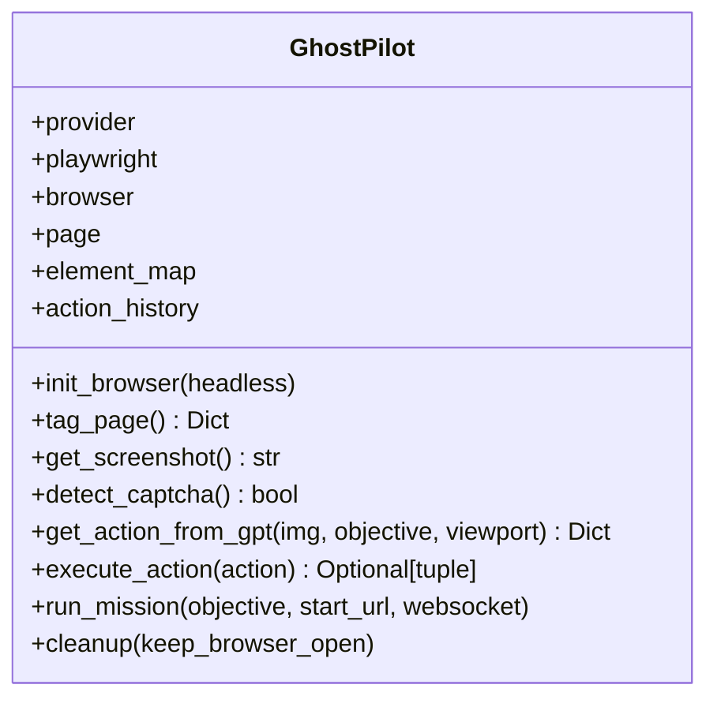
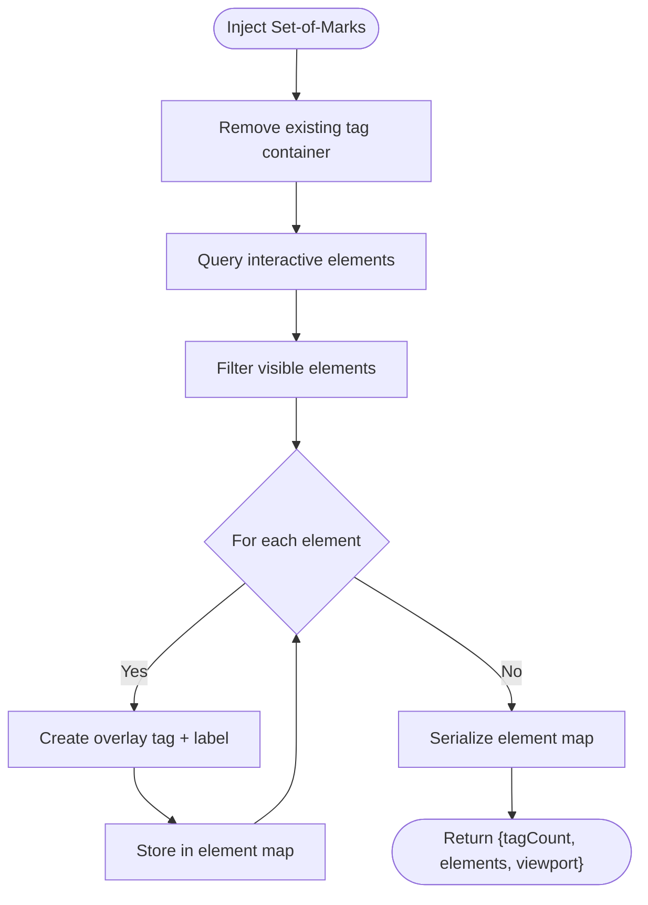
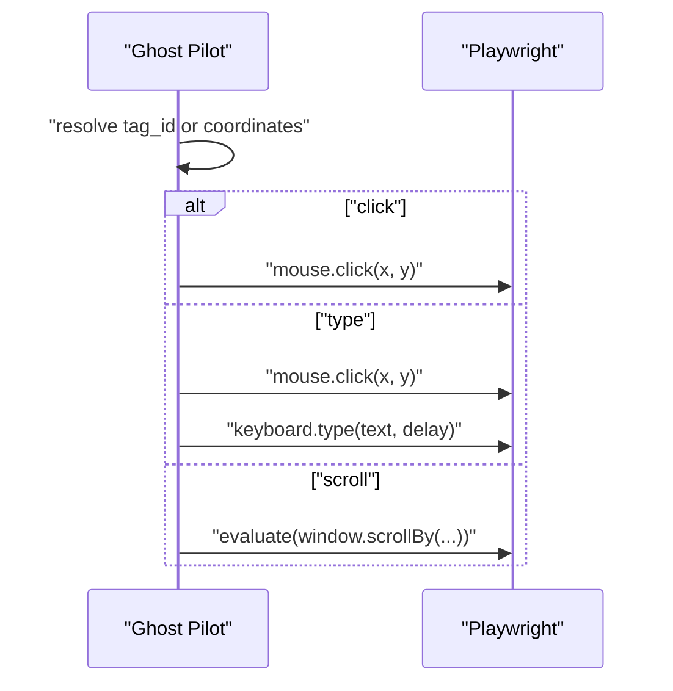
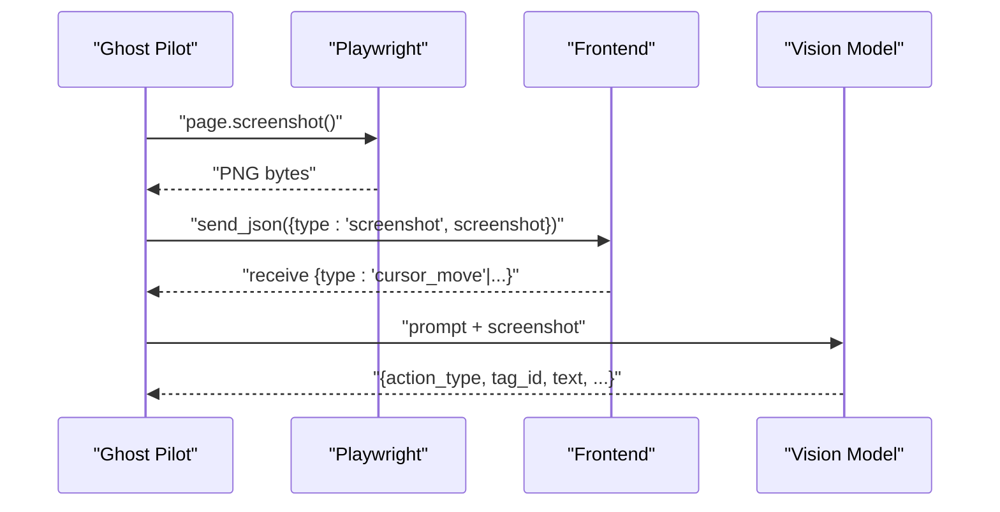
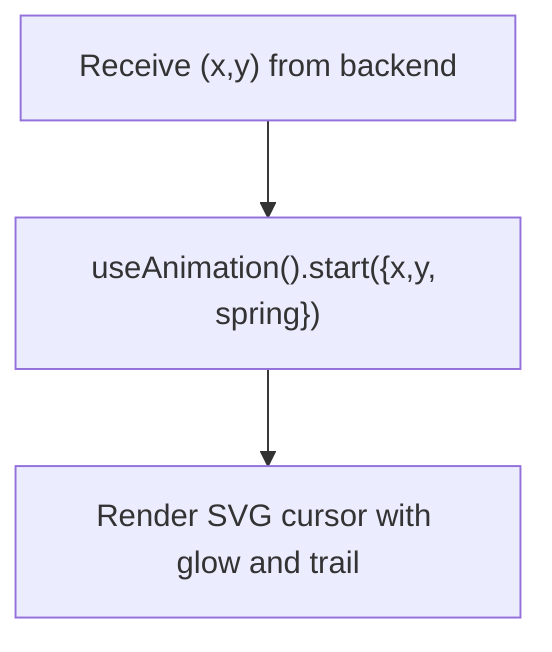
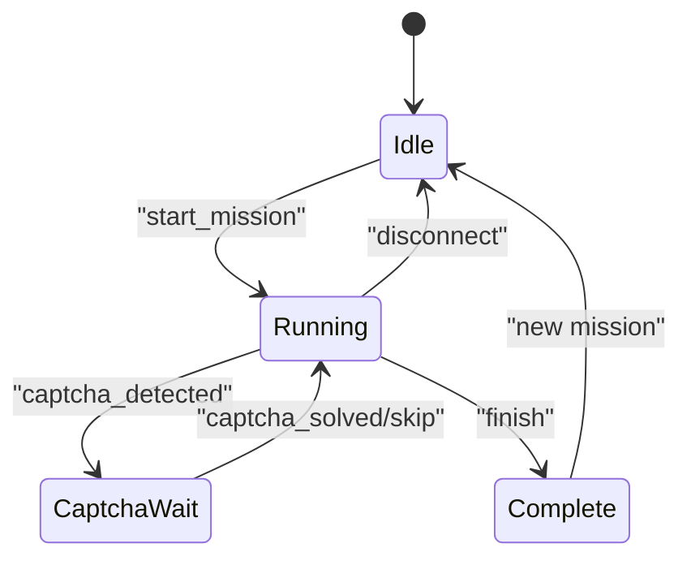
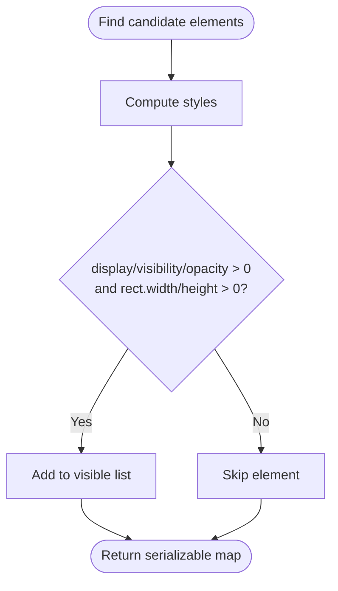
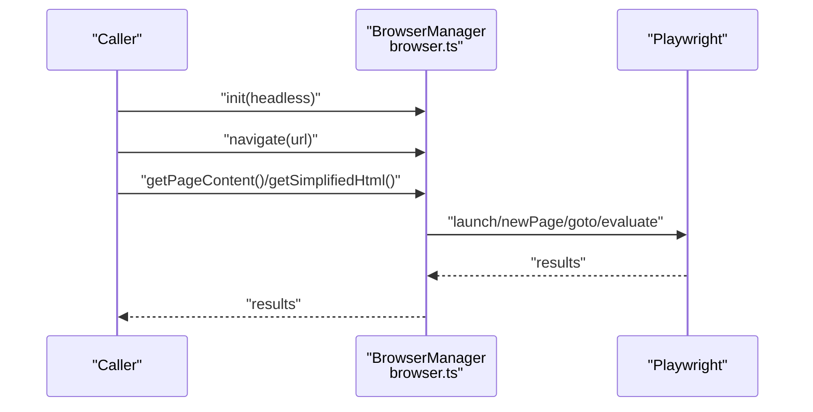
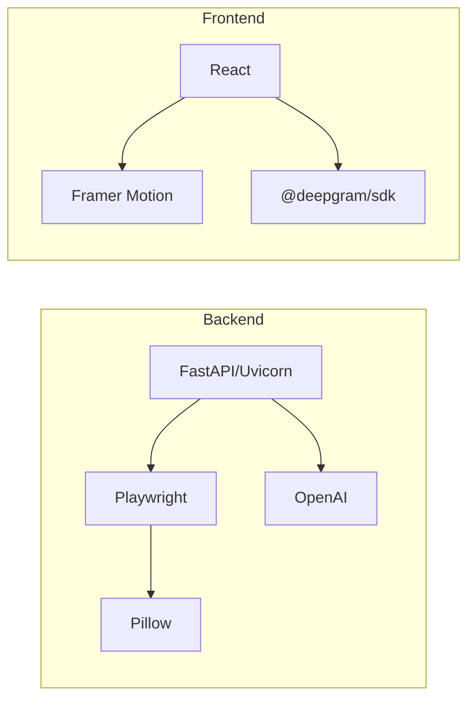

# Browser Automation

<cite>
**Referenced Files in This Document**
- [ghost_pilot.py](file://backend/ghost_pilot.py)
- [main.py](file://backend/main.py)
- [set_of_marks.js](file://backend/set_of_marks.js)
- [browser.ts](file://extraction-script/lib/browser.ts)
- [route.ts](file://extraction-script/app/api/extract/route.ts)
- [GhostCursor.tsx](file://frontend/src/components/GhostCursor.tsx)
- [VideoStream.tsx](file://frontend/src/components/VideoStream.tsx)
- [App.tsx](file://frontend/src/App.tsx)
- [requirements.txt](file://backend/requirements.txt)
- [package.json](file://frontend/package.json)
</cite>

## Table of Contents
1. [Introduction](#introduction)
2. [Project Structure](#project-structure)
3. [Core Components](#core-components)
4. [Architecture Overview](#architecture-overview)
5. [Detailed Component Analysis](#detailed-component-analysis)
6. [Dependency Analysis](#dependency-analysis)
7. [Performance Considerations](#performance-considerations)
8. [Troubleshooting Guide](#troubleshooting-guide)
9. [Conclusion](#conclusion)

## Introduction
This document describes the browser automation subsystem that powers autonomous web navigation. It integrates Playwright for headless and headed browser control, a Set-of-Marks tagging system for element targeting, and a vision-language model pipeline for decision-making. The system supports page navigation, element interaction, form filling, screenshot capture, and a realistic mouse movement simulation using spring physics. It also includes state management, session persistence, multi-page navigation handling, error handling, and performance optimization strategies.

## Project Structure
The automation subsystem spans three main areas:
- Backend service: FastAPI WebSocket server and Ghost Pilot engine
- Frontend: Real-time visualization, cursor overlay, and voice-driven commands
- Extraction utilities: Standalone Playwright browser manager and element extraction API

```mermaid
graph TB
subgraph "Backend"
A["FastAPI WebSocket Server<br/>main.py"]
B["Ghost Pilot Engine<br/>ghost_pilot.py"]
C["Set-of-Marks Script<br/>set_of_marks.js"]
end
subgraph "Frontend"
D["App Shell<br/>App.tsx"]
E["Video Stream<br/>VideoStream.tsx"]
F["Ghost Cursor<br/>GhostCursor.tsx"]
end
subgraph "Extraction Utilities"
G["Playwright Manager<br/>browser.ts"]
H["Element Extraction API<br/>route.ts"]
end
A --> B
B --> C
A <- --> D
D --> E
D --> F
G --> H
```

**Diagram sources**
- [main.py](file://backend/main.py#L36-L157)
- [ghost_pilot.py](file://backend/ghost_pilot.py#L18-L105)
- [set_of_marks.js](file://backend/set_of_marks.js#L8-L229)
- [App.tsx](file://frontend/src/App.tsx#L14-L360)
- [VideoStream.tsx](file://frontend/src/components/VideoStream.tsx#L8-L43)
- [GhostCursor.tsx](file://frontend/src/components/GhostCursor.tsx#L10-L99)
- [browser.ts](file://extraction-script/lib/browser.ts#L4-L254)
- [route.ts](file://extraction-script/app/api/extract/route.ts#L14-L157)

**Section sources**
- [main.py](file://backend/main.py#L17-L27)
- [ghost_pilot.py](file://backend/ghost_pilot.py#L18-L105)
- [set_of_marks.js](file://backend/set_of_marks.js#L8-L229)
- [App.tsx](file://frontend/src/App.tsx#L14-L360)
- [VideoStream.tsx](file://frontend/src/components/VideoStream.tsx#L8-L43)
- [GhostCursor.tsx](file://frontend/src/components/GhostCursor.tsx#L10-L99)
- [browser.ts](file://extraction-script/lib/browser.ts#L4-L254)
- [route.ts](file://extraction-script/app/api/extract/route.ts#L14-L157)

## Core Components
- Ghost Pilot Engine: Orchestrates browser lifecycle, page tagging, screenshot capture, LLM-based action selection, and action execution. Implements rate-limiting, captcha detection, and robust error handling.
- Set-of-Marks: Injects yellow tags over interactive elements and returns a serializable element map with centers and selectors for precise targeting.
- Playwright Manager: Provides a singleton browser manager for standalone extraction tasks, including navigation, element interaction, and content extraction.
- Element Extraction API: Exposes a Next.js route to extract interactive elements with geometry and selectors.
- Frontend Visualization: Streams screenshots, renders a spring-damped cursor overlay, and provides voice-driven mission initiation.

Key capabilities:
- Headless and headed browser control via Playwright
- Page navigation and multi-page handling
- Element interaction (click, type) with coordinate mapping
- Form filling and scrolling
- Screenshot capture and base64 streaming
- Element visibility detection and targeting
- Mouse movement with spring animation physics
- Session persistence and cleanup strategies

**Section sources**
- [ghost_pilot.py](file://backend/ghost_pilot.py#L18-L105)
- [ghost_pilot.py](file://backend/ghost_pilot.py#L140-L157)
- [ghost_pilot.py](file://backend/ghost_pilot.py#L232-L239)
- [ghost_pilot.py](file://backend/ghost_pilot.py#L240-L297)
- [ghost_pilot.py](file://backend/ghost_pilot.py#L564-L622)
- [ghost_pilot.py](file://backend/ghost_pilot.py#L623-L768)
- [ghost_pilot.py](file://backend/ghost_pilot.py#L769-L800)
- [set_of_marks.js](file://backend/set_of_marks.js#L8-L229)
- [browser.ts](file://extraction-script/lib/browser.ts#L20-L46)
- [browser.ts](file://extraction-script/lib/browser.ts#L48-L73)
- [browser.ts](file://extraction-script/lib/browser.ts#L217-L234)
- [route.ts](file://extraction-script/app/api/extract/route.ts#L39-L142)
- [GhostCursor.tsx](file://frontend/src/components/GhostCursor.tsx#L10-L25)

## Architecture Overview
The system follows a real-time WebSocket architecture:
- The frontend sends mission objectives and receives live updates.
- The backend initializes Ghost Pilot, injects Set-of-Marks, captures screenshots, queries the LLM, executes actions, and streams feedback.
- The frontend renders the live video feed and animated cursor.



**Diagram sources**
- [main.py](file://backend/main.py#L36-L157)
- [ghost_pilot.py](file://backend/ghost_pilot.py#L140-L157)
- [ghost_pilot.py](file://backend/ghost_pilot.py#L232-L239)
- [ghost_pilot.py](file://backend/ghost_pilot.py#L299-L365)
- [ghost_pilot.py](file://backend/ghost_pilot.py#L564-L622)
- [ghost_pilot.py](file://backend/ghost_pilot.py#L623-L768)

## Detailed Component Analysis

### Ghost Pilot Engine
Responsibilities:
- Initialize Playwright, launch Chromium, and manage a single page
- Inject Set-of-Marks and maintain an element map keyed by tag IDs
- Capture screenshots and send them to the LLM
- Query LLM for the next action with rate-limiting and retry logic
- Execute actions (click, type, scroll, wait, finish)
- Detect captchas and support manual override
- Stream telemetry and status to the frontend via WebSocket



**Diagram sources**
- [ghost_pilot.py](file://backend/ghost_pilot.py#L18-L105)
- [ghost_pilot.py](file://backend/ghost_pilot.py#L140-L157)
- [ghost_pilot.py](file://backend/ghost_pilot.py#L232-L239)
- [ghost_pilot.py](file://backend/ghost_pilot.py#L240-L297)
- [ghost_pilot.py](file://backend/ghost_pilot.py#L299-L365)
- [ghost_pilot.py](file://backend/ghost_pilot.py#L564-L622)
- [ghost_pilot.py](file://backend/ghost_pilot.py#L623-L768)
- [ghost_pilot.py](file://backend/ghost_pilot.py#L769-L800)

**Section sources**
- [ghost_pilot.py](file://backend/ghost_pilot.py#L18-L105)
- [ghost_pilot.py](file://backend/ghost_pilot.py#L140-L157)
- [ghost_pilot.py](file://backend/ghost_pilot.py#L232-L239)
- [ghost_pilot.py](file://backend/ghost_pilot.py#L240-L297)
- [ghost_pilot.py](file://backend/ghost_pilot.py#L299-L365)
- [ghost_pilot.py](file://backend/ghost_pilot.py#L564-L622)
- [ghost_pilot.py](file://backend/ghost_pilot.py#L623-L768)
- [ghost_pilot.py](file://backend/ghost_pilot.py#L769-L800)

### Set-of-Marks Targeting System
Behavior:
- Removes any previous tag container
- Selects interactive elements using a comprehensive selector list
- Filters visible elements by computed styles and bounding rects
- Renders persistent yellow tags with numeric labels
- Returns a serializable map of tag IDs to centers and metadata



**Diagram sources**
- [set_of_marks.js](file://backend/set_of_marks.js#L8-L229)

**Section sources**
- [set_of_marks.js](file://backend/set_of_marks.js#L8-L229)

### Element Interaction and Form Filling
- Navigation: Uses Playwright’s goto with wait conditions and optional refresh behavior
- Clicking: Resolves coordinates from tag map or explicit coordinates, then performs a mouse click
- Typing: Clicks the target element, waits, then types text with a configurable delay
- Scrolling: Scrolls by viewport fraction or to top/bottom
- Filling: Provides a separate manager for simplified fill operations



**Diagram sources**
- [ghost_pilot.py](file://backend/ghost_pilot.py#L564-L622)
- [browser.ts](file://extraction-script/lib/browser.ts#L48-L73)
- [browser.ts](file://extraction-script/lib/browser.ts#L217-L234)

**Section sources**
- [ghost_pilot.py](file://backend/ghost_pilot.py#L564-L622)
- [browser.ts](file://extraction-script/lib/browser.ts#L48-L73)
- [browser.ts](file://extraction-script/lib/browser.ts#L217-L234)

### Screenshot Capture and Computer Vision Workflow
- Screenshot capture returns PNG bytes encoded as base64
- Frontend displays the base64 image as a data URL
- The LLM receives the screenshot and a structured prompt to produce an action JSON
- Rate limiting and retry logic protect external API usage



**Diagram sources**
- [ghost_pilot.py](file://backend/ghost_pilot.py#L232-L239)
- [ghost_pilot.py](file://backend/ghost_pilot.py#L654-L657)
- [VideoStream.tsx](file://frontend/src/components/VideoStream.tsx#L8-L43)

**Section sources**
- [ghost_pilot.py](file://backend/ghost_pilot.py#L232-L239)
- [ghost_pilot.py](file://backend/ghost_pilot.py#L654-L657)
- [VideoStream.tsx](file://frontend/src/components/VideoStream.tsx#L8-L43)

### Mouse Movement Simulation with Spring Physics
- The frontend animates the cursor using Framer Motion with spring configuration
- Coordinates are received from the backend after each action
- The cursor trails and glow enhance realism



**Diagram sources**
- [GhostCursor.tsx](file://frontend/src/components/GhostCursor.tsx#L10-L25)
- [App.tsx](file://frontend/src/App.tsx#L37-L41)

**Section sources**
- [GhostCursor.tsx](file://frontend/src/components/GhostCursor.tsx#L10-L25)
- [App.tsx](file://frontend/src/App.tsx#L37-L41)

### State Management, Session Persistence, and Multi-Page Navigation
- The WebSocket endpoint manages a single Ghost Pilot instance per connection
- On mission completion or disconnect, the browser remains open by default to allow manual inspection
- Navigation is handled per mission; subsequent missions initialize a fresh browser
- Captcha detection pauses execution until resolved or overridden



**Diagram sources**
- [main.py](file://backend/main.py#L36-L157)
- [ghost_pilot.py](file://backend/ghost_pilot.py#L623-L768)

**Section sources**
- [main.py](file://backend/main.py#L36-L157)
- [ghost_pilot.py](file://backend/ghost_pilot.py#L623-L768)

### Element Visibility Detection and Interaction Validation
- Set-of-Marks filters elements by offset parent presence, computed styles, and bounding rect dimensions
- Frontend and extraction utilities compute visibility using computed styles and bounding rectangles
- Extraction API returns geometry in page coordinates, enabling precise targeting



**Diagram sources**
- [set_of_marks.js](file://backend/set_of_marks.js#L35-L51)
- [route.ts](file://extraction-script/app/api/extract/route.ts#L43-L51)

**Section sources**
- [set_of_marks.js](file://backend/set_of_marks.js#L35-L51)
- [route.ts](file://extraction-script/app/api/extract/route.ts#L43-L51)

### Standalone Extraction Utilities
- Playwright Manager: Singleton browser manager for navigation, clicking, filling, and simplified HTML extraction
- Element Extraction API: Returns structured element metadata with selectors and geometry



**Diagram sources**
- [browser.ts](file://extraction-script/lib/browser.ts#L20-L46)
- [browser.ts](file://extraction-script/lib/browser.ts#L125-L215)

**Section sources**
- [browser.ts](file://extraction-script/lib/browser.ts#L20-L46)
- [browser.ts](file://extraction-script/lib/browser.ts#L125-L215)
- [route.ts](file://extraction-script/app/api/extract/route.ts#L14-L157)

## Dependency Analysis
External libraries and their roles:
- Backend: FastAPI, Uvicorn, Playwright, OpenAI, python-dotenv, websockets, Pillow
- Frontend: React, Framer Motion, @deepgram/sdk



**Diagram sources**
- [requirements.txt](file://backend/requirements.txt#L1-L8)
- [package.json](file://frontend/package.json#L12-L32)

**Section sources**
- [requirements.txt](file://backend/requirements.txt#L1-L8)
- [package.json](file://frontend/package.json#L12-L32)

## Performance Considerations
- Use headless mode for speed; enable headed mode for debugging
- Minimize screenshot frequency; batch updates when possible
- Apply exponential backoff for rate-limited LLM calls
- Prefer tag-based targeting to avoid brittle selectors
- Use targeted waits (network idle, load state) instead of arbitrary sleeps
- Limit concurrent browser instances; reuse contexts where appropriate
- Optimize frontend rendering by avoiding unnecessary re-renders

[No sources needed since this section provides general guidance]

## Troubleshooting Guide
Common issues and resolutions:
- Rate limits: The engine implements progressive delays and respects Retry-After headers. Monitor logs for rate-limit warnings and adjust provider tiers accordingly.
- Captcha challenges: The system detects visible captcha frames and prompts manual resolution. Users can override the wait via a dedicated message.
- Action failures: The engine retries once per step and logs detailed errors. Verify element visibility and selector stability.
- Memory leaks: Ensure cleanup is called; the engine attempts to close page, browser, and stop Playwright gracefully.
- Network errors: For transient server errors, the engine applies linear backoff and retries.

**Section sources**
- [ghost_pilot.py](file://backend/ghost_pilot.py#L181-L231)
- [ghost_pilot.py](file://backend/ghost_pilot.py#L514-L562)
- [ghost_pilot.py](file://backend/ghost_pilot.py#L769-L800)
- [main.py](file://backend/main.py#L128-L137)

## Conclusion
The browser automation subsystem combines Playwright, Set-of-Marks, and a vision-language model to achieve autonomous web navigation. It emphasizes robustness through rate limiting, captcha handling, and resilient retries, while delivering a smooth user experience with real-time video feeds and spring-damped cursor animations. The architecture supports both guided missions and standalone extraction utilities, enabling flexible deployment across diverse use cases.