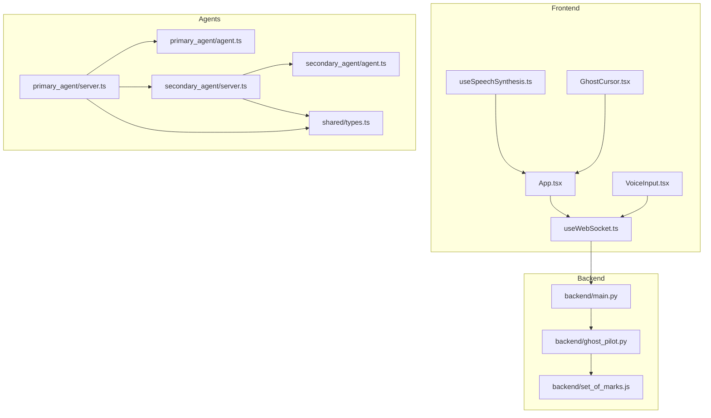
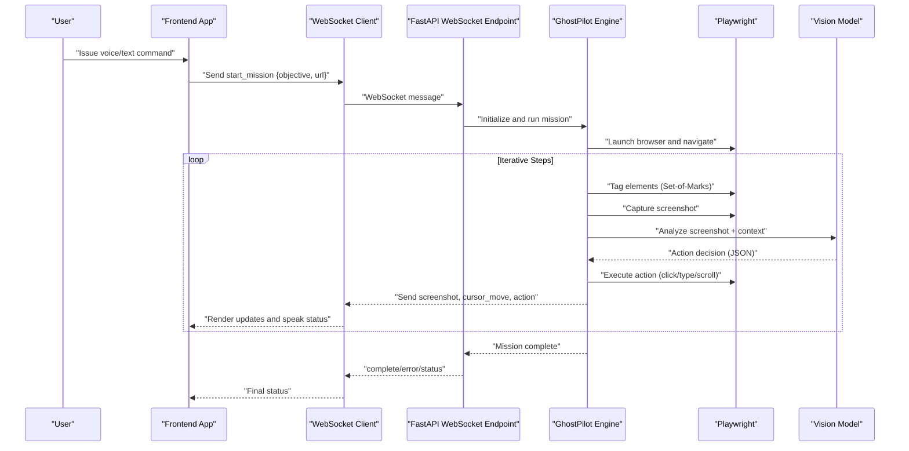
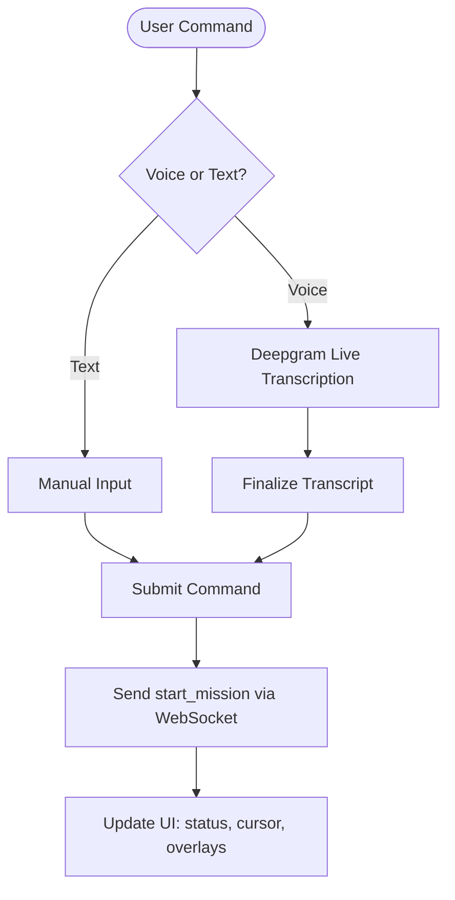
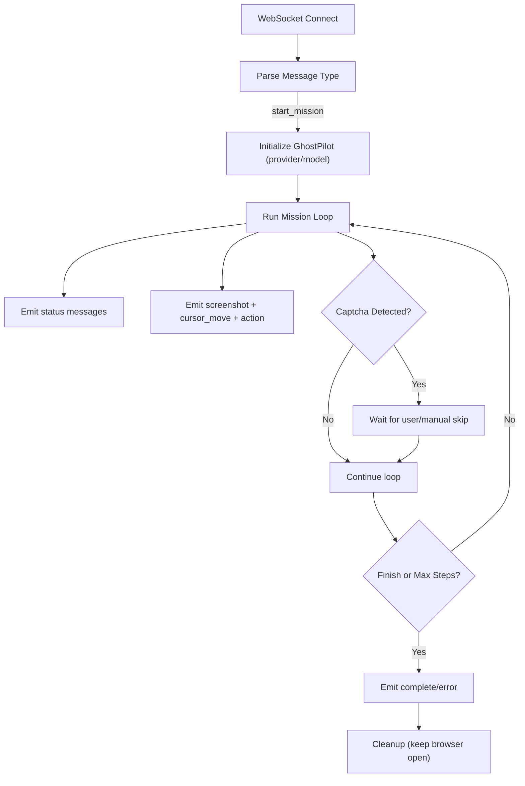
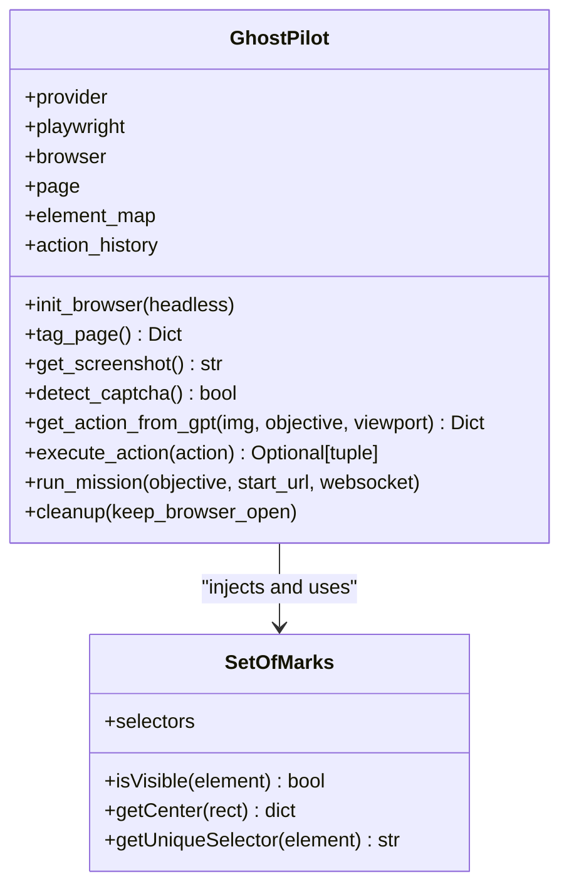
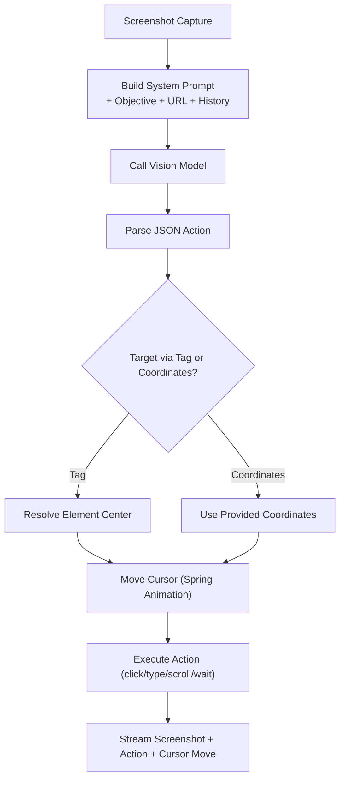
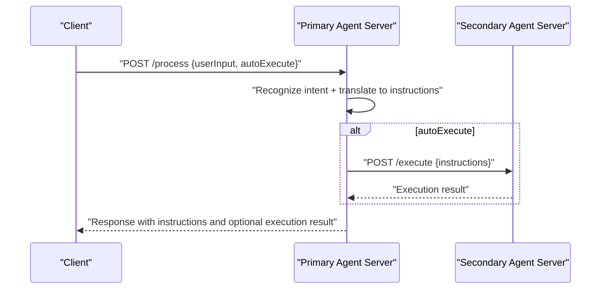
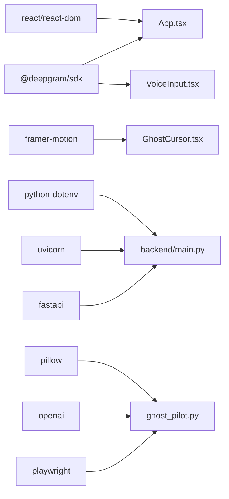

# Core Architecture

<cite>
**Referenced Files in This Document**
- [backend/main.py](file://backend/main.py)
- [backend/ghost_pilot.py](file://backend/ghost_pilot.py)
- [backend/set_of_marks.js](file://backend/set_of_marks.js)
- [frontend/src/App.tsx](file://frontend/src/App.tsx)
- [frontend/src/hooks/useWebSocket.ts](file://frontend/src/hooks/useWebSocket.ts)
- [frontend/src/components/GhostCursor.tsx](file://frontend/src/components/GhostCursor.tsx)
- [frontend/src/components/VoiceInput.tsx](file://frontend/src/components/VoiceInput.tsx)
- [frontend/src/hooks/useSpeechSynthesis.ts](file://frontend/src/hooks/useSpeechSynthesis.ts)
- [frontend/package.json](file://frontend/package.json)
- [backend/requirements.txt](file://backend/requirements.txt)
- [primary_agent/server.ts](file://primary_agent/server.ts)
- [secondary_agent/server.ts](file://secondary_agent/server.ts)
- [primary_agent/agent.ts](file://primary_agent/agent.ts)
- [secondary_agent/agent.ts](file://secondary_agent/agent.ts)
- [shared/types.ts](file://shared/types.ts)
</cite>

## Table of Contents
1. [Introduction](#introduction)
2. [Project Structure](#project-structure)
3. [Core Components](#core-components)
4. [Architecture Overview](#architecture-overview)
5. [Detailed Component Analysis](#detailed-component-analysis)
6. [Dependency Analysis](#dependency-analysis)
7. [Performance Considerations](#performance-considerations)
8. [Troubleshooting Guide](#troubleshooting-guide)
9. [Conclusion](#conclusion)
10. [Appendices](#appendices)

## Introduction
This document describes the Ghost Pilot system architecture, a three-tier autonomous browser automation platform. The system comprises:
- Frontend React application with real-time visualization and voice input
- Backend FastAPI WebSocket server orchestrating autonomous missions
- AI-powered autonomous engine leveraging GPT-4o Vision for screenshot analysis and decision-making

The architecture emphasizes real-time communication, robust browser automation via Playwright, precise element targeting with Set-of-Marks, and smooth cursor movement using Spring physics via Framer Motion. It also documents integration patterns for voice input processing, screenshot capture, and action execution, along with infrastructure, scalability, and deployment considerations.

## Project Structure
The repository is organized into distinct layers:
- frontend: React application with WebSocket hooks, voice input, cursor visualization, and speech synthesis
- backend: FastAPI WebSocket server and autonomous engine (GhostPilot) with Playwright and AI integrations
- primary_agent and secondary_agent: Complementary agent servers for intent processing and action execution
- shared: TypeScript types used across agents and frontend

**Diagram sources**
- [frontend/src/App.tsx](file://frontend/src/App.tsx#L1-L360)
- [frontend/src/hooks/useWebSocket.ts](file://frontend/src/hooks/useWebSocket.ts#L1-L93)
- [frontend/src/components/VoiceInput.tsx](file://frontend/src/components/VoiceInput.tsx#L1-L321)
- [frontend/src/hooks/useSpeechSynthesis.ts](file://frontend/src/hooks/useSpeechSynthesis.ts#L1-L79)
- [frontend/src/components/GhostCursor.tsx](file://frontend/src/components/GhostCursor.tsx#L1-L99)
- [backend/main.py](file://backend/main.py#L1-L157)
- [backend/ghost_pilot.py](file://backend/ghost_pilot.py#L1-L802)
- [backend/set_of_marks.js](file://backend/set_of_marks.js#L1-L229)
- [primary_agent/server.ts](file://primary_agent/server.ts#L1-L203)
- [secondary_agent/server.ts](file://secondary_agent/server.ts#L1-L100)
- [primary_agent/agent.ts](file://primary_agent/agent.ts#L1-L106)
- [secondary_agent/agent.ts](file://secondary_agent/agent.ts#L1-L119)
- [shared/types.ts](file://shared/types.ts#L1-L85)

**Section sources**
- [frontend/src/App.tsx](file://frontend/src/App.tsx#L1-L360)
- [backend/main.py](file://backend/main.py#L1-L157)
- [backend/ghost_pilot.py](file://backend/ghost_pilot.py#L1-L802)
- [backend/set_of_marks.js](file://backend/set_of_marks.js#L1-L229)
- [primary_agent/server.ts](file://primary_agent/server.ts#L1-L203)
- [secondary_agent/server.ts](file://secondary_agent/server.ts#L1-L100)
- [primary_agent/agent.ts](file://primary_agent/agent.ts#L1-L106)
- [secondary_agent/agent.ts](file://secondary_agent/agent.ts#L1-L119)
- [shared/types.ts](file://shared/types.ts#L1-L85)

## Core Components
- Frontend React Application
  - Real-time visualization of browser screenshots and cursor movements
  - Voice input via Deepgram SDK with live transcription
  - Speech synthesis feedback using Web Speech API
  - WebSocket client managing bidirectional communication with backend
- Backend FastAPI WebSocket Server
  - Accepts WebSocket connections and manages autonomous missions
  - Initializes and controls the GhostPilot engine
  - Handles user commands (start mission, skip captcha)
- GhostPilot Autonomous Engine
  - Browser automation with Playwright (Chromium)
  - Element tagging with Set-of-Marks for precise targeting
  - Vision-based decision-making using GPT-4o or compatible providers
  - Real-time screenshot capture and action execution
- Agent Servers (Optional Extension)
  - Primary Agent: intent recognition and instruction translation
  - Secondary Agent: context-aware action execution and state management
  - Shared types define cross-service contracts

**Section sources**
- [frontend/src/App.tsx](file://frontend/src/App.tsx#L1-L360)
- [frontend/src/components/VoiceInput.tsx](file://frontend/src/components/VoiceInput.tsx#L1-L321)
- [frontend/src/hooks/useSpeechSynthesis.ts](file://frontend/src/hooks/useSpeechSynthesis.ts#L1-L79)
- [frontend/src/hooks/useWebSocket.ts](file://frontend/src/hooks/useWebSocket.ts#L1-L93)
- [backend/main.py](file://backend/main.py#L1-L157)
- [backend/ghost_pilot.py](file://backend/ghost_pilot.py#L1-L802)
- [backend/set_of_marks.js](file://backend/set_of_marks.js#L1-L229)
- [primary_agent/server.ts](file://primary_agent/server.ts#L1-L203)
- [secondary_agent/server.ts](file://secondary_agent/server.ts#L1-L100)
- [primary_agent/agent.ts](file://primary_agent/agent.ts#L1-L106)
- [secondary_agent/agent.ts](file://secondary_agent/agent.ts#L1-L119)
- [shared/types.ts](file://shared/types.ts#L1-L85)

## Architecture Overview
The system follows a real-time, event-driven pattern:
- Frontend establishes a WebSocket connection to the backend
- Backend initializes GhostPilot and starts an autonomous mission loop
- GhostPilot tags interactive elements, captures screenshots, queries the AI model, executes actions, and streams updates to the frontend
- Optional agent servers can be integrated for intent processing and structured action execution

**Diagram sources**
- [frontend/src/App.tsx](file://frontend/src/App.tsx#L146-L174)
- [frontend/src/hooks/useWebSocket.ts](file://frontend/src/hooks/useWebSocket.ts#L60-L66)
- [backend/main.py](file://backend/main.py#L36-L127)
- [backend/ghost_pilot.py](file://backend/ghost_pilot.py#L623-L767)

## Detailed Component Analysis

### Frontend: Real-Time Visualization and Interaction
- WebSocket Integration
  - Provides connection state, last message handling, and send/reconnect utilities
  - Supports automatic reconnection on close
- Voice Input
  - Uses Deepgram SDK for live transcription with interim results and punctuation
  - Processes final transcripts and triggers mission start
- Speech Synthesis
  - Queued speech synthesis with prioritization for immediate feedback
- Cursor Visualization
  - Spring-based animation using Framer Motion for natural cursor movement
- Status and Feedback
  - Thinks overlay, status bar, and contextual messages synchronized with backend events

**Diagram sources**
- [frontend/src/components/VoiceInput.tsx](file://frontend/src/components/VoiceInput.tsx#L41-L171)
- [frontend/src/hooks/useWebSocket.ts](file://frontend/src/hooks/useWebSocket.ts#L21-L66)
- [frontend/src/App.tsx](file://frontend/src/App.tsx#L146-L174)

**Section sources**
- [frontend/src/hooks/useWebSocket.ts](file://frontend/src/hooks/useWebSocket.ts#L1-L93)
- [frontend/src/components/VoiceInput.tsx](file://frontend/src/components/VoiceInput.tsx#L1-L321)
- [frontend/src/hooks/useSpeechSynthesis.ts](file://frontend/src/hooks/useSpeechSynthesis.ts#L1-L79)
- [frontend/src/components/GhostCursor.tsx](file://frontend/src/components/GhostCursor.tsx#L1-L99)
- [frontend/src/App.tsx](file://frontend/src/App.tsx#L1-L360)

### Backend: FastAPI WebSocket Orchestration
- WebSocket Endpoint
  - Accepts connections and handles mission lifecycle
  - Supports provider selection for AI models (LM Studio, OpenAI, Gemini, OpenRouter, Custom)
  - Emits status, thinking, screenshot, action, captcha events, and completion/error
- Mission Control
  - Initializes GhostPilot with selected provider and model
  - Runs autonomous loop with retry and cleanup logic
  - Keeps browser open for manual interaction by default

**Diagram sources**
- [backend/main.py](file://backend/main.py#L36-L152)
- [backend/ghost_pilot.py](file://backend/ghost_pilot.py#L623-L767)

**Section sources**
- [backend/main.py](file://backend/main.py#L1-L157)

### Autonomous Engine: GhostPilot
- Initialization and Browser Management
  - Starts Playwright, launches Chromium, sets viewport, and navigates to URL
- Element Tagging and Targeting
  - Injects Set-of-Marks script to overlay yellow tags on interactive elements
  - Returns element map with centers for precise targeting
- Vision-Based Decision Making
  - Captures screenshot and sends to AI model (GPT-4o or compatible)
  - Builds system prompt with objective, URL, viewport, and recent action history
  - Parses and validates JSON action response
- Action Execution
  - Executes click, type, scroll, wait, or finish actions
  - Emits cursor movement coordinates for frontend visualization
- Safety and Resilience
  - Captcha detection and manual override support
  - Rate limiting and retry logic for free-tier providers
  - Loop detection and prevention heuristics
  - Robust error handling and step-wise retries

**Diagram sources**
- [backend/ghost_pilot.py](file://backend/ghost_pilot.py#L18-L157)
- [backend/set_of_marks.js](file://backend/set_of_marks.js#L8-L228)

**Section sources**
- [backend/ghost_pilot.py](file://backend/ghost_pilot.py#L1-L802)
- [backend/set_of_marks.js](file://backend/set_of_marks.js#L1-L229)

### Vision-Based Navigation Architecture
- GPT-4o Vision Integration
  - Sends screenshot and structured system prompt to AI model
  - Receives JSON action with thought, action_type, tag_id, coordinates, text, scroll_direction, confidence
- Set-of-Marks Element Targeting
  - Identifies visible interactive elements and assigns numeric tags
  - Provides element centers for cursor movement and click actions
- Spring Animation Physics for Cursor Movement
  - Frontend applies spring-based animations via Framer Motion for smooth cursor transitions
- Real-Time Feedback Loop
  - Backend streams screenshots and action events; frontend renders overlays and speaks status

**Diagram sources**
- [backend/ghost_pilot.py](file://backend/ghost_pilot.py#L299-L767)
- [frontend/src/components/GhostCursor.tsx](file://frontend/src/components/GhostCursor.tsx#L13-L25)

**Section sources**
- [backend/ghost_pilot.py](file://backend/ghost_pilot.py#L299-L767)
- [frontend/src/components/GhostCursor.tsx](file://frontend/src/components/GhostCursor.tsx#L1-L99)

### Agent Servers (Optional Extension)
- Primary Agent Server
  - Exposes /process for intent recognition and instruction translation
  - Optionally auto-executes instructions via Secondary Agent
  - Integrates with Secondary Agent for context retrieval
- Secondary Agent Server
  - Exposes /context and /execute endpoints
  - Manages browser context and executes structured instructions
- Shared Types
  - Defines AgentInstruction, AgentContext, PageElement, DBSchemaInfo, UserIntent, and AgentResponse contracts

**Diagram sources**
- [primary_agent/server.ts](file://primary_agent/server.ts#L79-L161)
- [secondary_agent/server.ts](file://secondary_agent/server.ts#L61-L91)
- [shared/types.ts](file://shared/types.ts#L3-L85)

**Section sources**
- [primary_agent/server.ts](file://primary_agent/server.ts#L1-L203)
- [secondary_agent/server.ts](file://secondary_agent/server.ts#L1-L100)
- [primary_agent/agent.ts](file://primary_agent/agent.ts#L1-L106)
- [secondary_agent/agent.ts](file://secondary_agent/agent.ts#L1-L119)
- [shared/types.ts](file://shared/types.ts#L1-L85)

## Dependency Analysis
- Frontend Dependencies
  - @deepgram/sdk for voice transcription
  - framer-motion for animations
  - react and react-dom for UI
- Backend Dependencies
  - FastAPI and Uvicorn for WebSocket server
  - Playwright for browser automation
  - OpenAI client for GPT-4o integration
  - python-dotenv for environment configuration
  - Pillow for image handling

**Diagram sources**
- [frontend/package.json](file://frontend/package.json#L12-L32)
- [backend/requirements.txt](file://backend/requirements.txt#L1-L8)

**Section sources**
- [frontend/package.json](file://frontend/package.json#L1-L34)
- [backend/requirements.txt](file://backend/requirements.txt#L1-L8)

## Performance Considerations
- WebSocket Throughput
  - Screenshots are base64-encoded PNG images; consider compression or streaming alternatives if bandwidth becomes a bottleneck
- AI Model Latency
  - Implement local model hosting (LM Studio) for reduced latency during development
  - Use provider-specific rate-limiting and exponential backoff for free tiers
- Browser Automation
  - Headless mode reduces overhead; keep browser open for manual inspection post-mission
  - Optimize viewport size and element visibility checks to minimize tagging overhead
- Frontend Rendering
  - Spring animations are efficient; avoid excessive re-renders by batching state updates
- Scalability
  - Horizontal scaling: run multiple backend instances behind a load balancer
  - Queue-based agent servers for high-throughput instruction execution
  - Separate AI inference endpoints for dedicated throughput

[No sources needed since this section provides general guidance]

## Troubleshooting Guide
- WebSocket Disconnections
  - Automatic reconnection is handled; monitor connection state and last message updates
- Captcha Handling
  - Use manual override to skip waiting; ensure user awareness of captcha state
- AI Provider Issues
  - Verify API keys and base URLs; implement fallback providers
  - Respect rate limits and Retry-After headers
- Browser Automation Failures
  - Confirm Playwright installation and Chromium availability
  - Validate element visibility and selectors; adjust tagging logic if needed
- Voice Input Problems
  - Ensure microphone permissions and Deepgram API key configuration
  - Handle interim vs. final transcripts appropriately

**Section sources**
- [frontend/src/hooks/useWebSocket.ts](file://frontend/src/hooks/useWebSocket.ts#L21-L52)
- [backend/main.py](file://backend/main.py#L138-L152)
- [backend/ghost_pilot.py](file://backend/ghost_pilot.py#L659-L706)
- [frontend/src/components/VoiceInput.tsx](file://frontend/src/components/VoiceInput.tsx#L42-L130)

## Conclusion
Ghost Pilot integrates a modern React frontend with a FastAPI WebSocket backend and a powerful autonomous engine leveraging GPT-4o Vision and Playwright. The system’s real-time communication, precise element targeting, and animated cursor visualization deliver a compelling autonomous browsing experience. Optional agent servers enable structured intent processing and action execution, while robust error handling and rate-limiting ensure reliability across diverse environments.

[No sources needed since this section summarizes without analyzing specific files]

## Appendices

### System Boundaries and Integration Patterns
- Frontend Visualization Boundary
  - Receives screenshots and action events; renders overlays and cursor movement
- Backend Automation Boundary
  - Manages browser lifecycle, element tagging, screenshot capture, and action execution
- External AI Services Boundary
  - Vision model calls with provider abstraction; supports multiple endpoints
- Voice Processing Boundary
  - Deepgram SDK for transcription; speech synthesis for feedback

**Section sources**
- [frontend/src/App.tsx](file://frontend/src/App.tsx#L30-L123)
- [backend/ghost_pilot.py](file://backend/ghost_pilot.py#L232-L767)
- [frontend/src/components/VoiceInput.tsx](file://frontend/src/components/VoiceInput.tsx#L52-L114)

### Infrastructure and Deployment Topology
- Local Development
  - Frontend dev server, backend FastAPI server, optional agent servers
- Production Deployment
  - Containerized backend with FastAPI/Uvicorn
  - Optional separate containers for agent servers
  - CDN/static hosting for frontend assets
- Scaling
  - Stateless backend instances behind a reverse proxy
  - Persistent sessions via shared storage for agent contexts
  - Horizontal scaling of agent servers for instruction throughput

[No sources needed since this section provides general guidance]