# Ghost Pilot Engine

<cite>
**Referenced Files in This Document**
- [ghost_pilot.py](file://backend/ghost_pilot.py)
- [main.py](file://backend/main.py)
- [set_of_marks.js](file://backend/set_of_marks.js)
- [App.tsx](file://frontend/src/App.tsx)
- [useWebSocket.ts](file://frontend/src/hooks/useWebSocket.ts)
- [VideoStream.tsx](file://frontend/src/components/VideoStream.tsx)
- [GhostCursor.tsx](file://frontend/src/components/GhostCursor.tsx)
- [useSpeechSynthesis.ts](file://frontend/src/hooks/useSpeechSynthesis.ts)
- [requirements.txt](file://backend/requirements.txt)
- [package.json](file://frontend/package.json)
- [agent.ts](file://primary_agent/agent.ts)
- [action-executor.ts](file://secondary_agent/action-executor.ts)
- [types.ts (shared)](file://shared/types.ts)
- [types.ts (primary_agent)](file://primary_agent/types.ts)
- [types.ts (secondary_agent)](file://secondary_agent/types.ts)
</cite>

## Table of Contents
1. [Introduction](#introduction)
2. [Project Structure](#project-structure)
3. [Core Components](#core-components)
4. [Architecture Overview](#architecture-overview)
5. [Detailed Component Analysis](#detailed-component-analysis)
6. [Dependency Analysis](#dependency-analysis)
7. [Performance Considerations](#performance-considerations)
8. [Troubleshooting Guide](#troubleshooting-guide)
9. [Conclusion](#conclusion)
10. [Appendices](#appendices)

## Introduction
Ghost Pilot is an autonomous browser navigation engine that combines:
- Vision-based perception using GPT-4o (or compatible models) to analyze screenshots
- Set-of-Marks element tagging for precise, deterministic targeting
- Real-time browser automation via Playwright
- Multi-provider LLM support (OpenAI, LM Studio, Gemini, OpenRouter)
- Robust rate limiting, retry logic, and error recovery
- A live UI that streams screenshots and cursor movements for transparency

The system orchestrates missions by iteratively tagging the page, capturing a screenshot, querying the LLM for the next action, executing it in the browser, and reporting progress back to the UI.

## Project Structure
The repository is split into:
- Backend: FastAPI server, Ghost Pilot core, and Set-of-Marks JS
- Frontend: React app with WebSocket-driven UI and browser automation feedback
- Agents: Primary and secondary agents for intent understanding and action execution
- Shared types: Cross-cutting type definitions

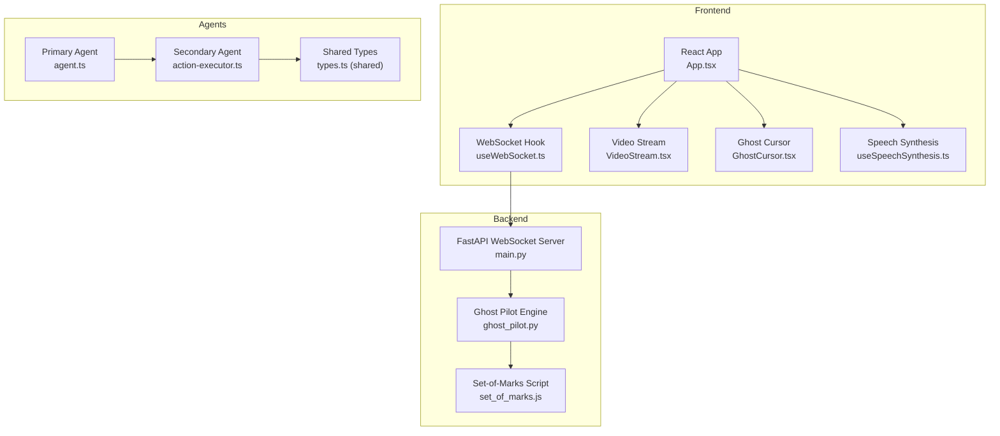

**Diagram sources**
- [main.py](file://backend/main.py#L36-L157)
- [ghost_pilot.py](file://backend/ghost_pilot.py#L18-L105)
- [set_of_marks.js](file://backend/set_of_marks.js#L8-L229)
- [App.tsx](file://frontend/src/App.tsx#L14-L360)
- [useWebSocket.ts](file://frontend/src/hooks/useWebSocket.ts#L15-L93)
- [VideoStream.tsx](file://frontend/src/components/VideoStream.tsx#L8-L43)
- [GhostCursor.tsx](file://frontend/src/components/GhostCursor.tsx#L10-L99)
- [useSpeechSynthesis.ts](file://frontend/src/hooks/useSpeechSynthesis.ts#L3-L79)
- [agent.ts](file://primary_agent/agent.ts#L9-L106)
- [action-executor.ts](file://secondary_agent/action-executor.ts#L29-L391)
- [types.ts (shared)](file://shared/types.ts#L3-L85)

**Section sources**
- [main.py](file://backend/main.py#L1-L157)
- [ghost_pilot.py](file://backend/ghost_pilot.py#L18-L105)
- [set_of_marks.js](file://backend/set_of_marks.js#L8-L229)
- [App.tsx](file://frontend/src/App.tsx#L14-L360)
- [useWebSocket.ts](file://frontend/src/hooks/useWebSocket.ts#L15-L93)
- [VideoStream.tsx](file://frontend/src/components/VideoStream.tsx#L8-L43)
- [GhostCursor.tsx](file://frontend/src/components/GhostCursor.tsx#L10-L99)
- [useSpeechSynthesis.ts](file://frontend/src/hooks/useSpeechSynthesis.ts#L3-L79)
- [agent.ts](file://primary_agent/agent.ts#L9-L106)
- [action-executor.ts](file://secondary_agent/action-executor.ts#L29-L391)
- [types.ts (shared)](file://shared/types.ts#L3-L85)

## Core Components
- Ghost Pilot Engine: Initializes the browser, tags elements, captures screenshots, queries the LLM, executes actions, and manages state and retries.
- Set-of-Marks: Injects yellow-numbered overlays onto interactive elements and returns a serializable element map.
- FastAPI WebSocket Server: Accepts missions, initializes the engine, and streams UI events.
- Frontend UI: Displays live screenshots, cursor movement, thinking indicators, and status messages; supports voice input and manual captcha override.
- Primary and Secondary Agents: Intent recognition and instruction translation (primary), and execution of instructions via browser automation and DB (secondary).

**Section sources**
- [ghost_pilot.py](file://backend/ghost_pilot.py#L18-L105)
- [set_of_marks.js](file://backend/set_of_marks.js#L8-L229)
- [main.py](file://backend/main.py#L36-L157)
- [App.tsx](file://frontend/src/App.tsx#L14-L360)
- [agent.ts](file://primary_agent/agent.ts#L9-L106)
- [action-executor.ts](file://secondary_agent/action-executor.ts#L29-L391)

## Architecture Overview
The engine follows a closed-loop autonomous navigation pipeline:
1. Start mission via WebSocket with objective and URL
2. Initialize browser and navigate to start URL
3. Tag page elements with Set-of-Marks
4. Capture screenshot and send to frontend
5. Query LLM for next action (with rate-limit checks)
6. Execute action in browser (click, type, scroll, wait, finish)
7. Repeat until objective complete or max steps reached
8. Stream progress, cursor moves, and status to UI

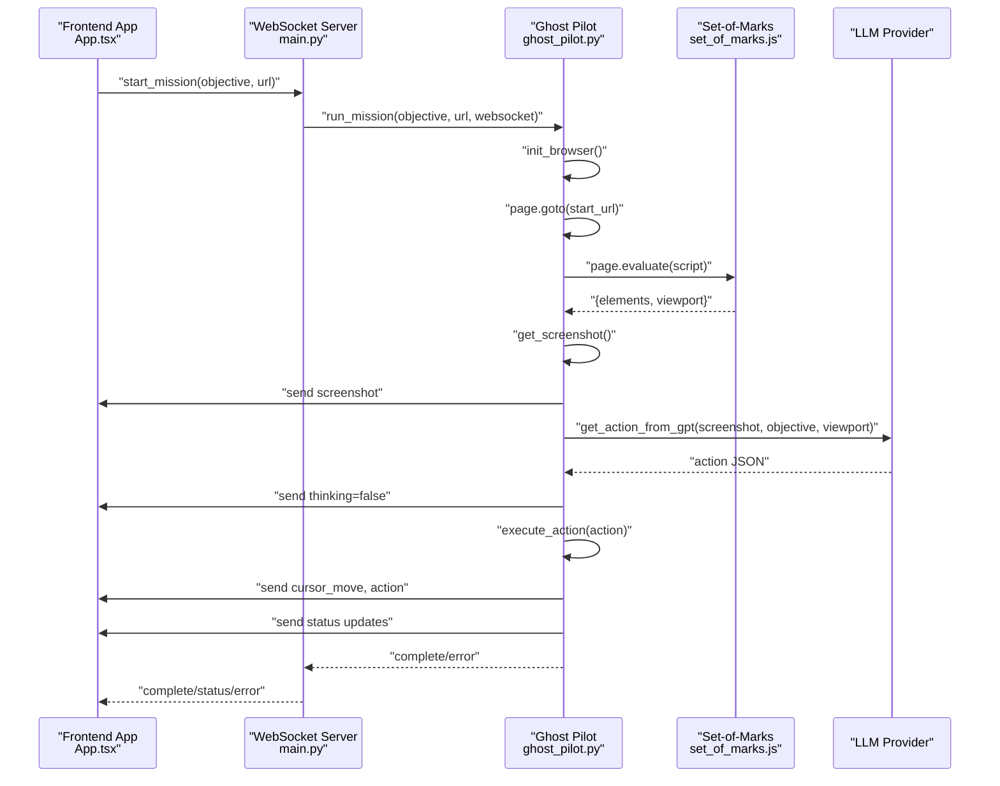

**Diagram sources**
- [main.py](file://backend/main.py#L36-L157)
- [ghost_pilot.py](file://backend/ghost_pilot.py#L623-L768)
- [set_of_marks.js](file://backend/set_of_marks.js#L8-L229)

## Detailed Component Analysis

### Vision-Based Navigation with GPT-4o and Set-of-Marks
- Element Tagging: The Set-of-Marks script enumerates interactive elements, filters visible ones, overlays yellow tags with numeric labels, and returns a serializable map of tag IDs to element centers and metadata.
- Screenshot Analysis: Ghost Pilot captures a PNG screenshot, base64-encodes it, and sends it to the selected LLM provider along with a structured system prompt that includes the objective, current URL, viewport, and recent actions.
- Action Planning: The LLM responds with a JSON action containing thought, action_type, tag_id or coordinates, optional text to type, scroll direction, and confidence. Ghost Pilot validates and executes the action.

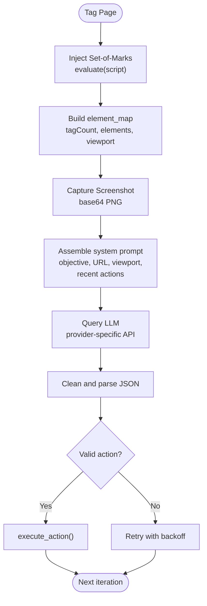

**Diagram sources**
- [ghost_pilot.py](file://backend/ghost_pilot.py#L148-L157)
- [ghost_pilot.py](file://backend/ghost_pilot.py#L299-L365)
- [ghost_pilot.py](file://backend/ghost_pilot.py#L564-L622)
- [set_of_marks.js](file://backend/set_of_marks.js#L8-L229)

**Section sources**
- [ghost_pilot.py](file://backend/ghost_pilot.py#L148-L157)
- [ghost_pilot.py](file://backend/ghost_pilot.py#L299-L365)
- [ghost_pilot.py](file://backend/ghost_pilot.py#L564-L622)
- [set_of_marks.js](file://backend/set_of_marks.js#L8-L229)

### Set-of-Marks Element Tagging System
- Selectors: Targets anchors, buttons, non-hidden inputs, textareas, selects, elements with onclick/role attributes, and editable elements.
- Visibility: Uses computed styles and bounding rects to ensure elements are visible and within the viewport.
- Overlay: Creates a high-indexed, pointer-events-free overlay with yellow borders and numeric labels.
- Map: Returns a serializable map keyed by tag ID with selector hints, text, placeholder, ARIA label, rect, and center coordinates.

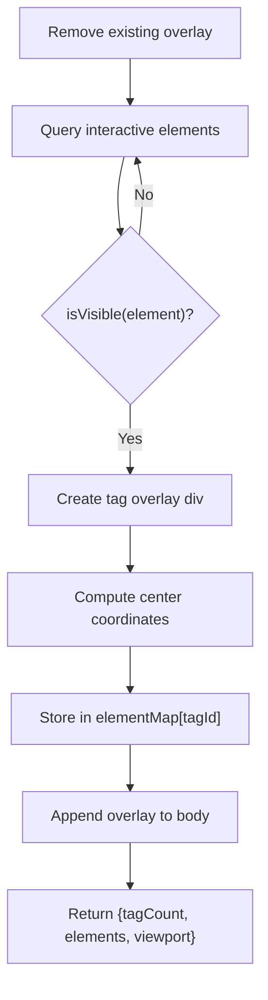

**Diagram sources**
- [set_of_marks.js](file://backend/set_of_marks.js#L8-L229)

**Section sources**
- [set_of_marks.js](file://backend/set_of_marks.js#L8-L229)

### Autonomous Action Execution Pipeline
- Supported Actions: click, type, scroll, wait, finish.
- Target Resolution: Prefer tag_id mapped to element center; fall back to provided coordinates.
- Typing Workflow: Requires a click followed by a type action on the same element to avoid redundant clicks.
- Post-Action: Waits for page stability, then proceeds to next step.

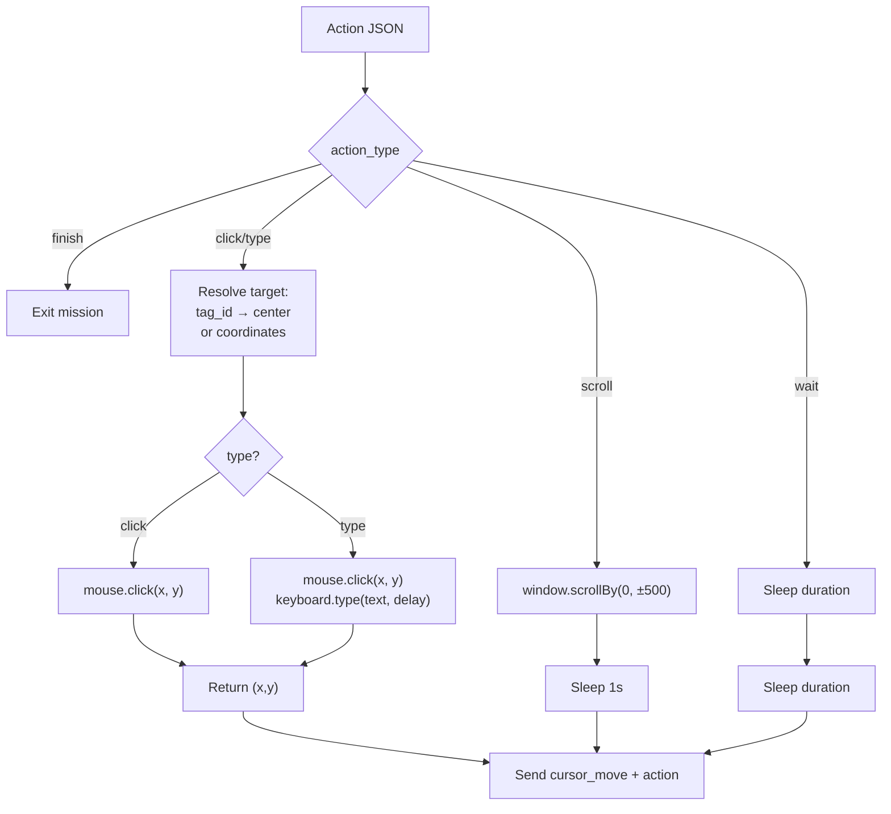

**Diagram sources**
- [ghost_pilot.py](file://backend/ghost_pilot.py#L564-L622)

**Section sources**
- [ghost_pilot.py](file://backend/ghost_pilot.py#L564-L622)

### Rate Limiting and Retry Logic
- Providers: OpenRouter and Gemini have built-in free-tier quotas; Ghost Pilot enforces RPM and daily caps.
- Rate Limit Enforcement: Tracks timestamps and resets daily; honors Retry-After headers when present.
- Retry Strategies:
  - LLM provider failures: Exponential/proportional backoff for 429/rate limit; linear backoff for 5xx/server errors.
  - Loop detection: Warns on repeated clicks/types but allows LLM to learn.
  - Captcha handling: Detects visible captcha frames/elements and text; waits for user resolution or manual skip.

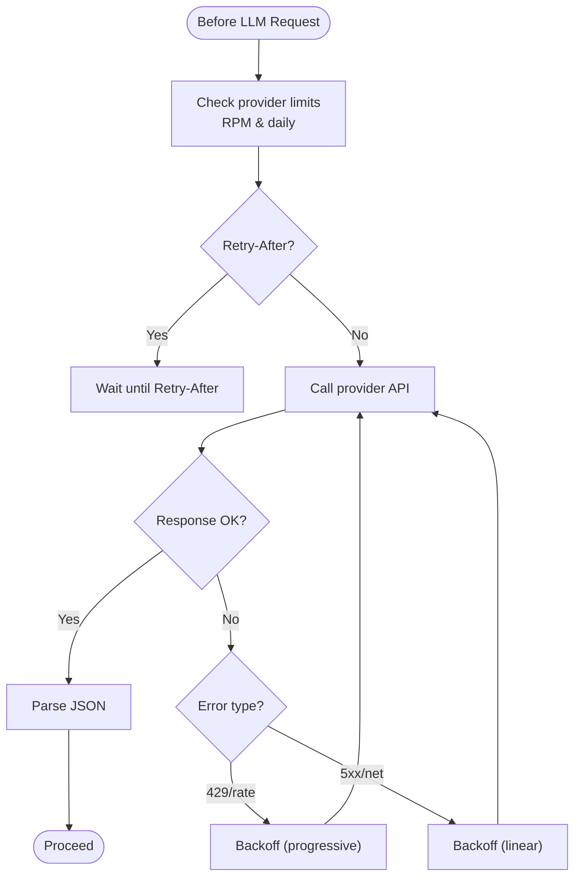

**Diagram sources**
- [ghost_pilot.py](file://backend/ghost_pilot.py#L181-L231)
- [ghost_pilot.py](file://backend/ghost_pilot.py#L434-L562)

**Section sources**
- [ghost_pilot.py](file://backend/ghost_pilot.py#L181-L231)
- [ghost_pilot.py](file://backend/ghost_pilot.py#L434-L562)

### Multi-Provider LLM Integration
- Providers Supported:
  - LM Studio: OpenAI-compatible local inference
  - OpenAI: Official API
  - Gemini: Native client with image content
  - OpenRouter: Multi-provider free tier
  - Custom: Arbitrary OpenAI-compatible endpoint
- Selection: Environment variables drive provider selection and model/base URL configuration.

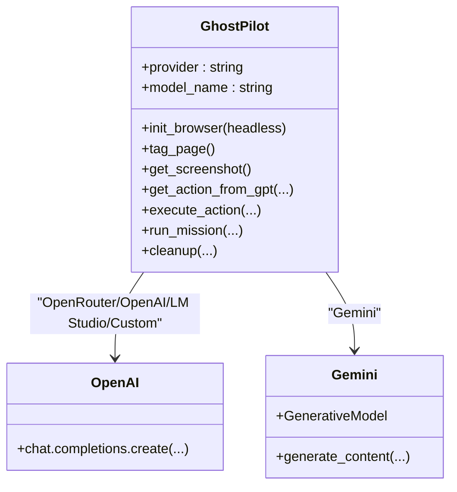

**Diagram sources**
- [ghost_pilot.py](file://backend/ghost_pilot.py#L18-L105)
- [ghost_pilot.py](file://backend/ghost_pilot.py#L366-L433)
- [ghost_pilot.py](file://backend/ghost_pilot.py#L434-L562)

**Section sources**
- [ghost_pilot.py](file://backend/ghost_pilot.py#L18-L105)
- [ghost_pilot.py](file://backend/ghost_pilot.py#L366-L433)
- [ghost_pilot.py](file://backend/ghost_pilot.py#L434-L562)

### Browser Automation Workflow, State Management, and Error Recovery
- State: Maintains element_map, action_history, request timestamps, daily counters, and optional captcha skip flag.
- Workflow:
  - Initialize browser
  - Navigate to start URL
  - Tag page, capture screenshot, detect captcha
  - Query LLM, execute action, stream updates
  - Retry on transient errors, cap at max steps
- Cleanup: Keeps browser open by default for manual inspection; otherwise closes resources.

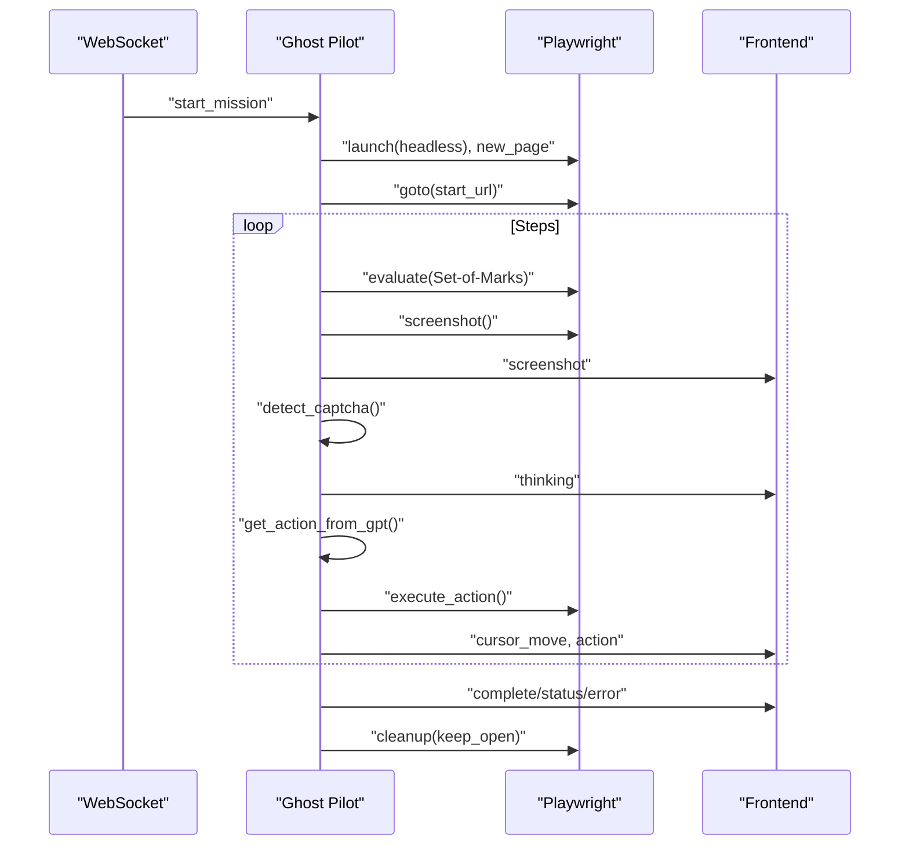

**Diagram sources**
- [ghost_pilot.py](file://backend/ghost_pilot.py#L623-L768)
- [main.py](file://backend/main.py#L36-L157)

**Section sources**
- [ghost_pilot.py](file://backend/ghost_pilot.py#L623-L768)
- [main.py](file://backend/main.py#L36-L157)

### Frontend Integration and User Experience
- WebSocket Communication: Connects to backend, parses typed or voice-transcribed commands, and sends start_mission with objective and URL.
- Live Feedback: Receives screenshots, cursor moves, thinking indicators, status, and error messages; renders them in real time.
- Accessibility: Provides speech synthesis for status and actions; includes a manual captcha override button.

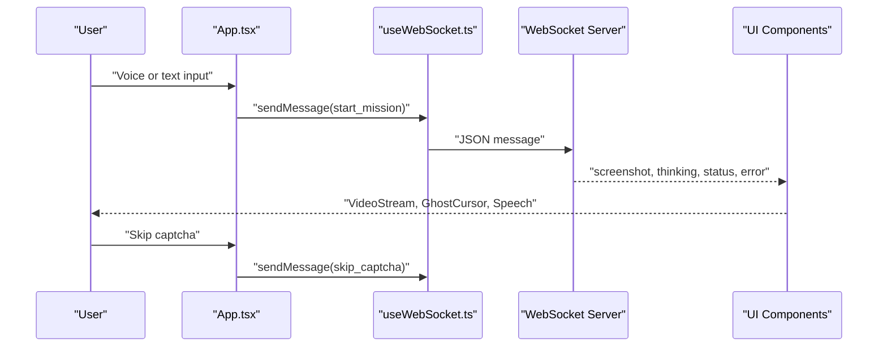

**Diagram sources**
- [App.tsx](file://frontend/src/App.tsx#L14-L360)
- [useWebSocket.ts](file://frontend/src/hooks/useWebSocket.ts#L15-L93)
- [VideoStream.tsx](file://frontend/src/components/VideoStream.tsx#L8-L43)
- [GhostCursor.tsx](file://frontend/src/components/GhostCursor.tsx#L10-L99)
- [useSpeechSynthesis.ts](file://frontend/src/hooks/useSpeechSynthesis.ts#L3-L79)

**Section sources**
- [App.tsx](file://frontend/src/App.tsx#L14-L360)
- [useWebSocket.ts](file://frontend/src/hooks/useWebSocket.ts#L15-L93)
- [VideoStream.tsx](file://frontend/src/components/VideoStream.tsx#L8-L43)
- [GhostCursor.tsx](file://frontend/src/components/GhostCursor.tsx#L10-L99)
- [useSpeechSynthesis.ts](file://frontend/src/hooks/useSpeechSynthesis.ts#L3-L79)

### Primary and Secondary Agents (Optional Orchestration)
- Primary Agent: Recognizes user intent and translates it into structured instructions with confidence and reasoning.
- Secondary Agent: Executes instructions using browser automation and DB persistence, with retry logic and selector improvement via LLM.

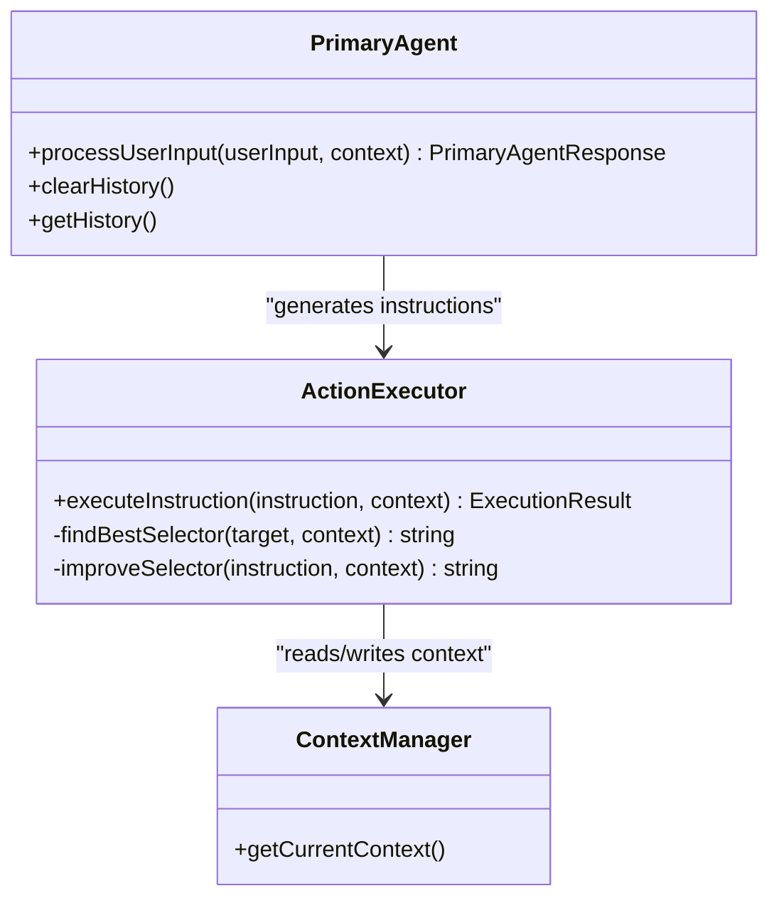

**Diagram sources**
- [agent.ts](file://primary_agent/agent.ts#L9-L106)
- [action-executor.ts](file://secondary_agent/action-executor.ts#L29-L391)

**Section sources**
- [agent.ts](file://primary_agent/agent.ts#L9-L106)
- [action-executor.ts](file://secondary_agent/action-executor.ts#L29-L391)
- [types.ts (shared)](file://shared/types.ts#L3-L85)
- [types.ts (primary_agent)](file://primary_agent/types.ts#L5-L32)
- [types.ts (secondary_agent)](file://secondary_agent/types.ts#L5-L37)

## Dependency Analysis
- Backend dependencies: FastAPI, Uvicorn, Playwright, OpenAI SDK, websockets, Pillow.
- Frontend dependencies: React, Framer Motion, @deepgram/sdk, TypeScript toolchain.

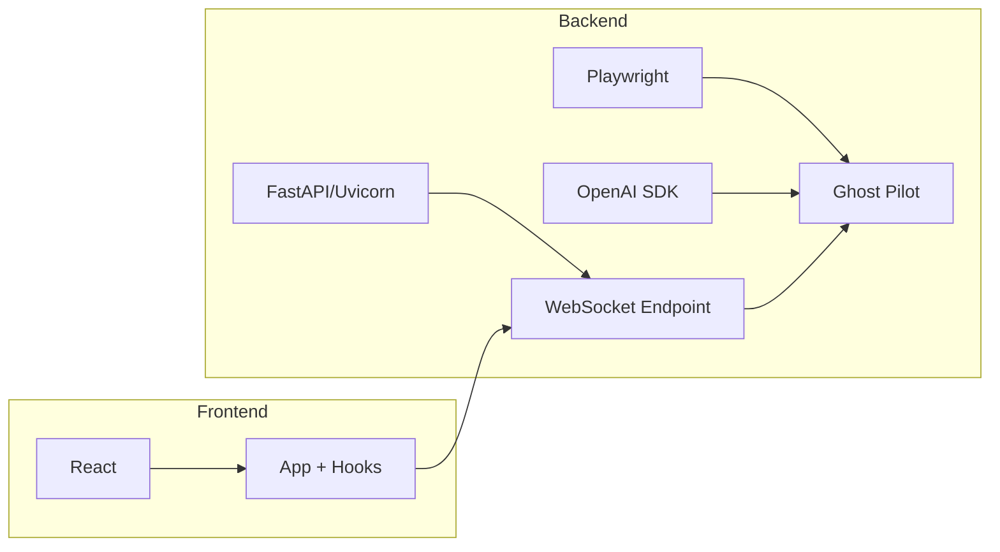

**Diagram sources**
- [requirements.txt](file://backend/requirements.txt#L1-L8)
- [package.json](file://frontend/package.json#L12-L32)
- [ghost_pilot.py](file://backend/ghost_pilot.py#L10-L16)
- [main.py](file://backend/main.py#L10-L26)

**Section sources**
- [requirements.txt](file://backend/requirements.txt#L1-L8)
- [package.json](file://frontend/package.json#L12-L32)
- [ghost_pilot.py](file://backend/ghost_pilot.py#L10-L16)
- [main.py](file://backend/main.py#L10-L26)

## Performance Considerations
- Vision Model Costs: Frequent screenshot capture and LLM calls can be expensive; leverage provider-specific free tiers and rate limits.
- Rendering Overhead: Set-of-Marks overlays are lightweight but still add DOM work; ensure viewport sizing is reasonable.
- Network Latency: WebSocket streaming is efficient; minimize unnecessary UI updates.
- Memory Management: Ghost Pilot maintains element_map and action_history; consider trimming older entries for long missions.
- Scalability: Run multiple instances behind a reverse proxy; shard by user sessions; cache provider responses where safe.

[No sources needed since this section provides general guidance]

## Troubleshooting Guide
- Captcha Detection: Visible captcha iframes and challenge text are detected; the system pauses and waits for user resolution or manual skip.
- Rate Limits: On hitting provider quotas, the engine waits according to Retry-After or internal limits; monitor daily counters.
- LLM Parsing Errors: Responses are cleaned of comments/markdown; invalid JSON triggers retries with exponential backoff.
- Browser Issues: Ensure Playwright dependencies are installed; handle headless vs. headed mode based on debugging needs.
- Frontend Connectivity: WebSocket auto-reconnects; verify backend CORS and port exposure.

**Section sources**
- [ghost_pilot.py](file://backend/ghost_pilot.py#L240-L297)
- [ghost_pilot.py](file://backend/ghost_pilot.py#L181-L231)
- [ghost_pilot.py](file://backend/ghost_pilot.py#L159-L179)
- [ghost_pilot.py](file://backend/ghost_pilot.py#L769-L800)
- [useWebSocket.ts](file://frontend/src/hooks/useWebSocket.ts#L43-L52)

## Conclusion
Ghost Pilot delivers a robust, transparent, and extensible autonomous browser navigation system. By combining precise element tagging, live screenshot analysis, and resilient execution with multi-provider LLM support, it enables reliable mission execution. The real-time UI and thoughtful error handling make it practical for both demos and production use.

[No sources needed since this section summarizes without analyzing specific files]

## Appendices

### Example Mission Execution Walkthrough
- Objective: “Go to YouTube and search for ‘piano tutorials’”
- Steps:
  1. Start mission with URL derived from objective or default.
  2. Navigate to start URL.
  3. Tag page elements; capture screenshot.
  4. LLM suggests clicking the search input (by tag_id) then typing the query.
  5. Execute click → type → submit (press Enter implicitly after typing).
  6. Stream cursor moves and status; finish when on results page.

[No sources needed since this section provides a conceptual walkthrough]

### Provider Selection and Configuration
- Environment variables control provider and model/base URL.
- Gemini and OpenRouter have stricter free-tier quotas; enable rate limiting enforcement accordingly.

**Section sources**
- [main.py](file://backend/main.py#L63-L99)
- [ghost_pilot.py](file://backend/ghost_pilot.py#L18-L105)
- [ghost_pilot.py](file://backend/ghost_pilot.py#L181-L231)