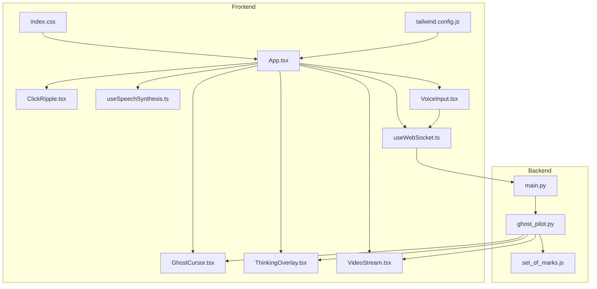
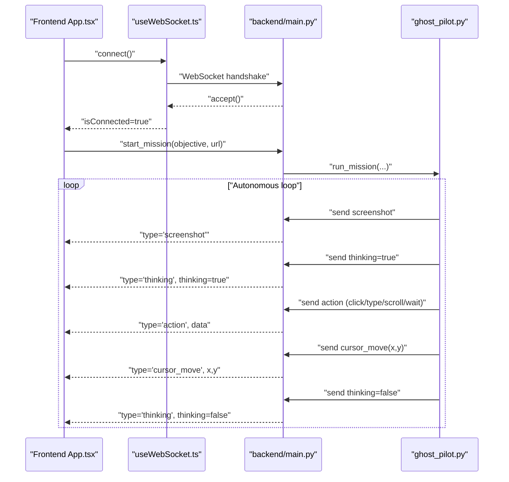
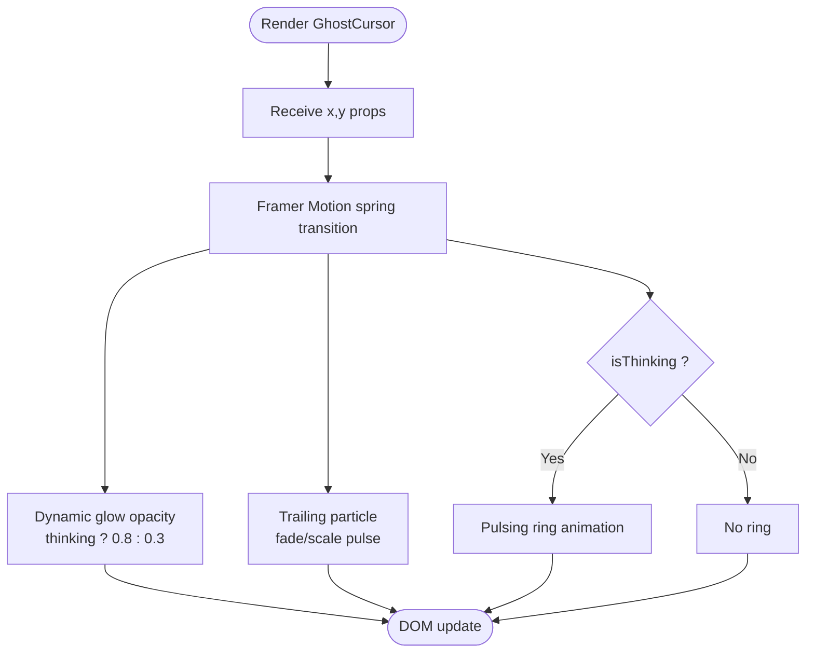
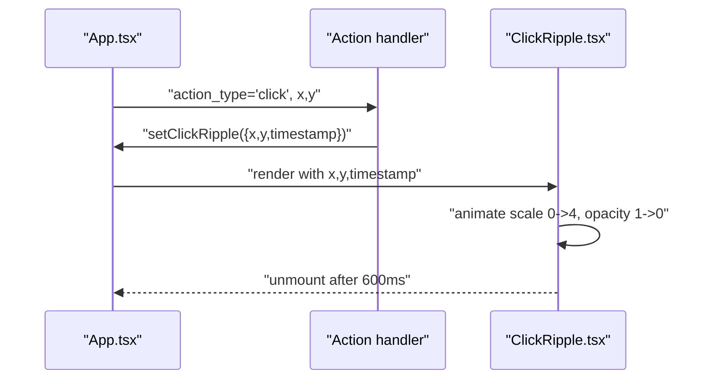
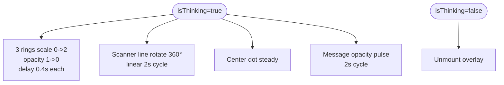
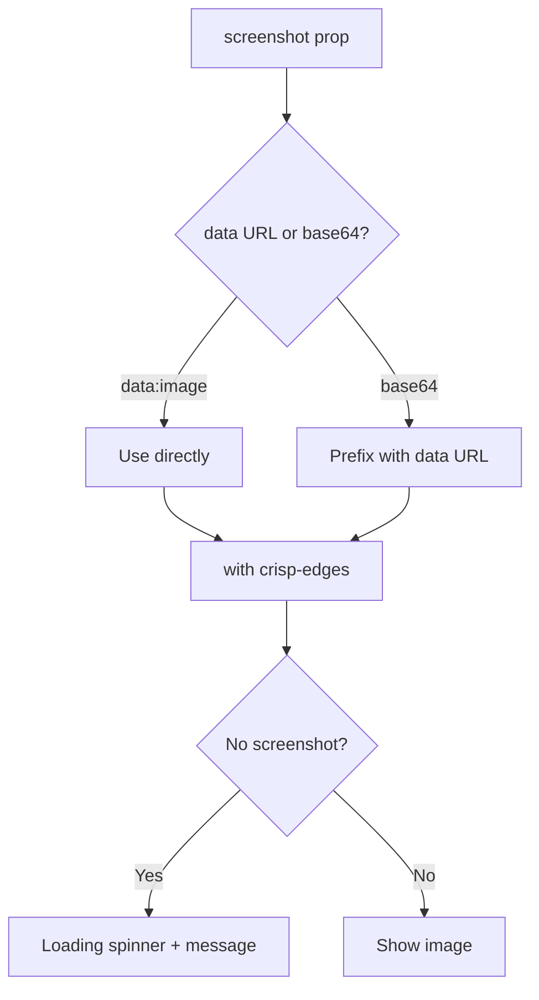
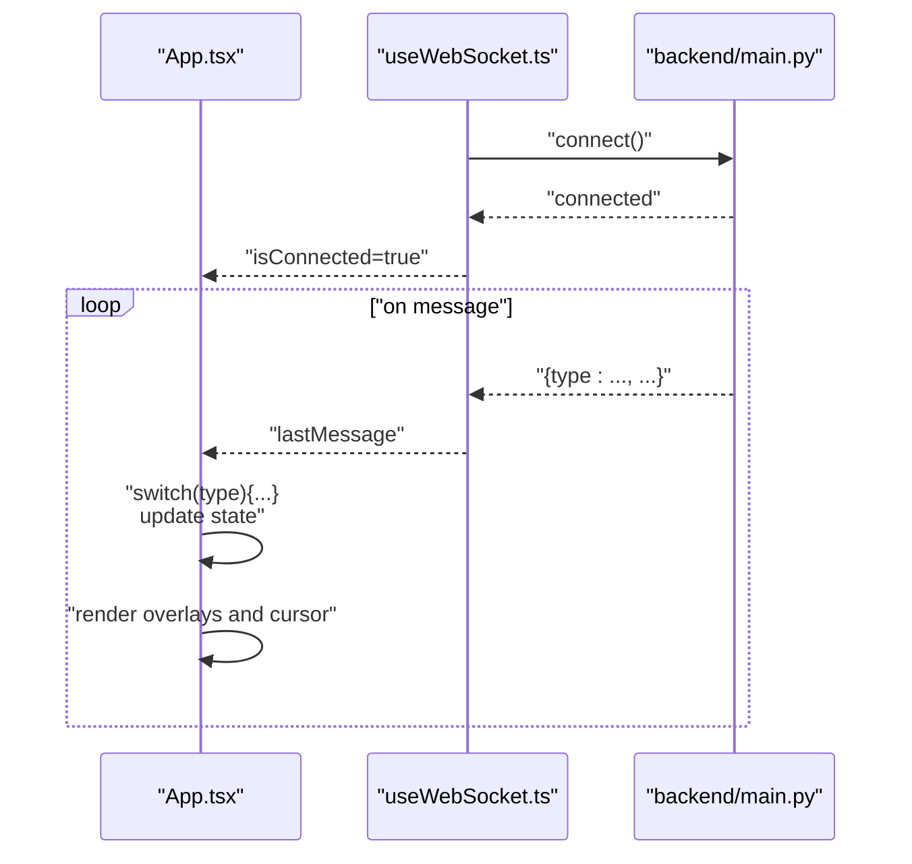
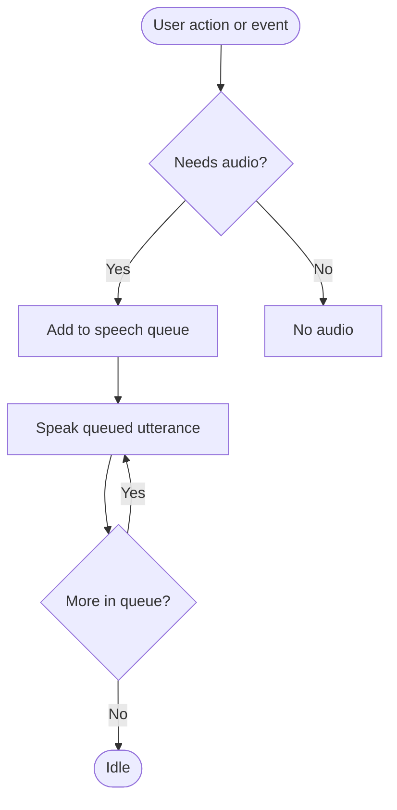
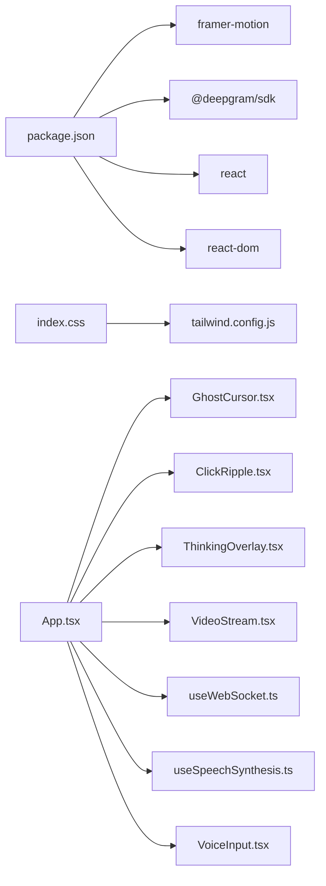

# Real-Time Visualization

<cite>
**Referenced Files in This Document**
- [App.tsx](file://frontend/src/App.tsx)
- [GhostCursor.tsx](file://frontend/src/components/GhostCursor.tsx)
- [ClickRipple.tsx](file://frontend/src/components/ClickRipple.tsx)
- [ThinkingOverlay.tsx](file://frontend/src/components/ThinkingOverlay.tsx)
- [VideoStream.tsx](file://frontend/src/components/VideoStream.tsx)
- [useWebSocket.ts](file://frontend/src/hooks/useWebSocket.ts)
- [useSpeechSynthesis.ts](file://frontend/src/hooks/useSpeechSynthesis.ts)
- [VoiceInput.tsx](file://frontend/src/components/VoiceInput.tsx)
- [index.css](file://frontend/src/styles/index.css)
- [tailwind.config.js](file://frontend/tailwind.config.js)
- [main.py](file://backend/main.py)
- [ghost_pilot.py](file://backend/ghost_pilot.py)
- [set_of_marks.js](file://backend/set_of_marks.js)
- [package.json](file://frontend/package.json)
</cite>

## Table of Contents
1. [Introduction](#introduction)
2. [Project Structure](#project-structure)
3. [Core Components](#core-components)
4. [Architecture Overview](#architecture-overview)
5. [Detailed Component Analysis](#detailed-component-analysis)
6. [Dependency Analysis](#dependency-analysis)
7. [Performance Considerations](#performance-considerations)
8. [Accessibility and Motion Sensitivity](#accessibility-and-motion-sensitivity)
9. [Troubleshooting Guide](#troubleshooting-guide)
10. [Conclusion](#conclusion)

## Introduction
This document details the real-time visualization system that renders an animated cursor, click ripple effects, thinking overlays with radar animations, and a live screenshot stream. It explains how Spring physics are applied for smooth cursor movement, how multiple visual effects are coordinated, and how the frontend consumes real-time data from the backend via WebSocket. It also covers responsive design, cross-browser compatibility, performance optimizations, accessibility considerations, and graceful degradation for reduced motion preferences.

## Project Structure
The visualization system spans the frontend React application and the backend FastAPI server:
- Frontend: React components for cursor, ripples, thinking overlay, video stream, voice input, and WebSocket integration.
- Backend: FastAPI WebSocket server that orchestrates autonomous browser automation, captures screenshots, and streams events to the frontend.

**Diagram sources**
- [App.tsx](file://frontend/src/App.tsx#L1-L360)
- [GhostCursor.tsx](file://frontend/src/components/GhostCursor.tsx#L1-L99)
- [ClickRipple.tsx](file://frontend/src/components/ClickRipple.tsx#L1-L35)
- [ThinkingOverlay.tsx](file://frontend/src/components/ThinkingOverlay.tsx#L1-L78)
- [VideoStream.tsx](file://frontend/src/components/VideoStream.tsx#L1-L43)
- [useWebSocket.ts](file://frontend/src/hooks/useWebSocket.ts#L1-L93)
- [useSpeechSynthesis.ts](file://frontend/src/hooks/useSpeechSynthesis.ts#L1-L79)
- [VoiceInput.tsx](file://frontend/src/components/VoiceInput.tsx#L1-L321)
- [index.css](file://frontend/src/styles/index.css#L1-L107)
- [tailwind.config.js](file://frontend/tailwind.config.js#L1-L39)
- [main.py](file://backend/main.py#L1-L157)
- [ghost_pilot.py](file://backend/ghost_pilot.py#L1-L802)
- [set_of_marks.js](file://backend/set_of_marks.js#L1-L229)

**Section sources**
- [App.tsx](file://frontend/src/App.tsx#L1-L360)
- [main.py](file://backend/main.py#L1-L157)

## Core Components
- Animated cursor with Spring physics for smooth movement and glow/thinking indicators.
- Click ripple effect that animates outward from click coordinates.
- Thinking overlay with radar scanning rings and rotating scanner line.
- Live screenshot streaming rendered as a responsive image with crisp edges.
- WebSocket integration for bidirectional real-time communication.
- Speech synthesis for audio feedback aligned with visual events.
- Voice input for initiating missions and commands.

**Section sources**
- [GhostCursor.tsx](file://frontend/src/components/GhostCursor.tsx#L1-L99)
- [ClickRipple.tsx](file://frontend/src/components/ClickRipple.tsx#L1-L35)
- [ThinkingOverlay.tsx](file://frontend/src/components/ThinkingOverlay.tsx#L1-L78)
- [VideoStream.tsx](file://frontend/src/components/VideoStream.tsx#L1-L43)
- [useWebSocket.ts](file://frontend/src/hooks/useWebSocket.ts#L1-L93)
- [useSpeechSynthesis.ts](file://frontend/src/hooks/useSpeechSynthesis.ts#L1-L79)
- [VoiceInput.tsx](file://frontend/src/components/VoiceInput.tsx#L1-L321)

## Architecture Overview
The system uses a WebSocket channel to stream:
- Screenshot images (base64 or data URL)
- Cursor movement coordinates
- Action events (click, type, scroll, wait)
- Thinking state transitions
- Status and error messages

The frontend composes visual layers:
- A video viewport displaying the live screenshot
- An overlay for the animated cursor and click ripples
- A modal thinking overlay with radar animations
- Audio feedback synchronized with events

**Diagram sources**
- [App.tsx](file://frontend/src/App.tsx#L14-L123)
- [useWebSocket.ts](file://frontend/src/hooks/useWebSocket.ts#L15-L91)
- [main.py](file://backend/main.py#L36-L153)
- [ghost_pilot.py](file://backend/ghost_pilot.py#L623-L761)

## Detailed Component Analysis

### Animated Cursor with Spring Physics
The cursor is implemented as a layered SVG with:
- A glowing pointer shape with a dynamic glow opacity controlled by thinking state
- A pulsing ring indicating thinking mode
- A trailing particle with fade/scale animation
- Smooth movement using Framer Motion spring transitions

Spring configuration parameters:
- type: spring
- damping: 25
- stiffness: 200
- mass: 0.5
- duration: 0.6

These values balance responsiveness with natural deceleration for fluid motion.

**Diagram sources**
- [GhostCursor.tsx](file://frontend/src/components/GhostCursor.tsx#L10-L96)

**Section sources**
- [GhostCursor.tsx](file://frontend/src/components/GhostCursor.tsx#L10-L96)

### Click Ripple Animation
On click actions, a ripple expands outward from the click coordinates:
- Initial scale 0 and opacity 1
- Scales to 4 and fades out over 0.6s with easeOut
- Automatically removed after animation completes

**Diagram sources**
- [App.tsx](file://frontend/src/App.tsx#L44-L48)
- [ClickRipple.tsx](file://frontend/src/components/ClickRipple.tsx#L10-L34)

**Section sources**
- [ClickRipple.tsx](file://frontend/src/components/ClickRipple.tsx#L10-L34)
- [App.tsx](file://frontend/src/App.tsx#L44-L48)

### Thinking Overlay with Radar Animations
The overlay displays:
- Center dot
- Three concentric rings pulsing with staggered delays
- A rotating scanner line
- A subtle message with gentle opacity pulse

**Diagram sources**
- [ThinkingOverlay.tsx](file://frontend/src/components/ThinkingOverlay.tsx#L8-L77)

**Section sources**
- [ThinkingOverlay.tsx](file://frontend/src/components/ThinkingOverlay.tsx#L8-L77)

### Live Screenshot Streaming
The video stream component:
- Accepts either a data URL or base64 image
- Renders as a responsive image with crisp-edges
- Shows a spinner and placeholder while waiting for the first frame

**Diagram sources**
- [VideoStream.tsx](file://frontend/src/components/VideoStream.tsx#L8-L42)

**Section sources**
- [VideoStream.tsx](file://frontend/src/components/VideoStream.tsx#L8-L42)

### WebSocket Integration and Event Coordination
The frontend maintains a persistent WebSocket connection and reacts to backend events:
- screenshot: update the live viewport
- cursor_move: update the animated cursor position
- action: trigger click ripple and speak typed/scroll/wait actions
- thinking: show/hide the thinking overlay
- status/error/complete: update status bar and speak updates

**Diagram sources**
- [App.tsx](file://frontend/src/App.tsx#L14-L123)
- [useWebSocket.ts](file://frontend/src/hooks/useWebSocket.ts#L15-L91)
- [main.py](file://backend/main.py#L36-L153)

**Section sources**
- [App.tsx](file://frontend/src/App.tsx#L14-L123)
- [useWebSocket.ts](file://frontend/src/hooks/useWebSocket.ts#L15-L91)
- [main.py](file://backend/main.py#L36-L153)

### Audio Feedback and Voice Input
- useSpeechSynthesis manages a queue to avoid overlapping speech and allows immediate interruption.
- VoiceInput integrates Deepgram for live transcription and falls back to manual text input.
- Audio cues are synchronized with visual events (e.g., speaking “Clicking”, “Analyzing page”).

**Diagram sources**
- [useSpeechSynthesis.ts](file://frontend/src/hooks/useSpeechSynthesis.ts#L55-L77)
- [VoiceInput.tsx](file://frontend/src/components/VoiceInput.tsx#L165-L171)
- [App.tsx](file://frontend/src/App.tsx#L47-L66)

**Section sources**
- [useSpeechSynthesis.ts](file://frontend/src/hooks/useSpeechSynthesis.ts#L1-L79)
- [VoiceInput.tsx](file://frontend/src/components/VoiceInput.tsx#L1-L321)
- [App.tsx](file://frontend/src/App.tsx#L47-L66)

## Dependency Analysis
- Frontend dependencies include React, Framer Motion for animations, and @deepgram/sdk for voice input.
- Tailwind CSS provides utility classes and theme variables for consistent visuals.
- Backend uses FastAPI for WebSocket routing and Playwright for browser automation.

**Diagram sources**
- [package.json](file://frontend/package.json#L12-L32)
- [index.css](file://frontend/src/styles/index.css#L1-L107)
- [tailwind.config.js](file://frontend/tailwind.config.js#L1-L39)
- [App.tsx](file://frontend/src/App.tsx#L1-L360)

**Section sources**
- [package.json](file://frontend/package.json#L12-L32)
- [tailwind.config.js](file://frontend/tailwind.config.js#L1-L39)

## Performance Considerations
- Spring physics: The cursor uses a tuned spring with moderate damping and stiffness to reduce overshoot and achieve smooth motion without excessive CPU usage.
- Animation composition: Multiple concurrent animations are orchestrated with staggered delays and finite repeats to minimize cumulative overhead.
- Image rendering: The video stream uses crisp-edges to maintain sharpness without resampling artifacts.
- WebSocket batching: Events are processed incrementally; state updates are minimal and targeted to affected components.
- Cleanup: Timers and connections are cleared on component unmount to prevent memory leaks.

[No sources needed since this section provides general guidance]

## Accessibility and Motion Sensitivity
- Reduced motion: The thinking overlay and cursor animations rely on Framer Motion’s built-in reduced-motion support. Users with motion sensitivity can enable OS-level reduced motion settings to minimize motion.
- Audio feedback: Speech synthesis is optional and can be interrupted. Consider adding a user preference to disable audio cues.
- Keyboard and screen reader: The cursor overlay is visually distinct and does not interfere with keyboard focus. Ensure focus indicators remain visible during animations.
- Contrast and color: The theme uses high-contrast colors for primary and secondary accents, with translucent backgrounds for readability.

[No sources needed since this section provides general guidance]

## Troubleshooting Guide
- WebSocket disconnections: The frontend auto-reconnects with a 3-second interval. Verify backend connectivity and firewall rules.
- Captcha handling: If a captcha is detected, the system waits for user resolution. Use the manual override button to skip waiting if appropriate.
- Voice input: Ensure the Deepgram API key is configured. Without it, voice input is disabled and the UI prompts accordingly.
- Animation stutter: Reduce the number of simultaneous animations or increase the spring damping/stiffness values if needed.

**Section sources**
- [useWebSocket.ts](file://frontend/src/hooks/useWebSocket.ts#L47-L52)
- [main.py](file://backend/main.py#L138-L153)
- [VoiceInput.tsx](file://frontend/src/components/VoiceInput.tsx#L24-L277)

## Conclusion
The real-time visualization system combines Spring-based cursor movement, ripple feedback, radar-style thinking overlays, and live screenshot streaming to provide an immersive, responsive interface. Through careful animation choreography, efficient WebSocket coordination, and thoughtful accessibility defaults, it delivers a polished user experience across modern browsers while remaining extensible for additional effects and integrations.