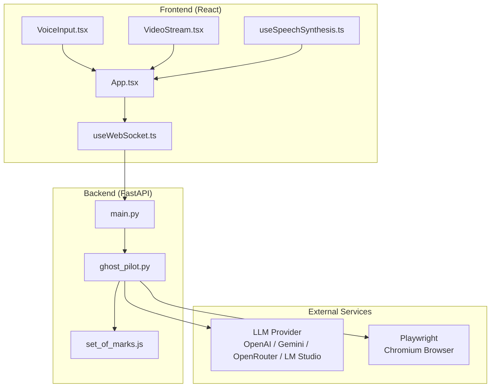
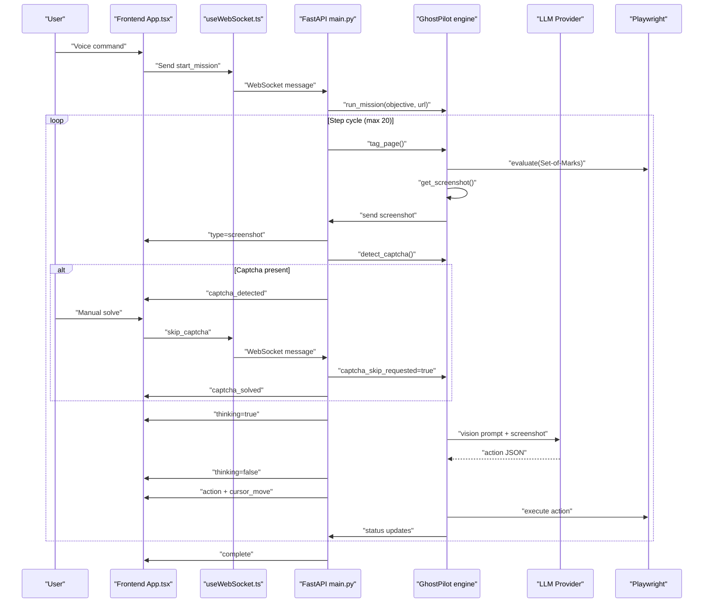
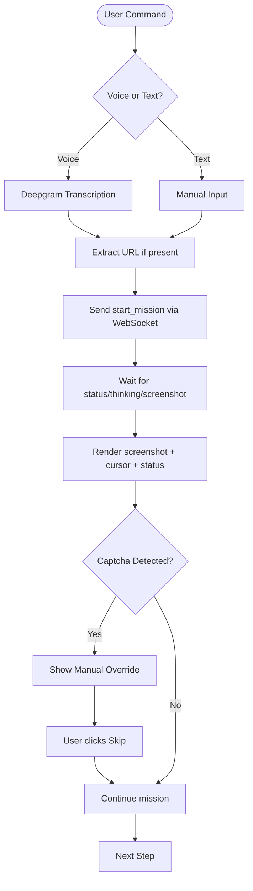
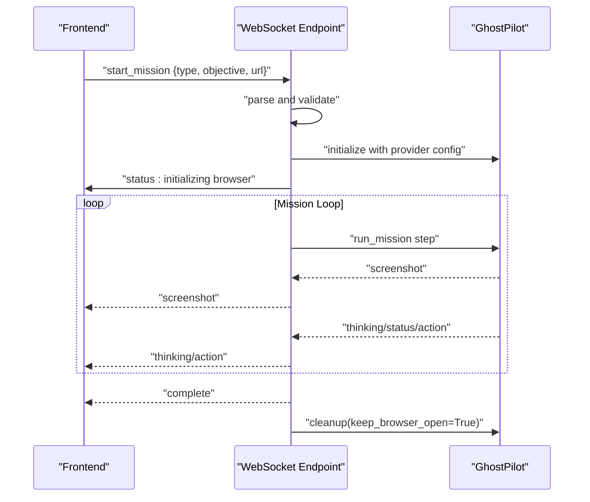
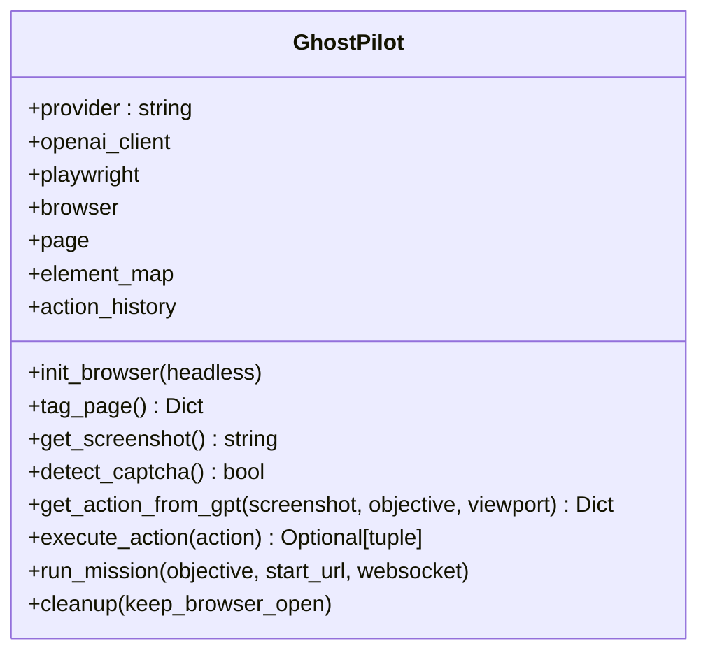
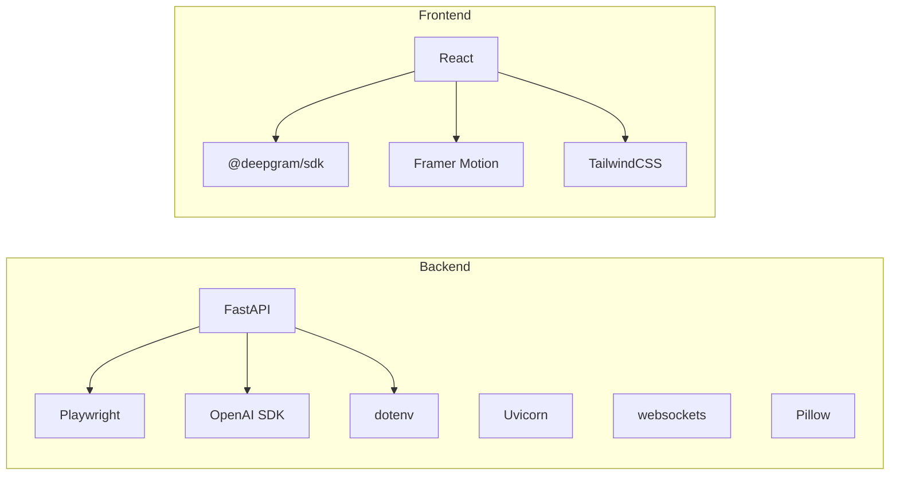

# System Overview

<cite>
**Referenced Files in This Document**
- [main.py](file://backend/main.py)
- [ghost_pilot.py](file://backend/ghost_pilot.py)
- [set_of_marks.js](file://backend/set_of_marks.js)
- [App.tsx](file://frontend/src/App.tsx)
- [useWebSocket.ts](file://frontend/src/hooks/useWebSocket.ts)
- [VoiceInput.tsx](file://frontend/src/components/VoiceInput.tsx)
- [VideoStream.tsx](file://frontend/src/components/VideoStream.tsx)
- [useSpeechSynthesis.ts](file://frontend/src/hooks/useSpeechSynthesis.ts)
- [requirements.txt](file://backend/requirements.txt)
- [README.md](file://frontend/README.md)
- [primary_agent README.md](file://primary_agent/README.md)
- [secondary_agent README.md](file://secondary_agent/README.md)
</cite>

## Table of Contents
1. [Introduction](#introduction)
2. [Project Structure](#project-structure)
3. [Core Components](#core-components)
4. [Architecture Overview](#architecture-overview)
5. [Detailed Component Analysis](#detailed-component-analysis)
6. [Dependency Analysis](#dependency-analysis)
7. [Performance Considerations](#performance-considerations)
8. [Troubleshooting Guide](#troubleshooting-guide)
9. [Conclusion](#conclusion)

## Introduction
Ghost Pilot is a three-tier autonomous browser automation system:
- Frontend React application that captures user voice input, streams live browser screenshots, and renders AI-driven cursor movements.
- Backend FastAPI WebSocket server that orchestrates the autonomous mission lifecycle and relays real-time events to the frontend.
- AI-powered autonomous engine built on GPT-4o Vision and Playwright that performs end-to-end browser automation.

The system is designed for real-time interaction: user voice commands initiate a mission, the backend captures screenshots, sends them to an LLM for decision-making, executes actions in the browser, and streams visual feedback back to the frontend via WebSocket.

## Project Structure
The repository is organized into two primary applications plus supporting modules:
- backend/: FastAPI server, autonomous engine, and shared tagging script
- frontend/: React application with WebSocket client, voice input, and UI components
- primary_agent/ and secondary_agent/: companion microservices for intent understanding and action execution (complementary to the main Ghost Pilot pipeline)

**Diagram sources**
- [main.py](file://backend/main.py#L36-L157)
- [ghost_pilot.py](file://backend/ghost_pilot.py#L18-L800)
- [set_of_marks.js](file://backend/set_of_marks.js#L1-L229)
- [App.tsx](file://frontend/src/App.tsx#L1-L360)
- [useWebSocket.ts](file://frontend/src/hooks/useWebSocket.ts#L1-L93)
- [VoiceInput.tsx](file://frontend/src/components/VoiceInput.tsx#L1-L321)
- [VideoStream.tsx](file://frontend/src/components/VideoStream.tsx#L1-L43)
- [useSpeechSynthesis.ts](file://frontend/src/hooks/useSpeechSynthesis.ts#L1-L79)

**Section sources**
- [README.md](file://frontend/README.md#L101-L123)

## Core Components
- Frontend React Application
  - Orchestrates user input (voice or text), manages WebSocket connectivity, displays live screenshots, cursor overlays, and status messages.
  - Provides voice transcription via Deepgram and speech synthesis feedback.
- Backend FastAPI WebSocket Server
  - Accepts WebSocket connections, validates mission commands, initializes the autonomous engine, and streams real-time updates to the frontend.
- Autonomous Engine (GhostPilot)
  - Initializes a browser, injects Set-of-Marks tags, captures screenshots, queries an LLM for actions, executes Playwright actions, and handles captcha scenarios.
- Set-of-Marks Script
  - Injects yellow-numbered overlays onto interactive elements for precise targeting.
- External Integrations
  - LLM providers (OpenAI, Gemini, OpenRouter, LM Studio) and Playwright for browser automation.

**Section sources**
- [App.tsx](file://frontend/src/App.tsx#L1-L360)
- [useWebSocket.ts](file://frontend/src/hooks/useWebSocket.ts#L1-L93)
- [VoiceInput.tsx](file://frontend/src/components/VoiceInput.tsx#L1-L321)
- [VideoStream.tsx](file://frontend/src/components/VideoStream.tsx#L1-L43)
- [useSpeechSynthesis.ts](file://frontend/src/hooks/useSpeechSynthesis.ts#L1-L79)
- [main.py](file://backend/main.py#L36-L157)
- [ghost_pilot.py](file://backend/ghost_pilot.py#L18-L800)
- [set_of_marks.js](file://backend/set_of_marks.js#L1-L229)

## Architecture Overview
The system follows a real-time, event-driven architecture:
- User voice input is captured by the frontend and sent to the backend via WebSocket.
- The backend starts a mission, initializes the autonomous engine, and begins a loop:
  - Tag interactive elements on the page
  - Capture a screenshot
  - Stream the screenshot to the frontend
  - Detect captchas and pause for manual resolution if needed
  - Query the LLM for the next action
  - Execute the action in the browser
  - Stream cursor movement and action events to the frontend
- The loop repeats until completion or a maximum step limit.

**Diagram sources**
- [main.py](file://backend/main.py#L36-L157)
- [ghost_pilot.py](file://backend/ghost_pilot.py#L623-L768)
- [App.tsx](file://frontend/src/App.tsx#L146-L175)
- [useWebSocket.ts](file://frontend/src/hooks/useWebSocket.ts#L60-L66)

## Detailed Component Analysis

### Frontend: React Application
- Responsibilities
  - Manage WebSocket connection and message routing
  - Render live screenshots and animated cursor
  - Provide voice input (Deepgram) and speech synthesis feedback
  - Display status, thinking indicators, and captcha override controls
- Key Behaviors
  - On receiving a screenshot, decode and display it
  - On receiving cursor_move, animate the ghost cursor
  - On receiving action events, trigger visual feedback (ripple, speech)
  - On receiving thinking=true/false, show radar overlay
  - On captcha_detected, show manual override button; on captcha_solved, hide it
- Voice Input
  - Uses Deepgram SDK for live transcription
  - Supports manual text input as fallback
- Speech Synthesis
  - Queues and speaks status updates and action feedback

**Diagram sources**
- [App.tsx](file://frontend/src/App.tsx#L146-L175)
- [VoiceInput.tsx](file://frontend/src/components/VoiceInput.tsx#L41-L171)
- [useSpeechSynthesis.ts](file://frontend/src/hooks/useSpeechSynthesis.ts#L55-L77)
- [useWebSocket.ts](file://frontend/src/hooks/useWebSocket.ts#L60-L66)

**Section sources**
- [App.tsx](file://frontend/src/App.tsx#L1-L360)
- [useWebSocket.ts](file://frontend/src/hooks/useWebSocket.ts#L1-L93)
- [VoiceInput.tsx](file://frontend/src/components/VoiceInput.tsx#L1-L321)
- [VideoStream.tsx](file://frontend/src/components/VideoStream.tsx#L1-L43)
- [useSpeechSynthesis.ts](file://frontend/src/hooks/useSpeechSynthesis.ts#L1-L79)

### Backend: FastAPI WebSocket Server
- Responsibilities
  - Accept WebSocket connections and validate messages
  - Initialize the autonomous engine with selected LLM provider
  - Start missions, stream status, and handle errors
  - Support manual captcha override
- Message Types
  - start_mission: initiates mission with objective and URL
  - skip_captcha: signals user-requested captcha bypass
  - status/thinking/screenshot/action/cursor_move/complete/error: streaming events to frontend

**Diagram sources**
- [main.py](file://backend/main.py#L36-L157)
- [ghost_pilot.py](file://backend/ghost_pilot.py#L623-L768)

**Section sources**
- [main.py](file://backend/main.py#L36-L157)

### Autonomous Engine: GhostPilot
- Responsibilities
  - Initialize Playwright browser and page
  - Inject Set-of-Marks script to tag interactive elements
  - Capture screenshots and send them to the LLM
  - Parse LLM decisions and execute Playwright actions
  - Handle rate limits, retries, and captcha detection
  - Stream intermediate events to the backend for frontend display
- Providers Supported
  - OpenAI, Gemini, OpenRouter, LM Studio, and custom endpoints
- Safety and Loop Prevention
  - Tracks recent actions to avoid repeated clicks/types
  - Limits steps per mission
  - Respects provider rate limits and Retry-After headers

**Diagram sources**
- [ghost_pilot.py](file://backend/ghost_pilot.py#L18-L800)

**Section sources**
- [ghost_pilot.py](file://backend/ghost_pilot.py#L18-L800)
- [set_of_marks.js](file://backend/set_of_marks.js#L1-L229)

### Set-of-Marks Script
- Purpose
  - Injects yellow-numbered overlays on interactive elements
  - Returns a serializable map of tag IDs to element metadata
- Behavior
  - Filters visible elements, computes centers, and builds a map for targeting

**Section sources**
- [set_of_marks.js](file://backend/set_of_marks.js#L1-L229)

### Companion Agents (Primary/Secondary)
- Primary Agent
  - Intent understanding and instruction generation
  - Health check and process endpoints
- Secondary Agent
  - Action execution using browser automation and database
  - Context retrieval and instruction execution endpoints

**Section sources**
- [primary_agent README.md](file://primary_agent/README.md#L1-L42)
- [secondary_agent README.md](file://secondary_agent/README.md#L1-L53)

## Dependency Analysis
- Backend Dependencies
  - FastAPI, Uvicorn, Playwright, OpenAI SDK, python-dotenv, websockets, Pillow
- Frontend Dependencies
  - React, Framer Motion, @deepgram/sdk, TailwindCSS, TypeScript

**Diagram sources**
- [requirements.txt](file://backend/requirements.txt#L1-L8)
- [package.json](file://frontend/package.json#L12-L32)

**Section sources**
- [requirements.txt](file://backend/requirements.txt#L1-L8)
- [README.md](file://frontend/README.md#L142-L156)

## Performance Considerations
- Real-time responsiveness
  - Minimize screenshot sizes and avoid unnecessary captures
  - Batch and throttle status updates to reduce overhead
- LLM rate limiting
  - Respect provider limits; implement exponential/backoff strategies
  - Use Retry-After headers when available
- Browser automation
  - Prefer element targeting via tag IDs over complex selectors
  - Avoid excessive waits; use network idle states where appropriate
- Frontend rendering
  - Use memoization for image URLs and animations
  - Debounce voice transcription finalization

## Troubleshooting Guide
- WebSocket Disconnected
  - Ensure backend is running and reachable on the configured port
  - Verify CORS configuration allows frontend origin
- Playwright Chromium Not Found
  - Install Chromium via Playwright installer
- Invalid API Key or Endpoint
  - Confirm provider credentials and base URL in environment variables
- Captcha Blocks
  - Use the manual override button to skip waiting when resolved
- Voice Input Issues
  - Ensure microphone permissions and Deepgram API key are configured

**Section sources**
- [README.md](file://frontend/README.md#L167-L183)
- [useWebSocket.ts](file://frontend/src/hooks/useWebSocket.ts#L15-L93)
- [ghost_pilot.py](file://backend/ghost_pilot.py#L181-L231)

## Conclusion
Ghost Pilot demonstrates a cohesive, real-time autonomous browser automation system. The React frontend provides an intuitive voice-driven interface, the FastAPI backend coordinates the mission lifecycle, and the GhostPilot engine combines LLM decision-making with precise browser automation. The WebSocket-based streaming ensures a responsive, transparent user experience, while robust error handling and rate-limiting keep operations reliable.