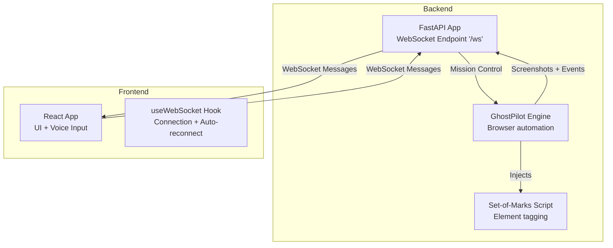
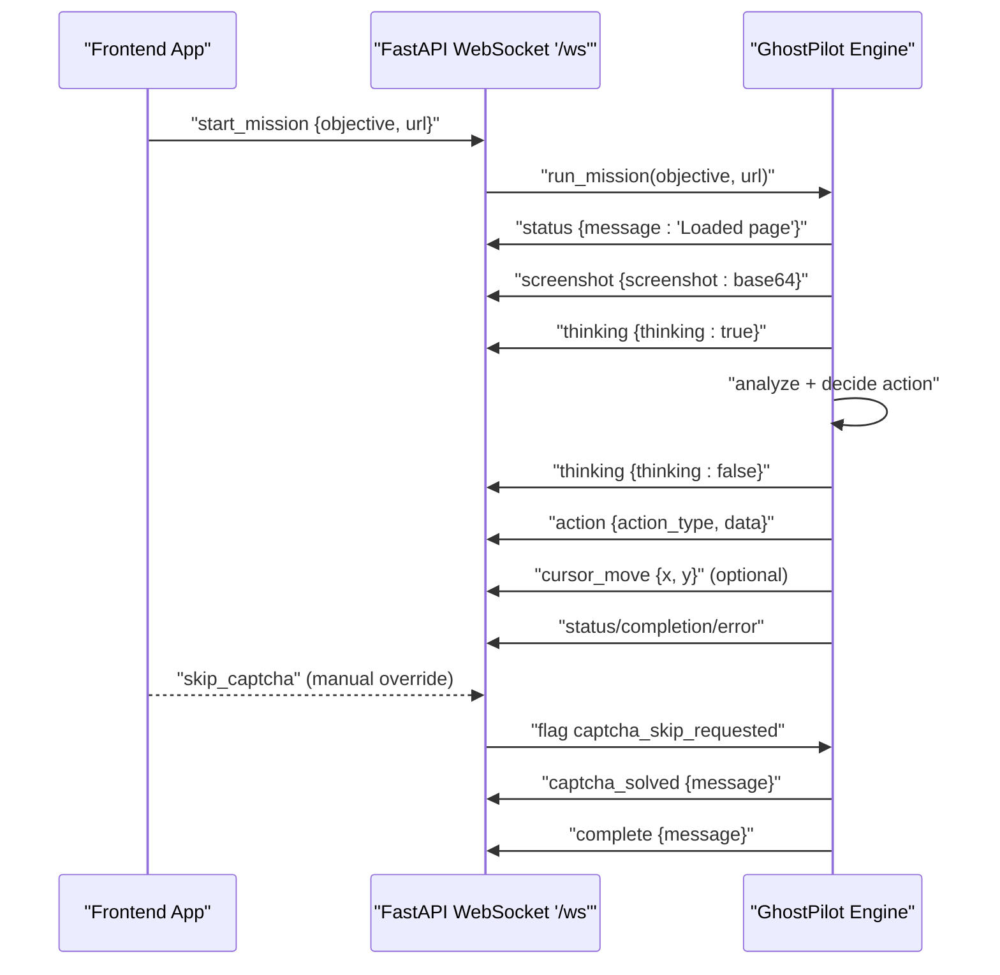
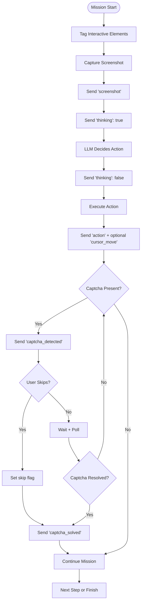
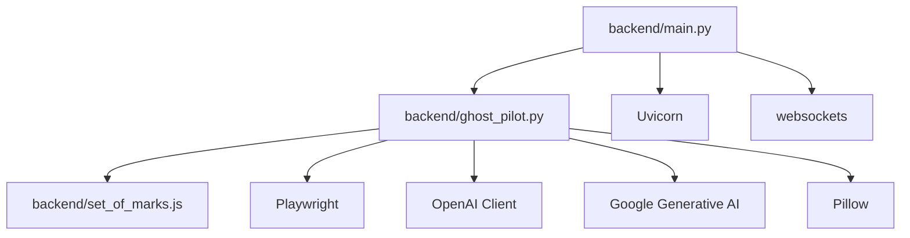

# WebSocket Communication

<cite>
**Referenced Files in This Document**
- [backend/main.py](file://backend/main.py)
- [backend/ghost_pilot.py](file://backend/ghost_pilot.py)
- [backend/set_of_marks.js](file://backend/set_of_marks.js)
- [frontend/src/hooks/useWebSocket.ts](file://frontend/src/hooks/useWebSocket.ts)
- [frontend/src/App.tsx](file://frontend/src/App.tsx)
- [backend/requirements.txt](file://backend/requirements.txt)
</cite>

## Table of Contents
1. [Introduction](#introduction)
2. [Project Structure](#project-structure)
3. [Core Components](#core-components)
4. [Architecture Overview](#architecture-overview)
5. [Detailed Component Analysis](#detailed-component-analysis)
6. [Dependency Analysis](#dependency-analysis)
7. [Performance Considerations](#performance-considerations)
8. [Troubleshooting Guide](#troubleshooting-guide)
9. [Conclusion](#conclusion)

## Introduction
This document describes the WebSocket communication system used by the Ghost Pilot real-time browser automation platform. It focuses on the FastAPI WebSocket endpoint (/ws), connection lifecycle, message protocol, bidirectional communication between frontend and backend, and the end-to-end mission flow. It also documents message types, payload structures, auto-reconnection logic, error handling, security considerations, and performance optimization strategies.

## Project Structure
The WebSocket system spans two layers:
- Backend: FastAPI application exposing a WebSocket endpoint and orchestrating autonomous browser missions via GhostPilot.
- Frontend: React application that connects to the backend, renders live screenshots, and controls mission execution.

**Diagram sources**
- [backend/main.py](file://backend/main.py#L36-L153)
- [backend/ghost_pilot.py](file://backend/ghost_pilot.py#L18-L105)
- [backend/set_of_marks.js](file://backend/set_of_marks.js#L8-L228)
- [frontend/src/App.tsx](file://frontend/src/App.tsx#L11-L123)
- [frontend/src/hooks/useWebSocket.ts](file://frontend/src/hooks/useWebSocket.ts#L15-L92)

**Section sources**
- [backend/main.py](file://backend/main.py#L1-L157)
- [frontend/src/App.tsx](file://frontend/src/App.tsx#L1-L360)
- [frontend/src/hooks/useWebSocket.ts](file://frontend/src/hooks/useWebSocket.ts#L1-L93)

## Core Components
- FastAPI WebSocket endpoint: Accepts connections, parses inbound messages, initializes GhostPilot, and streams events back to the client.
- GhostPilot engine: Manages browser lifecycle, page tagging, screenshot capture, LLM-driven action selection, and real-time event emission.
- Frontend WebSocket hook: Establishes and maintains the WebSocket connection, auto-reconnects on close, and exposes send/receive utilities.
- Frontend React app: Renders live video stream, cursor overlay, thinking indicators, and status messages; sends mission start and captcha skip commands.

Key message types exchanged:
- start_mission: Initiates a mission with objective and optional starting URL.
- status: Progress/status updates during mission steps.
- thinking: Indicates when the agent is analyzing the page.
- screenshot: Base64-encoded PNG screenshot of the current page.
- action: Describes the next autonomous action (click, type, scroll, wait, finish).
- cursor_move: Coordinates for mouse movement overlay.
- captcha_detected: Captcha presence detected; user must solve manually.
- captcha_solved: Captcha resolved; mission continues.
- complete: Mission finished successfully.
- error: Error conditions surfaced to the UI.

**Section sources**
- [backend/main.py](file://backend/main.py#L36-L153)
- [backend/ghost_pilot.py](file://backend/ghost_pilot.py#L623-L768)
- [frontend/src/hooks/useWebSocket.ts](file://frontend/src/hooks/useWebSocket.ts#L3-L13)
- [frontend/src/App.tsx](file://frontend/src/App.tsx#L30-L122)

## Architecture Overview
The WebSocket endpoint acts as the central hub for bidirectional real-time communication. The frontend sends commands (e.g., start_mission, skip_captcha), and the backend responds with status, screenshots, actions, and completion/error notifications.

**Diagram sources**
- [backend/main.py](file://backend/main.py#L48-L137)
- [backend/ghost_pilot.py](file://backend/ghost_pilot.py#L623-L768)
- [frontend/src/App.tsx](file://frontend/src/App.tsx#L161-L174)

## Detailed Component Analysis

### FastAPI WebSocket Endpoint (/ws)
Responsibilities:
- Accept WebSocket connections.
- Parse inbound JSON messages.
- Route commands to GhostPilot (start_mission, skip_captcha).
- Stream outbound events (status, thinking, screenshot, action, cursor_move, captcha_detected/solved, complete, error).
- Handle disconnections and cleanup.

Message handling highlights:
- start_mission: Initializes GhostPilot with provider configuration and starts the mission loop.
- skip_captcha: Sets a flag to bypass captcha wait early.
- Error propagation: Sends error messages back to the client on exceptions.

Connection lifecycle:
- On connect: prints a connection message.
- On disconnect: prints a disconnect message and ensures browser remains open for manual interaction.
- On error: attempts to notify the client of the error condition.

Security considerations:
- CORS allows all origins by default; in production, restrict origins to your frontend domain.
- No authentication or rate-limiting at the WebSocket level; consider adding token-based auth and throttling.

Auto-reconnection:
- Managed by the frontend hook; backend does not implement reconnection logic.

**Section sources**
- [backend/main.py](file://backend/main.py#L36-L153)

### GhostPilot Engine
Responsibilities:
- Initialize Playwright browser and page.
- Inject Set-of-Marks script to tag interactive elements and maintain a tag map.
- Capture screenshots and send them to the frontend.
- Query LLM (via provider abstraction) to choose next action.
- Execute actions (click, type, scroll, wait) and emit corresponding events.
- Detect captchas and coordinate manual resolution via skip_captcha.
- Enforce rate limits for free-tier providers and handle retries.

Provider configuration:
- Supports LM Studio, OpenAI, Gemini, OpenRouter, and custom endpoints.
- Uses environment variables for credentials and base URLs.

Real-time events emitted:
- status:阶段性状态更新。
- thinking:分析开始/结束。
- screenshot:当前页面截图（base64）。
- action:包含动作类型、目标元素或坐标、文本等。
- cursor_move:鼠标移动坐标。
- captcha_detected/captcha_solved:验证码检测与解决通知。
- complete/error:任务完成或错误。

Browser lifecycle:
- Keeps browser open by default after mission or disconnect to allow manual inspection.

**Section sources**
- [backend/ghost_pilot.py](file://backend/ghost_pilot.py#L18-L105)
- [backend/ghost_pilot.py](file://backend/ghost_pilot.py#L140-L157)
- [backend/ghost_pilot.py](file://backend/ghost_pilot.py#L232-L238)
- [backend/ghost_pilot.py](file://backend/ghost_pilot.py#L299-L562)
- [backend/ghost_pilot.py](file://backend/ghost_pilot.py#L623-L768)
- [backend/ghost_pilot.py](file://backend/ghost_pilot.py#L769-L800)
- [backend/set_of_marks.js](file://backend/set_of_marks.js#L8-L228)

### Frontend WebSocket Hook (useWebSocket)
Responsibilities:
- Establish WebSocket connection to the configured URL.
- Parse inbound messages and expose the latest message to consumers.
- Auto-reconnect after a short delay on close.
- Provide sendMessage utility and disconnect helpers.

Reconnection behavior:
- Schedules a reconnect after 3 seconds if the socket closes.
- Clears pending timeouts on disconnect to prevent leaks.

Message types consumed:
- screenshot, cursor_move, action, thinking, status, captcha_detected, captcha_solved, complete, error.

**Section sources**
- [frontend/src/hooks/useWebSocket.ts](file://frontend/src/hooks/useWebSocket.ts#L15-L92)

### Frontend App Integration
Responsibilities:
- Subscribe to WebSocket messages and update UI state (screenshot, cursor position, thinking indicator, status).
- Send start_mission with voice-derived objective and inferred URL.
- Send skip_captcha when the user triggers the manual override.
- Announce status and actions via speech synthesis.

**Section sources**
- [frontend/src/App.tsx](file://frontend/src/App.tsx#L11-L123)
- [frontend/src/App.tsx](file://frontend/src/App.tsx#L146-L174)

### Message Protocol and Payload Specifications
Message envelope:
- type: String discriminator for the message category.
- Additional fields depend on type.

Message categories and payloads:
- start_mission
  - Fields: type, objective (string), url (string, optional)
  - Example path: [frontend/src/App.tsx](file://frontend/src/App.tsx#L161-L165)

- status
  - Fields: type, message (string)
  - Example path: [backend/ghost_pilot.py](file://backend/ghost_pilot.py#L634-L634)

- thinking
  - Fields: type, thinking (boolean)
  - Example path: [backend/ghost_pilot.py](file://backend/ghost_pilot.py#L708-L716)

- screenshot
  - Fields: type, screenshot (base64 PNG)
  - Example path: [backend/ghost_pilot.py](file://backend/ghost_pilot.py#L654-L657)

- action
  - Fields: type, action_type (string), data (object), x/y (optional)
  - Example path: [backend/ghost_pilot.py](file://backend/ghost_pilot.py#L727-L743)

- cursor_move
  - Fields: type, x (number), y (number)
  - Example path: [backend/ghost_pilot.py](file://backend/ghost_pilot.py#L737-L741)

- captcha_detected
  - Fields: type, message (string)
  - Example path: [backend/ghost_pilot.py](file://backend/ghost_pilot.py#L663-L666)

- captcha_solved
  - Fields: type, message (string)
  - Example path: [backend/ghost_pilot.py](file://backend/ghost_pilot.py#L679-L682)

- complete
  - Fields: type, message (string)
  - Example path: [backend/ghost_pilot.py](file://backend/ghost_pilot.py#L110-L113)

- error
  - Fields: type, error (string)
  - Example path: [backend/ghost_pilot.py](file://backend/ghost_pilot.py#L750-L753)

- skip_captcha
  - Fields: type
  - Example path: [frontend/src/App.tsx](file://frontend/src/App.tsx#L169-L172)

Bidirectional flow:
- Frontend sends start_mission and skip_captcha.
- Backend emits status, thinking, screenshot, action, cursor_move, captcha_detected/solved, complete, error.

**Section sources**
- [backend/ghost_pilot.py](file://backend/ghost_pilot.py#L623-L768)
- [backend/main.py](file://backend/main.py#L48-L137)
- [frontend/src/App.tsx](file://frontend/src/App.tsx#L30-L122)

### Real-Time Data Flow Patterns
- Stepwise mission loop:
  - Tag page → Take screenshot → Send screenshot → Detect captcha → Think → Decide action → Execute → Emit action + optional cursor_move → Wait → Repeat.
- Captcha handling:
  - Detection triggers captcha_detected; frontend shows manual override; user can send skip_captcha; backend honors the flag and resumes.

**Diagram sources**
- [backend/ghost_pilot.py](file://backend/ghost_pilot.py#L639-L706)

**Section sources**
- [backend/ghost_pilot.py](file://backend/ghost_pilot.py#L623-L768)

## Dependency Analysis
External libraries and integrations:
- FastAPI and Uvicorn for the WebSocket server.
- Playwright for browser automation and screenshot capture.
- OpenAI client for LLM calls; Gemini client for Google’s API.
- websockets for low-level WebSocket support.
- Pillow for image handling.

**Diagram sources**
- [backend/requirements.txt](file://backend/requirements.txt#L1-L8)
- [backend/main.py](file://backend/main.py#L1-L157)
- [backend/ghost_pilot.py](file://backend/ghost_pilot.py#L1-L105)

**Section sources**
- [backend/requirements.txt](file://backend/requirements.txt#L1-L8)

## Performance Considerations
- Image size and bandwidth:
  - Screenshots are base64 PNGs; consider compressing or streaming at lower resolution if bandwidth is constrained.
- LLM rate limits:
  - Free-tier providers impose RPM and daily quotas; the engine enforces delays and retries; monitor and adjust provider/model choices accordingly.
- Browser overhead:
  - Keep browser open for manual inspection; close gracefully when no longer needed to free resources.
- Frontend rendering:
  - Debounce or throttle screenshot rendering to reduce UI churn.
- Network resilience:
  - Frontend auto-reconnect reduces downtime; ensure backend stays stable and consider health checks.

[No sources needed since this section provides general guidance]

## Troubleshooting Guide
Common issues and resolutions:
- Connection fails or drops:
  - Verify backend is running and listening on the expected port.
  - Confirm CORS settings in production (allowlist origins).
  - Check firewall/NAT/proxy configurations.
  - Frontend auto-reconnect will attempt to restore connection automatically.
  - Section sources
    - [frontend/src/hooks/useWebSocket.ts](file://frontend/src/hooks/useWebSocket.ts#L43-L52)
    - [backend/main.py](file://backend/main.py#L19-L26)

- No screenshots or events received:
  - Ensure the mission started successfully; confirm the backend sent the initial status and screenshot.
  - Check that GhostPilot initialized the browser and tagged elements.
  - Section sources
    - [backend/ghost_pilot.py](file://backend/ghost_pilot.py#L629-L657)

- Captcha stalls the mission:
  - The backend waits for captcha resolution; the frontend displays a manual override button.
  - Trigger skip_captcha to bypass waiting; the backend will resume immediately.
  - Section sources
    - [backend/ghost_pilot.py](file://backend/ghost_pilot.py#L669-L705)
    - [frontend/src/App.tsx](file://frontend/src/App.tsx#L168-L174)

- Errors surfaced to UI:
  - The backend sends error messages; inspect the message content and backend logs for details.
  - Section sources
    - [backend/ghost_pilot.py](file://backend/ghost_pilot.py#L748-L753)
    - [backend/main.py](file://backend/main.py#L142-L148)

- LLM rate limits or quota exceeded:
  - Free-tier providers throttle requests; the engine applies delays and retries.
  - Consider switching to a paid provider or adjusting model/token budgets.
  - Section sources
    - [backend/ghost_pilot.py](file://backend/ghost_pilot.py#L181-L230)
    - [backend/ghost_pilot.py](file://backend/ghost_pilot.py#L366-L432)
    - [backend/ghost_pilot.py](file://backend/ghost_pilot.py#L434-L562)

- Security hardening:
  - Restrict CORS origins to your frontend domain.
  - Add authentication (e.g., token-based) and consider rate-limiting at the WebSocket layer.
  - Section sources
    - [backend/main.py](file://backend/main.py#L19-L26)

## Conclusion
The WebSocket communication system enables a responsive, real-time collaboration between the frontend and backend. The FastAPI endpoint (/ws) orchestrates GhostPilot missions, emitting structured events that drive the UI and automate browser actions. The frontend provides robust auto-reconnection and a clear UX for mission control, including manual captcha overrides. By understanding the message protocol, lifecycle, and error handling, teams can operate, extend, and troubleshoot the system effectively.