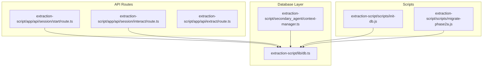
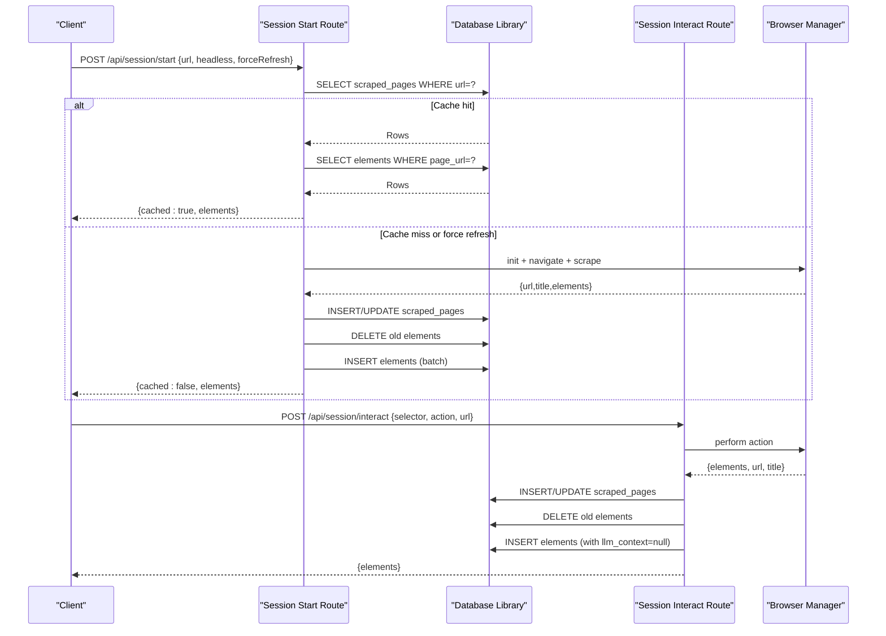
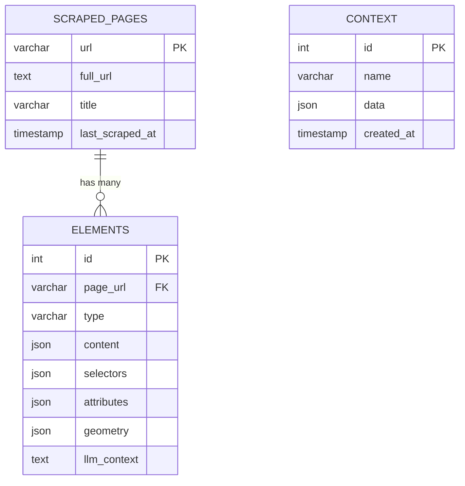
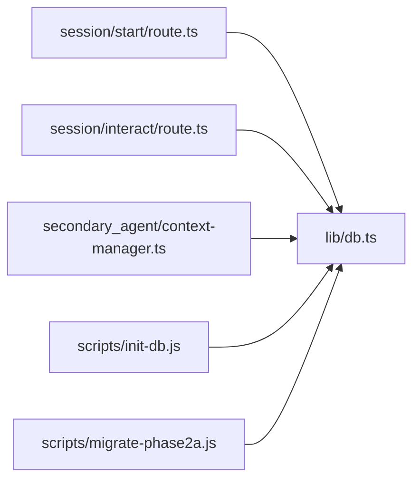

# Database Schema

<cite>
**Referenced Files in This Document**
- [db.ts](file://extraction-script/lib/db.ts)
- [init-db.js](file://extraction-script/scripts/init-db.js)
- [migrate-phase2a.js](file://extraction-script/scripts/migrate-phase2a.js)
- [route.ts (session start)](file://extraction-script/app/api/session/start/route.ts)
- [route.ts (session interact)](file://extraction-script/app/api/session/interact/route.ts)
- [context-manager.ts (secondary agent)](file://extraction-script/secondary_agent/context-manager.ts)
- [types.ts (secondary agent)](file://extraction-script/secondary_agent/types.ts)
- [route.ts (extract)](file://extraction-script/app/api/extract/route.ts)
</cite>

## Table of Contents
1. [Introduction](#introduction)
2. [Project Structure](#project-structure)
3. [Core Components](#core-components)
4. [Architecture Overview](#architecture-overview)
5. [Detailed Component Analysis](#detailed-component-analysis)
6. [Dependency Analysis](#dependency-analysis)
7. [Performance Considerations](#performance-considerations)
8. [Troubleshooting Guide](#troubleshooting-guide)
9. [Conclusion](#conclusion)
10. [Appendices](#appendices)

## Introduction
This document describes the database schema and data model used by the Ghost Pilot system for page scraping and element tracking. It covers entity definitions, relationships, constraints, indexes, and operational patterns. It also documents initialization scripts, migrations, caching strategies, performance considerations, and data lifecycle aspects observed in the repository.

## Project Structure
The database layer is implemented in a dedicated library module and consumed by Next.js API routes and secondary agent components. Initialization and migration scripts are provided under the scripts directory.

**Diagram sources**
- [db.ts](file://extraction-script/lib/db.ts#L1-L105)
- [route.ts (session start)](file://extraction-script/app/api/session/start/route.ts#L1-L97)
- [route.ts (session interact)](file://extraction-script/app/api/session/interact/route.ts#L1-L77)
- [context-manager.ts (secondary agent)](file://extraction-script/secondary_agent/context-manager.ts#L116-L181)
- [init-db.js](file://extraction-script/scripts/init-db.js#L1-L64)
- [migrate-phase2a.js](file://extraction-script/scripts/migrate-phase2a.js#L1-L41)

**Section sources**
- [db.ts](file://extraction-script/lib/db.ts#L1-L105)
- [init-db.js](file://extraction-script/scripts/init-db.js#L1-L64)
- [migrate-phase2a.js](file://extraction-script/scripts/migrate-phase2a.js#L1-L41)
- [route.ts (session start)](file://extraction-script/app/api/session/start/route.ts#L1-L97)
- [route.ts (session interact)](file://extraction-script/app/api/session/interact/route.ts#L1-L77)
- [context-manager.ts (secondary agent)](file://extraction-script/secondary_agent/context-manager.ts#L116-L181)
- [route.ts (extract)](file://extraction-script/app/api/extract/route.ts#L1-L157)

## Core Components
- Database connection and schema management are encapsulated in a single module that creates and maintains the schema on demand.
- API routes implement session start and interaction flows that read/write page metadata and element records.
- A secondary agent component reads element data from the database and updates context records.

Key responsibilities:
- Ensure database and tables exist (schema verification and creation).
- Provide a query wrapper with automatic schema checks.
- Support CRUD-like operations for scraped pages, elements, and context.

**Section sources**
- [db.ts](file://extraction-script/lib/db.ts#L17-L90)
- [route.ts (session start)](file://extraction-script/app/api/session/start/route.ts#L56-L90)
- [route.ts (session interact)](file://extraction-script/app/api/session/interact/route.ts#L42-L64)
- [context-manager.ts (secondary agent)](file://extraction-script/secondary_agent/context-manager.ts#L170-L181)

## Architecture Overview
The system uses a relational schema with JSON fields to capture unstructured UI element data. The API routes orchestrate browser automation, scrape page elements, persist them to the database, and serve cached results on subsequent requests. The secondary agent consumes persisted element data for downstream processing.

**Diagram sources**
- [route.ts (session start)](file://extraction-script/app/api/session/start/route.ts#L14-L90)
- [route.ts (session interact)](file://extraction-script/app/api/session/interact/route.ts#L13-L70)
- [db.ts](file://extraction-script/lib/db.ts#L92-L102)

## Detailed Component Analysis

### Database Schema Definition
The schema consists of three tables: scraped_pages, elements, and context. The elements table references scraped_pages via a foreign key with cascade delete.

- Primary keys:
  - scraped_pages.url
  - elements.id
  - context.id
- Foreign keys:
  - elements.page_url → scraped_pages.url (ON DELETE CASCADE)
- Indexes:
  - No explicit indexes are declared in the schema; elements.page_url is implicitly indexed by the foreign key constraint.
- Constraints:
  - elements.page_url references scraped_pages.url with ON DELETE CASCADE.
  - llm_context column is present in elements (added via migration).

Notes on fields:
- JSON fields (content, selectors, attributes, geometry, data) store structured UI metadata and context.
- last_scraped_at is automatically updated on row modification for scraped_pages.

**Diagram sources**
- [db.ts](file://extraction-script/lib/db.ts#L35-L68)
- [migrate-phase2a.js](file://extraction-script/scripts/migrate-phase2a.js#L19-L31)

**Section sources**
- [db.ts](file://extraction-script/lib/db.ts#L35-L80)
- [init-db.js](file://extraction-script/scripts/init-db.js#L20-L54)
- [migrate-phase2a.js](file://extraction-script/scripts/migrate-phase2a.js#L19-L31)

### Data Access Patterns
- Session start:
  - Reads cached page and elements from database when available.
  - Inserts or updates page metadata and replaces existing elements for the URL.
- Interaction:
  - Performs browser actions, re-scrapes page, updates page metadata, clears stale elements, and inserts fresh elements.
- Secondary agent:
  - Retrieves element rows for a given page URL and parses JSON fields into typed structures.

Typical queries:
- SELECT * FROM scraped_pages WHERE url = ?
- SELECT * FROM elements WHERE page_url = ?
- INSERT INTO scraped_pages (...) ON DUPLICATE KEY UPDATE ...
- DELETE FROM elements WHERE page_url = ?
- INSERT INTO elements (...) VALUES (...)

**Section sources**
- [route.ts (session start)](file://extraction-script/app/api/session/start/route.ts#L14-L90)
- [route.ts (session interact)](file://extraction-script/app/api/session/interact/route.ts#L13-L70)
- [context-manager.ts (secondary agent)](file://extraction-script/secondary_agent/context-manager.ts#L140-L181)

### Initialization and Migration Procedures
- Initialization script:
  - Creates the database and tables (scraped_pages, elements, context) with appropriate definitions.
- Migration script:
  - Adds the llm_context column to elements if missing, handling duplicate column errors gracefully.
- Runtime schema verification:
  - The database library ensures schema existence on first use and logs verification status.

Operational steps:
- Run initialization script to bootstrap schema.
- Apply migrations as needed to evolve schema.
- Use runtime schema check for production environments.

**Section sources**
- [init-db.js](file://extraction-script/scripts/init-db.js#L4-L61)
- [migrate-phase2a.js](file://extraction-script/scripts/migrate-phase2a.js#L4-L38)
- [db.ts](file://extraction-script/lib/db.ts#L17-L90)

### Data Validation and Business Rules
Observed rules derived from code behavior:
- Required inputs:
  - Session start requires a URL; returns 400 if missing.
  - Interaction requires a selector and action; returns 400 otherwise.
- Data normalization:
  - JSON fields are serialized before insertion and parsed back on retrieval.
  - Text content is truncated to a bounded length during extraction.
- Atomicity:
  - Upsert pattern is used for page metadata to avoid duplication.
  - Element replacement is performed via DELETE followed by INSERT to keep data consistent.
- Cascading:
  - Deleting a page removes associated elements automatically.

**Section sources**
- [route.ts (session start)](file://extraction-script/app/api/session/start/route.ts#L10-L12)
- [route.ts (session interact)](file://extraction-script/app/api/session/interact/route.ts#L9-L11)
- [route.ts (extract)](file://extraction-script/app/api/extract/route.ts#L110-L123)
- [route.ts (session start)](file://extraction-script/app/api/session/start/route.ts#L57-L84)
- [route.ts (session interact)](file://extraction-script/app/api/session/interact/route.ts#L42-L64)

### Data Lifecycle, Retention, and Archival
- Lifecycle:
  - Pages are cached keyed by URL; last_scraped_at reflects freshness.
  - Elements are refreshed per session start or after interactions.
- Retention:
  - No explicit retention policies are enforced in code.
- Archival:
  - No archival logic is present in the repository.

Recommendations (conceptual):
- Implement periodic cleanup jobs to remove stale pages/elements based on last_scraped_at thresholds.
- Archive older entries to cold storage if historical analysis is required.

[No sources needed since this section provides general guidance]

### Security, Privacy, and Access Control
- Credentials:
  - Database credentials are embedded in the connection configuration; consider externalizing secrets.
- Data exposure:
  - JSON fields may contain sensitive UI content; apply least-privilege access controls and encryption at rest.
- Network:
  - Ensure database connections are secured and restricted to trusted hosts.

[No sources needed since this section provides general guidance]

## Dependency Analysis
The API routes depend on the database library for persistence. The secondary agent depends on the database library for reading element data and writing context.

**Diagram sources**
- [route.ts (session start)](file://extraction-script/app/api/session/start/route.ts#L1-L97)
- [route.ts (session interact)](file://extraction-script/app/api/session/interact/route.ts#L1-L77)
- [context-manager.ts (secondary agent)](file://extraction-script/secondary_agent/context-manager.ts#L116-L181)
- [db.ts](file://extraction-script/lib/db.ts#L1-L105)
- [init-db.js](file://extraction-script/scripts/init-db.js#L1-L64)
- [migrate-phase2a.js](file://extraction-script/scripts/migrate-phase2a.js#L1-L41)

**Section sources**
- [route.ts (session start)](file://extraction-script/app/api/session/start/route.ts#L1-L97)
- [route.ts (session interact)](file://extraction-script/app/api/session/interact/route.ts#L1-L77)
- [context-manager.ts (secondary agent)](file://extraction-script/secondary_agent/context-manager.ts#L116-L181)
- [db.ts](file://extraction-script/lib/db.ts#L1-L105)

## Performance Considerations
- Connection pooling:
  - A pool is configured with a fixed limit; ensure adequate sizing for concurrent requests.
- Query patterns:
  - Frequent SELECTs by URL and page_url suggest indexing; consider adding indexes if performance degrades.
- Bulk writes:
  - Elements are inserted in a loop; batching could reduce round-trips.
- JSON parsing:
  - Parsing JSON on read is straightforward; consider streaming or pre-parsing if throughput increases.

[No sources needed since this section provides general guidance]

## Troubleshooting Guide
Common issues and remedies:
- Schema initialization failures:
  - Verify database connectivity and permissions; ensure the database exists or can be created.
- Duplicate column errors:
  - Migrations handle duplicate columns; confirm migration ran successfully.
- Query errors:
  - Inspect thrown errors and logs; ensure parameters are bound correctly.
- Session recovery:
  - On interaction failure, the system attempts to reinitialize the browser and navigate to the URL.

**Section sources**
- [db.ts](file://extraction-script/lib/db.ts#L85-L101)
- [migrate-phase2a.js](file://extraction-script/scripts/migrate-phase2a.js#L25-L31)
- [route.ts (session interact)](file://extraction-script/app/api/session/interact/route.ts#L14-L18)

## Conclusion
The Ghost Pilot database schema supports a lightweight, JSON-centric model for page and element metadata with a simple foreign key relationship. Initialization and migration scripts provide a baseline for schema setup and evolution. Operational flows demonstrate caching, upserts, and cascading deletes. For production, consider adding indexes, secret management, retention policies, and performance tuning.

## Appendices

### Appendix A: Field Reference
- scraped_pages
  - url: Primary key, VARCHAR(768)
  - full_url: TEXT
  - title: VARCHAR(512)
  - last_scraped_at: TIMESTAMP (auto-updated)
- elements
  - id: Primary key, INT AUTO_INCREMENT
  - page_url: VARCHAR(768), FK to scraped_pages.url
  - type: VARCHAR(50)
  - content: JSON
  - selectors: JSON
  - attributes: JSON
  - geometry: JSON
  - llm_context: TEXT (nullable)
- context
  - id: Primary key, INT AUTO_INCREMENT
  - name: VARCHAR(255)
  - data: JSON
  - created_at: TIMESTAMP

**Section sources**
- [db.ts](file://extraction-script/lib/db.ts#L35-L68)
- [init-db.js](file://extraction-script/scripts/init-db.js#L20-L54)
- [migrate-phase2a.js](file://extraction-script/scripts/migrate-phase2a.js#L19-L31)