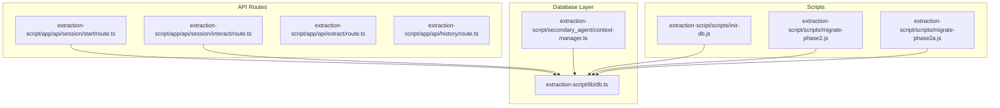
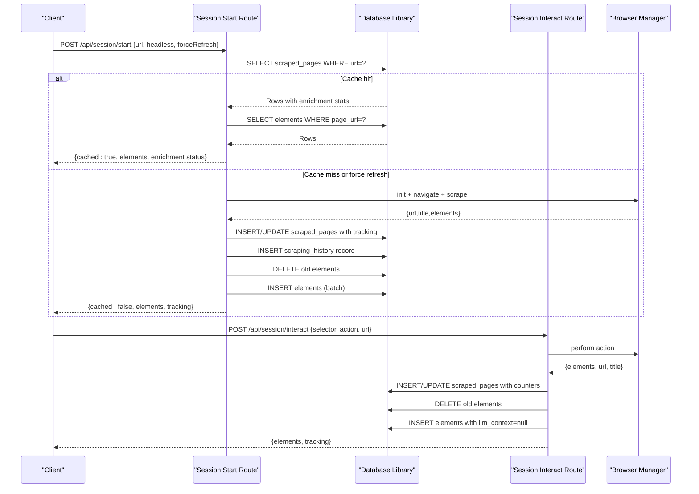
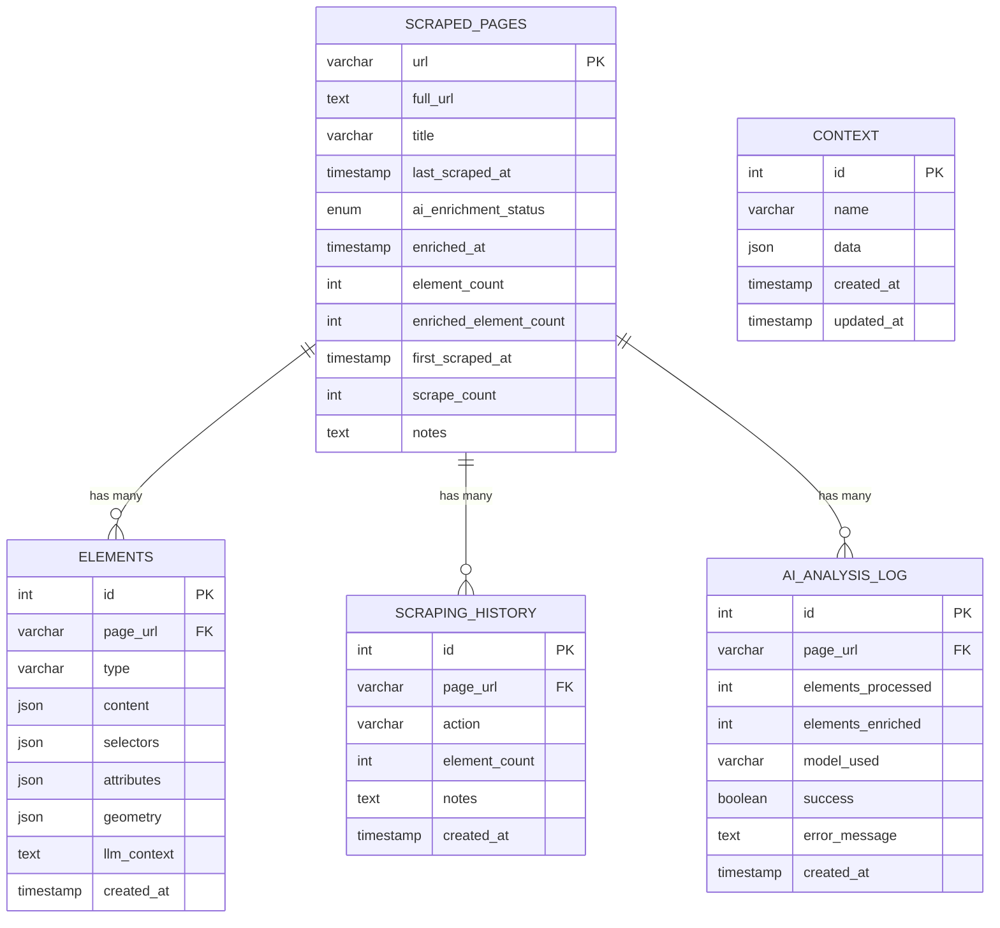
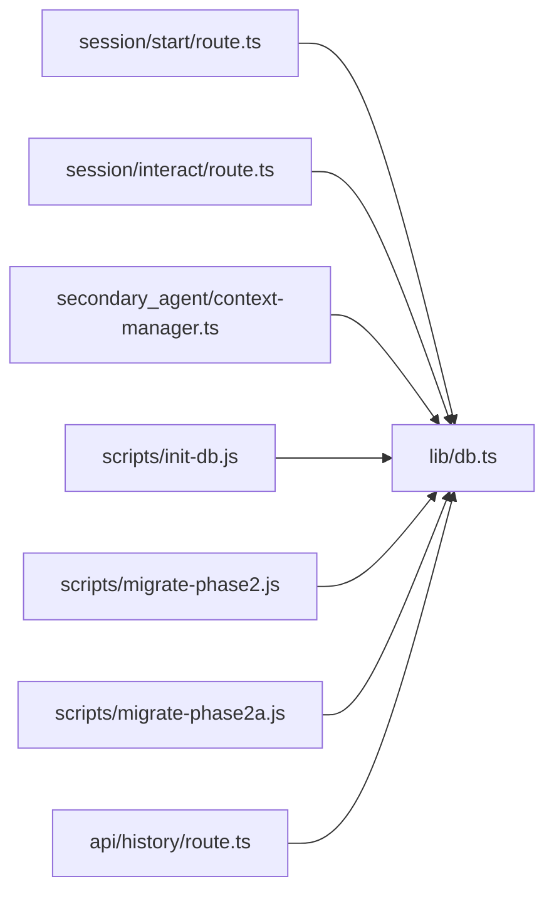

# Database Schema

<cite>
**Referenced Files in This Document**
- [db.ts](file://extraction-script/lib/db.ts)
- [init-db.js](file://extraction-script/scripts/init-db.js)
- [migrate-phase2.js](file://extraction-script/scripts/migrate-phase2.js)
- [migrate-phase2a.js](file://extraction-script/scripts/migrate-phase2a.js)
- [route.ts (session start)](file://extraction-script/app/api/session/start/route.ts)
- [route.ts (session interact)](file://extraction-script/app/api/session/interact/route.ts)
- [context-manager.ts (secondary agent)](file://extraction-script/secondary_agent/context-manager.ts)
- [types.ts (secondary agent)](file://extraction-script/secondary_agent/types.ts)
- [route.ts (extract)](file://extraction-script/app/api/extract/route.ts)
- [route.ts (history)](file://extraction-script/app/api/history/route.ts)
- [types.ts (shared)](file://extraction-script/shared/types.ts)
</cite>

## Update Summary
**Changes Made**
- Added documentation for new `scraping_history` and `ai_analysis_log` tables
- Enhanced `scraped_pages` table documentation with new tracking columns
- Enhanced `elements` table documentation with new columns
- Updated data lifecycle and tracking capabilities
- Added AI enrichment tracking and analytics functionality
- Updated schema evolution procedures

## Table of Contents
1. [Introduction](#introduction)
2. [Project Structure](#project-structure)
3. [Core Components](#core-components)
4. [Architecture Overview](#architecture-overview)
5. [Detailed Component Analysis](#detailed-component-analysis)
6. [Dependency Analysis](#dependency-analysis)
7. [Performance Considerations](#performance-considerations)
8. [Troubleshooting Guide](#troubleshooting-guide)
9. [Conclusion](#conclusion)
10. [Appendices](#appendices)

## Introduction
This document describes the database schema and data model used by the Ghost Pilot system for page scraping and element tracking. The system has been enhanced with AI enrichment capabilities, comprehensive tracking, and analytics functionality. It covers entity definitions, relationships, constraints, indexes, and operational patterns. It also documents initialization scripts, migrations, caching strategies, performance considerations, and data lifecycle aspects observed in the repository.

## Project Structure
The database layer is implemented in a dedicated library module and consumed by Next.js API routes and secondary agent components. Enhanced initialization and migration scripts now support AI enrichment tracking and comprehensive analytics.

**Diagram sources**
- [db.ts:1-179](file://extraction-script/lib/db.ts#L1-L179)
- [route.ts (session start):1-134](file://extraction-script/app/api/session/start/route.ts#L1-L134)
- [route.ts (session interact):1-77](file://extraction-script/app/api/session/interact/route.ts#L1-L77)
- [context-manager.ts (secondary agent):1-183](file://extraction-script/secondary_agent/context-manager.ts#L1-L183)
- [init-db.js:1-64](file://extraction-script/scripts/init-db.js#L1-L64)
- [migrate-phase2.js:1-199](file://extraction-script/scripts/migrate-phase2.js#L1-L199)
- [migrate-phase2a.js:1-41](file://extraction-script/scripts/migrate-phase2a.js#L1-L41)

**Section sources**
- [db.ts:1-179](file://extraction-script/lib/db.ts#L1-L179)
- [init-db.js:1-64](file://extraction-script/scripts/init-db.js#L1-L64)
- [migrate-phase2.js:1-199](file://extraction-script/scripts/migrate-phase2.js#L1-L199)
- [migrate-phase2a.js:1-41](file://extraction-script/scripts/migrate-phase2a.js#L1-L41)
- [route.ts (session start):1-134](file://extraction-script/app/api/session/start/route.ts#L1-L134)
- [route.ts (session interact):1-77](file://extraction-script/app/api/session/interact/route.ts#L1-L77)
- [context-manager.ts (secondary agent):1-183](file://extraction-script/secondary_agent/context-manager.ts#L1-L183)
- [route.ts (extract):1-157](file://extraction-script/app/api/extract/route.ts#L1-L157)

## Core Components
- Database connection and schema management are encapsulated in a single module that creates and maintains the schema on demand with enhanced tracking capabilities.
- API routes implement session start and interaction flows that read/write page metadata, element records, and track scraping activities.
- A secondary agent component reads element data from the database and updates context records with AI enrichment analytics.
- New AI analysis logging tracks enrichment runs and provides comprehensive analytics.

Key responsibilities:
- Ensure database and tables exist with enhanced schema verification and creation.
- Provide a query wrapper with automatic schema checks and migration support.
- Support CRUD-like operations for scraped pages, elements, context, scraping history, and AI analysis logs.
- Track AI enrichment status and element enrichment counts for analytics.

**Section sources**
- [db.ts:17-164](file://extraction-script/lib/db.ts#L17-L164)
- [route.ts (session start):76-92](file://extraction-script/app/api/session/start/route.ts#L76-L92)
- [route.ts (session interact):42-64](file://extraction-script/app/api/session/interact/route.ts#L42-L64)
- [context-manager.ts (secondary agent):170-181](file://extraction-script/secondary_agent/context-manager.ts#L170-L181)

## Architecture Overview
The system uses an enhanced relational schema with JSON fields to capture unstructured UI element data and comprehensive tracking capabilities. The API routes orchestrate browser automation, scrape page elements, persist them to the database with enrichment tracking, and serve cached results on subsequent requests. The secondary agent consumes persisted element data for downstream processing with AI enrichment analytics.

**Diagram sources**
- [route.ts (session start):14-127](file://extraction-script/app/api/session/start/route.ts#L14-L127)
- [route.ts (session interact):25-70](file://extraction-script/app/api/session/interact/route.ts#L25-L70)
- [db.ts:35-105](file://extraction-script/lib/db.ts#L35-L105)

## Detailed Component Analysis

### Database Schema Definition
The enhanced schema consists of five tables: scraped_pages, elements, context, scraping_history, and ai_analysis_log. The elements table references scraped_pages via a foreign key with cascade delete. The scraping_history and ai_analysis_log tables provide comprehensive tracking and analytics capabilities.

- Primary keys:
  - scraped_pages.url
  - elements.id
  - context.id
  - scraping_history.id
  - ai_analysis_log.id
- Foreign keys:
  - elements.page_url → scraped_pages.url (ON DELETE CASCADE)
  - scraping_history.page_url → scraped_pages.url (ON DELETE CASCADE)
  - ai_analysis_log.page_url → scraped_pages.url (ON DELETE CASCADE)
- Indexes:
  - No explicit indexes are declared in the schema; elements.page_url, scraping_history.page_url, and ai_analysis_log.page_url are implicitly indexed by their foreign key constraints.
- Constraints:
  - ai_enrichment_status enum values: 'none', 'partial', 'full'
  - elements.page_url references scraped_pages.url with ON DELETE CASCADE
  - llm_context column is present in elements (added via migration)
  - created_at and updated_at timestamps provide audit trails

**Diagram sources**
- [db.ts:35-105](file://extraction-script/lib/db.ts#L35-L105)
- [migrate-phase2.js:30-56](file://extraction-script/scripts/migrate-phase2.js#L30-L56)

**Section sources**
- [db.ts:35-105](file://extraction-script/lib/db.ts#L35-L105)
- [init-db.js:20-54](file://extraction-script/scripts/init-db.js#L20-L54)
- [migrate-phase2.js:30-106](file://extraction-script/scripts/migrate-phase2.js#L30-L106)
- [migrate-phase2a.js:19-31](file://extraction-script/scripts/migrate-phase2a.js#L19-L31)

### Enhanced Scraped Pages Tracking
The scraped_pages table has been significantly enhanced with comprehensive tracking capabilities for AI enrichment and analytics:

**New Columns:**
- `ai_enrichment_status`: ENUM('none', 'partial', 'full') - Tracks AI enrichment completion status
- `enriched_at`: TIMESTAMP NULL - Timestamp when enrichment was last completed
- `element_count`: INT DEFAULT 0 - Total number of elements tracked
- `enriched_element_count`: INT DEFAULT 0 - Number of elements with AI enrichment
- `first_scraped_at`: TIMESTAMP DEFAULT CURRENT_TIMESTAMP - First scraping timestamp
- `scrape_count`: INT DEFAULT 1 - Total number of scrapings performed
- `notes`: TEXT - Additional notes about the page

**Enhanced Behavior:**
- Automatic enrichment status calculation based on element enrichment counts
- Scrape counter increment for repeat visits
- Comprehensive tracking for analytics and reporting

**Section sources**
- [db.ts:37-49](file://extraction-script/lib/db.ts#L37-L49)
- [migrate-phase2.js:61-69](file://extraction-script/scripts/migrate-phase2.js#L61-L69)
- [route.ts (session start):72-86](file://extraction-script/app/api/session/start/route.ts#L72-L86)

### Enhanced Elements Table
The elements table has been enhanced with new tracking capabilities:

**New Columns:**
- `created_at`: TIMESTAMP DEFAULT CURRENT_TIMESTAMP - Timestamp when element was first recorded
- `llm_context`: TEXT - AI enrichment context for the element

**Enhanced Behavior:**
- Creation timestamps for audit trails
- AI enrichment context storage for downstream processing
- Reset of LLM context on new interactions to ensure fresh enrichment

**Section sources**
- [db.ts:54-66](file://extraction-script/lib/db.ts#L54-L66)
- [migrate-phase2.js:84-94](file://extraction-script/scripts/migrate-phase2.js#L84-L94)
- [route.ts (session interact):50-62](file://extraction-script/app/api/session/interact/route.ts#L50-L62)

### New Scraping History Table
The scraping_history table provides comprehensive tracking of all scraping activities:

**Columns:**
- `id`: INT AUTO_INCREMENT PRIMARY KEY
- `page_url`: VARCHAR(768) - Foreign key to scraped_pages
- `action`: VARCHAR(50) NOT NULL - Type of action performed ('scrape', 'interaction', etc.)
- `element_count`: INT DEFAULT 0 - Number of elements captured
- `notes`: TEXT - Additional information about the scraping event
- `created_at`: TIMESTAMP DEFAULT CURRENT_TIMESTAMP - When the event occurred

**Usage:**
- Records all scraping activities for audit and analytics
- Tracks element counts across different scraping events
- Provides historical context for page analysis

**Section sources**
- [db.ts:81-90](file://extraction-script/lib/db.ts#L81-L90)
- [migrate-phase2.js:30-41](file://extraction-script/scripts/migrate-phase2.js#L30-L41)
- [route.ts (session start):88-92](file://extraction-script/app/api/session/start/route.ts#L88-L92)

### New AI Analysis Log Table
The ai_analysis_log table provides comprehensive tracking of AI enrichment activities:

**Columns:**
- `id`: INT AUTO_INCREMENT PRIMARY KEY
- `page_url`: VARCHAR(768) - Foreign key to scraped_pages
- `elements_processed`: INT DEFAULT 0 - Number of elements processed
- `elements_enriched`: INT DEFAULT 0 - Number of elements successfully enriched
- `model_used`: VARCHAR(100) - AI model identifier
- `success`: BOOLEAN DEFAULT true - Whether the enrichment was successful
- `error_message`: TEXT - Error details if enrichment failed
- `created_at`: TIMESTAMP DEFAULT CURRENT_TIMESTAMP - When the enrichment occurred

**Usage:**
- Tracks all AI enrichment runs with detailed metrics
- Provides success/failure tracking for quality assurance
- Enables performance monitoring and optimization
- Supports debugging and troubleshooting

**Section sources**
- [db.ts:94-105](file://extraction-script/lib/db.ts#L94-L105)
- [migrate-phase2.js:43-56](file://extraction-script/scripts/migrate-phase2.js#L43-L56)

### Data Access Patterns
- Session start:
  - Reads cached page and elements from database with enrichment statistics when available.
  - Inserts or updates page metadata with tracking counters and enrichment status.
  - Records scraping history for audit trails.
  - Inserts or updates page metadata and replaces existing elements for the URL.
- Interaction:
  - Performs browser actions, re-scrapes page, updates page metadata with counters, clears stale elements, and inserts fresh elements with reset LLM context.
- Secondary agent:
  - Retrieves element rows for a given page URL and parses JSON fields into typed structures.
- AI Analysis:
  - Logs enrichment runs with detailed metrics and success indicators.

Typical queries:
- SELECT * FROM scraped_pages WHERE url = ?
- SELECT * FROM elements WHERE page_url = ?
- INSERT INTO scraped_pages (...) ON DUPLICATE KEY UPDATE ... WITH TRACKING COLUMNS
- INSERT INTO scraping_history (...) VALUES (...)
- INSERT INTO ai_analysis_log (...) VALUES (...)
- DELETE FROM elements WHERE page_url = ?
- INSERT INTO elements (...) VALUES (...) WITH LLM CONTEXT

**Section sources**
- [route.ts (session start):14-127](file://extraction-script/app/api/session/start/route.ts#L14-L127)
- [route.ts (session interact):25-70](file://extraction-script/app/api/session/interact/route.ts#L25-L70)
- [context-manager.ts (secondary agent):140-181](file://extraction-script/secondary_agent/context-manager.ts#L140-L181)

### Initialization and Migration Procedures
- Initialization script:
  - Creates the database and tables (scraped_pages, elements, context) with appropriate definitions.
- Enhanced migration script (Phase 2):
  - Creates new tables: scraping_history and ai_analysis_log
  - Adds new tracking columns to scraped_pages with safe migration handling
  - Backfills element counts and enrichment status from existing data
  - Creates initial scraping history entries for existing pages
  - Adds created_at to elements and updated_at to context
- Migration script (Phase 2a):
  - Adds the llm_context column to elements if missing, handling duplicate column errors gracefully.
- Runtime schema verification:
  - The database library ensures schema existence on first use and logs verification status.

Operational steps:
- Run initialization script to bootstrap basic schema.
- Apply Phase 2 migration to add tracking and analytics capabilities.
- Apply Phase 2a migration for additional column enhancements.
- Use runtime schema check for production environments.

**Section sources**
- [init-db.js:4-61](file://extraction-script/scripts/init-db.js#L4-L61)
- [migrate-phase2.js:4-199](file://extraction-script/scripts/migrate-phase2.js#L4-L199)
- [migrate-phase2a.js:4-38](file://extraction-script/scripts/migrate-phase2a.js#L4-L38)
- [db.ts:17-164](file://extraction-script/lib/db.ts#L17-L164)

### Data Validation and Business Rules
Observed rules derived from code behavior:
- Required inputs:
  - Session start requires a URL; returns 400 if missing.
  - Interaction requires a selector and action; returns 400 otherwise.
- Data normalization:
  - JSON fields are serialized before insertion and parsed back on retrieval.
  - Text content is truncated to a bounded length during extraction.
- Atomicity:
  - Upsert pattern is used for page metadata to avoid duplication.
  - Element replacement is performed via DELETE followed by INSERT to keep data consistent.
- Cascading:
  - Deleting a page removes associated elements, scraping history, and AI analysis logs automatically.
- AI Enrichment Tracking:
  - Enrichment status calculated based on element enrichment counts.
  - Success/failure tracking for AI analysis runs.
  - Audit trails for all enrichment activities.

**Section sources**
- [route.ts (session start):10-12](file://extraction-script/app/api/session/start/route.ts#L10-L12)
- [route.ts (session interact):9-11](file://extraction-script/app/api/session/interact/route.ts#L9-L11)
- [route.ts (extract):110-123](file://extraction-script/app/api/extract/route.ts#L110-L123)
- [route.ts (session start):57-84](file://extraction-script/app/api/session/start/route.ts#L57-L84)
- [route.ts (session interact):42-64](file://extraction-script/app/api/session/interact/route.ts#L42-L64)

### Data Lifecycle, Retention, and Archival
- Lifecycle:
  - Pages are cached keyed by URL with comprehensive tracking; last_scraped_at reflects freshness.
  - Elements are refreshed per session start or after interactions with creation timestamps.
  - Scraping history provides audit trails for all activities.
  - AI analysis logs track enrichment runs and performance metrics.
- Retention:
  - No explicit retention policies are enforced in code.
- Archival:
  - No archival logic is present in the repository.
- Analytics:
  - Enrichment status and element counts provide insights into data quality.
  - Scraping history enables trend analysis and performance monitoring.

Recommendations (conceptual):
- Implement periodic cleanup jobs to remove stale pages/elements based on last_scraped_at thresholds.
- Archive older entries to cold storage if historical analysis is required.
- Consider implementing retention policies for AI analysis logs based on compliance requirements.

[No sources needed since this section provides general guidance]

### Security, Privacy, and Access Control
- Credentials:
  - Database credentials are embedded in the connection configuration; consider externalizing secrets.
- Data exposure:
  - JSON fields may contain sensitive UI content; apply least-privilege access controls and encryption at rest.
- Network:
  - Ensure database connections are secured and restricted to trusted hosts.
- AI Context:
  - LLM context data may contain sensitive information; implement appropriate access controls and encryption.

[No sources needed since this section provides general guidance]

## Dependency Analysis
The API routes depend on the database library for persistence. The secondary agent depends on the database library for reading element data and writing context. The enhanced schema supports comprehensive tracking and analytics across all components.

**Diagram sources**
- [route.ts (session start):1-134](file://extraction-script/app/api/session/start/route.ts#L1-L134)
- [route.ts (session interact):1-77](file://extraction-script/app/api/session/interact/route.ts#L1-L77)
- [context-manager.ts (secondary agent):1-183](file://extraction-script/secondary_agent/context-manager.ts#L1-L183)
- [db.ts:1-179](file://extraction-script/lib/db.ts#L1-L179)
- [init-db.js:1-64](file://extraction-script/scripts/init-db.js#L1-L64)
- [migrate-phase2.js:1-199](file://extraction-script/scripts/migrate-phase2.js#L1-L199)
- [migrate-phase2a.js:1-41](file://extraction-script/scripts/migrate-phase2a.js#L1-L41)
- [route.ts (history):1-96](file://extraction-script/app/api/history/route.ts#L1-L96)

**Section sources**
- [route.ts (session start):1-134](file://extraction-script/app/api/session/start/route.ts#L1-L134)
- [route.ts (session interact):1-77](file://extraction-script/app/api/session/interact/route.ts#L1-L77)
- [context-manager.ts (secondary agent):1-183](file://extraction-script/secondary_agent/context-manager.ts#L1-L183)
- [db.ts:1-179](file://extraction-script/lib/db.ts#L1-L179)

## Performance Considerations
- Connection pooling:
  - A pool is configured with a fixed limit; ensure adequate sizing for concurrent requests.
- Query patterns:
  - Frequent SELECTs by URL and page_url suggest indexing; consider adding indexes if performance degrades.
  - Enhanced queries for enrichment status and analytics may benefit from additional indexing.
- Bulk writes:
  - Elements are inserted in a loop; batching could reduce round-trips.
  - AI analysis logs and scraping history insertions should be optimized for high-frequency operations.
- JSON parsing:
  - Parsing JSON on read is straightforward; consider streaming or pre-parsing if throughput increases.
- Analytics:
  - Aggregation queries for enrichment statistics may require optimization for large datasets.

[No sources needed since this section provides general guidance]

## Troubleshooting Guide
Common issues and remedies:
- Schema initialization failures:
  - Verify database connectivity and permissions; ensure the database exists or can be created.
- Duplicate column errors:
  - Migrations handle duplicate columns; confirm migration ran successfully.
  - Phase 2 migration includes comprehensive error handling for existing columns.
- Query errors:
  - Inspect thrown errors and logs; ensure parameters are bound correctly.
  - Check for proper handling of new ENUM values and timestamp columns.
- Session recovery:
  - On interaction failure, the system attempts to reinitialize the browser and navigate to the URL.
- AI Enrichment Issues:
  - Check ai_analysis_log for error messages and success indicators.
  - Verify proper handling of enrichment status calculations.

**Section sources**
- [db.ts:159-164](file://extraction-script/lib/db.ts#L159-L164)
- [migrate-phase2.js:75-82](file://extraction-script/scripts/migrate-phase2.js#L75-L82)
- [route.ts (session interact):14-18](file://extraction-script/app/api/session/interact/route.ts#L14-L18)

## Conclusion
The Ghost Pilot database schema has been significantly enhanced to support comprehensive AI enrichment tracking, analytics, and auditing capabilities. The addition of scraping_history and ai_analysis_log tables, along with enhanced tracking columns in scraped_pages and elements, provides a robust foundation for monitoring and optimizing the scraping and enrichment processes. Initialization and migration scripts provide a comprehensive baseline for schema setup and evolution. Operational flows demonstrate caching, upserts, cascading deletes, and detailed tracking. For production, consider adding indexes, secret management, retention policies, and performance tuning for the enhanced analytics capabilities.

## Appendices

### Appendix A: Enhanced Field Reference
- **scraped_pages** (Enhanced)
  - url: Primary key, VARCHAR(768)
  - full_url: TEXT
  - title: VARCHAR(512)
  - last_scraped_at: TIMESTAMP (auto-updated)
  - ai_enrichment_status: ENUM('none', 'partial', 'full') - AI enrichment completion status
  - enriched_at: TIMESTAMP NULL - Last enrichment timestamp
  - element_count: INT DEFAULT 0 - Total elements tracked
  - enriched_element_count: INT DEFAULT 0 - Enriched elements count
  - first_scraped_at: TIMESTAMP DEFAULT CURRENT_TIMESTAMP - First scraping timestamp
  - scrape_count: INT DEFAULT 1 - Total scraping attempts
  - notes: TEXT - Additional page notes
- **elements** (Enhanced)
  - id: Primary key, INT AUTO_INCREMENT
  - page_url: VARCHAR(768), FK to scraped_pages.url
  - type: VARCHAR(50)
  - content: JSON
  - selectors: JSON
  - attributes: JSON
  - geometry: JSON
  - llm_context: TEXT (nullable) - AI enrichment context
  - created_at: TIMESTAMP DEFAULT CURRENT_TIMESTAMP - Element creation timestamp
- **context**
  - id: Primary key, INT AUTO_INCREMENT
  - name: VARCHAR(255)
  - data: JSON
  - created_at: TIMESTAMP DEFAULT CURRENT_TIMESTAMP
  - updated_at: TIMESTAMP DEFAULT CURRENT_TIMESTAMP ON UPDATE CURRENT_TIMESTAMP
- **scraping_history** (New)
  - id: Primary key, INT AUTO_INCREMENT
  - page_url: VARCHAR(768), FK to scraped_pages.url
  - action: VARCHAR(50) NOT NULL
  - element_count: INT DEFAULT 0
  - notes: TEXT
  - created_at: TIMESTAMP DEFAULT CURRENT_TIMESTAMP
- **ai_analysis_log** (New)
  - id: Primary key, INT AUTO_INCREMENT
  - page_url: VARCHAR(768), FK to scraped_pages.url
  - elements_processed: INT DEFAULT 0
  - elements_enriched: INT DEFAULT 0
  - model_used: VARCHAR(100)
  - success: BOOLEAN DEFAULT true
  - error_message: TEXT
  - created_at: TIMESTAMP DEFAULT CURRENT_TIMESTAMP

**Section sources**
- [db.ts:35-105](file://extraction-script/lib/db.ts#L35-L105)
- [init-db.js:20-54](file://extraction-script/scripts/init-db.js#L20-L54)
- [migrate-phase2.js:30-106](file://extraction-script/scripts/migrate-phase2.js#L30-L106)
- [migrate-phase2a.js:19-31](file://extraction-script/scripts/migrate-phase2a.js#L19-L31)

### Appendix B: Migration Procedures
- **Phase 1 (Basic)**: Creates initial schema with scraped_pages, elements, and context tables
- **Phase 2 (Enhanced)**: Adds tracking capabilities including scraping_history, ai_analysis_log, and enhanced scraped_pages columns
- **Phase 2a (Additional)**: Ensures backward compatibility by adding missing columns safely

**Section sources**
- [init-db.js:4-61](file://extraction-script/scripts/init-db.js#L4-L61)
- [migrate-phase2.js:1-199](file://extraction-script/scripts/migrate-phase2.js#L1-L199)
- [migrate-phase2a.js:1-41](file://extraction-script/scripts/migrate-phase2a.js#L1-L41)