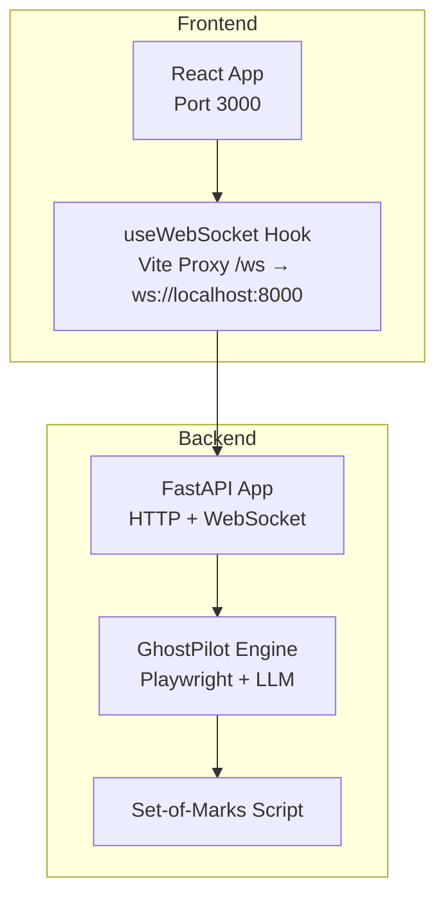
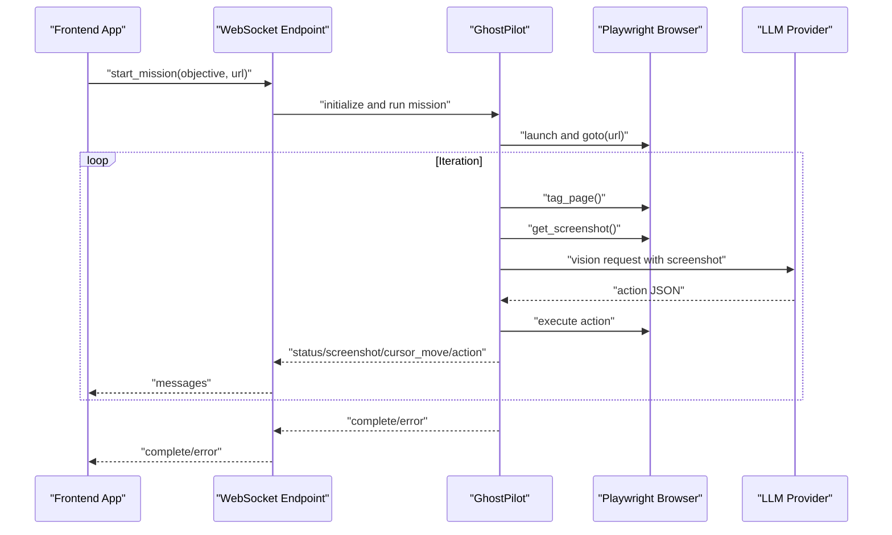
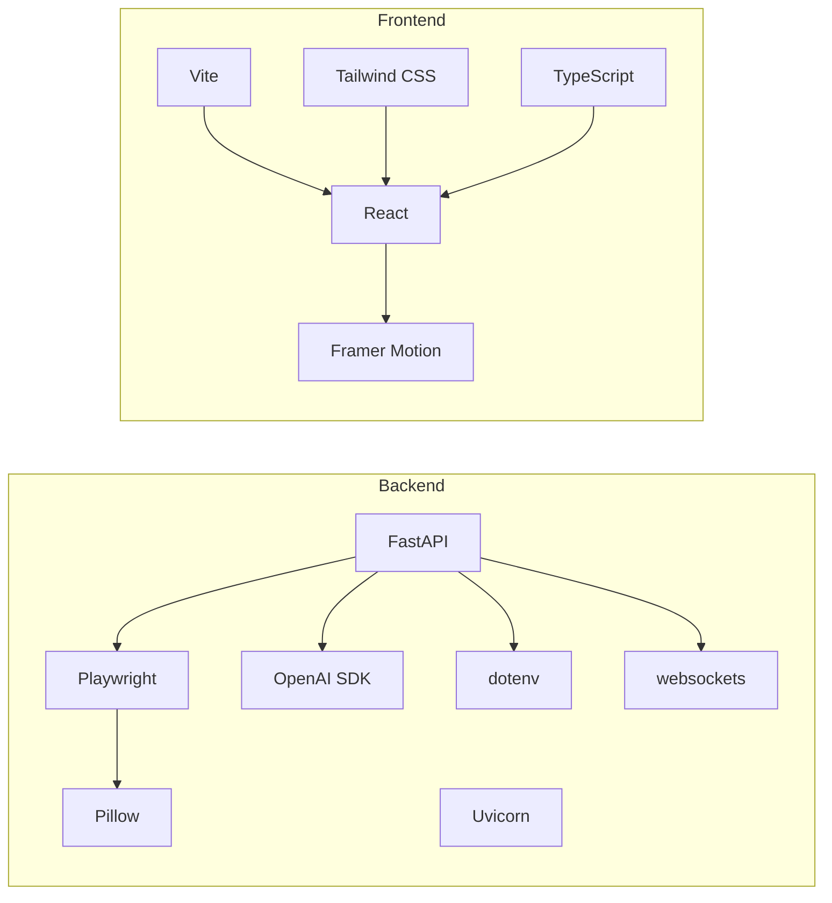

# Deployment and Operations

<cite>
**Referenced Files in This Document**
- [backend/main.py](file://backend/main.py)
- [backend/ghost_pilot.py](file://backend/ghost_pilot.py)
- [backend/requirements.txt](file://backend/requirements.txt)
- [backend/set_of_marks.js](file://backend/set_of_marks.js)
- [frontend/src/App.tsx](file://frontend/src/App.tsx)
- [frontend/src/hooks/useWebSocket.ts](file://frontend/src/hooks/useWebSocket.ts)
- [frontend/vite.config.ts](file://frontend/vite.config.ts)
- [frontend/package.json](file://frontend/package.json)
- [frontend/INSTALLATION.md](file://frontend/INSTALLATION.md)
</cite>

## Table of Contents
1. [Introduction](#introduction)
2. [Project Structure](#project-structure)
3. [Core Components](#core-components)
4. [Architecture Overview](#architecture-overview)
5. [Detailed Component Analysis](#detailed-component-analysis)
6. [Dependency Analysis](#dependency-analysis)
7. [Performance Considerations](#performance-considerations)
8. [Troubleshooting Guide](#troubleshooting-guide)
9. [Conclusion](#conclusion)
10. [Appendices](#appendices)

## Introduction
This document provides comprehensive deployment and operations guidance for the Ghost Pilot system. It covers production deployment strategies, infrastructure requirements, scaling considerations, monitoring and logging, backup and disaster recovery, maintenance procedures, operational best practices for AI API quotas and rate limiting, and troubleshooting for common production issues.

## Project Structure
Ghost Pilot consists of:
- A FastAPI backend exposing a WebSocket endpoint for autonomous browser automation.
- A React frontend that communicates with the backend via WebSocket, displays screenshots, and controls missions.
- A Playwright-driven browser automation engine with Set-of-Marks tagging for element targeting.
- Optional support for multiple LLM providers (OpenAI, LM Studio, Gemini, OpenRouter, Custom).

**Diagram sources**
- [frontend/src/App.tsx](file://frontend/src/App.tsx#L11-L12)
- [frontend/vite.config.ts](file://frontend/vite.config.ts#L10-L16)
- [backend/main.py](file://backend/main.py#L36-L157)
- [backend/ghost_pilot.py](file://backend/ghost_pilot.py#L18-L105)
- [backend/set_of_marks.js](file://backend/set_of_marks.js#L1-L229)

**Section sources**
- [frontend/src/App.tsx](file://frontend/src/App.tsx#L11-L12)
- [frontend/vite.config.ts](file://frontend/vite.config.ts#L7-L17)
- [backend/main.py](file://backend/main.py#L17-L26)
- [backend/ghost_pilot.py](file://backend/ghost_pilot.py#L18-L105)
- [backend/set_of_marks.js](file://backend/set_of_marks.js#L1-L229)

## Core Components
- Backend API and WebSocket
  - Exposes a WebSocket endpoint for autonomous missions.
  - Supports multiple LLM providers configured via environment variables.
  - Implements health checks and basic CORS.
- GhostPilot engine
  - Initializes Playwright Chromium browser.
  - Injects Set-of-Marks tags to identify interactive elements.
  - Captures screenshots and sends them to the LLM for action decisions.
  - Executes actions (click, type, scroll, wait) and handles captchas.
  - Includes rate-limiting logic for free-tier providers.
- Frontend React app
  - Connects to the backend via WebSocket.
  - Renders live screenshots, cursor movement, and status updates.
  - Provides voice input and manual captcha override.

**Section sources**
- [backend/main.py](file://backend/main.py#L28-L157)
- [backend/ghost_pilot.py](file://backend/ghost_pilot.py#L18-L157)
- [frontend/src/App.tsx](file://frontend/src/App.tsx#L1-L360)
- [frontend/src/hooks/useWebSocket.ts](file://frontend/src/hooks/useWebSocket.ts#L15-L92)

## Architecture Overview
The system operates as a real-time WebSocket pipeline:
- The frontend sends mission commands to the backend.
- The backend initializes a browser, injects tags, captures screenshots, queries the LLM, executes actions, and streams feedback to the frontend.
- The frontend renders the live experience and provides user controls.

**Diagram sources**
- [backend/main.py](file://backend/main.py#L36-L127)
- [backend/ghost_pilot.py](file://backend/ghost_pilot.py#L623-L768)
- [frontend/src/App.tsx](file://frontend/src/App.tsx#L16-L174)

## Detailed Component Analysis

### Backend API and WebSocket
- WebSocket endpoint supports:
  - Starting missions with objective and URL.
  - Captcha skip requests.
  - Streaming status, screenshots, thinking indicators, and action events.
- Health endpoint and CORS configuration included.
- Environment-driven provider selection and configuration.

Operational notes:
- Production-grade deployments should restrict origins and enable TLS.
- Consider adding rate limiting and authentication at the API gateway level.

**Section sources**
- [backend/main.py](file://backend/main.py#L28-L157)

### GhostPilot Engine
Key capabilities:
- Multi-provider LLM support with provider-specific configuration.
- Set-of-Marks injection for robust element targeting.
- Screenshot capture and base64 encoding.
- Action execution (click, type, scroll, wait) with cursor feedback.
- Captcha detection and manual override.
- Rate limiting and retry logic for free-tier providers.

Production considerations:
- Browser lifecycle management: keep browser open for manual inspection by default.
- Robust error handling and step-wise retries during missions.
- Consider persistent session storage for long-running tasks.

**Section sources**
- [backend/ghost_pilot.py](file://backend/ghost_pilot.py#L18-L157)
- [backend/ghost_pilot.py](file://backend/ghost_pilot.py#L181-L231)
- [backend/ghost_pilot.py](file://backend/ghost_pilot.py#L240-L297)
- [backend/ghost_pilot.py](file://backend/ghost_pilot.py#L299-L562)
- [backend/ghost_pilot.py](file://backend/ghost_pilot.py#L623-L768)
- [backend/ghost_pilot.py](file://backend/ghost_pilot.py#L769-L800)

### Frontend React App and WebSocket Integration
- WebSocket connection with auto-reconnect.
- Real-time rendering of screenshots, cursor movement, and status.
- Voice input integration and manual captcha override button.
- Vite proxy configuration for local development.

Production considerations:
- Configure Vite proxy for production reverse proxy scenarios.
- Implement graceful degradation when backend is unavailable.
- Secure WebSocket transport with WSS in production.

**Section sources**
- [frontend/src/App.tsx](file://frontend/src/App.tsx#L1-L360)
- [frontend/src/hooks/useWebSocket.ts](file://frontend/src/hooks/useWebSocket.ts#L15-L92)
- [frontend/vite.config.ts](file://frontend/vite.config.ts#L7-L17)

### Set-of-Marks Script
- Dynamically injects yellow tags over interactive elements.
- Computes element centers and serializable metadata.
- Returns viewport and tag count for downstream processing.

Operational notes:
- Ensure the script is loaded and executed in the browser context.
- Consider caching or bundling the script for performance.

**Section sources**
- [backend/set_of_marks.js](file://backend/set_of_marks.js#L1-L229)

## Dependency Analysis
Runtime dependencies:
- Backend: FastAPI, Uvicorn, Playwright, OpenAI SDK, python-dotenv, websockets, Pillow.
- Frontend: React, Framer Motion, Vite, Tailwind CSS, TypeScript.

**Diagram sources**
- [backend/requirements.txt](file://backend/requirements.txt#L1-L8)
- [frontend/package.json](file://frontend/package.json#L12-L32)

**Section sources**
- [backend/requirements.txt](file://backend/requirements.txt#L1-L8)
- [frontend/package.json](file://frontend/package.json#L12-L32)

## Performance Considerations
- Browser resource management
  - Keep browser open for manual inspection by default to reduce cold starts.
  - Close browser gracefully on demand to free memory.
- WebSocket throughput
  - Screenshots are base64-encoded; consider compression or binary transport for high volume.
- LLM rate limiting
  - Free-tier providers have strict RPM and daily limits; implement backoff and jitter.
  - Honor Retry-After headers when present.
- Rendering and UX
  - Debounce frequent status updates and cursor movements.
  - Use efficient image decoding and display techniques.

[No sources needed since this section provides general guidance]

## Troubleshooting Guide
Common production issues and resolutions:
- WebSocket disconnects
  - Verify backend is reachable on the expected port and origin is allowed.
  - Confirm auto-reconnect logic is functioning in the frontend.
- Invalid API key or provider misconfiguration
  - Validate environment variables for the selected provider.
  - Ensure the chosen model supports vision capabilities.
- Playwright launch failures
  - Install Chromium via Playwright installer.
  - On Linux, ensure system dependencies are met.
- Captcha stalls
  - Use the manual override to skip waiting.
  - Consider implementing a CAPTCHA-solving service for automated workflows.
- Frontend not connecting
  - Check Vite proxy configuration for WebSocket traffic.
  - Ensure the backend allows cross-origin requests in development.

**Section sources**
- [frontend/src/hooks/useWebSocket.ts](file://frontend/src/hooks/useWebSocket.ts#L43-L52)
- [frontend/INSTALLATION.md](file://frontend/INSTALLATION.md#L156-L176)
- [backend/main.py](file://backend/main.py#L20-L26)
- [backend/ghost_pilot.py](file://backend/ghost_pilot.py#L240-L297)

## Conclusion
Ghost Pilot is a real-time autonomous browser automation system built on modern web technologies. For production, prioritize secure transport, robust rate limiting, resilient browser lifecycle management, and clear observability. The provided components and guidance should enable scalable, maintainable deployments.

[No sources needed since this section summarizes without analyzing specific files]

## Appendices

### A. Production Deployment Strategies
- Containerization approaches
  - Backend: Package the FastAPI app with Uvicorn in a minimal Python image; mount Playwright browsers and assets.
  - Frontend: Serve a static build behind a reverse proxy or CDN.
  - Consider separate images for backend and frontend to optimize caching and updates.
- Docker configuration
  - Use multi-stage builds for the frontend.
  - Pin dependency versions and use non-root users.
  - Mount volumes for logs and temporary artifacts.
- Cloud deployment options
  - Kubernetes: Deploy backend as a Stateful workload with horizontal pod autoscaling; frontends behind a LoadBalancer or Ingress.
  - Platform-as-a-Service: Use managed containers or serverless functions for the API with a CDN for the frontend.
  - Edge computing: Place the frontend close to users; route WebSocket traffic to nearest backend region.

[No sources needed since this section provides general guidance]

### B. Infrastructure Requirements
- Backend server
  - CPU: Multi-core for concurrent missions and LLM calls.
  - Memory: Allocate per-playwright-browser overhead plus application memory.
  - Storage: Disk for logs, temporary files, and Playwright resources.
- Frontend server
  - Static hosting with HTTPS termination.
  - Reverse proxy to WebSocket endpoint for production.
- Network
  - Low-latency connectivity between frontend and backend.
  - Allow outbound HTTPS to LLM providers.
  - Enable WebSocket upgrade paths.
- Security
  - Enforce TLS for all endpoints.
  - Restrict CORS to trusted origins.
  - Rotate API keys and manage secrets securely.

[No sources needed since this section provides general guidance]

### C. Scaling Considerations
- Concurrent users
  - Scale backend pods horizontally; ensure sticky sessions if required.
  - Limit per-instance browser concurrency to avoid resource contention.
- WebSocket connections
  - Use connection pooling and backpressure handling.
  - Consider message batching for status updates.
- Browser automation instances
  - Use per-process browser isolation.
  - Implement graceful shutdown and cleanup on scale-down.

[No sources needed since this section provides general guidance]

### D. Monitoring and Logging
- Metrics collection
  - Track request rates, latency, and error rates for the WebSocket endpoint.
  - Monitor browser process health and memory usage.
  - Capture LLM token usage and latency.
- Alerting mechanisms
  - Alert on high error rates, rate limit hits, and resource exhaustion.
  - Notify on extended captcha stalls or mission timeouts.
- Performance monitoring
  - Use distributed tracing for end-to-end mission latency.
  - Profile screenshot capture and LLM inference times.

[No sources needed since this section provides general guidance]

### E. Backup and Disaster Recovery
- Critical data
  - User sessions: Persist mission state and logs to durable storage.
  - Extracted content: Archive screenshots and transcripts.
  - System configurations: Version-control environment files and deployment manifests.
- Procedures
  - Regular backups with retention policies.
  - Test restoration procedures periodically.
  - Disaster recovery site with replicated infrastructure.

[No sources needed since this section provides general guidance]

### F. Maintenance Procedures
- Dependency updates
  - Automate scanning for vulnerable dependencies in both backend and frontend.
  - Test updates in staging before production rollout.
- Security patches
  - Apply OS and runtime patches promptly.
  - Rotate API keys and review access scopes regularly.
- System upgrades
  - Coordinate rolling upgrades to minimize downtime.
  - Validate Playwright and browser compatibility after OS upgrades.

[No sources needed since this section provides general guidance]

### G. Operational Best Practices for AI API Quotas and Cost Optimization
- Rate limiting
  - Respect provider limits; implement exponential backoff and jitter.
  - Batch operations where possible to reduce request counts.
- Cost optimization
  - Prefer lower-cost models for non-critical tasks.
  - Monitor token usage and tune prompts for conciseness.
- Quota management
  - Track daily and per-minute usage; alert before thresholds.
  - Use provider-specific free tiers judiciously.

[No sources needed since this section provides general guidance]