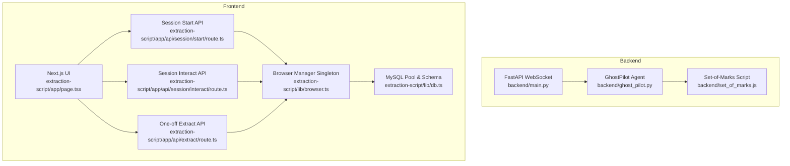
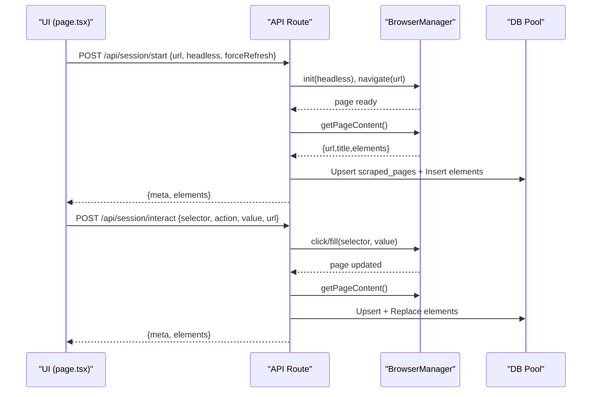
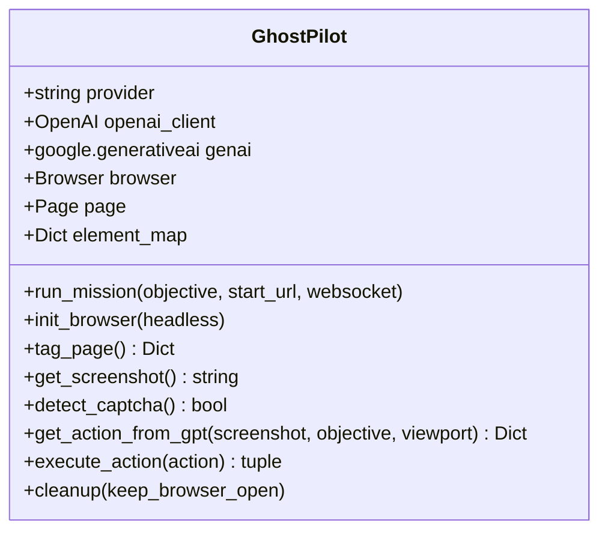
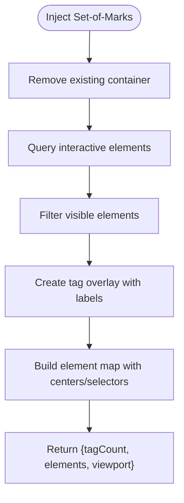
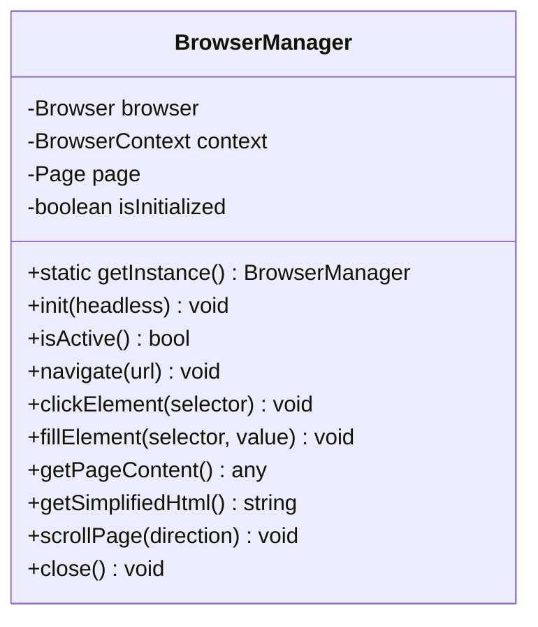
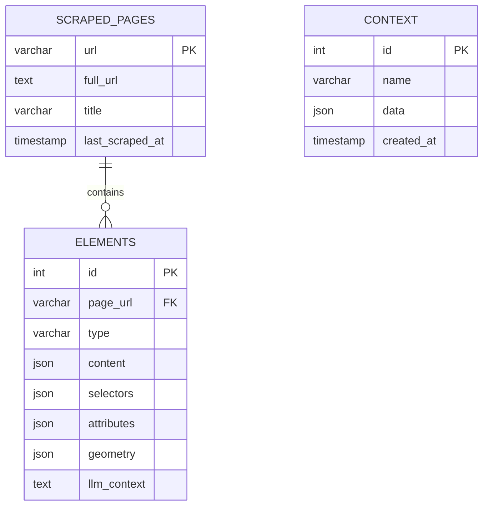
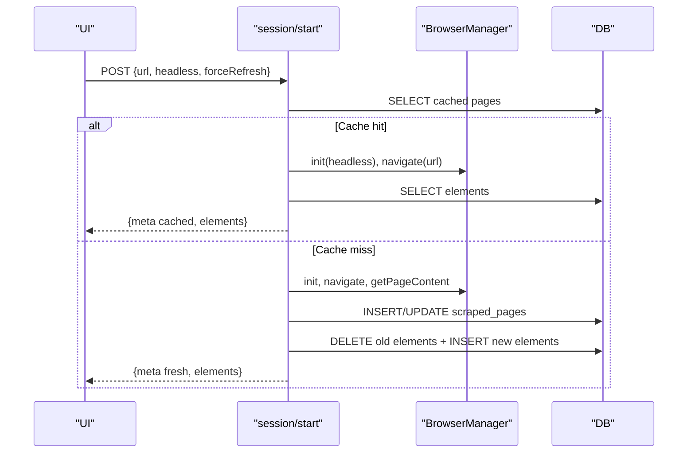
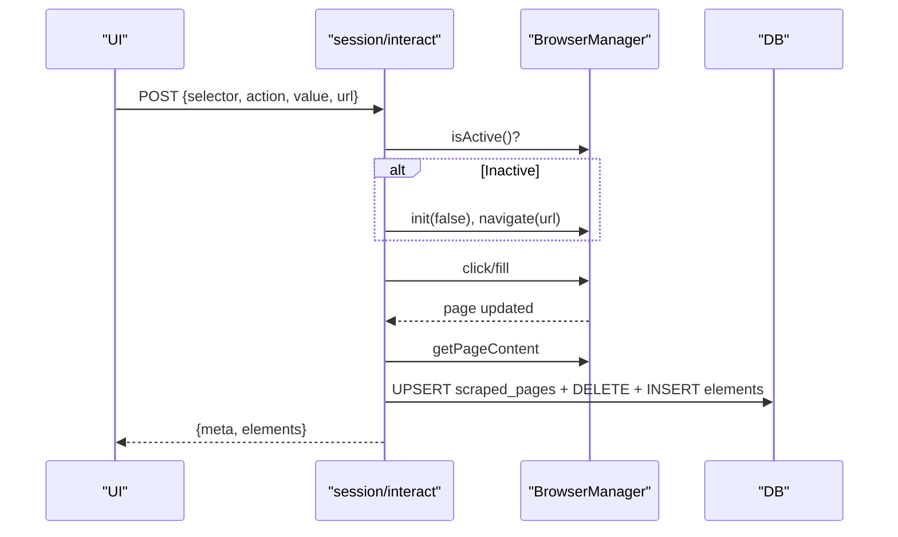
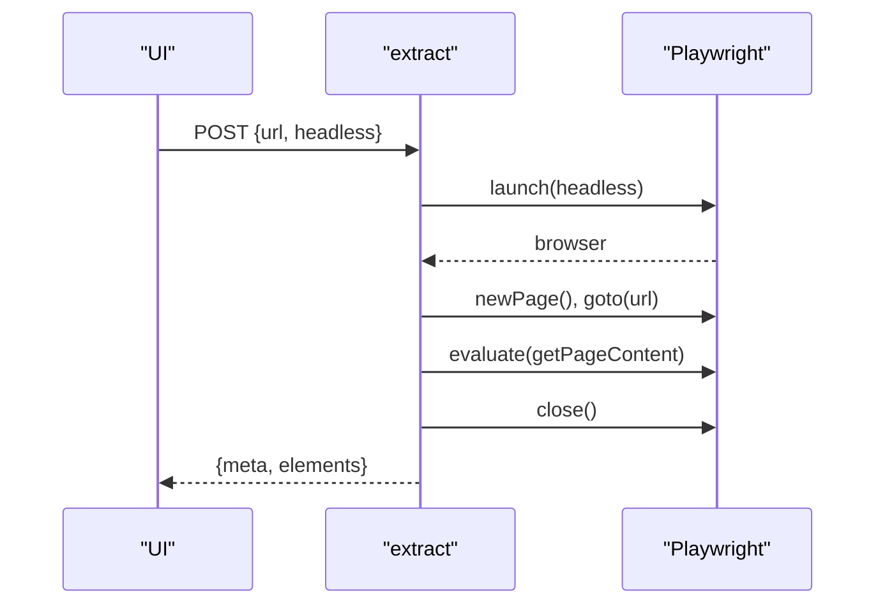
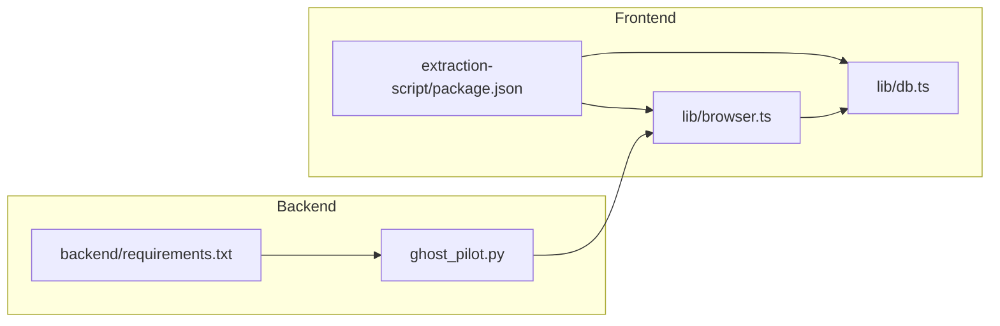

# Browser Management

<cite>
**Referenced Files in This Document**
- [backend/main.py](file://backend/main.py)
- [backend/ghost_pilot.py](file://backend/ghost_pilot.py)
- [backend/set_of_marks.js](file://backend/set_of_marks.js)
- [extraction-script/lib/browser.ts](file://extraction-script/lib/browser.ts)
- [extraction-script/lib/db.ts](file://extraction-script/lib/db.ts)
- [extraction-script/lib/utils.ts](file://extraction-script/lib/utils.ts)
- [extraction-script/app/api/session/start/route.ts](file://extraction-script/app/api/session/start/route.ts)
- [extraction-script/app/api/session/interact/route.ts](file://extraction-script/app/api/session/interact/route.ts)
- [extraction-script/app/api/extract/route.ts](file://extraction-script/app/api/extract/route.ts)
- [extraction-script/app/page.tsx](file://extraction-script/app/page.tsx)
- [backend/requirements.txt](file://backend/requirements.txt)
- [extraction-script/package.json](file://extraction-script/package.json)
</cite>

## Table of Contents
1. [Introduction](#introduction)
2. [Project Structure](#project-structure)
3. [Core Components](#core-components)
4. [Architecture Overview](#architecture-overview)
5. [Detailed Component Analysis](#detailed-component-analysis)
6. [Dependency Analysis](#dependency-analysis)
7. [Performance Considerations](#performance-considerations)
8. [Troubleshooting Guide](#troubleshooting-guide)
9. [Conclusion](#conclusion)
10. [Appendices](#appendices)

## Introduction
This document explains the browser management system used in the extraction script and the autonomous browser automation pipeline. It covers:
- Browser automation capabilities: page loading, navigation, element interaction
- Browser configuration options, headless mode, and performance tuning
- Element scraping: DOM traversal, content extraction, and data parsing
- Screenshot capture and image processing workflows
- Session management to maintain browser state across requests
- Integration with database operations for persistence and retrieval
- Browser compatibility, timeouts, and error recovery
- Utility functions and helper methods
- Practical workflows, optimization tips, and troubleshooting

## Project Structure
The system comprises two major parts:
- Backend service (Python/FastAPI/WebSocket) orchestrating autonomous browser sessions
- Frontend Next.js application (TypeScript/React) exposing browser automation APIs and UI

Key modules:
- Backend: FastAPI WebSocket server, GhostPilot autonomous agent, Set-of-Marks injection script
- Frontend: Browser manager singleton, API routes for session start/interaction, extraction route, and UI

**Diagram sources**
- [backend/main.py](file://backend/main.py#L36-L157)
- [backend/ghost_pilot.py](file://backend/ghost_pilot.py#L18-L105)
- [backend/set_of_marks.js](file://backend/set_of_marks.js#L8-L229)
- [extraction-script/app/page.tsx](file://extraction-script/app/page.tsx#L95-L205)
- [extraction-script/app/api/session/start/route.ts](file://extraction-script/app/api/session/start/route.ts#L6-L96)
- [extraction-script/app/api/session/interact/route.ts](file://extraction-script/app/api/session/interact/route.ts#L6-L76)
- [extraction-script/app/api/extract/route.ts](file://extraction-script/app/api/extract/route.ts#L14-L157)
- [extraction-script/lib/browser.ts](file://extraction-script/lib/browser.ts#L4-L254)
- [extraction-script/lib/db.ts](file://extraction-script/lib/db.ts#L5-L105)

**Section sources**
- [backend/main.py](file://backend/main.py#L1-L157)
- [extraction-script/app/page.tsx](file://extraction-script/app/page.tsx#L95-L205)

## Core Components
- Backend GhostPilot agent: initializes Chromium via Playwright, injects Set-of-Marks, captures screenshots, queries a vision-capable LLM, executes actions, detects captchas, and manages cleanup
- Frontend BrowserManager singleton: provides a persistent Chromium context/page, navigates, clicks/fills elements, extracts simplified HTML and structured element data, scrolls, and closes cleanly
- Database layer: MySQL pool with schema ensuring tables for scraped pages, elements, and context; used for caching and persistence
- API routes: session start/interact endpoints integrate BrowserManager and DB; standalone extraction endpoint launches a temporary browser

**Section sources**
- [backend/ghost_pilot.py](file://backend/ghost_pilot.py#L18-L105)
- [extraction-script/lib/browser.ts](file://extraction-script/lib/browser.ts#L4-L254)
- [extraction-script/lib/db.ts](file://extraction-script/lib/db.ts#L5-L105)
- [extraction-script/app/api/session/start/route.ts](file://extraction-script/app/api/session/start/route.ts#L6-L96)
- [extraction-script/app/api/session/interact/route.ts](file://extraction-script/app/api/session/interact/route.ts#L6-L76)
- [extraction-script/app/api/extract/route.ts](file://extraction-script/app/api/extract/route.ts#L14-L157)

## Architecture Overview
End-to-end flow:
- UI triggers session start or one-off extraction
- Backend/Next.js API invokes BrowserManager or GhostPilot
- Browser navigates, tags elements, and optionally captures screenshots
- Structured element data is persisted to DB
- UI displays results and allows further interactions

**Diagram sources**
- [extraction-script/app/page.tsx](file://extraction-script/app/page.tsx#L111-L173)
- [extraction-script/app/api/session/start/route.ts](file://extraction-script/app/api/session/start/route.ts#L6-L96)
- [extraction-script/app/api/session/interact/route.ts](file://extraction-script/app/api/session/interact/route.ts#L6-L76)
- [extraction-script/lib/browser.ts](file://extraction-script/lib/browser.ts#L20-L245)
- [extraction-script/lib/db.ts](file://extraction-script/lib/db.ts#L92-L105)

## Detailed Component Analysis

### Backend GhostPilot Agent
- Initializes Playwright Chromium, creates a page with a fixed viewport, and injects Set-of-Marks via evaluate
- Tags interactive elements and returns a serializable element map with centers and selectors
- Captures screenshots and sends them to a vision-capable LLM provider (OpenAI-compatible, OpenRouter, LM Studio, Gemini)
- Parses and validates JSON responses, enforces rate limits for free-tier providers, and handles retries
- Executes actions (click/type/scroll/wait/finish) using mouse and keyboard events
- Detects captchas and pauses for manual resolution or user skip
- Manages cleanup and optional keep-alive behavior

**Diagram sources**
- [backend/ghost_pilot.py](file://backend/ghost_pilot.py#L18-L105)
- [backend/ghost_pilot.py](file://backend/ghost_pilot.py#L140-L157)
- [backend/ghost_pilot.py](file://backend/ghost_pilot.py#L232-L238)
- [backend/ghost_pilot.py](file://backend/ghost_pilot.py#L240-L297)
- [backend/ghost_pilot.py](file://backend/ghost_pilot.py#L299-L562)
- [backend/ghost_pilot.py](file://backend/ghost_pilot.py#L564-L621)
- [backend/ghost_pilot.py](file://backend/ghost_pilot.py#L769-L800)

**Section sources**
- [backend/ghost_pilot.py](file://backend/ghost_pilot.py#L18-L105)
- [backend/ghost_pilot.py](file://backend/ghost_pilot.py#L140-L157)
- [backend/ghost_pilot.py](file://backend/ghost_pilot.py#L232-L238)
- [backend/ghost_pilot.py](file://backend/ghost_pilot.py#L240-L297)
- [backend/ghost_pilot.py](file://backend/ghost_pilot.py#L299-L562)
- [backend/ghost_pilot.py](file://backend/ghost_pilot.py#L564-L621)
- [backend/ghost_pilot.py](file://backend/ghost_pilot.py#L623-L768)
- [backend/ghost_pilot.py](file://backend/ghost_pilot.py#L769-L800)

### Set-of-Marks Injection Script
- Removes any existing tag container
- Selects visible interactive elements and overlays yellow tags with numeric labels
- Computes element centers and returns a serializable map plus viewport info
- Used by GhostPilot to enable tag-based targeting

**Diagram sources**
- [backend/set_of_marks.js](file://backend/set_of_marks.js#L8-L229)

**Section sources**
- [backend/set_of_marks.js](file://backend/set_of_marks.js#L8-L229)

### Frontend BrowserManager Singleton
- Provides a singleton Chromium instance with a persistent context/page
- Supports navigation, click/fill, scrolling, and element extraction
- Offers simplified HTML extraction and structured element data with selectors and geometry
- Ensures active state checks and graceful closure

**Diagram sources**
- [extraction-script/lib/browser.ts](file://extraction-script/lib/browser.ts#L4-L254)

**Section sources**
- [extraction-script/lib/browser.ts](file://extraction-script/lib/browser.ts#L4-L254)

### Database Layer (MySQL)
- Creates and maintains schema for scraped_pages, elements, and context
- Ensures existence of columns and applies migrations safely
- Exposes a pooled query interface for API routes to persist and retrieve data

**Diagram sources**
- [extraction-script/lib/db.ts](file://extraction-script/lib/db.ts#L35-L80)

**Section sources**
- [extraction-script/lib/db.ts](file://extraction-script/lib/db.ts#L5-L105)

### Session Start API
- Handles session initialization with caching and force refresh
- Launches BrowserManager, navigates to URL, extracts elements, persists to DB, and returns results
- Lazily navigates in background to keep browser ready for interactions

**Diagram sources**
- [extraction-script/app/api/session/start/route.ts](file://extraction-script/app/api/session/start/route.ts#L6-L96)
- [extraction-script/lib/browser.ts](file://extraction-script/lib/browser.ts#L20-L245)
- [extraction-script/lib/db.ts](file://extraction-script/lib/db.ts#L92-L105)

**Section sources**
- [extraction-script/app/api/session/start/route.ts](file://extraction-script/app/api/session/start/route.ts#L6-L96)

### Session Interact API
- Restores session if browser is inactive (based on URL)
- Performs click/fill actions, re-extracts page content, and persists updated state
- Returns cleaned-up element list suitable for UI rendering

**Diagram sources**
- [extraction-script/app/api/session/interact/route.ts](file://extraction-script/app/api/session/interact/route.ts#L6-L76)
- [extraction-script/lib/browser.ts](file://extraction-script/lib/browser.ts#L31-L73)
- [extraction-script/lib/db.ts](file://extraction-script/lib/db.ts#L92-L105)

**Section sources**
- [extraction-script/app/api/session/interact/route.ts](file://extraction-script/app/api/session/interact/route.ts#L6-L76)

### One-off Extraction API
- Launches a temporary Chromium instance, navigates to URL, waits for content, and extracts elements
- Returns structured data without persisting to DB

**Diagram sources**
- [extraction-script/app/api/extract/route.ts](file://extraction-script/app/api/extract/route.ts#L14-L157)

**Section sources**
- [extraction-script/app/api/extract/route.ts](file://extraction-script/app/api/extract/route.ts#L14-L157)

### UI Integration
- Provides controls for URL, headless mode, force refresh, and AI enrichment
- Displays extraction results in table or JSON view
- Enables click/fill actions directly from the UI

**Section sources**
- [extraction-script/app/page.tsx](file://extraction-script/app/page.tsx#L95-L205)

## Dependency Analysis
- Backend depends on Playwright, OpenAI-compatible clients, and Pillow for image processing
- Frontend depends on Playwright for browser automation and mysql2 for DB connectivity
- Both sides communicate via HTTP APIs and JSON payloads

**Diagram sources**
- [backend/requirements.txt](file://backend/requirements.txt#L1-L8)
- [extraction-script/package.json](file://extraction-script/package.json#L12-L32)

**Section sources**
- [backend/requirements.txt](file://backend/requirements.txt#L1-L8)
- [extraction-script/package.json](file://extraction-script/package.json#L12-L32)

## Performance Considerations
- Headless vs headed: Prefer headless for speed; use headed mode for debugging and manual intervention
- Viewport sizing: Fixed viewport reduces variability and speeds up rendering
- Timeout tuning: Default timeouts are set; adjust per site complexity
- Rate limiting: Free-tier providers enforce RPM/daily quotas; the agent respects Retry-After and applies progressive delays
- Caching: Session start API caches results; use force refresh to bypass cache
- Batch writes: Prefer batch inserts for elements to reduce round trips
- Screenshot reuse: Avoid unnecessary screenshots; only capture when needed for LLM decisions
- Visibility checks: Skip invisible elements to reduce noise and improve accuracy

[No sources needed since this section provides general guidance]

## Troubleshooting Guide
Common issues and remedies:
- Captcha detection: The system detects visible captcha frames and challenges; pause for manual resolution or use the skip mechanism
- Rate limits: Free-tier providers throttle requests; the agent waits and retries with backoff
- Session loss: If the browser is closed, the interact API attempts to recover by reinitializing and navigating to the stored URL
- Timeout errors: Increase default timeouts or wait for network idle; ensure selectors are stable
- Visibility problems: Use explicit waits and visibility checks; avoid hidden or zero-sized elements
- Database connectivity: Verify credentials and ensure the database exists and schema is initialized

**Section sources**
- [backend/ghost_pilot.py](file://backend/ghost_pilot.py#L240-L297)
- [backend/ghost_pilot.py](file://backend/ghost_pilot.py#L181-L231)
- [extraction-script/app/api/session/interact/route.ts](file://extraction-script/app/api/session/interact/route.ts#L13-L18)
- [extraction-script/lib/db.ts](file://extraction-script/lib/db.ts#L17-L90)

## Conclusion
The browser management system combines a robust backend autonomous agent with a flexible frontend automation layer. It supports reliable page navigation, element interaction, structured extraction, and persistent caching. With built-in rate-limit handling, captcha detection, and session recovery, it provides a resilient foundation for scalable browser automation workflows.

[No sources needed since this section summarizes without analyzing specific files]

## Appendices

### Practical Workflows
- Interactive session: Start a session with headless toggled, inspect elements, click/fill, and observe updated state
- One-off extraction: Trigger a temporary browser to scrape a single page and return structured data
- Autonomous mission: Use the backend WebSocket to run a mission with vision-driven actions

**Section sources**
- [extraction-script/app/page.tsx](file://extraction-script/app/page.tsx#L111-L173)
- [extraction-script/app/api/extract/route.ts](file://extraction-script/app/api/extract/route.ts#L14-L157)
- [backend/main.py](file://backend/main.py#L36-L157)

### Configuration Options
- Headless mode: Controlled via UI toggle or API parameters
- Provider configuration: Backend supports multiple LLM providers with model and base URL customization
- Timeouts: Adjustable per environment; defaults are set in both backend and frontend modules
- Viewport: Fixed size for consistency; Set-of-Marks adapts to current viewport

**Section sources**
- [extraction-script/app/page.tsx](file://extraction-script/app/page.tsx#L97-L98)
- [backend/ghost_pilot.py](file://backend/ghost_pilot.py#L140-L146)
- [extraction-script/lib/browser.ts](file://extraction-script/lib/browser.ts#L20-L29)

### Utility Functions
- Tailwind merging utility for UI composition
- BrowserManager singleton pattern ensures persistent browser lifecycle during development

**Section sources**
- [extraction-script/lib/utils.ts](file://extraction-script/lib/utils.ts#L1-L7)
- [extraction-script/lib/browser.ts](file://extraction-script/lib/browser.ts#L13-L18)
- [extraction-script/lib/browser.ts](file://extraction-script/lib/browser.ts#L248-L254)