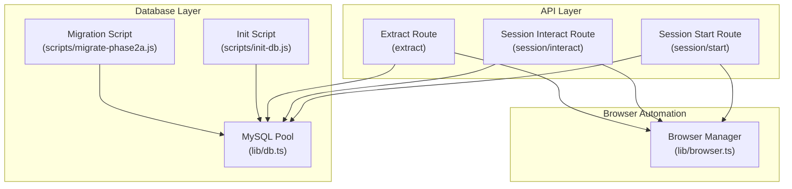
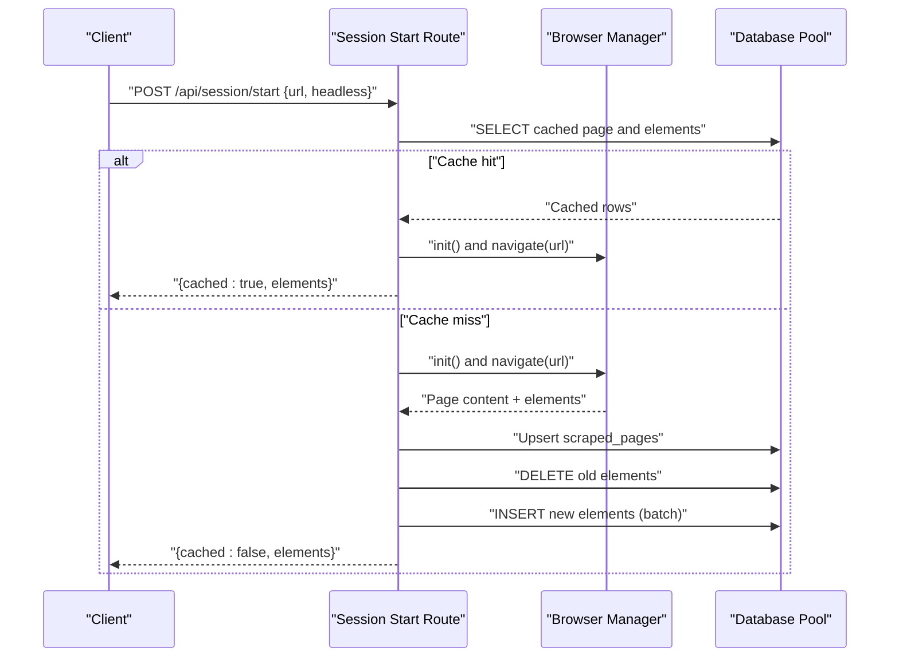
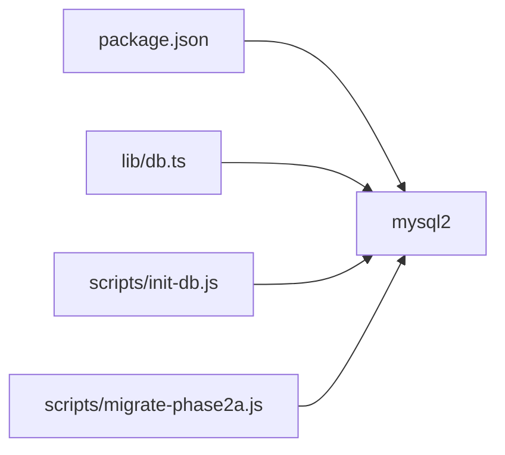
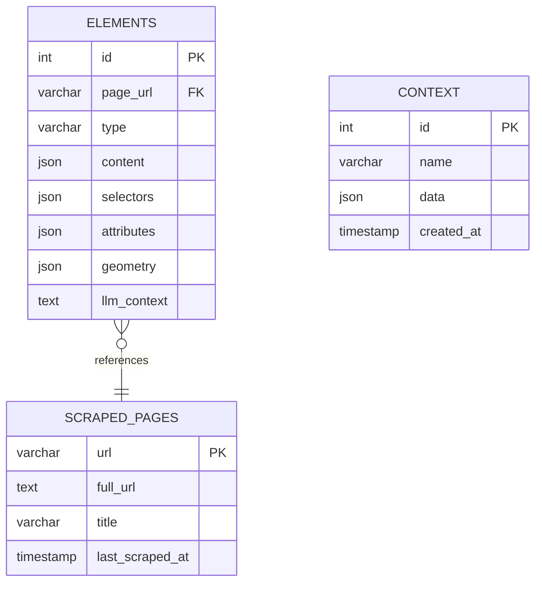

# Database Operations

<cite>
**Referenced Files in This Document**
- [db.ts](file://extraction-script/lib/db.ts)
- [init-db.js](file://extraction-script/scripts/init-db.js)
- [migrate-phase2a.js](file://extraction-script/scripts/migrate-phase2a.js)
- [route.ts](file://extraction-script/app/api/session/start/route.ts)
- [route.ts](file://extraction-script/app/api/session/interact/route.ts)
- [route.ts](file://extraction-script/app/api/extract/route.ts)
- [browser.ts](file://extraction-script/lib/browser.ts)
- [package.json](file://extraction-script/package.json)
</cite>

## Table of Contents
1. [Introduction](#introduction)
2. [Project Structure](#project-structure)
3. [Core Components](#core-components)
4. [Architecture Overview](#architecture-overview)
5. [Detailed Component Analysis](#detailed-component-analysis)
6. [Dependency Analysis](#dependency-analysis)
7. [Performance Considerations](#performance-considerations)
8. [Troubleshooting Guide](#troubleshooting-guide)
9. [Conclusion](#conclusion)
10. [Appendices](#appendices)

## Introduction
This document explains the database operations powering the extraction script system. It covers connection management with a connection pool, schema design and migrations, query execution, caching and persistence strategies, and integration with browser automation. It also addresses security, performance, and operational troubleshooting.

## Project Structure
The database layer centers around a single module that creates a MySQL connection pool and exposes a simple query function. Initialization and migration scripts set up the schema. API routes orchestrate browser automation and persist results to the database.

**Diagram sources**
- [route.ts](file://extraction-script/app/api/session/start/route.ts#L1-L97)
- [route.ts](file://extraction-script/app/api/session/interact/route.ts#L1-L77)
- [route.ts](file://extraction-script/app/api/extract/route.ts#L1-L157)
- [browser.ts](file://extraction-script/lib/browser.ts#L1-L254)
- [db.ts](file://extraction-script/lib/db.ts#L1-L105)
- [init-db.js](file://extraction-script/scripts/init-db.js#L1-L64)
- [migrate-phase2a.js](file://extraction-script/scripts/migrate-phase2a.js#L1-L41)

**Section sources**
- [db.ts](file://extraction-script/lib/db.ts#L1-L105)
- [init-db.js](file://extraction-script/scripts/init-db.js#L1-L64)
- [migrate-phase2a.js](file://extraction-script/scripts/migrate-phase2a.js#L1-L41)
- [route.ts](file://extraction-script/app/api/session/start/route.ts#L1-L97)
- [route.ts](file://extraction-script/app/api/session/interact/route.ts#L1-L77)
- [route.ts](file://extraction-script/app/api/extract/route.ts#L1-L157)
- [browser.ts](file://extraction-script/lib/browser.ts#L1-L254)
- [package.json](file://extraction-script/package.json#L1-L45)

## Core Components
- Database connection pool and schema initializer
- Query executor with schema enforcement
- Initialization and migration scripts
- API routes orchestrating browser automation and persistence
- Browser manager coordinating Playwright sessions

Key responsibilities:
- Connection pooling and configuration
- Schema creation and evolution
- Safe query execution with error logging
- Caching via database-backed page and element storage
- Transaction-like behavior using upserts and deletes

**Section sources**
- [db.ts](file://extraction-script/lib/db.ts#L1-L105)
- [init-db.js](file://extraction-script/scripts/init-db.js#L1-L64)
- [migrate-phase2a.js](file://extraction-script/scripts/migrate-phase2a.js#L1-L41)
- [route.ts](file://extraction-script/app/api/session/start/route.ts#L1-L97)
- [route.ts](file://extraction-script/app/api/session/interact/route.ts#L1-L77)
- [browser.ts](file://extraction-script/lib/browser.ts#L1-L254)

## Architecture Overview
The system integrates three layers:
- API routes receive requests, coordinate browser actions, and persist results.
- Browser manager controls a persistent Chromium instance and extracts UI elements.
- Database layer manages a MySQL pool, enforces schema, and executes queries.

**Diagram sources**
- [route.ts](file://extraction-script/app/api/session/start/route.ts#L1-L97)
- [browser.ts](file://extraction-script/lib/browser.ts#L1-L254)
- [db.ts](file://extraction-script/lib/db.ts#L1-L105)

## Detailed Component Analysis

### Database Connection Management and Pooling
- Pool configuration: connection limit, queue limits, and connection acquisition behavior are defined in the pool creation.
- Schema enforcement: a guard ensures schema existence before executing queries.
- Temporary connection: a separate connection is used to create the database if missing, then schema checks and DDL are applied via the pool.

Operational notes:
- Connection reuse reduces overhead.
- Queueing prevents overload when connections are unavailable.
- Schema checks are idempotent and safe across runs.

Security considerations:
- Hardcoded credentials are present in initialization scripts and pool configuration. Prefer environment variables for production deployments.

**Section sources**
- [db.ts](file://extraction-script/lib/db.ts#L5-L13)
- [db.ts](file://extraction-script/lib/db.ts#L17-L90)
- [init-db.js](file://extraction-script/scripts/init-db.js#L4-L10)
- [migrate-phase2a.js](file://extraction-script/scripts/migrate-phase2a.js#L4-L10)

### Database Schema Design
Tables and relationships:
- scraped_pages
  - Primary key: url (VARCHAR)
  - Fields: full_url (TEXT), title (VARCHAR), last_scraped_at (TIMESTAMP)
- elements
  - Primary key: id (AUTO_INCREMENT)
  - Fields: page_url (VARCHAR), type (VARCHAR), content (JSON), selectors (JSON), attributes (JSON), geometry (JSON), llm_context (TEXT)
  - Foreign key: page_url -> scraped_pages(url) with ON DELETE CASCADE
- context
  - Primary key: id (AUTO_INCREMENT)
  - Fields: name (VARCHAR), data (JSON), created_at (TIMESTAMP)

Constraints and indexes:
- Primary keys are implicit on url and id.
- Foreign key constraint maintains referential integrity.
- No explicit indexes are defined; consider adding indexes on frequently queried columns (e.g., page_url) for performance.

Data types:
- JSON fields store structured UI metadata.
- TEXT fields accommodate larger content.

**Section sources**
- [db.ts](file://extraction-script/lib/db.ts#L35-L68)
- [init-db.js](file://extraction-script/scripts/init-db.js#L19-L54)

### Query Management and Transactions
- Prepared statements: queries use parameterized placeholders to prevent SQL injection.
- Transaction handling: the system uses MySQL upserts and targeted deletes to maintain consistency without explicit BEGIN/COMMIT blocks.
- Batch inserts: elements are inserted in a loop for safety; consider optimizing with multi-value INSERTs or batch APIs if throughput increases.

Error handling:
- Queries log errors and rethrow exceptions to the caller.
- Migration scripts handle duplicate column errors gracefully.

**Section sources**
- [db.ts](file://extraction-script/lib/db.ts#L92-L102)
- [route.ts](file://extraction-script/app/api/session/start/route.ts#L57-L85)
- [route.ts](file://extraction-script/app/api/session/interact/route.ts#L42-L64)

### Initialization Scripts and Migration System
- Initialization script: creates the database and tables, ensuring idempotency.
- Migration script: adds the llm_context column to elements safely.

Best practices:
- Keep migrations minimal and reversible where possible.
- Use explicit checks for column existence to avoid failures on repeated runs.

**Section sources**
- [init-db.js](file://extraction-script/scripts/init-db.js#L1-L64)
- [migrate-phase2a.js](file://extraction-script/scripts/migrate-phase2a.js#L1-L41)
- [db.ts](file://extraction-script/lib/db.ts#L70-L80)

### Data Persistence Strategies and Caching
- Caching: the start route checks for cached pages and elements before scraping.
- Persistence: after successful extraction, the system upserts page metadata and replaces existing elements for that URL.
- Lifecycle: elements are deleted per URL before insertion to avoid duplication and stale data.

Integration with browser automation:
- The browser manager navigates to the target URL and extracts UI elements.
- The API routes persist the results and return them to the client.

**Section sources**
- [route.ts](file://extraction-script/app/api/session/start/route.ts#L14-L46)
- [route.ts](file://extraction-script/app/api/session/start/route.ts#L55-L85)
- [browser.ts](file://extraction-script/lib/browser.ts#L35-L46)

### Security Considerations
- SQL injection prevention: queries use parameterized parameters.
- Access control: current setup lacks user roles or row-level security; consider adding authentication and authorization at the API layer.
- Data exposure: JSON fields store sensitive UI data; consider sanitization or encryption at rest if handling PII.
- Transport security: the pool connects locally; extend to TLS and secure sockets in production.
- Secrets management: credentials are hardcoded; externalize via environment variables and secrets managers.

**Section sources**
- [db.ts](file://extraction-script/lib/db.ts#L23-L27)
- [init-db.js](file://extraction-script/scripts/init-db.js#L5-L9)
- [migrate-phase2a.js](file://extraction-script/scripts/migrate-phase2a.js#L5-L9)

### Practical Examples
- Initialize database and schema:
  - Run the initialization script to create the database and tables.
  - Example invocation: node scripts/init-db.js
- Apply migration:
  - Run the migration script to add llm_context column.
  - Example invocation: node scripts/migrate-phase2a.js
- Start a session and cache:
  - Send a POST request to /api/session/start with url and optional headless flag.
  - On cache hit, the response includes cached elements; on miss, the system scrapes and persists results.
- Perform an interaction:
  - Send a POST request to /api/session/interact with selector, action (click/fill), and optional value.
  - The system re-extracts and updates the database with the new state.

**Section sources**
- [init-db.js](file://extraction-script/scripts/init-db.js#L1-L64)
- [migrate-phase2a.js](file://extraction-script/scripts/migrate-phase2a.js#L1-L41)
- [route.ts](file://extraction-script/app/api/session/start/route.ts#L1-L97)
- [route.ts](file://extraction-script/app/api/session/interact/route.ts#L1-L77)

## Dependency Analysis
External dependencies relevant to database operations:
- mysql2: provides the MySQL driver and connection pooling.
- Environment: the pool configuration and scripts assume local MySQL availability.

**Diagram sources**
- [package.json](file://extraction-script/package.json#L24-L24)
- [db.ts](file://extraction-script/lib/db.ts#L2-L2)
- [init-db.js](file://extraction-script/scripts/init-db.js#L2-L2)
- [migrate-phase2a.js](file://extraction-script/scripts/migrate-phase2a.js#L2-L2)

**Section sources**
- [package.json](file://extraction-script/package.json#L1-L45)
- [db.ts](file://extraction-script/lib/db.ts#L1-L105)
- [init-db.js](file://extraction-script/scripts/init-db.js#L1-L64)
- [migrate-phase2a.js](file://extraction-script/scripts/migrate-phase2a.js#L1-L41)

## Performance Considerations
- Connection pool sizing: adjust connectionLimit and queueLimit based on workload and database capacity.
- Query batching: consider switching from a loop of INSERTs to a single multi-value INSERT for higher throughput.
- Indexes: add indexes on foreign keys and frequently filtered columns (e.g., page_url) to improve join performance.
- JSON field sizes: large JSON payloads increase storage and transfer costs; consider truncation or compression if needed.
- Browser timeouts: tune page load and element interaction timeouts to balance responsiveness and reliability.

[No sources needed since this section provides general guidance]

## Troubleshooting Guide
Common issues and resolutions:
- Connection refused or access denied:
  - Verify MySQL service is running and credentials are correct.
  - Use the initialization script to create the database and tables.
- Duplicate column errors during migration:
  - The migration script handles duplicate column errors; rerun if necessary.
- Schema not found:
  - Ensure schema initialization has been executed; the pool’s schema checker runs on first query.
- Slow inserts:
  - Switch to batched inserts or reduce payload sizes.
- Cache inconsistencies:
  - Force refresh by passing the appropriate flag to bypass cache.

**Section sources**
- [db.ts](file://extraction-script/lib/db.ts#L85-L90)
- [migrate-phase2a.js](file://extraction-script/scripts/migrate-phase2a.js#L25-L31)
- [route.ts](file://extraction-script/app/api/session/start/route.ts#L14-L46)

## Conclusion
The extraction script system employs a straightforward, robust database design with a connection pool, schema initialization, and migration support. API routes integrate browser automation with database persistence, offering a caching mechanism and safe query execution. For production, prioritize environment-based configuration, access control, transport security, and performance tuning.

[No sources needed since this section summarizes without analyzing specific files]

## Appendices

### Data Model Diagram

**Diagram sources**
- [db.ts](file://extraction-script/lib/db.ts#L35-L68)
- [init-db.js](file://extraction-script/scripts/init-db.js#L19-L54)