# Extraction Script System

<cite>
**Referenced Files in This Document**
- [package.json](file://extraction-script/package.json)
- [next.config.ts](file://extraction-script/next.config.ts)
- [db.ts](file://extraction-script/lib/db.ts)
- [browser.ts](file://extraction-script/lib/browser.ts)
- [llm.ts](file://extraction-script/lib/llm.ts)
- [init-db.js](file://extraction-script/scripts/init-db.js)
- [migrate-phase2.js](file://extraction-script/scripts/migrate-phase2.js)
- [migrate-phase2a.js](file://extraction-script/scripts/migrate-phase2a.js)
- [route.ts (extract)](file://extraction-script/app/api/extract/route.ts)
- [route.ts (session/start)](file://extraction-script/app/api/session/start/route.ts)
- [route.ts (session/interact)](file://extraction-script/app/api/session/interact/route.ts)
- [route.ts (ai/enrich)](file://extraction-script/app/api/ai/enrich/route.ts)
- [route.ts (history)](file://extraction-script/app/api/history/route.ts)
- [route.ts (history/check)](file://extraction-script/app/api/history/check/route.ts)
- [CachePopup.tsx](file://extraction-script/components/CachePopup.tsx)
- [HistoryPanel.tsx](file://extraction-script/components/HistoryPanel.tsx)
- [page.tsx](file://extraction-script/app/page.tsx)
- [agent.ts (primary)](file://extraction-script/primary_agent/agent.ts)
- [agent.ts (secondary)](file://extraction-script/secondary_agent/agent.ts)
- [context-manager.ts](file://extraction-script/secondary_agent/context-manager.ts)
- [action-executor.ts](file://extraction-script/secondary_agent/action-executor.ts)
- [types.ts (shared)](file://extraction-script/shared/types.ts)
- [types.ts (primary)](file://extraction-script/primary_agent/types.ts)
- [types.ts (secondary)](file://extraction-script/secondary_agent/types.ts)
- [utils.ts](file://extraction-script/lib/utils.ts)
</cite>

## Update Summary
**Changes Made**
- Added comprehensive history tracking system with new API endpoints and database tables
- Enhanced cache management with new UI components (CachePopup and HistoryPanel)
- Expanded AI enrichment capabilities with improved LLM integration and analysis logging
- Improved session management with cache checking functionality and enhanced status tracking
- Added new database tables for scraping history and AI analysis logging
- Enhanced database schema with AI enrichment tracking columns

## Table of Contents
1. [Introduction](#introduction)
2. [Project Structure](#project-structure)
3. [Core Components](#core-components)
4. [Architecture Overview](#architecture-overview)
5. [Detailed Component Analysis](#detailed-component-analysis)
6. [Dependency Analysis](#dependency-analysis)
7. [Performance Considerations](#performance-considerations)
8. [Troubleshooting Guide](#troubleshooting-guide)
9. [Conclusion](#conclusion)
10. [Appendices](#appendices)

## Introduction
This document describes the Extraction Script System built with Next.js. It covers the API endpoints for extraction and interactive sessions, database integration and schema design, browser automation capabilities, initialization and migration scripts, data processing workflows, error handling, performance optimization, integration patterns with the Ghost Pilot system, and security and validation considerations. The system supports page scraping, element extraction, content analysis, automated interactions with a persistent browser session backed by a MySQL database, comprehensive history tracking, enhanced cache management with UI components, and expanded AI enrichment capabilities.

## Project Structure
The system is organized into:
- Next.js application under extraction-script with API routes, libraries, agents, components, and scripts
- Primary and secondary agent modules for intent recognition and action execution
- Shared types for cross-module contracts
- Scripts for database initialization and migrations
- New UI components for cache management and history tracking

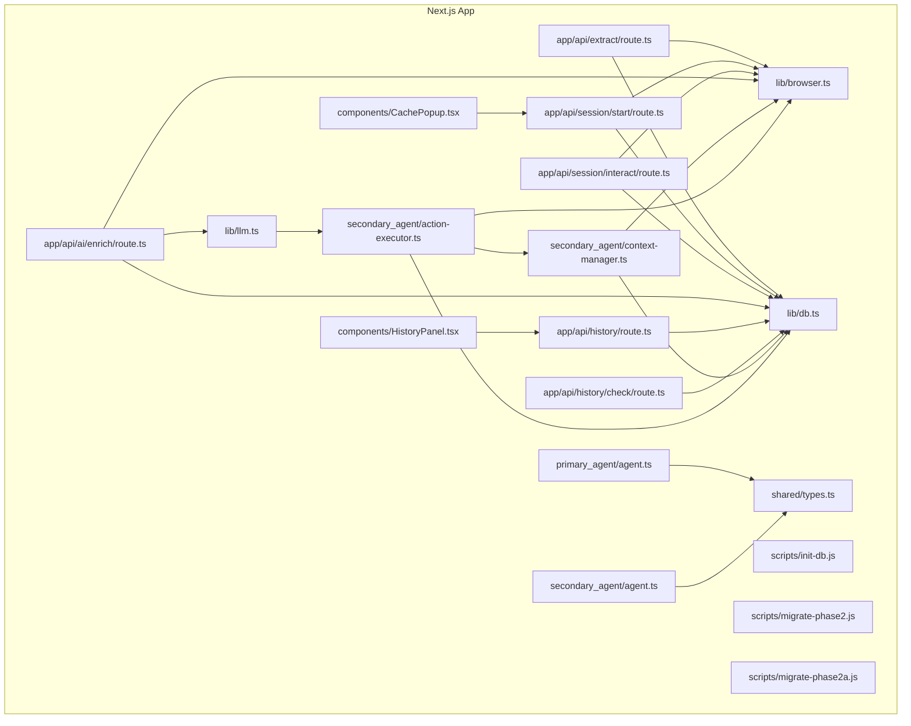

**Diagram sources**
- [route.ts (extract):1-157](file://extraction-script/app/api/extract/route.ts#L1-L157)
- [route.ts (session/start):1-134](file://extraction-script/app/api/session/start/route.ts#L1-L134)
- [route.ts (session/interact):1-77](file://extraction-script/app/api/session/interact/route.ts#L1-L77)
- [route.ts (ai/enrich):1-133](file://extraction-script/app/api/ai/enrich/route.ts#L1-L133)
- [route.ts (history):1-97](file://extraction-script/app/api/history/route.ts#L1-L97)
- [route.ts (history/check):1-65](file://extraction-script/app/api/history/check/route.ts#L1-L65)
- [db.ts:1-179](file://extraction-script/lib/db.ts#L1-L179)
- [browser.ts:1-254](file://extraction-script/lib/browser.ts#L1-L254)
- [llm.ts:1-73](file://extraction-script/lib/llm.ts#L1-L73)
- [types.ts (shared):1-85](file://extraction-script/shared/types.ts#L1-L85)
- [agent.ts (primary):1-106](file://extraction-script/primary_agent/agent.ts#L1-L106)
- [agent.ts (secondary):1-119](file://extraction-script/secondary_agent/agent.ts#L1-L119)
- [context-manager.ts:1-183](file://extraction-script/secondary_agent/context-manager.ts#L1-L183)
- [action-executor.ts:1-359](file://extraction-script/secondary_agent/action-executor.ts#L1-L359)
- [CachePopup.tsx:1-176](file://extraction-script/components/CachePopup.tsx#L1-L176)
- [HistoryPanel.tsx:1-291](file://extraction-script/components/HistoryPanel.tsx#L1-L291)
- [init-db.js:1-64](file://extraction-script/scripts/init-db.js#L1-L64)
- [migrate-phase2.js:1-199](file://extraction-script/scripts/migrate-phase2.js#L1-L199)
- [migrate-phase2a.js:1-41](file://extraction-script/scripts/migrate-phase2a.js#L1-L41)

**Section sources**
- [package.json:1-45](file://extraction-script/package.json#L1-L45)
- [next.config.ts:1-8](file://extraction-script/next.config.ts#L1-L8)

## Core Components
- API Endpoints
  - POST /api/extract: Extract interactive elements from a URL using a temporary browser instance
  - POST /api/session/start: Start a persistent session, cache results, and initialize a browser manager
  - POST /api/session/interact: Perform click/fill interactions and re-extract page state
  - POST /api/ai/enrich: Enhanced AI enrichment with LLM context analysis
  - GET /api/history: Comprehensive history tracking with filtering and pagination
  - GET /api/history/check: Cache checking functionality for URL status
- Database Layer
  - Connection pooling, schema verification, and CRUD helpers
  - Tables: scraped_pages, elements, context, scraping_history, ai_analysis_log
- Browser Management
  - Singleton browser manager with navigation, clicks, fills, scrolling, and content extraction
- Agents
  - Primary agent: intent recognition and instruction translation
  - Secondary agent: context understanding and action execution
- LLM Integration
  - Enhanced element enrichment via local LLM for contextual descriptions with analysis logging
- UI Components
  - CachePopup: Dismissible notification with cache details and actions
  - HistoryPanel: Comprehensive history tracking interface with filtering and pagination
- Initialization and Migration
  - Scripts to create database and tables, and to add new columns safely

**Section sources**
- [route.ts (extract):1-157](file://extraction-script/app/api/extract/route.ts#L1-L157)
- [route.ts (session/start):1-134](file://extraction-script/app/api/session/start/route.ts#L1-L134)
- [route.ts (session/interact):1-77](file://extraction-script/app/api/session/interact/route.ts#L1-L77)
- [route.ts (ai/enrich):1-133](file://extraction-script/app/api/ai/enrich/route.ts#L1-L133)
- [route.ts (history):1-97](file://extraction-script/app/api/history/route.ts#L1-L97)
- [route.ts (history/check):1-65](file://extraction-script/app/api/history/check/route.ts#L1-L65)
- [db.ts:1-179](file://extraction-script/lib/db.ts#L1-L179)
- [browser.ts:1-254](file://extraction-script/lib/browser.ts#L1-L254)
- [agent.ts (primary):1-106](file://extraction-script/primary_agent/agent.ts#L1-L106)
- [agent.ts (secondary):1-119](file://extraction-script/secondary_agent/agent.ts#L1-L119)
- [context-manager.ts:1-183](file://extraction-script/secondary_agent/context-manager.ts#L1-L183)
- [action-executor.ts:1-359](file://extraction-script/secondary_agent/action-executor.ts#L1-L359)
- [llm.ts:1-73](file://extraction-script/lib/llm.ts#L1-L73)
- [CachePopup.tsx:1-176](file://extraction-script/components/CachePopup.tsx#L1-L176)
- [HistoryPanel.tsx:1-291](file://extraction-script/components/HistoryPanel.tsx#L1-L291)
- [init-db.js:1-64](file://extraction-script/scripts/init-db.js#L1-L64)
- [migrate-phase2.js:1-199](file://extraction-script/scripts/migrate-phase2.js#L1-L199)
- [migrate-phase2a.js:1-41](file://extraction-script/scripts/migrate-phase2a.js#L1-L41)

## Architecture Overview
The system orchestrates extraction and interaction through Next.js API routes, backed by a MySQL database and a Playwright-managed browser. The primary agent translates user intent into structured instructions, while the secondary agent executes them against the current page state, persisting results to the database. The enhanced system now includes comprehensive history tracking, cache management UI components, and expanded AI enrichment capabilities with analysis logging.

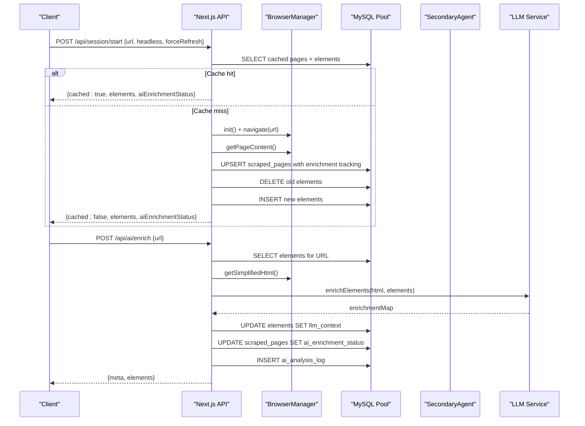

**Diagram sources**
- [route.ts (session/start):1-134](file://extraction-script/app/api/session/start/route.ts#L1-L134)
- [route.ts (ai/enrich):1-133](file://extraction-script/app/api/ai/enrich/route.ts#L1-L133)
- [browser.ts:1-254](file://extraction-script/lib/browser.ts#L1-L254)
- [db.ts:1-179](file://extraction-script/lib/db.ts#L1-L179)
- [llm.ts:1-73](file://extraction-script/lib/llm.ts#L1-L73)

## Detailed Component Analysis

### Database Integration and Schema
- Connection Pooling
  - Uses mysql2 promise pool with connection limits and queue behavior
  - Centralized query helper wraps SQL execution and error logging
- Enhanced Schema Design
  - scraped_pages: stores canonical URL, optional full URL, title, timestamps, AI enrichment tracking, and scrape statistics
  - elements: stores per-page interactive elements with JSON fields for content, selectors, attributes, geometry, and LLM context
  - context: generic storage for arbitrary JSON context with updated timestamps
  - scraping_history: tracks all scraping events with action types and element counts
  - ai_analysis_log: comprehensive logging of AI enrichment runs with success metrics
- Schema Evolution
  - Automatic schema verification on first query
  - Migration scripts add new columns and tables safely
  - Backfill existing data with enrichment status calculations

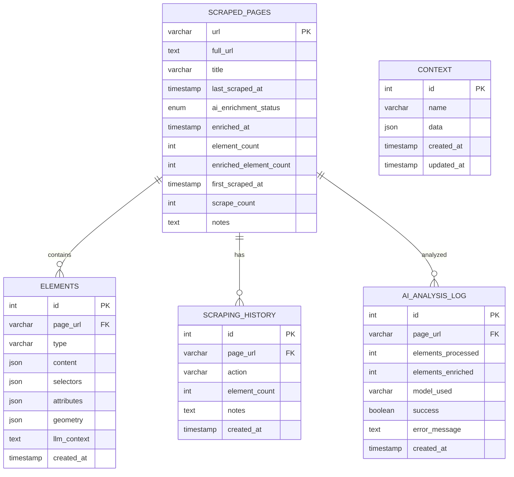

**Diagram sources**
- [db.ts:35-155](file://extraction-script/lib/db.ts#L35-L155)
- [init-db.js:19-54](file://extraction-script/scripts/init-db.js#L19-L54)
- [migrate-phase2.js:27-106](file://extraction-script/scripts/migrate-phase2.js#L27-L106)

**Section sources**
- [db.ts:1-179](file://extraction-script/lib/db.ts#L1-L179)
- [init-db.js:1-64](file://extraction-script/scripts/init-db.js#L1-L64)
- [migrate-phase2.js:1-199](file://extraction-script/scripts/migrate-phase2.js#L1-L199)
- [migrate-phase2a.js:1-41](file://extraction-script/scripts/migrate-phase2a.js#L1-L41)

### Browser Automation Capabilities
- Singleton BrowserManager
  - Launches Chromium, manages context and page lifecycle
  - Provides navigation, click, fill, scroll, and content extraction
  - Simplifies HTML for LLM enrichment by removing clutter and truncating text
- Robustness
  - Default timeouts, load state waits, and error propagation
  - Session recovery for interactive mode

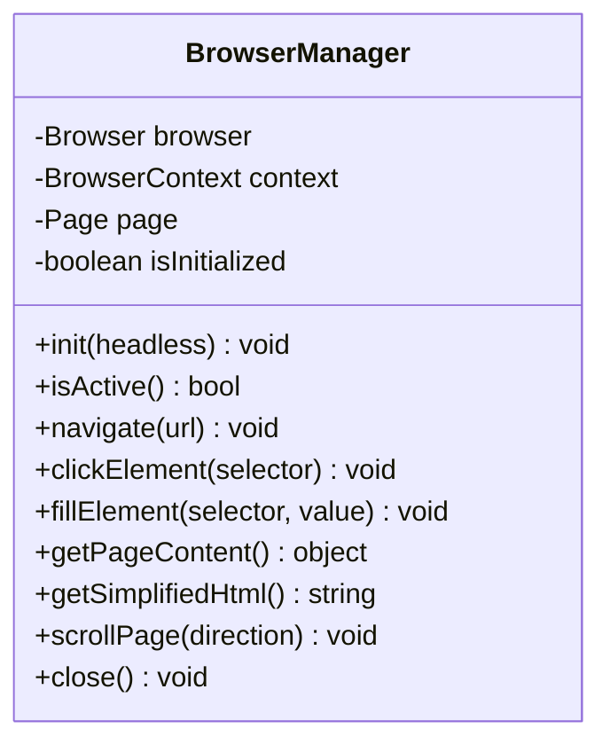

**Diagram sources**
- [browser.ts:4-246](file://extraction-script/lib/browser.ts#L4-L246)

**Section sources**
- [browser.ts:1-254](file://extraction-script/lib/browser.ts#L1-L254)

### API Workflows

#### POST /api/extract
- Purpose: One-off extraction using a fresh browser instance
- Behavior:
  - Validates URL
  - Launches headless Chromium, navigates, waits, extracts elements with CSS/XPath/id selectors, attributes, and geometry
  - Returns structured elements and metadata

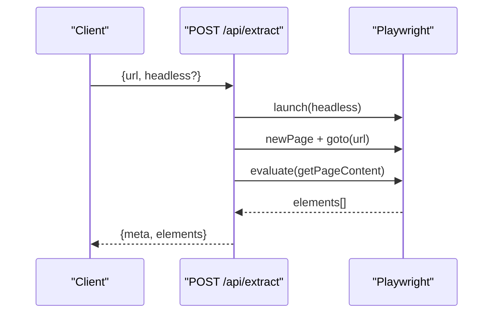

**Diagram sources**
- [route.ts (extract):14-157](file://extraction-script/app/api/extract/route.ts#L14-L157)

**Section sources**
- [route.ts (extract):1-157](file://extraction-script/app/api/extract/route.ts#L1-L157)

#### POST /api/session/start
- Purpose: Persistent session with caching, database persistence, and enhanced AI tracking
- Behavior:
  - Optional forceRefresh bypasses cache
  - Checks cache in scraped_pages and elements with enrichment status calculation
  - Initializes BrowserManager, navigates, extracts, upserts page with enrichment tracking, clears and inserts elements
  - Returns elements with cache metadata and AI enrichment status

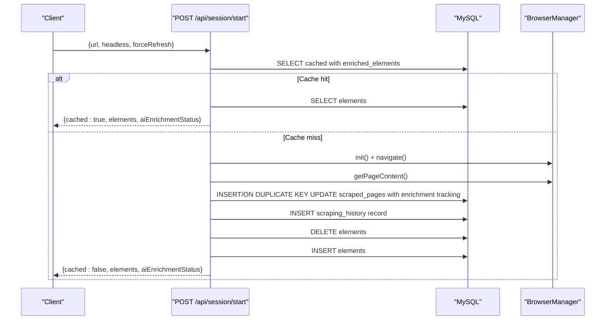

**Diagram sources**
- [route.ts (session/start):14-127](file://extraction-script/app/api/session/start/route.ts#L14-L127)
- [browser.ts:20-53](file://extraction-script/lib/browser.ts#L20-L53)
- [db.ts:79-92](file://extraction-script/lib/db.ts#L79-L92)

**Section sources**
- [route.ts (session/start):1-134](file://extraction-script/app/api/session/start/route.ts#L1-L134)

#### POST /api/session/interact
- Purpose: Interactive actions (click/fill) with re-extraction and DB update
- Behavior:
  - Recovers session if browser is inactive
  - Performs action, re-extracts page, upserts page and elements, returns results

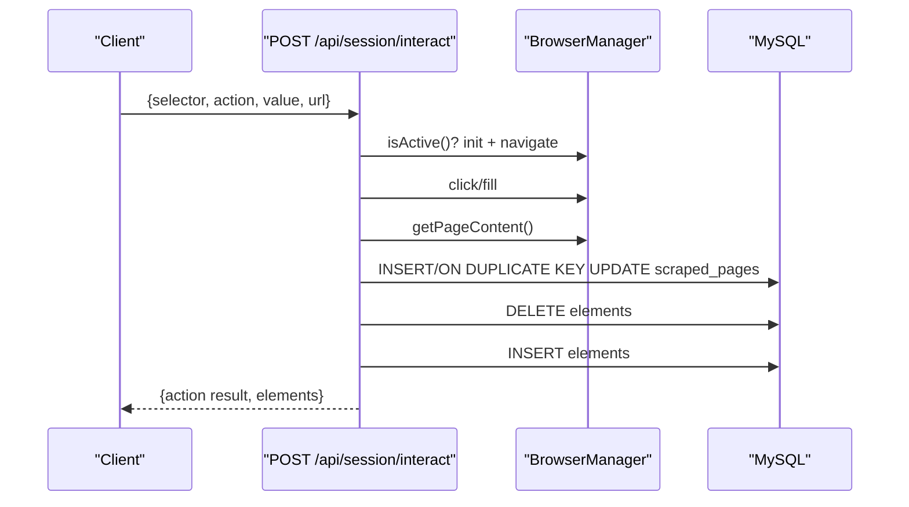

**Diagram sources**
- [route.ts (session/interact):6-76](file://extraction-script/app/api/session/interact/route.ts#L6-L76)
- [browser.ts:48-73](file://extraction-script/lib/browser.ts#L48-L73)
- [db.ts:92-102](file://extraction-script/lib/db.ts#L92-L102)

**Section sources**
- [route.ts (session/interact):1-77](file://extraction-script/app/api/session/interact/route.ts#L1-L77)

#### POST /api/ai/enrich
- Purpose: Enhanced AI enrichment with comprehensive LLM integration and analysis logging
- Behavior:
  - Retrieves elements from database and parses JSON fields
  - Gets simplified HTML from browser manager
  - Calls LLM service to enrich elements with contextual descriptions
  - Updates database with enrichment results and status tracking
  - Logs analysis attempts to ai_analysis_log table
  - Returns updated elements with enrichment metadata

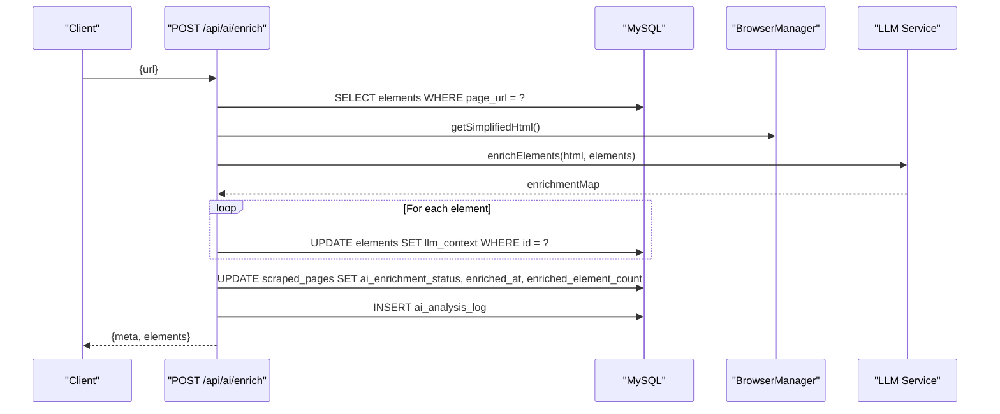

**Diagram sources**
- [route.ts (ai/enrich):7-112](file://extraction-script/app/api/ai/enrich/route.ts#L7-L112)
- [llm.ts:9-72](file://extraction-script/lib/llm.ts#L9-L72)
- [db.ts:92-104](file://extraction-script/lib/db.ts#L92-L104)

**Section sources**
- [route.ts (ai/enrich):1-133](file://extraction-script/app/api/ai/enrich/route.ts#L1-L133)

#### GET /api/history
- Purpose: Comprehensive history tracking with filtering, pagination, and analysis logging
- Behavior:
  - Supports search by URL/title, enrichment status filtering, pagination
  - Aggregates page statistics and current element counts
  - Joins with ai_analysis_log for latest analysis information
  - Returns paginated history with metadata

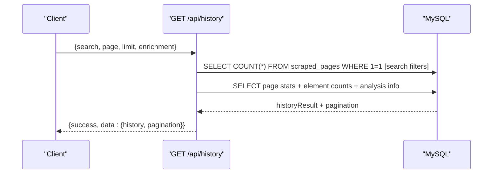

**Diagram sources**
- [route.ts (history):4-90](file://extraction-script/app/api/history/route.ts#L4-L90)

**Section sources**
- [route.ts (history):1-97](file://extraction-script/app/api/history/route.ts#L1-L97)

#### GET /api/history/check
- Purpose: Cache checking functionality for URL status and enrichment details
- Behavior:
  - Normalizes URL (removes trailing slash)
  - Checks both exact and normalized URL matches
  - Calculates enrichment status from existing llm_context data
  - Returns comprehensive cache information

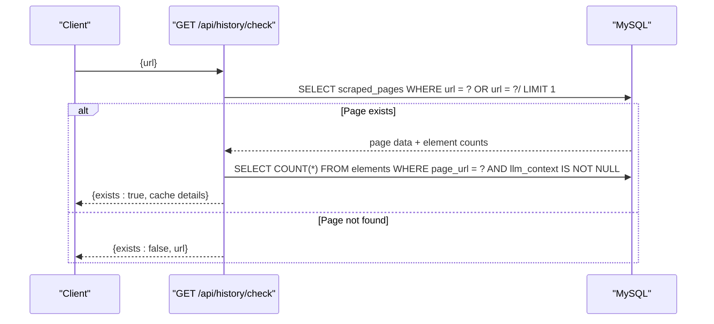

**Diagram sources**
- [route.ts (history/check):4-58](file://extraction-script/app/api/history/check/route.ts#L4-L58)

**Section sources**
- [route.ts (history/check):1-65](file://extraction-script/app/api/history/check/route.ts#L1-L65)

### Data Processing Workflows
- Extraction Pipeline
  - Visibility checks, CSS/XPath/id selector generation, geometry calculation, content truncation
  - JSON serialization for persistence
- Enhanced Caching Strategy
  - Cache lookup by URL with enrichment status calculation
  - On miss, scrape and persist with enhanced tracking; on hit, serve cached elements with AI status
- AI Enrichment Pipeline
  - Element retrieval with JSON parsing, simplified HTML extraction
  - LLM context analysis with fallback matching strategies (CSS, ID, index)
  - Database updates with enrichment status tracking and analysis logging
- History Tracking
  - Comprehensive scraping event logging with action types and element counts
  - AI analysis run tracking with success metrics and error logging

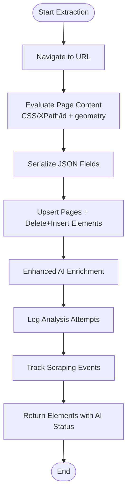

**Diagram sources**
- [route.ts (session/start):67-127](file://extraction-script/app/api/session/start/route.ts#L67-L127)
- [route.ts (ai/enrich):15-112](file://extraction-script/app/api/ai/enrich/route.ts#L15-L112)
- [browser.ts:125-215](file://extraction-script/lib/browser.ts#L125-L215)

**Section sources**
- [browser.ts:75-215](file://extraction-script/lib/browser.ts#L75-L215)
- [llm.ts:9-72](file://extraction-script/lib/llm.ts#L9-L72)
- [route.ts (ai/enrich):1-133](file://extraction-script/app/api/ai/enrich/route.ts#L1-L133)

### UI Components and Cache Management

#### CachePopup Component
- Dismissible notification showing cache details and actions
- Displays title, URL, element counts, AI enrichment status, and scrape count
- Provides actions: View History, Force Refresh
- Animated entrance/exit with framer-motion

#### HistoryPanel Component
- Comprehensive history tracking interface with filtering and pagination
- Search by URL or title with debounced input
- Filter pills for AI enrichment status (All, Fully Analyzed, Partial, Not Analyzed)
- Paginated results with navigation controls
- Detailed page cards showing title, URL, element stats, timestamps, and actions

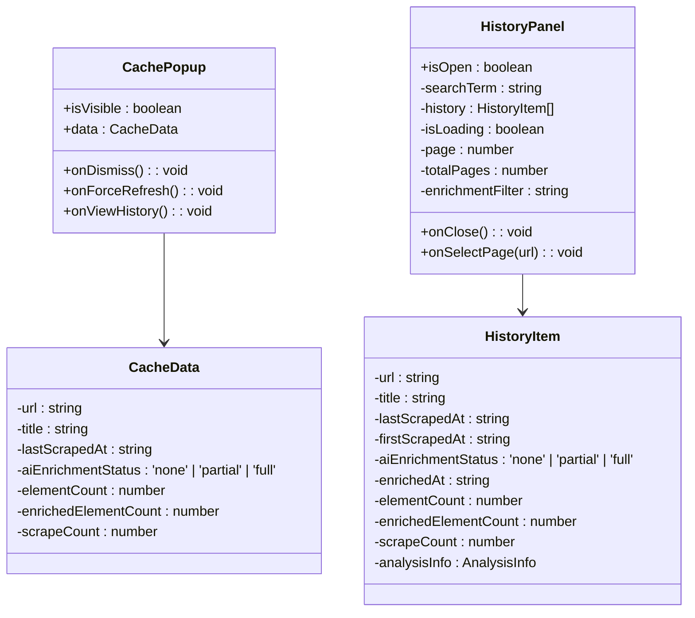

**Diagram sources**
- [CachePopup.tsx:8-22](file://extraction-script/components/CachePopup.tsx#L8-L22)
- [HistoryPanel.tsx:28-32](file://extraction-script/components/HistoryPanel.tsx#L28-L32)

**Section sources**
- [CachePopup.tsx:1-176](file://extraction-script/components/CachePopup.tsx#L1-L176)
- [HistoryPanel.tsx:1-291](file://extraction-script/components/HistoryPanel.tsx#L1-L291)
- [page.tsx:141-180](file://extraction-script/app/page.tsx#L141-L180)

### Agent Integration Patterns
- Primary Agent
  - Recognizes user intent and generates structured instructions for the secondary agent
- Secondary Agent
  - Manages context (current page, available elements, DB schema)
  - Executes actions (navigate, click, fill, extract, wait, scroll)
  - Persists outcomes to the database
- Communication Contracts
  - Shared types define instructions, context, and page elements

**Diagram sources**
- [agent.ts (primary):9-104](file://extraction-script/primary_agent/agent.ts#L9-L104)
- [agent.ts (secondary):9-118](file://extraction-script/secondary_agent/agent.ts#L9-L118)
- [context-manager.ts:11-181](file://extraction-script/secondary_agent/context-manager.ts#L11-L181)
- [action-executor.ts:16-357](file://extraction-script/secondary_agent/action-executor.ts#L16-L357)
- [types.ts (shared):3-85](file://extraction-script/shared/types.ts#L3-L85)
- [types.ts (primary):5-32](file://extraction-script/primary_agent/types.ts#L5-L32)
- [types.ts (secondary):5-37](file://extraction-script/secondary_agent/types.ts#L5-L37)

**Section sources**
- [agent.ts (primary):1-106](file://extraction-script/primary_agent/agent.ts#L1-L106)
- [agent.ts (secondary):1-119](file://extraction-script/secondary_agent/agent.ts#L1-L119)
- [context-manager.ts:1-183](file://extraction-script/secondary_agent/context-manager.ts#L1-L183)
- [action-executor.ts:1-359](file://extraction-script/secondary_agent/action-executor.ts#L1-L359)
- [types.ts (shared):1-85](file://extraction-script/shared/types.ts#L1-L85)
- [types.ts (primary):1-32](file://extraction-script/primary_agent/types.ts#L1-L32)
- [types.ts (secondary):1-37](file://extraction-script/secondary_agent/types.ts#L1-L37)

### Initialization and Migration Scripts
- init-db.js
  - Creates database and tables (context, scraped_pages, elements)
- migrate-phase2.js
  - Creates new tables (scraping_history, ai_analysis_log)
  - Adds AI enrichment tracking columns to scraped_pages
  - Backfills element counts and enrichment status from existing data
  - Creates initial history entries for existing pages
- migrate-phase2a.js
  - Adds llm_context column to elements table if missing

**Section sources**
- [init-db.js:1-64](file://extraction-script/scripts/init-db.js#L1-L64)
- [migrate-phase2.js:1-199](file://extraction-script/scripts/migrate-phase2.js#L1-L199)
- [migrate-phase2a.js:1-41](file://extraction-script/scripts/migrate-phase2a.js#L1-L41)

## Dependency Analysis
- External Dependencies
  - Next.js runtime and React
  - Playwright for browser automation
  - mysql2 for database connectivity
  - OpenAI SDK for local LLM integration
  - Framer Motion for animations
  - Lucide React for icons
- Internal Dependencies
  - API routes depend on lib/browser, lib/db, and lib/llm
  - UI components depend on Next.js routing and state management
  - Secondary agent depends on ContextManager and ActionExecutor
  - Shared types unify contracts across modules

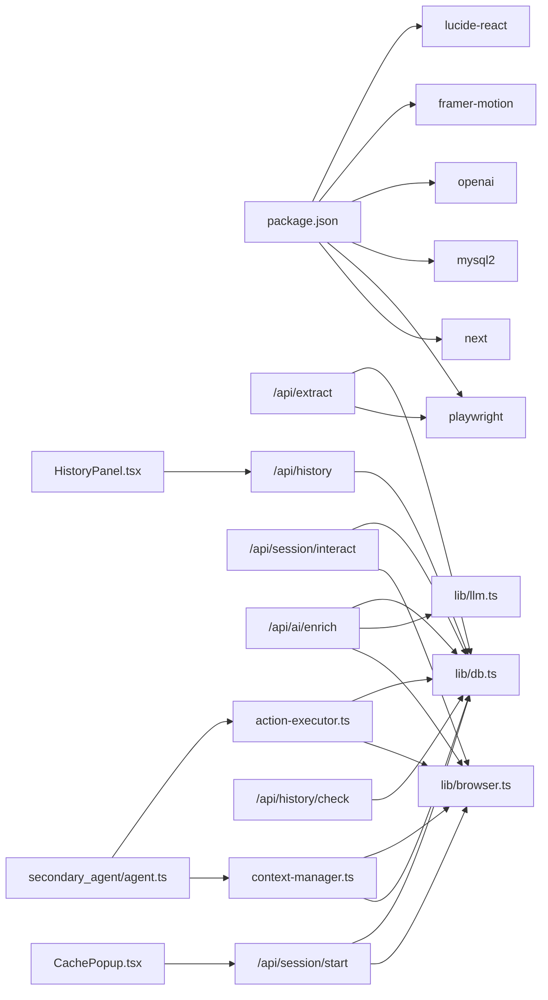

**Diagram sources**
- [package.json:12-31](file://extraction-script/package.json#L12-L31)
- [route.ts (extract):2-3](file://extraction-script/app/api/extract/route.ts#L2-L3)
- [route.ts (session/start):3-4](file://extraction-script/app/api/session/start/route.ts#L3-L4)
- [route.ts (session/interact):3-4](file://extraction-script/app/api/session/interact/route.ts#L3-L4)
- [route.ts (ai/enrich):3-5](file://extraction-script/app/api/ai/enrich/route.ts#L3-L5)
- [route.ts (history)](file://extraction-script/app/api/history/route.ts#L2)
- [route.ts (history/check)](file://extraction-script/app/api/history/check/route.ts#L2)
- [browser.ts](file://extraction-script/lib/browser.ts#L2)
- [db.ts](file://extraction-script/lib/db.ts#L2)
- [llm.ts](file://extraction-script/lib/llm.ts#L2)
- [agent.ts (secondary):4-6](file://extraction-script/secondary_agent/agent.ts#L4-L6)
- [context-manager.ts:6-9](file://extraction-script/secondary_agent/context-manager.ts#L6-L9)
- [action-executor.ts:4-9](file://extraction-script/secondary_agent/action-executor.ts#L4-L9)
- [CachePopup.tsx:3-4](file://extraction-script/components/CachePopup.tsx#L3-L4)
- [HistoryPanel.tsx:4-8](file://extraction-script/components/HistoryPanel.tsx#L4-L8)

**Section sources**
- [package.json:1-45](file://extraction-script/package.json#L1-L45)

## Performance Considerations
- Browser
  - Headless mode reduces overhead; adjust headless flag per environment
  - Reuse singleton BrowserManager to avoid repeated launches
  - Use targeted waits and load states; avoid excessive timeouts
- Database
  - Connection pooling prevents resource exhaustion
  - Prefer batch inserts and upserts; minimize round-trips
  - Index URL fields for fast lookups
  - New AI enrichment tracking columns optimize queries
- Extraction
  - Simplify HTML before LLM enrichment to reduce token usage
  - Limit element counts or batch processing for large pages
- Caching
  - Use cache-first strategy for repeated URLs to cut down on scraping costs
  - Enhanced cache checking with URL normalization improves accuracy
- AI Enrichment
  - Batch processing of elements with fallback matching strategies
  - Comprehensive analysis logging enables performance monitoring
- UI Components
  - Debounced search inputs prevent excessive API calls
  - Pagination reduces memory usage for large histories

## Troubleshooting Guide
- Database
  - Schema not initialized: Run init-db.js to create database and tables
  - Missing columns: Run migrate-phase2.js to add AI enrichment tracking and new tables
  - Column missing: Run migrate-phase2a.js to add llm_context
  - Connection errors: Verify host, user, password, and database name
- Browser
  - "Browser not initialized": Ensure init() is called before navigation
  - Navigation failures: Increase timeouts or wait for network idle
  - Selector errors: Improve selectors using LLM-based suggestions
- API
  - Missing URL: Ensure request body includes url
  - Session lost: Re-init browser with stored URL
  - Cache check failures: Verify URL normalization logic
- LLM
  - JSON parsing errors: Clean markdown blocks from LLM output
  - Local server unreachable: Confirm baseURL and port for local LLM
  - Enrichment failures: Check ai_analysis_log table for error details
- UI Components
  - Cache popup not showing: Verify cache check endpoint returns valid data
  - History panel empty: Check pagination parameters and search filters
- AI Analysis Logging
  - Missing analysis logs: Ensure ai_analysis_log table exists and is properly populated
  - Inaccurate enrichment status: Verify backfill process completed successfully

**Section sources**
- [init-db.js:1-64](file://extraction-script/scripts/init-db.js#L1-L64)
- [migrate-phase2.js:1-199](file://extraction-script/scripts/migrate-phase2.js#L1-L199)
- [migrate-phase2a.js:1-41](file://extraction-script/scripts/migrate-phase2a.js#L1-L41)
- [db.ts:17-157](file://extraction-script/lib/db.ts#L17-L157)
- [browser.ts:20-73](file://extraction-script/lib/browser.ts#L20-L73)
- [route.ts (session/interact):13-23](file://extraction-script/app/api/session/interact/route.ts#L13-L23)
- [llm.ts:56-72](file://extraction-script/lib/llm.ts#L56-L72)
- [route.ts (history/check):9-13](file://extraction-script/app/api/history/check/route.ts#L9-L13)
- [route.ts (ai/enrich):114-131](file://extraction-script/app/api/ai/enrich/route.ts#L114-L131)

## Conclusion
The Extraction Script System integrates Next.js APIs, a MySQL-backed persistence layer, and Playwright-driven browser automation to support robust extraction and interaction workflows. The enhanced system now includes comprehensive history tracking, cache management UI components, and expanded AI enrichment capabilities with analysis logging. The primary and secondary agents coordinate intent and action execution, while initialization and migration scripts keep the database schema consistent. With careful attention to caching, timeouts, LLM prompts, and comprehensive tracking, the system delivers scalable and maintainable automation with rich observability and user experience features.

## Appendices

### API Definitions
- POST /api/extract
  - Request: { url: string, headless?: boolean }
  - Response: { meta: { source_url: string, timestamp: string }, elements: [...] }
- POST /api/session/start
  - Request: { url: string, headless?: boolean, forceRefresh?: boolean }
  - Response: { meta: { source_url: string, cached?: boolean, timestamp: string, title: string, aiEnrichmentStatus: string, enrichedCount: number, totalElements: number, firstScrapedAt: string, scrapeCount: number }, elements: [...] }
- POST /api/session/interact
  - Request: { selector: string, action: 'click' | 'fill', value?: string, url?: string }
  - Response: { meta: { source_url: string, action: string, timestamp: string }, elements: [...] }
- POST /api/ai/enrich
  - Request: { url: string }
  - Response: { meta: { source_url: string, enriched: boolean, aiEnrichmentStatus: string, enrichedCount: number, totalElements: number }, elements: [...] }
- GET /api/history
  - Request: { search?: string, page?: number, limit?: number, enrichment?: 'none' | 'partial' | 'full' }
  - Response: { success: boolean, data: { history: [], pagination: { page: number, limit: number, total: number, totalPages: number } } }
- GET /api/history/check
  - Request: { url: string }
  - Response: { success: boolean, data: { exists: boolean, url: string, title: string, lastScrapedAt: string, firstScrapedAt: string, aiEnrichmentStatus: string, enrichedAt: string, elementCount: number, enrichedElementCount: number, scrapeCount: number } }

**Section sources**
- [route.ts (extract):14-157](file://extraction-script/app/api/extract/route.ts#L14-L157)
- [route.ts (session/start):6-127](file://extraction-script/app/api/session/start/route.ts#L6-L127)
- [route.ts (session/interact):6-76](file://extraction-script/app/api/session/interact/route.ts#L6-L76)
- [route.ts (ai/enrich):7-112](file://extraction-script/app/api/ai/enrich/route.ts#L7-L112)
- [route.ts (history):4-90](file://extraction-script/app/api/history/route.ts#L4-L90)
- [route.ts (history/check):4-58](file://extraction-script/app/api/history/check/route.ts#L4-L58)

### Security and Access Control
- Environment Variables
  - Store database credentials and LLM base URL in environment variables
- CORS and Authentication
  - Add middleware to enforce authentication and origin restrictions for production
- Input Validation
  - Sanitize and validate URLs and selectors before processing
  - Validate URL parameters in history endpoints
- Least Privilege
  - Run database with minimal required permissions
- Data Privacy
  - AI enrichment data is stored in llm_context field for transparency
  - History tracking maintains audit trail of all scraping activities