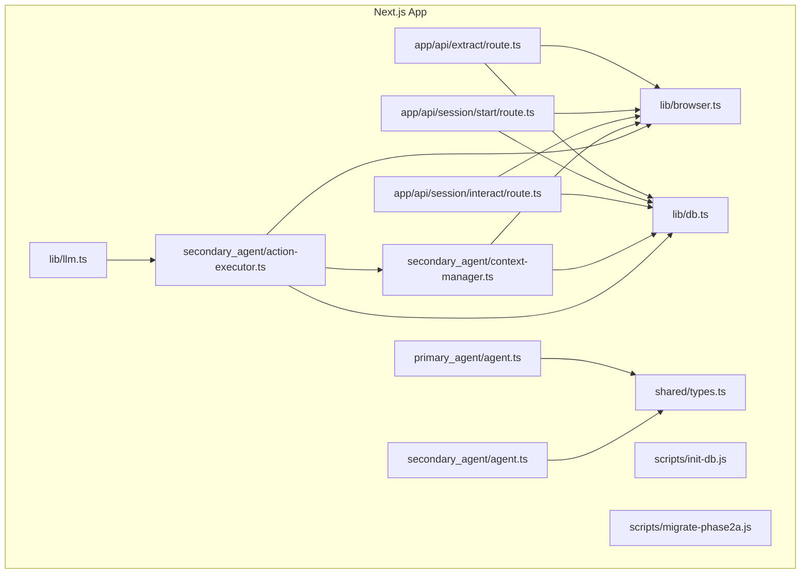
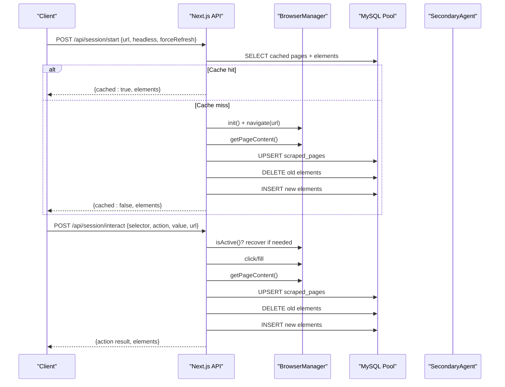
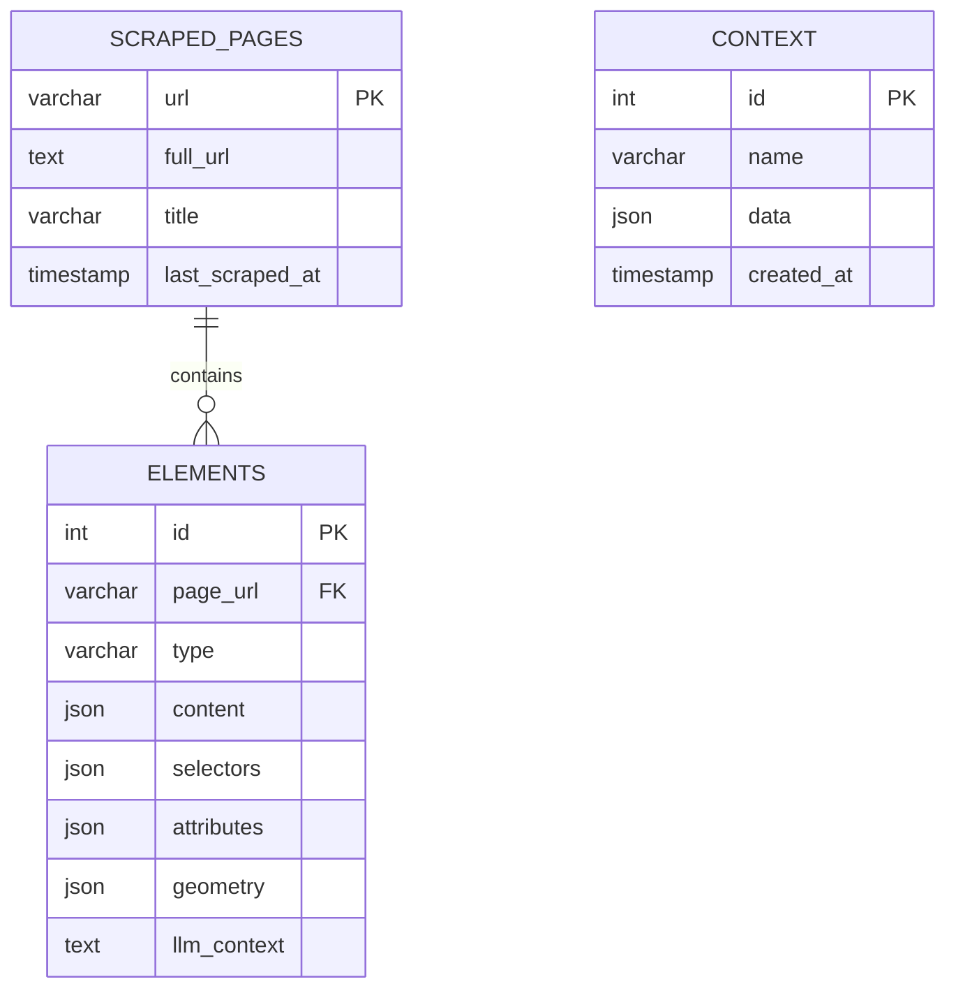
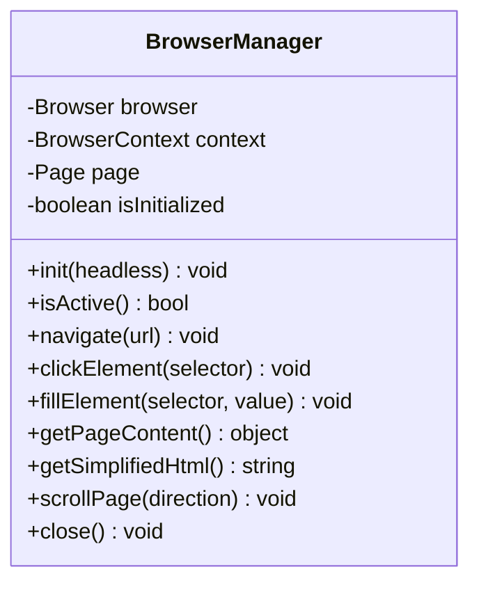
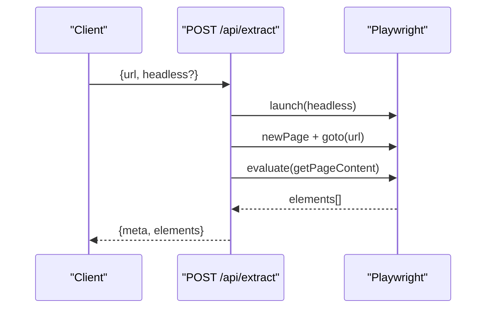
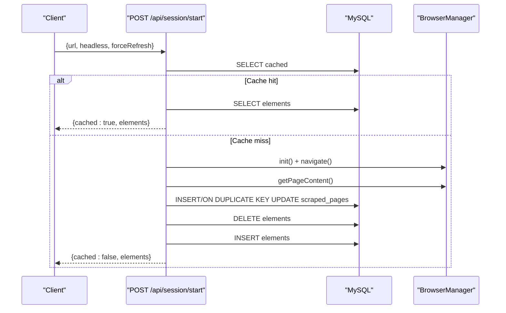
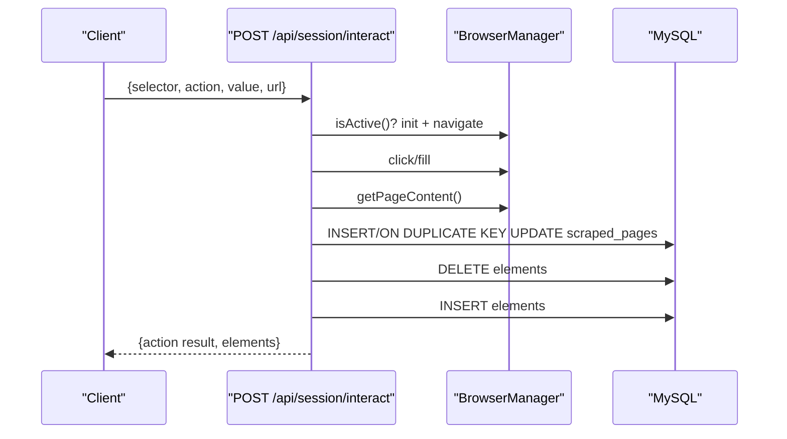
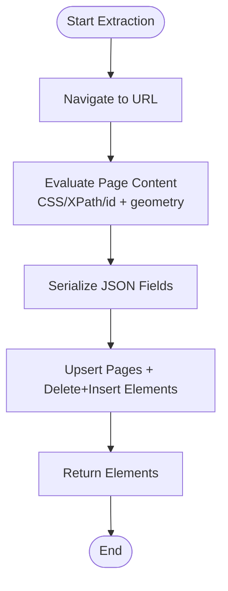
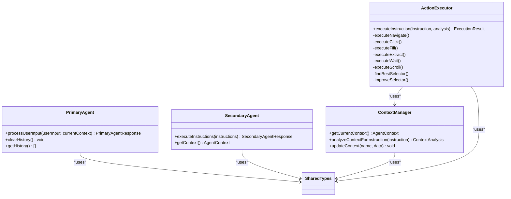
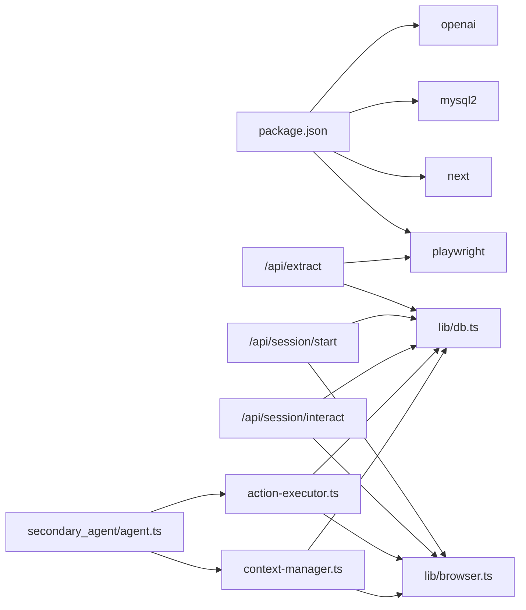

# Extraction Script System

<cite>
**Referenced Files in This Document**
- [package.json](file://extraction-script/package.json)
- [next.config.ts](file://extraction-script/next.config.ts)
- [db.ts](file://extraction-script/lib/db.ts)
- [browser.ts](file://extraction-script/lib/browser.ts)
- [init-db.js](file://extraction-script/scripts/init-db.js)
- [migrate-phase2a.js](file://extraction-script/scripts/migrate-phase2a.js)
- [route.ts (extract)](file://extraction-script/app/api/extract/route.ts)
- [route.ts (session/start)](file://extraction-script/app/api/session/start/route.ts)
- [route.ts (session/interact)](file://extraction-script/app/api/session/interact/route.ts)
- [agent.ts (primary)](file://extraction-script/primary_agent/agent.ts)
- [agent.ts (secondary)](file://extraction-script/secondary_agent/agent.ts)
- [context-manager.ts](file://extraction-script/secondary_agent/context-manager.ts)
- [action-executor.ts](file://extraction-script/secondary_agent/action-executor.ts)
- [types.ts (shared)](file://extraction-script/shared/types.ts)
- [types.ts (primary)](file://extraction-script/primary_agent/types.ts)
- [types.ts (secondary)](file://extraction-script/secondary_agent/types.ts)
- [llm.ts](file://extraction-script/lib/llm.ts)
- [utils.ts](file://extraction-script/lib/utils.ts)
</cite>

## Table of Contents
1. [Introduction](#introduction)
2. [Project Structure](#project-structure)
3. [Core Components](#core-components)
4. [Architecture Overview](#architecture-overview)
5. [Detailed Component Analysis](#detailed-component-analysis)
6. [Dependency Analysis](#dependency-analysis)
7. [Performance Considerations](#performance-considerations)
8. [Troubleshooting Guide](#troubleshooting-guide)
9. [Conclusion](#conclusion)
10. [Appendices](#appendices)

## Introduction
This document describes the Extraction Script System built with Next.js. It covers the API endpoints for extraction and interactive sessions, database integration and schema design, browser automation capabilities, initialization and migration scripts, data processing workflows, error handling, performance optimization, integration patterns with the Ghost Pilot system, and security and validation considerations. The system supports page scraping, element extraction, content analysis, and automated interactions with a persistent browser session backed by a MySQL database.

## Project Structure
The system is organized into:
- Next.js application under extraction-script with API routes, libraries, agents, and scripts
- Primary and secondary agent modules for intent recognition and action execution
- Shared types for cross-module contracts
- Scripts for database initialization and migrations

**Diagram sources**
- [route.ts (extract)](file://extraction-script/app/api/extract/route.ts#L1-L157)
- [route.ts (session/start)](file://extraction-script/app/api/session/start/route.ts#L1-L97)
- [route.ts (session/interact)](file://extraction-script/app/api/session/interact/route.ts#L1-L77)
- [db.ts](file://extraction-script/lib/db.ts#L1-L105)
- [browser.ts](file://extraction-script/lib/browser.ts#L1-L254)
- [llm.ts](file://extraction-script/lib/llm.ts#L1-L73)
- [types.ts (shared)](file://extraction-script/shared/types.ts#L1-L85)
- [agent.ts (primary)](file://extraction-script/primary_agent/agent.ts#L1-L106)
- [agent.ts (secondary)](file://extraction-script/secondary_agent/agent.ts#L1-L119)
- [context-manager.ts](file://extraction-script/secondary_agent/context-manager.ts#L1-L183)
- [action-executor.ts](file://extraction-script/secondary_agent/action-executor.ts#L1-L359)
- [init-db.js](file://extraction-script/scripts/init-db.js#L1-L64)
- [migrate-phase2a.js](file://extraction-script/scripts/migrate-phase2a.js#L1-L41)

**Section sources**
- [package.json](file://extraction-script/package.json#L1-L45)
- [next.config.ts](file://extraction-script/next.config.ts#L1-L8)

## Core Components
- API Endpoints
  - POST /api/extract: Extract interactive elements from a URL using a temporary browser instance
  - POST /api/session/start: Start a persistent session, cache results, and initialize a browser manager
  - POST /api/session/interact: Perform click/fill interactions and re-extract page state
- Database Layer
  - Connection pooling, schema verification, and CRUD helpers
  - Tables: scraped_pages, elements, context
- Browser Management
  - Singleton browser manager with navigation, clicks, fills, scrolling, and content extraction
- Agents
  - Primary agent: intent recognition and instruction translation
  - Secondary agent: context understanding and action execution
- LLM Integration
  - Element enrichment via local LLM for contextual descriptions
- Initialization and Migration
  - Scripts to create database and tables, and to add new columns safely

**Section sources**
- [route.ts (extract)](file://extraction-script/app/api/extract/route.ts#L1-L157)
- [route.ts (session/start)](file://extraction-script/app/api/session/start/route.ts#L1-L97)
- [route.ts (session/interact)](file://extraction-script/app/api/session/interact/route.ts#L1-L77)
- [db.ts](file://extraction-script/lib/db.ts#L1-L105)
- [browser.ts](file://extraction-script/lib/browser.ts#L1-L254)
- [agent.ts (primary)](file://extraction-script/primary_agent/agent.ts#L1-L106)
- [agent.ts (secondary)](file://extraction-script/secondary_agent/agent.ts#L1-L119)
- [context-manager.ts](file://extraction-script/secondary_agent/context-manager.ts#L1-L183)
- [action-executor.ts](file://extraction-script/secondary_agent/action-executor.ts#L1-L359)
- [llm.ts](file://extraction-script/lib/llm.ts#L1-L73)
- [init-db.js](file://extraction-script/scripts/init-db.js#L1-L64)
- [migrate-phase2a.js](file://extraction-script/scripts/migrate-phase2a.js#L1-L41)

## Architecture Overview
The system orchestrates extraction and interaction through Next.js API routes, backed by a MySQL database and a Playwright-managed browser. The primary agent translates user intent into structured instructions, while the secondary agent executes them against the current page state, persisting results to the database.

**Diagram sources**
- [route.ts (session/start)](file://extraction-script/app/api/session/start/route.ts#L1-L97)
- [route.ts (session/interact)](file://extraction-script/app/api/session/interact/route.ts#L1-L77)
- [browser.ts](file://extraction-script/lib/browser.ts#L1-L254)
- [db.ts](file://extraction-script/lib/db.ts#L1-L105)

## Detailed Component Analysis

### Database Integration and Schema
- Connection Pooling
  - Uses mysql2 promise pool with connection limits and queue behavior
  - Centralized query helper wraps SQL execution and error logging
- Schema Design
  - scraped_pages: stores canonical URL, optional full URL, title, and timestamps
  - elements: stores per-page interactive elements with JSON fields for content, selectors, attributes, geometry, and optional LLM context
  - context: generic storage for arbitrary JSON context
- Schema Evolution
  - Automatic schema verification on first query
  - Migration script adds llm_context column safely

**Diagram sources**
- [db.ts](file://extraction-script/lib/db.ts#L35-L80)
- [init-db.js](file://extraction-script/scripts/init-db.js#L19-L54)
- [migrate-phase2a.js](file://extraction-script/scripts/migrate-phase2a.js#L15-L31)

**Section sources**
- [db.ts](file://extraction-script/lib/db.ts#L1-L105)
- [init-db.js](file://extraction-script/scripts/init-db.js#L1-L64)
- [migrate-phase2a.js](file://extraction-script/scripts/migrate-phase2a.js#L1-L41)

### Browser Automation Capabilities
- Singleton BrowserManager
  - Launches Chromium, manages context and page lifecycle
  - Provides navigation, click, fill, scroll, and content extraction
  - Simplifies HTML for LLM enrichment by removing clutter and truncating text
- Robustness
  - Default timeouts, load state waits, and error propagation
  - Session recovery for interactive mode

**Diagram sources**
- [browser.ts](file://extraction-script/lib/browser.ts#L4-L246)

**Section sources**
- [browser.ts](file://extraction-script/lib/browser.ts#L1-L254)

### API Workflows

#### POST /api/extract
- Purpose: One-off extraction using a fresh browser instance
- Behavior:
  - Validates URL
  - Launches headless Chromium, navigates, waits, extracts elements with CSS/XPath/id selectors, attributes, and geometry
  - Returns structured elements and metadata

**Diagram sources**
- [route.ts (extract)](file://extraction-script/app/api/extract/route.ts#L14-L157)

**Section sources**
- [route.ts (extract)](file://extraction-script/app/api/extract/route.ts#L1-L157)

#### POST /api/session/start
- Purpose: Persistent session with caching and database persistence
- Behavior:
  - Optional forceRefresh bypasses cache
  - Checks cache in scraped_pages and elements
  - Initializes BrowserManager, navigates, extracts, upserts page, clears and inserts elements
  - Returns elements with cache metadata

**Diagram sources**
- [route.ts (session/start)](file://extraction-script/app/api/session/start/route.ts#L6-L96)
- [browser.ts](file://extraction-script/lib/browser.ts#L20-L53)
- [db.ts](file://extraction-script/lib/db.ts#L92-L102)

**Section sources**
- [route.ts (session/start)](file://extraction-script/app/api/session/start/route.ts#L1-L97)

#### POST /api/session/interact
- Purpose: Interactive actions (click/fill) with re-extraction and DB update
- Behavior:
  - Recovers session if browser is inactive
  - Performs action, re-extracts page, upserts page and elements, returns results

**Diagram sources**
- [route.ts (session/interact)](file://extraction-script/app/api/session/interact/route.ts#L6-L76)
- [browser.ts](file://extraction-script/lib/browser.ts#L48-L73)
- [db.ts](file://extraction-script/lib/db.ts#L92-L102)

**Section sources**
- [route.ts (session/interact)](file://extraction-script/app/api/session/interact/route.ts#L1-L77)

### Data Processing Workflows
- Extraction Pipeline
  - Visibility checks, CSS/XPath/id selector generation, geometry calculation, content truncation
  - JSON serialization for persistence
- Caching Strategy
  - Cache lookup by URL; on miss, scrape and persist; on hit, serve cached elements
- LLM Enrichment
  - Simplified HTML and element list passed to local LLM to produce contextual descriptions
  - Results stored in elements.llm_context

**Diagram sources**
- [route.ts (session/start)](file://extraction-script/app/api/session/start/route.ts#L50-L85)
- [browser.ts](file://extraction-script/lib/browser.ts#L125-L215)

**Section sources**
- [browser.ts](file://extraction-script/lib/browser.ts#L75-L215)
- [llm.ts](file://extraction-script/lib/llm.ts#L9-L72)

### Agent Integration Patterns
- Primary Agent
  - Recognizes user intent and generates structured instructions for the secondary agent
- Secondary Agent
  - Manages context (current page, available elements, DB schema)
  - Executes actions (navigate, click, fill, extract, wait, scroll)
  - Persists outcomes to the database
- Communication Contracts
  - Shared types define instructions, context, and page elements

**Diagram sources**
- [agent.ts (primary)](file://extraction-script/primary_agent/agent.ts#L9-L104)
- [agent.ts (secondary)](file://extraction-script/secondary_agent/agent.ts#L9-L118)
- [context-manager.ts](file://extraction-script/secondary_agent/context-manager.ts#L11-L181)
- [action-executor.ts](file://extraction-script/secondary_agent/action-executor.ts#L16-L357)
- [types.ts (shared)](file://extraction-script/shared/types.ts#L3-L85)
- [types.ts (primary)](file://extraction-script/primary_agent/types.ts#L5-L32)
- [types.ts (secondary)](file://extraction-script/secondary_agent/types.ts#L5-L37)

**Section sources**
- [agent.ts (primary)](file://extraction-script/primary_agent/agent.ts#L1-L106)
- [agent.ts (secondary)](file://extraction-script/secondary_agent/agent.ts#L1-L119)
- [context-manager.ts](file://extraction-script/secondary_agent/context-manager.ts#L1-L183)
- [action-executor.ts](file://extraction-script/secondary_agent/action-executor.ts#L1-L359)
- [types.ts (shared)](file://extraction-script/shared/types.ts#L1-L85)
- [types.ts (primary)](file://extraction-script/primary_agent/types.ts#L1-L32)
- [types.ts (secondary)](file://extraction-script/secondary_agent/types.ts#L1-L37)

### Initialization and Migration Scripts
- init-db.js
  - Creates database and tables (context, scraped_pages, elements)
- migrate-phase2a.js
  - Adds llm_context column to elements table if missing

**Section sources**
- [init-db.js](file://extraction-script/scripts/init-db.js#L1-L64)
- [migrate-phase2a.js](file://extraction-script/scripts/migrate-phase2a.js#L1-L41)

## Dependency Analysis
- External Dependencies
  - Next.js runtime and React
  - Playwright for browser automation
  - mysql2 for database connectivity
  - OpenAI SDK for local LLM integration
- Internal Dependencies
  - API routes depend on lib/browser and lib/db
  - Secondary agent depends on ContextManager and ActionExecutor
  - Shared types unify contracts across modules

**Diagram sources**
- [package.json](file://extraction-script/package.json#L12-L31)
- [route.ts (extract)](file://extraction-script/app/api/extract/route.ts#L2-L3)
- [route.ts (session/start)](file://extraction-script/app/api/session/start/route.ts#L3-L4)
- [route.ts (session/interact)](file://extraction-script/app/api/session/interact/route.ts#L3-L4)
- [browser.ts](file://extraction-script/lib/browser.ts#L2)
- [db.ts](file://extraction-script/lib/db.ts#L2)
- [agent.ts (secondary)](file://extraction-script/secondary_agent/agent.ts#L4-L6)
- [context-manager.ts](file://extraction-script/secondary_agent/context-manager.ts#L6-L9)
- [action-executor.ts](file://extraction-script/secondary_agent/action-executor.ts#L4-L9)

**Section sources**
- [package.json](file://extraction-script/package.json#L1-L45)

## Performance Considerations
- Browser
  - Headless mode reduces overhead; adjust headless flag per environment
  - Reuse singleton BrowserManager to avoid repeated launches
  - Use targeted waits and load states; avoid excessive timeouts
- Database
  - Connection pooling prevents resource exhaustion
  - Prefer batch inserts and upserts; minimize round-trips
  - Index URL fields for fast lookups
- Extraction
  - Simplify HTML before LLM enrichment to reduce token usage
  - Limit element counts or batch processing for large pages
- Caching
  - Use cache-first strategy for repeated URLs to cut down on scraping costs

[No sources needed since this section provides general guidance]

## Troubleshooting Guide
- Database
  - Schema not initialized: Run init-db.js to create database and tables
  - Column missing: Run migrate-phase2a.js to add llm_context
  - Connection errors: Verify host, user, password, and database name
- Browser
  - “Browser not initialized”: Ensure init() is called before navigation
  - Navigation failures: Increase timeouts or wait for network idle
  - Selector errors: Improve selectors using LLM-based suggestions
- API
  - Missing URL: Ensure request body includes url
  - Session lost: Re-init browser with stored URL
- LLM
  - JSON parsing errors: Clean markdown blocks from LLM output
  - Local server unreachable: Confirm baseURL and port for local LLM

**Section sources**
- [init-db.js](file://extraction-script/scripts/init-db.js#L1-L64)
- [migrate-phase2a.js](file://extraction-script/scripts/migrate-phase2a.js#L1-L41)
- [db.ts](file://extraction-script/lib/db.ts#L17-L90)
- [browser.ts](file://extraction-script/lib/browser.ts#L20-L73)
- [route.ts (session/interact)](file://extraction-script/app/api/session/interact/route.ts#L13-L23)
- [llm.ts](file://extraction-script/lib/llm.ts#L56-L72)

## Conclusion
The Extraction Script System integrates Next.js APIs, a MySQL-backed persistence layer, and Playwright-driven browser automation to support robust extraction and interaction workflows. The primary and secondary agents coordinate intent and action execution, while initialization and migration scripts keep the database schema consistent. With careful attention to caching, timeouts, and LLM prompts, the system delivers scalable and maintainable automation.

[No sources needed since this section summarizes without analyzing specific files]

## Appendices

### API Definitions
- POST /api/extract
  - Request: { url: string, headless?: boolean }
  - Response: { meta: { source_url: string, timestamp: string }, elements: [...] }
- POST /api/session/start
  - Request: { url: string, headless?: boolean, forceRefresh?: boolean }
  - Response: { meta: { source_url: string, cached?: boolean, timestamp: string }, elements: [...] }
- POST /api/session/interact
  - Request: { selector: string, action: 'click' | 'fill', value?: string, url?: string }
  - Response: { meta: { source_url: string, action: string, timestamp: string }, elements: [...] }

**Section sources**
- [route.ts (extract)](file://extraction-script/app/api/extract/route.ts#L14-L157)
- [route.ts (session/start)](file://extraction-script/app/api/session/start/route.ts#L6-L96)
- [route.ts (session/interact)](file://extraction-script/app/api/session/interact/route.ts#L6-L76)

### Security and Access Control
- Environment Variables
  - Store database credentials and LLM base URL in environment variables
- CORS and Authentication
  - Add middleware to enforce authentication and origin restrictions for production
- Input Validation
  - Sanitize and validate URLs and selectors before processing
- Least Privilege
  - Run database with minimal required permissions

[No sources needed since this section provides general guidance]