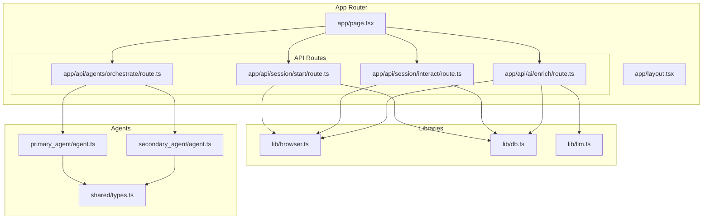
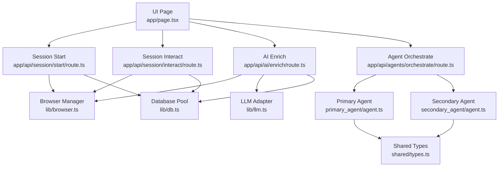
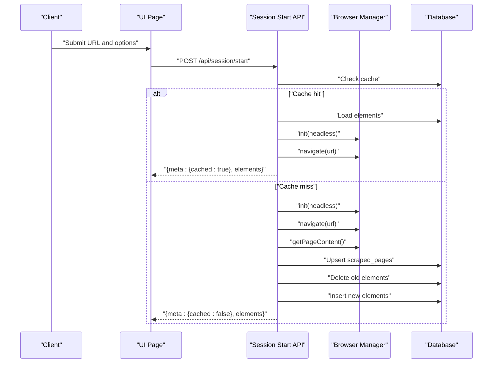
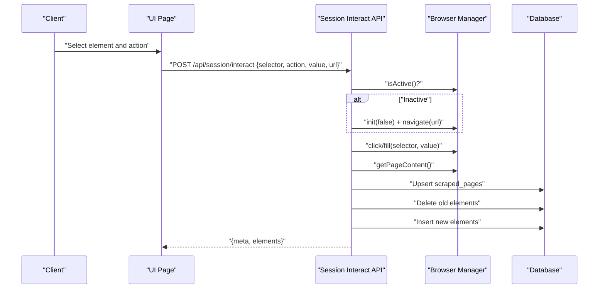
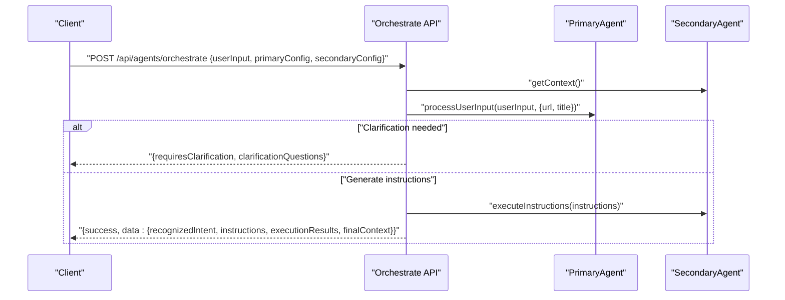
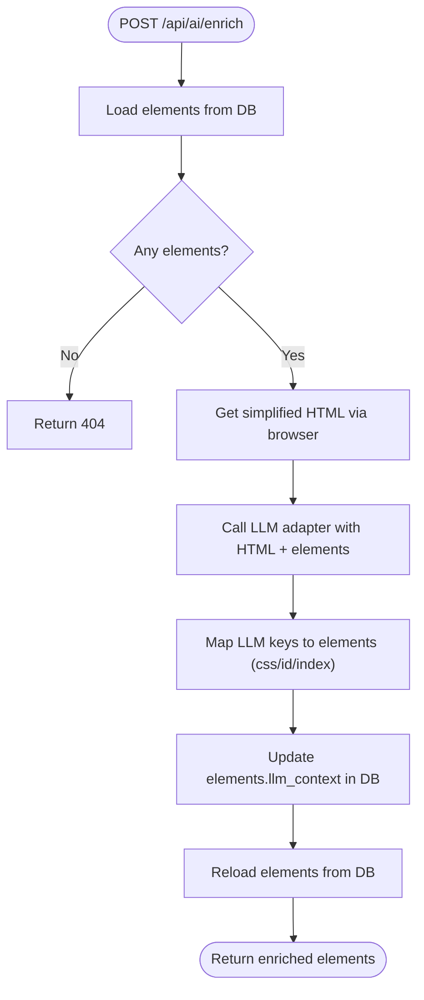
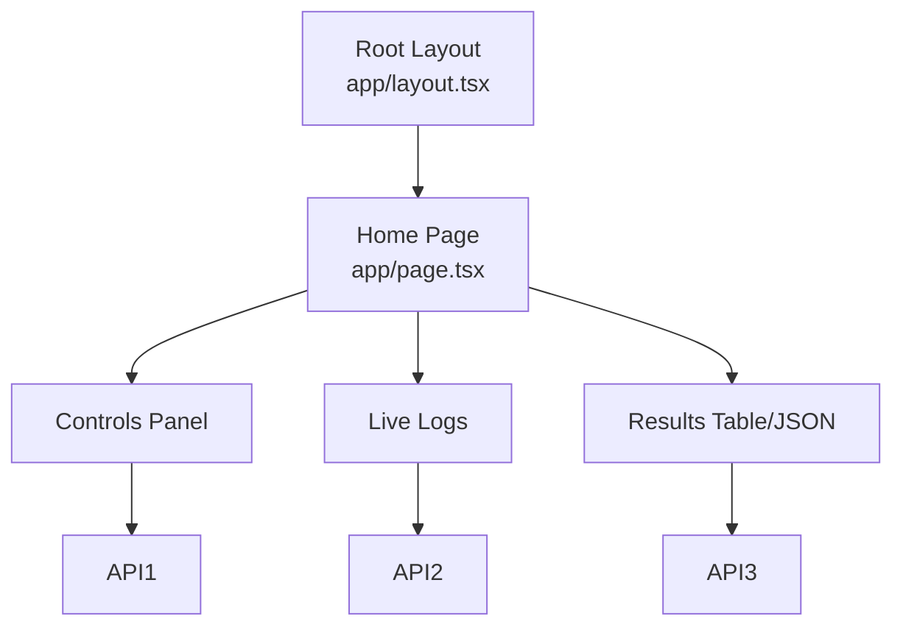
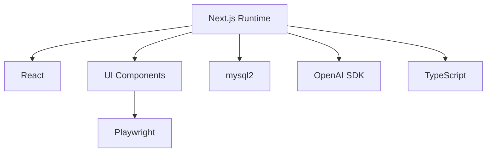

# Next.js Application

<cite>
**Referenced Files in This Document**
- [layout.tsx](file://extraction-script/app/layout.tsx)
- [page.tsx](file://extraction-script/app/page.tsx)
- [next.config.ts](file://extraction-script/next.config.ts)
- [package.json](file://extraction-script/package.json)
- [tsconfig.json](file://extraction-script/tsconfig.json)
- [app/api/session/start/route.ts](file://extraction-script/app/api/session/start/route.ts)
- [app/api/session/interact/route.ts](file://extraction-script/app/api/session/interact/route.ts)
- [app/api/ai/enrich/route.ts](file://extraction-script/app/api/ai/enrich/route.ts)
- [app/api/agents/orchestrate/route.ts](file://extraction-script/app/api/agents/orchestrate/route.ts)
- [lib/db.ts](file://extraction-script/lib/db.ts)
- [lib/browser.ts](file://extraction-script/lib/browser.ts)
- [lib/llm.ts](file://extraction-script/lib/llm.ts)
- [primary_agent/agent.ts](file://extraction-script/primary_agent/agent.ts)
- [secondary_agent/agent.ts](file://extraction-script/secondary_agent/agent.ts)
- [shared/types.ts](file://extraction-script/shared/types.ts)
</cite>

## Table of Contents
1. [Introduction](#introduction)
2. [Project Structure](#project-structure)
3. [Core Components](#core-components)
4. [Architecture Overview](#architecture-overview)
5. [Detailed Component Analysis](#detailed-component-analysis)
6. [Dependency Analysis](#dependency-analysis)
7. [Performance Considerations](#performance-considerations)
8. [Troubleshooting Guide](#troubleshooting-guide)
9. [Conclusion](#conclusion)
10. [Appendices](#appendices)

## Introduction
This document describes the Next.js application powering the extraction script system. It covers the app directory structure, routing patterns, API endpoint organization, session management for agent coordination, agent orchestration combining primary and secondary agents, AI enrichment and data extraction endpoints, layout and page components, configuration, build process, deployment considerations, and integration with the broader Ghost Pilot system and data sharing protocols.

## Project Structure
The application follows Next.js App Router conventions with an app directory containing pages, API routes, UI components, libraries, and agent implementations. Key areas:
- app/: UI pages and API routes under app/api/*
- components/ui/: reusable Radix-based UI primitives
- lib/: browser automation, database, and LLM utilities
- primary_agent/, secondary_agent/: agent orchestration modules
- shared/types.ts: shared TypeScript interfaces
- next.config.ts, tsconfig.json, package.json: Next.js configuration and dependencies

**Diagram sources**
- [page.tsx](file://extraction-script/app/page.tsx#L1-L559)
- [layout.tsx](file://extraction-script/app/layout.tsx#L1-L35)
- [app/api/session/start/route.ts](file://extraction-script/app/api/session/start/route.ts#L1-L97)
- [app/api/session/interact/route.ts](file://extraction-script/app/api/session/interact/route.ts#L1-L77)
- [app/api/ai/enrich/route.ts](file://extraction-script/app/api/ai/enrich/route.ts#L1-L105)
- [app/api/agents/orchestrate/route.ts](file://extraction-script/app/api/agents/orchestrate/route.ts#L1-L85)
- [lib/browser.ts](file://extraction-script/lib/browser.ts#L1-L254)
- [lib/db.ts](file://extraction-script/lib/db.ts#L1-L105)
- [lib/llm.ts](file://extraction-script/lib/llm.ts#L1-L73)
- [primary_agent/agent.ts](file://extraction-script/primary_agent/agent.ts#L1-L106)
- [secondary_agent/agent.ts](file://extraction-script/secondary_agent/agent.ts#L1-L119)
- [shared/types.ts](file://extraction-script/shared/types.ts#L1-L85)

**Section sources**
- [layout.tsx](file://extraction-script/app/layout.tsx#L1-L35)
- [page.tsx](file://extraction-script/app/page.tsx#L1-L559)
- [next.config.ts](file://extraction-script/next.config.ts#L1-L8)
- [package.json](file://extraction-script/package.json#L1-L45)
- [tsconfig.json](file://extraction-script/tsconfig.json#L1-L35)

## Core Components
- Layout and Fonts: Defines global metadata and fonts for the app.
- Home Page: Client-side UI orchestrating extraction, interaction, and enrichment; manages logs, controls, and results.
- API Routes: Provide session lifecycle, element interaction, AI enrichment, and agent orchestration.
- Libraries: Browser automation (Playwright), database (MySQL via mysql2), and LLM integration (OpenAI-compatible local server).
- Agents: Primary agent recognizes intent and translates to instructions; secondary agent executes instructions and manages context.
- Types: Shared interfaces for instructions, context, and responses.

**Section sources**
- [layout.tsx](file://extraction-script/app/layout.tsx#L1-L35)
- [page.tsx](file://extraction-script/app/page.tsx#L1-L559)
- [lib/browser.ts](file://extraction-script/lib/browser.ts#L1-L254)
- [lib/db.ts](file://extraction-script/lib/db.ts#L1-L105)
- [lib/llm.ts](file://extraction-script/lib/llm.ts#L1-L73)
- [primary_agent/agent.ts](file://extraction-script/primary_agent/agent.ts#L1-L106)
- [secondary_agent/agent.ts](file://extraction-script/secondary_agent/agent.ts#L1-L119)
- [shared/types.ts](file://extraction-script/shared/types.ts#L1-L85)

## Architecture Overview
The system integrates a Next.js UI with a Playwright-driven browser manager, a MySQL-backed persistence layer, and two cooperating agents. The UI drives session start, element interaction, and enrichment. The agents translate natural language into executable instructions and coordinate with the browser and database.

**Diagram sources**
- [page.tsx](file://extraction-script/app/page.tsx#L1-L559)
- [app/api/session/start/route.ts](file://extraction-script/app/api/session/start/route.ts#L1-L97)
- [app/api/session/interact/route.ts](file://extraction-script/app/api/session/interact/route.ts#L1-L77)
- [app/api/ai/enrich/route.ts](file://extraction-script/app/api/ai/enrich/route.ts#L1-L105)
- [app/api/agents/orchestrate/route.ts](file://extraction-script/app/api/agents/orchestrate/route.ts#L1-L85)
- [lib/browser.ts](file://extraction-script/lib/browser.ts#L1-L254)
- [lib/db.ts](file://extraction-script/lib/db.ts#L1-L105)
- [lib/llm.ts](file://extraction-script/lib/llm.ts#L1-L73)
- [primary_agent/agent.ts](file://extraction-script/primary_agent/agent.ts#L1-L106)
- [secondary_agent/agent.ts](file://extraction-script/secondary_agent/agent.ts#L1-L119)
- [shared/types.ts](file://extraction-script/shared/types.ts#L1-L85)

## Detailed Component Analysis

### Session Management System
The session system coordinates browser lifecycle and data caching:
- Start session: Validates URL, optionally checks cache, initializes browser, navigates, extracts page content, persists to DB, and returns elements.
- Interact: Recovers session if lost, validates activity, performs click/fill, re-scrapes, updates DB, and returns updated elements.

**Diagram sources**
- [page.tsx](file://extraction-script/app/page.tsx#L111-L147)
- [app/api/session/start/route.ts](file://extraction-script/app/api/session/start/route.ts#L1-L97)
- [lib/browser.ts](file://extraction-script/lib/browser.ts#L20-L46)
- [lib/db.ts](file://extraction-script/lib/db.ts#L92-L102)

**Section sources**
- [app/api/session/start/route.ts](file://extraction-script/app/api/session/start/route.ts#L1-L97)
- [lib/browser.ts](file://extraction-script/lib/browser.ts#L1-L254)
- [lib/db.ts](file://extraction-script/lib/db.ts#L1-L105)

**Diagram sources**
- [page.tsx](file://extraction-script/app/page.tsx#L149-L173)
- [app/api/session/interact/route.ts](file://extraction-script/app/api/session/interact/route.ts#L1-L77)
- [lib/browser.ts](file://extraction-script/lib/browser.ts#L31-L73)
- [lib/db.ts](file://extraction-script/lib/db.ts#L92-L102)

**Section sources**
- [app/api/session/interact/route.ts](file://extraction-script/app/api/session/interact/route.ts#L1-L77)
- [lib/browser.ts](file://extraction-script/lib/browser.ts#L1-L254)
- [lib/db.ts](file://extraction-script/lib/db.ts#L1-L105)

### Agent Orchestration
The orchestration endpoint coordinates primary and secondary agents:
- PrimaryAgent: Recognizes intent and translates to instructions, optionally requesting clarification.
- SecondaryAgent: Executes instructions sequentially, manages context, and aggregates results.

**Diagram sources**
- [app/api/agents/orchestrate/route.ts](file://extraction-script/app/api/agents/orchestrate/route.ts#L1-L85)
- [primary_agent/agent.ts](file://extraction-script/primary_agent/agent.ts#L1-L106)
- [secondary_agent/agent.ts](file://extraction-script/secondary_agent/agent.ts#L1-L119)
- [shared/types.ts](file://extraction-script/shared/types.ts#L1-L85)

**Section sources**
- [app/api/agents/orchestrate/route.ts](file://extraction-script/app/api/agents/orchestrate/route.ts#L1-L85)
- [primary_agent/agent.ts](file://extraction-script/primary_agent/agent.ts#L1-L106)
- [secondary_agent/agent.ts](file://extraction-script/secondary_agent/agent.ts#L1-L119)
- [shared/types.ts](file://extraction-script/shared/types.ts#L1-L85)

### AI Enrichment and Data Extraction Endpoints
- AI Enrich: Loads elements from DB, obtains simplified HTML via browser manager, sends to LLM adapter, maps returned contexts to elements, updates DB, and returns enriched elements.
- Data Extraction: Uses Playwright evaluation to compute element type, content, selectors, attributes, and geometry.

**Diagram sources**
- [app/api/ai/enrich/route.ts](file://extraction-script/app/api/ai/enrich/route.ts#L1-L105)
- [lib/browser.ts](file://extraction-script/lib/browser.ts#L75-L123)
- [lib/llm.ts](file://extraction-script/lib/llm.ts#L1-L73)
- [lib/db.ts](file://extraction-script/lib/db.ts#L92-L102)

**Section sources**
- [app/api/ai/enrich/route.ts](file://extraction-script/app/api/ai/enrich/route.ts#L1-L105)
- [lib/browser.ts](file://extraction-script/lib/browser.ts#L1-L254)
- [lib/llm.ts](file://extraction-script/lib/llm.ts#L1-L73)
- [lib/db.ts](file://extraction-script/lib/db.ts#L1-L105)

### Layout Configuration and Page Components
- Root layout sets fonts and metadata.
- Home page composes controls, logs, and results panels, and wires UI events to API endpoints.

**Diagram sources**
- [layout.tsx](file://extraction-script/app/layout.tsx#L1-L35)
- [page.tsx](file://extraction-script/app/page.tsx#L1-L559)

**Section sources**
- [layout.tsx](file://extraction-script/app/layout.tsx#L1-L35)
- [page.tsx](file://extraction-script/app/page.tsx#L1-L559)

## Dependency Analysis
- Runtime dependencies include Next.js, React, Playwright, OpenAI SDK, and mysql2.
- TypeScript configuration enables strict mode, JSX transform, bundler module resolution, and path aliases.
- Next.js configuration is minimal; defaults apply.

**Diagram sources**
- [package.json](file://extraction-script/package.json#L1-L45)
- [tsconfig.json](file://extraction-script/tsconfig.json#L1-L35)

**Section sources**
- [package.json](file://extraction-script/package.json#L1-L45)
- [tsconfig.json](file://extraction-script/tsconfig.json#L1-L35)
- [next.config.ts](file://extraction-script/next.config.ts#L1-L8)

## Performance Considerations
- Browser lifecycle: Reuse a single browser instance per process to reduce startup overhead; initialize lazily on first use.
- Database writes: Batch inserts and upserts minimize round-trips; ensure proper indexing on foreign keys and URLs.
- LLM calls: Limit payload size by truncating HTML and using concise prompts; consider chunking for very large pages.
- UI responsiveness: Defer non-critical work (background navigation) to keep the UI responsive during session start.
- Caching: Prefer cached results when available to avoid repeated browser navigation and scraping.

[No sources needed since this section provides general guidance]

## Troubleshooting Guide
Common issues and strategies:
- Session lost or inactive: The interact endpoint attempts recovery by reinitializing the browser and navigating to the stored URL.
- Validation failures: API routes return structured errors for missing fields or invalid actions.
- Database connectivity: Ensure the MySQL service is reachable and credentials are correct; schema is auto-initialized on first query.
- LLM availability: Confirm the local OpenAI-compatible server is running and accepting requests.

**Section sources**
- [app/api/session/interact/route.ts](file://extraction-script/app/api/session/interact/route.ts#L13-L23)
- [app/api/session/start/route.ts](file://extraction-script/app/api/session/start/route.ts#L10-L12)
- [lib/db.ts](file://extraction-script/lib/db.ts#L5-L13)
- [lib/llm.ts](file://extraction-script/lib/llm.ts#L4-L7)

## Conclusion
The Next.js application provides a cohesive UI and backend for automated DOM extraction, interactive element manipulation, and AI-powered enrichment. Its modular design—session management, agent orchestration, and data persistence—supports scalable integration with the Ghost Pilot system and enables robust data sharing protocols.

[No sources needed since this section summarizes without analyzing specific files]

## Appendices

### API Definitions

- Session Start
  - Method: POST
  - Path: /api/session/start
  - Request Body: { url: string, headless?: boolean, forceRefresh?: boolean }
  - Response: { meta: { source_url: string, cached: boolean, timestamp?: string }, elements: any[] }
  - Errors: 400 for missing URL, 500 on failure

- Session Interact
  - Method: POST
  - Path: /api/session/interact
  - Request Body: { selector: string, action: 'click' | 'fill', value?: string, url?: string }
  - Response: { meta: { source_url: string, action: string, timestamp: string }, elements: any[] }
  - Errors: 400 for missing fields, 500 if session inactive or interaction fails

- AI Enrich
  - Method: POST
  - Path: /api/ai/enrich
  - Request Body: { url: string }
  - Response: { meta: { source_url: string, enriched: true }, elements: any[] }
  - Errors: 400 for missing URL, 404 if no elements, 500 on failure

- Agent Orchestrate
  - Method: POST
  - Path: /api/agents/orchestrate
  - Request Body: { userInput: string, primaryConfig?: any, secondaryConfig?: any }
  - Response: { success: boolean, requiresClarification?: boolean, data?: any, error?: string }
  - Errors: 400 for invalid input, 500 on orchestration failure

**Section sources**
- [app/api/session/start/route.ts](file://extraction-script/app/api/session/start/route.ts#L6-L96)
- [app/api/session/interact/route.ts](file://extraction-script/app/api/session/interact/route.ts#L6-L76)
- [app/api/ai/enrich/route.ts](file://extraction-script/app/api/ai/enrich/route.ts#L7-L104)
- [app/api/agents/orchestrate/route.ts](file://extraction-script/app/api/agents/orchestrate/route.ts#L8-L83)

### Database Schema
- scraped_pages: url (PK), full_url, title, last_scraped_at
- elements: id (PK), page_url (FK), type, content (JSON), selectors (JSON), attributes (JSON), geometry (JSON), llm_context
- context: id (PK), name, data (JSON), created_at

**Section sources**
- [lib/db.ts](file://extraction-script/lib/db.ts#L35-L80)

### Build and Deployment Notes
- Scripts: dev, build, start, lint, sync-agents
- Next.js version and React are pinned in dependencies
- TypeScript strictness and path aliases configured

**Section sources**
- [package.json](file://extraction-script/package.json#L5-L11)
- [tsconfig.json](file://extraction-script/tsconfig.json#L2-L23)