# Frontend Application

<cite>
**Referenced Files in This Document**
- [App.tsx](file://frontend/src/App.tsx)
- [main.tsx](file://frontend/src/main.tsx)
- [GhostCursor.tsx](file://frontend/src/components/GhostCursor.tsx)
- [ClickRipple.tsx](file://frontend/src/components/ClickRipple.tsx)
- [ThinkingOverlay.tsx](file://frontend/src/components/ThinkingOverlay.tsx)
- [VideoStream.tsx](file://frontend/src/components/VideoStream.tsx)
- [VoiceInput.tsx](file://frontend/src/components/VoiceInput.tsx)
- [useWebSocket.ts](file://frontend/src/hooks/useWebSocket.ts)
- [useSpeechSynthesis.ts](file://frontend/src/hooks/useSpeechSynthesis.ts)
- [index.css](file://frontend/src/styles/index.css)
- [tailwind.config.js](file://frontend/tailwind.config.js)
- [package.json](file://frontend/package.json)
- [vite.config.ts](file://frontend/vite.config.ts)
</cite>

## Table of Contents
1. [Introduction](#introduction)
2. [Project Structure](#project-structure)
3. [Core Components](#core-components)
4. [Architecture Overview](#architecture-overview)
5. [Detailed Component Analysis](#detailed-component-analysis)
6. [Dependency Analysis](#dependency-analysis)
7. [Performance Considerations](#performance-considerations)
8. [Troubleshooting Guide](#troubleshooting-guide)
9. [Conclusion](#conclusion)
10. [Appendices](#appendices)

## Introduction
This document describes the React frontend application component system for the autonomous browser agent. App.tsx acts as the central orchestrator, coordinating real-time visualization, voice input, WebSocket communication, and speech synthesis. The system emphasizes a cyberpunk-inspired dark theme with glassmorphism UI, smooth animations via Framer Motion, and responsive layouts. It integrates the Web Speech API for speech recognition and transcription, Deepgram SDK for live audio streaming, and Tailwind CSS for styling.

## Project Structure
The frontend is a Vite + React + TypeScript application with a clear separation of concerns:
- Entry point renders the root App component and global styles.
- App.tsx coordinates state, WebSocket messaging, and composes UI components.
- Components implement specialized UI and animation behaviors.
- Hooks encapsulate reusable logic for WebSocket and speech synthesis.
- Styles leverage Tailwind utilities and custom color tokens for a cohesive cyberpunk aesthetic.

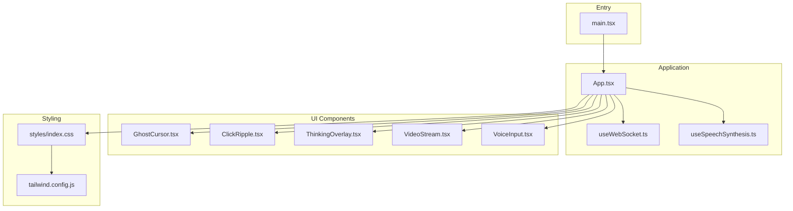

**Diagram sources**
- [main.tsx](file://frontend/src/main.tsx#L1-L11)
- [App.tsx](file://frontend/src/App.tsx#L1-L360)
- [useWebSocket.ts](file://frontend/src/hooks/useWebSocket.ts#L1-L93)
- [useSpeechSynthesis.ts](file://frontend/src/hooks/useSpeechSynthesis.ts#L1-L79)
- [GhostCursor.tsx](file://frontend/src/components/GhostCursor.tsx#L1-L99)
- [ClickRipple.tsx](file://frontend/src/components/ClickRipple.tsx#L1-L35)
- [ThinkingOverlay.tsx](file://frontend/src/components/ThinkingOverlay.tsx#L1-L78)
- [VideoStream.tsx](file://frontend/src/components/VideoStream.tsx#L1-L43)
- [VoiceInput.tsx](file://frontend/src/components/VoiceInput.tsx#L1-L321)
- [index.css](file://frontend/src/styles/index.css#L1-L107)
- [tailwind.config.js](file://frontend/tailwind.config.js#L1-L39)

**Section sources**
- [main.tsx](file://frontend/src/main.tsx#L1-L11)
- [App.tsx](file://frontend/src/App.tsx#L1-L360)
- [package.json](file://frontend/package.json#L1-L34)
- [vite.config.ts](file://frontend/vite.config.ts#L1-L23)

## Core Components
- App.tsx: Central coordinator managing WebSocket state, UI overlays, and voice command routing. It renders the video viewport, animated cursor, click ripples, thinking overlay, and control panel.
- GhostCursor.tsx: Animated cursor with spring physics using Framer Motion, emitting glow and trail effects, and adapting visuals when AI is “thinking.”
- ClickRipple.tsx: Visual ripple effect at click locations with fade-out animation.
- ThinkingOverlay.tsx: Fullscreen overlay featuring radar-style scanning rings and a rotating scanner line during AI analysis.
- VideoStream.tsx: Renders live screenshots either as base64 data URLs or raw base64 strings, with crisp rendering and loading states.
- VoiceInput.tsx: Integrates microphone capture and Deepgram’s live transcription, with manual fallback input and visual feedback.
- useWebSocket.ts: Hook providing connection lifecycle, auto-reconnect, message parsing, and send/disconnect utilities.
- useSpeechSynthesis.ts: Hook implementing a prioritized speech queue with configurable voice and rate, plus immediate interruption support.

**Section sources**
- [App.tsx](file://frontend/src/App.tsx#L14-L360)
- [GhostCursor.tsx](file://frontend/src/components/GhostCursor.tsx#L10-L99)
- [ClickRipple.tsx](file://frontend/src/components/ClickRipple.tsx#L10-L35)
- [ThinkingOverlay.tsx](file://frontend/src/components/ThinkingOverlay.tsx#L8-L78)
- [VideoStream.tsx](file://frontend/src/components/VideoStream.tsx#L8-L43)
- [VoiceInput.tsx](file://frontend/src/components/VoiceInput.tsx#L13-L321)
- [useWebSocket.ts](file://frontend/src/hooks/useWebSocket.ts#L15-L93)
- [useSpeechSynthesis.ts](file://frontend/src/hooks/useSpeechSynthesis.ts#L3-L79)

## Architecture Overview
The frontend follows a unidirectional data flow pattern:
- App.tsx subscribes to WebSocket messages and updates local state.
- UI components subscribe to state changes and render visual feedback.
- VoiceInput.tsx emits commands to App.tsx via callbacks, which sends structured messages over WebSocket.
- useSpeechSynthesis.ts provides auditory feedback synchronized with state transitions.

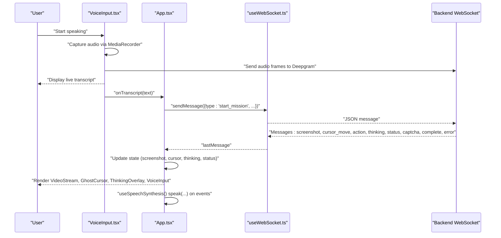

**Diagram sources**
- [VoiceInput.tsx](file://frontend/src/components/VoiceInput.tsx#L41-L171)
- [App.tsx](file://frontend/src/App.tsx#L146-L166)
- [useWebSocket.ts](file://frontend/src/hooks/useWebSocket.ts#L21-L66)
- [useSpeechSynthesis.ts](file://frontend/src/hooks/useSpeechSynthesis.ts#L55-L67)

## Detailed Component Analysis

### App.tsx: Command Center
Responsibilities:
- Establishes WebSocket connection and handles incoming messages.
- Maintains state for screenshots, cursor position, thinking state, status, current objective, click ripples, and CAPTCHA detection.
- Orchestrates speech synthesis for user feedback.
- Provides voice command handler to start missions and a manual override for CAPTCHAs.

Key behaviors:
- Real-time message routing by type to update UI state.
- URL extraction from voice commands to drive navigation.
- Conditional rendering of mission objective banner, video viewport, CAPTCHA override, and status indicators.
- Integration with Framer Motion for entrance/exit animations and pulsing effects.

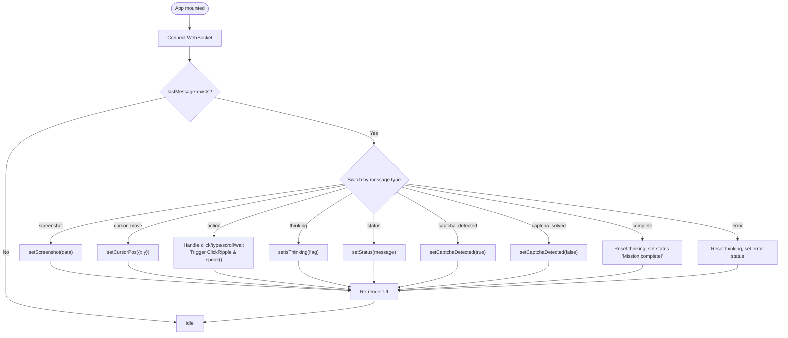

**Diagram sources**
- [App.tsx](file://frontend/src/App.tsx#L26-L123)

**Section sources**
- [App.tsx](file://frontend/src/App.tsx#L14-L360)

### GhostCursor.tsx: Animated Cursor with Spring Physics
Highlights:
- Uses Framer Motion controls to animate cursor position with spring dynamics.
- Adjusts glow intensity and adds a pulsing ring when thinking is active.
- Includes a subtle trailing particle for motion blur feel.

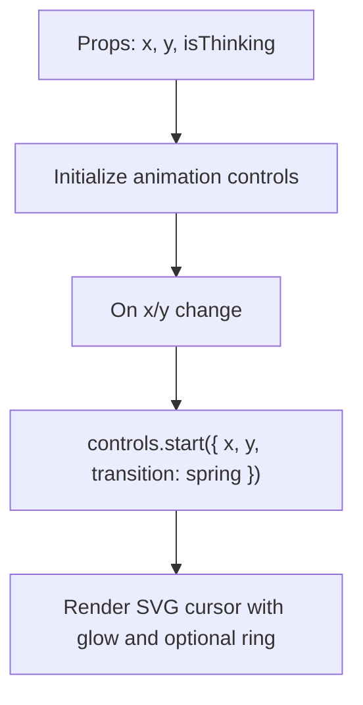

**Diagram sources**
- [GhostCursor.tsx](file://frontend/src/components/GhostCursor.tsx#L13-L25)

**Section sources**
- [GhostCursor.tsx](file://frontend/src/components/GhostCursor.tsx#L10-L99)

### ClickRipple.tsx: Visual Feedback Ripple
Highlights:
- Appears at click coordinates with a scale-and-fade animation.
- Uses AnimatePresence to clean up after animation completes.

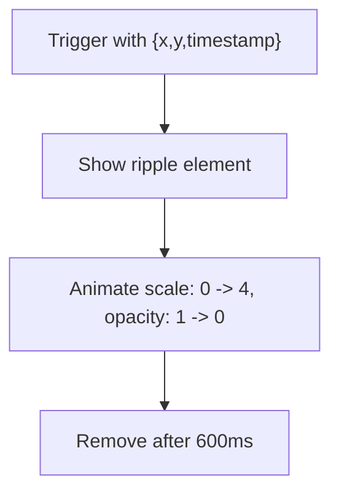

**Diagram sources**
- [ClickRipple.tsx](file://frontend/src/components/ClickRipple.tsx#L13-L16)

**Section sources**
- [ClickRipple.tsx](file://frontend/src/components/ClickRipple.tsx#L10-L35)

### ThinkingOverlay.tsx: Radar Animations During AI Processing
Highlights:
- Fullscreen overlay with center dot, pulsing rings, and a rotating scanner line.
- Animated message display with subtle breathing opacity.

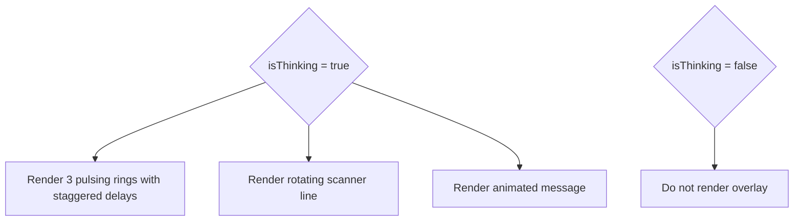

**Diagram sources**
- [ThinkingOverlay.tsx](file://frontend/src/components/ThinkingOverlay.tsx#L26-L54)

**Section sources**
- [ThinkingOverlay.tsx](file://frontend/src/components/ThinkingOverlay.tsx#L8-L78)

### VideoStream.tsx: Live Screenshot Streaming
Highlights:
- Accepts base64 data URL or raw base64, normalizing to a data URL for img src.
- Crisp pixelated rendering for screenshots and a spinner placeholder when idle.

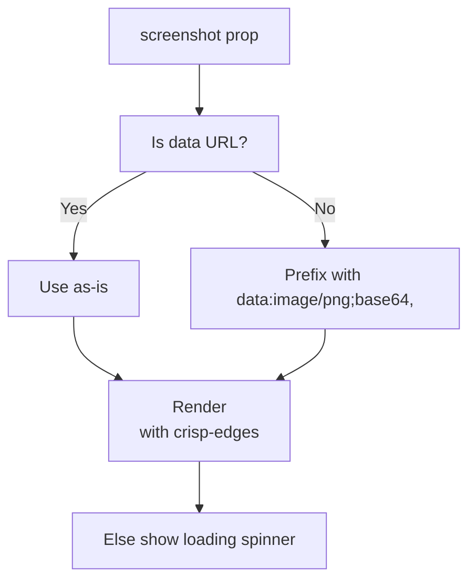

**Diagram sources**
- [VideoStream.tsx](file://frontend/src/components/VideoStream.tsx#L9-L19)

**Section sources**
- [VideoStream.tsx](file://frontend/src/components/VideoStream.tsx#L8-L43)

### VoiceInput.tsx: Speech Recognition and Transcription
Highlights:
- Requests microphone permission and streams audio to Deepgram via MediaRecorder.
- Handles interim and final transcripts, with a timeout to finalize speech.
- Provides manual text input fallback and disables controls when disconnected.
- Emits final transcript to parent via callback for mission initiation.

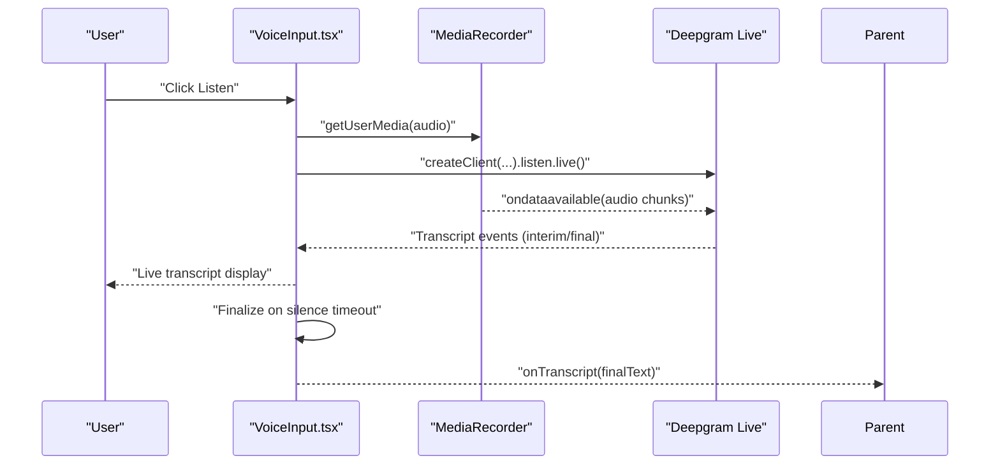

**Diagram sources**
- [VoiceInput.tsx](file://frontend/src/components/VoiceInput.tsx#L41-L130)

**Section sources**
- [VoiceInput.tsx](file://frontend/src/components/VoiceInput.tsx#L13-L321)

### useWebSocket.ts: Real-Time Bidirectional Messaging
Highlights:
- Creates WebSocket connection, parses JSON messages, and exposes isConnected, lastMessage, and sendMessage.
- Implements automatic reconnection on close with exponential-backoff-friendly delay.
- Provides disconnect and reconnect utilities.

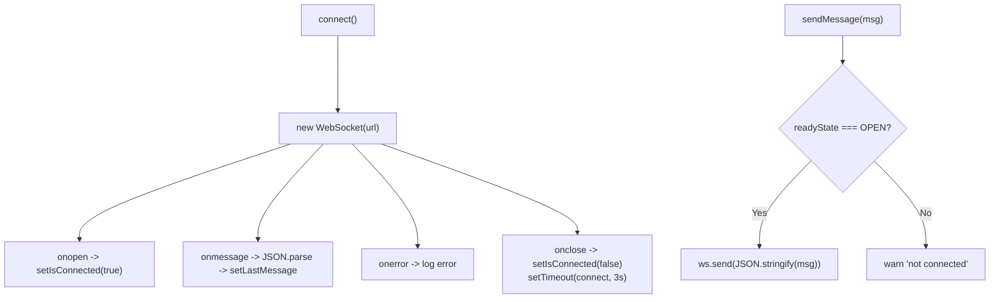

**Diagram sources**
- [useWebSocket.ts](file://frontend/src/hooks/useWebSocket.ts#L21-L76)

**Section sources**
- [useWebSocket.ts](file://frontend/src/hooks/useWebSocket.ts#L15-L93)

### useSpeechSynthesis.ts: Auditory Feedback Queue
Highlights:
- Queues speech utterances and speaks them sequentially.
- Configures rate, pitch, volume, and attempts to select a preferred voice.
- Supports immediate interruption via cancel and optional immediate flag.

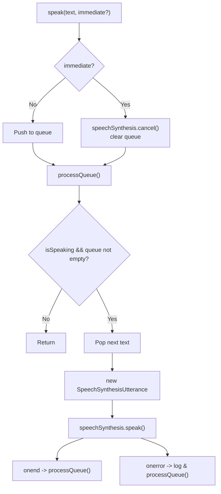

**Diagram sources**
- [useSpeechSynthesis.ts](file://frontend/src/hooks/useSpeechSynthesis.ts#L13-L53)

**Section sources**
- [useSpeechSynthesis.ts](file://frontend/src/hooks/useSpeechSynthesis.ts#L3-L79)

## Dependency Analysis
External libraries and integrations:
- Framer Motion: Animation engine powering cursor, overlays, and micro-interactions.
- Deepgram SDK: Live audio transcription pipeline.
- Tailwind CSS: Utility-first styling with custom ghost-themed palette and glassmorphism utilities.
- Vite: Build toolchain and dev server with proxy for WebSocket traffic.

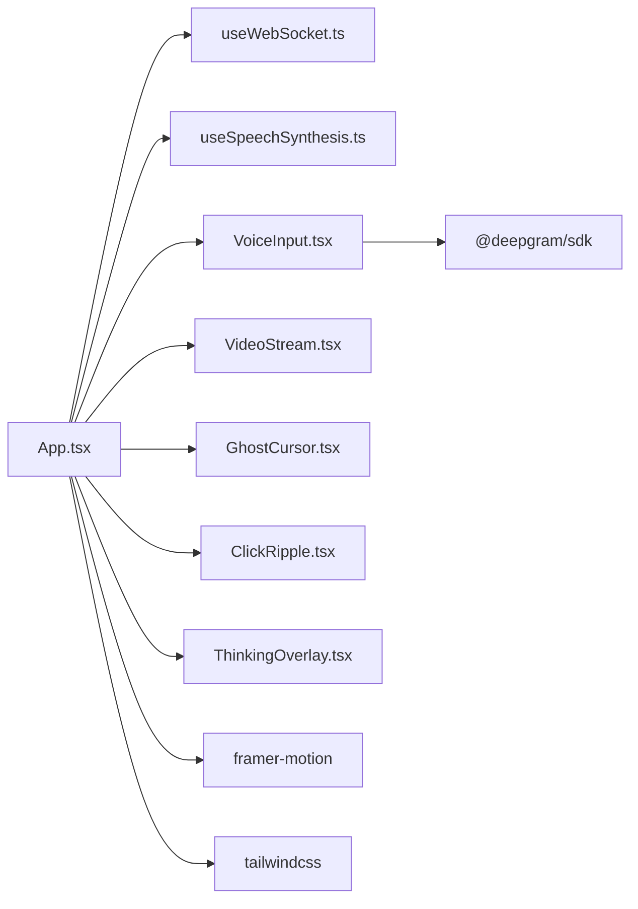

**Diagram sources**
- [App.tsx](file://frontend/src/App.tsx#L1-L12)
- [VoiceInput.tsx](file://frontend/src/components/VoiceInput.tsx#L4-L4)
- [package.json](file://frontend/package.json#L12-L16)

**Section sources**
- [package.json](file://frontend/package.json#L1-L34)
- [tailwind.config.js](file://frontend/tailwind.config.js#L1-L39)

## Performance Considerations
- Minimize re-renders by deriving derived values with useMemo in components like VideoStream.
- Debounce or throttle frequent state updates (e.g., cursor positions) to reduce layout thrash.
- Prefer CSS transforms and opacity for animations to leverage GPU acceleration.
- Avoid unnecessary subscriptions by cleaning up MediaRecorder and timers in VoiceInput.
- Use lazy initialization for speech synthesis to prevent early creation of utterances.
- Keep animation durations reasonable; excessive durations increase perceived latency.
- Image rendering: Use crisp-edges for screenshots to avoid blurriness on zoomed content.

[No sources needed since this section provides general guidance]

## Troubleshooting Guide
Common issues and resolutions:
- WebSocket not connecting:
  - Verify backend endpoint and CORS/proxy configuration.
  - Check browser console for connection errors and auto-reconnect logs.
- Voice input not working:
  - Ensure microphone permissions are granted.
  - Confirm VITE_DEEPGRAM_API_KEY is set and valid.
  - Check that MediaRecorder is supported and audio tracks are stopped on cleanup.
- Visual artifacts:
  - Confirm Tailwind utilities are applied and custom ghost colors are defined.
  - Verify image data URLs are properly prefixed in VideoStream.
- Speech synthesis interruptions:
  - Use the immediate flag to cancel ongoing speech when urgent updates occur.
- CAPTCHA stalls:
  - Use the manual override button to signal backend to skip waiting.

**Section sources**
- [useWebSocket.ts](file://frontend/src/hooks/useWebSocket.ts#L39-L57)
- [VoiceInput.tsx](file://frontend/src/components/VoiceInput.tsx#L121-L129)
- [VideoStream.tsx](file://frontend/src/components/VideoStream.tsx#L13-L18)
- [useSpeechSynthesis.ts](file://frontend/src/hooks/useSpeechSynthesis.ts#L58-L63)

## Conclusion
The frontend component system centers around App.tsx, which orchestrates real-time visualization, voice-driven commands, and speech feedback. The cyberpunk aesthetic is achieved through a custom color palette, glassmorphism UI, and animated overlays. Robust hooks encapsulate WebSocket and speech synthesis concerns, enabling modular and maintainable UI components. Following the guidelines herein ensures responsive, accessible, and performant experiences across browsers.

[No sources needed since this section summarizes without analyzing specific files]

## Appendices

### Responsive Design Guidelines
- Use flexbox and grid utilities to adapt layout across screen sizes.
- Prefer relative units and clamp-based sizing for scalable typography.
- Ensure touch-friendly targets for interactive elements.
- Test gesture areas on mobile devices and adjust padding/margins accordingly.

[No sources needed since this section provides general guidance]

### Dark Mode and Glassmorphism Styling
- Utilize ghost-themed Tailwind tokens for backgrounds, borders, and accents.
- Apply backdrop blur and semi-transparent fills for frosted-glass panels.
- Maintain sufficient contrast for readability; avoid pure black backgrounds for text.

**Section sources**
- [tailwind.config.js](file://frontend/tailwind.config.js#L9-L20)
- [index.css](file://frontend/src/styles/index.css#L21-L27)

### Cyberpunk Aesthetic Implementation
- Neon glows: Use ghost-primary and ghost-accent colors for highlights and borders.
- Glitchy motion: Combine subtle pulses and scanner-line rotations for futuristic feel.
- Typography: Pair Inter for body and JetBrains Mono for code-like elements.

**Section sources**
- [tailwind.config.js](file://frontend/tailwind.config.js#L21-L31)
- [index.css](file://frontend/src/styles/index.css#L15-L17)

### Cross-Browser Compatibility
- Speech Synthesis: Not all browsers expose the same voices; prefer female voices when available.
- WebRTC/MediaRecorder: Ensure HTTPS for microphone access; polyfills may be needed for legacy environments.
- WebSocket: Modern browsers support native WebSocket; server-side should handle permessage-deflate if enabled.
- CSS: Use Tailwind utilities to avoid vendor-prefixed properties; validate animations across engines.

[No sources needed since this section provides general guidance]