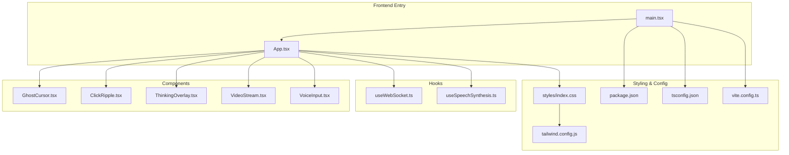
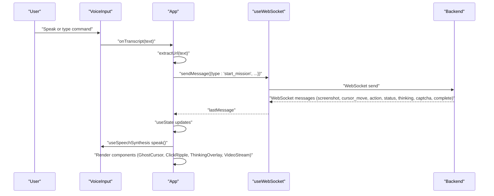
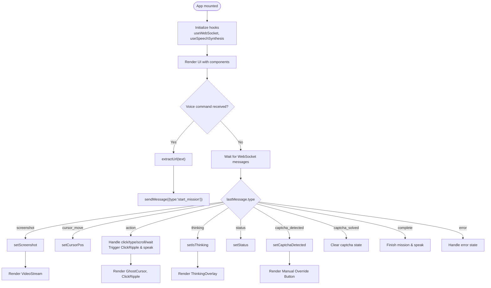
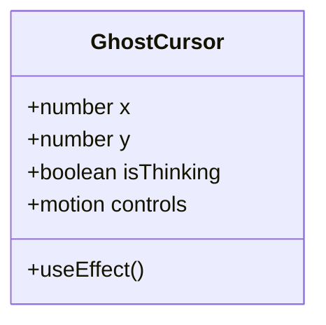
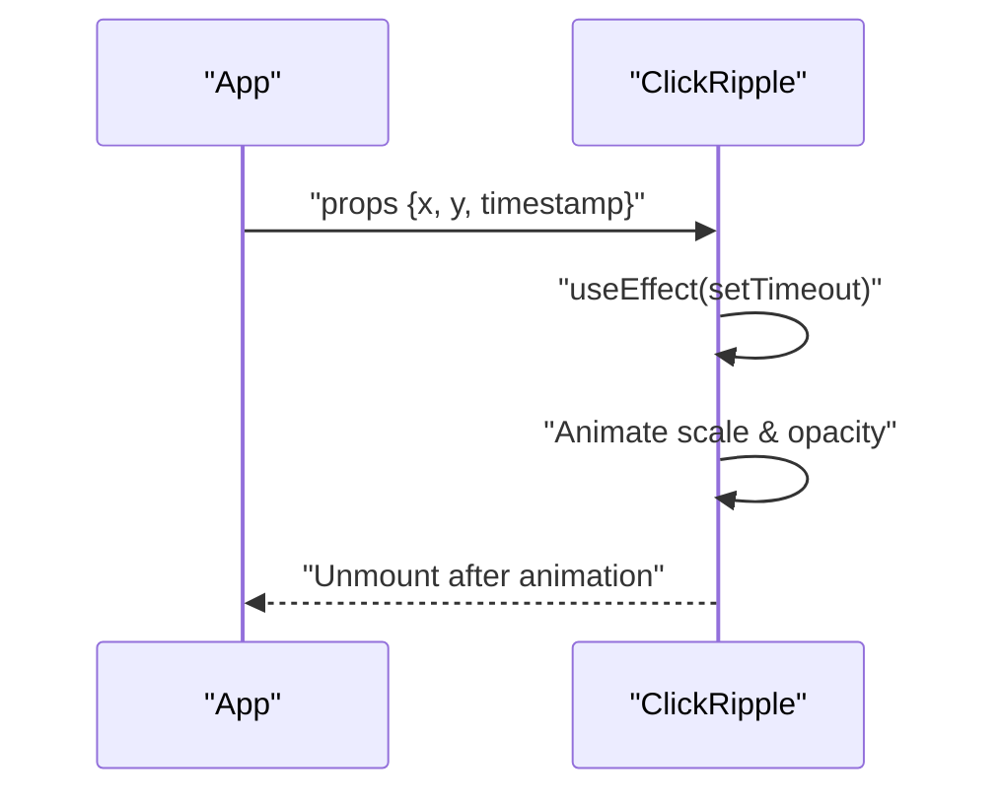
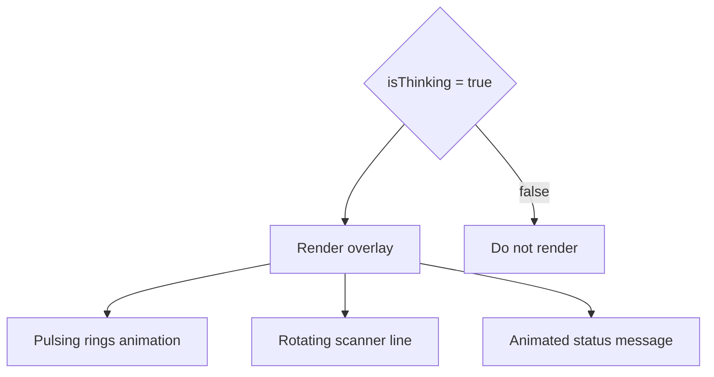
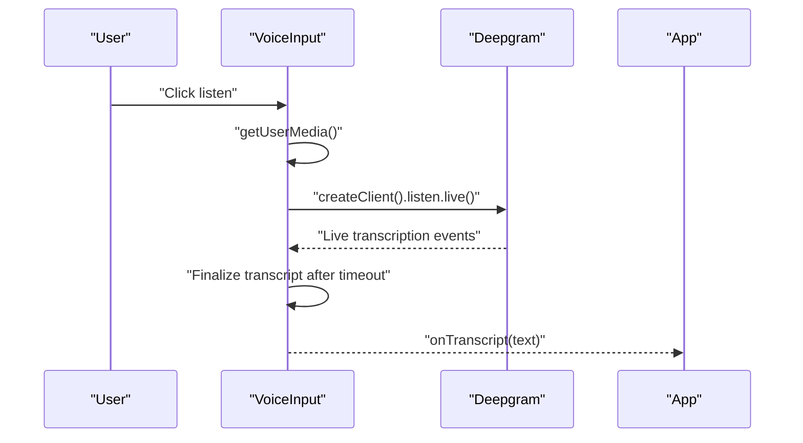
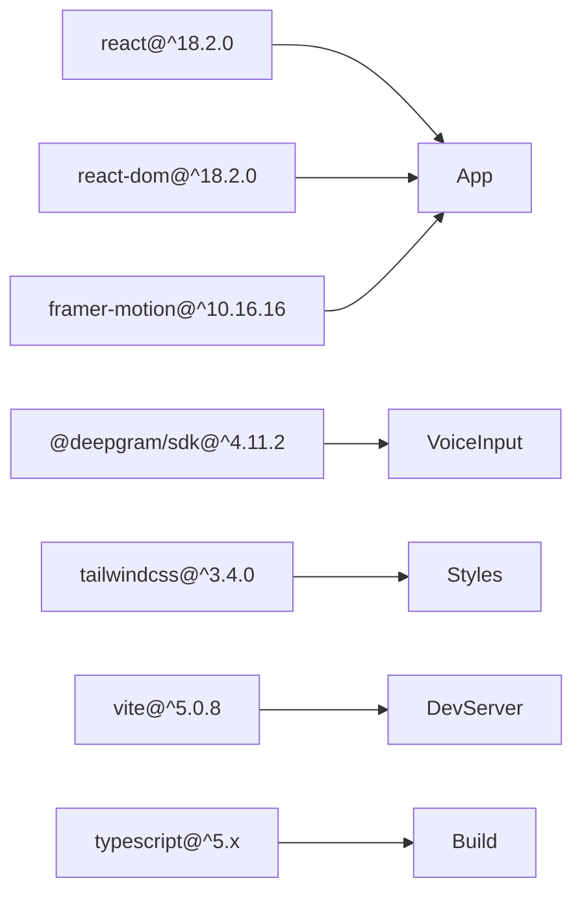

# React Application Architecture

<cite>
**Referenced Files in This Document**
- [App.tsx](file://frontend/src/App.tsx)
- [main.tsx](file://frontend/src/main.tsx)
- [GhostCursor.tsx](file://frontend/src/components/GhostCursor.tsx)
- [ClickRipple.tsx](file://frontend/src/components/ClickRipple.tsx)
- [ThinkingOverlay.tsx](file://frontend/src/components/ThinkingOverlay.tsx)
- [VideoStream.tsx](file://frontend/src/components/VideoStream.tsx)
- [VoiceInput.tsx](file://frontend/src/components/VoiceInput.tsx)
- [useWebSocket.ts](file://frontend/src/hooks/useWebSocket.ts)
- [useSpeechSynthesis.ts](file://frontend/src/hooks/useSpeechSynthesis.ts)
- [index.css](file://frontend/src/styles/index.css)
- [tailwind.config.js](file://frontend/tailwind.config.js)
- [vite.config.ts](file://frontend/vite.config.ts)
- [package.json](file://frontend/package.json)
- [tsconfig.json](file://frontend/tsconfig.json)
</cite>

## Table of Contents
1. [Introduction](#introduction)
2. [Project Structure](#project-structure)
3. [Core Components](#core-components)
4. [Architecture Overview](#architecture-overview)
5. [Detailed Component Analysis](#detailed-component-analysis)
6. [Dependency Analysis](#dependency-analysis)
7. [Performance Considerations](#performance-considerations)
8. [Troubleshooting Guide](#troubleshooting-guide)
9. [Conclusion](#conclusion)

## Introduction
This document describes the React application architecture for the Ghost Pilot autonomous browser agent. The frontend is a Vite-powered TypeScript application that integrates real-time WebSocket communication, voice input via Deepgram, animated UI feedback with Framer Motion, and a responsive design system built with TailwindCSS. The central App component coordinates state and orchestrates child components for cursor visualization, click effects, thinking overlays, video stream display, and voice interaction.

## Project Structure
The frontend is organized around a single-page application pattern:
- Entry point renders the root App component inside React.StrictMode
- App component manages global state and composes feature components
- Components are grouped under src/components and share a common styling layer
- Hooks encapsulate cross-cutting concerns like WebSocket messaging and speech synthesis
- Build system uses Vite with React plugin, TailwindCSS, and TypeScript

**Diagram sources**
- [main.tsx](file://frontend/src/main.tsx#L1-L11)
- [App.tsx](file://frontend/src/App.tsx#L1-L360)
- [GhostCursor.tsx](file://frontend/src/components/GhostCursor.tsx#L1-L99)
- [ClickRipple.tsx](file://frontend/src/components/ClickRipple.tsx#L1-L35)
- [ThinkingOverlay.tsx](file://frontend/src/components/ThinkingOverlay.tsx#L1-L78)
- [VideoStream.tsx](file://frontend/src/components/VideoStream.tsx#L1-L43)
- [VoiceInput.tsx](file://frontend/src/components/VoiceInput.tsx#L1-L321)
- [useWebSocket.ts](file://frontend/src/hooks/useWebSocket.ts#L1-L93)
- [useSpeechSynthesis.ts](file://frontend/src/hooks/useSpeechSynthesis.ts#L1-L79)
- [index.css](file://frontend/src/styles/index.css#L1-L107)
- [tailwind.config.js](file://frontend/tailwind.config.js#L1-L39)
- [vite.config.ts](file://frontend/vite.config.ts#L1-L23)
- [package.json](file://frontend/package.json#L1-L34)
- [tsconfig.json](file://frontend/tsconfig.json#L1-L33)

**Section sources**
- [main.tsx](file://frontend/src/main.tsx#L1-L11)
- [package.json](file://frontend/package.json#L1-L34)
- [vite.config.ts](file://frontend/vite.config.ts#L1-L23)
- [tsconfig.json](file://frontend/tsconfig.json#L1-L33)

## Core Components
The App component serves as the central coordinator, managing:
- WebSocket connection and message routing
- Cursor position and click ripple effects
- Thinking state and overlay
- Mission status and objectives
- Captcha detection and manual override
- Voice command initiation and URL extraction

State management patterns:
- useState for local UI state (cursor position, thinking, status, objectives, captcha detection)
- useEffect for side effects (WebSocket message handling, speech synthesis triggers)
- useCallback and useRef for hook lifecycles and stable references

Integration points:
- Framer Motion for animations and transitions
- TailwindCSS for responsive design and glassmorphism UI
- Environment variables for WebSocket and Deepgram configuration

**Section sources**
- [App.tsx](file://frontend/src/App.tsx#L14-L123)
- [useWebSocket.ts](file://frontend/src/hooks/useWebSocket.ts#L15-L92)
- [useSpeechSynthesis.ts](file://frontend/src/hooks/useSpeechSynthesis.ts#L3-L78)

## Architecture Overview
The application follows a unidirectional data flow:
- VoiceInput captures user commands and sends them to App
- App extracts URLs from commands and sends a mission start message via WebSocket
- Backend responds with screenshots, cursor positions, actions, and status updates
- App updates state and renders visual feedback through child components

**Diagram sources**
- [VoiceInput.tsx](file://frontend/src/components/VoiceInput.tsx#L14-L171)
- [App.tsx](file://frontend/src/App.tsx#L146-L166)
- [useWebSocket.ts](file://frontend/src/hooks/useWebSocket.ts#L60-L66)
- [useSpeechSynthesis.ts](file://frontend/src/hooks/useSpeechSynthesis.ts#L55-L67)

## Detailed Component Analysis

### App Component
Responsibilities:
- Central state coordinator for cursor, thinking, status, objectives, and captcha detection
- WebSocket message router handling multiple message types
- Voice command processing and mission initiation
- Conditional rendering of overlays and effects

Key behaviors:
- Uses useEffect to process lastMessage and update state accordingly
- Implements URL extraction from voice commands
- Integrates speech synthesis for status and action feedback
- Manages manual captcha override flow

**Diagram sources**
- [App.tsx](file://frontend/src/App.tsx#L14-L123)
- [App.tsx](file://frontend/src/App.tsx#L125-L166)

**Section sources**
- [App.tsx](file://frontend/src/App.tsx#L14-L360)

### GhostCursor Component
Responsibilities:
- Animated cursor overlay synchronized with backend cursor positions
- Visual feedback during thinking state with pulsing glow and trail effects
- Spring-based motion for smooth cursor movement

Implementation patterns:
- Uses Framer Motion controls to animate position updates
- Conditional rendering of thinking indicator and glow effects
- SVG-based cursor with dynamic opacity and scaling

**Diagram sources**
- [GhostCursor.tsx](file://frontend/src/components/GhostCursor.tsx#L10-L98)

**Section sources**
- [GhostCursor.tsx](file://frontend/src/components/GhostCursor.tsx#L1-L99)

### ClickRipple Component
Responsibilities:
- Visual ripple effect at click locations
- Temporary overlay with fade-out animation
- Automatic cleanup after animation completes

Implementation patterns:
- AnimatePresence for enter/exit animations
- Timer-based cleanup to prevent memory leaks
- Motion primitives for scale and opacity transitions

**Diagram sources**
- [ClickRipple.tsx](file://frontend/src/components/ClickRipple.tsx#L10-L34)

**Section sources**
- [ClickRipple.tsx](file://frontend/src/components/ClickRipple.tsx#L1-L35)

### ThinkingOverlay Component
Responsibilities:
- Fullscreen overlay during AI analysis
- Radar-style scanning animation with pulsing rings
- Continuous status messaging with animated opacity

Implementation patterns:
- AnimatePresence for smooth appear/disappear
- Multiple concurrent motion animations with staggered timing
- Glassmorphism styling with backdrop blur

**Diagram sources**
- [ThinkingOverlay.tsx](file://frontend/src/components/ThinkingOverlay.tsx#L8-L77)

**Section sources**
- [ThinkingOverlay.tsx](file://frontend/src/components/ThinkingOverlay.tsx#L1-L78)

### VideoStream Component
Responsibilities:
- Display live browser screenshots from backend
- Handle base64 and data URL formats
- Graceful loading state with spinner and message

Implementation patterns:
- useMemo to avoid unnecessary re-renders for image URL construction
- Conditional rendering for loading state
- Tailwind classes for responsive sizing and crisp image rendering

**Section sources**
- [VideoStream.tsx](file://frontend/src/components/VideoStream.tsx#L1-L43)

### VoiceInput Component
Responsibilities:
- Real-time voice transcription via Deepgram SDK
- Manual text input fallback
- Microphone permission handling and cleanup
- Integration with App for mission initiation

Implementation patterns:
- MediaRecorder streaming to Deepgram WebSocket
- Transcript finalization with timeout mechanism
- Framer Motion for visual feedback during listening
- Environment variable validation for API key

**Diagram sources**
- [VoiceInput.tsx](file://frontend/src/components/VoiceInput.tsx#L41-L130)
- [VoiceInput.tsx](file://frontend/src/components/VoiceInput.tsx#L165-L171)

**Section sources**
- [VoiceInput.tsx](file://frontend/src/components/VoiceInput.tsx#L1-L321)

### Hooks

#### useWebSocket Hook
Responsibilities:
- Manage WebSocket lifecycle (connect, reconnect, disconnect)
- Parse and expose incoming messages
- Provide sendMessage utility

Implementation patterns:
- useRef for persistent WebSocket reference
- useCallback for stable function references
- Auto-reconnect with exponential backoff strategy
- JSON parsing with error handling

**Section sources**
- [useWebSocket.ts](file://frontend/src/hooks/useWebSocket.ts#L15-L92)

#### useSpeechSynthesis Hook
Responsibilities:
- Queue-based speech synthesis to avoid overlapping
- Voice preference selection (female voices)
- Immediate interruption for urgent announcements

Implementation patterns:
- Queue management with ref-based state
- Web Speech API integration
- Error handling and cleanup

**Section sources**
- [useSpeechSynthesis.ts](file://frontend/src/hooks/useSpeechSynthesis.ts#L3-L78)

## Dependency Analysis
Runtime dependencies and build configuration:
- React 18.2.0 with React DOM for rendering
- Framer Motion 10.16.16 for animations
- @deepgram/sdk 4.11.2 for voice transcription
- TailwindCSS 3.4.0 for styling
- Vite 5.0.8 for dev server and bundling
- TypeScript 5.x for type safety

Build and development:
- Vite config with WebSocket proxy to backend
- Tailwind content scanning for utility classes
- PostCSS pipeline with Tailwind and Autoprefixer
- Strict TypeScript compiler options

**Diagram sources**
- [package.json](file://frontend/package.json#L12-L31)
- [vite.config.ts](file://frontend/vite.config.ts#L5-L22)
- [tailwind.config.js](file://frontend/tailwind.config.js#L1-L39)

**Section sources**
- [package.json](file://frontend/package.json#L1-L34)
- [vite.config.ts](file://frontend/vite.config.ts#L1-L23)
- [tailwind.config.js](file://frontend/tailwind.config.js#L1-L39)

## Performance Considerations
- Memoization: VideoStream uses useMemo to prevent unnecessary image URL recomputation
- Animation optimization: GhostCursor leverages spring physics with tuned damping/stiffness
- Event throttling: VoiceInput uses timeouts to batch final transcripts
- Memory management: ClickRipple and VoiceInput implement cleanup timers and stream stops
- Bundle size: Vite tree-shaking with React plugin minimizes production bundle

## Troubleshooting Guide
Common issues and resolutions:
- WebSocket connectivity: Check VITE_WS_URL environment variable and backend availability
- Voice input errors: Verify VITE_DEEPGRAM_API_KEY and microphone permissions
- Animation glitches: Ensure Framer Motion and Tailwind utilities are properly loaded
- Build failures: Confirm TypeScript strict mode settings and Vite plugin configuration

Environment variables:
- VITE_WS_URL: WebSocket endpoint for backend communication
- VITE_DEEPGRAM_API_KEY: Deepgram API key for voice transcription

Proxy configuration:
- Vite proxy routes /ws to ws://localhost:8000 for development

**Section sources**
- [App.tsx](file://frontend/src/App.tsx#L11-L12)
- [VoiceInput.tsx](file://frontend/src/components/VoiceInput.tsx#L11)
- [vite.config.ts](file://frontend/vite.config.ts#L10-L16)

## Conclusion
The Ghost Pilot frontend demonstrates a clean separation of concerns with the App component as the central orchestrator. State management relies on React hooks with predictable side effects, while Framer Motion and TailwindCSS provide polished animations and responsive design. The architecture supports real-time collaboration with backend services through WebSocket communication and integrates voice input for natural user interaction. The modular component structure and well-defined hooks enable maintainability and extensibility for future enhancements.