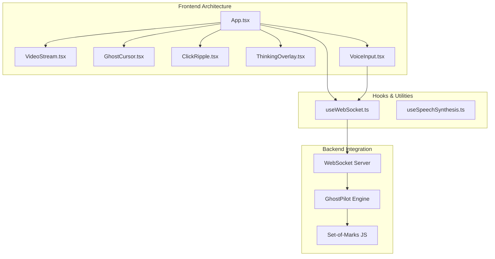
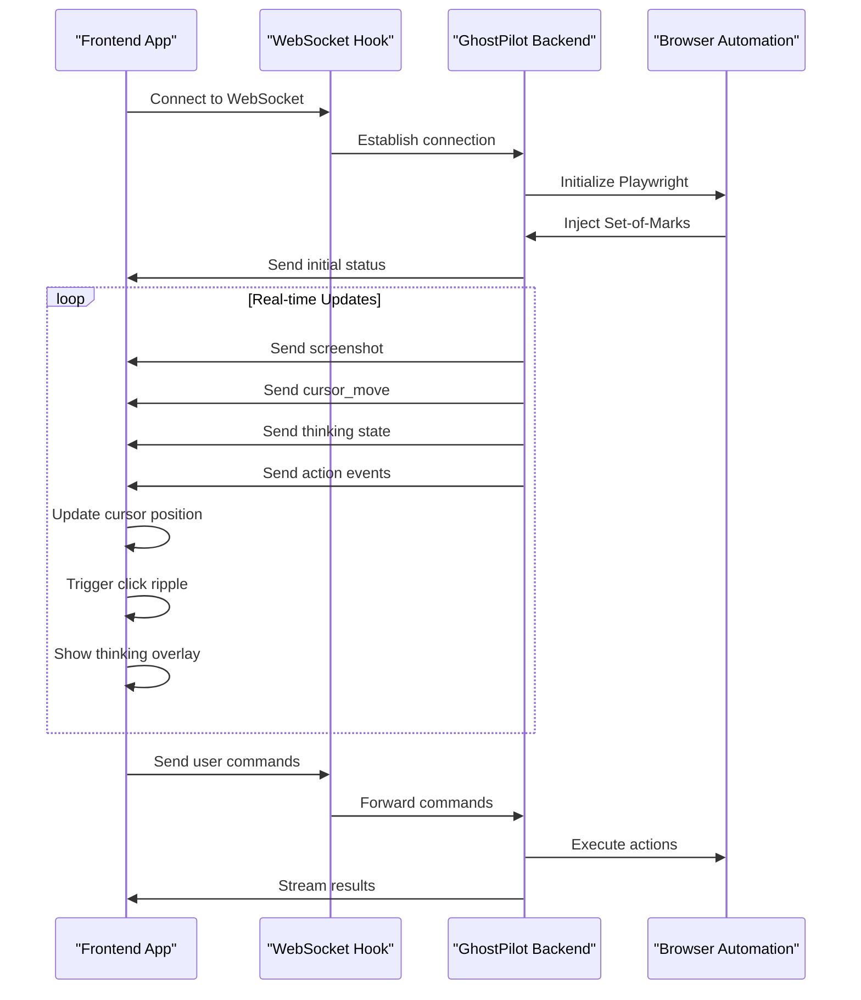
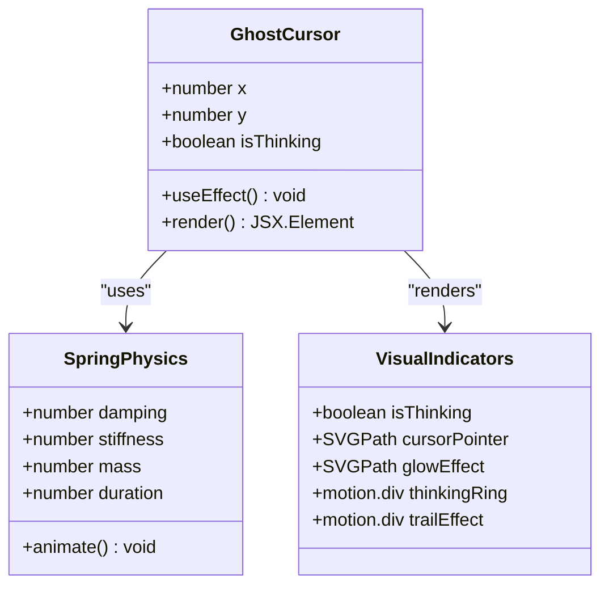
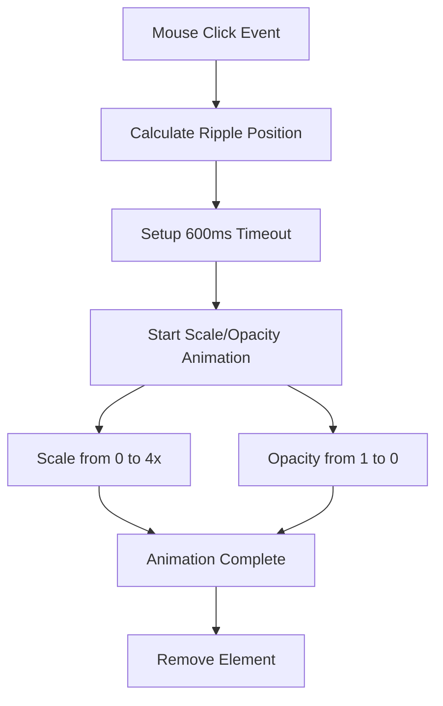
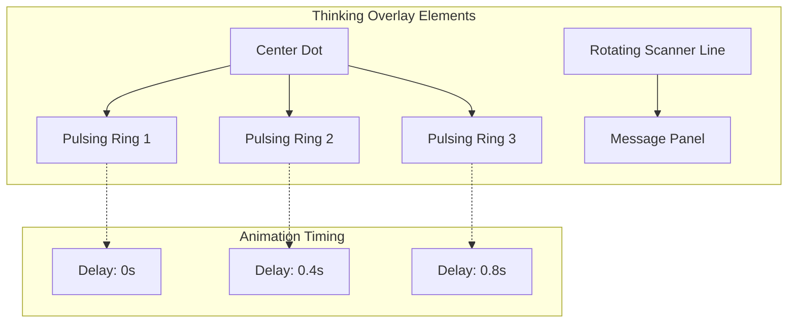
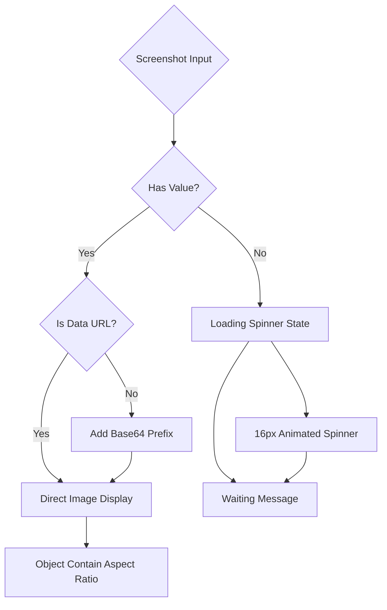
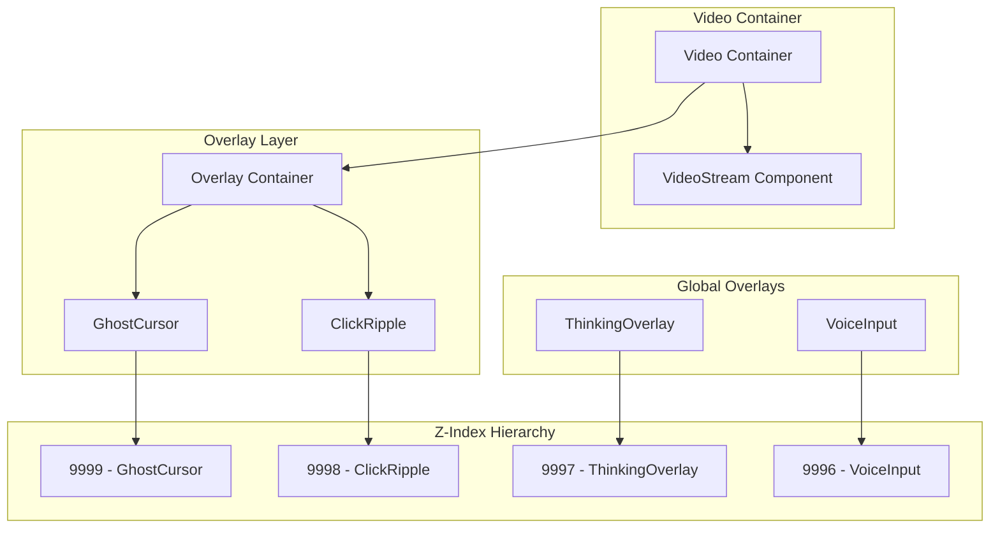
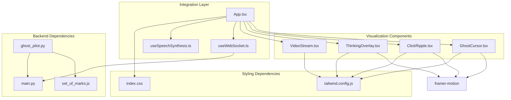

# Real-Time Visualization System

<cite>
**Referenced Files in This Document**
- [GhostCursor.tsx](file://frontend/src/components/GhostCursor.tsx)
- [ClickRipple.tsx](file://frontend/src/components/ClickRipple.tsx)
- [ThinkingOverlay.tsx](file://frontend/src/components/ThinkingOverlay.tsx)
- [VideoStream.tsx](file://frontend/src/components/VideoStream.tsx)
- [App.tsx](file://frontend/src/App.tsx)
- [useWebSocket.ts](file://frontend/src/hooks/useWebSocket.ts)
- [useSpeechSynthesis.ts](file://frontend/src/hooks/useSpeechSynthesis.ts)
- [VoiceInput.tsx](file://frontend/src/components/VoiceInput.tsx)
- [index.css](file://frontend/src/styles/index.css)
- [tailwind.config.js](file://frontend/tailwind.config.js)
- [main.py](file://backend/main.py)
- [ghost_pilot.py](file://backend/ghost_pilot.py)
- [set_of_marks.js](file://backend/set_of_marks.js)
</cite>

## Table of Contents
1. [Introduction](#introduction)
2. [Project Structure](#project-structure)
3. [Core Components](#core-components)
4. [Architecture Overview](#architecture-overview)
5. [Detailed Component Analysis](#detailed-component-analysis)
6. [Dependency Analysis](#dependency-analysis)
7. [Performance Considerations](#performance-considerations)
8. [Troubleshooting Guide](#troubleshooting-guide)
9. [Conclusion](#conclusion)

## Introduction
This document provides comprehensive technical documentation for the real-time visualization system that powers the Ghost Pilot autonomous browser agent. The system consists of four primary components: GhostCursor for animated cursor visualization with spring physics, ClickRipple for click feedback effects, ThinkingOverlay for AI processing radar animations, and VideoStream for displaying live browser screenshots. The system integrates seamlessly with a WebSocket-based backend that streams cursor positions, screenshots, and AI processing states in real-time.

The visualization system operates within a layered overlay architecture that positions these components precisely over the live video feed while maintaining proper z-index ordering and pointer-events handling for seamless user interaction. The system demonstrates sophisticated coordinate system transformations, animation timing controls, and performance optimization techniques tailored for real-time browser automation visualization.

## Project Structure
The real-time visualization system is organized within a React-based frontend architecture with TypeScript and Tailwind CSS styling. The system follows a component-based structure with clear separation of concerns:

**Diagram sources**
- [App.tsx](file://frontend/src/App.tsx#L176-L356)
- [useWebSocket.ts](file://frontend/src/hooks/useWebSocket.ts#L15-L92)
- [main.py](file://backend/main.py#L36-L153)

**Section sources**
- [App.tsx](file://frontend/src/App.tsx#L1-L360)
- [package.json](file://frontend/package.json#L1-L34)

## Core Components
The real-time visualization system comprises four core components, each serving a specific purpose in the autonomous browser automation workflow:

### GhostCursor Component
The GhostCursor provides animated cursor visualization with spring physics simulation, position tracking, and thinking state visualization. It implements sophisticated animation timing with configurable spring dynamics and visual feedback indicators.

### ClickRipple Component
The ClickRipple creates visual feedback effects at click locations with precise animation timing and positioning. It utilizes Framer Motion's AnimatePresence for efficient animation lifecycle management.

### ThinkingOverlay Component
The ThinkingOverlay implements radar-style animations during AI processing phases, featuring pulsing rings, rotating scanner lines, and centered dot indicators that communicate analytical states to users.

### VideoStream Component
The VideoStream displays live browser screenshots with proper aspect ratio handling and comprehensive image loading states, including loading spinners and error conditions.

**Section sources**
- [GhostCursor.tsx](file://frontend/src/components/GhostCursor.tsx#L1-L99)
- [ClickRipple.tsx](file://frontend/src/components/ClickRipple.tsx#L1-L35)
- [ThinkingOverlay.tsx](file://frontend/src/components/ThinkingOverlay.tsx#L1-L78)
- [VideoStream.tsx](file://frontend/src/components/VideoStream.tsx#L1-L43)

## Architecture Overview
The real-time visualization system operates through a sophisticated WebSocket-based architecture that enables bidirectional communication between the frontend and backend systems:

**Diagram sources**
- [App.tsx](file://frontend/src/App.tsx#L26-L123)
- [useWebSocket.ts](file://frontend/src/hooks/useWebSocket.ts#L15-L92)
- [ghost_pilot.py](file://backend/ghost_pilot.py#L623-L761)

The architecture ensures seamless integration between the autonomous browser engine and the visualization layer, with real-time synchronization of cursor positions, click feedback, and AI processing states.

**Section sources**
- [App.tsx](file://frontend/src/App.tsx#L14-L123)
- [main.py](file://backend/main.py#L36-L153)

## Detailed Component Analysis

### GhostCursor Component Analysis
The GhostCursor component implements advanced spring physics simulation for smooth cursor movement with configurable damping, stiffness, and mass properties. The component maintains precise coordinate system alignment with the underlying browser viewport.

**Diagram sources**
- [GhostCursor.tsx](file://frontend/src/components/GhostCursor.tsx#L10-L98)

**Spring Physics Configuration:**
- Damping: 25 (controls oscillation decay)
- Stiffness: 200 (resistance to displacement)
- Mass: 0.5 (inertia factor)
- Duration: 0.6s (animation timing)

**Visual Effects:**
- Main cursor with neon blue glow (`#00d9ff`)
- Thinking state pulsing ring animation
- Trail effect with opacity and scaling transitions
- Drop shadow filtering for enhanced visibility

**Section sources**
- [GhostCursor.tsx](file://frontend/src/components/GhostCursor.tsx#L13-L25)
- [GhostCursor.tsx](file://frontend/src/components/GhostCursor.tsx#L43-L66)
- [GhostCursor.tsx](file://frontend/src/components/GhostCursor.tsx#L68-L95)

### ClickRipple Component Analysis
The ClickRipple component provides immediate visual feedback for user interactions through expanding circular ripples with precise timing control and positioning calculations.

**Diagram sources**
- [ClickRipple.tsx](file://frontend/src/components/ClickRipple.tsx#L13-L16)
- [ClickRipple.tsx](file://frontend/src/components/ClickRipple.tsx#L24-L27)

**Animation Specifications:**
- Duration: 0.6 seconds
- Ease: easeOut
- Scale: 0 → 4 (with 12px radius)
- Opacity: 1 → 0
- Z-index: 9998 (below cursor)

**Section sources**
- [ClickRipple.tsx](file://frontend/src/components/ClickRipple.tsx#L10-L34)

### ThinkingOverlay Component Analysis
The ThinkingOverlay implements sophisticated radar-style animations that communicate AI processing states through synchronized visual elements.

**Diagram sources**
- [ThinkingOverlay.tsx](file://frontend/src/components/ThinkingOverlay.tsx#L25-L42)
- [ThinkingOverlay.tsx](file://frontend/src/components/ThinkingOverlay.tsx#L44-L54)

**Radar Animation Specifications:**
- Pulsing rings: 3 rings with staggered delays
- Ring animation: scale 0→2, opacity 1→0
- Rotation: 360° continuous rotation
- Message panel: subtle opacity pulsing

**Section sources**
- [ThinkingOverlay.tsx](file://frontend/src/components/ThinkingOverlay.tsx#L8-L77)

### VideoStream Component Analysis
The VideoStream component handles live screenshot display with robust base64 encoding support, aspect ratio preservation, and comprehensive loading states.

**Diagram sources**
- [VideoStream.tsx](file://frontend/src/components/VideoStream.tsx#L9-L19)
- [VideoStream.tsx](file://frontend/src/components/VideoStream.tsx#L23-L29)

**Image Rendering Optimizations:**
- `object-contain` for aspect ratio preservation
- `image-rendering: crisp-edges` for pixel-perfect display
- Automatic base64 data URL detection and prefixing

**Section sources**
- [VideoStream.tsx](file://frontend/src/components/VideoStream.tsx#L8-L42)

### Overlay Layer Architecture
The overlay layer system positions visualization components with precise z-index management and pointer-events handling for seamless user interaction.

**Diagram sources**
- [App.tsx](file://frontend/src/App.tsx#L247-L262)
- [App.tsx](file://frontend/src/App.tsx#L353-L354)

**Pointer Events Strategy:**
- Video container: `pointer-events: none` to allow clicks to pass through
- Overlay layer: `pointer-events: none` for cursor and effects
- Global overlays: `pointer-events: auto` for interactive elements

**Section sources**
- [App.tsx](file://frontend/src/App.tsx#L248-L261)
- [App.tsx](file://frontend/src/App.tsx#L252-L261)

## Dependency Analysis
The real-time visualization system exhibits strong component cohesion with clear dependency relationships and minimal coupling between modules.

**Diagram sources**
- [package.json](file://frontend/package.json#L12-L17)
- [App.tsx](file://frontend/src/App.tsx#L1-L10)
- [ghost_pilot.py](file://backend/ghost_pilot.py#L1-L105)

**External Dependencies:**
- **Framer Motion**: Animation library for smooth transitions and physics-based animations
- **React**: Component framework for building user interfaces
- **Tailwind CSS**: Utility-first CSS framework for styling
- **Deepgram SDK**: Voice recognition integration

**Section sources**
- [package.json](file://frontend/package.json#L12-L32)
- [tailwind.config.js](file://frontend/tailwind.config.js#L8-L20)

## Performance Considerations
The real-time visualization system implements several performance optimization techniques to ensure smooth operation during autonomous browser automation:

### Animation Performance
- **Hardware Acceleration**: All animations utilize transform and opacity properties for GPU acceleration
- **Spring Physics Optimization**: Configured damping and stiffness values minimize computational overhead
- **Animation Caching**: Framer Motion efficiently manages animation state and lifecycle

### Memory Management
- **Component Cleanup**: Proper useEffect cleanup prevents memory leaks in animation components
- **Animation Lifecycle**: AnimatePresence components automatically clean up unused elements
- **State Optimization**: Minimal state updates reduce re-render cycles

### Network Performance
- **WebSocket Efficiency**: Bidirectional streaming minimizes latency for real-time updates
- **Base64 Encoding**: Efficient binary-to-text conversion for screenshot transmission
- **Connection Reuse**: Persistent WebSocket connections eliminate connection overhead

### Rendering Optimization
- **Aspect Ratio Preservation**: Object containment prevents expensive layout recalculations
- **Pointer Events Optimization**: Strategic pointer-events usage reduces event handling overhead
- **Z-Index Management**: Proper layering minimizes paint operations

**Section sources**
- [GhostCursor.tsx](file://frontend/src/components/GhostCursor.tsx#L17-L23)
- [ClickRipple.tsx](file://frontend/src/components/ClickRipple.tsx#L13-L16)
- [VideoStream.tsx](file://frontend/src/components/VideoStream.tsx#L27-L28)

## Troubleshooting Guide

### WebSocket Connection Issues
**Problem**: Frontend cannot establish WebSocket connection to backend
**Solution**: Verify WebSocket URL configuration and backend availability
- Check `VITE_WS_URL` environment variable
- Ensure backend server is running on port 8000
- Verify CORS configuration allows frontend origin

### Cursor Position Synchronization
**Problem**: GhostCursor position does not match actual mouse movements
**Solution**: Verify coordinate system alignment and transformation
- Confirm Set-of-Marks returns correct element centers
- Check viewport dimensions match displayed container
- Validate coordinate scaling between browser and overlay

### Animation Performance Issues
**Problem**: Visual effects appear choppy or lag behind user interactions
**Solution**: Optimize animation configurations and system resources
- Reduce animation complexity for lower-end devices
- Monitor CPU usage during intensive operations
- Consider animation throttling for battery-powered devices

### Image Loading Problems
**Problem**: Screenshots fail to display or show loading indefinitely
**Solution**: Verify base64 encoding and data URL formatting
- Ensure proper base64 prefix addition
- Check for corrupted screenshot data
- Validate image dimensions and aspect ratios

### Voice Input Integration
**Problem**: Voice recognition fails or produces poor results
**Solution**: Configure Deepgram API key and microphone permissions
- Verify `VITE_DEEPGRAM_API_KEY` environment variable
- Ensure microphone access permissions granted
- Check network connectivity for API calls

**Section sources**
- [useWebSocket.ts](file://frontend/src/hooks/useWebSocket.ts#L21-L58)
- [ghost_pilot.py](file://backend/ghost_pilot.py#L646-L657)
- [VoiceInput.tsx](file://frontend/src/components/VoiceInput.tsx#L42-L45)

## Conclusion
The real-time visualization system for Ghost Pilot demonstrates sophisticated engineering principles in autonomous browser automation visualization. The system successfully integrates four specialized components—animated cursor visualization, click feedback effects, AI processing overlays, and live screenshot display—into a cohesive real-time architecture.

Key achievements include:
- **Precision Coordination**: Spring physics-based cursor movement with accurate coordinate system alignment
- **Seamless Integration**: Smooth WebSocket-based communication between frontend and backend systems
- **Performance Optimization**: Hardware-accelerated animations with efficient memory management
- **User Experience**: Intuitive visual feedback that enhances transparency of autonomous operations

The system's modular architecture enables easy maintenance and extension while maintaining high performance standards essential for real-time browser automation scenarios. The thoughtful implementation of z-index layering, pointer-events handling, and animation timing creates a professional-grade visualization experience that effectively communicates the autonomous agent's activities to users.

Future enhancements could include additional visual feedback modes, customizable animation themes, and expanded integration with accessibility features for broader user inclusivity.