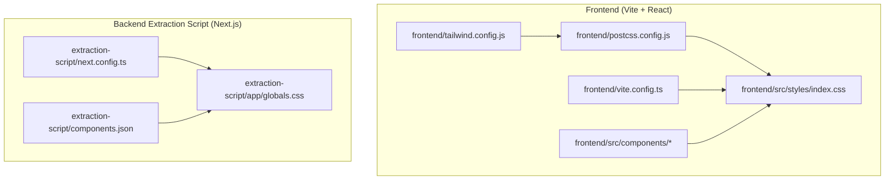
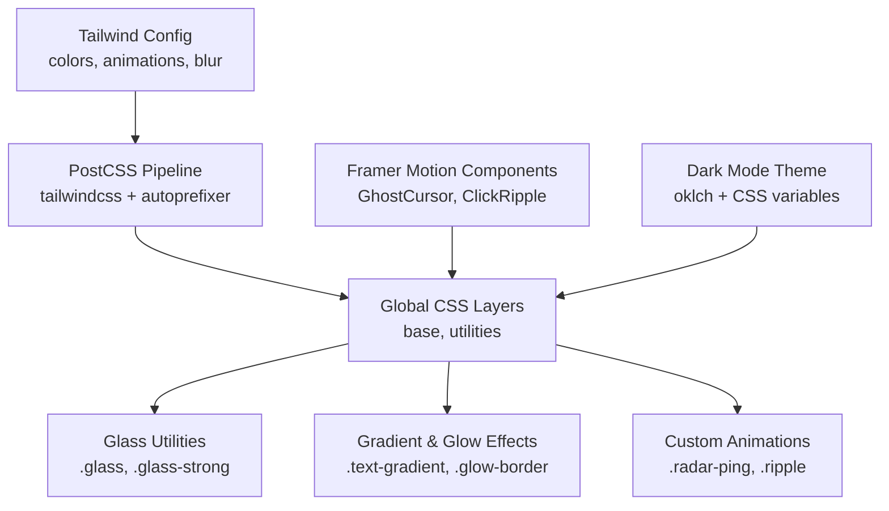
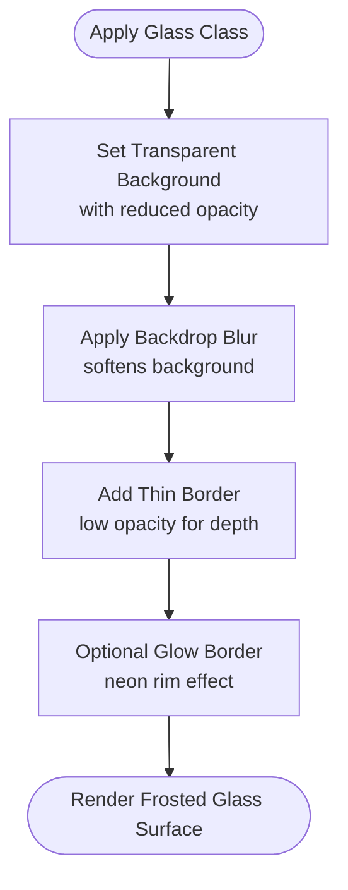
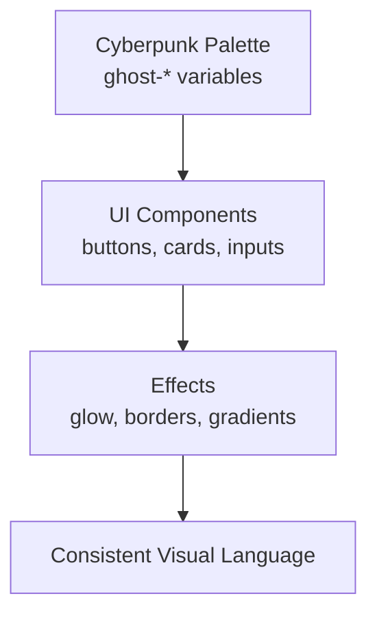
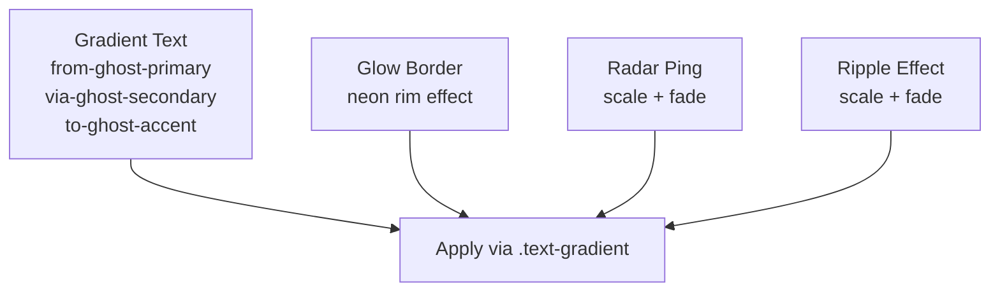
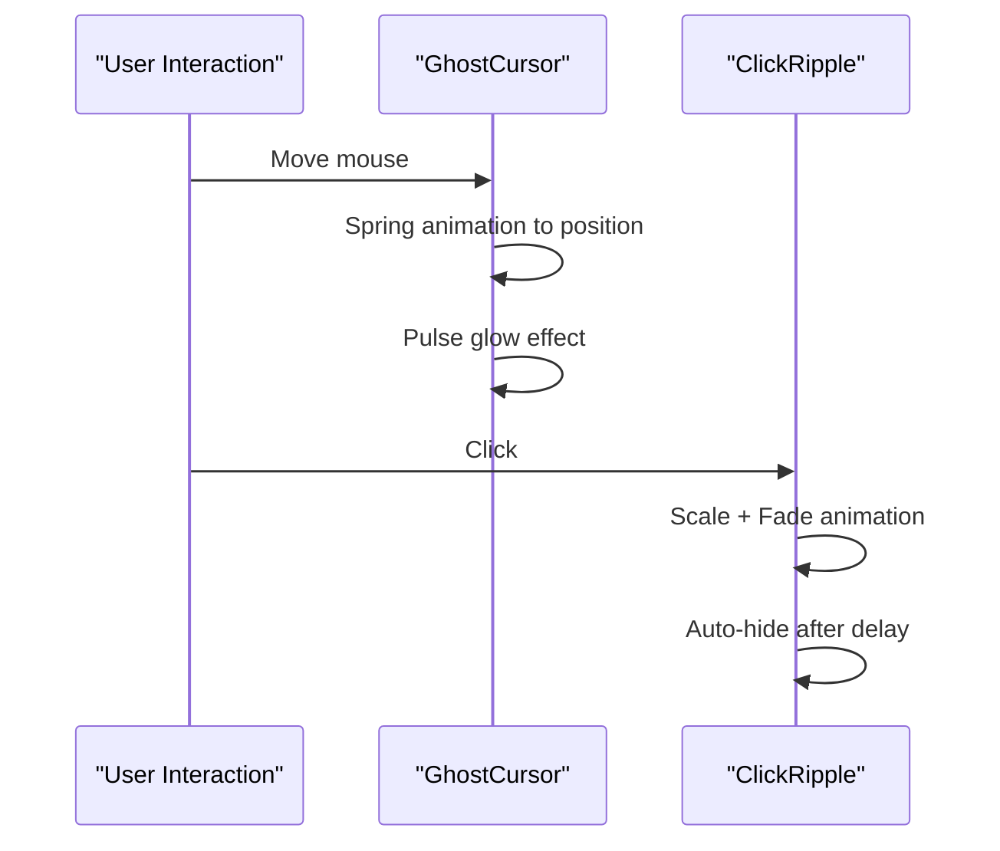
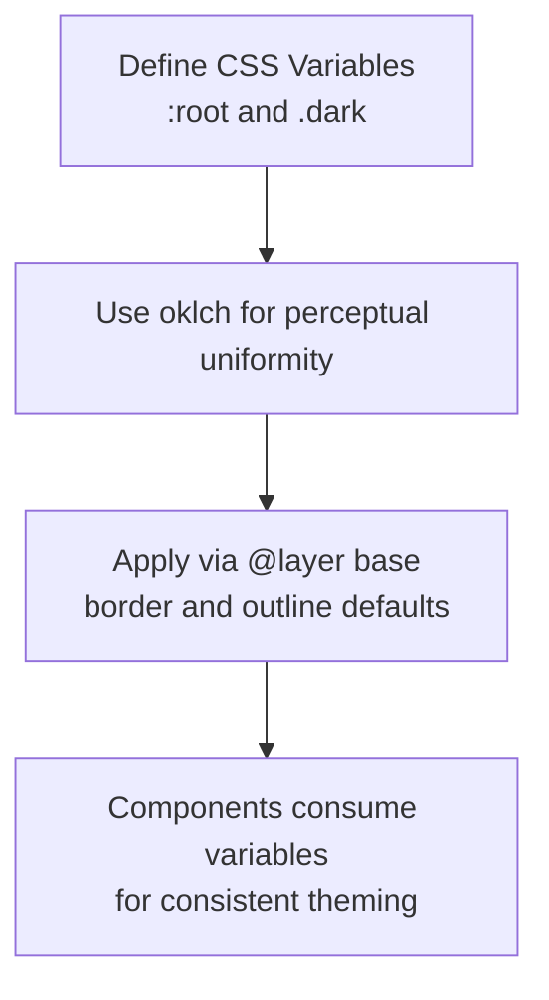
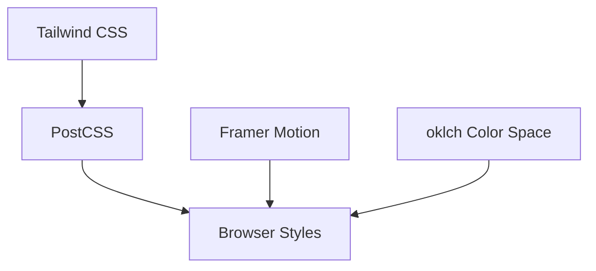

# UI Styling and Theming

<cite>
**Referenced Files in This Document**
- [frontend/tailwind.config.js](file://frontend/tailwind.config.js)
- [frontend/postcss.config.js](file://frontend/postcss.config.js)
- [frontend/src/styles/index.css](file://frontend/src/styles/index.css)
- [frontend/vite.config.ts](file://frontend/vite.config.ts)
- [frontend/src/components/ClickRipple.tsx](file://frontend/src/components/ClickRipple.tsx)
- [frontend/src/components/GhostCursor.tsx](file://frontend/src/components/GhostCursor.tsx)
- [extraction-script/app/globals.css](file://extraction-script/app/globals.css)
- [extraction-script/components.json](file://extraction-script/components.json)
- [extraction-script/next.config.ts](file://extraction-script/next.config.ts)
</cite>

## Table of Contents
1. [Introduction](#introduction)
2. [Project Structure](#project-structure)
3. [Core Components](#core-components)
4. [Architecture Overview](#architecture-overview)
5. [Detailed Component Analysis](#detailed-component-analysis)
6. [Dependency Analysis](#dependency-analysis)
7. [Performance Considerations](#performance-considerations)
8. [Troubleshooting Guide](#troubleshooting-guide)
9. [Conclusion](#conclusion)
10. [Appendices](#appendices)

## Introduction
This document describes the UI styling and theming system across the frontend and backend extraction script environments. It explains the glassmorphism design aesthetic using Tailwind CSS utility classes for frosted glass effects, transparent backgrounds, and subtle borders. It documents the cyberpunk color scheme implementation with ghost-bg, ghost-surface, ghost-primary, ghost-secondary, and ghost-border color variables. It covers the gradient background system using CSS gradients for the main container and animated elements. Responsive design patterns using flexbox and grid layouts are outlined, along with the animation system powered by Framer Motion for entrance/exit animations, pulse effects, and interactive states. Dark mode implementation and color accessibility considerations are addressed, alongside the typography system, spacing conventions, and component styling patterns. Finally, it covers the build configuration for Tailwind CSS and PostCSS processing, and provides guidelines for extending the theme system and adding new color variants or animation effects.

## Project Structure
The styling system spans two distinct UI stacks:
- Frontend stack built with Vite, React, Tailwind CSS, and PostCSS. Glassmorphism utilities, custom animations, and cyberpunk colors are defined here.
- Backend extraction script stack using Next.js with a custom Tailwind theme and CSS variables for dark mode support.

Key files and roles:
- Frontend Tailwind configuration extends colors, animations, and blur utilities for glassmorphism.
- Frontend PostCSS pipeline enables Tailwind and Autoprefixer.
- Frontend global CSS defines glass utilities, gradient text, glow borders, and custom animations.
- Frontend Vite configuration sets up dev server, proxy, and build outputs.
- Frontend components demonstrate Framer Motion usage for interactive cursor and ripple effects.
- Backend extraction script defines a CSS theme with oklch color space, dark mode variables, and base layer styling.

**Diagram sources**
- [frontend/tailwind.config.js](file://frontend/tailwind.config.js#L1-L39)
- [frontend/postcss.config.js](file://frontend/postcss.config.js#L1-L7)
- [frontend/src/styles/index.css](file://frontend/src/styles/index.css#L1-L107)
- [frontend/vite.config.ts](file://frontend/vite.config.ts#L1-L23)
- [extraction-script/app/globals.css](file://extraction-script/app/globals.css#L1-L123)
- [extraction-script/next.config.ts](file://extraction-script/next.config.ts#L1-L8)
- [extraction-script/components.json](file://extraction-script/components.json#L1-L23)

**Section sources**
- [frontend/tailwind.config.js](file://frontend/tailwind.config.js#L1-L39)
- [frontend/postcss.config.js](file://frontend/postcss.config.js#L1-L7)
- [frontend/src/styles/index.css](file://frontend/src/styles/index.css#L1-L107)
- [frontend/vite.config.ts](file://frontend/vite.config.ts#L1-L23)
- [extraction-script/app/globals.css](file://extraction-script/app/globals.css#L1-L123)
- [extraction-script/next.config.ts](file://extraction-script/next.config.ts#L1-L8)
- [extraction-script/components.json](file://extraction-script/components.json#L1-L23)

## Core Components
- Glassmorphism utilities: Frosted glass effects using semi-transparent backgrounds, backdrop blur, and thin borders.
- Cyberpunk color scheme: A cohesive palette centered around ghost-bg, ghost-surface, ghost-primary, ghost-secondary, and ghost-border.
- Gradient text and animated borders: CSS gradients for visual emphasis and glow animations.
- Animation system: Pulse, spin, and glow animations defined via Tailwind and custom keyframes.
- Framer Motion components: Interactive cursor, ripple effects, and spring-based motion for UX polish.
- Dark mode: CSS variables and oklch color space for light/dark themes with smooth transitions.

**Section sources**
- [frontend/src/styles/index.css](file://frontend/src/styles/index.css#L20-L49)
- [frontend/tailwind.config.js](file://frontend/tailwind.config.js#L9-L35)
- [frontend/src/components/ClickRipple.tsx](file://frontend/src/components/ClickRipple.tsx#L1-L35)
- [frontend/src/components/GhostCursor.tsx](file://frontend/src/components/GhostCursor.tsx#L1-L99)
- [extraction-script/app/globals.css](file://extraction-script/app/globals.css#L46-L113)

## Architecture Overview
The styling architecture integrates Tailwind CSS utilities with custom CSS layers and Framer Motion for micro-interactions. The frontend pipeline compiles Tailwind classes and PostCSS plugins, while the backend extraction script leverages CSS variables and oklch for dynamic theming.

**Diagram sources**
- [frontend/tailwind.config.js](file://frontend/tailwind.config.js#L7-L35)
- [frontend/postcss.config.js](file://frontend/postcss.config.js#L1-L7)
- [frontend/src/styles/index.css](file://frontend/src/styles/index.css#L5-L49)
- [frontend/src/components/GhostCursor.tsx](file://frontend/src/components/GhostCursor.tsx#L27-L98)
- [frontend/src/components/ClickRipple.tsx](file://frontend/src/components/ClickRipple.tsx#L18-L33)
- [extraction-script/app/globals.css](file://extraction-script/app/globals.css#L46-L113)

## Detailed Component Analysis

### Glassmorphism Design Aesthetic
The glassmorphism system uses Tailwind utilities to achieve frosted glass effects:
- Semi-transparent backgrounds with reduced opacity.
- Backdrop blur for soft focus behind UI elements.
- Subtle borders with low opacity to maintain depth without heavy borders.
- Utility classes encapsulate these styles for reuse across components.

Implementation highlights:
- Glass utility classes apply background, backdrop blur, and border combinations.
- Strong glass variant increases opacity and blur for elevated surfaces.
- Border glow utilities add a cyberpunk-style neon rim for emphasis.

**Diagram sources**
- [frontend/src/styles/index.css](file://frontend/src/styles/index.css#L21-L35)

**Section sources**
- [frontend/src/styles/index.css](file://frontend/src/styles/index.css#L20-L49)

### Cyberpunk Color Scheme
The cyberpunk palette is defined under the ghost namespace:
- Base colors: ghost-bg, ghost-surface, ghost-border.
- Accent colors: ghost-primary, ghost-secondary, ghost-accent.
- Semantic colors: ghost-success, ghost-danger for feedback.

These variables are consumed by Tailwind and CSS utilities to maintain a consistent, high-tech aesthetic.

**Diagram sources**
- [frontend/tailwind.config.js](file://frontend/tailwind.config.js#L9-L19)
- [frontend/src/styles/index.css](file://frontend/src/styles/index.css#L29-L35)

**Section sources**
- [frontend/tailwind.config.js](file://frontend/tailwind.config.js#L9-L19)
- [frontend/src/styles/index.css](file://frontend/src/styles/index.css#L10-L13)

### Gradient Background System
Gradient text and animated borders enhance visual interest:
- Gradient text uses a multi-stop gradient from primary to secondary to accent.
- Animated glow borders pulse with a cyberpunk neon hue.
- Custom keyframes define radar ping and ripple animations for interactive feedback.

**Diagram sources**
- [frontend/src/styles/index.css](file://frontend/src/styles/index.css#L29-L35)
- [frontend/src/styles/index.css](file://frontend/src/styles/index.css#L70-L98)

**Section sources**
- [frontend/src/styles/index.css](file://frontend/src/styles/index.css#L29-L35)
- [frontend/src/styles/index.css](file://frontend/src/styles/index.css#L70-L98)

### Responsive Design Patterns
Responsive behavior is achieved through:
- Flexbox and Grid utilities for adaptive layouts.
- Breakpoint-aware spacing and sizing classes.
- Component-level responsiveness via Tailwind’s responsive prefixes.

Guidance:
- Prefer flex utilities for single-axis alignment and wrapping.
- Use grid utilities for multi-dimensional layouts.
- Combine spacing utilities with responsive prefixes for scalable designs.

[No sources needed since this section provides general guidance]

### Animation System with Framer Motion
Interactive animations are implemented with Framer Motion:
- Entrance/exit animations for overlays and tooltips.
- Pulse effects for loading indicators and attention getters.
- Spring-based motion for cursor trails and interactive states.

Examples:
- GhostCursor demonstrates spring-damped motion, continuous glow pulses, and trailing particles.
- ClickRipple shows timed scale and fade animations with controlled opacity.

**Diagram sources**
- [frontend/src/components/GhostCursor.tsx](file://frontend/src/components/GhostCursor.tsx#L13-L25)
- [frontend/src/components/GhostCursor.tsx](file://frontend/src/components/GhostCursor.tsx#L69-L82)
- [frontend/src/components/ClickRipple.tsx](file://frontend/src/components/ClickRipple.tsx#L13-L16)

**Section sources**
- [frontend/src/components/GhostCursor.tsx](file://frontend/src/components/GhostCursor.tsx#L1-L99)
- [frontend/src/components/ClickRipple.tsx](file://frontend/src/components/ClickRipple.tsx#L1-L35)

### Dark Mode Implementation and Accessibility
Dark mode is implemented using CSS variables and oklch color space:
- Light and dark variable sets define background, foreground, and semantic colors.
- oklch ensures perceptually uniform color transitions and improved contrast.
- Base layer applies border and outline defaults using theme variables.

Accessibility considerations:
- Ensure sufficient contrast ratios for text and interactive elements.
- Provide alternative focus styles and reduce motion where needed.
- Test color vision deficiencies by simulating protanopia/deuteranopia/tritanopia.

**Diagram sources**
- [extraction-script/app/globals.css](file://extraction-script/app/globals.css#L46-L122)

**Section sources**
- [extraction-script/app/globals.css](file://extraction-script/app/globals.css#L46-L122)

### Typography System and Spacing Conventions
Typography and spacing conventions:
- Base fonts use Inter for body text and JetBrains Mono for code elements.
- Scrollbar styling aligns with ghost-surface and ghost-border for cohesive visuals.
- Smooth transitions across hover and focus states improve usability.

Practices:
- Use semantic font-size utilities and leading modifiers.
- Maintain consistent spacing with margin/padding utilities.
- Apply transition utilities for interactive feedback.

**Section sources**
- [frontend/src/styles/index.css](file://frontend/src/styles/index.css#L10-L17)
- [frontend/src/styles/index.css](file://frontend/src/styles/index.css#L51-L67)
- [frontend/src/styles/index.css](file://frontend/src/styles/index.css#L37-L39)

### Component Styling Patterns
Component styling follows a consistent pattern:
- Use glass utilities for translucent surfaces.
- Apply gradient text for emphasis and branding.
- Employ glow borders sparingly for interactive or highlighted states.
- Leverage Framer Motion for micro-interactions and feedback.

Patterns:
- Container-first approach: apply glass or surface classes to parent containers.
- Child-specific overrides: adjust opacity, border, or shadow for nested elements.
- Animation orchestration: coordinate multiple motion values for layered effects.

**Section sources**
- [frontend/src/styles/index.css](file://frontend/src/styles/index.css#L20-L49)
- [frontend/src/components/GhostCursor.tsx](file://frontend/src/components/GhostCursor.tsx#L27-L98)
- [frontend/src/components/ClickRipple.tsx](file://frontend/src/components/ClickRipple.tsx#L18-L33)

## Dependency Analysis
Build-time dependencies and their roles:
- Tailwind CSS: Utility-first CSS framework with custom extensions.
- PostCSS: Processes Tailwind output and autoprefixes vendor-specific properties.
- Framer Motion: Provides declarative animations and gesture handling.
- oklch color space: Enables perceptually uniform color transitions in dark mode.

**Diagram sources**
- [frontend/tailwind.config.js](file://frontend/tailwind.config.js#L1-L39)
- [frontend/postcss.config.js](file://frontend/postcss.config.js#L1-L7)
- [extraction-script/app/globals.css](file://extraction-script/app/globals.css#L46-L113)

**Section sources**
- [frontend/tailwind.config.js](file://frontend/tailwind.config.js#L1-L39)
- [frontend/postcss.config.js](file://frontend/postcss.config.js#L1-L7)
- [extraction-script/app/globals.css](file://extraction-script/app/globals.css#L46-L113)

## Performance Considerations
- Minimize excessive backdrop blur on low-end devices; prefer lighter blur values for mobile.
- Limit the number of simultaneous animations; throttle or disable on battery saver.
- Use hardware-accelerated properties (transform, opacity) for smoother animations.
- Keep gradient stops minimal to reduce paint cost.
- Prefer CSS variables for theming to avoid reflows during theme switches.

[No sources needed since this section provides general guidance]

## Troubleshooting Guide
Common issues and resolutions:
- Glass effects not visible: Verify backdrop blur and transparency values; ensure parent has sufficient contrast.
- Colors appear washed out: Adjust opacity or switch to strong glass variant for elevated surfaces.
- Animations stutter: Reduce animation complexity or lower frame rates; prefer transform and opacity.
- Dark mode inconsistencies: Confirm CSS variable precedence and ensure :root and .dark blocks are correctly scoped.
- Build errors with Tailwind: Validate content paths and plugin order in PostCSS configuration.

**Section sources**
- [frontend/tailwind.config.js](file://frontend/tailwind.config.js#L32-L34)
- [frontend/src/styles/index.css](file://frontend/src/styles/index.css#L21-L27)
- [extraction-script/app/globals.css](file://extraction-script/app/globals.css#L46-L113)

## Conclusion
The UI styling and theming system combines glassmorphism aesthetics, a cyberpunk color scheme, gradient accents, and expressive animations to deliver a modern, immersive interface. Tailwind CSS and PostCSS provide a robust foundation, while Framer Motion enhances interactivity. Dark mode is implemented with oklch for perceptual uniformity and accessibility. By following the established patterns and extension guidelines, teams can consistently evolve the design system.

[No sources needed since this section summarizes without analyzing specific files]

## Appendices

### Build Configuration Reference
- Tailwind configuration: Extends colors, animations, and blur utilities for glassmorphism.
- PostCSS configuration: Enables Tailwind and Autoprefixer plugins.
- Vite configuration: Dev server, proxy, and build settings for the frontend stack.
- Next.js configuration: Minimal configuration for the backend extraction script environment.
- Components configuration: Defines shadcn/ui aliases and CSS variables usage.

**Section sources**
- [frontend/tailwind.config.js](file://frontend/tailwind.config.js#L1-L39)
- [frontend/postcss.config.js](file://frontend/postcss.config.js#L1-L7)
- [frontend/vite.config.ts](file://frontend/vite.config.ts#L1-L23)
- [extraction-script/next.config.ts](file://extraction-script/next.config.ts#L1-L8)
- [extraction-script/components.json](file://extraction-script/components.json#L1-L23)

### Guidelines for Extending the Theme System
- Adding new ghost variants: Define new color tokens in Tailwind config and corresponding CSS variables for dark mode parity.
- New animation effects: Add keyframes and animation utilities in Tailwind config; create reusable CSS classes for common patterns.
- New glass variants: Introduce new utility classes combining background opacity, blur intensity, and border styles.
- New gradient schemes: Extend gradient utilities with additional stops and directions; ensure readable text via background-clip.
- New component patterns: Encapsulate common styling into utility classes and components; maintain naming consistency with existing conventions.

**Section sources**
- [frontend/tailwind.config.js](file://frontend/tailwind.config.js#L7-L35)
- [frontend/src/styles/index.css](file://frontend/src/styles/index.css#L20-L49)
- [extraction-script/app/globals.css](file://extraction-script/app/globals.css#L46-L113)