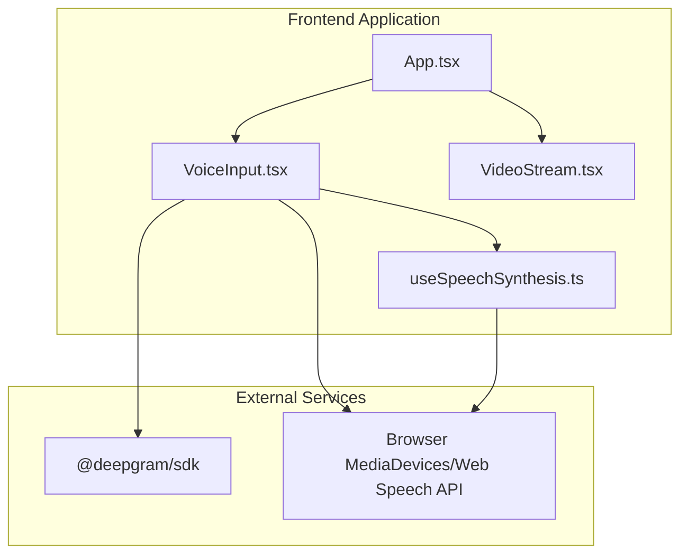
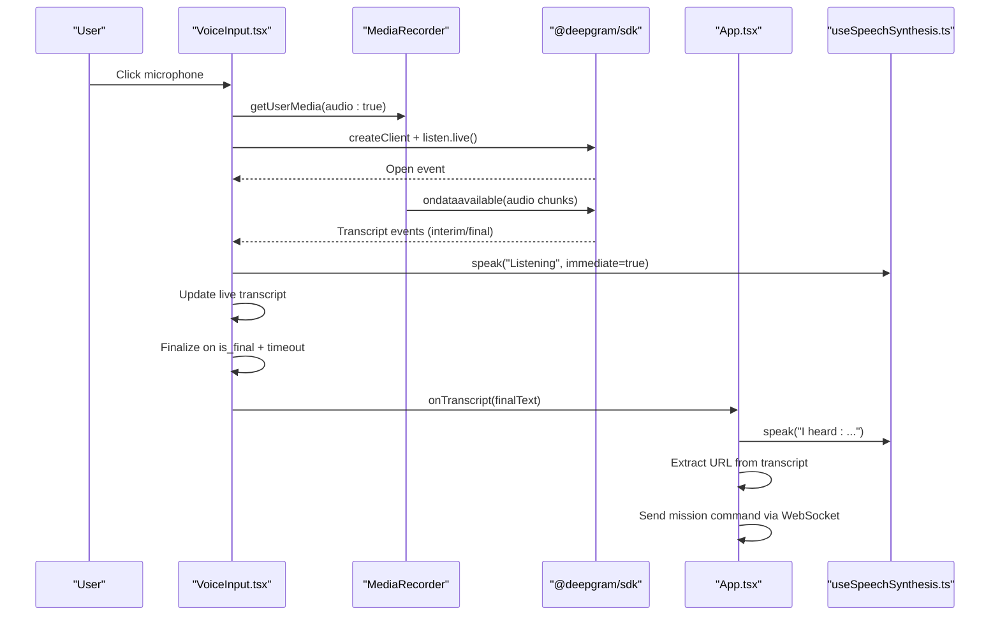
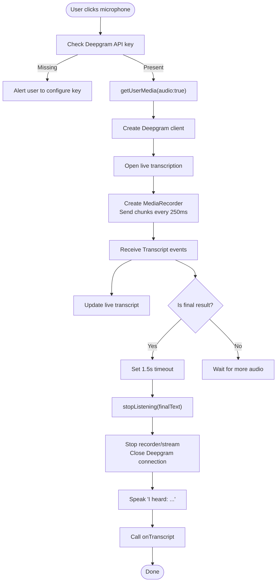
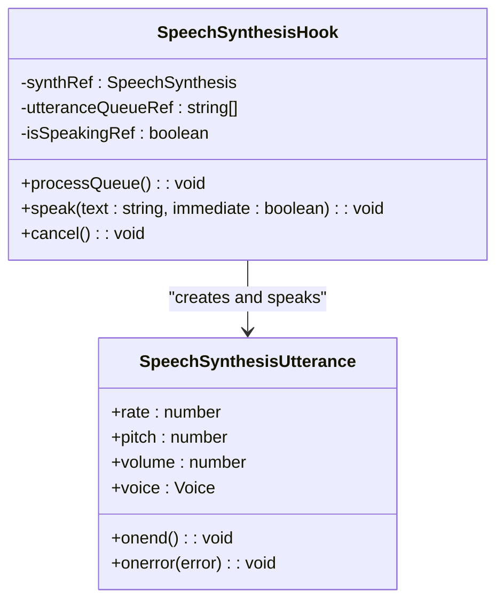
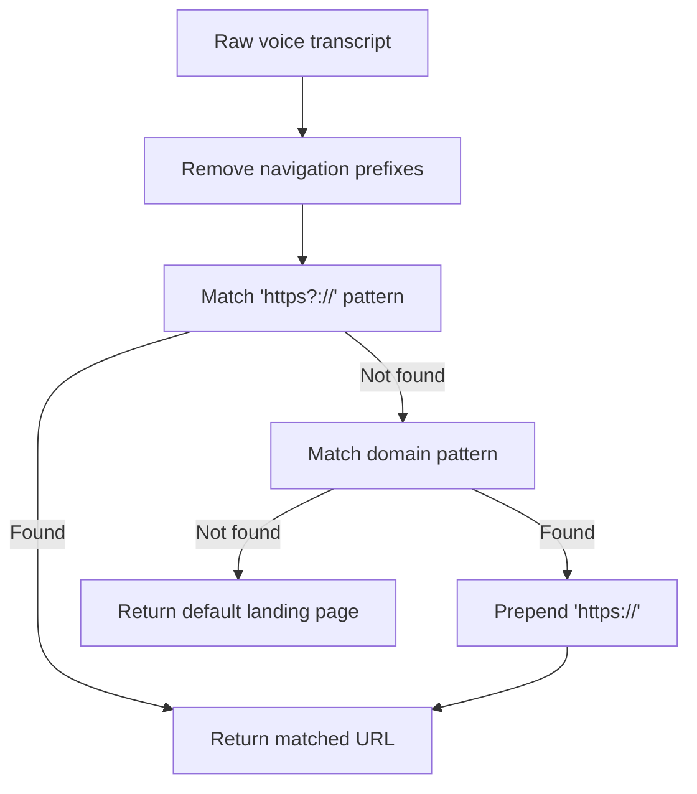
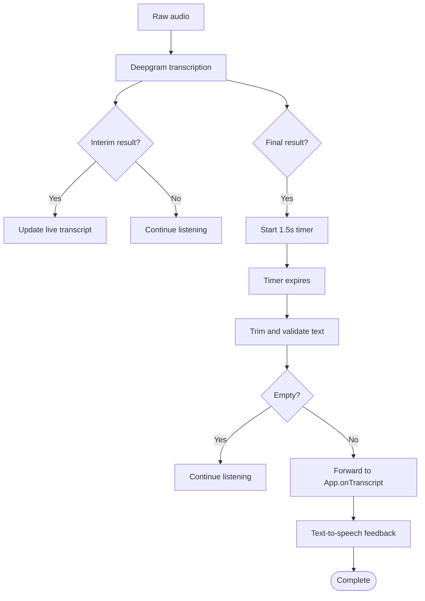

# Voice Input System

<cite>
**Referenced Files in This Document**
- [VoiceInput.tsx](file://frontend/src/components/VoiceInput.tsx)
- [useSpeechSynthesis.ts](file://frontend/src/hooks/useSpeechSynthesis.ts)
- [App.tsx](file://frontend/src/App.tsx)
- [VideoStream.tsx](file://frontend/src/components/VideoStream.tsx)
- [package.json](file://frontend/package.json)
- [main.tsx](file://frontend/src/main.tsx)
</cite>

## Table of Contents
1. [Introduction](#introduction)
2. [Project Structure](#project-structure)
3. [Core Components](#core-components)
4. [Architecture Overview](#architecture-overview)
5. [Detailed Component Analysis](#detailed-component-analysis)
6. [URL Extraction Logic](#url-extraction-logic)
7. [Speech Recognition Configuration](#speech-recognition-configuration)
8. [Transcript Processing Pipeline](#transcript-processing-pipeline)
9. [Visual Feedback Components](#visual-feedback-components)
10. [Cross-Browser Compatibility](#cross-browser-compatibility)
11. [Performance Considerations](#performance-considerations)
12. [Troubleshooting Guide](#troubleshooting-guide)
13. [Conclusion](#conclusion)

## Introduction
This document provides comprehensive documentation for the voice input system that integrates Web Speech API with Deepgram's real-time speech recognition service. The system enables users to provide voice commands that are captured, transcribed, processed, and sent to the backend for autonomous browser navigation. It also includes text-to-speech feedback via the Web Speech API and a fallback mechanism for manual text input when speech recognition is unavailable.

## Project Structure
The voice input system is primarily implemented in the frontend React application. Key components include:
- VoiceInput: Handles microphone activation, audio capture, real-time transcription, and UI feedback
- useSpeechSynthesis: Provides text-to-speech capabilities with queuing and voice selection
- App: Orchestrates voice command processing, URL extraction, and WebSocket communication
- VideoStream: Displays the live browser viewport for visual context
- Dependencies: Deepgram SDK for speech recognition and Framer Motion for animations

**Diagram sources**
- [VoiceInput.tsx](file://frontend/src/components/VoiceInput.tsx#L1-L321)
- [useSpeechSynthesis.ts](file://frontend/src/hooks/useSpeechSynthesis.ts#L1-L79)
- [App.tsx](file://frontend/src/App.tsx#L1-L360)
- [VideoStream.tsx](file://frontend/src/components/VideoStream.tsx#L1-L43)
- [package.json](file://frontend/package.json#L12-L16)

**Section sources**
- [VoiceInput.tsx](file://frontend/src/components/VoiceInput.tsx#L1-L321)
- [useSpeechSynthesis.ts](file://frontend/src/hooks/useSpeechSynthesis.ts#L1-L79)
- [App.tsx](file://frontend/src/App.tsx#L1-L360)
- [VideoStream.tsx](file://frontend/src/components/VideoStream.tsx#L1-L43)
- [package.json](file://frontend/package.json#L12-L16)

## Core Components
- VoiceInput component manages the entire voice-to-command workflow, including microphone initialization, Deepgram connection setup, real-time transcription handling, and UI feedback.
- useSpeechSynthesis hook provides asynchronous text-to-speech with voice selection, rate/pitch/volume tuning, and a queue to prevent overlapping speech.
- App component receives the final transcript, extracts URLs when present, and sends mission commands to the backend via WebSocket.

**Section sources**
- [VoiceInput.tsx](file://frontend/src/components/VoiceInput.tsx#L13-L171)
- [useSpeechSynthesis.ts](file://frontend/src/hooks/useSpeechSynthesis.ts#L3-L78)
- [App.tsx](file://frontend/src/App.tsx#L146-L166)

## Architecture Overview
The voice input system follows a real-time streaming architecture:
- Microphone audio is captured via MediaRecorder and streamed to Deepgram
- Deepgram performs live transcription and emits interim and final results
- The UI displays live transcripts and provides visual feedback
- Final transcripts trigger text-to-speech feedback and are forwarded to the backend

**Diagram sources**
- [VoiceInput.tsx](file://frontend/src/components/VoiceInput.tsx#L41-L130)
- [useSpeechSynthesis.ts](file://frontend/src/hooks/useSpeechSynthesis.ts#L55-L67)
- [App.tsx](file://frontend/src/App.tsx#L146-L166)

## Detailed Component Analysis

### VoiceInput Component
The VoiceInput component encapsulates the complete voice recognition lifecycle:
- Initialization: Validates Deepgram API key, requests microphone permission, and sets up the Deepgram live transcription connection
- Streaming: Creates a MediaRecorder to send audio chunks to Deepgram at 250ms intervals
- Transcription: Processes interim and final results, updating the live transcript and finalizing on silence detection
- Feedback: Uses Framer Motion animations for microphone pulsing and status text updates
- Cleanup: Properly stops streams, recorders, and closes connections on unmount or stop

**Diagram sources**
- [VoiceInput.tsx](file://frontend/src/components/VoiceInput.tsx#L41-L163)

**Section sources**
- [VoiceInput.tsx](file://frontend/src/components/VoiceInput.tsx#L13-L171)

### Speech Synthesis Hook
The useSpeechSynthesis hook provides robust text-to-speech capabilities:
- Queue Management: Prevents overlapping speech by maintaining a queue and an isSpeaking flag
- Voice Selection: Attempts to select a preferred voice (female) based on voice name patterns
- Configuration: Sets speaking rate, pitch, and volume for natural delivery
- Error Handling: Logs errors and continues processing the queue
- Immediate Mode: Supports interrupting current speech for urgent announcements

**Diagram sources**
- [useSpeechSynthesis.ts](file://frontend/src/hooks/useSpeechSynthesis.ts#L3-L78)

**Section sources**
- [useSpeechSynthesis.ts](file://frontend/src/hooks/useSpeechSynthesis.ts#L1-L79)

### App Integration and Mission Flow
The App component integrates voice commands with backend mission execution:
- Receives final transcript from VoiceInput
- Extracts URLs from commands using pattern matching
- Sends mission commands via WebSocket with either extracted URL or a default landing page
- Provides text-to-speech feedback for major system events

**Section sources**
- [App.tsx](file://frontend/src/App.tsx#L146-L166)

## URL Extraction Logic
The system includes a URL extraction utility that transforms voice commands into navigation targets:
- Prefix Removal: Strips common navigation verbs (e.g., "go to", "open", "navigate to") from the beginning of the command
- Protocol Detection: Identifies explicit URLs with http/https protocols
- Domain Pattern Matching: Detects domain-like patterns (e.g., "example.com") and prepends https://
- Fallback Behavior: Defaults to a safe landing page when no URL is detected

**Diagram sources**
- [App.tsx](file://frontend/src/App.tsx#L125-L144)

**Section sources**
- [App.tsx](file://frontend/src/App.tsx#L125-L144)

## Speech Recognition Configuration
The voice input system is configured for optimal real-time performance:
- Model and Language: Uses the nova-2 model with en-US language settings
- Smart Formatting: Enables smart_format for improved readability
- Interim Results: Activates interim_results for live transcript updates
- Punctuation: Adds automatic punctuation for natural sentence boundaries
- Audio Chunking: Streams audio in 250ms intervals to balance latency and bandwidth
- Silence Detection: Finalizes transcription after 1.5 seconds of no new final results

**Section sources**
- [VoiceInput.tsx](file://frontend/src/components/VoiceInput.tsx#L56-L62)
- [VoiceInput.tsx](file://frontend/src/components/VoiceInput.tsx#L107-L113)

## Transcript Processing Pipeline
The transcript processing pipeline transforms raw speech into actionable commands:
- Real-time Updates: Interim results update the live transcript display immediately
- Finalization: Final results trigger a 1.5-second grace period to capture complete thoughts
- Validation: Only non-empty transcripts are forwarded to the backend
- Feedback Loop: The system acknowledges receipt via text-to-speech

**Diagram sources**
- [VoiceInput.tsx](file://frontend/src/components/VoiceInput.tsx#L67-L85)
- [VoiceInput.tsx](file://frontend/src/components/VoiceInput.tsx#L152-L158)

**Section sources**
- [VoiceInput.tsx](file://frontend/src/components/VoiceInput.tsx#L67-L85)
- [VoiceInput.tsx](file://frontend/src/components/VoiceInput.tsx#L152-L158)

## Visual Feedback Components
The system provides comprehensive visual feedback during voice interaction:
- Microphone Button: Animated pulsing rings during active listening with gradient backgrounds indicating state
- Status Text: Dynamic messaging showing connection status, listening state, and instructions
- Live Transcript Display: Monospace font with glass effect for real-time text
- Manual Input Fallback: Text field with submit button for manual command entry
- Connection Indicator: Shows backend connectivity status with animated dots

**Section sources**
- [VoiceInput.tsx](file://frontend/src/components/VoiceInput.tsx#L181-L321)

## Cross-Browser Compatibility
The voice input system leverages web standards with known compatibility characteristics:
- MediaDevices API: Supported in modern browsers (Chrome, Firefox, Safari, Edge) with HTTPS requirement
- Web Speech API: Supported in Chrome, Edge, and parts of Android Chrome; limited support in Safari
- Deepgram SDK: Pure JavaScript library compatible with modern browsers
- Fallback Strategy: Manual text input ensures functionality when speech recognition is unavailable
- Environment Configuration: API keys are loaded from environment variables for secure deployment

**Section sources**
- [VoiceInput.tsx](file://frontend/src/components/VoiceInput.tsx#L11-L24)
- [package.json](file://frontend/package.json#L12-L16)

## Performance Considerations
Several optimizations ensure smooth real-time operation:
- Chunked Audio Streaming: 250ms intervals reduce latency while minimizing bandwidth usage
- Graceful Finalization: 1.5s timeout prevents premature termination of long phrases
- Efficient Cleanup: Proper disposal of streams, recorders, and connections prevents memory leaks
- Queue-Based TTS: Prevents overlapping speech and reduces CPU overhead
- Conditional Rendering: Live transcript display only appears when text is available

**Section sources**
- [VoiceInput.tsx](file://frontend/src/components/VoiceInput.tsx#L107-L113)
- [VoiceInput.tsx](file://frontend/src/components/VoiceInput.tsx#L160-L162)
- [useSpeechSynthesis.ts](file://frontend/src/hooks/useSpeechSynthesis.ts#L13-L53)

## Troubleshooting Guide
Common issues and their resolutions:
- Missing Deepgram API Key: The component checks for a valid key and alerts users to configure it
- Microphone Permission Denied: Catches NotAllowedError and prompts users to enable microphone access
- Network Connectivity Issues: Backend disconnection disables interactive controls and shows connection status
- Speech Synthesis Failures: Errors are logged and the queue continues processing subsequent items
- Browser Support Problems: Manual text input provides alternative input method

**Section sources**
- [VoiceInput.tsx](file://frontend/src/components/VoiceInput.tsx#L42-L45)
- [VoiceInput.tsx](file://frontend/src/components/VoiceInput.tsx#L121-L129)
- [useSpeechSynthesis.ts](file://frontend/src/hooks/useSpeechSynthesis.ts#L45-L49)

## Conclusion
The voice input system provides a robust, real-time speech-to-action pipeline that integrates seamlessly with the autonomous browser agent. Through careful configuration of Deepgram's live transcription, thoughtful visual feedback, and reliable text-to-speech integration, the system delivers an intuitive user experience. The URL extraction logic and manual fallback mechanisms ensure reliable navigation regardless of speech recognition accuracy, while performance optimizations maintain responsiveness under real-time constraints.