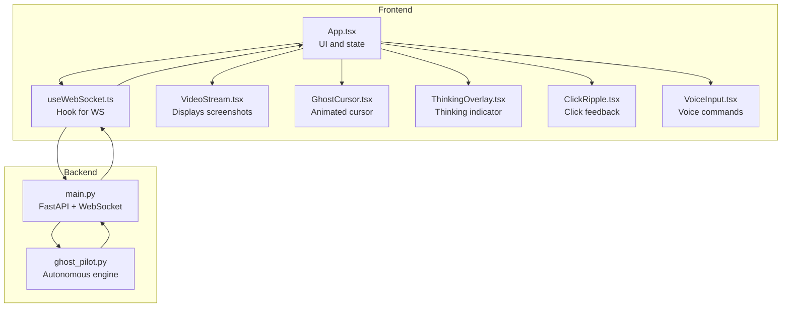
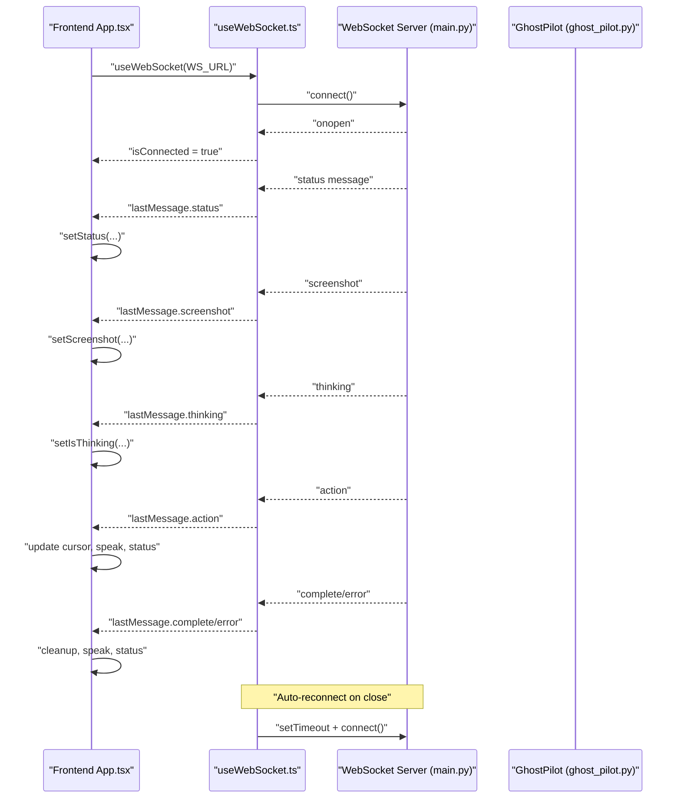
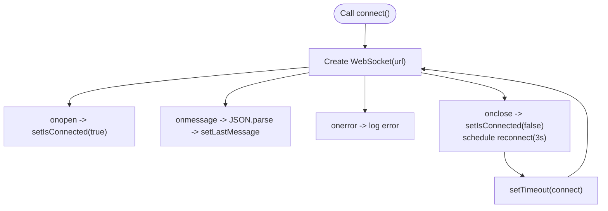
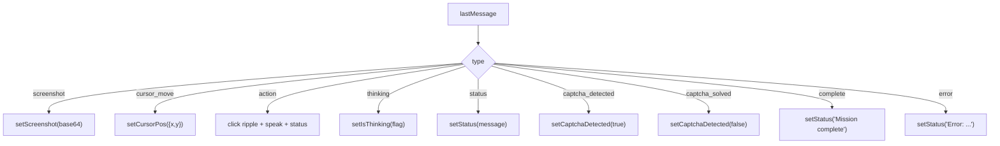
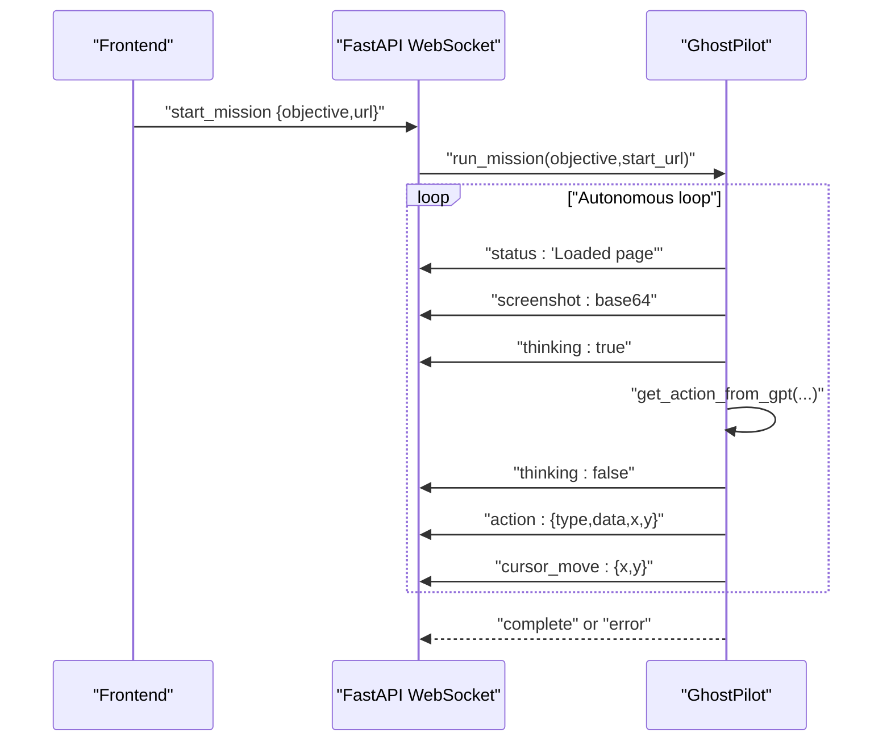
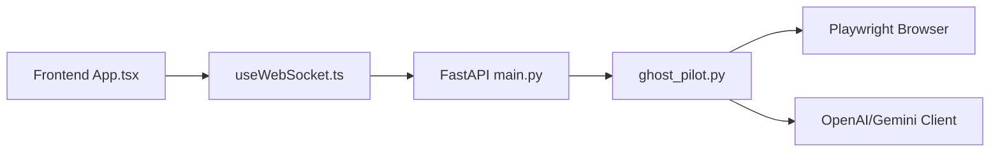

# WebSocket Communication

<cite>
**Referenced Files in This Document**
- [useWebSocket.ts](file://frontend/src/hooks/useWebSocket.ts)
- [App.tsx](file://frontend/src/App.tsx)
- [VideoStream.tsx](file://frontend/src/components/VideoStream.tsx)
- [GhostCursor.tsx](file://frontend/src/components/GhostCursor.tsx)
- [ThinkingOverlay.tsx](file://frontend/src/components/ThinkingOverlay.tsx)
- [ClickRipple.tsx](file://frontend/src/components/ClickRipple.tsx)
- [VoiceInput.tsx](file://frontend/src/components/VoiceInput.tsx)
- [vite.config.ts](file://frontend/vite.config.ts)
- [vite-env.d.ts](file://frontend/src/vite-env.d.ts)
- [main.py](file://backend/main.py)
- [ghost_pilot.py](file://backend/ghost_pilot.py)
</cite>

## Table of Contents
1. [Introduction](#introduction)
2. [Project Structure](#project-structure)
3. [Core Components](#core-components)
4. [Architecture Overview](#architecture-overview)
5. [Detailed Component Analysis](#detailed-component-analysis)
6. [Dependency Analysis](#dependency-analysis)
7. [Performance Considerations](#performance-considerations)
8. [Troubleshooting Guide](#troubleshooting-guide)
9. [Conclusion](#conclusion)

## Introduction
This document explains the WebSocket communication system powering the real-time autonomous browser agent. It covers the frontend React hook that manages the WebSocket lifecycle, the message formats exchanged with the backend, and how the UI reacts to live events such as screenshots, cursor movements, actions, thinking states, and status updates. It also documents auto-reconnection behavior, connection state management, error handling, heartbeat considerations, security and CORS, and performance strategies for high-frequency streams.

## Project Structure
The WebSocket system spans the frontend React application and the backend FastAPI service:
- Frontend: A custom React hook establishes and maintains the WebSocket connection, parses incoming messages, and exposes state and send/reconnect/disconnect utilities.
- Backend: A FastAPI WebSocket endpoint accepts client commands, orchestrates an autonomous browser session, and streams real-time updates back to the client.

**Diagram sources**
- [App.tsx](file://frontend/src/App.tsx#L14-L360)
- [useWebSocket.ts](file://frontend/src/hooks/useWebSocket.ts#L15-L92)
- [VideoStream.tsx](file://frontend/src/components/VideoStream.tsx#L8-L43)
- [GhostCursor.tsx](file://frontend/src/components/GhostCursor.tsx#L10-L99)
- [ThinkingOverlay.tsx](file://frontend/src/components/ThinkingOverlay.tsx#L8-L78)
- [ClickRipple.tsx](file://frontend/src/components/ClickRipple.tsx#L10-L35)
- [VoiceInput.tsx](file://frontend/src/components/VoiceInput.tsx#L13-L321)
- [main.py](file://backend/main.py#L36-L157)
- [ghost_pilot.py](file://backend/ghost_pilot.py#L623-L768)

**Section sources**
- [useWebSocket.ts](file://frontend/src/hooks/useWebSocket.ts#L1-L93)
- [App.tsx](file://frontend/src/App.tsx#L14-L360)
- [main.py](file://backend/main.py#L36-L157)

## Core Components
- useWebSocket hook: Manages WebSocket creation, message parsing, connection state, auto-reconnection, and safe sending.
- App component: Subscribes to incoming messages and updates UI state (screenshots, cursor position, thinking overlay, status).
- Backend WebSocket endpoint: Accepts client commands, initializes the autonomous engine, and streams updates.

Key responsibilities:
- Connection lifecycle: connect, onopen, onmessage, onerror, onclose, reconnect, disconnect.
- Message handling: route by type and update React state.
- UI integration: video stream, animated cursor, thinking overlay, click ripple, voice input.

**Section sources**
- [useWebSocket.ts](file://frontend/src/hooks/useWebSocket.ts#L15-L92)
- [App.tsx](file://frontend/src/App.tsx#L26-L123)
- [main.py](file://backend/main.py#L36-L157)

## Architecture Overview
The frontend connects to the backend WebSocket endpoint and receives periodic updates during autonomous navigation. The backend runs an autonomous browser session, captures screenshots, detects captchas, queries a vision model, executes actions, and streams structured messages to the frontend.

**Diagram sources**
- [App.tsx](file://frontend/src/App.tsx#L26-L123)
- [useWebSocket.ts](file://frontend/src/hooks/useWebSocket.ts#L21-L58)
- [main.py](file://backend/main.py#L36-L157)
- [ghost_pilot.py](file://backend/ghost_pilot.py#L623-L768)

## Detailed Component Analysis

### useWebSocket Hook
Responsibilities:
- Establish WebSocket connection and manage lifecycle.
- Parse incoming JSON messages and expose the latest message.
- Provide sendMessage, reconnect, and disconnect utilities.
- Auto-reconnect on close with a fixed interval.
- Guard send calls by ready state.

Implementation highlights:
- Connection state: isConnected reflects onopen/onclose.
- Message parsing: JSON.parse with error logging.
- Auto-reconnect: onclose schedules a reconnect after a fixed delay.
- Safe send: checks readyState before sending.

**Diagram sources**
- [useWebSocket.ts](file://frontend/src/hooks/useWebSocket.ts#L21-L58)

**Section sources**
- [useWebSocket.ts](file://frontend/src/hooks/useWebSocket.ts#L15-L92)

### App Component Message Handling
The App component listens to lastMessage and reacts to message types:
- screenshot: sets the base64 image for the video stream.
- cursor_move: updates the animated cursor position.
- action: triggers click ripple, speaks action, updates status.
- thinking: toggles thinking overlay.
- status: updates status bar and speaks notable transitions.
- captcha_detected/captcha_solved: shows/hides manual override UI.
- complete: marks mission completion.
- error: displays error and speaks it.

Integration points:
- Uses VideoStream to render the screenshot.
- Uses GhostCursor for animated cursor.
- Uses ThinkingOverlay for thinking indication.
- Uses ClickRipple for click feedback.
- Uses VoiceInput for voice commands.

**Diagram sources**
- [App.tsx](file://frontend/src/App.tsx#L26-L123)
- [VideoStream.tsx](file://frontend/src/components/VideoStream.tsx#L8-L43)
- [GhostCursor.tsx](file://frontend/src/components/GhostCursor.tsx#L10-L99)
- [ThinkingOverlay.tsx](file://frontend/src/components/ThinkingOverlay.tsx#L8-L78)
- [ClickRipple.tsx](file://frontend/src/components/ClickRipple.tsx#L10-L35)

**Section sources**
- [App.tsx](file://frontend/src/App.tsx#L26-L123)
- [VideoStream.tsx](file://frontend/src/components/VideoStream.tsx#L8-L43)
- [GhostCursor.tsx](file://frontend/src/components/GhostCursor.tsx#L10-L99)
- [ThinkingOverlay.tsx](file://frontend/src/components/ThinkingOverlay.tsx#L8-L78)
- [ClickRipple.tsx](file://frontend/src/components/ClickRipple.tsx#L10-L35)

### Backend WebSocket Endpoint and Engine
Backend responsibilities:
- Accept WebSocket connection and initialize GhostPilot with selected LLM provider.
- Handle client commands (e.g., start_mission, skip_captcha).
- Stream status, thinking, screenshot, action, captcha events, complete, and error.
- Manage browser lifecycle and cleanup.

Message flow:
- Client sends start_mission with objective and URL.
- Backend initializes GhostPilot and starts autonomous loop.
- Periodic messages: status, thinking, screenshot, action, captcha events.
- On completion or error, sends complete or error.

**Diagram sources**
- [main.py](file://backend/main.py#L36-L157)
- [ghost_pilot.py](file://backend/ghost_pilot.py#L623-L768)

**Section sources**
- [main.py](file://backend/main.py#L36-L157)
- [ghost_pilot.py](file://backend/ghost_pilot.py#L623-L768)

### Message Formats and Data Structures
Frontend message interface:
- type: union of supported message categories.
- data: arbitrary payload for action context.
- screenshot: base64 PNG for video stream.
- x/y: numeric coordinates for cursor_move.
- action_type: click/type/scroll/wait/finish.
- thinking: boolean flag for thinking overlay.
- message/error: status/error text.

Backend message producers:
- status: progress and lifecycle messages.
- thinking: start/end analysis phase.
- screenshot: base64-encoded PNG.
- action: action metadata and optional coordinates.
- cursor_move: coordinates for UI cursor.
- captcha_detected/solved: captcha events.
- complete/error: terminal states.

Note: The frontend currently handles a superset of message types, including captcha-related events not explicitly defined in the hook’s type union. These are safely ignored if not handled.

**Section sources**
- [useWebSocket.ts](file://frontend/src/hooks/useWebSocket.ts#L3-L13)
- [App.tsx](file://frontend/src/App.tsx#L30-L122)
- [ghost_pilot.py](file://backend/ghost_pilot.py#L654-L743)

### Connection Lifecycle Management
- Connect on mount; disconnect on unmount.
- Auto-reconnect on close with a fixed delay.
- Guard send calls by readyState.
- Expose reconnect/disconnect utilities for manual control.

Graceful degradation:
- If reconnect fails, UI remains responsive; user can trigger reconnect.
- Status messages indicate connectivity and thinking states.

**Section sources**
- [useWebSocket.ts](file://frontend/src/hooks/useWebSocket.ts#L78-L83)
- [useWebSocket.ts](file://frontend/src/hooks/useWebSocket.ts#L43-L52)
- [useWebSocket.ts](file://frontend/src/hooks/useWebSocket.ts#L60-L66)

### Heartbeat and Long-Running Streams
- No explicit heartbeat/ping-pong is implemented in the current code.
- The backend streams frequent messages (screenshots, thinking, actions), which implicitly serve as liveness indicators.
- Consider adding periodic ping/pong for strict keepalive in production deployments.

**Section sources**
- [ghost_pilot.py](file://backend/ghost_pilot.py#L654-L743)
- [useWebSocket.ts](file://frontend/src/hooks/useWebSocket.ts#L30-L37)

### Security and CORS
- Backend enables CORS for development with broad origins; tighten in production.
- Environment variables for LLM provider configuration.
- Frontend uses Vite proxy for local development to avoid mixed-content/CORS issues.

Recommendations:
- Restrict allow_origins to trusted domains in production.
- Use HTTPS and secure WebSocket (wss) in production.
- Validate and sanitize message payloads on the backend.

**Section sources**
- [main.py](file://backend/main.py#L19-L26)
- [vite.config.ts](file://frontend/vite.config.ts#L10-L16)
- [vite-env.d.ts](file://frontend/src/vite-env.d.ts#L3-L5)

## Dependency Analysis
Frontend dependencies for WebSocket:
- React hooks for state and lifecycle.
- DOM components for rendering video, cursor, overlays, and effects.
- VoiceInput integrates with external speech-to-text SDK.

Backend dependencies:
- FastAPI for routing and WebSocket handling.
- Playwright for browser automation.
- OpenAI-compatible clients for vision model calls.
- Rate-limiting and retry logic for provider APIs.

**Diagram sources**
- [App.tsx](file://frontend/src/App.tsx#L14-L360)
- [useWebSocket.ts](file://frontend/src/hooks/useWebSocket.ts#L15-L92)
- [main.py](file://backend/main.py#L36-L157)
- [ghost_pilot.py](file://backend/ghost_pilot.py#L18-L105)

**Section sources**
- [App.tsx](file://frontend/src/App.tsx#L14-L360)
- [useWebSocket.ts](file://frontend/src/hooks/useWebSocket.ts#L15-L92)
- [main.py](file://backend/main.py#L36-L157)
- [ghost_pilot.py](file://backend/ghost_pilot.py#L18-L105)

## Performance Considerations
- High-frequency message streams:
  - Screenshots are base64 PNG; consider compression or streaming alternatives if bandwidth becomes a bottleneck.
  - Debounce UI updates for rapid successive messages (e.g., cursor_move) to reduce re-renders.
- Memory management:
  - Avoid retaining stale message references; rely on lastMessage updates.
  - Cancel timeouts and timers on disconnect/unmount.
- Backend efficiency:
  - Rate-limit provider calls and implement progressive delays on rate limits.
  - Honor Retry-After headers and daily limits for free-tier providers.
- Frontend rendering:
  - Use memoization for image URLs and cursor positions.
  - Keep animations lightweight; throttle high-frequency updates.

[No sources needed since this section provides general guidance]

## Troubleshooting Guide
Common issues and remedies:
- Connection failures:
  - Verify WS_URL and backend availability.
  - Check Vite proxy configuration for local development.
- Messages not updating UI:
  - Ensure message types match frontend switch cases.
  - Confirm JSON parsing succeeds; inspect console logs.
- Frequent reconnect loops:
  - Adjust reconnect delay or disable auto-reconnect temporarily.
  - Inspect backend exceptions that might cause immediate close.
- Captcha stalls:
  - Use manual override to skip waiting when appropriate.
  - Monitor captcha_detected/solved messages.

**Section sources**
- [useWebSocket.ts](file://frontend/src/hooks/useWebSocket.ts#L43-L52)
- [App.tsx](file://frontend/src/App.tsx#L93-L107)
- [main.py](file://backend/main.py#L138-L148)

## Conclusion
The WebSocket system provides a robust, real-time bridge between the frontend UI and the backend autonomous engine. The useWebSocket hook encapsulates connection lifecycle and auto-reconnection, while the App component translates messages into visual and auditory feedback. The backend orchestrates browser automation, streams structured updates, and gracefully handles errors and terminal states. With proper CORS hardening, optional heartbeat, and performance optimizations, the system scales to high-frequency streams and long-running sessions.