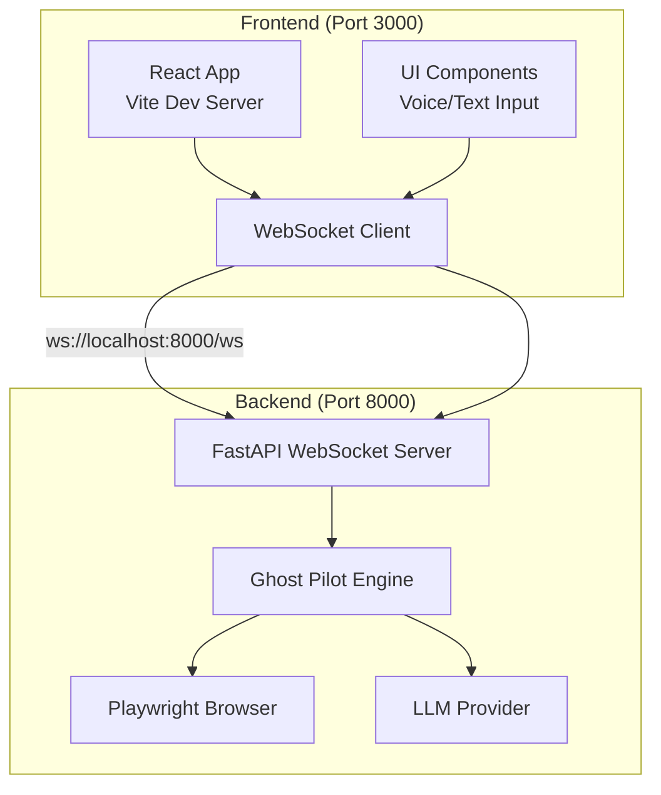

# Installation and Setup

<cite>
**Referenced Files in This Document**
- [README.md](file://frontend/README.md)
- [INSTALLATION.md](file://frontend/INSTALLATION.md)
- [setup_backend.sh](file://frontend/setup_backend.sh)
- [install_backend_deps.sh](file://frontend/install_backend_deps.sh)
- [package.json](file://frontend/package.json)
- [vite.config.ts](file://frontend/vite.config.ts)
- [main.tsx](file://frontend/src/main.tsx)
- [App.tsx](file://frontend/src/App.tsx)
- [useWebSocket.ts](file://frontend/src/hooks/useWebSocket.ts)
- [requirements.txt](file://backend/requirements.txt)
- [main.py](file://backend/main.py)
- [ghost_pilot.py](file://backend/ghost_pilot.py)
- [set_of_marks.js](file://backend/set_of_marks.js)
</cite>

## Table of Contents
1. [Introduction](#introduction)
2. [Prerequisites](#prerequisites)
3. [System Requirements](#system-requirements)
4. [Backend Setup](#backend-setup)
5. [Frontend Setup](#frontend-setup)
6. [Environment Variables](#environment-variables)
7. [Dual-Terminal Operation](#dual-terminal-operation)
8. [Verification and Initial Testing](#verification-and-initial-testing)
9. [Troubleshooting Guide](#troubleshooting-guide)
10. [Architecture Overview](#architecture-overview)
11. [Conclusion](#conclusion)

## Introduction
This guide provides end-to-end installation and setup instructions for the Ghost Pilot system. It covers prerequisites, backend and frontend setup, environment configuration, dual-terminal operation, verification steps, and troubleshooting. Ghost Pilot is an autonomous browser agent that uses GPT-4o Vision and Playwright to navigate the web based on voice or text commands.

## Prerequisites
- Python 3.10 or newer
- Node.js 16 or newer
- OpenAI API key with GPT-4o access
- Git (recommended for cloning the repository)

These requirements are explicitly called out in the frontend documentation and are necessary for running both the backend and frontend components.

**Section sources**
- [README.md](file://frontend/README.md#L19-L24)

## System Requirements
- Operating systems: Windows, macOS, Linux
- Memory: At least 8 GB RAM recommended (more for heavy browsing sessions)
- Disk space: ~2 GB for Python dependencies and Playwright browsers
- Network: Stable internet connection for API calls and browser automation

Compatibility notes:
- Playwright Chromium installation is supported across platforms
- Voice input works best in Chrome and Edge due to Web Speech API support
- Some websites may require additional browser permissions or cookies

**Section sources**
- [INSTALLATION.md](file://frontend/INSTALLATION.md#L166-L176)
- [README.md](file://frontend/README.md#L155-L166)

## Backend Setup
Follow these steps to prepare and run the backend server:

1. Prepare backend directory
   - Create a backend directory and copy the required files:
     - main.py
     - ghost_pilot.py
     - set_of_marks.js
     - requirements.txt
     - .env.backend (rename to .env)
   - Alternatively, use the provided setup script to copy files from an artifacts location.

2. Install Python dependencies
   - Navigate to the backend directory and install dependencies:
     - pip install -r requirements.txt
   - If pip is not available, install it first or use a virtual environment.

3. Install Playwright browser
   - Install Chromium for Playwright:
     - playwright install chromium
   - If installation fails, try:
     - python3 -m playwright install --with-deps chromium

4. Configure environment
   - Copy .env.backend to .env and edit it to include your OpenAI API key and base URL:
     - OPENAI_API_KEY=your_actual_key_here
     - OPENAI_BASE_URL=https://api.openai.com/v1

5. Start the backend server
   - Run the FastAPI server:
     - python main.py
   - The server listens on port 8000 by default.

Notes:
- The backend supports multiple LLM providers (OpenAI, LM Studio, Gemini, OpenRouter, Custom). The default provider is configurable via environment variables.
- The server enables CORS for frontend communication and exposes health checks and a root endpoint.

**Section sources**
- [README.md](file://frontend/README.md#L25-L57)
- [INSTALLATION.md](file://frontend/INSTALLATION.md#L11-L60)
- [setup_backend.sh](file://frontend/setup_backend.sh#L1-L53)
- [install_backend_deps.sh](file://frontend/install_backend_deps.sh#L1-L40)
- [requirements.txt](file://backend/requirements.txt#L1-L8)
- [main.py](file://backend/main.py#L154-L157)

## Frontend Setup
The frontend is a React + Vite application. Follow these steps to set it up:

1. Install dependencies
   - Navigate to the frontend directory and install dependencies:
     - npm install
   - Dependencies are pre-defined in package.json.

2. Start the development server
   - Run:
     - npm run dev
   - The frontend serves on port 3000 by default.

3. Proxy configuration
   - Vite is configured to proxy WebSocket connections to the backend:
     - /ws → ws://localhost:8000

4. Build and preview (optional)
   - Build for production:
     - npm run build
   - Preview the built app:
     - npm run preview

**Section sources**
- [README.md](file://frontend/README.md#L59-L71)
- [package.json](file://frontend/package.json#L1-L34)
- [vite.config.ts](file://frontend/vite.config.ts#L1-L23)
- [main.tsx](file://frontend/src/main.tsx#L1-L11)

## Environment Variables
Configure the backend using environment variables in backend/.env:

- OPENAI_API_KEY
  - Required for OpenAI provider
  - Ensure your account has GPT-4o access

- OPENAI_BASE_URL
  - Default: https://api.openai.com/v1
  - Can be customized for self-hosted or alternative endpoints

- LLM_PROVIDER
  - Options: lmstudio, openai, gemini, openrouter, custom
  - Default: lmstudio

- LM_STUDIO_BASE_URL and LM_STUDIO_MODEL
  - Used when provider is lmstudio

- GEMINI_API_KEY and GEMINI_MODEL
  - Used when provider is gemini

- OPENROUTER_API_KEY and OPENROUTER_MODEL
  - Used when provider is openrouter

- OPENAI_MODEL
  - Default: gpt-4o

Notes:
- The backend loads environment variables automatically using python-dotenv.
- The frontend connects to the backend WebSocket at ws://localhost:8000 by default, configurable via VITE_WS_URL.

**Section sources**
- [main.py](file://backend/main.py#L63-L97)
- [ghost_pilot.py](file://backend/ghost_pilot.py#L29-L82)
- [App.tsx](file://frontend/src/App.tsx#L11-L12)
- [vite.config.ts](file://frontend/vite.config.ts#L10-L16)

## Dual-Terminal Operation
Ghost Pilot requires two terminals running concurrently:

- Terminal 1: Backend server
  - Purpose: Hosts the FastAPI WebSocket server and browser automation
  - Command: python main.py
  - Port: 8000 (default)

- Terminal 2: Frontend development server
  - Purpose: Serves the React UI and handles WebSocket communication
  - Command: npm run dev
  - Port: 3000 (default)

Connection flow:
- The frontend connects to ws://localhost:8000/ws via Vite proxy
- The backend exposes a WebSocket endpoint at /ws for real-time browser automation

**Section sources**
- [main.py](file://backend/main.py#L36-L38)
- [vite.config.ts](file://frontend/vite.config.ts#L10-L16)
- [App.tsx](file://frontend/src/App.tsx#L11-L12)

## Verification and Initial Testing
Perform these checks to ensure proper installation:

1. Backend verification
   - Confirm the server starts on port 8000:
     - Look for a message indicating Uvicorn is running on http://0.0.0.0:8000
   - Health check:
     - curl http://localhost:8000/health
     - Expected: {"status":"healthy"}

2. Frontend verification
   - Open http://localhost:3000 in a browser
   - Verify the UI loads and shows a "Disconnected" status initially
   - Once the backend is running, the status indicator should turn green ("Connected")

3. Basic functionality tests
   - Speak or type a simple command like "Search for chocolate cake recipes"
   - Observe the live screenshot feed and cursor movements
   - Confirm the agent navigates to the target site and performs actions

4. Captcha handling
   - If a captcha appears, the UI will display a manual override option
   - Click "Manual Override" to skip waiting for user resolution

5. Error indicators
   - "WebSocket disconnected": Ensure backend is running on port 8000
   - "Invalid API Key": Verify OPENAI_API_KEY in backend/.env
   - "Executable doesn't exist": Run playwright install chromium

**Section sources**
- [INSTALLATION.md](file://frontend/INSTALLATION.md#L156-L196)
- [README.md](file://frontend/README.md#L167-L183)
- [main.py](file://backend/main.py#L28-L34)

## Troubleshooting Guide
Common issues and solutions:

- "Executable doesn't exist" (Playwright)
  - Cause: Chromium not installed
  - Solution: Run playwright install chromium in the backend directory
  - Alternative: python3 -m playwright install --with-deps chromium

- WebSocket disconnected
  - Cause: Backend not running or wrong port
  - Solution: Ensure python main.py is running on port 8000

- Invalid API Key
  - Cause: Missing or incorrect OPENAI_API_KEY
  - Solution: Edit backend/.env and set OPENAI_API_KEY=your_key
  - Verify GPT-4o access in your OpenAI account

- Voice input not working
  - Cause: Browser limitations or permissions
  - Solution: Use Chrome or Edge, grant microphone permissions, or use text input

- Rate limit errors
  - Cause: Free tier quotas exceeded (OpenRouter/Gemini)
  - Solution: Wait for daily or per-minute reset; reduce request frequency

- Captcha detection false positives/negatives
  - Cause: Complex CAPTCHA implementations
  - Solution: Use manual override or try a different site

- Browser automation failures
  - Cause: Dynamic content or anti-bot measures
  - Solution: Allow extra time for page loading, avoid heavily protected sites

**Section sources**
- [INSTALLATION.md](file://frontend/INSTALLATION.md#L156-L177)
- [README.md](file://frontend/README.md#L167-L183)
- [ghost_pilot.py](file://backend/ghost_pilot.py#L181-L231)

## Architecture Overview
The system consists of two primary components communicating via WebSocket:

**Diagram sources**
- [vite.config.ts](file://frontend/vite.config.ts#L7-L16)
- [main.py](file://backend/main.py#L36-L38)
- [ghost_pilot.py](file://backend/ghost_pilot.py#L140-L147)

## Conclusion
You are now ready to run Ghost Pilot. Ensure both terminals are active, the backend is reachable on port 8000, and the frontend displays a green "Connected" status. Start with simple commands, verify the live screenshot and cursor animations, and use the manual override for captchas. For persistent issues, consult the troubleshooting section and verify environment variables and Playwright installation.