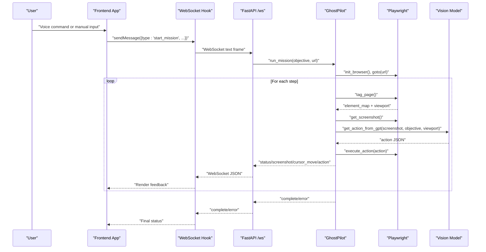
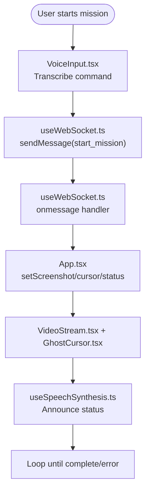
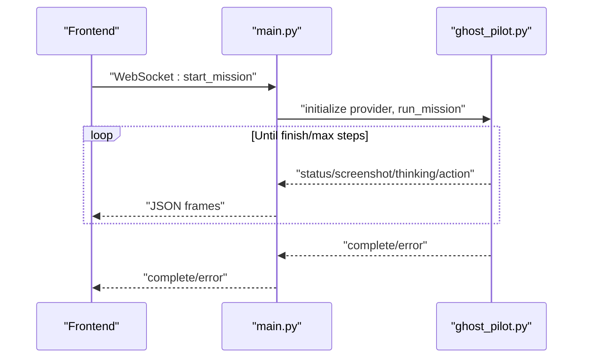
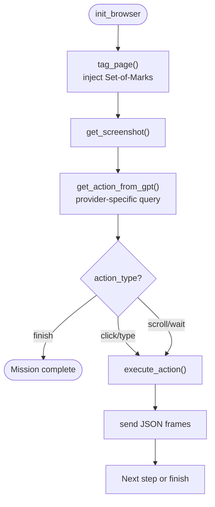
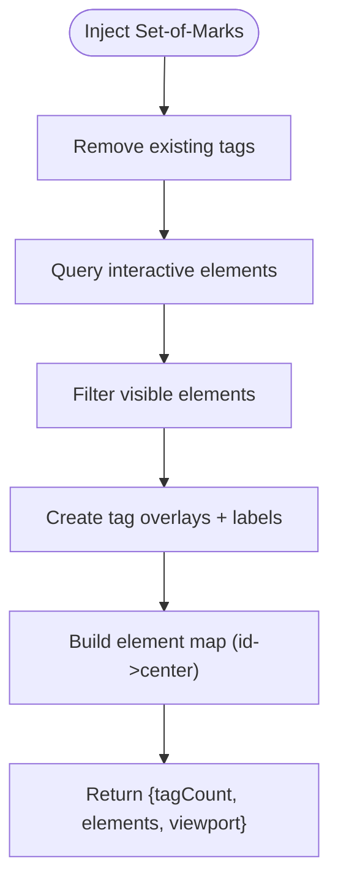
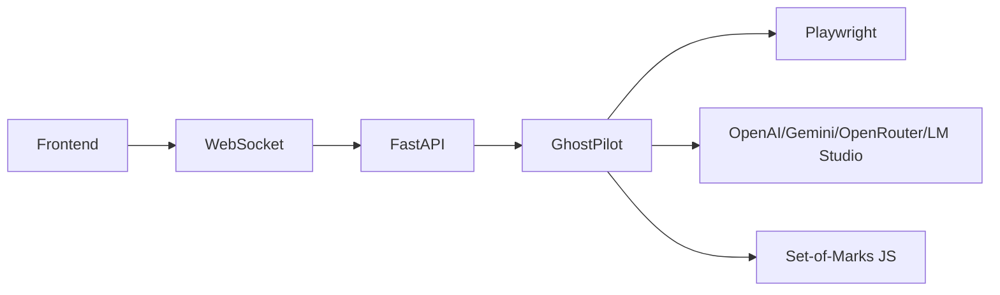

# Core Architecture

<cite>
**Referenced Files in This Document**
- [backend/main.py](file://backend/main.py)
- [backend/ghost_pilot.py](file://backend/ghost_pilot.py)
- [backend/set_of_marks.js](file://backend/set_of_marks.js)
- [frontend/src/App.tsx](file://frontend/src/App.tsx)
- [frontend/src/hooks/useWebSocket.ts](file://frontend/src/hooks/useWebSocket.ts)
- [frontend/src/components/VideoStream.tsx](file://frontend/src/components/VideoStream.tsx)
- [frontend/src/components/GhostCursor.tsx](file://frontend/src/components/GhostCursor.tsx)
- [frontend/src/components/VoiceInput.tsx](file://frontend/src/components/VoiceInput.tsx)
- [frontend/src/hooks/useSpeechSynthesis.ts](file://frontend/src/hooks/useSpeechSynthesis.ts)
- [backend/requirements.txt](file://backend/requirements.txt)
- [frontend/package.json](file://frontend/package.json)
- [AGENTS.md](file://AGENTS.md)
- [primary_agent/agent.ts](file://primary_agent/agent.ts)
- [secondary_agent/action-executor.ts](file://secondary_agent/action-executor.ts)
</cite>

## Table of Contents
1. [Introduction](#introduction)
2. [Project Structure](#project-structure)
3. [Core Components](#core-components)
4. [Architecture Overview](#architecture-overview)
5. [Detailed Component Analysis](#detailed-component-analysis)
6. [Dependency Analysis](#dependency-analysis)
7. [Performance Considerations](#performance-considerations)
8. [Troubleshooting Guide](#troubleshooting-guide)
9. [Conclusion](#conclusion)

## Introduction
This document presents the core architecture of the Ghost Pilot system, focusing on how the React frontend communicates with the Python backend over WebSocket, how the backend orchestrates browser automation using Playwright, and how AI decision-making leverages GPT-4o Vision (or compatible providers) to enable autonomous web navigation. It explains the complete workflow from user input through vision analysis to action execution and real-time feedback, and it documents the rationale behind key technical decisions such as WebSocket real-time communication, the Set-of-Marks targeting system, and provider-agnostic LLM support. The document also outlines the system context, component responsibilities, and practical trade-offs shaped by hackathon constraints.

## Project Structure
The system is organized into two primary runtime layers:
- Frontend (React): Provides a real-time UI with voice input, live video feed, cursor visualization, and WebSocket-driven status updates.
- Backend (Python/FastAPI): Serves WebSocket endpoints, initializes a browser via Playwright, injects Set-of-Marks tags, captures screenshots, queries an LLM for actions, executes them, and streams feedback.

```mermaid
graph TB
subgraph "Frontend (React)"
FE_App["App.tsx"]
FE_WS["useWebSocket.ts"]
FE_Video["VideoStream.tsx"]
FE_Cursor["GhostCursor.tsx"]
FE_Voice["VoiceInput.tsx"]
FE_Speech["useSpeechSynthesis.ts"]
end
subgraph "Backend (FastAPI)"
BE_Main["main.py"]
BE_Ghost["ghost_pilot.py"]
BE_SOM["set_of_marks.js"]
end
subgraph "External Services"
LLM_OpenAI["OpenAI-Compatible API"]
LLM_LMStudio["LM Studio"]
LLM_Gemini["Google Gemini"]
LLM_OpenRouter["OpenRouter"]
end
FE_App --> FE_WS
FE_Voice --> FE_App
FE_Speech --> FE_App
FE_Video --> FE_App
FE_Cursor --> FE_App
FE_WS <- --> BE_Main
BE_Main --> BE_Ghost
BE_Ghost --> BE_SOM
BE_Ghost --> LLM_OpenAI
BE_Ghost --> LLM_LMStudio
BE_Ghost --> LLM_Gemini
BE_Ghost --> LLM_OpenRouter
```

**Diagram sources**
- [frontend/src/App.tsx](file://frontend/src/App.tsx#L1-L360)
- [frontend/src/hooks/useWebSocket.ts](file://frontend/src/hooks/useWebSocket.ts#L1-L93)
- [frontend/src/components/VideoStream.tsx](file://frontend/src/components/VideoStream.tsx#L1-L43)
- [frontend/src/components/GhostCursor.tsx](file://frontend/src/components/GhostCursor.tsx#L1-L99)
- [frontend/src/components/VoiceInput.tsx](file://frontend/src/components/VoiceInput.tsx#L1-L321)
- [frontend/src/hooks/useSpeechSynthesis.ts](file://frontend/src/hooks/useSpeechSynthesis.ts#L1-L79)
- [backend/main.py](file://backend/main.py#L1-L157)
- [backend/ghost_pilot.py](file://backend/ghost_pilot.py#L1-L802)
- [backend/set_of_marks.js](file://backend/set_of_marks.js#L1-L229)

**Section sources**
- [frontend/src/App.tsx](file://frontend/src/App.tsx#L1-L360)
- [backend/main.py](file://backend/main.py#L1-L157)
- [backend/ghost_pilot.py](file://backend/ghost_pilot.py#L1-L802)
- [backend/set_of_marks.js](file://backend/set_of_marks.js#L1-L229)

## Core Components
- Frontend React Application
  - Orchestrates voice input, live video display, cursor overlay, and status messaging.
  - Uses a custom WebSocket hook to maintain persistent, real-time bidirectional communication with the backend.
- Backend FastAPI Server
  - Exposes a WebSocket endpoint for mission control, health checks, and general info.
  - Initializes and manages a browser session, coordinates vision-based action selection, and streams feedback.
- Ghost Pilot Engine (Python)
  - Implements the autonomous navigation loop: tag page → capture screenshot → query LLM → execute action → report status.
  - Supports multiple LLM providers and includes robust rate-limiting and retry logic.
- Set-of-Marks JavaScript Injector
  - Dynamically overlays yellow tags on interactive elements and returns a serializable map for precise targeting.
- Agent System (Optional Parallel Architecture)
  - Two independent agents (Primary and Secondary) demonstrate an alternative modular architecture for intent recognition and action execution.

**Section sources**
- [frontend/src/App.tsx](file://frontend/src/App.tsx#L1-L360)
- [frontend/src/hooks/useWebSocket.ts](file://frontend/src/hooks/useWebSocket.ts#L1-L93)
- [backend/main.py](file://backend/main.py#L1-L157)
- [backend/ghost_pilot.py](file://backend/ghost_pilot.py#L1-L802)
- [backend/set_of_marks.js](file://backend/set_of_marks.js#L1-L229)
- [AGENTS.md](file://AGENTS.md#L1-L273)
- [primary_agent/agent.ts](file://primary_agent/agent.ts#L1-L106)
- [secondary_agent/action-executor.ts](file://secondary_agent/action-executor.ts#L1-L391)

## Architecture Overview
The Ghost Pilot system follows a real-time, event-driven architecture:
- The React frontend listens to WebSocket events and renders live feedback.
- The FastAPI backend accepts mission commands, initializes a browser, and runs a loop that captures screenshots, queries an LLM, executes actions, and streams updates.
- The Set-of-Marks system provides deterministic, human-readable element targeting.
- The LLM provider abstraction supports multiple backends, enabling flexibility and cost-conscious choices.



**Diagram sources**
- [frontend/src/App.tsx](file://frontend/src/App.tsx#L1-L360)
- [frontend/src/hooks/useWebSocket.ts](file://frontend/src/hooks/useWebSocket.ts#L1-L93)
- [backend/main.py](file://backend/main.py#L36-L153)
- [backend/ghost_pilot.py](file://backend/ghost_pilot.py#L623-L768)

## Detailed Component Analysis

### Frontend: Real-Time UI and Communication
- WebSocket Integration
  - A reusable hook establishes and maintains a WebSocket connection, parses incoming messages, and exposes a send method.
  - The App subscribes to typed events (screenshot, cursor_move, action, thinking, status, complete, error) to drive UI state and audio feedback.
- Voice Input and Speech Synthesis
  - VoiceInput integrates Deepgram for live transcription and triggers mission start.
  - useSpeechSynthesis queues and speaks concise status updates and action feedback.
- Visual Feedback
  - VideoStream displays the latest screenshot.
  - GhostCursor animates the mouse position and pulses during thinking.



**Diagram sources**
- [frontend/src/components/VoiceInput.tsx](file://frontend/src/components/VoiceInput.tsx#L1-L321)
- [frontend/src/hooks/useWebSocket.ts](file://frontend/src/hooks/useWebSocket.ts#L1-L93)
- [frontend/src/App.tsx](file://frontend/src/App.tsx#L1-L360)
- [frontend/src/components/VideoStream.tsx](file://frontend/src/components/VideoStream.tsx#L1-L43)
- [frontend/src/components/GhostCursor.tsx](file://frontend/src/components/GhostCursor.tsx#L1-L99)
- [frontend/src/hooks/useSpeechSynthesis.ts](file://frontend/src/hooks/useSpeechSynthesis.ts#L1-L79)

**Section sources**
- [frontend/src/hooks/useWebSocket.ts](file://frontend/src/hooks/useWebSocket.ts#L1-L93)
- [frontend/src/App.tsx](file://frontend/src/App.tsx#L1-L360)
- [frontend/src/components/VoiceInput.tsx](file://frontend/src/components/VoiceInput.tsx#L1-L321)
- [frontend/src/components/VideoStream.tsx](file://frontend/src/components/VideoStream.tsx#L1-L43)
- [frontend/src/components/GhostCursor.tsx](file://frontend/src/components/GhostCursor.tsx#L1-L99)
- [frontend/src/hooks/useSpeechSynthesis.ts](file://frontend/src/hooks/useSpeechSynthesis.ts#L1-L79)

### Backend: FastAPI WebSocket Endpoint and Mission Orchestration
- WebSocket Endpoint
  - Accepts client connections, validates messages, and delegates to GhostPilot to run missions.
  - Supports manual captcha override signaling and graceful cleanup.
- Health and Root Endpoints
  - Basic health checks and readiness messages for operational monitoring.



**Diagram sources**
- [backend/main.py](file://backend/main.py#L36-L153)
- [backend/ghost_pilot.py](file://backend/ghost_pilot.py#L623-L768)

**Section sources**
- [backend/main.py](file://backend/main.py#L1-L157)

### Ghost Pilot Engine: Vision-Based Navigation Loop
- Initialization and Browser Lifecycle
  - Starts Playwright Chromium, opens a page, and configures viewport.
- Set-of-Marks Integration
  - Injects a lightweight script to tag interactive elements and returns a map of tag IDs to centers and metadata.
- Vision Action Selection
  - Builds a concise system prompt embedding objective, URL, viewport, and recent action history.
  - Queries provider-specific clients (OpenAI-compatible, Gemini) with retry/backoff logic.
- Action Execution
  - Executes click/type/scroll/wait actions using Playwright mouse and keyboard APIs.
- Safety and Resilience
  - Captcha detection and manual override support.
  - Rate-limit enforcement and progressive delays for free-tier providers.
  - Robust JSON parsing and error handling with step-level retries.



**Diagram sources**
- [backend/ghost_pilot.py](file://backend/ghost_pilot.py#L140-L157)
- [backend/ghost_pilot.py](file://backend/ghost_pilot.py#L299-L562)
- [backend/ghost_pilot.py](file://backend/ghost_pilot.py#L564-L621)
- [backend/ghost_pilot.py](file://backend/ghost_pilot.py#L623-L768)
- [backend/set_of_marks.js](file://backend/set_of_marks.js#L1-L229)

**Section sources**
- [backend/ghost_pilot.py](file://backend/ghost_pilot.py#L1-L802)
- [backend/set_of_marks.js](file://backend/set_of_marks.js#L1-L229)

### Set-of-Marks System: Precise Element Targeting
- Purpose
  - Overlay yellow tags on interactive elements and compute element centers for deterministic targeting.
- Implementation Highlights
  - Visibility checks, unique selector generation, and serializable element metadata.
  - Returns tag count, element map, and viewport metrics for downstream use.



**Diagram sources**
- [backend/set_of_marks.js](file://backend/set_of_marks.js#L1-L229)

**Section sources**
- [backend/set_of_marks.js](file://backend/set_of_marks.js#L1-L229)

### Provider-Agnostic LLM Integration
- Supported Providers
  - LM Studio (OpenAI-compatible), OpenAI, Google Gemini, OpenRouter, and custom endpoints.
- Implementation Details
  - Provider-specific client initialization and model selection.
  - Unified action parsing with provider-specific fallbacks and rate-limit handling.

**Section sources**
- [backend/ghost_pilot.py](file://backend/ghost_pilot.py#L18-L82)
- [backend/ghost_pilot.py](file://backend/ghost_pilot.py#L366-L432)
- [backend/ghost_pilot.py](file://backend/ghost_pilot.py#L434-L562)

### Alternative Agent Architecture (Parallel System)
- Primary Agent (Port 3001)
  - Converts user input into structured instructions.
- Secondary Agent (Port 3002)
  - Executes instructions using browser automation and database operations.
- Integration Notes
  - Demonstrates modularity and separation of concerns, contrasting with the unified Ghost Pilot approach.

**Section sources**
- [AGENTS.md](file://AGENTS.md#L1-L273)
- [primary_agent/agent.ts](file://primary_agent/agent.ts#L1-L106)
- [secondary_agent/action-executor.ts](file://secondary_agent/action-executor.ts#L1-L391)

## Dependency Analysis
- External Dependencies
  - Backend: FastAPI, Uvicorn, Playwright, OpenAI SDK, python-dotenv, websockets, Pillow.
  - Frontend: React, Framer Motion, @deepgram/sdk, TypeScript.
- Internal Coupling
  - Frontend depends on WebSocket messages and typed UI components.
  - Backend orchestrates Playwright, LLM providers, and the Set-of-Marks script.
- Provider Abstraction
  - LLM clients are encapsulated behind a unified interface, minimizing cross-layer coupling.



**Diagram sources**
- [backend/requirements.txt](file://backend/requirements.txt#L1-L8)
- [frontend/package.json](file://frontend/package.json#L1-L34)
- [backend/main.py](file://backend/main.py#L1-L157)
- [backend/ghost_pilot.py](file://backend/ghost_pilot.py#L1-L802)
- [backend/set_of_marks.js](file://backend/set_of_marks.js#L1-L229)

**Section sources**
- [backend/requirements.txt](file://backend/requirements.txt#L1-L8)
- [frontend/package.json](file://frontend/package.json#L1-L34)

## Performance Considerations
- Real-Time Responsiveness
  - WebSocket streaming ensures low-latency feedback; avoid blocking UI work on the main thread.
- Vision Model Throughput
  - Implement provider-specific rate-limiting and exponential/proportional backoff to balance speed and reliability.
- Browser Automation
  - Use targeted waits and element visibility checks to reduce retries and stabilize interactions.
- Image Capture
  - Keep screenshot resolution reasonable to minimize payload sizes and LLM token usage.

## Troubleshooting Guide
- WebSocket Disconnections
  - The frontend hook auto-reconnects; monitor connection state and status messages.
- Captcha Interference
  - The backend detects visible captchas and pauses for manual resolution; users can signal skip via a dedicated message.
- LLM Rate Limits
  - Free-tier providers enforce strict RPM and daily quotas; the engine applies progressive delays and respects Retry-After headers.
- Provider Misconfiguration
  - Verify environment variables for provider URLs, keys, and model names.
- Browser Automation Failures
  - Ensure Playwright browsers are installed and pages are fully loaded before interacting.

**Section sources**
- [frontend/src/hooks/useWebSocket.ts](file://frontend/src/hooks/useWebSocket.ts#L1-L93)
- [backend/main.py](file://backend/main.py#L128-L153)
- [backend/ghost_pilot.py](file://backend/ghost_pilot.py#L181-L231)
- [backend/ghost_pilot.py](file://backend/ghost_pilot.py#L514-L561)

## Conclusion
Ghost Pilot demonstrates a pragmatic, hackathon-friendly architecture that balances autonomy and real-time feedback. The React frontend’s WebSocket-driven UI pairs with a Python backend that orchestrates Playwright and vision-based decision-making. The Set-of-Marks system provides robust, deterministic targeting, while provider-agnostic LLM integration offers flexibility and cost control. Optional agent-based architectures further illustrate modular alternatives. Together, these choices deliver a compelling proof-of-concept for autonomous web navigation with transparent, real-time operation.