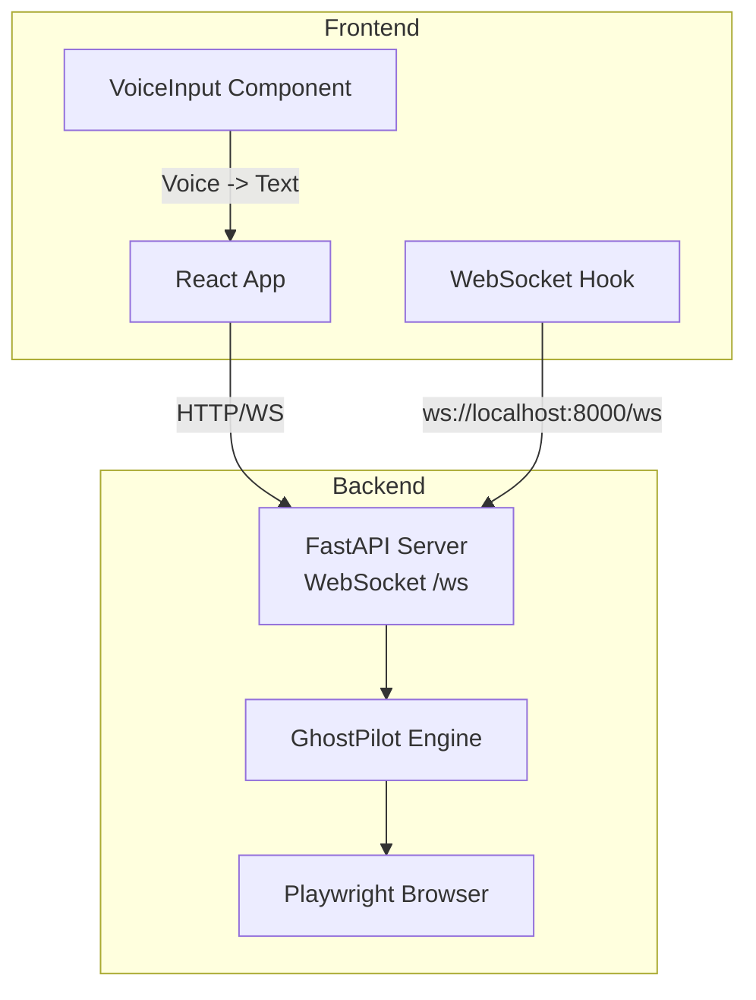

# Getting Started

<cite>
**Referenced Files in This Document**
- [requirements.txt](file://backend/requirements.txt)
- [main.py](file://backend/main.py)
- [ghost_pilot.py](file://backend/ghost_pilot.py)
- [set_of_marks.js](file://backend/set_of_marks.js)
- [setup_backend.sh](file://frontend/setup_backend.sh)
- [install_backend_deps.sh](file://frontend/install_backend_deps.sh)
- [package.json](file://frontend/package.json)
- [vite.config.ts](file://frontend/vite.config.ts)
- [useWebSocket.ts](file://frontend/src/hooks/useWebSocket.ts)
- [VoiceInput.tsx](file://frontend/src/components/VoiceInput.tsx)
- [App.tsx](file://frontend/src/App.tsx)
</cite>

## Table of Contents
1. [Introduction](#introduction)
2. [Project Structure](#project-structure)
3. [Prerequisites](#prerequisites)
4. [Installation](#installation)
5. [Running the System](#running-the-system)
6. [Expected Behavior](#expected-behavior)
7. [Voice Commands Examples](#voice-commands-examples)
8. [Troubleshooting](#troubleshooting)
9. [Conclusion](#conclusion)

## Introduction
Ghost Pilot is an autonomous browser automation system that lets you speak or type natural-language commands to guide an AI agent through web tasks. The backend runs a FastAPI server with a WebSocket endpoint, orchestrating a Playwright-powered browser controlled by a vision-capable language model. The frontend is a React application that streams screenshots, renders a virtual cursor, and accepts voice or text commands.

## Project Structure
At a high level, the repository is organized into:
- backend: Python FastAPI server, WebSocket endpoint, and the core autonomous engine
- frontend: React + Vite application with voice input, WebSocket client, and UI
- primary_agent and secondary_agent: separate agent services (optional)
- shared: shared types and utilities
- .qoder: agent artifacts and skills (supporting files)

**Diagram sources**
- [main.py](file://backend/main.py#L36-L157)
- [ghost_pilot.py](file://backend/ghost_pilot.py#L18-L105)
- [useWebSocket.ts](file://frontend/src/hooks/useWebSocket.ts#L15-L92)
- [vite.config.ts](file://frontend/vite.config.ts#L7-L17)

**Section sources**
- [main.py](file://backend/main.py#L1-L157)
- [ghost_pilot.py](file://backend/ghost_pilot.py#L1-L105)
- [vite.config.ts](file://frontend/vite.config.ts#L1-L23)

## Prerequisites
Before installing, ensure your environment meets the following:
- Python 3.10 or newer
- Node.js 16 or newer
- An OpenAI-compatible API key with access to a GPT-4o-like model (or configure an alternative provider)
- A modern browser for the frontend

Note: The backend supports multiple providers, including OpenAI, LM Studio, Gemini, OpenRouter, and custom endpoints. The frontend defaults to connecting to ws://localhost:8000/ws.

**Section sources**
- [requirements.txt](file://backend/requirements.txt#L1-L8)
- [package.json](file://frontend/package.json#L1-L34)
- [main.py](file://backend/main.py#L63-L99)

## Installation
Follow these steps to install both backend and frontend components.

### Backend Installation
There are two supported approaches:

Option A: Automated setup script
- Run the backend setup script to copy files and install dependencies
- The script installs Python dependencies and Playwright Chromium browser
- It also instructs you to edit the backend environment file to add your API key

Option B: Manual installation
- Install Python dependencies using pip
- Install the Playwright Chromium browser
- Configure environment variables for your chosen provider

Environment variables (backend)
- OPENAI_API_KEY: Required for OpenAI provider
- OPENAI_BASE_URL: Optional; defaults to official OpenAI endpoint
- OPENAI_MODEL: Optional; defaults to gpt-4o
- LLM_PROVIDER: Optional; choose lmstudio, openai, gemini, openrouter, or custom
- LM_STUDIO_BASE_URL and LM_STUDIO_MODEL: Used when provider is lmstudio
- GEMINI_API_KEY and GEMINI_MODEL: Used when provider is gemini
- OPENROUTER_API_KEY and OPENROUTER_MODEL: Used when provider is openrouter
- OPENAI_API_KEY, OPENAI_BASE_URL, OPENAI_MODEL: Used when provider is custom

Notes:
- The setup script copies a backend environment template and instructs you to edit it
- The frontend expects a WebSocket URL via VITE_WS_URL (defaults to ws://localhost:8000/ws)

**Section sources**
- [setup_backend.sh](file://frontend/setup_backend.sh#L1-L53)
- [install_backend_deps.sh](file://frontend/install_backend_deps.sh#L1-L40)
- [requirements.txt](file://backend/requirements.txt#L1-L8)
- [main.py](file://backend/main.py#L63-L99)

## Running the System
Start the backend and frontend servers in separate terminals.

Backend
- Navigate to the backend directory and run the main Python script
- The server listens on port 8000 with a WebSocket endpoint at /ws

Frontend
- Navigate to the frontend directory and start the Vite dev server
- The app proxies WebSocket traffic from /ws to ws://localhost:8000/ws
- Open http://localhost:3000 in your browser

Connection behavior
- The frontend automatically connects to the backend WebSocket
- It displays connection status and reconnects automatically on failure
- Voice input requires a Deepgram API key configured in the frontend environment

**Section sources**
- [main.py](file://backend/main.py#L154-L157)
- [vite.config.ts](file://frontend/vite.config.ts#L7-L17)
- [useWebSocket.ts](file://frontend/src/hooks/useWebSocket.ts#L15-L92)
- [VoiceInput.tsx](file://frontend/src/components/VoiceInput.tsx#L11-L24)

## Expected Behavior
Once both servers are running and connected:
- The frontend shows a live screenshot stream from the browser
- A virtual cursor moves to indicate the agent’s actions
- Voice input is transcribed and sent to the backend as a mission objective
- The backend initializes the browser, injects Set-of-Marks tags, captures screenshots, and queries the language model for the next action
- The agent performs clicks, typing, scrolling, or waits until completion or a maximum step limit
- Status updates, thinking indicators, and error messages are streamed back to the frontend

Typical flow
- Say or type a command (e.g., “Search for chocolate chip cookies recipes”)
- The backend starts a mission with the given objective and optional URL
- The agent navigates to the target site, interacts with elements, and reports progress
- When finished, the backend sends a completion message

**Section sources**
- [App.tsx](file://frontend/src/App.tsx#L26-L123)
- [ghost_pilot.py](file://backend/ghost_pilot.py#L623-L768)
- [set_of_marks.js](file://backend/set_of_marks.js#L8-L229)

## Voice Commands Examples
Try these practical examples to explore the capabilities:

- Search for recipes
  - “Find vegetarian pasta recipes on AllRecipes”
  - “Show me healthy breakfast ideas on EatingWell”

- Navigate e-commerce sites
  - “Go to Amazon and search for wireless earbuds”
  - “Open eBay and find vintage cameras under $100”

- Explore GitHub repositories
  - “Navigate to the React GitHub repository and show the README”
  - “Visit the TensorFlow tutorials and browse the examples”

- General browsing
  - “Open YouTube and play the latest video from Linus Tech Tips”
  - “Go to weather.com and check the forecast for Seattle”

Tips
- If you say a URL directly, the agent will navigate there; otherwise it starts at a default homepage
- For best results, speak clearly and pause slightly between the command and the end of the sentence

**Section sources**
- [App.tsx](file://frontend/src/App.tsx#L125-L166)
- [VoiceInput.tsx](file://frontend/src/components/VoiceInput.tsx#L165-L171)

## Troubleshooting
Common setup and runtime issues:

WebSocket connection failures
- Verify the backend is running on port 8000 and the frontend is pointing to ws://localhost:8000/ws
- Check the frontend proxy configuration if you changed ports
- The frontend attempts automatic reconnection; ensure the backend remains reachable

Playwright installation and browser startup
- Ensure the Chromium browser is installed via the Playwright installer
- On some systems, you may need to install additional system dependencies for headless rendering
- If the browser fails to launch, confirm your environment supports GUI/headless mode

API key and provider configuration
- For OpenAI provider, set OPENAI_API_KEY and optionally OPENAI_BASE_URL and OPENAI_MODEL
- For LM Studio, set LM_STUDIO_BASE_URL and LM_STUDIO_MODEL
- For Gemini, set GEMINI_API_KEY and GEMINI_MODEL
- For OpenRouter, set OPENROUTER_API_KEY and OPENROUTER_MODEL
- For custom endpoints, set OPENAI_API_KEY and OPENAI_BASE_URL with your model name

Rate limits and retries
- The backend enforces rate limits for free-tier providers and applies progressive delays on repeated 429 errors
- If you encounter frequent rate limits, reduce request frequency or upgrade your plan

Captchas
- If a captcha is detected, the agent pauses and waits for manual resolution
- You can manually skip the captcha wait from the frontend UI
- The agent periodically checks for captcha resolution and continues when cleared

Frontend voice input
- Ensure VITE_DEEPGRAM_API_KEY is configured in the frontend environment
- Allow microphone access in your browser when prompted
- If transcription fails, verify the key and network connectivity

**Section sources**
- [main.py](file://backend/main.py#L63-L99)
- [ghost_pilot.py](file://backend/ghost_pilot.py#L181-L231)
- [ghost_pilot.py](file://backend/ghost_pilot.py#L434-L562)
- [ghost_pilot.py](file://backend/ghost_pilot.py#L659-L706)
- [useWebSocket.ts](file://frontend/src/hooks/useWebSocket.ts#L15-L92)
- [VoiceInput.tsx](file://frontend/src/components/VoiceInput.tsx#L42-L45)

## Conclusion
You are now ready to run Ghost Pilot. Start the backend and frontend, connect your microphone, and issue voice commands to automate web tasks. If you encounter issues, use the troubleshooting section to diagnose connection, browser, API key, and rate-limit problems. For advanced scenarios, experiment with different LLM providers and models by adjusting the backend environment variables.