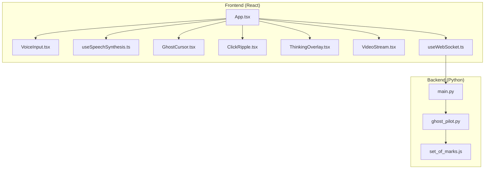
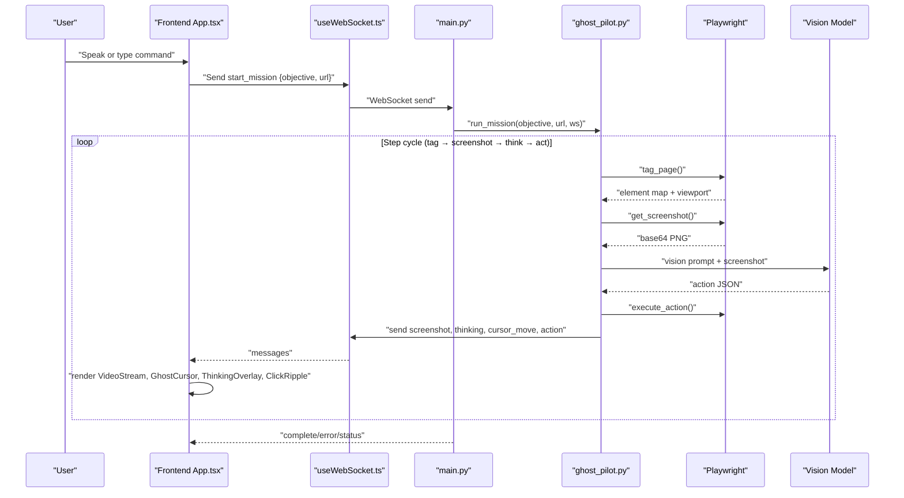
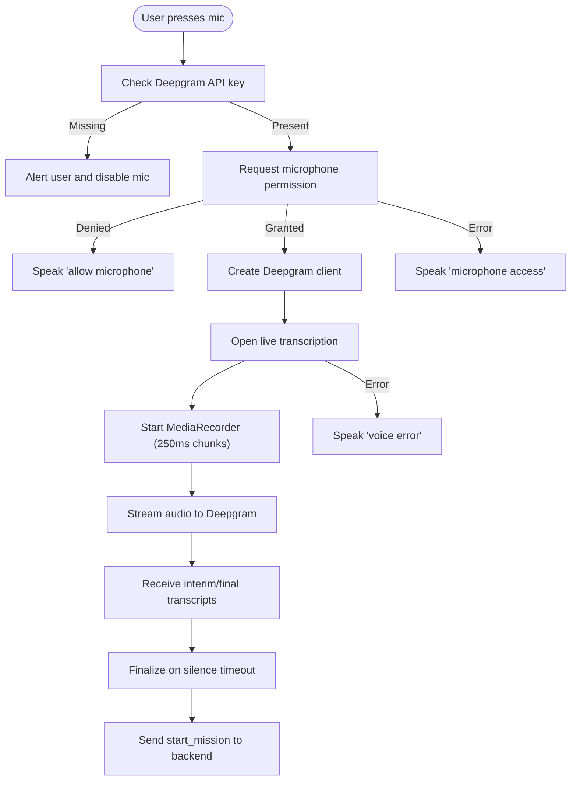
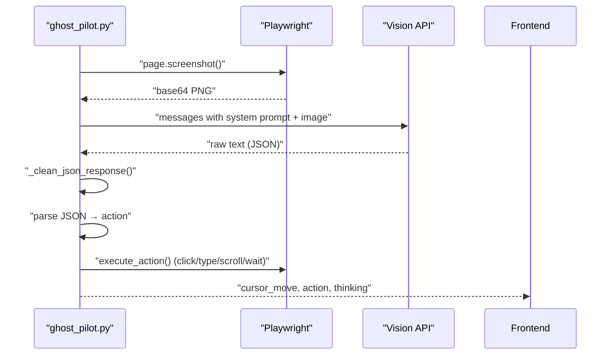
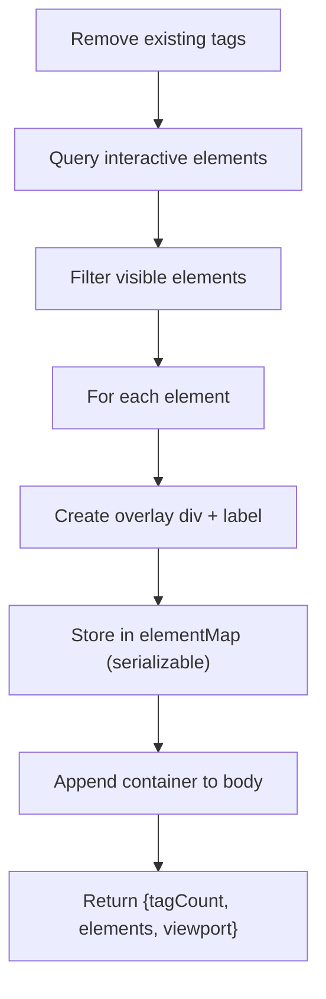
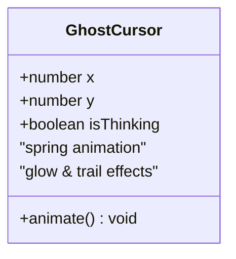
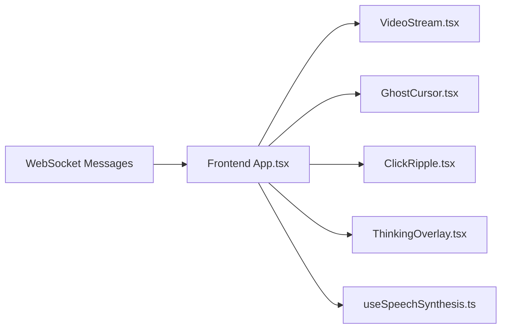
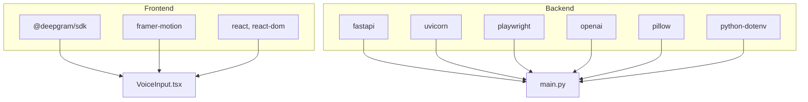

# Key Features

<cite>
**Referenced Files in This Document**
- [VoiceInput.tsx](file://frontend/src/components/VoiceInput.tsx)
- [useSpeechSynthesis.ts](file://frontend/src/hooks/useSpeechSynthesis.ts)
- [GhostCursor.tsx](file://frontend/src/components/GhostCursor.tsx)
- [ClickRipple.tsx](file://frontend/src/components/ClickRipple.tsx)
- [ThinkingOverlay.tsx](file://frontend/src/components/ThinkingOverlay.tsx)
- [VideoStream.tsx](file://frontend/src/components/VideoStream.tsx)
- [App.tsx](file://frontend/src/App.tsx)
- [useWebSocket.ts](file://frontend/src/hooks/useWebSocket.ts)
- [set_of_marks.js](file://backend/set_of_marks.js)
- [ghost_pilot.py](file://backend/ghost_pilot.py)
- [main.py](file://backend/main.py)
- [package.json](file://frontend/package.json)
- [requirements.txt](file://backend/requirements.txt)
</cite>

## Table of Contents
1. [Introduction](#introduction)
2. [Project Structure](#project-structure)
3. [Core Components](#core-components)
4. [Architecture Overview](#architecture-overview)
5. [Detailed Component Analysis](#detailed-component-analysis)
6. [Dependency Analysis](#dependency-analysis)
7. [Performance Considerations](#performance-considerations)
8. [Troubleshooting Guide](#troubleshooting-guide)
9. [Conclusion](#conclusion)

## Introduction
This document explains the key autonomous browser navigation features of the Ghost Pilot system. It focuses on:
- Voice control using Web Speech API for speech recognition and synthesis
- Vision-powered navigation powered by GPT-4o Vision to analyze screenshots and decide actions
- Set-of-Marks dynamic tagging system for precise targeting of interactive elements
- Ghost Cursor animation with spring physics for smooth, human-like cursor movement
- Real-time streaming of live browser feeds and visual feedback (radar, ripple, thinking overlays)
- Practical examples, integration patterns, performance considerations, and limitations

## Project Structure
The system comprises a React frontend and a Python backend:
- Frontend: React components for voice input, cursor, ripple, thinking overlay, video stream, and WebSocket communication
- Backend: FastAPI WebSocket server, GhostPilot orchestrator, and Playwright-driven browser automation

**Diagram sources**
- [App.tsx](file://frontend/src/App.tsx#L1-L360)
- [VoiceInput.tsx](file://frontend/src/components/VoiceInput.tsx#L1-L321)
- [useSpeechSynthesis.ts](file://frontend/src/hooks/useSpeechSynthesis.ts#L1-L79)
- [GhostCursor.tsx](file://frontend/src/components/GhostCursor.tsx#L1-L99)
- [ClickRipple.tsx](file://frontend/src/components/ClickRipple.tsx#L1-L35)
- [ThinkingOverlay.tsx](file://frontend/src/components/ThinkingOverlay.tsx#L1-L78)
- [VideoStream.tsx](file://frontend/src/components/VideoStream.tsx#L1-L43)
- [useWebSocket.ts](file://frontend/src/hooks/useWebSocket.ts#L1-L93)
- [main.py](file://backend/main.py#L1-L157)
- [ghost_pilot.py](file://backend/ghost_pilot.py#L1-L802)
- [set_of_marks.js](file://backend/set_of_marks.js#L1-L229)

**Section sources**
- [App.tsx](file://frontend/src/App.tsx#L1-L360)
- [main.py](file://backend/main.py#L1-L157)

## Core Components
- Voice control: Real-time speech-to-text via Deepgram with fallback manual input; speech synthesis for assistant feedback
- Vision-powered navigation: GPT-4o Vision (or compatible providers) receives screenshots and returns structured actions
- Set-of-Marks: Dynamically overlays yellow tags on interactive elements and returns a serializable element map
- Ghost Cursor: Spring-based animation for smooth cursor movement with glow and thinking indicators
- Visual feedback: Radar scanning overlay, ripple effects on clicks, and thinking overlay during analysis
- Real-time streaming: WebSocket transport for screenshots, cursor moves, thinking state, and status updates

**Section sources**
- [VoiceInput.tsx](file://frontend/src/components/VoiceInput.tsx#L1-L321)
- [useSpeechSynthesis.ts](file://frontend/src/hooks/useSpeechSynthesis.ts#L1-L79)
- [ghost_pilot.py](file://backend/ghost_pilot.py#L1-L802)
- [set_of_marks.js](file://backend/set_of_marks.js#L1-L229)
- [GhostCursor.tsx](file://frontend/src/components/GhostCursor.tsx#L1-L99)
- [ThinkingOverlay.tsx](file://frontend/src/components/ThinkingOverlay.tsx#L1-L78)
- [ClickRipple.tsx](file://frontend/src/components/ClickRipple.tsx#L1-L35)
- [VideoStream.tsx](file://frontend/src/components/VideoStream.tsx#L1-L43)
- [useWebSocket.ts](file://frontend/src/hooks/useWebSocket.ts#L1-L93)

## Architecture Overview
End-to-end flow from voice command to autonomous browser actions:

**Diagram sources**
- [App.tsx](file://frontend/src/App.tsx#L146-L166)
- [useWebSocket.ts](file://frontend/src/hooks/useWebSocket.ts#L15-L93)
- [main.py](file://backend/main.py#L36-L137)
- [ghost_pilot.py](file://backend/ghost_pilot.py#L623-L768)

## Detailed Component Analysis

### Voice Control System (Web Speech API + Deepgram)
- Speech recognition:
  - Uses MediaRecorder to stream microphone audio to Deepgram’s live transcription service
  - Configures Nova-2 model with interim results, punctuation, and smart formatting
  - Finalizes transcript after a silence timeout to reduce noise
- Speech synthesis:
  - Queued SpeechSynthesisUtterance with configurable rate/pitch/volume
  - Attempts to select a preferred voice (female) for a pleasant assistant tone
  - Supports immediate interruption and cancellation
- Frontend integration:
  - VoiceInput component exposes a toggle button and manual text input
  - On transcript, sends start_mission with extracted URL or defaults to a search engine

**Diagram sources**
- [VoiceInput.tsx](file://frontend/src/components/VoiceInput.tsx#L41-L130)
- [useSpeechSynthesis.ts](file://frontend/src/hooks/useSpeechSynthesis.ts#L55-L77)

**Section sources**
- [VoiceInput.tsx](file://frontend/src/components/VoiceInput.tsx#L1-L321)
- [useSpeechSynthesis.ts](file://frontend/src/hooks/useSpeechSynthesis.ts#L1-L79)
- [App.tsx](file://frontend/src/App.tsx#L146-L166)

### Vision-Powered Navigation (GPT-4o Vision)
- Screenshot capture:
  - Playwright captures PNG screenshot and returns base64
- Prompt construction:
  - Includes objective, current URL, viewport, and recent action history
  - Enforces strict JSON schema and behavioral rules (e.g., typing workflow, avoid repeats)
- Action parsing:
  - Cleans LLM output to remove comments/markdown and trailing commas
  - Validates JSON and stores action history to prevent loops
- Provider support:
  - OpenAI-compatible (OpenRouter, LM Studio, custom endpoints)
  - Google Gemini with native API
  - Built-in rate-limit enforcement for free tiers (RPM/daily) with progressive delays and Retry-After honoring
- Execution:
  - Converts tag IDs to coordinates via Set-of-Marks map
  - Performs mouse click or keyboard typing with delays
  - Emits cursor_move events for smooth frontend rendering

**Diagram sources**
- [ghost_pilot.py](file://backend/ghost_pilot.py#L232-L238)
- [ghost_pilot.py](file://backend/ghost_pilot.py#L299-L364)
- [ghost_pilot.py](file://backend/ghost_pilot.py#L564-L621)

**Section sources**
- [ghost_pilot.py](file://backend/ghost_pilot.py#L1-L802)

### Set-of-Marks Dynamic Tagging System
- Element discovery:
  - Queries interactive selectors (links, buttons, inputs, ARIA roles, editable elements)
  - Filters visible elements by computed styles, bounding rects, and viewport bounds
- Overlay generation:
  - Creates a high z-index container with yellow borders and translucent backgrounds
  - Places numbered labels at the top-left of each tagged element
- Data export:
  - Returns a serializable map of tag IDs to element metadata (selector, rect, center, text, placeholder, ariaLabel)
  - Also returns viewport metrics for coordinate context
- Injection:
  - Injected via Playwright evaluate using external JS or embedded fallback

**Diagram sources**
- [set_of_marks.js](file://backend/set_of_marks.js#L8-L149)
- [set_of_marks.js](file://backend/set_of_marks.js#L202-L228)

**Section sources**
- [set_of_marks.js](file://backend/set_of_marks.js#L1-L229)
- [ghost_pilot.py](file://backend/ghost_pilot.py#L148-L157)

### Ghost Cursor Animation (Spring Physics)
- Smooth movement:
  - Framer Motion spring animation with tuned damping/stiffness/mass
  - Updates position on each cursor_move event from backend
- Visual effects:
  - Glowing cursor pointer with pulsing aura when thinking
  - Subtle trail particles and optional thinking ring
- Layering:
  - Positioned absolutely above the video stream with high z-index

**Diagram sources**
- [GhostCursor.tsx](file://frontend/src/components/GhostCursor.tsx#L10-L25)

**Section sources**
- [GhostCursor.tsx](file://frontend/src/components/GhostCursor.tsx#L1-L99)
- [App.tsx](file://frontend/src/App.tsx#L252-L261)

### Real-Time Streaming and Visual Feedback
- Live browser feed:
  - Receives base64 screenshots via WebSocket and renders as an image
- Cursor and ripple:
  - On click actions, renders a ripple expanding outward from target coordinates
- Thinking overlay:
  - During model inference, displays rotating scanner and pulsing rings with animated text
- Status and synthesis:
  - Backend emits status messages; frontend speaks them and updates UI

**Diagram sources**
- [useWebSocket.ts](file://frontend/src/hooks/useWebSocket.ts#L15-L93)
- [App.tsx](file://frontend/src/App.tsx#L247-L354)
- [VideoStream.tsx](file://frontend/src/components/VideoStream.tsx#L8-L19)
- [GhostCursor.tsx](file://frontend/src/components/GhostCursor.tsx#L10-L25)
- [ClickRipple.tsx](file://frontend/src/components/ClickRipple.tsx#L10-L16)
- [ThinkingOverlay.tsx](file://frontend/src/components/ThinkingOverlay.tsx#L8-L77)
- [useSpeechSynthesis.ts](file://frontend/src/hooks/useSpeechSynthesis.ts#L55-L77)

**Section sources**
- [VideoStream.tsx](file://frontend/src/components/VideoStream.tsx#L1-L43)
- [ThinkingOverlay.tsx](file://frontend/src/components/ThinkingOverlay.tsx#L1-L78)
- [ClickRipple.tsx](file://frontend/src/components/ClickRipple.tsx#L1-L35)
- [useWebSocket.ts](file://frontend/src/hooks/useWebSocket.ts#L1-L93)

## Dependency Analysis
- Frontend dependencies:
  - @deepgram/sdk for speech recognition
  - framer-motion for animations
  - react/react-dom for UI
- Backend dependencies:
  - FastAPI + Uvicorn for WebSocket server
  - Playwright for browser automation
  - OpenAI SDK for GPT-4o Vision
  - Pillow for Gemini image handling
  - python-dotenv for environment variables

**Diagram sources**
- [package.json](file://frontend/package.json#L12-L17)
- [requirements.txt](file://backend/requirements.txt#L1-L8)

**Section sources**
- [package.json](file://frontend/package.json#L1-L34)
- [requirements.txt](file://backend/requirements.txt#L1-L8)

## Performance Considerations
- Browser automation
  - Playwright Chromium launch adds startup latency; headless mode reduces overhead
  - Screenshot capture and evaluation add CPU/network cost; batching or throttling may help
- Vision model
  - Free-tier providers (OpenRouter, Gemini) enforce RPM/daily limits; the system implements rate limiting and progressive backoff
  - Retry-After headers are honored when present
- Audio streaming
  - Deepgram MediaRecorder chunk size balances latency vs bandwidth; 250 ms is reasonable for responsiveness
- Rendering
  - Spring physics and frequent re-renders are lightweight with Framer Motion
  - Base64 image rendering is efficient for small viewport sizes
- Network
  - WebSocket auto-reconnect prevents transient disconnections
- Limitations
  - Browser compatibility: Playwright Chromium is required; some sites may require additional waits or anti-bot evasion
  - Speech recognition: Requires HTTPS and microphone permissions; Deepgram key is mandatory
  - Vision accuracy: JSON cleaning assumes LLM adheres to format; malformed outputs increase retries

[No sources needed since this section provides general guidance]

## Troubleshooting Guide
- Voice input not working
  - Verify VITE_DEEPGRAM_API_KEY is set; otherwise the mic button is disabled
  - Allow microphone permissions; errors surface as synthesized feedback
- Speech synthesis issues
  - Some browsers restrict voices; the hook attempts to pick a preferred voice and falls back gracefully
- WebSocket disconnects
  - Auto-reconnect is built-in; inspect console for “disconnected” and “reconnecting”
- Vision model rate limits
  - Free tiers throttle aggressively; monitor status messages and wait for resets
  - Retry-After is honored; consecutive rate limits trigger longer delays
- Captcha stalls
  - The system detects visible captcha frames and prompts manual resolution; use the “Manual Override” button to skip waiting
- Action failures
  - If an action lacks a valid tag or coordinates, the backend logs and skips; ensure the page is fully loaded and Set-of-Marks tagged

**Section sources**
- [VoiceInput.tsx](file://frontend/src/components/VoiceInput.tsx#L42-L45)
- [useSpeechSynthesis.ts](file://frontend/src/hooks/useSpeechSynthesis.ts#L45-L49)
- [useWebSocket.ts](file://frontend/src/hooks/useWebSocket.ts#L43-L52)
- [ghost_pilot.py](file://backend/ghost_pilot.py#L181-L231)
- [ghost_pilot.py](file://backend/ghost_pilot.py#L659-L706)
- [App.tsx](file://frontend/src/App.tsx#L168-L174)

## Conclusion
Ghost Pilot integrates voice control, visual perception, precise targeting, and smooth visual feedback to enable autonomous browser navigation. The system balances robustness with real-time responsiveness, incorporating rate-limit handling, resilient retries, and intuitive UI cues. For production use, tune provider credentials, monitor resource usage, and consider headless operation and anti-detection strategies as needed.