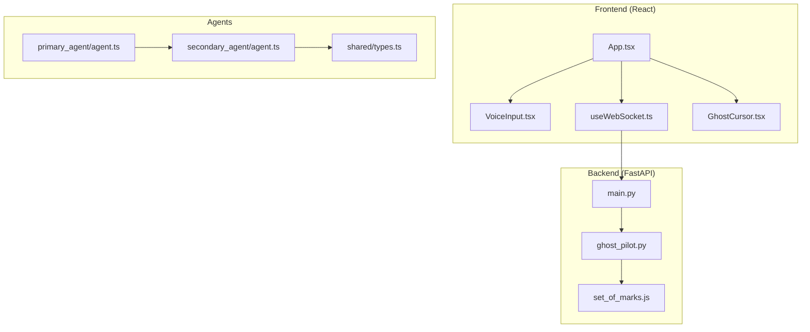
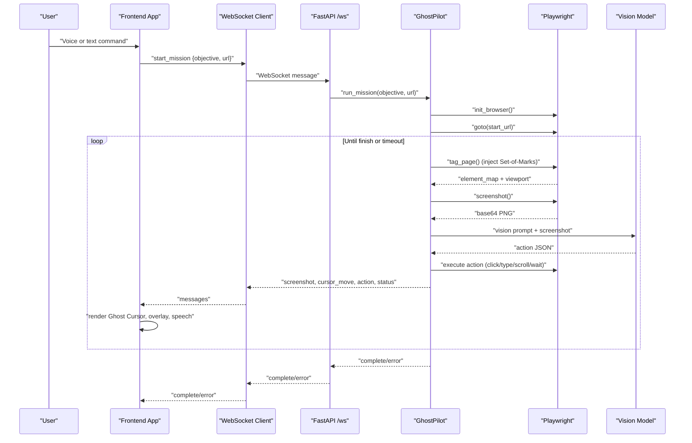
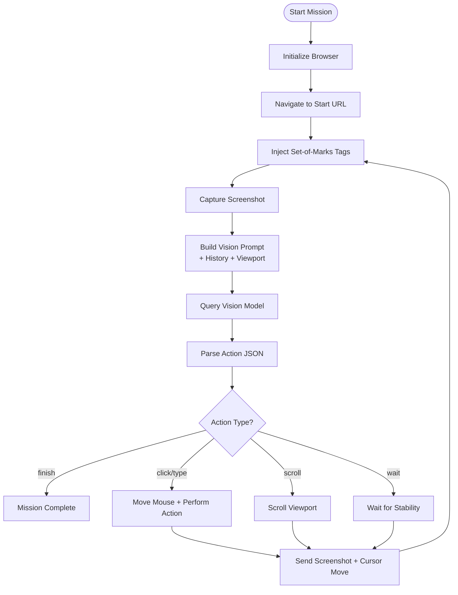
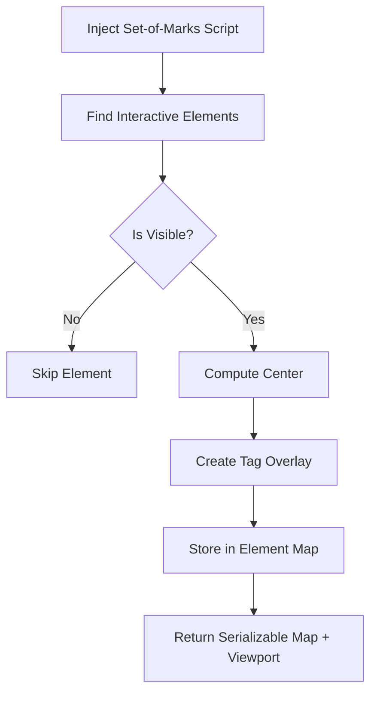
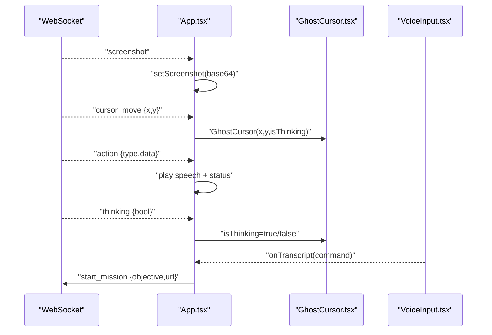
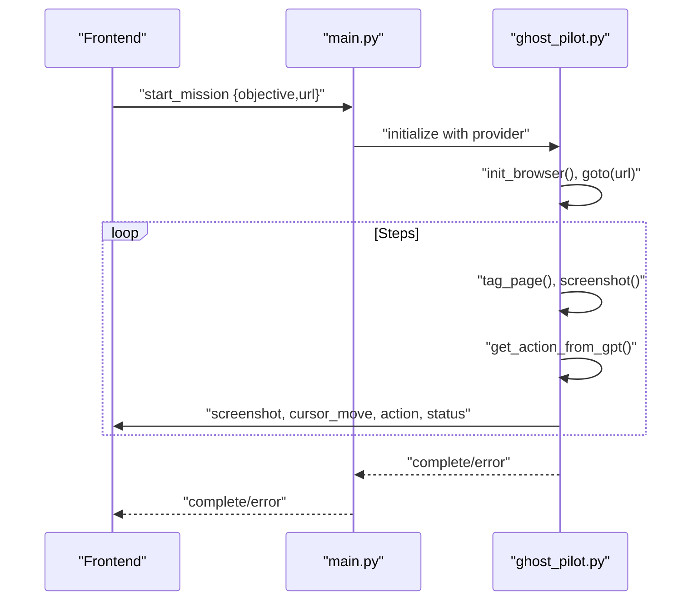
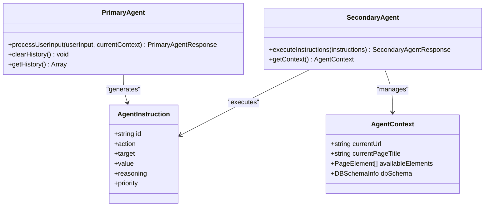
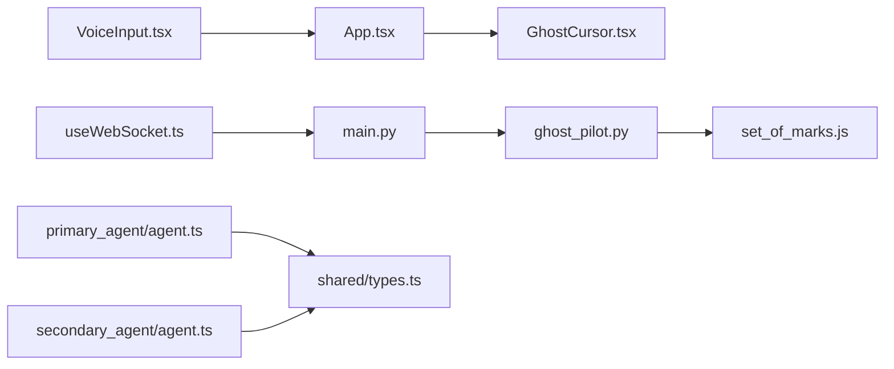

# Project Overview

<cite>
**Referenced Files in This Document**
- [backend/main.py](file://backend/main.py)
- [backend/ghost_pilot.py](file://backend/ghost_pilot.py)
- [backend/set_of_marks.js](file://backend/set_of_marks.js)
- [frontend/src/App.tsx](file://frontend/src/App.tsx)
- [frontend/src/components/GhostCursor.tsx](file://frontend/src/components/GhostCursor.tsx)
- [frontend/src/hooks/useWebSocket.ts](file://frontend/src/hooks/useWebSocket.ts)
- [frontend/src/components/VoiceInput.tsx](file://frontend/src/components/VoiceInput.tsx)
- [primary_agent/agent.ts](file://primary_agent/agent.ts)
- [secondary_agent/agent.ts](file://secondary_agent/agent.ts)
- [shared/types.ts](file://shared/types.ts)
</cite>

## Table of Contents
1. [Introduction](#introduction)
2. [Project Structure](#project-structure)
3. [Core Components](#core-components)
4. [Architecture Overview](#architecture-overview)
5. [Detailed Component Analysis](#detailed-component-analysis)
6. [Dependency Analysis](#dependency-analysis)
7. [Performance Considerations](#performance-considerations)
8. [Troubleshooting Guide](#troubleshooting-guide)
9. [Conclusion](#conclusion)

## Introduction
Ghost Pilot is a hackathon–proof-of-concept autonomous browser automation system that turns AI-powered web navigation into a tangible reality. It combines GPT-4o Vision with a Set-of-Marks element tagging system to enable precise, vision-powered browser automation. Users can speak commands or type instructions to guide the agent, which then navigates websites, performs actions, and reports progress in real time.

At its core, Ghost Pilot demonstrates:
- A vision-powered approach: the AI consumes a browser screenshot annotated with yellow “Set-of-Marks” tags and decides the next action.
- A robust backend orchestrator: a WebSocket server that initializes a browser, injects tags, captures screenshots, queries the LLM, executes actions, and streams feedback to the frontend.
- A modern frontend: a React application with voice input, a live video feed of the browser, a Ghost Cursor overlay, and speech synthesis to keep users informed.

Practical use cases include:
- Searching for recipes on recipe sites by navigating to a search bar, typing a query, and clicking the search button.
- Exploring e-commerce product listings by filtering, sorting, and selecting items.
- Browsing GitHub repositories by navigating to a repo, exploring releases, and opening related links.

## Project Structure
The repository is organized into a frontend (React + TypeScript), a backend (FastAPI + WebSocket), and supporting agent modules for intent recognition and instruction execution.

**Diagram sources**
- [frontend/src/App.tsx](file://frontend/src/App.tsx#L1-L360)
- [frontend/src/components/VoiceInput.tsx](file://frontend/src/components/VoiceInput.tsx#L1-L321)
- [frontend/src/hooks/useWebSocket.ts](file://frontend/src/hooks/useWebSocket.ts#L1-L93)
- [frontend/src/components/GhostCursor.tsx](file://frontend/src/components/GhostCursor.tsx#L1-L99)
- [backend/main.py](file://backend/main.py#L1-L157)
- [backend/ghost_pilot.py](file://backend/ghost_pilot.py#L1-L802)
- [backend/set_of_marks.js](file://backend/set_of_marks.js#L1-L229)
- [primary_agent/agent.ts](file://primary_agent/agent.ts#L1-L106)
- [secondary_agent/agent.ts](file://secondary_agent/agent.ts#L1-L119)
- [shared/types.ts](file://shared/types.ts#L1-L85)

**Section sources**
- [frontend/src/App.tsx](file://frontend/src/App.tsx#L1-L360)
- [backend/main.py](file://backend/main.py#L1-L157)
- [backend/ghost_pilot.py](file://backend/ghost_pilot.py#L1-L802)
- [backend/set_of_marks.js](file://backend/set_of_marks.js#L1-L229)
- [primary_agent/agent.ts](file://primary_agent/agent.ts#L1-L106)
- [secondary_agent/agent.ts](file://secondary_agent/agent.ts#L1-L119)
- [shared/types.ts](file://shared/types.ts#L1-L85)

## Core Components
- Frontend React application
  - Provides voice input (via Deepgram) and manual text input.
  - Streams screenshots and action events from the backend.
  - Renders a live browser viewport and a Ghost Cursor overlay that follows the agent’s mouse movements.
- Backend WebSocket server
  - Accepts mission requests with an objective and optional starting URL.
  - Initializes a browser, injects Set-of-Marks tags, captures screenshots, and queries the vision model.
  - Executes actions (click, type, scroll, wait) and relays progress to the frontend.
- Set-of-Marks element tagging
  - Injects yellow-numbered overlays on interactive elements and returns a serializable map of tag IDs to element metadata.
- Vision-powered decision engine
  - Uses GPT-4o Vision (or compatible providers) to interpret the screenshot and decide the next action.
- Agents (optional modular layer)
  - Primary agent recognizes user intent and translates it into structured instructions.
  - Secondary agent executes instructions and manages context.

**Section sources**
- [frontend/src/App.tsx](file://frontend/src/App.tsx#L1-L360)
- [frontend/src/components/VoiceInput.tsx](file://frontend/src/components/VoiceInput.tsx#L1-L321)
- [frontend/src/hooks/useWebSocket.ts](file://frontend/src/hooks/useWebSocket.ts#L1-L93)
- [frontend/src/components/GhostCursor.tsx](file://frontend/src/components/GhostCursor.tsx#L1-L99)
- [backend/main.py](file://backend/main.py#L1-L157)
- [backend/ghost_pilot.py](file://backend/ghost_pilot.py#L1-L802)
- [backend/set_of_marks.js](file://backend/set_of_marks.js#L1-L229)
- [primary_agent/agent.ts](file://primary_agent/agent.ts#L1-L106)
- [secondary_agent/agent.ts](file://secondary_agent/agent.ts#L1-L119)
- [shared/types.ts](file://shared/types.ts#L1-L85)

## Architecture Overview
Ghost Pilot’s architecture centers around a real-time WebSocket channel connecting a React frontend to a FastAPI backend. The backend orchestrates a browser automation loop powered by a vision model and Set-of-Marks tagging.

**Diagram sources**
- [backend/main.py](file://backend/main.py#L36-L153)
- [backend/ghost_pilot.py](file://backend/ghost_pilot.py#L623-L768)
- [frontend/src/App.tsx](file://frontend/src/App.tsx#L146-L174)
- [frontend/src/hooks/useWebSocket.ts](file://frontend/src/hooks/useWebSocket.ts#L15-L92)

## Detailed Component Analysis

### Vision-Powered Navigation Workflow
Ghost Pilot’s autonomous navigation relies on three pillars:
- Set-of-Marks tagging: overlays yellow tags on interactive elements and returns a map of tag IDs to positions and metadata.
- Screenshot capture: captures the current viewport as a base64-encoded PNG.
- Vision model decision: sends the screenshot plus a structured prompt to the LLM to produce the next action.

**Diagram sources**
- [backend/ghost_pilot.py](file://backend/ghost_pilot.py#L623-L768)
- [backend/ghost_pilot.py](file://backend/ghost_pilot.py#L148-L157)
- [backend/ghost_pilot.py](file://backend/ghost_pilot.py#L232-L238)
- [backend/ghost_pilot.py](file://backend/ghost_pilot.py#L299-L364)
- [backend/ghost_pilot.py](file://backend/ghost_pilot.py#L564-L621)

**Section sources**
- [backend/ghost_pilot.py](file://backend/ghost_pilot.py#L148-L157)
- [backend/ghost_pilot.py](file://backend/ghost_pilot.py#L232-L238)
- [backend/ghost_pilot.py](file://backend/ghost_pilot.py#L299-L364)
- [backend/ghost_pilot.py](file://backend/ghost_pilot.py#L564-L621)
- [backend/ghost_pilot.py](file://backend/ghost_pilot.py#L623-L768)

### Set-of-Marks Element Tagging
Set-of-Marks dynamically detects visible interactive elements, overlays yellow borders with numbered labels, and returns a serializable map of tag IDs to element metadata (selectors, text, placeholders, ARIA labels, bounding boxes, and centers). This enables precise targeting of UI elements by the vision model and the executor.

**Diagram sources**
- [backend/set_of_marks.js](file://backend/set_of_marks.js#L63-L146)
- [backend/set_of_marks.js](file://backend/set_of_marks.js#L154-L200)
- [backend/set_of_marks.js](file://backend/set_of_marks.js#L202-L228)

**Section sources**
- [backend/set_of_marks.js](file://backend/set_of_marks.js#L1-L229)

### Frontend React Application and Ghost Cursor
The frontend listens to WebSocket messages, renders the latest screenshot, moves the Ghost Cursor to the predicted coordinates, and plays synthesized speech for actions. It also surfaces status updates and provides a manual captcha override.

**Diagram sources**
- [frontend/src/App.tsx](file://frontend/src/App.tsx#L26-L123)
- [frontend/src/components/GhostCursor.tsx](file://frontend/src/components/GhostCursor.tsx#L10-L25)
- [frontend/src/components/VoiceInput.tsx](file://frontend/src/components/VoiceInput.tsx#L146-L174)
- [frontend/src/hooks/useWebSocket.ts](file://frontend/src/hooks/useWebSocket.ts#L15-L92)

**Section sources**
- [frontend/src/App.tsx](file://frontend/src/App.tsx#L1-L360)
- [frontend/src/components/GhostCursor.tsx](file://frontend/src/components/GhostCursor.tsx#L1-L99)
- [frontend/src/components/VoiceInput.tsx](file://frontend/src/components/VoiceInput.tsx#L1-L321)
- [frontend/src/hooks/useWebSocket.ts](file://frontend/src/hooks/useWebSocket.ts#L1-L93)

### Backend WebSocket Orchestration
The backend FastAPI service accepts a mission request, initializes the GhostPilot engine with a chosen provider (LM Studio, OpenAI, Gemini, OpenRouter, or custom), and runs the autonomous loop. It handles rate limits, retries, and captcha detection, streaming updates to the frontend.

**Diagram sources**
- [backend/main.py](file://backend/main.py#L36-L153)
- [backend/ghost_pilot.py](file://backend/ghost_pilot.py#L18-L105)
- [backend/ghost_pilot.py](file://backend/ghost_pilot.py#L623-L768)

**Section sources**
- [backend/main.py](file://backend/main.py#L1-L157)
- [backend/ghost_pilot.py](file://backend/ghost_pilot.py#L1-L802)

### Agents and Structured Instructions (Optional Layer)
The primary agent recognizes user intent and clarifies ambiguous inputs, while the secondary agent executes instructions and maintains context. These components are useful for structured workflows and can complement the vision-powered loop.

**Diagram sources**
- [primary_agent/agent.ts](file://primary_agent/agent.ts#L9-L89)
- [secondary_agent/agent.ts](file://secondary_agent/agent.ts#L9-L109)
- [shared/types.ts](file://shared/types.ts#L3-L85)

**Section sources**
- [primary_agent/agent.ts](file://primary_agent/agent.ts#L1-L106)
- [secondary_agent/agent.ts](file://secondary_agent/agent.ts#L1-L119)
- [shared/types.ts](file://shared/types.ts#L1-L85)

## Dependency Analysis
- Frontend depends on:
  - WebSocket hooks for real-time messaging.
  - Voice input via Deepgram SDK.
  - Framer Motion for animations and cursor effects.
- Backend depends on:
  - FastAPI for the WebSocket endpoint.
  - Playwright for browser automation.
  - OpenAI client (or compatible providers) for vision model calls.
  - Set-of-Marks script injection for element tagging.
- Agents depend on shared types for consistent instruction and context structures.

**Diagram sources**
- [frontend/src/hooks/useWebSocket.ts](file://frontend/src/hooks/useWebSocket.ts#L1-L93)
- [frontend/src/components/VoiceInput.tsx](file://frontend/src/components/VoiceInput.tsx#L1-L321)
- [frontend/src/App.tsx](file://frontend/src/App.tsx#L1-L360)
- [frontend/src/components/GhostCursor.tsx](file://frontend/src/components/GhostCursor.tsx#L1-L99)
- [backend/main.py](file://backend/main.py#L1-L157)
- [backend/ghost_pilot.py](file://backend/ghost_pilot.py#L1-L802)
- [backend/set_of_marks.js](file://backend/set_of_marks.js#L1-L229)
- [primary_agent/agent.ts](file://primary_agent/agent.ts#L1-L106)
- [secondary_agent/agent.ts](file://secondary_agent/agent.ts#L1-L119)
- [shared/types.ts](file://shared/types.ts#L1-L85)

**Section sources**
- [frontend/src/App.tsx](file://frontend/src/App.tsx#L1-L360)
- [backend/main.py](file://backend/main.py#L1-L157)
- [backend/ghost_pilot.py](file://backend/ghost_pilot.py#L1-L802)
- [backend/set_of_marks.js](file://backend/set_of_marks.js#L1-L229)
- [primary_agent/agent.ts](file://primary_agent/agent.ts#L1-L106)
- [secondary_agent/agent.ts](file://secondary_agent/agent.ts#L1-L119)
- [shared/types.ts](file://shared/types.ts#L1-L85)

## Performance Considerations
- Vision model rate limits: The backend enforces provider-specific rate limits and supports progressive delays and Retry-After handling to avoid throttling.
- Loop prevention: The system tracks recent actions to reduce redundant clicks or typing.
- Captcha handling: Automatic detection pauses the agent until resolved; users can manually skip waiting for a solution.
- Screenshot frequency: Screenshots are captured per step; consider batching or throttling if latency becomes an issue.
- Provider selection: Gemini and OpenRouter offer generous free tiers; OpenAI and LM Studio require local or hosted endpoints.

[No sources needed since this section provides general guidance]

## Troubleshooting Guide
Common issues and remedies:
- WebSocket disconnection: The frontend auto-reconnects; ensure the backend is reachable at the configured URL.
- Captcha blocking: The system detects visible captcha challenges and waits for resolution; use the manual override to skip waiting if needed.
- Vision model errors: The backend retries with exponential/backoff and cleans malformed responses; verify provider credentials and quotas.
- Voice input not working: Confirm the Deepgram API key is configured; microphone permissions must be granted.

**Section sources**
- [frontend/src/hooks/useWebSocket.ts](file://frontend/src/hooks/useWebSocket.ts#L15-L92)
- [frontend/src/App.tsx](file://frontend/src/App.tsx#L168-L174)
- [backend/ghost_pilot.py](file://backend/ghost_pilot.py#L181-L231)
- [backend/ghost_pilot.py](file://backend/ghost_pilot.py#L434-L562)
- [frontend/src/components/VoiceInput.tsx](file://frontend/src/components/VoiceInput.tsx#L42-L130)

## Conclusion
Ghost Pilot demonstrates a compelling fusion of computer vision, precise element targeting, and real-time browser automation. Its vision-powered approach, combined with a robust backend and a polished frontend, offers a practical foundation for autonomous web tasks. Whether exploring GitHub repositories, searching recipes, or navigating e-commerce sites, the system’s modular design invites further extension and refinement.