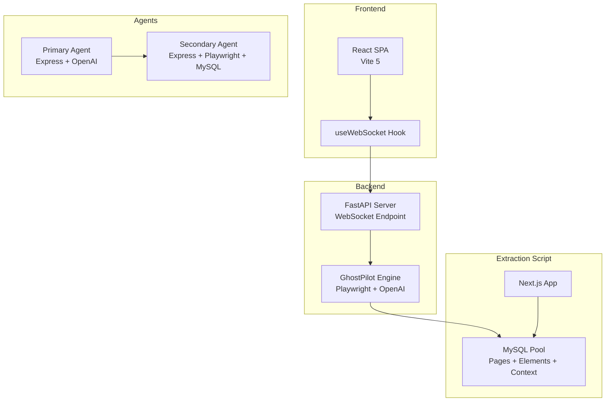
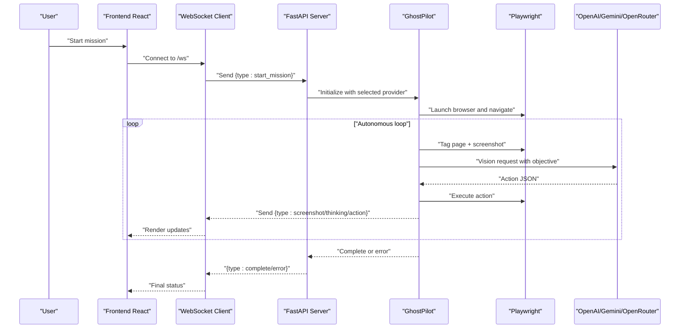
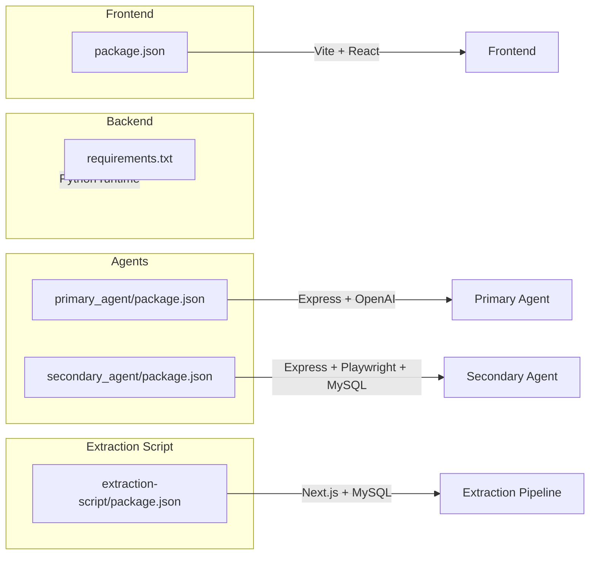

# Technology Stack

<cite>
**Referenced Files in This Document**
- [backend/requirements.txt](file://backend/requirements.txt)
- [backend/main.py](file://backend/main.py)
- [backend/ghost_pilot.py](file://backend/ghost_pilot.py)
- [backend/set_of_marks.js](file://backend/set_of_marks.js)
- [frontend/package.json](file://frontend/package.json)
- [frontend/vite.config.ts](file://frontend/vite.config.ts)
- [frontend/src/hooks/useWebSocket.ts](file://frontend/src/hooks/useWebSocket.ts)
- [extraction-script/package.json](file://extraction-script/package.json)
- [extraction-script/next.config.ts](file://extraction-script/next.config.ts)
- [extraction-script/tsconfig.json](file://extraction-script/tsconfig.json)
- [extraction-script/lib/db.ts](file://extraction-script/lib/db.ts)
- [primary_agent/package.json](file://primary_agent/package.json)
- [primary_agent/server.ts](file://primary_agent/server.ts)
- [primary_agent/tsconfig.json](file://primary_agent/tsconfig.json)
- [secondary_agent/package.json](file://secondary_agent/package.json)
- [secondary_agent/tsconfig.json](file://secondary_agent/tsconfig.json)
</cite>

## Table of Contents
1. [Introduction](#introduction)
2. [Project Structure](#project-structure)
3. [Core Components](#core-components)
4. [Architecture Overview](#architecture-overview)
5. [Detailed Component Analysis](#detailed-component-analysis)
6. [Dependency Analysis](#dependency-analysis)
7. [Performance Considerations](#performance-considerations)
8. [Security Considerations](#security-considerations)
9. [Deployment Considerations](#deployment-considerations)
10. [Maintenance and Updates](#maintenance-and-updates)
11. [Conclusion](#conclusion)

## Introduction
This document provides a comprehensive technology stack overview for the Ghost Pilot project. It covers the backend (FastAPI, Playwright, OpenAI SDK, Python 3.10+), frontend (React 18, Vite 5, TailwindCSS 3, Framer Motion), agent system (TypeScript, Express), and database layer (MySQL). It also explains version requirements, compatibility considerations, dependency management strategies, build configurations, security implications, and maintenance guidance.

## Project Structure
The project is organized into distinct layers:
- Backend service: FastAPI WebSocket server orchestrating autonomous browser automation
- Frontend: React 18 SPA with Vite 5 build tooling and TailwindCSS 3 styling
- Extraction script: Next.js application for page and element data extraction and persistence
- Agent system: TypeScript-based Express servers for primary and secondary agents
- Database: MySQL for persisting scraped pages, elements, and context

**Diagram sources**
- [frontend/vite.config.ts](file://frontend/vite.config.ts#L1-L23)
- [backend/main.py](file://backend/main.py#L1-L157)
- [backend/ghost_pilot.py](file://backend/ghost_pilot.py#L1-L802)
- [extraction-script/lib/db.ts](file://extraction-script/lib/db.ts#L1-L105)
- [primary_agent/server.ts](file://primary_agent/server.ts#L1-L203)

**Section sources**
- [frontend/package.json](file://frontend/package.json#L1-L34)
- [backend/requirements.txt](file://backend/requirements.txt#L1-L8)
- [extraction-script/package.json](file://extraction-script/package.json#L1-L45)
- [primary_agent/package.json](file://primary_agent/package.json#L1-L25)
- [secondary_agent/package.json](file://secondary_agent/package.json#L1-L27)

## Core Components
- Backend WebSocket server: FastAPI with WebSocket endpoint for real-time communication with the frontend, orchestrating autonomous browser missions via GhostPilot.
- GhostPilot engine: Autonomous navigation using Playwright for browser automation and OpenAI SDK for GPT-4o Vision decisions, with support for multiple LLM providers.
- Frontend React SPA: Real-time visualization of screenshots, cursor movements, and agent thinking states via WebSocket.
- Extraction script (Next.js): Page and element data extraction pipeline with MySQL persistence.
- Agent system: Primary agent (instruction processing) and secondary agent (execution and context management) using Express and TypeScript.
- Database: MySQL schema for scraped_pages, elements, and context tables.

**Section sources**
- [backend/main.py](file://backend/main.py#L1-L157)
- [backend/ghost_pilot.py](file://backend/ghost_pilot.py#L1-L802)
- [frontend/src/hooks/useWebSocket.ts](file://frontend/src/hooks/useWebSocket.ts#L1-L93)
- [extraction-script/lib/db.ts](file://extraction-script/lib/db.ts#L1-L105)
- [primary_agent/server.ts](file://primary_agent/server.ts#L1-L203)

## Architecture Overview
The system architecture integrates a WebSocket-driven backend with a React frontend, an extraction pipeline, and an agent orchestration layer. The backend initializes a browser, injects Set-of-Marks tags, captures screenshots, queries the LLM for actions, executes them, and streams feedback to the frontend.

**Diagram sources**
- [backend/main.py](file://backend/main.py#L36-L152)
- [backend/ghost_pilot.py](file://backend/ghost_pilot.py#L623-L767)
- [frontend/src/hooks/useWebSocket.ts](file://frontend/src/hooks/useWebSocket.ts#L15-L91)

## Detailed Component Analysis

### Backend Technology Stack
- FastAPI: Provides WebSocket endpoint and health checks; supports CORS for frontend integration.
- Playwright: Asynchronous browser automation for page tagging, navigation, and action execution.
- OpenAI SDK: Vision model integration for autonomous decision-making; supports multiple providers (OpenAI, LM Studio, Gemini, OpenRouter, custom).
- Python 3.10+: Runtime environment; dependencies pinned via requirements.txt.

Key implementation patterns:
- WebSocket handshake and message routing
- Provider-agnostic LLM client initialization
- Rate-limit enforcement and retry/backoff logic
- Captcha detection and manual override handling
- Cursor movement and screenshot streaming to frontend

**Section sources**
- [backend/requirements.txt](file://backend/requirements.txt#L1-L8)
- [backend/main.py](file://backend/main.py#L1-L157)
- [backend/ghost_pilot.py](file://backend/ghost_pilot.py#L1-L802)
- [backend/set_of_marks.js](file://backend/set_of_marks.js)

### Frontend Technology Stack
- React 18: Component-based UI with concurrent features.
- Vite 5: Fast build tooling and dev server with hot module replacement.
- TailwindCSS 3: Utility-first styling framework.
- Framer Motion 10: Animation library for smooth UI transitions.
- Web Speech API: Voice input capabilities (referenced in component structure).

Build and configuration highlights:
- Vite proxy configuration for WebSocket traffic to backend
- TypeScript strict mode and bundler resolution
- React JSX transform and plugin setup

**Section sources**
- [frontend/package.json](file://frontend/package.json#L1-L34)
- [frontend/vite.config.ts](file://frontend/vite.config.ts#L1-L23)
- [frontend/tsconfig.json](file://frontend/tsconfig.json#L1-L33)

### Agent System (TypeScript + Node.js)
- Primary Agent: Express server exposing /process, /health, /clear-history, and /history endpoints; orchestrates instruction generation and optional auto-execution via secondary agent.
- Secondary Agent: Express server with Playwright and MySQL integration for execution and context management.
- Shared types: Consistent typing across agents and shared domain models.

**Section sources**
- [primary_agent/package.json](file://primary_agent/package.json#L1-L25)
- [primary_agent/server.ts](file://primary_agent/server.ts#L1-L203)
- [primary_agent/tsconfig.json](file://primary_agent/tsconfig.json#L1-L20)
- [secondary_agent/package.json](file://secondary_agent/package.json#L1-L27)
- [secondary_agent/tsconfig.json](file://secondary_agent/tsconfig.json#L1-L20)

### Database Layer (MySQL)
- Schema includes:
  - scraped_pages: URL, title, timestamps
  - elements: page_url foreign key, JSON content and metadata, llm_context
  - context: name, JSON data, timestamps
- Connection pooling with configurable limits and queue behavior
- Schema initialization and migration safety for llm_context column

**Section sources**
- [extraction-script/lib/db.ts](file://extraction-script/lib/db.ts#L1-L105)

### Extraction Script (Next.js)
- Next.js 16 with TypeScript configuration
- Dependencies include Playwright, OpenAI, React 19, Framer Motion, Tailwind packages
- Tailwind v4 dev dependency and ESLint 9 configuration

**Section sources**
- [extraction-script/package.json](file://extraction-script/package.json#L1-L45)
- [extraction-script/next.config.ts](file://extraction-script/next.config.ts#L1-L8)
- [extraction-script/tsconfig.json](file://extraction-script/tsconfig.json#L1-L35)

## Dependency Analysis
The project maintains separate dependency manifests per layer, enabling independent updates and isolation:
- Backend: FastAPI, Uvicorn, Playwright, OpenAI, websockets, python-dotenv, Pillow
- Frontend: React 18, Vite 5, TailwindCSS 3, Framer Motion, TypeScript toolchain
- Agents: Express, OpenAI, CORS, TSX for development
- Extraction script: Next.js, Playwright, OpenAI, MySQL2, React 19, Tailwind v4

**Diagram sources**
- [backend/requirements.txt](file://backend/requirements.txt#L1-L8)
- [frontend/package.json](file://frontend/package.json#L1-L34)
- [primary_agent/package.json](file://primary_agent/package.json#L1-L25)
- [secondary_agent/package.json](file://secondary_agent/package.json#L1-L27)
- [extraction-script/package.json](file://extraction-script/package.json#L1-L45)

**Section sources**
- [backend/requirements.txt](file://backend/requirements.txt#L1-L8)
- [frontend/package.json](file://frontend/package.json#L1-L34)
- [primary_agent/package.json](file://primary_agent/package.json#L1-L25)
- [secondary_agent/package.json](file://secondary_agent/package.json#L1-L27)
- [extraction-script/package.json](file://extraction-script/package.json#L1-L45)

## Performance Considerations
- Browser automation overhead: Playwright launches Chromium; headless vs. headed mode impacts resource usage. Consider headless for server deployments.
- Vision model throughput: Rate limiting and exponential/proportional backoff reduce API penalties; tune provider selection for cost/performance balance.
- WebSocket streaming: Screenshot transmission should be optimized; consider compression or lower resolution for bandwidth-constrained environments.
- Database I/O: Connection pooling and foreign key constraints ensure data integrity; batch writes for bulk extraction scenarios.
- Frontend rendering: Framer Motion animations enhance UX; disable or throttle during intensive automation sessions.

[No sources needed since this section provides general guidance]

## Security Considerations
- CORS policy: Broad allow-all origins in development; restrict origins in production deployments.
- API keys: Environment variables for LLM providers; avoid embedding secrets in client-side code.
- WebSocket exposure: Ensure reverse proxy or firewall controls for /ws endpoint.
- Database credentials: Root/admin defaults in schema initialization; replace with least-privilege accounts in production.
- Agent intercommunication: Primary agent calls secondary agent over localhost; secure internal networks if deployed externally.

**Section sources**
- [backend/main.py](file://backend/main.py#L19-L26)
- [extraction-script/lib/db.ts](file://extraction-script/lib/db.ts#L5-L13)

## Deployment Considerations
- Backend: Run with Uvicorn; expose /ws securely behind TLS; configure environment variables for provider endpoints and keys.
- Frontend: Build with Vite; serve static assets behind a reverse proxy; enable WebSocket passthrough.
- Extraction script: Deploy Next.js app with proper Node.js runtime; configure database connectivity.
- Agents: Run primary and secondary agents on separate ports; ensure network accessibility and health endpoints.
- Database: Provision MySQL with appropriate storage and backup policies; monitor connection pool saturation.

[No sources needed since this section provides general guidance]

## Maintenance and Updates
- Backend:
  - Pin versions in requirements.txt; regularly audit FastAPI, Playwright, OpenAI SDK for security patches.
  - Test provider switching and rate-limit behavior after updates.
- Frontend:
  - Align Vite and React versions; update Tailwind and Framer Motion with caution; lint and type-check before merging.
- Agents:
  - Keep Express and OpenAI versions aligned; validate inter-agent contract changes.
- Extraction script:
  - Upgrade Next.js and related tooling; ensure Tailwind v4 compatibility and ESLint configuration.
- Database:
  - Monitor schema migrations; maintain backups; review foreign key constraints after schema changes.

[No sources needed since this section provides general guidance]

## Conclusion
The Ghost Pilot project combines a robust backend (FastAPI + Playwright + OpenAI), a responsive frontend (React + Vite + Tailwind + Framer Motion), a modular agent system (Express + TypeScript), and a MySQL-backed extraction pipeline. The architecture emphasizes real-time communication, autonomous browser control, and scalable agent orchestration. Adhering to the outlined security, deployment, and maintenance practices will ensure reliability and maintainability as the system evolves.