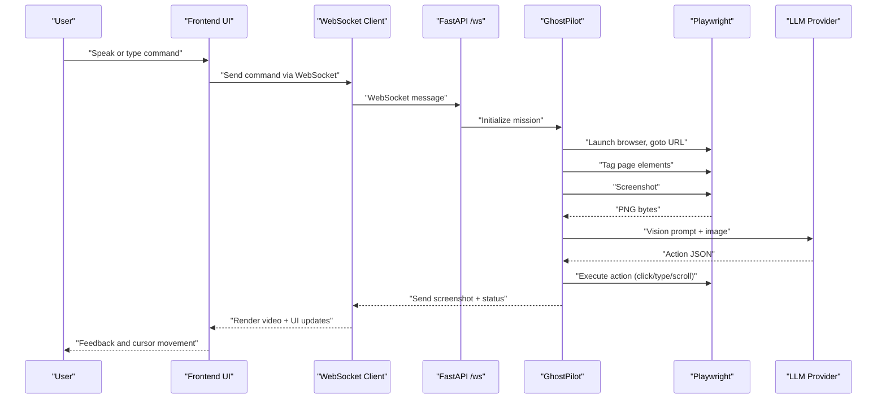
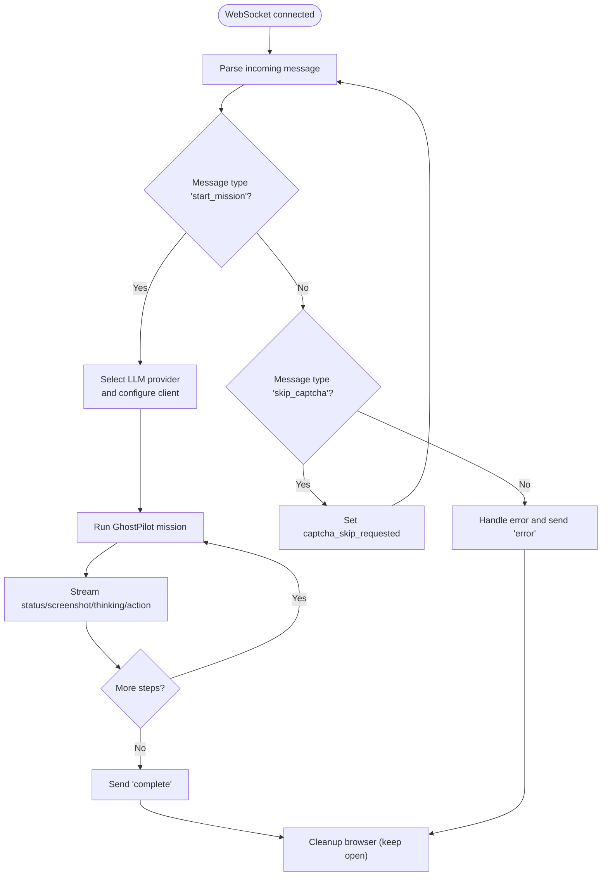
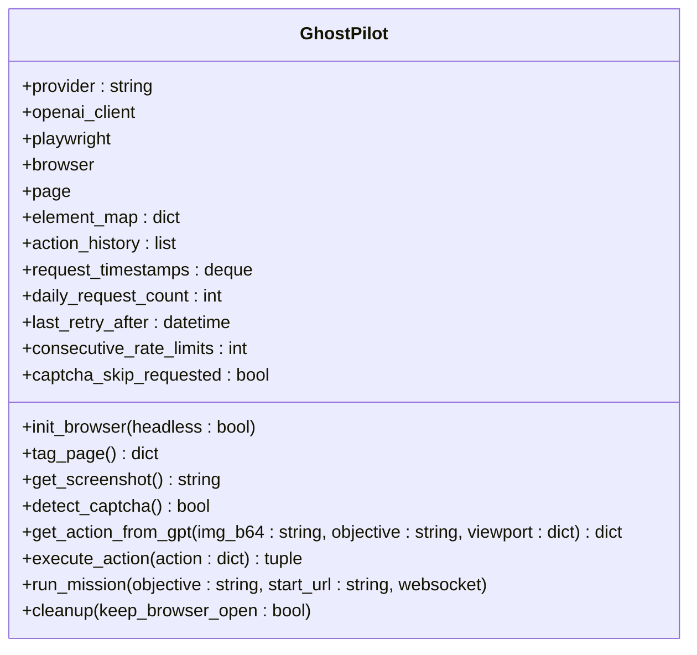
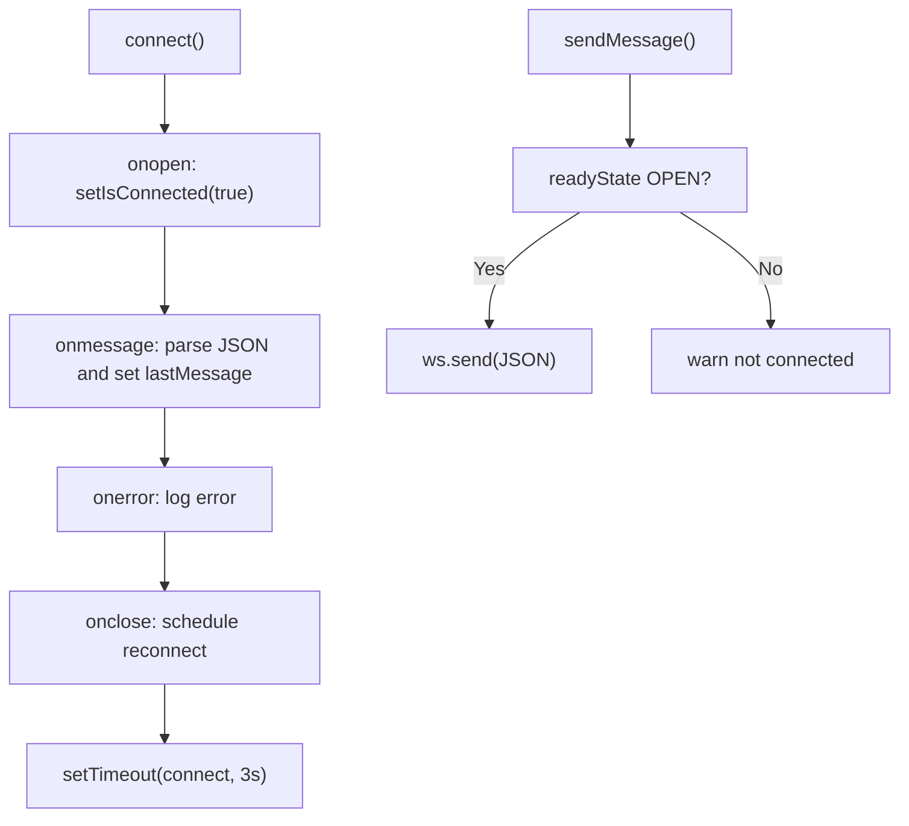
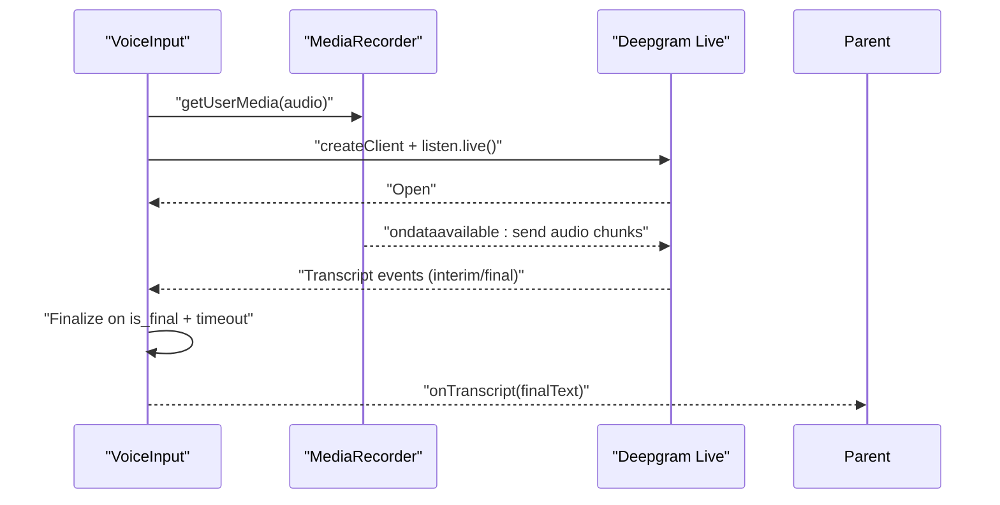
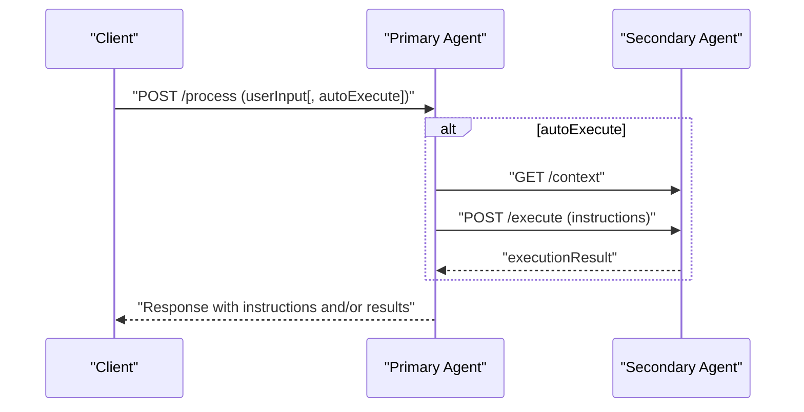
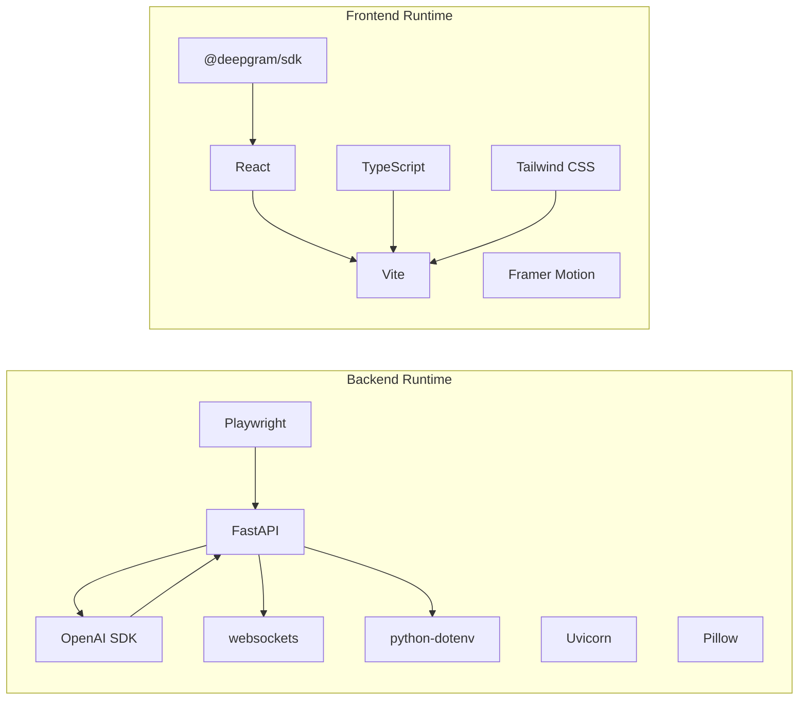

# Testing and Debugging

<cite>
**Referenced Files in This Document**
- [INSTALLATION.md](file://frontend/INSTALLATION.md)
- [STATUS.md](file://frontend/STATUS.md)
- [AGENTS.md](file://AGENTS.md)
- [README.md (Primary Agent)](file://primary_agent/README.md)
- [README.md (Secondary Agent)](file://secondary_agent/README.md)
- [main.py](file://backend/main.py)
- [ghost_pilot.py](file://backend/ghost_pilot.py)
- [requirements.txt](file://backend/requirements.txt)
- [package.json](file://frontend/package.json)
- [useWebSocket.ts](file://frontend/src/hooks/useWebSocket.ts)
- [VoiceInput.tsx](file://frontend/src/components/VoiceInput.tsx)
- [VideoStream.tsx](file://frontend/src/components/VideoStream.tsx)
</cite>

## Table of Contents
1. [Introduction](#introduction)
2. [Project Structure](#project-structure)
3. [Core Components](#core-components)
4. [Architecture Overview](#architecture-overview)
5. [Detailed Component Analysis](#detailed-component-analysis)
6. [Dependency Analysis](#dependency-analysis)
7. [Performance Considerations](#performance-considerations)
8. [Troubleshooting Guide](#troubleshooting-guide)
9. [Conclusion](#conclusion)
10. [Appendices](#appendices)

## Introduction
This document provides comprehensive testing and debugging guidance for the Ghost Pilot system. It covers unit testing strategies for React components, Python backend services, and agent modules; integration testing for end-to-end workflows involving WebSocket communication, browser automation, and AI decision-making; performance testing methodologies; debugging techniques for common issues; logging and monitoring strategies; troubleshooting procedures aligned with the provided installation and status documents; optimization tips; and suggestions for automated testing pipelines.

## Project Structure
The Ghost Pilot system comprises:
- Frontend (React + Vite): WebSocket client, voice input, and UI components.
- Backend (FastAPI + Uvicorn): WebSocket server orchestrating autonomous browser missions.
- Agent subsystems (standalone servers): Primary and Secondary agents for intent understanding and action execution respectively.

```mermaid
graph TB
subgraph "Frontend"
WS["useWebSocket hook<br/>WebSocket client"]
VI["VoiceInput component<br/>Deepgram + MediaRecorder"]
VS["VideoStream component<br/>Base64 to image"]
end
subgraph "Backend"
API["FastAPI main.py<br/>/ws endpoint"]
GP["GhostPilot engine<br/>ghost_pilot.py"]
end
subgraph "Agents"
PA["Primary Agent<br/>Port 3001"]
SA["Secondary Agent<br/>Port 3002"]
end
WS --> API
VI --> WS
VS --> WS
API --> GP
PA <- --> SA
```

**Diagram sources**
- [main.py](file://backend/main.py#L36-L157)
- [ghost_pilot.py](file://backend/ghost_pilot.py#L18-L800)
- [useWebSocket.ts](file://frontend/src/hooks/useWebSocket.ts#L15-L93)
- [VoiceInput.tsx](file://frontend/src/components/VoiceInput.tsx#L13-L321)
- [VideoStream.tsx](file://frontend/src/components/VideoStream.tsx#L8-L43)
- [README.md (Primary Agent)](file://primary_agent/README.md#L18-L42)
- [README.md (Secondary Agent)](file://secondary_agent/README.md#L18-L53)

**Section sources**
- [INSTALLATION.md](file://frontend/INSTALLATION.md#L1-L248)
- [STATUS.md](file://frontend/STATUS.md#L1-L215)
- [AGENTS.md](file://AGENTS.md#L1-L273)

## Core Components
- Backend WebSocket server: Accepts WebSocket connections, initializes the Ghost Pilot engine, and streams screenshots and status updates to the frontend.
- Ghost Pilot engine: Manages Playwright browser lifecycle, injects Set-of-Marks tags, captures screenshots, queries an LLM for actions, executes actions, and handles rate limits and captchas.
- Frontend WebSocket client: Establishes and maintains a WebSocket connection, parses messages, and updates UI state.
- Voice input pipeline: Uses Deepgram for live transcription and MediaRecorder for audio capture.
- Video stream display: Renders base64 screenshots as images.

**Section sources**
- [main.py](file://backend/main.py#L36-L157)
- [ghost_pilot.py](file://backend/ghost_pilot.py#L18-L800)
- [useWebSocket.ts](file://frontend/src/hooks/useWebSocket.ts#L15-L93)
- [VoiceInput.tsx](file://frontend/src/components/VoiceInput.tsx#L41-L171)
- [VideoStream.tsx](file://frontend/src/components/VideoStream.tsx#L8-L43)

## Architecture Overview
End-to-end workflow from user command to autonomous browser actions:



**Diagram sources**
- [main.py](file://backend/main.py#L36-L157)
- [ghost_pilot.py](file://backend/ghost_pilot.py#L623-L768)
- [useWebSocket.ts](file://frontend/src/hooks/useWebSocket.ts#L21-L58)
- [VoiceInput.tsx](file://frontend/src/components/VoiceInput.tsx#L67-L120)

## Detailed Component Analysis

### Backend WebSocket Server
- Responsibilities: Accept WebSocket connections, parse messages, initialize Ghost Pilot with provider configuration, run missions, and stream status updates.
- Key behaviors: Provider selection, mission lifecycle, error handling, and graceful cleanup.



**Diagram sources**
- [main.py](file://backend/main.py#L36-L157)

**Section sources**
- [main.py](file://backend/main.py#L36-L157)

### Ghost Pilot Engine
- Responsibilities: Browser lifecycle, Set-of-Marks tagging, screenshot capture, LLM action parsing, action execution, rate-limit handling, and captcha detection/skip.
- Key behaviors: Provider abstraction, rate limiting enforcement, retry/backoff logic, action history to prevent loops, and robust error handling.



**Diagram sources**
- [ghost_pilot.py](file://backend/ghost_pilot.py#L18-L800)

**Section sources**
- [ghost_pilot.py](file://backend/ghost_pilot.py#L18-L800)

### Frontend WebSocket Hook
- Responsibilities: Manage WebSocket lifecycle, auto-reconnect, send/receive messages, and expose connection state to components.



**Diagram sources**
- [useWebSocket.ts](file://frontend/src/hooks/useWebSocket.ts#L21-L77)

**Section sources**
- [useWebSocket.ts](file://frontend/src/hooks/useWebSocket.ts#L15-L93)

### Voice Input Pipeline
- Responsibilities: Acquire microphone permission, stream audio to Deepgram, receive live transcriptions, and surface final transcripts to the UI.



**Diagram sources**
- [VoiceInput.tsx](file://frontend/src/components/VoiceInput.tsx#L41-L171)

**Section sources**
- [VoiceInput.tsx](file://frontend/src/components/VoiceInput.tsx#L13-L321)

### Video Stream Component
- Responsibilities: Render base64 screenshots as images or show a loading state.

**Section sources**
- [VideoStream.tsx](file://frontend/src/components/VideoStream.tsx#L8-L43)

### Agent Modules (Primary and Secondary)
- Primary Agent: Processes user input, optionally auto-executes instructions via Secondary Agent, and returns results.
- Secondary Agent: Executes instructions using browser automation and database utilities.



**Diagram sources**
- [AGENTS.md](file://AGENTS.md#L120-L200)
- [README.md (Primary Agent)](file://primary_agent/README.md#L18-L42)
- [README.md (Secondary Agent)](file://secondary_agent/README.md#L18-L53)

**Section sources**
- [AGENTS.md](file://AGENTS.md#L1-L273)
- [README.md (Primary Agent)](file://primary_agent/README.md#L1-L42)
- [README.md (Secondary Agent)](file://secondary_agent/README.md#L1-L53)

## Dependency Analysis
External dependencies and runtime integrations:
- Backend: FastAPI, Uvicorn, Playwright, OpenAI SDK, websockets, Pillow, python-dotenv.
- Frontend: React, Framer Motion, @deepgram/sdk, TypeScript toolchain, Tailwind CSS, Vite.



**Diagram sources**
- [requirements.txt](file://backend/requirements.txt#L1-L8)
- [package.json](file://frontend/package.json#L12-L32)

**Section sources**
- [requirements.txt](file://backend/requirements.txt#L1-L8)
- [package.json](file://frontend/package.json#L1-L34)

## Performance Considerations
- Throughput and latency:
  - Minimize screenshot frequency; batch UI updates.
  - Use headless mode in non-interactive tests to reduce overhead.
  - Tune Playwright viewport and rendering to balance fidelity vs speed.
- Resource utilization:
  - Limit concurrent missions; reuse browser instances when safe.
  - Monitor memory growth; implement periodic browser resets in long sessions.
- LLM rate limits:
  - Respect provider quotas; implement exponential/proportional backoff.
  - Batch prompts where feasible; avoid redundant queries.
- Frontend responsiveness:
  - Debounce transcription finalization; throttle WebSocket message processing.
  - Use lazy initialization for heavy components.

[No sources needed since this section provides general guidance]

## Troubleshooting Guide

### WebSocket Disconnections
Symptoms:
- Frontend shows “Disconnected” with auto-reconnect attempts.
- Backend logs “Client disconnected” or “WebSocket error”.

Remediation:
- Ensure backend runs on port 8000 and CORS allows frontend origin.
- Verify environment variables for LLM provider and keys.
- Check firewall/NAT and reverse proxy configurations if applicable.

**Section sources**
- [useWebSocket.ts](file://frontend/src/hooks/useWebSocket.ts#L43-L52)
- [main.py](file://backend/main.py#L138-L152)
- [INSTALLATION.md](file://frontend/INSTALLATION.md#L156-L177)

### Playwright Browser Problems
Symptoms:
- “Executable doesn't exist” or browser launch failures.
- Headless rendering issues or missing fonts.

Remediation:
- Install Chromium via Playwright installer in the backend directory.
- On CI or minimal systems, install system dependencies for headless rendering.
- Prefer explicit browser launch options for reproducibility.

**Section sources**
- [INSTALLATION.md](file://frontend/INSTALLATION.md#L166-L171)
- [ghost_pilot.py](file://backend/ghost_pilot.py#L140-L147)

### AI API Integration Failures
Symptoms:
- Rate limit errors, quota exceeded, or invalid API key.
- Parsing failures due to malformed LLM responses.

Remediation:
- Confirm API keys and base URLs for selected provider.
- Implement retry/backoff with jitter; honor Retry-After headers.
- Normalize LLM responses to valid JSON; log raw responses for debugging.

**Section sources**
- [ghost_pilot.py](file://backend/ghost_pilot.py#L181-L231)
- [ghost_pilot.py](file://backend/ghost_pilot.py#L514-L561)
- [INSTALLATION.md](file://frontend/INSTALLATION.md#L162-L164)

### Captcha Handling
Symptoms:
- Visible CAPTCHA challenge blocks automation.

Remediation:
- Allow manual solving; use the “skip captcha” mechanism to resume.
- Implement periodic checks and timeouts to avoid indefinite waits.

**Section sources**
- [ghost_pilot.py](file://backend/ghost_pilot.py#L659-L706)

### Frontend Voice Input Issues
Symptoms:
- Microphone permission denied or transcription not working.
- Missing Deepgram API key.

Remediation:
- Ensure HTTPS or localhost for microphone access.
- Configure VITE_DEEPGRAM_API_KEY in the frontend environment.
- Use supported browsers for Web Speech API.

**Section sources**
- [VoiceInput.tsx](file://frontend/src/components/VoiceInput.tsx#L42-L130)
- [INSTALLATION.md](file://frontend/INSTALLATION.md#L172-L176)

### Agent Connectivity and Execution
Symptoms:
- Primary Agent cannot reach Secondary Agent or vice versa.
- Execution results missing or inconsistent.

Remediation:
- Verify agent ports and SECONDARY_AGENT_URL configuration.
- Confirm database and browser automation prerequisites for Secondary Agent.

**Section sources**
- [AGENTS.md](file://AGENTS.md#L248-L273)
- [README.md (Primary Agent)](file://primary_agent/README.md#L21-L36)
- [README.md (Secondary Agent)](file://secondary_agent/README.md#L21-L40)

## Conclusion
A robust testing and debugging strategy for Ghost Pilot should combine unit tests for React components and agent endpoints, integration tests for WebSocket and browser automation flows, and performance tests under realistic loads. Logging and monitoring should capture provider rate limits, browser lifecycle events, and frontend connectivity. Proactive troubleshooting aligned with the provided installation and status documents ensures quick recovery from common pitfalls.

[No sources needed since this section summarizes without analyzing specific files]

## Appendices

### Unit Testing Strategies

- React Components
  - Use a testing library to mock WebSocket behavior and Deepgram client.
  - Test VoiceInput state transitions (listening, final transcript) and error paths.
  - Mock MediaRecorder and microphone access for deterministic tests.

- Backend Services
  - Mock GhostPilot methods to isolate WebSocket message handling.
  - Validate provider configuration and error propagation.

- Agent Modules
  - Mock external services (database, browser automation) to test intent parsing and instruction execution.
  - Validate health endpoints and request/response schemas.

**Section sources**
- [useWebSocket.ts](file://frontend/src/hooks/useWebSocket.ts#L15-L93)
- [VoiceInput.tsx](file://frontend/src/components/VoiceInput.tsx#L41-L171)
- [ghost_pilot.py](file://backend/ghost_pilot.py#L18-L800)
- [README.md (Primary Agent)](file://primary_agent/README.md#L18-L42)
- [README.md (Secondary Agent)](file://secondary_agent/README.md#L18-L53)

### Integration Testing Approaches

- End-to-End Workflows
  - Simulate a full mission: start WebSocket, send “start_mission”, receive screenshots and status, and validate action execution.
  - Inject a controlled page with known elements to verify Set-of-Marks tagging and click targeting.

- WebSocket Communication
  - Verify message types and payload structure; test reconnection logic and error scenarios.

- Browser Automation
  - Use headless mode for reproducible tests; assert navigation, element tagging, and action outcomes.

- AI Decision Making
  - Provide deterministic prompts and known screenshots to assert expected action JSON.

**Section sources**
- [main.py](file://backend/main.py#L36-L157)
- [ghost_pilot.py](file://backend/ghost_pilot.py#L623-L768)
- [VideoStream.tsx](file://frontend/src/components/VideoStream.tsx#L8-L43)

### Performance Testing Methodologies

- Responsiveness
  - Measure time-to-first-action and average per-step latency across varied page complexity.

- Throughput
  - Run concurrent missions and record completion rates; monitor backend CPU and memory.

- Resource Utilization
  - Track Playwright process memory and CPU; implement periodic browser resets.

- Provider Saturation
  - Gradually increase request rate to identify provider throttling and implement adaptive backoff.

**Section sources**
- [ghost_pilot.py](file://backend/ghost_pilot.py#L181-L231)
- [ghost_pilot.py](file://backend/ghost_pilot.py#L514-L561)

### Logging, Error Tracking, and Monitoring

- Logging
  - Backend: Structured logs for mission start, step boundaries, rate limit events, and errors.
  - Frontend: Client-side logs for WebSocket lifecycle and transcription errors.

- Error Tracking
  - Capture unhandled exceptions and report to an error tracking service.
  - Include contextual metadata: mission ID, step number, provider, and environment.

- Monitoring
  - Track key metrics: mission success rate, average step duration, screenshot sizes, and provider quotas.

**Section sources**
- [main.py](file://backend/main.py#L42-L152)
- [ghost_pilot.py](file://backend/ghost_pilot.py#L300-L562)
- [useWebSocket.ts](file://frontend/src/hooks/useWebSocket.ts#L39-L52)

### Automated Testing Pipelines

- Continuous Integration
  - Frontend: Lint, type-check, and snapshot tests.
  - Backend: Unit tests for WebSocket handlers and provider logic.
  - Agents: Endpoint tests and mocked browser/database tests.

- Quality Assurance
  - Nightly integration tests against a local browser and a sandboxed LLM endpoint.
  - Smoke tests validating end-to-end mission flow.

**Section sources**
- [package.json](file://frontend/package.json#L6-L11)
- [requirements.txt](file://backend/requirements.txt#L1-L8)